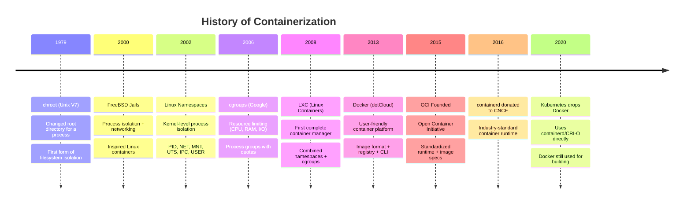
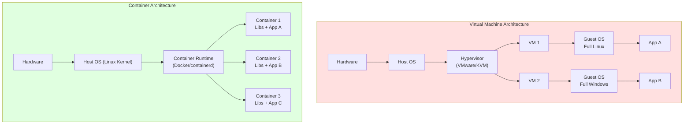

# File 1: What Is Containerization?

**Topic:** VMs vs Containers, history (chroot -> cgroups -> namespaces -> Docker), OCI standards, container vs image fundamentals.

**WHY THIS MATTERS:**
Before you type a single `docker run`, you need to understand WHY containers exist. They solve a 30-year-old problem — "it works on my machine" — by packaging an app with its ENTIRE runtime environment. Understanding the journey from bare metal to VMs to containers will make every Docker concept click instantly.

---

## Story: Indian Railway Compartment

Think of Indian Railways. A TRAIN ENGINE (Linux kernel) pulls many COMPARTMENTS (containers). Each compartment has its own seats, passengers, pantry, and toilet — fully isolated. But they ALL share the same engine and track.

Compare this with SEPARATE TRAINS (Virtual Machines). Each train has its OWN engine, its own driver, its own fuel tank. Way more resources consumed, slower to start, heavier to run.

A container is like a compartment — lightweight, quick to attach/detach, and shares the kernel (engine). A VM is like a full separate train — independent but expensive.

The station master (Docker daemon) manages which compartments go where, the platform number (port mapping), and the reservation chart (image manifest).

---

## Example Block 1 — The Problem Containers Solve

### Section 1 — "It Works on My Machine"

**WHY:** This is the #1 problem in software deployment. Your app runs perfectly on your laptop but crashes on the server because of different OS versions, library versions, env variables, or file paths.

```
  Developer's Laptop          Production Server
  ┌──────────────────┐        ┌──────────────────┐
  │ Ubuntu 22.04     │        │ CentOS 7         │
  │ Node.js 20.11    │   !=   │ Node.js 16.3     │
  │ OpenSSL 3.0      │        │ OpenSSL 1.1      │
  │ libpng 1.6.39    │        │ libpng 1.2.50    │
  │ /home/dev/app    │        │ /opt/deploy/app  │
  └──────────────────┘        └──────────────────┘

  Result: "It works on my machine!" ... but crashes in prod.
```

### Section 2 — The Container Solution

**WHY:** Containers bundle the app + ALL its dependencies into a single portable unit. Same binary runs everywhere.

```
  Container packages EVERYTHING:
  ┌──────────────────────────────────┐
  │  Your Application Code           │
  │  + Node.js 20.11                 │
  │  + All npm dependencies          │
  │  + OS libraries (Ubuntu 22.04)   │
  │  + Config files                  │
  │  + Environment variables         │
  └──────────────────────────────────┘
           │
           ▼  Runs IDENTICALLY on:
  ┌────────┬────────┬────────┐
  │ Laptop │ Server │ Cloud  │
  │ macOS  │ CentOS │  AWS   │
  └────────┴────────┴────────┘
```

---

## Example Block 2 — The Evolution: Bare Metal → VMs → Containers

### Section 3 — Era 1: Bare Metal (1960s–1990s)

**WHY:** Understanding the starting point shows why each evolution was necessary.

```
  One physical server = One application

  ┌───────────────────────────────┐
  │        Application            │
  ├───────────────────────────────┤
  │     Operating System          │
  ├───────────────────────────────┤
  │       Hardware (CPU,          │
  │       RAM, Disk)              │
  └───────────────────────────────┘

  PROBLEMS:
  • Massive hardware waste (5-15% CPU utilization)
  • One app crash = entire server down
  • Scaling = buying new physical servers
  • Provisioning takes weeks/months
  • Like booking an entire train for one passenger
```

### Section 4 — Era 2: Virtual Machines (2000s)

**WHY:** VMs solved the hardware waste problem by running multiple OS instances on one physical machine using a hypervisor (VMware, VirtualBox, KVM).

```
  One physical server = Multiple VMs

  ┌──────────┐  ┌──────────┐  ┌──────────┐
  │  App A   │  │  App B   │  │  App C   │
  ├──────────┤  ├──────────┤  ├──────────┤
  │ Guest OS │  │ Guest OS │  │ Guest OS │
  │ (Ubuntu) │  │ (CentOS) │  │(Windows) │
  └──────────┘  └──────────┘  └──────────┘
  ┌─────────────────────────────────────────┐
  │          Hypervisor (VMware/KVM)        │
  ├─────────────────────────────────────────┤
  │            Host OS (Linux)              │
  ├─────────────────────────────────────────┤
  │              Hardware                   │
  └─────────────────────────────────────────┘

  PROS: Better utilization, isolation, different OS per VM
  CONS: Each VM = full OS (GBs of RAM), slow boot (minutes),
        heavy on resources. Like running separate trains.
```

### Section 5 — Era 3: Containers (2013–present)

**WHY:** Containers share the host kernel, eliminating the overhead of a full guest OS. Millisecond startup, MB size.

```
  One physical server = Many containers sharing one kernel

  ┌──────────┐  ┌──────────┐  ┌──────────┐
  │  App A   │  │  App B   │  │  App C   │
  ├──────────┤  ├──────────┤  ├──────────┤
  │  Libs A  │  │  Libs B  │  │  Libs C  │
  └──────────┘  └──────────┘  └──────────┘
  ┌─────────────────────────────────────────┐
  │        Container Runtime (Docker)       │
  ├─────────────────────────────────────────┤
  │         Host OS (Linux Kernel)          │
  ├─────────────────────────────────────────┤
  │              Hardware                   │
  └─────────────────────────────────────────┘

  PROS: Lightweight (MBs), fast boot (ms), high density
  CONS: Shared kernel (less isolation than VMs),
        Linux-only natively (needs VM on macOS/Windows)
```

---

## Example Block 3 — The History Timeline

### Section 6 — From chroot to Docker

**WHY:** Docker didn't invent containerization. It made it USABLE. Knowing the building blocks helps you understand what Docker actually does under the hood.



### Section 7 — The Linux Building Blocks

**WHY:** Containers are NOT a Linux feature — they are a COMBINATION of multiple kernel features working together.

**NAMESPACES — Isolation (who can you SEE?)**

| Namespace | Isolates |
|-----------|----------|
| PID       | Process IDs (container sees PID 1) |
| NET       | Network stack (own IP, ports) |
| MNT       | Mount points (own filesystem) |
| UTS       | Hostname (own hostname) |
| IPC       | Inter-process communication |
| USER      | User/group IDs (root in container) |
| CGROUP    | cgroup visibility |

**CGROUPS — Resource Limits (how much can you USE?)**

| Resource  | Control |
|-----------|---------|
| cpu       | CPU time allocation |
| memory    | RAM limit (OOM kill if exceeded) |
| blkio     | Disk I/O bandwidth |
| pids      | Max number of processes |
| cpuset    | Pin to specific CPU cores |

**UNION FILESYSTEM — Layered storage (how is data STORED?)**
- OverlayFS, AUFS, btrfs, devicemapper
- Layers stacked on top of each other
- Copy-on-write for efficiency

---

## Example Block 4 — VMs vs Containers Deep Comparison

### Section 8 — Side-by-Side Comparison

**WHY:** Knowing when to use VMs vs containers is a real interview and architecture question. They are NOT mutually exclusive — many production setups use BOTH.



**Detailed Comparison Table:**

| Feature         | Virtual Machine  | Container        |
|-----------------|------------------|------------------|
| Boot time       | Minutes          | Milliseconds     |
| Size            | GBs (full OS)    | MBs (libs only)  |
| Performance     | ~5-10% overhead  | Near native      |
| Isolation       | Strong (own OS)  | Process-level    |
| OS support      | Any OS           | Host kernel only |
| Density         | ~10-20 per host  | ~100s per host   |
| Portability     | VM image (large) | Image (small)    |
| Orchestration   | vSphere, etc.    | Kubernetes       |
| Security        | Hardware-level   | Kernel-level     |
| Use case        | Full OS needed   | Microservices    |

**Railway analogy:**
- VM = Separate train (own engine, own track, own driver)
- Container = Compartment on shared train (shared engine)

### Section 9 — When to Use What

**WHY:** In real projects you'll face this decision. The answer is often "both" — containers run inside VMs in most cloud deployments (AWS EC2 + Docker, for example).

**USE VMs WHEN:**
- You need a different kernel (Linux host + Windows guest)
- Security requires hardware-level isolation (multi-tenant)
- Running legacy apps that need full OS environment
- Compliance requires VM-level separation

**USE CONTAINERS WHEN:**
- Microservices architecture
- CI/CD pipelines (fast build/test/deploy)
- Same app needs to run dev/staging/prod identically
- High-density deployments (many services per host)
- Rapid scaling (Kubernetes autoscaling)

**USE BOTH WHEN (most common in production):**
- Cloud VMs running containerized workloads
- Example: AWS EKS = EC2 VMs running Kubernetes pods

---

## Example Block 5 — OCI Standards

### Section 10 — Open Container Initiative (OCI)

**WHY:** OCI ensures containers are not locked to Docker. Any OCI-compliant runtime can run any OCI-compliant image. This is like how any ISI-marked electrical appliance works in any ISI-compliant socket across India.

**Open Container Initiative (OCI) — Founded 2015**

Think of it like BIS (Bureau of Indian Standards) for containers. Just as BIS ensures any plug fits any socket, OCI ensures any container runs on any compliant runtime.

**THREE SPECIFICATIONS:**

1. **Runtime Spec (runtime-spec)**
   - HOW to run a container
   - Filesystem bundle format
   - Lifecycle operations (create, start, kill)
   - Reference implementation: runc

2. **Image Spec (image-spec)**
   - HOW to package a container image
   - Layer format (tar + gzip)
   - Image manifest (JSON)
   - Content-addressable by SHA256 digest

3. **Distribution Spec (distribution-spec)**
   - HOW to push/pull images from registries
   - Registry HTTP API
   - Docker Hub, GHCR, ECR all implement this

### Section 11 — OCI-Compliant Runtimes

**WHY:** Docker is just ONE container tool. Knowing alternatives shows you the ecosystem and helps in Kubernetes contexts where Docker may not be used.

| Runtime         | Description |
|-----------------|-------------|
| runc            | Reference OCI runtime (used by Docker & containerd) |
| crun            | Written in C, faster than runc |
| youki           | Written in Rust, performance focus |
| gVisor (runsc)  | Google's sandboxed runtime |
| Kata Containers | Lightweight VMs as containers |
| Firecracker     | AWS Lambda's microVM runtime |

**KEY POINT:** Because of OCI standards, the same Docker image can run on runc, crun, gVisor, or Kata without ANY changes. Standards enable interoperability.

---

## Example Block 6 — Container vs Image

### Section 12 — Image = Blueprint, Container = Instance

**WHY:** This distinction trips up beginners constantly. An image is like a class; a container is like an object instantiated from that class.

```
  IMAGE (Blueprint / Recipe / Class)
  ┌──────────────────────────────────────┐
  │ • Read-only template                 │
  │ • Layered filesystem (OverlayFS)     │
  │ • Contains: OS libs, runtime, app    │
  │ • Stored in registries (Docker Hub)  │
  │ • Identified by name:tag or digest   │
  │ • Can create MANY containers         │
  │ • Like a recipe card — doesn't cook  │
  └──────────────────────────────────────┘
              │
              │ docker run
              ▼
  CONTAINER (Running Instance / Object)
  ┌──────────────────────────────────────┐
  │ • Running (or stopped) process       │
  │ • Writable layer on top of image     │
  │ • Has its own PID, network, mounts   │
  │ • Isolated from other containers     │
  │ • Can be started, stopped, deleted   │
  │ • Like a dish being cooked from      │
  │   the recipe — unique each time      │
  └──────────────────────────────────────┘

  One Image → Many Containers (like one recipe → many dishes)
```

**COMMANDS:**

```bash
docker images       # List all images (blueprints)
docker ps           # List running containers (instances)
docker ps -a        # List ALL containers (running + stopped)
```

### Section 13 — Quick Docker Commands Preview

**WHY:** Even in a conceptual file, seeing real commands grounds the theory in practice.

**Verifying Docker Installation:**

```bash
docker version
# SYNTAX:  docker version [OPTIONS]
# FLAGS:   --format '{{.Server.Version}}'  → just server version
```

Expected output:
```
Client:
 Version:           24.0.7
 API version:       1.43
 Go version:        go1.21.3
 OS/Arch:           darwin/arm64

Server:
 Engine:
  Version:          24.0.7
  API version:      1.43
  Go version:       go1.21.3
  OS/Arch:          linux/amd64
```

> **NOTE:** On macOS/Windows, the CLIENT runs natively but the SERVER runs inside a Linux VM (Docker Desktop's VM).

**System-wide Information:**

```bash
docker info
# SYNTAX:  docker info [OPTIONS]
# FLAGS:   --format '{{.ServerVersion}}'
```

Shows:
- Number of containers (running/paused/stopped)
- Number of images
- Storage driver (overlay2)
- Kernel version
- Operating system
- CPU and memory available to Docker
- Registry configured (default: docker.io)

**Running Your First Container:**

```bash
docker run hello-world
# SYNTAX:  docker run [OPTIONS] IMAGE [COMMAND] [ARG...]
```

**WHAT HAPPENS:**
1. Docker CLI sends request to Docker daemon
2. Daemon checks local image cache → not found
3. Daemon pulls "hello-world:latest" from Docker Hub
4. Daemon creates a container from the image
5. Daemon starts the container
6. Container prints a message and exits
7. Container remains in "exited" state

Expected output:
```
Unable to find image 'hello-world:latest' locally
latest: Pulling from library/hello-world
...
Hello from Docker!
This message shows that your installation appears to be
working correctly.
...
```

---

## Example Block 7 — Key Terminology Glossary

### Section 14 — Essential Terms

**WHY:** These terms appear everywhere in Docker docs, tutorials, job interviews. Nail them now.

| Term               | Meaning |
|--------------------|---------|
| Image              | Read-only template with layers |
| Container          | Running instance of an image |
| Dockerfile         | Script to build an image |
| Registry           | Storage for images (Docker Hub) |
| Repository         | Collection of image tags |
| Tag                | Version label (e.g., "latest") |
| Layer              | One step in an image build |
| Volume             | Persistent storage for containers |
| Network            | Communication channel for containers |
| Compose            | Multi-container orchestration |
| Orchestration      | Managing containers at scale (Kubernetes, Docker Swarm) |
| Daemon (dockerd)   | Background service managing containers |
| CLI (docker)       | Command-line client |
| OCI                | Open Container Initiative (standards body) |

---

## Key Takeaways

1. **CONTAINERS** solve the "it works on my machine" problem by packaging app + dependencies in a portable unit.

2. **EVOLUTION:** Bare Metal → VMs (own OS) → Containers (shared kernel). Each step traded isolation for speed and efficiency.

3. **LINUX FOUNDATIONS:** Containers are built on namespaces (isolation), cgroups (resource limits), and union filesystems (layered storage).

4. **DOCKER DID NOT INVENT** containers — it made them accessible with great UX (CLI, Dockerfile, Hub).

5. **OCI STANDARDS** ensure portability. Any OCI image runs on any OCI runtime. No vendor lock-in.

6. **IMAGE vs CONTAINER:** Image is the blueprint (read-only), container is the running instance (writable layer on top).

7. **RAILWAY ANALOGY:** Containers = compartments sharing one engine (kernel). VMs = separate trains with own engines. Both have valid use cases; production often uses both.

8. Docker runs natively on Linux. On macOS/Windows, Docker Desktop spins up a lightweight Linux VM to host the Docker daemon.

> **Next File:** 02-docker-architecture.md — Deep dive into Docker Engine internals (daemon, containerd, runc).
