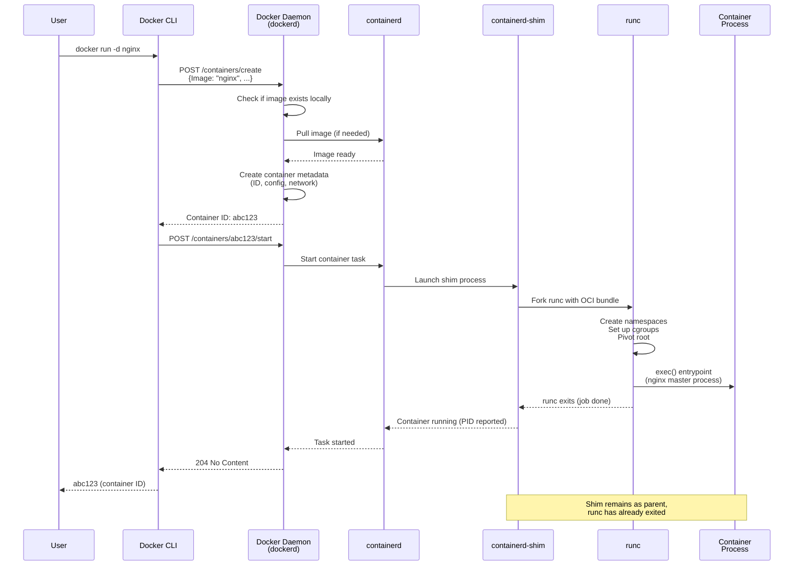
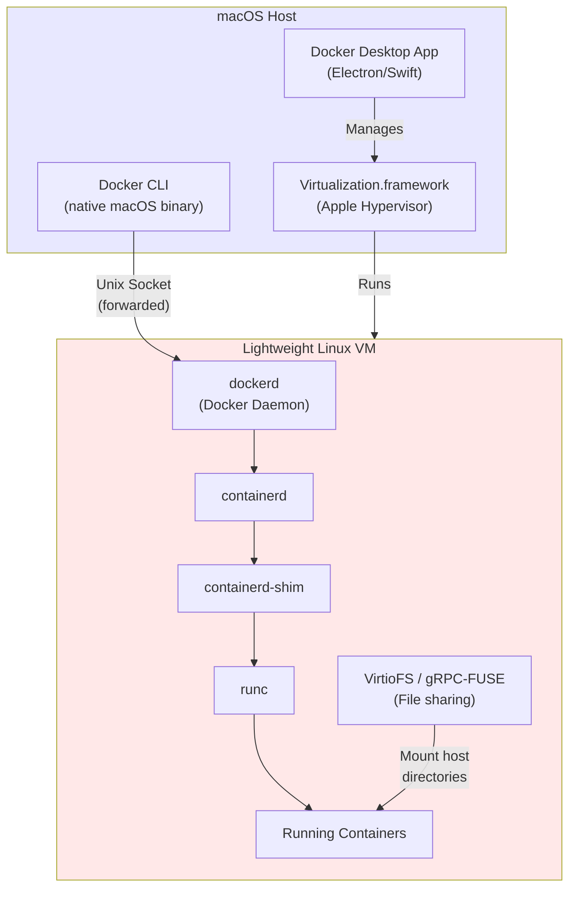

# File 2: Docker Architecture

**Topic:** Docker Engine (daemon, CLI, containerd, runc), client-server model, Docker Desktop internals, REST API, and the container creation flow.

**WHY THIS MATTERS:**
When you type `docker run nginx`, at least 5 different components coordinate to pull the image, create a container, set up networking, and start the process. Understanding this pipeline helps you debug failures, optimize performance, and work confidently with Kubernetes (which uses the same containerd/runc stack without Docker).

---

## Story: India Post Sorting Office

Imagine the India Post system in a large city like Mumbai.

**YOU (the sender) = Docker CLI**
You walk into the post office, fill out a form, and hand over your parcel. You don't sort or deliver — you just give instructions.

**POSTMASTER (behind the counter) = Docker Daemon (dockerd)**
Receives your request, validates it, updates the ledger, and passes the parcel to the sorting center.

**SORTING CENTER = containerd**
The real engine of operations. Manages the lifecycle: receives parcels, categorizes them, tracks their state, and assigns them to delivery agents.

**DELIVERY AGENT (postman) = runc**
Actually carries the parcel to the destination (creates the Linux process with namespaces and cgroups). Once delivered, the agent is free for the next delivery.

**TRACKING SLIP = containerd-shim**
Stays with each parcel after the delivery agent leaves. Keeps the connection alive, collects delivery status, and reports back to the sorting center.

---

## Example Block 1 — Docker Engine Components

### Section 1 — The Big Picture

**WHY:** Docker is NOT a single program. It's a collection of components that communicate via APIs. Knowing each piece helps you understand error messages and debug issues.

```
  ┌─────────────────────────────────────────────────────┐
  │                  Docker CLI (docker)                 │
  │          User-facing command-line interface          │
  └──────────────────────┬──────────────────────────────┘
                         │ REST API (HTTP/Unix Socket)
  ┌──────────────────────▼──────────────────────────────┐
  │              Docker Daemon (dockerd)                 │
  │  • Image management (pull, build, push)             │
  │  • Network management (bridge, overlay)             │
  │  • Volume management                                │
  │  • Orchestration (Swarm mode)                       │
  │  • API server (listens on unix socket or TCP)       │
  └──────────────────────┬──────────────────────────────┘
                         │ gRPC API
  ┌──────────────────────▼──────────────────────────────┐
  │                   containerd                         │
  │  • Container lifecycle management                   │
  │  • Image pulling and storage                        │
  │  • Snapshot management (filesystem layers)          │
  │  • Task execution                                   │
  │  • CNCF graduated project                           │
  └──────────────────────┬──────────────────────────────┘
                         │ OCI Runtime Spec
  ┌──────────────────────▼──────────────────────────────┐
  │              containerd-shim (per container)         │
  │  • Decouples container from containerd              │
  │  • Keeps STDIO and exit code                        │
  │  • Allows containerd restart without killing        │
  │    running containers                               │
  └──────────────────────┬──────────────────────────────┘
                         │ fork/exec
  ┌──────────────────────▼──────────────────────────────┐
  │                    runc                              │
  │  • OCI reference runtime implementation             │
  │  • Creates namespaces and cgroups                   │
  │  • Starts the container process                     │
  │  • EXITS after container is running (not a daemon)  │
  └──────────────────────┬──────────────────────────────┘
                         │
  ┌──────────────────────▼──────────────────────────────┐
  │              Container Process (PID 1)               │
  │  • Your actual application (nginx, node, etc.)      │
  │  • Runs in isolated namespaces                      │
  │  • Resource-limited by cgroups                      │
  └─────────────────────────────────────────────────────┘
```

### Section 2 — Each Component Explained

**WHY:** Understanding the responsibility of each layer tells you where to look when something breaks.

**1. Docker CLI (docker)**

- **WHAT:** Command-line tool that users interact with.
- **ROLE:** Translates user commands into REST API calls.
- **SOCKET:** `/var/run/docker.sock` (Unix) or `tcp://host:2375`
- **CONFIG:** `~/.docker/config.json`

The CLI does NO container work itself. It's purely a client. You could replace it with curl calls to the REST API.

Example — Same thing, two ways:
```bash
docker ps
curl --unix-socket /var/run/docker.sock http://localhost/containers/json
```

**2. Docker Daemon (dockerd)**

- **WHAT:** Long-running background service (daemon).
- **ROLE:** The brain of Docker. Handles:
  - Building images (processes Dockerfiles)
  - Managing networks (bridge, overlay, host, none)
  - Managing volumes (local, NFS, cloud)
  - Authentication with registries
  - Orchestration (Swarm mode)
- **LISTENS:** Unix socket or TCP port
- **CONFIG:** `/etc/docker/daemon.json`

**KEY POINT:** dockerd does NOT create containers directly. It delegates that to containerd via gRPC.

**3. containerd**

- **WHAT:** Industry-standard container runtime (CNCF graduated).
- **ROLE:** Container lifecycle supervisor. Handles:
  - Pulling and storing images
  - Managing snapshots (filesystem layers)
  - Creating and managing containers
  - Task execution and supervision
- **SOCKET:** `/run/containerd/containerd.sock`
- **CLI:** `ctr` (low-level), `nerdctl` (Docker-compatible)

**KEY POINT:** containerd can run WITHOUT Docker. Kubernetes uses containerd directly (CRI plugin), bypassing dockerd.

**4. containerd-shim**

- **WHAT:** Small process that acts as parent of each container.
- **ROLE:**
  - Allows runc to exit after starting the container
  - Keeps STDIO streams open for logging
  - Reports exit status back to containerd
  - Allows containerd to restart without killing containers
- **VERSIONS:** shim-v1 (legacy), shim-v2 (current, binary per runtime)

**KEY POINT:** One shim per container. This is why containers survive containerd restarts.

**5. runc**

- **WHAT:** OCI reference runtime implementation (Go binary).
- **ROLE:** The low-level container creator. It:
  - Reads the OCI runtime spec (config.json)
  - Creates Linux namespaces (PID, NET, MNT, etc.)
  - Sets up cgroups (CPU, memory limits)
  - Pivots root to the container filesystem
  - Executes the container entrypoint process
  - EXITS immediately after the container starts

**KEY POINT:** runc is NOT a daemon. It does its job and exits. The shim takes over as the container's parent process.

You can use runc directly:
```bash
runc spec              # generates config.json
runc create mycontainer
runc start mycontainer
```

---

## Example Block 2 — The Container Creation Flow

### Section 3 — What Happens When You Type "docker run"

**WHY:** This is the most important flow to understand. Knowing each step helps you debug where things fail.



### Section 4 — Step-by-Step Walkthrough

**WHY:** The Mermaid diagram shows the WHAT; this section explains the WHY at each step.

**Step-by-Step: `docker run -d -p 8080:80 nginx`**

**STEP 1: CLI parses the command**
- Image: nginx (defaults to nginx:latest)
- Flags: -d (detached), -p 8080:80 (port mapping)
- CLI sends HTTP POST to dockerd via Unix socket

**STEP 2: dockerd receives the API call**
- Checks if "nginx:latest" exists in local image store
- If not: pulls from Docker Hub (registry-1.docker.io)
- Creates container object with:
  - Unique 64-char hex ID (displayed as 12-char short ID)
  - Network configuration (bridge by default)
  - Mount configuration (read-only image + writable layer)
  - Port mapping rules (iptables NAT)

**STEP 3: dockerd asks containerd to create a task**
- Sends gRPC request to containerd
- containerd prepares the OCI bundle:
  - rootfs (merged layers via snapshotter)
  - config.json (OCI runtime spec)

**STEP 4: containerd launches containerd-shim**
- Shim starts as a child of containerd
- Shim then re-parents itself (daemonizes)
- This decoupling lets containerd restart without killing running containers

**STEP 5: Shim invokes runc**
- runc reads the OCI bundle (rootfs + config.json)
- Creates new namespaces: PID, NET, MNT, UTS, IPC
- Sets cgroup limits: --memory=512m, --cpus=1.0
- Calls pivot_root to change the root filesystem
- Executes the entrypoint: "nginx -g 'daemon off;'"

**STEP 6: runc exits, shim takes over**
- runc's job is done — it exits immediately
- Shim becomes the parent process of the container
- Shim watches for exit, forwards STDIO to logging

**STEP 7: Container is running**
- nginx master process is PID 1 inside the container
- Port 8080 on host maps to port 80 in container
- dockerd reports the container as "running"

---

## Example Block 3 — Client-Server Model

### Section 5 — Docker's Client-Server Architecture

**WHY:** Docker CLI and Docker daemon are SEPARATE processes. The CLI can talk to a remote daemon. This is key for CI/CD, Docker-in-Docker, and remote management.

**Communication Channels:**

```
LOCAL (default):
  CLI ──► Unix Socket (/var/run/docker.sock) ──► dockerd

REMOTE (via TCP):
  CLI ──► TCP (tcp://remote-host:2376) ──► dockerd
  (TLS required for remote access)
```

**Environment Variables:**
```bash
export DOCKER_HOST=tcp://192.168.1.100:2376
export DOCKER_TLS_VERIFY=1
export DOCKER_CERT_PATH=~/.docker/certs
```

**Commands to verify:**
```bash
docker context ls         # list configured contexts
docker context use remote # switch to remote daemon
docker info               # shows which daemon you're connected to
```

### Section 6 — Docker REST API Examples

**WHY:** The REST API is what the CLI uses internally. You can call it directly for automation, custom tooling, or from any programming language.

The Docker daemon exposes a RESTful API on the Unix socket. Every docker CLI command maps to an API endpoint.

**Common API Endpoints:**

| CLI Command           | API Endpoint |
|-----------------------|--------------|
| `docker ps`           | `GET /containers/json` |
| `docker images`       | `GET /images/json` |
| `docker run`          | `POST /containers/create` + `POST /containers/{id}/start` |
| `docker stop`         | `POST /containers/{id}/stop` |
| `docker logs`         | `GET /containers/{id}/logs` |
| `docker build`        | `POST /build` |
| `docker pull`         | `POST /images/create` |
| `docker info`         | `GET /info` |
| `docker version`      | `GET /version` |

**Example — List containers via curl:**
```bash
curl --unix-socket /var/run/docker.sock \
     http://localhost/v1.43/containers/json
```

**Example — Create a container via curl:**
```bash
curl --unix-socket /var/run/docker.sock \
     -H "Content-Type: application/json" \
     -d '{"Image": "nginx", "ExposedPorts": {"80/tcp": {}}}' \
     http://localhost/v1.43/containers/create
```

**API VERSION:** `/v1.43/` — always specify to avoid breaking changes.

---

## Example Block 4 — Docker Desktop Internals

### Section 7 — Docker on macOS and Windows

**WHY:** Docker containers are Linux processes. They need a Linux kernel. On macOS/Windows, Docker Desktop runs a hidden Linux VM. Understanding this explains performance characteristics and filesystem behavior.



**Docker Desktop Components:**

**macOS:**
- Hypervisor: Apple Virtualization.framework
- VM: Lightweight Alpine-based Linux
- Filesystem: VirtioFS (fast host-VM file sharing)
- Networking: vpnkit (user-space networking)
- Socket: `~/Library/Containers/.../docker.sock` (proxied to VM's `/var/run/docker.sock`)

**Windows:**
- WSL 2 Backend (recommended):
  - Uses Windows Subsystem for Linux 2
  - Real Linux kernel via Hyper-V
  - Better performance than Hyper-V backend
- Hyper-V Backend (legacy):
  - Full Hyper-V virtual machine
  - MobyLinuxVM running in Hyper-V
  - Slower filesystem access

**Linux:**
- NO VM NEEDED! Docker runs natively.
- dockerd and containerd run as systemd services.
- Best performance, direct kernel access.

**PERFORMANCE IMPLICATIONS:**
- File I/O on macOS/Windows is slower (VM boundary)
- Tip: Use named volumes instead of bind mounts for database data on macOS (avoids VirtioFS overhead)
- Networking adds a hop through the VM
- CPU/memory are shared with the VM (configurable in Docker Desktop settings)

---

## Example Block 5 — Docker Daemon Configuration

### Section 8 — daemon.json Configuration

**WHY:** The daemon config controls storage drivers, logging, registry mirrors, and security settings. Every DevOps engineer needs to know this file.

**Location:**
- Linux: `/etc/docker/daemon.json`
- macOS: `~/.docker/daemon.json` (or via Docker Desktop UI)
- Windows: `C:\ProgramData\docker\config\daemon.json`

**Example Configuration:**
```json
{
  "storage-driver": "overlay2",
  "log-driver": "json-file",
  "log-opts": {
    "max-size": "10m",
    "max-file": "3"
  },
  "default-address-pools": [
    {"base": "172.17.0.0/16", "size": 24}
  ],
  "registry-mirrors": ["https://mirror.gcr.io"],
  "insecure-registries": ["my-registry.local:5000"],
  "live-restore": true,
  "debug": false,
  "tls": true,
  "tlscacert": "/etc/docker/ca.pem",
  "tlscert": "/etc/docker/server-cert.pem",
  "tlskey": "/etc/docker/server-key.pem"
}
```

**Key Settings:**
- `storage-driver` → overlay2 (default, best for most)
- `log-driver` → json-file, syslog, journald, fluentd
- `live-restore` → containers survive daemon restart
- `registry-mirrors` → speed up pulls via local mirror
- `debug` → verbose daemon logging

**Apply Changes:**
```bash
sudo systemctl reload docker    # graceful reload
sudo systemctl restart docker   # full restart
```

---

## Example Block 6 — Useful Diagnostic Commands

### Section 9 — Debugging the Docker Stack

**WHY:** When Docker misbehaves, you need to know which component to inspect. These commands help you debug at each layer.

1. **Docker CLI version:**
   ```bash
   docker version
   ```
   Shows: Client AND Server versions, API version, Go version

2. **Docker system info:**
   ```bash
   docker info
   ```
   Shows: Containers, images, storage driver, plugins, swarm

3. **Docker daemon logs:**
   ```bash
   # Linux:
   journalctl -u docker.service -f
   # macOS:
   # ~/Library/Containers/com.docker.docker/Data/log/host/Docker.log
   ```

4. **containerd status:**
   ```bash
   sudo systemctl status containerd
   sudo ctr version
   sudo ctr containers list
   sudo ctr images list
   ```

5. **runc version:**
   ```bash
   runc --version
   ```
   Shows: runc version, OCI runtime spec version, Go version

6. **Container process tree:**
   ```bash
   docker top <container_id>
   ```
   Shows: Processes running inside the container

7. **Docker events (real-time):**
   ```bash
   docker events
   # FLAGS:  --filter event=start
   #         --filter container=myapp
   #         --since 1h
   ```
   Shows: create, start, stop, die, kill events in real-time

8. **System disk usage:**
   ```bash
   docker system df
   # FLAG:   -v (verbose, shows per-item breakdown)
   ```
   Shows: Space used by images, containers, volumes, build cache

### Section 10 — The Docker Socket — Security Implications

**WHY:** `/var/run/docker.sock` is a root-equivalent access point. Anyone with access to this socket can control the Docker daemon — and thus the host system.

**THE SOCKET:** `/var/run/docker.sock`

> **SECURITY WARNING:** Access to the Docker socket = root access to the host.

**WHY?** Because Docker can:
- Mount any host directory into a container
- Run containers in `--privileged` mode
- Access host networking with `--net=host`
- Run processes as root on the host kernel

**BEST PRACTICES:**
1. Never expose the socket to the internet (`tcp://0.0.0.0:2375`)
2. Use TLS for remote access (port 2376 with certs)
3. Add users to "docker" group instead of using sudo (but understand this is still root-equivalent)
4. Use rootless Docker for better security:
   ```bash
   dockerd-rootless-setuptool.sh install
   ```
5. In CI/CD, use Docker-in-Docker carefully or prefer Kaniko/Buildah for building images without the socket

---

## Key Takeaways

1. **DOCKER IS CLIENT-SERVER:** CLI (client) talks to dockerd (server) via REST API over a Unix socket.

2. **FIVE COMPONENTS** in the stack: CLI → dockerd → containerd → containerd-shim → runc. Each has a specific, focused responsibility.

3. **runc EXITS** after creating the container. It is not a long-running daemon. The shim stays as the parent.

4. **containerd** is the REAL container manager. Kubernetes uses containerd directly, without dockerd.

5. **DOCKER DESKTOP** on macOS/Windows runs a Linux VM. The CLI is native, but containers run inside the VM.

6. The **Docker socket** (`/var/run/docker.sock`) provides ROOT-EQUIVALENT access. Protect it accordingly.

7. **daemon.json** configures storage, logging, networking, security, and performance settings for the daemon.

8. **India Post analogy:** CLI = Sender | dockerd = Postmaster | containerd = Sorting Center | runc = Delivery Agent | shim = Tracking Slip

> **Next File:** 03-images-and-layers.md — Image anatomy, union filesystem, copy-on-write, and layer optimization.
