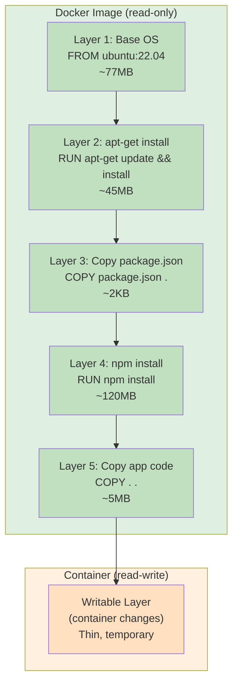
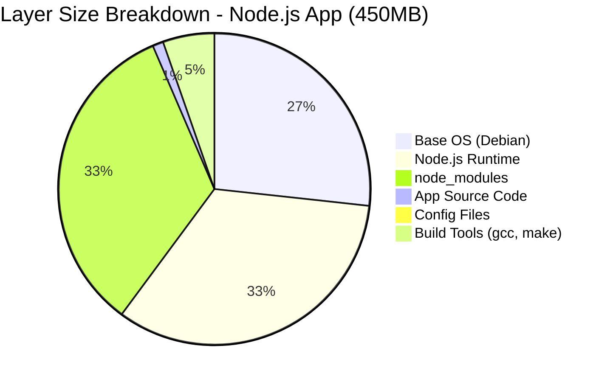

# File 3: Docker Images and Layers

**Topic:** Image anatomy, union filesystem, copy-on-write, image manifest, content-addressable storage, multi-arch images, and size optimization.

**WHY THIS MATTERS:**
A Docker image is NOT a monolithic blob — it is a stack of read-only layers, each identified by a SHA256 hash. Understanding layers is the key to writing efficient Dockerfiles, speeding up builds, reducing image sizes, and debugging "why is my image 2 GB?"

---

## Story: Dabba (Tiffin) Stacking

In Mumbai, the famous dabbawalas deliver lunch tiffins. A tiffin carrier is a stack of round metal containers (dabbas), each holding a different dish — dal, rice, sabzi, roti, and the top one is dessert.

A Docker IMAGE is like a tiffin carrier:
- Each DABBA = one layer (read-only)
- Bottom dabba = base OS (ubuntu, alpine)
- Middle dabbas = installed packages, app code
- You NEVER modify a dabba once sealed
- If you want to change the dal, you make a NEW dabba and stack it on top (copy-on-write)

A CONTAINER adds a writable dabba on top — this is where the customer can add extra pickle or curd. When the container is deleted, this top writable dabba is thrown away, but the original tiffin (image) remains intact.

The dabbawala (Docker) can carry the same tiffin to multiple customers simultaneously — they all share the same read-only dabbas, saving space and time.

---

## Example Block 1 — Image Anatomy

### Section 1 — What is a Docker Image?

**WHY:** If you think of an image as "just a file", you will never understand caching, layer sharing, or optimization. An image is a DAG (directed acyclic graph) of layers.



**Image Components:**

A Docker image consists of:

1. **LAYERS (filesystem diffs)**
   - Each Dockerfile instruction creates a new layer
   - Layers are tar archives of filesystem changes
   - Layers are immutable (read-only)
   - Shared between images that use the same base

2. **IMAGE MANIFEST (JSON)**
   - Lists all layers in order
   - References each layer by SHA256 digest
   - Specifies architecture (amd64, arm64)
   - Points to the config object

3. **IMAGE CONFIG (JSON)**
   - Environment variables
   - Entrypoint and CMD
   - Exposed ports
   - Working directory
   - Creation history (which commands created each layer)

4. **CONTENT-ADDRESSABLE STORAGE**
   - Every object is stored by its SHA256 hash
   - Same content = same hash = stored only once
   - This is why pulling a base image once benefits ALL images built on top of it

---

## Example Block 2 — Working with Images

### Section 2 — docker pull

**WHY:** Understanding what happens during a pull shows how layers are downloaded and cached independently.

```bash
docker pull <image>:<tag>
# SYNTAX:  docker pull [OPTIONS] NAME[:TAG|@DIGEST]
```

**FLAGS:**

| Flag | Description |
|------|-------------|
| `--all-tags, -a` | Pull all tagged images in the repository |
| `--platform` | Pull for specific platform (e.g., linux/arm64) |
| `--quiet, -q` | Suppress verbose output |

**EXAMPLES:**
```bash
docker pull nginx                    # pulls nginx:latest
docker pull nginx:1.25-alpine        # pulls specific tag
docker pull nginx@sha256:abc123...   # pulls exact digest
docker pull --platform linux/arm64 nginx  # pulls ARM image
```

**EXPECTED OUTPUT:**
```
1.25-alpine: Pulling from library/nginx
c9e2a3d7e4a1: Already exists        ← layer cached locally
b4df32aa5a72: Pull complete          ← new layer downloaded
1f5e3c9a5d28: Pull complete
Digest: sha256:abc123...
Status: Downloaded newer image for nginx:1.25-alpine
```

**WHAT HAPPENS:**
1. Docker resolves "nginx" → `registry-1.docker.io/library/nginx`
2. Fetches the image manifest (JSON) for tag "1.25-alpine"
3. For each layer in the manifest:
   - If layer hash exists locally → skip ("Already exists")
   - If not → download, verify SHA256, store
4. Stores the manifest and config locally

### Section 3 — docker images

**WHY:** Listing images shows you what is cached locally and how much disk space they consume.

```bash
docker images
# SYNTAX:  docker images [OPTIONS] [REPOSITORY[:TAG]]
```

**FLAGS:**

| Flag | Description |
|------|-------------|
| `--all, -a` | Show all images (including intermediate) |
| `--filter, -f` | Filter output (dangling=true, before=, since=) |
| `--format` | Pretty-print using Go template |
| `--digests` | Show image digests |
| `--quiet, -q` | Only show image IDs |
| `--no-trunc` | Show full image IDs (64 chars) |

**EXAMPLES:**
```bash
docker images                              # list all
docker images nginx                        # filter by name
docker images --format "{{.Repository}}:{{.Tag}} {{.Size}}"
docker images -f "dangling=true"           # untagged images
docker images --digests                    # show SHA256
```

**EXPECTED OUTPUT:**
```
REPOSITORY   TAG           IMAGE ID       CREATED       SIZE
nginx        1.25-alpine   a2fb4b1c5e8d   2 days ago    42.5MB
node         20-slim       b3c7d8e1f2a9   1 week ago    238MB
ubuntu       22.04         c4d8e2f3a1b7   2 weeks ago   77.8MB
```

> **NOTE ON SIZE:** The SIZE column shows the VIRTUAL size (all layers). Shared layers are counted multiple times across images but stored only ONCE on disk. Use `docker system df` for actual disk usage.

### Section 4 — docker image inspect

**WHY:** inspect shows the complete metadata of an image — layers, config, environment, entrypoint, and creation history. Essential for debugging.

```bash
docker image inspect <image>
# SYNTAX:  docker image inspect [OPTIONS] IMAGE [IMAGE...]
# FLAGS:   --format, -f   Format output using Go template
```

**EXAMPLES:**
```bash
docker image inspect nginx:latest
docker image inspect -f '{{.Architecture}}' nginx
docker image inspect -f '{{.Config.Env}}' nginx
docker image inspect -f '{{.RootFS.Layers}}' nginx
docker image inspect -f '{{json .Config}}' nginx | jq
```

**KEY FIELDS IN OUTPUT:**
```json
{
  "Id": "sha256:a2fb4b1c...",
  "RepoTags": ["nginx:latest"],
  "Architecture": "amd64",
  "Os": "linux",
  "Config": {
    "Env": ["PATH=/usr/local/sbin:..."],
    "Cmd": ["nginx", "-g", "daemon off;"],
    "ExposedPorts": {"80/tcp": {}},
    "WorkingDir": ""
  },
  "RootFS": {
    "Type": "layers",
    "Layers": [
      "sha256:layer1hash...",
      "sha256:layer2hash...",
      "sha256:layer3hash..."
    ]
  }
}
```

### Section 5 — docker image history

**WHY:** history shows which Dockerfile commands created each layer and how big each layer is. Perfect for finding which instruction bloated your image.

```bash
docker image history <image>
# SYNTAX:  docker image history [OPTIONS] IMAGE
```

**FLAGS:**

| Flag | Description |
|------|-------------|
| `--no-trunc` | Show full command text |
| `--quiet, -q` | Only show layer IDs |
| `--format` | Custom format |
| `--human, -H` | Human-readable sizes (default true) |

**EXAMPLE:**
```bash
docker image history nginx:latest --no-trunc
```

**EXPECTED OUTPUT:**
```
IMAGE        CREATED      CREATED BY                           SIZE
a2fb4b1c5e   2 days ago   CMD ["nginx" "-g" "daemon off;"]     0B
<missing>    2 days ago   EXPOSE map[80/tcp:{}]                0B
<missing>    2 days ago   COPY conf /etc/nginx ← dir:abc...   1.2kB
<missing>    2 days ago   RUN /bin/sh -c set -x && apt-ge...   22MB
<missing>    2 days ago   ENV NGINX_VERSION=1.25.3             0B
<missing>    2 weeks ago  /bin/sh -c #(nop) CMD ["bash"]       0B
<missing>    2 weeks ago  ADD file:abc123... in /               77.8MB
```

**READING THE OUTPUT:**
- `<missing>` = intermediate layers (no standalone ID)
- SIZE = how much that specific layer added
- 0B layers = metadata-only (ENV, CMD, EXPOSE)
- Largest layers = where to focus optimization

---

## Example Block 3 — Union Filesystem & Copy-on-Write

### Section 6 — How Layers are Merged

**WHY:** Understanding the union filesystem explains why deleting a file in a later layer does NOT reduce image size, and why containers can start so fast.

**OverlayFS (default storage driver):**

Docker uses OverlayFS to merge layers into a single view.

```
HOW IT WORKS:
┌─────────────────────────────────────────────┐
│ Container Layer (upperdir) — WRITABLE        │
│   New files, modified files go here          │
├─────────────────────────────────────────────┤
│ Merged View (merged) — what container sees   │
│   Union of all layers, read-write at top     │
├─────────────────────────────────────────────┤
│ Image Layer 3 (lowerdir) — READ-ONLY         │
│ Image Layer 2 (lowerdir) — READ-ONLY         │
│ Image Layer 1 (lowerdir) — READ-ONLY         │
└─────────────────────────────────────────────┘
```

**COPY-ON-WRITE (CoW):**

When a container modifies a file from a read-only layer:
1. The file is COPIED from the lower layer to the upper layer
2. The modification is made to the COPY in the upper layer
3. The original in the lower layer is UNCHANGED
4. Future reads see the modified version (upper masks lower)

This is like photocopying a library book:
- The original stays on the shelf (read-only layer)
- You write on the photocopy (writable layer)
- Other readers still see the original

**DELETING FILES — THE WHITEOUT TRAP:**

When a container deletes a file from a lower layer:
- The file is NOT actually removed from the lower layer
- Instead, a "whiteout" marker is created in the upper layer
- The whiteout hides the file from the merged view
- But the file STILL exists in the image layer!

**THIS IS WHY:**
```dockerfile
RUN apt-get install -y curl    # Layer adds 15MB
RUN apt-get remove -y curl     # Layer adds whiteout (~0B)
# Image is STILL 15MB larger because both layers exist!
```

**CORRECT APPROACH:**
```dockerfile
RUN apt-get install -y curl && \
    do-something-with-curl && \
    apt-get remove -y curl && \
    rm -rf /var/lib/apt/lists/*
# Single layer: install, use, remove — net small size
```

---

## Example Block 4 — Image Manifests & Multi-Arch

### Section 7 — Image Manifest

**WHY:** The manifest is the "table of contents" for an image. Multi-arch manifests let one image tag work on Intel, ARM (Raspberry Pi, Apple Silicon), and more.

```bash
docker manifest inspect <image>
# SYNTAX:  docker manifest inspect [OPTIONS] IMAGE
# NOTE:    Requires "experimental" CLI features enabled
```

**Example:**
```bash
docker manifest inspect nginx:latest
```

**Output (simplified):**
```json
{
  "schemaVersion": 2,
  "mediaType": "application/vnd.oci.image.index.v1+json",
  "manifests": [
    {
      "mediaType": "application/vnd.oci.image.manifest.v1+json",
      "digest": "sha256:aaa111...",
      "size": 1234,
      "platform": {
        "architecture": "amd64",
        "os": "linux"
      }
    },
    {
      "mediaType": "application/vnd.oci.image.manifest.v1+json",
      "digest": "sha256:bbb222...",
      "size": 1234,
      "platform": {
        "architecture": "arm64",
        "os": "linux"
      }
    },
    {
      "mediaType": "application/vnd.oci.image.manifest.v1+json",
      "digest": "sha256:ccc333...",
      "size": 1234,
      "platform": {
        "architecture": "arm",
        "os": "linux",
        "variant": "v7"
      }
    }
  ]
}
```

**WHAT THIS MEANS:**
When you run `docker pull nginx` on a Mac with Apple Silicon, Docker checks the manifest list, picks the arm64 variant, and pulls ONLY those layers. Same tag, right architecture.

### Section 8 — Layer Size Visualization

**WHY:** Visualizing where space is consumed helps you prioritize optimization efforts.



**OBSERVATIONS:**
- node_modules and runtime dominate — focus optimization here
- App source code is tiny — frequent changes are cheap
- Build tools are waste in production — use multi-stage builds
- Switching `FROM node:20` (900MB) to `FROM node:20-alpine` (130MB) saves 770MB immediately

---

## Example Block 5 — Image Size Optimization

### Section 9 — Reducing Image Size

**WHY:** Smaller images = faster pulls, faster deploys, smaller attack surface, lower storage costs.

**STRATEGY 1: Use smaller base images**

| Base Image                 | Size |
|----------------------------|------|
| ubuntu:22.04               | ~77MB |
| debian:12-slim             | ~74MB |
| node:20                    | ~900MB |
| node:20-slim               | ~238MB |
| node:20-alpine             | ~130MB |
| alpine:3.19                | ~7MB |
| gcr.io/distroless/nodejs20 | ~130MB |
| scratch                    | 0MB |

**STRATEGY 2: Combine RUN commands (fewer layers)**

BAD:
```dockerfile
RUN apt-get update
RUN apt-get install -y curl
RUN apt-get clean
# 3 layers, apt cache still in layer 1
```

GOOD:
```dockerfile
RUN apt-get update && \
    apt-get install -y --no-install-recommends curl && \
    apt-get clean && \
    rm -rf /var/lib/apt/lists/*
# 1 layer, clean in same layer
```

**STRATEGY 3: Multi-stage builds**
```dockerfile
FROM node:20 AS builder
COPY package*.json ./
RUN npm ci
COPY . .
RUN npm run build

FROM node:20-alpine AS production
COPY --from=builder /app/dist ./dist
COPY --from=builder /app/node_modules ./node_modules
CMD ["node", "dist/index.js"]
# Build tools stay in builder stage, not in final image
```

**STRATEGY 4: Use .dockerignore**
```
node_modules
.git
*.md
.env
# Prevents unnecessary files from entering the build context
```

**STRATEGY 5: Order layers by change frequency**
```dockerfile
COPY package.json .          # changes rarely
RUN npm install              # cached if package.json unchanged
COPY . .                     # changes often, but after npm install
# Layer cache is invalidated from the first changed layer DOWN
```

---

## Example Block 6 — Image Cleanup Commands

### Section 10 — Pruning and Cleanup

**WHY:** Over time, unused images accumulate and waste disk space. Regular pruning keeps your system clean.

**docker image prune:**

```bash
docker image prune
# SYNTAX:  docker image prune [OPTIONS]
```

| Flag | Description |
|------|-------------|
| `--all, -a` | Remove all unused images (not just dangling) |
| `--filter` | Filter (e.g., "until=24h", "label=temp") |
| `--force, -f` | Skip confirmation prompt |

**EXAMPLES:**
```bash
docker image prune                   # remove dangling images
docker image prune -a                # remove ALL unused images
docker image prune -a --filter "until=168h"  # unused for 7 days
docker image prune -a -f             # force, no prompt
```

**WHAT IS A "DANGLING" IMAGE?**
An image with no tag (shows as `<none>:<none>` in docker images). This happens when you rebuild an image with the same tag — the old image loses its tag and becomes dangling.

**NUCLEAR OPTION:**
```bash
docker system prune -a --volumes
# Removes ALL: stopped containers, unused networks,
# dangling images, unused volumes, build cache
# Use with caution!
```

**docker system df:**

```bash
docker system df
# SYNTAX:  docker system df [OPTIONS]
# FLAGS:   -v (verbose)
```

**EXPECTED OUTPUT:**
```
TYPE            TOTAL   ACTIVE   SIZE      RECLAIMABLE
Images          15      5        4.2GB     2.8GB (66%)
Containers      8       3        125MB     98MB (78%)
Local Volumes   12      4        1.5GB     800MB (53%)
Build Cache     45      0        3.1GB     3.1GB (100%)
```

Add `-v` flag for per-item breakdown showing exactly which images, containers, and volumes are using space.

---

## Example Block 7 — Content-Addressable Storage

### Section 11 — How Docker Stores Images on Disk

**WHY:** Knowing the storage layout helps debug disk issues and understand why `docker system df` shows certain numbers.

Docker stores everything under `/var/lib/docker/` (Linux):

```
/var/lib/docker/
├── overlay2/           ← layer storage (OverlayFS driver)
│   ├── <layer-hash>/   ← each layer has its own directory
│   │   ├── diff/       ← filesystem changes for this layer
│   │   ├── link        ← short identifier for this layer
│   │   └── lower       ← parent layer reference
│   └── l/              ← symlinks for shortened IDs
├── image/
│   └── overlay2/
│       ├── imagedb/    ← image configs (by SHA256)
│       ├── layerdb/    ← layer metadata and chain IDs
│       └── repositories.json  ← tag → image ID mapping
├── containers/         ← container metadata and writable layers
├── volumes/            ← named volume data
├── network/            ← network configuration
└── tmp/                ← temporary build data
```

**CONTENT-ADDRESSABLE MEANS:**
- Each object is stored by its SHA256 hash
- If two images share a layer, it is stored ONCE
- Integrity verification: hash mismatch = corruption detected
- No duplicates possible — same content = same hash always

---

## Key Takeaways

1. An **IMAGE** is a stack of read-only LAYERS, not a single file. Each Dockerfile instruction creates a new layer.

2. **UNION FILESYSTEM** (OverlayFS) merges layers into one view. Lower layers are read-only; only the top container layer is writable.

3. **COPY-ON-WRITE:** modifying a file copies it to the writable layer. The original layer is never changed. Deleting a file creates a whiteout — the image does NOT shrink.

4. **CONTENT-ADDRESSABLE** storage means every object is identified by its SHA256 hash. Same content = same hash = stored once.

5. **IMAGE MANIFEST** lists layers, architecture, and config. MANIFEST LISTS enable multi-arch images (one tag, many architectures).

6. **SIZE OPTIMIZATION:** Use alpine/slim/distroless base images, combine RUN commands, use multi-stage builds, and order layers by change frequency for better caching.

7. **CLEANUP** regularly: `docker image prune -a`, `docker system df`, `docker system prune`. Dangling images waste space silently.

8. **TIFFIN ANALOGY:** Image layers are like sealed dabbas (containers in a tiffin stack). Each dabba is read-only. The container's writable layer is the extra pickle dabba on top — temporary and disposable.

> **Next File:** 04-containers-lifecycle.md — Container states, lifecycle management, exec, logs, stats, and resource inspection.
