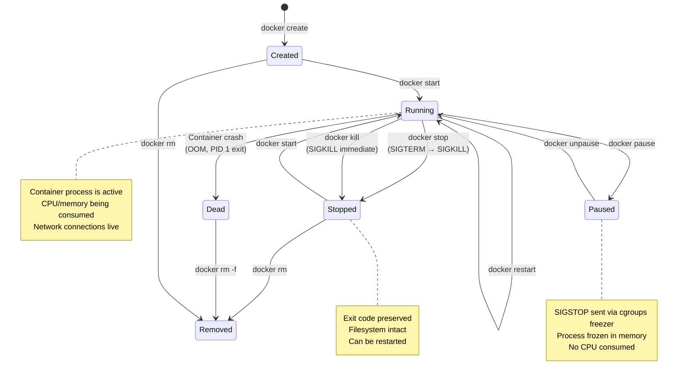
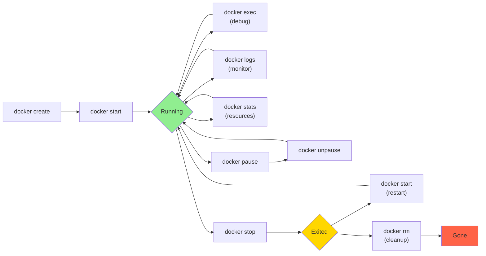

# File 4: Containers Lifecycle

**Topic:** Container states (created, running, paused, stopped, dead), lifecycle commands, exec, attach, logs, resource inspection, restart policies.

**WHY THIS MATTERS:**
A container is not just "running" or "stopped." It moves through a well-defined state machine. Understanding each state, the transitions between them, and the commands to control them is essential for managing containers in development and production environments.

---

## Story: Auto-Rickshaw Ride in Bangalore

Imagine hiring an auto-rickshaw in Bangalore:

- **CREATED** = You've hailed the auto and agreed on the fare (`docker create`). The meter is set, route is planned, but the auto hasn't started moving yet.
- **RUNNING** = The auto is moving through traffic, meter running (`docker start` / `docker run`). Your app is live.
- **PAUSED** = Stuck at a traffic signal (`docker pause`). The auto is still ON, meter paused, but no movement. Passengers (processes) are frozen in place.
- **STOPPED** = You've reached your destination (`docker stop`). Engine is off, meter shows final reading. The auto still exists at the stand — you could restart it for another ride.
- **REMOVED** = The auto drives away (`docker rm`). Gone from your life. No trace left. To ride again, you need to hail a new one (`docker run` / `docker create`).
- **DEAD** = The auto broke down mid-ride (container crashed). Partially removed state. Needs cleanup.
- `docker stats` = The METER — shows fare (CPU), distance (memory), fuel consumption (network I/O) in real-time.
- `docker exec` = Leaning over and talking to the driver mid-ride. Running a command inside the moving auto.
- `docker logs` = Reading the trip history on the meter receipt.

---

## Example Block 1 — Container State Machine

### Section 1 — The State Diagram

**WHY:** Containers follow a state machine. Each command triggers a state transition. Knowing the valid transitions prevents errors and helps you understand container behavior.



**Container States Explained:**

| State     | Description |
|-----------|-------------|
| CREATED   | Container exists but process not started. Filesystem prepared, config ready. |
| RUNNING   | Container process is active and executing. PID 1 is alive inside the container. |
| PAUSED    | Process frozen via cgroups freezer. Memory preserved, CPU released. |
| STOPPED (Exited) | Process has exited (code 0 = success, non-zero = error). Filesystem still there. |
| DEAD      | Partially removed. Error during removal. Needs force removal (`docker rm -f`). |
| REMOVING  | Transient state during container deletion. |

**EXIT CODES:**

| Code | Meaning |
|------|---------|
| 0    | Success (process completed normally) |
| 1    | Application error |
| 137  | SIGKILL (128 + 9) — killed by Docker or OOM |
| 143  | SIGTERM (128 + 15) — graceful shutdown by docker stop |
| 139  | SIGSEGV (128 + 11) — segmentation fault |
| 126  | Command cannot execute (permission issue) |
| 127  | Command not found |

---

## Example Block 2 — Creating and Starting Containers

### Section 2 — docker run (create + start in one step)

**WHY:** `docker run` is the command you'll use 90% of the time. It combines create + start. Understanding its flags is essential for every Docker user.

```bash
docker run [OPTIONS] IMAGE [COMMAND] [ARG...]
```

This is a COMBINATION of:
```bash
docker create [OPTIONS] IMAGE [COMMAND]   # creates container
docker start [CONTAINER]                   # starts it
```

**ESSENTIAL FLAGS:**

| Flag                 | Purpose |
|----------------------|---------|
| `-d, --detach`       | Run in background (daemon mode) |
| `-it`                | Interactive terminal (shell) |
| `--name NAME`        | Assign a name to the container |
| `-p HOST:CONT`       | Map host port to container port |
| `-v HOST:CONT`       | Bind mount a volume |
| `-e KEY=VAL`         | Set environment variable |
| `--env-file FILE`    | Load env vars from file |
| `-w DIR`             | Set working directory |
| `--rm`               | Auto-remove when container stops |
| `--network NET`      | Connect to a Docker network |
| `--restart POLICY`   | Restart policy (see Section 13) |
| `-m, --memory LIMIT` | Memory limit (e.g., 512m, 1g) |
| `--cpus N`           | CPU limit (e.g., 1.5) |
| `--hostname NAME`    | Set container hostname |
| `--user USER`        | Run as specific user |
| `--read-only`        | Mount root filesystem read-only |
| `--privileged`       | Full host capabilities (danger!) |

**EXAMPLES:**

1. Run nginx in background with port mapping:
   ```bash
   docker run -d -p 8080:80 --name my-nginx nginx
   # Access at http://localhost:8080
   ```

2. Run interactive Ubuntu shell:
   ```bash
   docker run -it ubuntu:22.04 bash
   # You're now inside the container
   # Ctrl+D or exit to leave
   ```

3. Run with environment variables and auto-cleanup:
   ```bash
   docker run --rm -e NODE_ENV=production -e PORT=3000 \
     -p 3000:3000 my-node-app
   ```

4. Run with volume mount (bind mount):
   ```bash
   docker run -d -v /host/data:/container/data \
     --name my-db postgres:16
   ```

5. Run with resource limits:
   ```bash
   docker run -d --memory=512m --cpus=1.0 \
     --name limited-app my-app
   ```

**EXPECTED OUTPUT (detached mode):**
```
a1b2c3d4e5f6...   ← 64-char container ID
```

### Section 3 — docker create and docker start

**WHY:** Sometimes you need to create a container first (to inspect or modify config) before starting it.

**docker create:**

```bash
docker create [OPTIONS] IMAGE [COMMAND]
# PURPOSE: Create a container WITHOUT starting it.
#          Same flags as "docker run" minus -d.
```

**EXAMPLE:**
```bash
docker create --name my-web -p 80:80 nginx
# Output: e5f6a7b8c9d0...  (container ID)
# State: CREATED (not running)

docker start my-web
# State: RUNNING
# Now nginx is serving on port 80
```

**USE CASES:**
- Pre-create containers for batch processing
- Inspect container config before starting
- Copy files into created container before it runs:
  ```bash
  docker cp config.json my-web:/etc/nginx/
  docker start my-web
  ```

**docker start:**

```bash
docker start [OPTIONS] CONTAINER [CONTAINER...]
```

| Flag | Description |
|------|-------------|
| `-a, --attach` | Attach STDOUT/STDERR and forward signals |
| `-i, --interactive` | Attach container's STDIN |

**EXAMPLES:**
```bash
docker start my-web                 # start in background
docker start -a my-web              # start and watch output
docker start -ai my-container       # start interactive container
docker start web1 web2 web3         # start multiple containers
```

---

## Example Block 3 — Stopping and Removing Containers

### Section 4 — docker stop vs docker kill

**WHY:** stop sends SIGTERM (graceful), kill sends SIGKILL (immediate). Using the right one matters for data safety and proper cleanup.

**docker stop:**

```bash
docker stop [OPTIONS] CONTAINER [CONTAINER...]
```

| Flag | Description |
|------|-------------|
| `-t, --time N` | Seconds to wait before SIGKILL (default: 10) |
| `-s, --signal` | Signal to send (default: SIGTERM) |

**WHAT HAPPENS:**
1. Docker sends SIGTERM to PID 1 in the container
2. Application catches SIGTERM and cleans up (close DB connections, flush logs, finish requests)
3. If process doesn't exit within timeout (default 10s), Docker sends SIGKILL (uncatchable, immediate death)

**EXAMPLES:**
```bash
docker stop my-web                  # graceful stop (10s timeout)
docker stop -t 30 my-db            # 30s for DB to flush data
docker stop -t 0 my-app            # immediate SIGKILL (same as kill)
docker stop $(docker ps -q)        # stop ALL running containers
```

**Auto-rickshaw analogy:**
`docker stop` = Telling the driver "stop at next safe spot". The driver (process) slows down, signals, pulls over safely. If the driver doesn't stop in 10 seconds, the traffic police (SIGKILL) forces the auto to halt immediately.

**docker kill:**

```bash
docker kill [OPTIONS] CONTAINER [CONTAINER...]
```

| Flag | Description |
|------|-------------|
| `-s, --signal` | Signal to send (default: SIGKILL) |

**WHAT HAPPENS:**
Sends SIGKILL immediately. No grace period, no cleanup. Process is terminated instantly by the kernel.

**EXAMPLES:**
```bash
docker kill my-web                  # immediate SIGKILL
docker kill -s SIGTERM my-web       # send SIGTERM via kill
docker kill -s SIGUSR1 my-app       # send custom signal
```

**WHEN TO USE:**
- `docker stop`: Normal shutdown (production, databases)
- `docker kill`: Stuck/frozen container, development cleanup

### Section 5 — docker rm

**WHY:** Stopped containers still use disk space (writable layer, logs, metadata). rm cleans them up permanently.

```bash
docker rm [OPTIONS] CONTAINER [CONTAINER...]
```

| Flag | Description |
|------|-------------|
| `-f, --force` | Force remove (stops if running, then removes) |
| `-v, --volumes` | Also remove anonymous volumes |
| `-l, --link` | Remove network link (legacy) |

**EXAMPLES:**
```bash
docker rm my-web                    # remove stopped container
docker rm -f my-web                 # force stop + remove
docker rm -v my-web                 # remove with anonymous volumes
docker rm $(docker ps -aq)          # remove ALL stopped containers
docker container prune              # remove all stopped containers
docker container prune -f           # no confirmation prompt
```

> `rm` is PERMANENT. The writable layer, logs, and metadata are deleted. The underlying image is NOT affected.

**Auto-rickshaw analogy:**
`docker rm` = The auto drives away. If you want another ride, you need to hail a new auto (`docker run` / `docker create`).

---

## Example Block 4 — Listing and Inspecting Containers

### Section 6 — docker ps and docker inspect

**WHY:** You need to see what's running, what stopped, and get detailed information about specific containers.

**docker ps:**

```bash
docker ps [OPTIONS]
```

| Flag | Description |
|------|-------------|
| `-a, --all` | Show all containers (including stopped) |
| `-q, --quiet` | Only display container IDs |
| `-l, --latest` | Show the latest created container |
| `-n N` | Show last N containers |
| `--no-trunc` | Show full IDs and commands |
| `-s, --size` | Display total file sizes |
| `-f, --filter` | Filter (status=running, name=web, etc.) |
| `--format` | Custom output format |

**EXAMPLES:**
```bash
docker ps                                     # running only
docker ps -a                                  # all containers
docker ps -q                                  # just IDs
docker ps -f "status=exited"                  # stopped ones
docker ps -f "name=web"                       # filter by name
docker ps --format "table {{.Names}}\t{{.Status}}\t{{.Ports}}"
docker ps -a -s                               # show disk usage
```

**EXPECTED OUTPUT:**
```
CONTAINER ID  IMAGE  COMMAND              STATUS        PORTS               NAMES
a1b2c3d4e5f6  nginx  "/docker-entry..."   Up 2 hours    0.0.0.0:8080->80    my-nginx
b2c3d4e5f6a7  redis  "redis-server"       Up 5 minutes  6379/tcp            my-redis
```

**docker inspect:**

```bash
docker inspect [OPTIONS] CONTAINER [CONTAINER...]
# PURPOSE: Return detailed JSON metadata about a container.
```

| Flag | Description |
|------|-------------|
| `-f, --format` | Format using Go template |
| `-s, --size` | Display total file sizes |
| `--type` | Return JSON for specified type |

**EXAMPLES:**
```bash
docker inspect my-web
docker inspect -f '{{.State.Status}}' my-web
docker inspect -f '{{.NetworkSettings.IPAddress}}' my-web
docker inspect -f '{{.HostConfig.RestartPolicy.Name}}' my-web
docker inspect -f '{{json .Mounts}}' my-web | jq
```

**USEFUL FORMAT QUERIES:**

| Query | Returns |
|-------|---------|
| `{{.State.Status}}` | running, exited, paused |
| `{{.State.ExitCode}}` | 0, 1, 137, 143 |
| `{{.State.StartedAt}}` | ISO timestamp |
| `{{.NetworkSettings.IPAddress}}` | container IP |
| `{{.HostConfig.Memory}}` | memory limit |
| `{{.Config.Env}}` | environment variables |
| `{{.Mounts}}` | volume mounts |
| `{{.State.Pid}}` | PID on host |

---

## Example Block 5 — Interacting with Running Containers

### Section 7 — docker exec

**WHY:** exec runs a NEW command inside a RUNNING container. This is how you debug, inspect files, or run admin commands without stopping the container.

```bash
docker exec [OPTIONS] CONTAINER COMMAND [ARG...]
# PURPOSE: Run a command in a running container (new process).
```

| Flag | Description |
|------|-------------|
| `-it` | Interactive terminal (most common usage) |
| `-d, --detach` | Run in background |
| `-e, --env KEY=VAL` | Set environment variable |
| `-u, --user USER` | Run as specific user |
| `-w, --workdir DIR` | Working directory inside container |

**EXAMPLES:**
```bash
docker exec -it my-web bash          # open shell inside container
docker exec -it my-web sh            # sh if bash not available
docker exec my-web cat /etc/hostname # run single command
docker exec -u root my-web whoami    # run as root
docker exec -e MY_VAR=hello my-web env  # set env var
docker exec -w /app my-web ls -la    # run in specific directory
docker exec my-web nginx -t          # test nginx config
docker exec -d my-web touch /tmp/flag  # run in background
```

**KEY POINT:** exec creates a NEW process inside the container's namespaces. It does NOT replace PID 1. When you exit the exec shell, the container keeps running.

**Auto-rickshaw analogy:**
exec = Leaning over to talk to the driver mid-ride. "Turn left at the next signal." Your conversation doesn't stop the ride.

### Section 8 — docker attach

**WHY:** attach connects to the MAIN process (PID 1), unlike exec which creates a new process. Use with caution — Ctrl+C may stop the container!

```bash
docker attach [OPTIONS] CONTAINER
# PURPOSE: Attach to PID 1's STDIO (stdin, stdout, stderr).
```

| Flag | Description |
|------|-------------|
| `--no-stdin` | Do not attach stdin |
| `--sig-proxy` | Proxy signals (default: true) |
| `--detach-keys` | Override detach key sequence |

**IMPORTANT DIFFERENCES (exec vs attach):**

|              | docker exec      | docker attach    |
|--------------|------------------|------------------|
| Process      | NEW process      | PID 1 (main)     |
| Ctrl+C       | Kills exec only  | May kill PID 1!  |
| Multiple     | Many execs OK    | Shared STDIO     |
| Use case     | Debug/admin      | View output      |

**SAFE DETACH from attach:** `Ctrl+P, Ctrl+Q` (detaches without stopping the container)

### Section 9 — docker logs

**WHY:** logs shows stdout/stderr output from PID 1. This is your primary debugging tool for containers.

```bash
docker logs [OPTIONS] CONTAINER
# PURPOSE: Fetch logs (stdout + stderr) of a container.
```

| Flag | Description |
|------|-------------|
| `-f, --follow` | Follow log output (like tail -f) |
| `--tail N` | Show last N lines (default: all) |
| `--since TIME` | Show logs since timestamp/duration |
| `--until TIME` | Show logs before timestamp/duration |
| `-t, --timestamps` | Show timestamps for each line |
| `--details` | Show extra attributes from log driver |

**EXAMPLES:**
```bash
docker logs my-web                     # all logs
docker logs -f my-web                  # follow in real-time
docker logs --tail 50 my-web           # last 50 lines
docker logs --since 30m my-web         # last 30 minutes
docker logs --since 2024-01-01 my-web  # since date
docker logs -f --tail 0 my-web         # only NEW lines
docker logs -t my-web                  # with timestamps
```

**HOW IT WORKS:**
Docker captures everything written to stdout and stderr by PID 1 in the container. By default, stored as JSON files at:
```
/var/lib/docker/containers/<id>/<id>-json.log
```

> **COMMON GOTCHA:** If your app writes logs to a FILE instead of stdout, docker logs will show nothing. Always configure your app to log to stdout/stderr in containers.

---

## Example Block 6 — Resource Monitoring

### Section 10 — docker stats

**WHY:** stats gives you real-time resource usage — the container's vital signs. Like the auto-rickshaw meter showing fare accumulation in real-time.

```bash
docker stats [OPTIONS] [CONTAINER...]
# PURPOSE: Live stream of container resource usage.
```

| Flag | Description |
|------|-------------|
| `--all, -a` | Show all containers (not just running) |
| `--no-stream` | Show a snapshot (disable streaming) |
| `--no-trunc` | Show full container IDs |
| `--format` | Custom format |

**EXAMPLES:**
```bash
docker stats                                # all running
docker stats my-web my-db                   # specific ones
docker stats --no-stream                    # one snapshot
docker stats --format "table {{.Name}}\t{{.CPUPerc}}\t{{.MemUsage}}"
```

**EXPECTED OUTPUT:**
```
CONTAINER ID  NAME    CPU %  MEM USAGE / LIMIT   MEM %   NET I/O         BLOCK I/O      PIDS
a1b2c3d4e5f6  my-web  0.15%  25.4MiB / 512MiB    4.96%   1.2kB / 648B    8.19kB / 0B    3
b2c3d4e5f6a7  my-db   2.30%  120MiB / 1GiB       11.7%   5.6kB / 3.2kB   12.5MB / 4MB   28
```

**COLUMNS EXPLAINED:**
- **CPU %** — percentage of host CPU used
- **MEM USAGE** — current memory / limit (if set)
- **MEM %** — percentage of memory limit used
- **NET I/O** — network bytes received / sent
- **BLOCK I/O** — disk bytes read / written
- **PIDS** — number of processes in container

### Section 11 — docker top

**WHY:** See which processes are running inside a container without exec-ing into it.

```bash
docker top CONTAINER [ps OPTIONS]
# PURPOSE: Display processes running in a container.
```

**EXAMPLES:**
```bash
docker top my-web                # default ps output
docker top my-web aux            # BSD-style ps
docker top my-web -eo pid,comm,rss  # custom columns
```

**EXPECTED OUTPUT:**
```
UID    PID    PPID   C  STIME  TTY  TIME      CMD
root   12345  12340  0  10:30  ?    00:00:00  nginx: master process
nginx  12346  12345  0  10:30  ?    00:00:01  nginx: worker process
nginx  12347  12345  0  10:30  ?    00:00:01  nginx: worker process
```

> **NOTE:** PIDs shown are HOST PIDs, not container PIDs. Inside the container, the master process is PID 1.

### Section 12 — docker diff

**WHY:** diff shows what files were changed, added, or deleted in the container's writable layer compared to the original image. Great for debugging.

```bash
docker diff CONTAINER
# PURPOSE: Show filesystem changes in the container's writable layer.
```

**OUTPUT CODES:**
- `A` = Added (new file/directory)
- `C` = Changed (modified file/directory)
- `D` = Deleted (removed file/directory)

**EXAMPLE:**
```bash
docker diff my-web
```

**EXPECTED OUTPUT:**
```
C /var
C /var/log
C /var/log/nginx
A /var/log/nginx/access.log
A /var/log/nginx/error.log
C /etc
C /etc/nginx
C /etc/nginx/nginx.conf
A /tmp/cache
```

**USE CASES:**
- See what an application changed at runtime
- Verify that a container is truly stateless
- Debug unexpected file modifications
- Audit container behavior for security

---

## Example Block 7 — Restart Policies & Pause/Unpause

### Section 13 — Restart Policies

**WHY:** In production, containers should automatically restart after crashes. Restart policies define this behavior without external tools.

**FLAG:** `--restart POLICY`

| Policy             | Behavior |
|--------------------|----------|
| `no`               | Never restart (default). |
| `on-failure[:N]`   | Restart only if exit code != 0. Optional max retry count N. |
| `always`           | Always restart, even on clean exit. Restarts on Docker daemon start too. |
| `unless-stopped`   | Like "always" but doesn't restart if manually stopped (`docker stop`). |

**EXAMPLES:**
```bash
docker run -d --restart always nginx
docker run -d --restart on-failure:5 my-app
docker run -d --restart unless-stopped my-db
```

**UPDATE RESTART POLICY on existing container:**
```bash
docker update --restart always my-web
```

**PRODUCTION RECOMMENDATION:**
- Web servers, APIs: `--restart unless-stopped`
- Databases: `--restart unless-stopped` (with volumes!)
- One-off tasks: `--restart no` (or `--rm`)
- Flaky apps: `--restart on-failure:10` (max 10 retries)

**Auto-rickshaw analogy:**
- `no` = One ride only, then park
- `on-failure` = If auto breaks down, try restarting (up to N times)
- `always` = Keep running routes endlessly
- `unless-stopped` = Keep running unless the driver says "I'm done"

### Section 14 — docker pause / unpause

**WHY:** pause freezes all processes in a container using the cgroups freezer. No CPU consumed, but memory is preserved. Useful for brief freezes during snapshots or maintenance.

```bash
docker pause CONTAINER [CONTAINER...]
docker unpause CONTAINER [CONTAINER...]
```

**WHAT HAPPENS:**
- pause: Sends SIGSTOP via cgroups freezer subsystem
- All processes in the container are FROZEN
- Memory state is preserved (RAM still allocated)
- No CPU cycles consumed
- Network connections stay open but unresponsive

**EXAMPLES:**
```bash
docker pause my-web          # freeze container
docker unpause my-web        # resume container
```

**USE CASES:**
- Taking a consistent snapshot/backup
- Temporarily freeing CPU during peak load
- Debugging: freeze state to inspect it

**Auto-rickshaw analogy:**
pause = Red traffic signal. Auto engine is on, passengers are seated, but no movement. Green signal (unpause) and the ride continues exactly where it left off.

---

## Example Block 8 — Practical Workflow

### Section 15 — Complete Lifecycle Walkthrough

**WHY:** Putting it all together with a real workflow shows how these commands connect in practice.

```bash
# 1. CREATE a container (not started)
docker create --name demo -p 8080:80 nginx
# State: CREATED

# 2. INSPECT before starting
docker inspect -f '{{.State.Status}}' demo
# Output: created

# 3. START the container
docker start demo
# State: RUNNING

# 4. VERIFY it's running
docker ps
# Shows demo with status "Up X seconds"

# 5. VIEW logs
docker logs demo
# Shows nginx startup messages

# 6. EXEC into it for debugging
docker exec -it demo bash
# Inside container: ls /usr/share/nginx/html/
# exit

# 7. CHECK resource usage
docker stats demo --no-stream
# Shows CPU, memory, network I/O

# 8. SEE what files changed
docker diff demo
# Shows A (added) and C (changed) files

# 9. PAUSE the container
docker pause demo
docker ps  # shows "Up X minutes (Paused)"

# 10. UNPAUSE
docker unpause demo

# 11. STOP gracefully
docker stop demo
# State: EXITED (exit code 0)

# 12. Container still exists
docker ps -a  # shows demo with "Exited (0)"

# 13. RESTART it
docker start demo
# State: RUNNING again

# 14. STOP and REMOVE
docker stop demo && docker rm demo
# OR: docker rm -f demo (force stop + remove)

# 15. VERIFY removal
docker ps -a  # demo is gone
```



---

## Key Takeaways

1. **CONTAINER STATES:** created → running → paused/stopped → removed. Each state has specific characteristics and valid transitions.

2. `docker run` = `docker create` + `docker start`. Use `-d` for background, `-it` for interactive, `--rm` for auto-cleanup.

3. `docker stop` sends SIGTERM (graceful, 10s timeout), then SIGKILL. `docker kill` sends SIGKILL immediately. Prefer stop for production workloads.

4. `docker exec` runs a NEW process inside a running container. `docker attach` connects to PID 1's STDIO. Use exec for debugging; attach with caution.

5. `docker logs` shows stdout/stderr. Always configure your app to log to stdout, not to files, in containers.

6. `docker stats` = real-time resource monitoring (CPU, memory, network, disk I/O). Like the auto-rickshaw meter.

7. **RESTART POLICIES:** use `unless-stopped` for production services, `on-failure:N` for flaky apps, `no` for one-offs.

8. `docker diff` shows filesystem changes in the writable layer. `docker top` shows processes without exec. `docker inspect` shows the full JSON metadata.

9. **EXIT CODES** matter: 0 = success, 137 = SIGKILL (OOM or forced kill), 143 = SIGTERM (graceful stop).

10. **AUTO-RICKSHAW ANALOGY:**
    - create = Hail the auto | start = Begin the ride
    - pause = Red signal | unpause = Green signal
    - stop = Reach destination | rm = Auto drives away
    - exec = Talk to driver mid-ride | stats = Meter reading

> This completes the Container Lifecycle series. Next topics to explore: Networking, Volumes, Dockerfile, and Compose.
