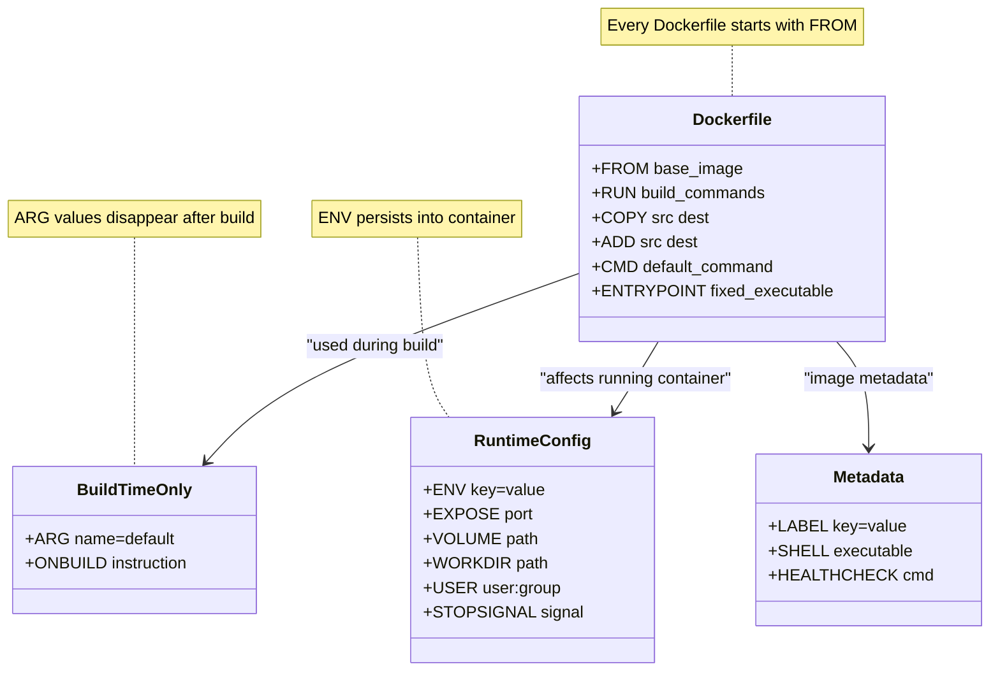
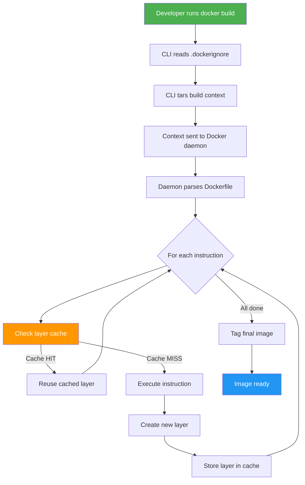

# File 5: Dockerfile Mastery

**Topic:** Every Dockerfile Instruction in Depth, Build Context, .dockerignore

**WHY THIS MATTERS:**
The Dockerfile is the blueprint for every container image you will ever build. Understanding each instruction — what it does, when the layer is cached, what flags it accepts — is the difference between a 2 GB bloated image and a 45 MB lean production artifact. Mastering Dockerfiles means faster builds, smaller images, fewer vulnerabilities, and reproducible deployments.

---

## Story

Imagine a famous dhaba (roadside restaurant) in Punjab. The head chef has a thick recipe book. Every dish starts with a BASE RECIPE (FROM) — "start with roti dough". Then come the COOKING STEPS (RUN) — "knead for 5 minutes, let it rest". The INGREDIENTS are brought from the store to the kitchen counter (COPY / ADD). The SERVING INSTRUCTIONS (CMD) say "serve hot with dal". And the ENTRYPOINT is the non-negotiable rule: "everything leaves the kitchen on a steel thali". The ENV is the spice rack — always accessible. ARG is the customer's special request slip that is only valid while the dish is being cooked. EXPOSE is the window number where the dish will be handed out. WORKDIR is which counter in the kitchen you are working at. USER is which cook is handling the dish. HEALTHCHECK is the taste-test before serving. This recipe book IS your Dockerfile.

---

## Example Block 1 — The Build Context

### Section 1 — What Is the Build Context?

**WHY:** When you run `docker build`, Docker tars up everything in the path you specify and sends it to the Docker daemon. That tarball is the "build context". If your project has 2 GB of node_modules sitting there, all 2 GB get sent — even if your Dockerfile never references them.

**SYNTAX:**
```bash
docker build [OPTIONS] PATH | URL | -
```

**EXAMPLE — build from current directory:**
```bash
docker build -t myapp:1.0 .
# The "." is the build context — current directory
```

**EXAMPLE — build from a subdirectory:**
```bash
docker build -t myapp:1.0 ./app
# Only files inside ./app are available to COPY / ADD
```

**EXAMPLE — build from a URL (Git repo):**
```bash
docker build -t myapp:1.0 https://github.com/user/repo.git#main
# Docker clones the repo and uses it as context
```

**WHAT HAPPENS INTERNALLY:**
1. Docker CLI tars the build context directory
2. Tar is sent to Docker daemon via API
3. Daemon unpacks it into a temporary directory
4. Each instruction in the Dockerfile runs against this context
5. Context is deleted after the build

### Section 2 — .dockerignore

**WHY:** Just like .gitignore keeps junk out of your repo, .dockerignore keeps junk out of your build context. Smaller context = faster builds.

**FILE:** `.dockerignore` (place in the root of your build context)

**EXAMPLE CONTENTS:**
```
node_modules
.git
.env
*.log
dist/
coverage/
.DS_Store
Dockerfile
docker-compose*.yml
```

**PATTERN SYNTAX:**

| Pattern | Meaning |
|---------|---------|
| `*`     | Matches any sequence of non-separator characters |
| `?`     | Matches any single non-separator character |
| `**`    | Matches any number of directories |
| `!`     | Exception (negate a previous ignore) |

**EXAMPLE with exception:**
```
*.md
!README.md
# Ignore all markdown EXCEPT README.md
```

---

## Example Block 2 — Dockerfile Instructions (Every Single One)

### Section 3 — FROM

**WHY:** Every Dockerfile MUST start with FROM. It sets the base image — the foundation on which all subsequent layers are built.

**SYNTAX:**
```dockerfile
FROM [--platform=<platform>] <image>[:<tag>|@<digest>] [AS <name>]
```

**EXAMPLES:**
```dockerfile
FROM node:20-alpine                   # Use Node 20 on Alpine Linux
FROM ubuntu:22.04                     # Use Ubuntu 22.04
FROM python:3.12-slim AS builder      # Named stage for multi-stage build
FROM scratch                          # Empty image — used for static binaries
FROM --platform=linux/amd64 node:20   # Force AMD64 even on ARM Mac
```

**KEY POINTS:**
- tag defaults to "latest" if omitted (BAD PRACTICE — always pin a version)
- Multi-stage builds use multiple FROM instructions
- `AS <name>` lets you reference this stage later with `--from=<name>`

### Section 4 — RUN

**WHY:** RUN executes commands during BUILD time. Each RUN creates a new layer. Combining commands with `&&` reduces layer count and image size.

**SYNTAX (shell form):**
```dockerfile
RUN <command>
# Executed via /bin/sh -c on Linux, cmd /S /C on Windows
```

**SYNTAX (exec form):**
```dockerfile
RUN ["executable", "param1", "param2"]
# No shell processing — no variable expansion
```

**EXAMPLES:**
```dockerfile
RUN apt-get update && apt-get install -y curl
RUN npm ci --only=production
RUN addgroup -S appgroup && adduser -S appuser -G appgroup
```

**BEST PRACTICE — combine commands to reduce layers:**
```dockerfile
RUN apt-get update \
    && apt-get install -y --no-install-recommends curl wget \
    && rm -rf /var/lib/apt/lists/*
# Single layer, and cache cleaned at the end
```

**ANTI-PATTERN:**
```dockerfile
RUN apt-get update
RUN apt-get install -y curl
# Two layers. If the first is cached but packages changed, stale data.
```

### Section 5 — COPY and ADD

**WHY:** COPY brings files from build context into the image. ADD does the same but also supports URLs and auto-extracts tar archives. Prefer COPY unless you specifically need ADD's extra features.

**COPY — bring ingredients from the store to the kitchen:**

**SYNTAX:**
```dockerfile
COPY [--chown=<user>:<group>] [--chmod=<perms>] <src>... <dest>
COPY [--from=<name|index>] <src>... <dest>
```

**EXAMPLES:**
```dockerfile
COPY package.json package-lock.json ./    # Copy two files to WORKDIR
COPY . .                                   # Copy entire context to WORKDIR
COPY --chown=node:node . /app              # Set ownership during copy
COPY --from=builder /app/dist ./dist       # Copy from a previous build stage
```

**ADD — like COPY but with superpowers (use sparingly):**

**SYNTAX:**
```dockerfile
ADD [--chown=<user>:<group>] <src>... <dest>
```

**EXTRA FEATURES vs COPY:**
- Auto-extracts .tar, .tar.gz, .tar.bz2, .tar.xz into `<dest>`
- Can fetch from URLs (but prefer curl in RUN for caching control)

**EXAMPLES:**
```dockerfile
ADD app.tar.gz /app/                       # Extracts automatically
ADD https://example.com/file.txt /tmp/     # Downloads (no cache control!)
```

### Section 6 — CMD and ENTRYPOINT

**WHY:** CMD sets the DEFAULT command when a container starts. ENTRYPOINT sets the FIXED executable. Together they define container runtime behavior.

**CMD — serving instructions (default command at runtime):**

**SYNTAX (exec form — PREFERRED):**
```dockerfile
CMD ["executable", "param1", "param2"]
```

**SYNTAX (shell form):**
```dockerfile
CMD command param1 param2
```

**SYNTAX (as default params to ENTRYPOINT):**
```dockerfile
CMD ["param1", "param2"]
```

**EXAMPLES:**
```dockerfile
CMD ["node", "server.js"]
CMD ["npm", "start"]
```

**KEY POINTS:**
- Only the LAST CMD in a Dockerfile takes effect
- CMD can be overridden at runtime: `docker run myapp <new-command>`

**ENTRYPOINT — the non-negotiable thali rule:**

**SYNTAX (exec form — PREFERRED):**
```dockerfile
ENTRYPOINT ["executable", "param1"]
```

**SYNTAX (shell form):**
```dockerfile
ENTRYPOINT command param1
```

**EXAMPLE — combined with CMD:**
```dockerfile
ENTRYPOINT ["node"]
CMD ["server.js"]
# Container runs: node server.js
# Override at runtime: docker run myapp app.js  →  node app.js
```

**INTERACTION TABLE:**

|                  | No ENTRYPOINT      | ENTRYPOINT ["ep"]    |
|------------------|--------------------|----------------------|
| No CMD           | error              | ep                   |
| CMD ["c1","c2"]  | c1 c2              | ep c1 c2             |
| docker run arg   | arg                | ep arg               |

### Section 7 — ENV and ARG

**WHY:** ENV sets environment variables available at BUILD time AND at RUNTIME. ARG sets variables available ONLY at build time — gone once the image is built.

**ENV — the spice rack (available build + runtime):**

**SYNTAX:**
```dockerfile
ENV <key>=<value> [<key>=<value> ...]
```

**EXAMPLES:**
```dockerfile
ENV NODE_ENV=production
ENV APP_HOME=/app PORT=3000
```

**USAGE IN SUBSEQUENT INSTRUCTIONS:**
```dockerfile
WORKDIR ${APP_HOME}
RUN echo "Running on port ${PORT}"
```

**ARG — customer's special request (build-time only):**

**SYNTAX:**
```dockerfile
ARG <name>[=<default_value>]
```

**EXAMPLES:**
```dockerfile
ARG NODE_VERSION=20
FROM node:${NODE_VERSION}-alpine

ARG BUILD_DATE
LABEL build-date=${BUILD_DATE}
```

**PASS AT BUILD TIME:**
```bash
docker build --build-arg NODE_VERSION=18 -t myapp .
docker build --build-arg BUILD_DATE=$(date -u +%Y-%m-%dT%H:%M:%SZ) -t myapp .
```

**KEY DIFFERENCE:**
- **ARG** — available only during build, NOT in running container
- **ENV** — persists into the running container as an environment variable

### Section 8 — EXPOSE

**WHY:** EXPOSE documents which ports the container listens on. It does NOT actually publish the port — that requires `-p` at runtime.

**SYNTAX:**
```dockerfile
EXPOSE <port>[/<protocol>]
```

**EXAMPLES:**
```dockerfile
EXPOSE 3000            # TCP by default
EXPOSE 3000/tcp
EXPOSE 3000/udp
EXPOSE 8080 8443       # Multiple ports
```

**TO ACTUALLY PUBLISH:**
```bash
docker run -p 3000:3000 myapp       # Map host:container
docker run -P myapp                 # Publish all EXPOSE'd ports to random host ports
```

### Section 9 — VOLUME

**WHY:** VOLUME creates a mount point and marks it as holding external data. Data in a VOLUME persists even if the container is removed.

**SYNTAX:**
```dockerfile
VOLUME ["/data"]
VOLUME /data /logs
```

**EXAMPLES:**
```dockerfile
VOLUME ["/var/lib/mongodb"]
VOLUME /app/uploads
```

**KEY POINTS:**
- Creates an anonymous volume at the specified path
- Any data written to this path by subsequent instructions is discarded
- Best practice: use named volumes at runtime instead
  ```bash
  docker run -v mydata:/var/lib/mongodb myapp
  ```

### Section 10 — WORKDIR

**WHY:** WORKDIR sets the working directory for RUN, CMD, ENTRYPOINT, COPY, ADD. Like cd-ing into a folder. Use absolute paths.

**SYNTAX:**
```dockerfile
WORKDIR /path/to/dir
```

**EXAMPLES:**
```dockerfile
WORKDIR /app
COPY . .              # Copies into /app
RUN npm install       # Runs inside /app

WORKDIR /app/src      # Can chain — now inside /app/src
```

**KEY POINTS:**
- If the directory does not exist, WORKDIR creates it
- Always prefer WORKDIR over `RUN cd /somewhere && ...`

### Section 11 — USER

**WHY:** Running as root inside a container is a security risk. USER switches to a non-root user for all subsequent instructions and at runtime.

**SYNTAX:**
```dockerfile
USER <user>[:<group>]
USER <UID>[:<GID>]
```

**EXAMPLES:**
```dockerfile
RUN addgroup -S appgroup && adduser -S appuser -G appgroup
USER appuser

USER 1001:1001        # Numeric IDs — preferred for Kubernetes
```

**KEY POINTS:**
- Affects RUN, CMD, ENTRYPOINT instructions that follow
- Always create the user BEFORE switching to it
- Some base images (e.g., node) provide a "node" user already

### Section 12 — LABEL, SHELL, HEALTHCHECK, STOPSIGNAL, ONBUILD

**LABEL — metadata tags on the image:**

**SYNTAX:**
```dockerfile
LABEL <key>=<value> [<key>=<value> ...]
```

**EXAMPLES:**
```dockerfile
LABEL maintainer="dev@example.com"
LABEL version="1.0" description="My Node.js app"
```

**SHELL — change the default shell:**

**SYNTAX:**
```dockerfile
SHELL ["executable", "parameters"]
```

**EXAMPLES:**
```dockerfile
SHELL ["/bin/bash", "-c"]            # Use bash instead of sh
SHELL ["powershell", "-Command"]     # Windows containers
```

**HEALTHCHECK — taste-test before serving:**

**SYNTAX:**
```dockerfile
HEALTHCHECK [OPTIONS] CMD command
HEALTHCHECK NONE
```

**OPTIONS:**

| Option | Default | Description |
|--------|---------|-------------|
| `--interval` | 30s | How often to run the check |
| `--timeout` | 30s | Max time for a single check |
| `--start-period` | 0s | Grace period for container startup |
| `--retries` | 3 | Consecutive failures before "unhealthy" |

**EXAMPLES:**
```dockerfile
HEALTHCHECK --interval=15s --timeout=5s --retries=3 \
  CMD curl -f http://localhost:3000/health || exit 1

HEALTHCHECK CMD node healthcheck.js
```

**CONTAINER STATUS:**
```
starting  →  healthy  (if check passes)
starting  →  unhealthy  (if retries exceeded)
```

**STOPSIGNAL — how to ask the container to stop:**

**SYNTAX:**
```dockerfile
STOPSIGNAL signal
```

**EXAMPLES:**
```dockerfile
STOPSIGNAL SIGTERM       # Default — polite shutdown
STOPSIGNAL SIGQUIT       # Used by nginx for graceful shutdown
STOPSIGNAL 9             # SIGKILL (not recommended — no cleanup)
```

**ONBUILD — trigger for downstream images:**

**SYNTAX:**
```dockerfile
ONBUILD <INSTRUCTION>
```

**EXAMPLES:**
```dockerfile
ONBUILD COPY . /app
ONBUILD RUN npm install

# These instructions do NOT run in this image's build.
# They run when ANOTHER Dockerfile uses FROM this-image.
```

---

## Example Block 3 — docker build Command (Full Flag Reference)

### Section 13 — docker build

**WHY:** The build command is where your Dockerfile becomes an image. Knowing its flags gives you control over caching, tagging, multi-platform builds, etc.

**SYNTAX:**
```bash
docker build [OPTIONS] PATH | URL | -
```

**COMMONLY USED FLAGS:**

| Flag | Description |
|------|-------------|
| `-t, --tag <name:tag>` | Tag the resulting image |
| `-f, --file <path>` | Specify Dockerfile (default: PATH/Dockerfile) |
| `--build-arg <key=value>` | Set build-time variables (ARG) |
| `--no-cache` | Do not use cache for any layer |
| `--pull` | Always pull the base image before building |
| `--target <stage>` | Build up to a specific stage in multi-stage |
| `--platform <os/arch>` | Set target platform (e.g., linux/amd64) |
| `--progress <type>` | Output type: auto, plain, tty |
| `--secret <id=id,src=path>` | Expose a secret file to the build |
| `--ssh <default\|id=path>` | Expose SSH agent or keys to the build |
| `--label <key=value>` | Set metadata labels |
| `--network <mode>` | Set networking mode during build |
| `--compress` | Compress build context using gzip |
| `--squash` | Squash all layers into one (experimental) |
| `-q, --quiet` | Suppress build output, print image ID |

**EXAMPLES:**
```bash
docker build -t myapp:1.0 .
docker build -t myapp:prod -f Dockerfile.prod .
docker build --build-arg NODE_VERSION=18 -t myapp .
docker build --no-cache --pull -t myapp:fresh .
docker build --target builder -t myapp:build-stage .
docker build --platform linux/amd64,linux/arm64 -t myapp .
```

**EXPECTED OUTPUT:**
```
[+] Building 23.4s (12/12) FINISHED
 => [internal] load build definition from Dockerfile        0.0s
 => [internal] load .dockerignore                           0.0s
 => [internal] load metadata for docker.io/library/node:20  1.2s
 => [1/6] FROM docker.io/library/node:20-alpine@sha256:...  3.1s
 => [2/6] WORKDIR /app                                      0.1s
 => [3/6] COPY package*.json ./                             0.1s
 => [4/6] RUN npm ci                                       15.2s
 => [5/6] COPY . .                                          0.3s
 => [6/6] RUN npm run build                                 3.2s
 => exporting to image                                      0.2s
 => => naming to docker.io/library/myapp:1.0                0.0s
```

### Section 14 — docker buildx build (BuildKit)

**WHY:** buildx is the next-generation builder. It supports multi-platform builds, advanced caching, and build secrets natively.

**SYNTAX:**
```bash
docker buildx build [OPTIONS] PATH
```

**ADDITIONAL FLAGS (beyond docker build):**

| Flag | Description |
|------|-------------|
| `--push` | Push image to registry after build |
| `--load` | Load into local docker images |
| `--cache-from <type=...>` | External cache source |
| `--cache-to <type=...>` | External cache destination |
| `--builder <name>` | Specify builder instance |
| `--output <type=...>` | Output destination (local, tar, registry) |
| `--sbom <bool>` | Generate SBOM attestation |
| `--provenance <bool>` | Generate provenance attestation |

**EXAMPLES:**
```bash
# Multi-platform build and push
docker buildx build --platform linux/amd64,linux/arm64 \
  -t user/myapp:1.0 --push .

# Build with GitHub Actions cache
docker buildx build \
  --cache-from type=gha \
  --cache-to type=gha,mode=max \
  -t myapp:ci .

# Build and export as tar
docker buildx build --output type=tar,dest=myapp.tar .

# Create a builder for multi-platform
docker buildx create --name mybuilder --use
docker buildx inspect --bootstrap
```

---

## Example Block 4 — Mermaid Diagrams

### Section 15 — Dockerfile Instructions Class Diagram



### Section 16 — Docker Build Process Flowchart



---

## Example Block 5 — Complete Real-World Dockerfile

### Section 17 — Multi-stage Production Dockerfile

```dockerfile
# ---------- Stage 1: Build ----------
FROM node:20-alpine AS builder
ARG NODE_ENV=production
ENV NODE_ENV=${NODE_ENV}
WORKDIR /app

# Copy dependency files first (cache-friendly)
COPY package.json package-lock.json ./
RUN npm ci --only=production && npm cache clean --force

# Copy source and build
COPY . .
RUN npm run build

# ---------- Stage 2: Production ----------
FROM node:20-alpine AS production
LABEL maintainer="team@example.com"
LABEL version="1.0"

# Security: create non-root user
RUN addgroup -S appgroup && adduser -S appuser -G appgroup

WORKDIR /app

# Copy ONLY what we need from builder
COPY --from=builder --chown=appuser:appgroup /app/dist ./dist
COPY --from=builder --chown=appuser:appgroup /app/node_modules ./node_modules
COPY --from=builder --chown=appuser:appgroup /app/package.json ./

# Runtime configuration
ENV PORT=3000
EXPOSE 3000

# Health check
HEALTHCHECK --interval=30s --timeout=5s --retries=3 \
  CMD wget --no-verbose --tries=1 --spider http://localhost:3000/health || exit 1

# Switch to non-root user
USER appuser

# Start application
CMD ["node", "dist/server.js"]
```

---

## Example Block 6 — Layer Caching Strategy

### Section 18 — Understanding Layer Cache

**WHY:** Docker caches each layer. If an instruction and its inputs have not changed, the cached layer is reused. Once a cache miss occurs, ALL subsequent layers are rebuilt. Order matters enormously.

**GOOD ORDER (dependencies change less often than source code):**
```dockerfile
FROM node:20-alpine
WORKDIR /app
COPY package.json package-lock.json ./     # changes rarely
RUN npm ci                                  # cached if package.json unchanged
COPY . .                                    # source changes frequently
RUN npm run build                           # rebuilds only when source changes
```

**BAD ORDER:**
```dockerfile
FROM node:20-alpine
WORKDIR /app
COPY . .                                    # ANY file change busts cache
RUN npm ci                                  # always re-runs
RUN npm run build                           # always re-runs
```

**RESULT:**
- Good order: ~5 second rebuild when only source changes
- Bad order: ~60 second rebuild every time (npm ci re-runs)

---

## Key Takeaways

1. **FROM** is the foundation — always pin a specific tag (never use `:latest` in production).

2. **RUN** creates layers — combine commands with `&&` and clean up in the same layer to keep images small.

3. **COPY over ADD** — use COPY unless you need tar extraction or URL fetch.

4. **CMD vs ENTRYPOINT** — CMD is the default (overridable), ENTRYPOINT is the fixed executable. Together they form the complete command.

5. **ARG** is build-time only, **ENV** persists into the running container.

6. **EXPOSE** documents ports but does NOT publish them — use `-p` at runtime.

7. **USER** — always switch to a non-root user for security.

8. **HEALTHCHECK** — define it so orchestrators know if your app is alive.

9. **Layer caching** — put rarely-changing instructions first (dependencies before source code).

10. **.dockerignore** — always include it to keep build context small and prevent secrets from leaking into images.

11. **Multi-stage builds** — use multiple FROM stages to separate build tools from the final production image, drastically reducing size.

12. **docker buildx** — use it for multi-platform builds, advanced caching, and CI/CD pipelines.
