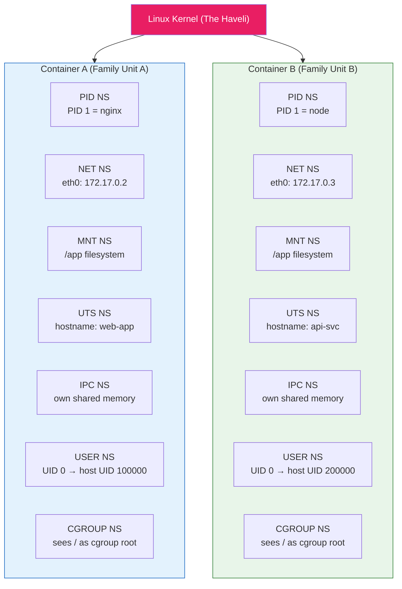
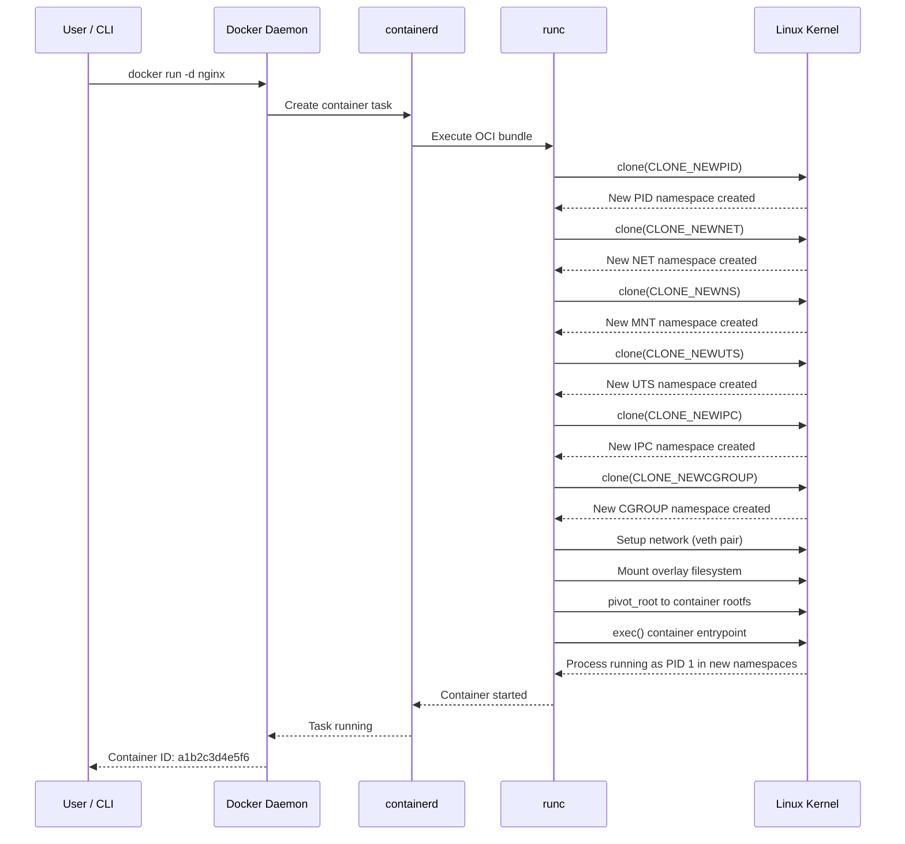

# File 6: Linux Namespaces Deep Dive

**Topic:** PID, NET, MNT, UTS, IPC, USER, Cgroup Namespaces — How Containers Get Isolation

**WHY THIS MATTERS:**
Containers are NOT virtual machines. They are just regular Linux processes with restricted views of the system. That restricted view is achieved through NAMESPACES — a kernel feature that partitions system resources so that one set of processes sees one set of resources, and another set of processes sees a different set. Without understanding namespaces, you cannot reason about container security, networking, or why "it works on my machine" sometimes still happens with containers.

---

## Story

Picture a grand old haveli (mansion) in Rajasthan. One big building, one foundation, one roof — this is the Linux KERNEL. Inside the haveli, a joint family lives. But each family unit (each namespace) has been given its OWN:

- **Kitchen (MNT namespace)** — each unit has its own pantry and stove; you cannot see or touch another unit's food supplies.
- **Nameplate (UTS namespace)** — each unit can put their own family name on their door, independent of what the building is officially called.
- **Finances (USER namespace)** — within their unit, someone can be the "head of household" (UID 0 / root), but they have no financial authority in other units or in the haveli administration.
- **Intercom (IPC namespace)** — each unit has its own internal intercom system. Messages on Unit A's intercom do not leak to Unit B.
- **Guest register (PID namespace)** — each unit maintains its own guest numbering. "Guest #1" in Unit A is a different person from "Guest #1" in Unit B.
- **Garden gate (NET namespace)** — each unit has its own entrance, own doorbell, own address. Visitors ring the right bell.
- **Electricity meter (CGROUP namespace)** — each unit sees only their own meter, not the building's total consumption.

The haveli is ONE building (one kernel), but each unit is ISOLATED. That is exactly what Docker does with namespaces.

---

## Example Block 1 — Overview of All 7 Namespace Types

### Section 1 — The Seven Namespaces

**WHY:** Each namespace type isolates a specific kernel resource. Together they create the illusion of a separate machine.

| Type     | What It Isolates            | Haveli Analogy |
|----------|-----------------------------|----------------|
| PID      | Process IDs                 | Guest register (own numbering) |
| NET      | Network stack               | Garden gate (own entrance) |
| MNT      | Filesystem mount points     | Kitchen (own pantry) |
| UTS      | Hostname and domain name    | Nameplate (own family name) |
| IPC      | Inter-process communication | Intercom (own system) |
| USER     | User and group IDs          | Finances (own authority) |
| CGROUP   | Cgroup root directory view  | Electricity meter (own meter) |

**KERNEL FLAGS (used in clone() system call):**

| Flag | Purpose |
|------|---------|
| `CLONE_NEWPID` | new PID namespace |
| `CLONE_NEWNET` | new network namespace |
| `CLONE_NEWNS` | new mount namespace (NS = the original, hence "NS") |
| `CLONE_NEWUTS` | new UTS namespace |
| `CLONE_NEWIPC` | new IPC namespace |
| `CLONE_NEWUSER` | new user namespace |
| `CLONE_NEWCGROUP` | new cgroup namespace |

---

## Example Block 2 — PID Namespace

### Section 2 — PID Namespace

**WHY:** In a PID namespace, the first process gets PID 1. It cannot see processes outside its namespace. This is why `ps aux` inside a container shows only the container's processes.

**HOW IT WORKS:**
- The first process in a new PID namespace gets PID 1
- Processes inside cannot see PIDs outside their namespace
- The host CAN see all PIDs (namespaces are hierarchical)

**DEMO — Create a new PID namespace with unshare:**
```bash
sudo unshare --pid --fork --mount-proc bash
# Now inside a new PID namespace:
ps aux
# OUTPUT:
#   PID TTY      STAT   TIME COMMAND
#     1 pts/0    S      0:00 bash        ← PID 1 is our bash!
#     2 pts/0    R+     0:00 ps aux
exit
```

**DOCKER EQUIVALENT:**
```bash
docker run --rm alpine ps aux
# OUTPUT:
#   PID   USER     TIME  COMMAND
#     1   root     0:00  ps aux    ← PID 1 inside the container
```

**HOST VIEW (simultaneously):**
```bash
ps aux | grep "ps aux"
# Shows the same process but with a DIFFERENT PID (e.g., 48231)
```

**WHY PID 1 MATTERS:**
- PID 1 receives all orphaned processes
- PID 1 must handle SIGTERM / SIGINT properly (signal forwarding)
- If PID 1 dies, the entire namespace (container) is destroyed
- This is why proper signal handling in your app is critical

---

## Example Block 3 — Network Namespace

### Section 3 — NET Namespace

**WHY:** Each container gets its own network stack — own IP address, own routing table, own firewall rules. This is how multiple containers can all listen on port 80 without conflict.

**HOW IT WORKS:**
- New network namespace starts with ONLY a loopback interface (lo)
- Docker creates a veth (virtual ethernet) pair: one end inside the container, other end on the docker0 bridge
- Container gets its own IP from Docker's subnet (usually 172.17.0.0/16)

**DEMO — Create a network namespace manually:**
```bash
# Create the namespace
sudo ip netns add my_netns

# List namespaces
ip netns list
# OUTPUT: my_netns

# Run a command inside the namespace
sudo ip netns exec my_netns ip addr
# OUTPUT: only loopback (lo), no eth0
#   1: lo: <LOOPBACK> mtu 65536 ...
#       inet 127.0.0.1/8 scope host lo

# Create a veth pair and connect it
sudo ip link add veth0 type veth peer name veth1
sudo ip link set veth1 netns my_netns
sudo ip addr add 10.0.0.1/24 dev veth0
sudo ip netns exec my_netns ip addr add 10.0.0.2/24 dev veth1
sudo ip link set veth0 up
sudo ip netns exec my_netns ip link set veth1 up

# Now ping between namespaces
ping 10.0.0.2     # From host to namespace
sudo ip netns exec my_netns ping 10.0.0.1  # From namespace to host

# Cleanup
sudo ip netns delete my_netns
```

**DOCKER EQUIVALENT:**
```bash
docker run --rm alpine ip addr
# Shows eth0 with a 172.17.x.x address — Docker did the veth setup for you

# Containers on same network can talk:
docker network create mynet
docker run -d --name web --network mynet nginx
docker run --rm --network mynet alpine ping web   # Works!
```

---

## Example Block 4 — Mount Namespace

### Section 4 — MNT Namespace

**WHY:** The mount namespace gives each container its own filesystem tree. Changes to mounts inside the container do not affect the host.

**HOW IT WORKS:**
- New mount namespace inherits a COPY of the parent's mount table
- New mounts/unmounts are private to the namespace
- Docker uses this + OverlayFS to give each container its own rootfs

**DEMO:**
```bash
sudo unshare --mount bash
# Inside the new namespace:
mount -t tmpfs none /mnt
ls /mnt                         # Empty tmpfs
echo "hello" > /mnt/test.txt    # Write something
# EXIT the namespace
exit
ls /mnt/test.txt                # File does NOT exist on host!
```

**DOCKER EQUIVALENT:**
```bash
docker run --rm -v mydata:/data alpine sh -c "echo hi > /data/file.txt"
# The volume mount is a mount namespace operation
# /data is visible inside the container but the mount point is isolated
```

**MOUNT PROPAGATION:**
- `private` — mounts are private (default in Docker)
- `shared` — mounts propagate both ways
- `slave` — mounts propagate host → container only
- Docker flag: `--mount type=bind,src=/host,dst=/container,bind-propagation=shared`

---

## Example Block 5 — UTS Namespace

### Section 5 — UTS Namespace

**WHY:** UTS lets each container have its own hostname. The "UTS" name comes from the Unix Time-Sharing system — it isolates hostname and domain name.

**DEMO:**
```bash
hostname                           # Shows host's name, e.g., "macbook-pro"
sudo unshare --uts bash
hostname my-container
hostname                           # Shows "my-container"
exit
hostname                           # Back to "macbook-pro"
```

**DOCKER EQUIVALENT:**
```bash
docker run --rm alpine hostname
# OUTPUT: a1b2c3d4e5f6  (container ID as default hostname)

docker run --rm --hostname my-app alpine hostname
# OUTPUT: my-app

docker run --rm --hostname my-app alpine cat /etc/hostname
# OUTPUT: my-app
```

---

## Example Block 6 — IPC Namespace

### Section 6 — IPC Namespace

**WHY:** IPC namespace isolates inter-process communication objects — shared memory segments, message queues, semaphores. One container's shared memory is invisible to another.

**HOW IT WORKS:**
- System V IPC objects (shmget, msgget, semget) are namespaced
- POSIX message queues (mq_open) are also namespaced
- Each container gets a clean IPC space

**DEMO:**
```bash
# On host, create a message queue
ipcmk -Q
ipcs -q              # Shows the queue

# Inside a container
docker run --rm alpine sh -c "ipcs -q"
# OUTPUT: empty — container cannot see host's queues
```

**SHARING IPC (when needed):**
```bash
docker run --rm --ipc=host alpine ipcs -q
# Now the container CAN see host IPC objects (use with caution)

# Share between containers:
docker run -d --name producer --ipc=shareable alpine sleep 3600
docker run --rm --ipc=container:producer alpine ipcs
```

---

## Example Block 7 — USER Namespace

### Section 7 — USER Namespace

**WHY:** The user namespace maps UIDs/GIDs inside the container to different UIDs/GIDs on the host. A process can be root (UID 0) inside the container but actually be UID 100000 on the host — drastically reducing the impact of a container escape.

**HOW IT WORKS:**
- UID 0 inside → mapped to UID 100000 (or similar) on host
- Even if a process escapes, it has no privileges on the host
- Configured via `/etc/subuid` and `/etc/subgid`

**DEMO:**
```bash
# Create a user namespace where you become "root"
unshare --user --map-root-user bash
whoami                  # root
id                      # uid=0(root) gid=0(root)
# But on the host, this process runs as your regular user!
# Check from another terminal:
ps -o user,pid,command -p <PID>
# Shows your regular username, not root
```

**DOCKER WITH USER NAMESPACES (rootless mode):**

Enable in `/etc/docker/daemon.json`:
```json
{
  "userns-remap": "default"
}
```
Now containers run as remapped UIDs on the host.

Or use rootless Docker entirely:
```bash
dockerd-rootless-setup.sh install
# Docker daemon itself runs as non-root
```

**SUBUID/SUBGID MAPPING:**
```bash
cat /etc/subuid
# OUTPUT: dockremap:100000:65536
# User "dockremap" gets UIDs 100000-165535 for container use
```

---

## Example Block 8 — CGROUP Namespace

### Section 8 — CGROUP Namespace

**WHY:** The cgroup namespace virtualizes the view of `/proc/self/cgroup`. Inside the container, cgroup paths appear as if the container is at the root — it cannot see the host's cgroup hierarchy.

**HOW IT WORKS:**
- Without cgroup namespace: container sees full cgroup path (e.g., `/sys/fs/cgroup/docker/<container-id>/`)
- With cgroup namespace: container sees "/" as its cgroup root
- Prevents container from discovering host's cgroup structure

**DEMO:**
```bash
# On host:
cat /proc/self/cgroup
# OUTPUT: 0::/user.slice/user-1000.slice/session-2.scope

# Inside container:
docker run --rm alpine cat /proc/self/cgroup
# OUTPUT: 0::/
# Container thinks it is at the cgroup root

# With cgroupns mode:
docker run --rm --cgroupns=host alpine cat /proc/self/cgroup
# OUTPUT: 0::/docker/<container-id>   (can see host path — not recommended)
```

---

## Example Block 9 — How Docker Creates Namespaces

### Section 9 — Inspecting Container Namespaces

**WHY:** Understanding how to inspect namespaces helps with debugging networking issues, permission problems, and security audits.

**EVERY PROCESS HAS NAMESPACE LINKS:**
```bash
ls -la /proc/self/ns/
# OUTPUT:
#   cgroup -> cgroup:[4026531835]
#   ipc    -> ipc:[4026531839]
#   mnt    -> mnt:[4026531840]
#   net    -> net:[4026531992]
#   pid    -> pid:[4026531836]
#   user   -> user:[4026531837]
#   uts    -> uts:[4026531838]
# The number in brackets is the namespace inode — unique identifier
```

**COMPARE HOST AND CONTAINER NAMESPACES:**
```bash
# Start a container
docker run -d --name test-ns alpine sleep 3600

# Get the container's PID on the host
CONTAINER_PID=$(docker inspect --format '{{.State.Pid}}' test-ns)
echo $CONTAINER_PID    # e.g., 12345

# Compare namespace inodes
ls -la /proc/1/ns/net          # Host's network namespace
ls -la /proc/$CONTAINER_PID/ns/net   # Container's network namespace
# DIFFERENT inode numbers = different namespaces = isolated

# Cleanup
docker rm -f test-ns
```

### Section 10 — nsenter: Entering a Container's Namespaces

**WHY:** nsenter lets you jump into a running container's namespaces from the host. More powerful than docker exec because you can choose WHICH namespaces.

**SYNTAX:**
```bash
nsenter [OPTIONS] [PROGRAM [ARGS]]
```

**OPTIONS:**

| Flag | Description |
|------|-------------|
| `-t, --target <pid>` | Target process PID |
| `-m, --mount` | Enter mount namespace |
| `-u, --uts` | Enter UTS namespace |
| `-i, --ipc` | Enter IPC namespace |
| `-n, --net` | Enter network namespace |
| `-p, --pid` | Enter PID namespace |
| `-U, --user` | Enter user namespace |
| `-C, --cgroup` | Enter cgroup namespace |
| `-a, --all` | Enter all namespaces |

**EXAMPLES:**
```bash
# Enter ALL namespaces of a container
CPID=$(docker inspect --format '{{.State.Pid}}' mycontainer)
sudo nsenter -t $CPID -a bash
# You are now "inside" the container at the namespace level

# Enter ONLY the network namespace (debug networking)
sudo nsenter -t $CPID -n ip addr
# See the container's network interfaces without entering fully

# Enter ONLY the PID namespace
sudo nsenter -t $CPID -p -r ps aux
# See the container's process tree

# This is useful when the container has no shell (e.g., distroless images)
```

---

## Example Block 10 — unshare Command Reference

### Section 11 — unshare: Create New Namespaces

**WHY:** unshare is the user-space tool for creating namespaces. It is essentially what the kernel does when Docker starts a container.

**SYNTAX:**
```bash
unshare [OPTIONS] [PROGRAM [ARGS]]
```

**OPTIONS:**

| Flag | Description |
|------|-------------|
| `--mount` | Unshare mount namespace |
| `--uts` | Unshare UTS namespace |
| `--ipc` | Unshare IPC namespace |
| `--net` | Unshare network namespace |
| `--pid` | Unshare PID namespace |
| `--user` | Unshare user namespace |
| `--cgroup` | Unshare cgroup namespace |
| `--fork` | Fork before executing (needed with --pid) |
| `--mount-proc` | Mount a new /proc (needed with --pid to see correct PIDs) |
| `--map-root-user` | Map current user to root in user namespace |

**BUILDING A CONTAINER FROM SCRATCH (step by step):**
```bash
# Step 1: Create all namespaces
sudo unshare --mount --uts --ipc --net --pid --fork --mount-proc bash

# Step 2: Set hostname
hostname my-tiny-container
hostname
# OUTPUT: my-tiny-container

# Step 3: Check PID isolation
ps aux
# OUTPUT: only bash (PID 1) and ps (PID 2)

# Step 4: Check network isolation
ip addr
# OUTPUT: only loopback interface

# You just built a "container" without Docker!
exit
```

---

## Example Block 11 — Mermaid Diagrams

### Section 12 — Namespace Types and Isolation



### Section 13 — Namespace Creation Sequence



---

## Example Block 12 — Practical Debugging

### Section 14 — Namespace Debugging Recipes

**WHY:** When networking breaks, when files disappear, when permissions fail — understanding namespaces is how you debug these issues.

**RECIPE 1 — Debug networking from the container's perspective:**
```bash
CPID=$(docker inspect -f '{{.State.Pid}}' mycontainer)
sudo nsenter -t $CPID -n ss -tlnp
# See what ports the container is actually listening on
```

**RECIPE 2 — Check if two containers share a namespace:**
```bash
docker inspect -f '{{.NetworkSettings.SandboxKey}}' container1
docker inspect -f '{{.NetworkSettings.SandboxKey}}' container2
# If the paths match, they share a network namespace
```

**RECIPE 3 — Run tcpdump on a container's network:**
```bash
CPID=$(docker inspect -f '{{.State.Pid}}' mycontainer)
sudo nsenter -t $CPID -n tcpdump -i eth0 -n port 80
# Capture traffic without installing tcpdump in the container
```

**RECIPE 4 — Debug a distroless container (no shell):**
```bash
CPID=$(docker inspect -f '{{.State.Pid}}' mycontainer)
sudo nsenter -t $CPID -a -r /bin/sh
# This fails for distroless. Instead use:
docker run --rm -it --pid=container:mycontainer --net=container:mycontainer \
  nicolaka/netshoot bash
# netshoot is a debug container with all the tools
```

**RECIPE 5 — Check all namespace IDs for a container:**
```bash
CPID=$(docker inspect -f '{{.State.Pid}}' mycontainer)
ls -la /proc/$CPID/ns/
# Compare with host: ls -la /proc/1/ns/
```

---

## Example Block 13 — Namespace Sharing in Docker

### Section 15 — Sharing Namespaces Between Containers

**WHY:** Sometimes you WANT containers to share namespaces — e.g., a sidecar pattern where a log collector shares the PID namespace with the main app.

**SHARE PID NAMESPACE:**
```bash
docker run -d --name app nginx
docker run --rm --pid=container:app alpine ps aux
# The second container can see nginx's processes!
# Used for: debugging, log collection, process monitoring sidecars
```

**SHARE NETWORK NAMESPACE:**
```bash
docker run -d --name app nginx
docker run --rm --net=container:app alpine wget -qO- http://localhost
# The second container shares the SAME network stack
# Used for: Kubernetes pod networking (all containers in a pod share NET)
```

**SHARE IPC NAMESPACE:**
```bash
docker run -d --name producer --ipc=shareable myapp
docker run --rm --ipc=container:producer consumer-app
# Used for: high-performance inter-process shared memory
```

**USE HOST NAMESPACE:**
```bash
docker run --rm --net=host alpine ip addr
# Container uses the HOST's network stack directly
# No isolation, but useful for network monitoring tools

docker run --rm --pid=host alpine ps aux
# Container sees ALL host processes
```

---

## Key Takeaways

1. Containers are **NOT VMs** — they are just processes with restricted views, achieved through 7 namespace types.

2. **PID namespace:** each container gets PID 1. PID 1 must handle signals.

3. **NET namespace:** each container gets its own network stack. Docker connects them with veth pairs to the docker0 bridge.

4. **MNT namespace:** each container has its own filesystem. OverlayFS provides the filesystem content; the namespace provides isolation.

5. **UTS namespace:** each container can have its own hostname.

6. **IPC namespace:** shared memory and message queues are isolated.

7. **USER namespace:** UID 0 inside the container maps to an unprivileged UID on the host — the foundation of rootless containers.

8. **CGROUP namespace:** container sees only its own resource usage.

9. `unshare` creates namespaces, `nsenter` joins existing ones.

10. `/proc/[pid]/ns/` shows which namespaces a process belongs to. Compare inode numbers to see if two processes share a namespace.

11. Docker uses `clone()` with `CLONE_NEW*` flags via runc to create all namespaces when starting a container.

12. Namespaces can be selectively shared between containers using `--pid=container:X`, `--net=container:X`, `--ipc=container:X`. This is the basis of the Kubernetes pod model.
