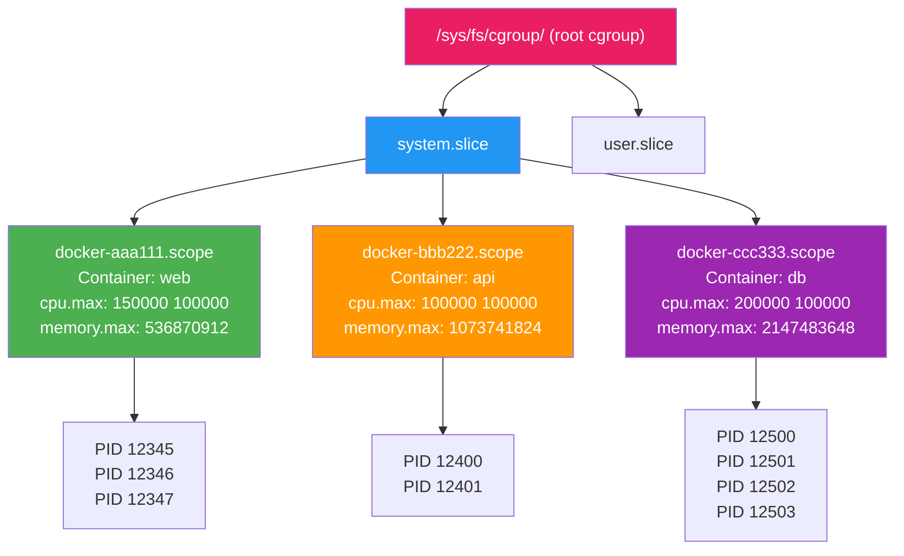
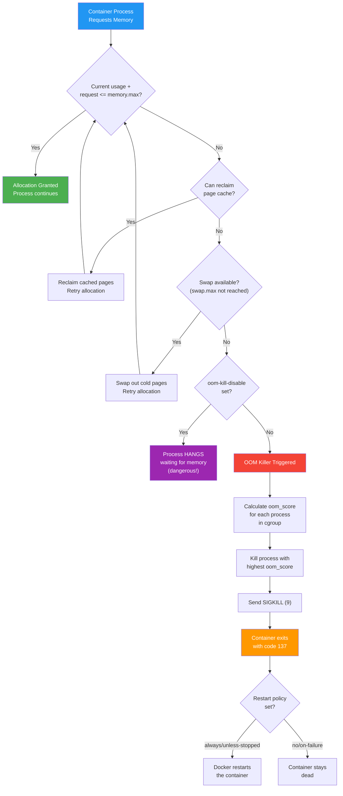

# File 7: Cgroups and Resource Limits

**Topic:** cgroups v1 vs v2, CPU/Memory/IO Limits, OOM Killer, Resource Accounting

**WHY THIS MATTERS:**
Namespaces give containers isolation — they cannot SEE each other. But without resource limits, one container can still STARVE the others by hogging all CPU, memory, or disk I/O. Control Groups (cgroups) are the kernel mechanism that enforces resource limits. Understanding cgroups means you can prevent one misbehaving container from taking down your entire host — which is exactly what happens in production when you do not set limits.

---

## Story

Imagine a large apartment building managed by the electricity board in Mumbai. Each flat has its own electric METER (resource accounting) that tracks consumption. The building has a total capacity of 1000 units. The society has allocated each flat a SHARE — Flat A gets 200 units, Flat B gets 300, Flat C gets 500. If Flat A tries to draw 400 units (exceeding its allocation), the CIRCUIT BREAKER trips (OOM killer) and cuts power to that flat — NOT to the whole building.

- CPU shares    = allocated electricity units
- Memory limit  = the circuit breaker threshold
- OOM Killer    = the circuit breaker mechanism
- IO weight     = bandwidth priority for the building's elevator
- cgroup v1     = old metering system (one meter per resource type)
- cgroup v2     = new unified metering system (single smart meter)

Docker uses cgroups to be the "electricity board" for containers.

---

## Example Block 1 — What Are Cgroups?

### Section 1 — cgroups Fundamentals

**WHY:** cgroups (Control Groups) organize processes into hierarchical groups and apply resource limits to each group. Every Docker container runs inside its own cgroup.

**WHAT CGROUPS CONTROL:**

| Resource   | What Is Controlled                       |
|------------|------------------------------------------|
| CPU        | Time slices, shares, pinning to cores    |
| Memory     | RAM limit, swap limit, OOM behavior      |
| Block I/O  | Disk read/write bandwidth and IOPS       |
| Network    | Bandwidth (via tc, not cgroups directly) |
| PIDs       | Maximum number of processes              |
| Devices    | Access to /dev/* devices                 |
| Freezer    | Pause/resume all processes in group      |

**HOW THEY WORK:**

1. Kernel exposes cgroups as a pseudo-filesystem
2. You create directories = create cgroups
3. You write values to files = set limits
4. You write PIDs to files = assign processes to cgroups
5. Kernel enforces the limits automatically

---

## Example Block 2 — Cgroups V1 vs V2

### Section 2 — v1 vs v2 Architecture

**WHY:** cgroups v1 has separate hierarchies per resource (CPU, memory, etc.). cgroups v2 unifies everything into a single hierarchy. Most modern distros use v2. You need to know both because older systems still use v1.

**CGROUPS V1 (legacy):**

- Separate hierarchy per controller (cpu, memory, blkio, etc.)
- A process can be in different cgroups for different controllers
- Filesystem: `/sys/fs/cgroup/<controller>/`
- Example paths:
  - `/sys/fs/cgroup/cpu/docker/<container-id>/cpu.shares`
  - `/sys/fs/cgroup/memory/docker/<container-id>/memory.limit_in_bytes`

**CGROUPS V2 (unified):**

- Single hierarchy for ALL controllers
- A process is in ONE cgroup, which controls everything
- Filesystem: `/sys/fs/cgroup/`
- Example paths:
  - `/sys/fs/cgroup/system.slice/docker-<id>.scope/cpu.max`
  - `/sys/fs/cgroup/system.slice/docker-<id>.scope/memory.max`

**CHECK WHICH VERSION YOUR SYSTEM USES:**

```bash
# Check for v2
mount | grep cgroup2
# If you see "cgroup2 on /sys/fs/cgroup type cgroup2" → v2

# Or check:
stat -fc %T /sys/fs/cgroup/
# "cgroup2fs" → v2
# "tmpfs"     → v1 (multiple controller mounts underneath)

# Docker version info:
docker info | grep -i cgroup
# OUTPUT: Cgroup Driver: systemd    Cgroup Version: 2
```

---

## Example Block 3 — CPU Limits

### Section 3 — CPU Shares, Quota, and Pinning

**WHY:** Without CPU limits, a container running a crypto miner could use 100% of all CPU cores, starving your web server container.

**FLAG: `--cpus=<number>`**

Limit the number of CPU cores a container can use. This is the SIMPLEST and MOST COMMON way to limit CPU.

```
SYNTAX: docker run --cpus=<decimal> <image>
```

```bash
docker run --cpus=0.5 nginx        # Use at most 50% of ONE core
docker run --cpus=2 nginx          # Use at most 2 full cores
docker run --cpus=1.5 nginx        # Use at most 1.5 cores
```

HOW IT WORKS INTERNALLY:
`--cpus=1.5` is equivalent to `--cpu-period=100000 --cpu-quota=150000` (150ms of CPU time per 100ms period)

**FLAG: `--cpu-shares=<weight>`**

Relative weight (proportional sharing, NOT a hard limit). Default is 1024. Only matters when CPU is contested.

```bash
docker run --cpu-shares=512  app-low      # Half default weight
docker run --cpu-shares=2048 app-high     # Double default weight
```

SCENARIO: Host has 1 CPU core, two containers running:
- Container A: `--cpu-shares=1024`
- Container B: `--cpu-shares=3072`
- A gets 25% of CPU, B gets 75% (1024 / 4096 vs 3072 / 4096)
- If B is idle, A can use 100%! Shares are not hard limits.

**FLAG: `--cpuset-cpus=<cores>`**

Pin container to specific CPU cores.

```bash
docker run --cpuset-cpus="0" nginx        # Only core 0
docker run --cpuset-cpus="0,2" nginx      # Cores 0 and 2
docker run --cpuset-cpus="0-3" nginx      # Cores 0, 1, 2, 3
```

**FLAG: `--cpu-period=<microseconds>` and `--cpu-quota=<microseconds>`**

Fine-grained control. Container gets `<quota>` microseconds of CPU time per `<period>` microseconds.

```bash
docker run --cpu-period=100000 --cpu-quota=50000 nginx
# 50ms of CPU per 100ms period = 50% of one core
```

---

## Example Block 4 — Memory Limits

### Section 4 — Memory Limits and the OOM Killer

**WHY:** A memory leak in one container can consume all host RAM, causing the kernel's OOM killer to kill random processes — possibly your database container. Memory limits contain the blast radius.

**FLAG: `--memory=<limit>` (or `-m`)**

Hard memory limit. Container is killed if it exceeds this.

```
SYNTAX: docker run --memory=<amount> <image>
UNITS: b, k, m, g (bytes, kilobytes, megabytes, gigabytes)
```

```bash
docker run --memory=512m nginx         # 512 MB limit
docker run --memory=1g redis           # 1 GB limit
docker run -m 256m alpine stress --vm 1 --vm-bytes 512M
# This will be OOM-killed because it tries to use 512M with a 256M limit
```

**FLAG: `--memory-swap=<limit>`**

Total memory + swap limit.

```bash
docker run --memory=512m --memory-swap=1g nginx
# 512 MB RAM + 512 MB swap = 1 GB total
# If --memory-swap equals --memory, swap is disabled
# If --memory-swap is -1, unlimited swap
```

IMPORTANT BEHAVIOR:
- `--memory=512m` (no `--memory-swap` set) → swap = 2x memory = 1024m total
- `--memory=512m --memory-swap=512m` → swap disabled (total = memory)
- `--memory=512m --memory-swap=0` → same as not setting swap

**FLAG: `--memory-reservation=<soft-limit>`**

Soft limit. Kernel tries to reclaim memory when usage exceeds this, but does NOT kill the container.

```bash
docker run --memory=1g --memory-reservation=512m nginx
# Container can use up to 1 GB but kernel will try to reclaim above 512 MB
```

**FLAG: `--oom-kill-disable`**

Prevent the OOM killer from killing this container. DANGEROUS: if memory runs out, the host may freeze.

```bash
docker run --memory=512m --oom-kill-disable redis
# ONLY use with --memory set, otherwise the host is at risk
```

**FLAG: `--oom-score-adj=<score>`**

Adjust OOM killer priority (-1000 to 1000). Lower = less likely to be killed. Higher = more likely.

```bash
docker run --oom-score-adj=-500 critical-db
```

---

## Example Block 5 — OOM Killer Deep Dive

### Section 5 — How the OOM Killer Decides

**WHY:** When the system runs out of memory, the kernel must kill something. Understanding the OOM killer helps you predict which container dies.

**HOW THE OOM KILLER WORKS:**

1. Container exceeds its `--memory` limit
2. Kernel checks if swap is available
3. If no more memory or swap → OOM event triggered
4. Kernel looks at `oom_score_adj` of each process in the cgroup
5. Process with highest `oom_score` is killed
6. Container exits with code 137 (128 + SIGKILL signal 9)

**DETECTING OOM KILLS:**

```bash
# Check if a container was OOM-killed
docker inspect --format='{{.State.OOMKilled}}' <container>
# OUTPUT: true   (was killed by OOM)

# Check container exit code
docker inspect --format='{{.State.ExitCode}}' <container>
# OUTPUT: 137   (128 + 9 = SIGKILL from OOM)

# Check kernel logs
dmesg | grep -i "oom\|killed process"
# OUTPUT: Memory cgroup out of memory: Killed process 12345 (node)

# Docker events
docker events --filter event=oom
# Real-time stream of OOM events
```

**DEMO — Trigger an OOM kill:**

```bash
docker run --rm --memory=10m alpine sh -c \
  "dd if=/dev/zero of=/dev/null bs=1M count=100"
# This tries to allocate way more than 10 MB
# Container is killed — exit code 137
```

---

## Example Block 6 — Block I/O Limits

### Section 6 — Disk I/O Control

**WHY:** A container doing heavy logging or bulk data processing can saturate the disk, causing other containers to stall on I/O.

**FLAG: `--blkio-weight=<weight>`**

Relative I/O weight (10-1000, default 500). Like CPU shares — proportional, not absolute.

```bash
docker run --blkio-weight=100 low-io-app     # Low priority
docker run --blkio-weight=900 database        # High priority
```

**FLAG: `--device-read-bps=<device>:<rate>`**

Limit read bandwidth from a device.

```bash
docker run --device-read-bps /dev/sda:10mb nginx
# Max 10 MB/s read from /dev/sda
```

**FLAG: `--device-write-bps=<device>:<rate>`**

Limit write bandwidth to a device.

```bash
docker run --device-write-bps /dev/sda:5mb logwriter
# Max 5 MB/s write to /dev/sda
```

**FLAG: `--device-read-iops=<device>:<rate>`**

Limit read I/O operations per second.

```bash
docker run --device-read-iops /dev/sda:1000 nginx
```

**FLAG: `--device-write-iops=<device>:<rate>`**

Limit write I/O operations per second.

```bash
docker run --device-write-iops /dev/sda:500 logwriter
```

**DEMO — Measure the effect:**

```bash
# Without limit:
docker run --rm alpine sh -c "dd if=/dev/zero of=/tmp/test bs=1M count=100 oflag=direct"
# OUTPUT: 100 MB copied, ... 500 MB/s

# With limit:
docker run --rm --device-write-bps /dev/sda:1mb alpine sh -c \
  "dd if=/dev/zero of=/tmp/test bs=1M count=10 oflag=direct"
# OUTPUT: 10 MB copied, ... 1.0 MB/s   ← throttled!
```

---

## Example Block 7 — PID Limits

### Section 7 — PID Limits

**WHY:** A fork bomb inside a container could create millions of processes, crashing the host. PID limits prevent this.

**FLAG: `--pids-limit=<number>`**

Maximum number of processes in the container.

```bash
docker run --pids-limit=100 nginx          # Max 100 processes
docker run --pids-limit=50 worker-app      # Max 50 processes
```

**DEMO — Fork bomb contained:**

```bash
docker run --rm --pids-limit=20 alpine sh -c \
  ":(){ :|:& };:"
# Fork bomb tries to create infinite processes
# Container hits PID limit → new forks fail with EAGAIN
# Host is safe!

# Without limit:
docker run --rm alpine sh -c ":(){ :|:& };:"
# DO NOT RUN THIS — can crash your host!
```

**DEFAULT:**

Docker sets a default PID limit (check docker info):

```bash
docker info | grep "Default PID Limit"
```

---

## Example Block 8 — Cgroup Filesystem Exploration

### Section 8 — Exploring the cgroup Filesystem

**WHY:** The cgroup filesystem is where limits are actually stored. Reading it tells you the truth about what limits are enforced.

**CGROUPS V2 LAYOUT:**

```
/sys/fs/cgroup/
├── system.slice/
│   └── docker-<container-id>.scope/
│       ├── cpu.max             # CPU limit ("quota period")
│       ├── cpu.weight          # CPU shares (1-10000)
│       ├── memory.max          # Memory hard limit
│       ├── memory.current      # Current memory usage
│       ├── memory.swap.max     # Swap limit
│       ├── io.max              # Block I/O limits
│       ├── pids.max            # PID limit
│       └── cgroup.procs        # PIDs in this cgroup
```

**READING CGROUP FILES:**

```bash
# Start a container with limits
docker run -d --name limited --cpus=1.5 --memory=512m nginx
CONTAINER_ID=$(docker inspect -f '{{.Id}}' limited)

# Read CPU limit (cgroups v2)
cat /sys/fs/cgroup/system.slice/docker-$CONTAINER_ID.scope/cpu.max
# OUTPUT: 150000 100000
# Meaning: 150000 microseconds per 100000 microsecond period = 1.5 CPUs

# Read memory limit
cat /sys/fs/cgroup/system.slice/docker-$CONTAINER_ID.scope/memory.max
# OUTPUT: 536870912   (512 * 1024 * 1024 = 536870912 bytes)

# Read current memory usage
cat /sys/fs/cgroup/system.slice/docker-$CONTAINER_ID.scope/memory.current
# OUTPUT: 8392704   (about 8 MB currently)

docker rm -f limited
```

---

## Example Block 9 — docker update and docker stats

### Section 9 — Changing Limits on Running Containers

**WHY:** `docker update` lets you change resource limits WITHOUT restarting the container. Critical for live production adjustments.

```
SYNTAX: docker update [OPTIONS] CONTAINER [CONTAINER...]
```

**FLAGS:**

| Flag | Description |
|------|-------------|
| `--cpus=<decimal>` | CPU limit |
| `--cpu-shares=<int>` | CPU shares |
| `--cpuset-cpus=<string>` | CPU pinning |
| `--memory=<bytes>` | Memory limit |
| `--memory-swap=<bytes>` | Memory + swap limit |
| `--memory-reservation=<bytes>` | Soft memory limit |
| `--pids-limit=<int>` | PID limit |
| `--blkio-weight=<int>` | Block I/O weight |
| `--restart=<policy>` | Restart policy |

**EXAMPLES:**

```bash
# Double the memory of a running database
docker update --memory=2g --memory-swap=4g my-postgres

# Increase CPU allocation during peak hours
docker update --cpus=4 my-web-server

# Reduce CPU after peak
docker update --cpus=1 my-web-server

# Change restart policy
docker update --restart=unless-stopped my-app
```

**VERIFY THE CHANGE:**

```bash
docker inspect --format='{{.HostConfig.Memory}}' my-postgres
# OUTPUT: 2147483648   (2 GB in bytes)
```

### Section 10 — docker stats

**WHY:** Real-time resource monitoring for all running containers.

```
SYNTAX: docker stats [OPTIONS] [CONTAINER...]
```

**FLAGS:**

| Flag | Description |
|------|-------------|
| `--all, -a` | Show all containers (not just running) |
| `--no-stream` | Show one snapshot and exit |
| `--format <string>` | Custom output format |

**EXAMPLES:**

```bash
# Live monitoring of all containers
docker stats

# OUTPUT:
# CONTAINER ID  NAME   CPU %  MEM USAGE / LIMIT    MEM %   NET I/O          BLOCK I/O
# a1b2c3d4e5f6  web    0.50%  45.2MiB / 512MiB     8.83%   1.2kB / 648B     0B / 0B
# f6e5d4c3b2a1  db     2.30%  180MiB / 1GiB       17.58%   3.4kB / 1.2kB    8.2MB / 45MB

# One-time snapshot
docker stats --no-stream

# Custom format
docker stats --format "table {{.Name}}\t{{.CPUPerc}}\t{{.MemUsage}}"

# Specific containers
docker stats web db redis

# JSON format for scripting
docker stats --no-stream --format '{{json .}}' | jq .
```

---

## Example Block 10 — Mermaid Diagrams

### Section 11 — cgroup Hierarchy



### Section 12 — OOM Killer Decision Flowchart



---

## Example Block 11 — Production Best Practices

### Section 13 — Recommended Limits for Common Workloads

**WHY:** Knowing what limits to set for different types of applications prevents both over-provisioning (waste) and under-provisioning (OOM).

**RECOMMENDED STARTING POINTS:**

| Workload Type    | --cpus   | --memory  | --pids-limit |
|------------------|----------|-----------|--------------|
| Node.js web app  | 0.5-1    | 256-512m  | 100          |
| Python API       | 0.5-1    | 256-512m  | 100          |
| Nginx proxy      | 0.25-0.5 | 64-128m   | 200          |
| Redis cache      | 0.5      | 256m-1g   | 50           |
| PostgreSQL       | 1-2      | 1-4g      | 200          |
| MongoDB          | 1-4      | 2-8g      | 500          |
| Elasticsearch    | 2-4      | 4-16g     | 1000         |
| CI/CD runner     | 2        | 2-4g      | 500          |

**GOLDEN RULES:**

1. ALWAYS set `--memory` in production. No exceptions.
2. Set `--memory-reservation` to 50-75% of `--memory` for gradual reclaim.
3. Set `--cpus` to prevent noisy-neighbor problems.
4. Set `--pids-limit` to prevent fork bombs.
5. Monitor with `docker stats` and adjust based on actual usage.
6. Set `--restart=unless-stopped` so OOM-killed containers recover.

**EXAMPLE — Production-Ready Container:**

```bash
docker run -d \
  --name production-api \
  --cpus=1 \
  --memory=512m \
  --memory-reservation=384m \
  --memory-swap=512m \
  --pids-limit=100 \
  --restart=unless-stopped \
  --health-cmd="curl -f http://localhost:3000/health || exit 1" \
  --health-interval=30s \
  myapp:1.0
```

---

## Example Block 12 — Docker Compose Resource Limits

### Section 14 — Resource Limits in Docker Compose

**WHY:** In production, you typically use Compose. The `deploy.resources` syntax is how you set limits declaratively.

```yaml
# docker-compose.yml
version: "3.8"

services:
  web:
    image: myapp:1.0
    deploy:
      resources:
        limits:                    # Hard limits
          cpus: "1.0"
          memory: 512M
          pids: 100
        reservations:              # Soft limits / guaranteed minimum
          cpus: "0.25"
          memory: 256M

  database:
    image: postgres:16
    deploy:
      resources:
        limits:
          cpus: "2.0"
          memory: 2G
        reservations:
          cpus: "0.5"
          memory: 1G

  redis:
    image: redis:7-alpine
    deploy:
      resources:
        limits:
          cpus: "0.5"
          memory: 256M
        reservations:
          cpus: "0.1"
          memory: 64M
```

> **NOTE:** For docker compose (non-swarm), you may need `mem_limit: 512m` and `cpus: 1.0`. These are the older non-deploy syntax, still widely supported.

---

## Key Takeaways

1. **cgroups** are the kernel mechanism that ENFORCES resource limits. Namespaces provide isolation (visibility); cgroups provide limits (consumption).

2. **cgroups v2** is the modern standard — single unified hierarchy. v1 uses separate hierarchies per controller.

3. **CPU control:** `--cpus=N` (simplest), `--cpu-shares` (proportional), `--cpuset-cpus` (pinning)

4. **Memory control:** `--memory` (hard limit), `--memory-swap` (RAM + swap total), `--memory-reservation` (soft limit, gradual reclaim)

5. **OOM Killer:** when a container exceeds memory limit, kernel sends SIGKILL (exit code 137). Use `docker inspect` to check `OOMKilled` flag.

6. **Block I/O:** `--blkio-weight` (proportional), `--device-read-bps` / `--device-write-bps` (absolute bandwidth limits)

7. **PID limits:** `--pids-limit` prevents fork bombs.

8. **`docker update`** changes limits on running containers without restart.

9. **`docker stats`** provides real-time resource monitoring.

10. **ALWAYS set memory limits in production.** A container without memory limits is a ticking time bomb that can take down the entire host.

11. The **cgroup filesystem** (`/sys/fs/cgroup/`) is the source of truth — read it to verify that limits are actually applied.

12. In Docker Compose, use `deploy.resources.limits` for hard limits and `deploy.resources.reservations` for soft / guaranteed minimums.
