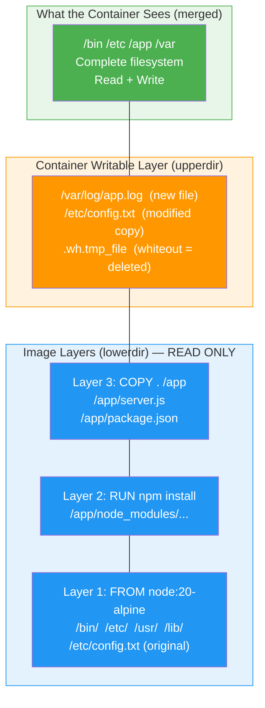
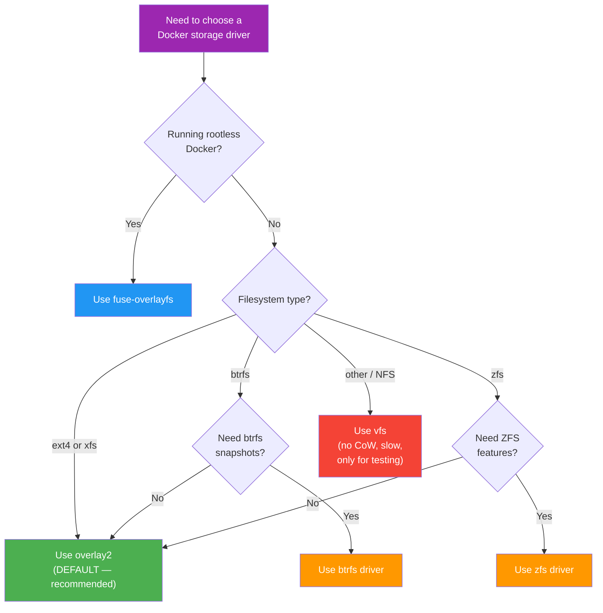

# File 8: Union Filesystem and Storage Drivers

**Topic:** OverlayFS (overlay2), Storage Drivers Comparison, Container Writable Layer, Volumes vs Bind Mounts vs tmpfs

**WHY THIS MATTERS:**
Every container image is made of read-only layers stacked on top of each other. When a container writes a file, it goes into a thin writable layer on top. Understanding this layer architecture explains why images are shared efficiently, why containers start instantly, why data disappears when a container is removed, and how to choose the right storage strategy for your application.

---

## Story

Imagine an architect in Jaipur who designs buildings. She has a BASE BLUEPRINT printed on thick paper — the foundation plan. On top of it, she places a sheet of TRACING PAPER and draws the first floor. Another tracing paper for the second floor. Another for the electrical layout.

When she looks down through all the tracing papers, she sees the COMPLETE building design — but each sheet only contains its OWN changes. The original blueprint is NEVER modified.

Now a junior architect wants to make his own modification. He takes a FRESH tracing paper, places it on top of the stack, and draws his changes. He can "see" everything below, but his changes are private to his sheet. If he throws away his tracing paper, the original blueprint stack is untouched.

This is EXACTLY how OverlayFS works:
- Base blueprint       = base image layer (e.g., ubuntu:22.04)
- Each tracing paper   = a Dockerfile instruction's layer
- Junior's sheet       = the container's writable layer
- Looking down         = the "merged" view the container sees
- Throwing away sheet  = docker rm (container data gone)

---

## Example Block 1 — Union Filesystem Concept

### Section 1 — What Is a Union Filesystem?

**WHY:** A union filesystem merges multiple directories into a single unified view. Files from upper layers override files from lower layers. This is the foundation of Docker's image and container system.

**CONCEPT:**
A union filesystem presents MULTIPLE directories as ONE. Each directory is a "layer". Upper layers override lower layers.

**EXAMPLE (simplified):**

```
Layer 1 (base):    /etc/config.txt = "default"
Layer 2 (app):     /app/server.js  = "console.log('hi')"
Layer 3 (custom):  /etc/config.txt = "production"   ← overrides Layer 1

MERGED VIEW (what the process sees):
  /etc/config.txt = "production"     (from Layer 3)
  /app/server.js  = "console.log('hi')" (from Layer 2)
```

**KEY TERMINOLOGY:**

| Term     | Meaning                                      |
|----------|----------------------------------------------|
| lowerdir | Read-only layers (image layers)              |
| upperdir | Read-write layer (container's writable layer)|
| merged   | Unified view combining lower + upper         |
| workdir  | Internal working directory for OverlayFS     |
| whiteout | Special marker that "deletes" a lower file   |

---

## Example Block 2 — OverlayFS (overlay2) Internals

### Section 2 — How overlay2 Works

**WHY:** overlay2 is Docker's default and recommended storage driver. It is fast, stable, and supported on all modern Linux kernels.

**HOW IT WORKS:**

1. Each image layer is stored as a directory on the host
2. OverlayFS kernel module mounts them as a single filesystem
3. Container gets a thin writable layer (upperdir) on top
4. Reads: fall through layers top-to-bottom until file is found
5. Writes: copy-on-write — file is copied UP to upperdir, then modified
6. Deletes: a "whiteout" file is created in upperdir to hide the lower file

**COPY-ON-WRITE (CoW):**

1. Container wants to modify `/etc/nginx/nginx.conf`
2. File exists in a lower (read-only) layer
3. OverlayFS copies the ENTIRE file to the upper (writable) layer
4. Modification happens on the copy in the upper layer
5. Lower layer is untouched
6. Subsequent reads see the upper layer's version

**PERFORMANCE IMPLICATIONS:**

- First write to a large file is expensive (full copy)
- Subsequent writes to the same file are fast (already in upperdir)
- Reading unmodified files is fast (direct from lowerdir)
- Many small files = many CoW operations = can be slow
- This is why databases should use VOLUMES, not the writable layer

### Section 3 — Exploring /var/lib/docker/overlay2/

**WHY:** Seeing the actual directory structure demystifies how layers are stored on disk.

**DIRECTORY LAYOUT:**

```
/var/lib/docker/overlay2/
├── l/                              # Shortened symlinks (for mount options length limit)
│   ├── ABC123 -> ../aaa111.../diff
│   └── DEF456 -> ../bbb222.../diff
├── aaa111111111111/                # Layer 1 (base image)
│   ├── diff/                       # This layer's files
│   │   ├── bin/
│   │   ├── etc/
│   │   └── usr/
│   ├── link                        # Shortened ID for this layer
│   └── lower                       # Parent layer ID (not present for base)
├── bbb222222222222/                # Layer 2 (app code)
│   ├── diff/                       # Only files CHANGED in this layer
│   │   └── app/
│   │       └── server.js
│   ├── link
│   └── lower                       # Points to aaa111...
└── ccc333333333333/                # Container's writable layer
    ├── diff/                       # Files the container has written
    ├── merged/                     # THE MERGED VIEW (union mount)
    ├── work/                       # OverlayFS internal workdir
    ├── link
    └── lower                       # Points to bbb222...:aaa111...
```

**COMMANDS TO EXPLORE:**

```bash
# See which storage driver is in use
docker info | grep "Storage Driver"
# OUTPUT: Storage Driver: overlay2

# See layers of an image
docker inspect --format='{{json .RootFS.Layers}}' nginx | jq .
# OUTPUT: array of layer digests (sha256:...)

# See the mount for a running container
docker inspect --format='{{.GraphDriver.Data.MergedDir}}' <container>
# OUTPUT: /var/lib/docker/overlay2/<id>/merged

# List all overlay2 directories
ls /var/lib/docker/overlay2/
# Shows all layer directories

# See the actual overlay mount
mount | grep overlay
# OUTPUT: overlay on /var/lib/docker/overlay2/<id>/merged type overlay
#   (rw,lowerdir=...:...,upperdir=...,workdir=...)
```

---

## Example Block 3 — Whiteout Files and Opaque Directories

### Section 4 — How Deletion Works in OverlayFS

**WHY:** You cannot actually delete a file from a read-only lower layer. Instead, OverlayFS creates special "whiteout" markers.

**WHITEOUT FILE:**
When a container deletes a file from a lower layer:
- A character device (0,0) named `.wh.<filename>` is created in upperdir
- OverlayFS sees this and hides the lower layer's file from merged view

**EXAMPLE:**

```
# Image layer has: /etc/motd
# Container runs: rm /etc/motd
# In upperdir: /etc/.wh.motd is created (character device 0,0)
# Merged view: /etc/motd is gone
```

**OPAQUE DIRECTORY:**
When a container deletes an entire directory and recreates it:
- A file named `.wh..wh..opq` is created in the new directory in upperdir
- This makes OverlayFS ignore ALL files from lower layers in that directory

**EXAMPLE:**

```
# Image layer has: /var/log/nginx/access.log, /var/log/nginx/error.log
# Container runs: rm -rf /var/log/nginx && mkdir /var/log/nginx
# In upperdir: /var/log/nginx/.wh..wh..opq is created
# Merged view: /var/log/nginx/ exists but is empty
```

**INSPECT WHITEOUT FILES:**

```bash
# Find whiteouts in a container's layer
CONTAINER_LAYER=$(docker inspect -f '{{.GraphDriver.Data.UpperDir}}' mycontainer)
sudo find $CONTAINER_LAYER -name ".wh.*" 2>/dev/null
```

---

## Example Block 4 — Storage Drivers Comparison

### Section 5 — Available Storage Drivers

**WHY:** While overlay2 is the default and recommended choice, knowing alternatives helps when working with older systems or special needs.

| Driver          | Status      | Backing FS     | Notes                         |
|-----------------|-------------|----------------|-------------------------------|
| overlay2        | Recommended | ext4, xfs      | Default on all modern systems |
| fuse-overlayfs  | Rootless    | any            | For rootless Docker           |
| btrfs           | Supported   | btrfs          | Uses btrfs snapshots          |
| zfs             | Supported   | zfs            | Uses ZFS clones               |
| devicemapper    | Deprecated  | direct-lvm     | Was RHEL default, now legacy  |
| aufs            | Deprecated  | ext4, xfs      | Was Ubuntu default, now gone  |
| vfs             | Testing     | any            | No CoW — full copy per layer  |

**CONFIGURE STORAGE DRIVER:**

```json
// In /etc/docker/daemon.json:
{
  "storage-driver": "overlay2",
  "storage-opts": [
    "overlay2.override_kernel_check=true"
  ]
}
```

```bash
# Restart Docker after changing:
sudo systemctl restart docker

# Verify:
docker info | grep "Storage Driver"
```

> **WARNING:** Changing storage driver makes existing images and containers INVISIBLE. They are not deleted but Docker cannot see them under the new driver. Always `docker save` important images before switching.

---

## Example Block 5 — Layer Sharing Between Containers

### Section 6 — How Layers Are Shared

**WHY:** Layer sharing is what makes Docker storage-efficient. 100 containers from the same image share ALL read-only layers — only the thin writable layer is unique per container.

**SCENARIO:**
Image: `node:20-alpine` (5 layers, ~180 MB). You run 10 containers from this image.

**DISK USAGE:**

```
Layer 1 (alpine base)     — 7 MB   — SHARED (1 copy)
Layer 2 (system libs)     — 12 MB  — SHARED (1 copy)
Layer 3 (node binary)     — 100 MB — SHARED (1 copy)
Layer 4 (npm)             — 50 MB  — SHARED (1 copy)
Layer 5 (metadata)        — 11 MB  — SHARED (1 copy)
─────────────────────────────────────────────────────
Container 1 writable layer — ~0 MB (until writes)
Container 2 writable layer — ~0 MB
...
Container 10 writable layer — ~0 MB

Total: ~180 MB + (10 x ~0 MB) ≈ 180 MB
Without sharing: 10 x 180 MB = 1.8 GB ← 10x more!
```

**COMMANDS TO SEE SHARING:**

```bash
# Disk usage breakdown
docker system df
# OUTPUT:
#   TYPE         TOTAL   ACTIVE   SIZE      RECLAIMABLE
#   Images       5       3        1.2GB     400MB (33%)
#   Containers   10      5        50MB      25MB (50%)
#   Volumes      8       4        2GB       1GB (50%)

# Detailed breakdown
docker system df -v

# See shared layers between two images
docker inspect --format='{{json .RootFS.Layers}}' nginx | jq .
docker inspect --format='{{json .RootFS.Layers}}' nginx:alpine | jq .
# Compare the sha256 digests — matching ones are shared
```

---

## Example Block 6 — Volumes vs Bind Mounts vs tmpfs

### Section 7 — The Three Storage Options for Container Data

**WHY:** The container's writable layer is ephemeral — it disappears with `docker rm`. For persistent data, you need one of three options: volumes (Docker-managed), bind mounts (host-path), or tmpfs (RAM-only).

| Type       | Stored Where               | Best For                              |
|------------|----------------------------|---------------------------------------|
| Volume     | /var/lib/docker/volumes, Docker manages it | Database data, persistent state, sharing between containers |
| Bind Mount | Anywhere on host FS, You manage it | Development (live code reload), config files, host directory access |
| tmpfs      | Host memory (RAM), Never written to disk | Sensitive data (secrets, temp files), performance-critical temp storage |

### Section 8 — Volumes (Docker-Managed)

**WHY:** Volumes are the preferred mechanism for persistent data. Docker manages their lifecycle, they work on all platforms, and they can be backed up, shared, and migrated easily.

```bash
# CREATE:
docker volume create mydata

# LIST:
docker volume ls
# OUTPUT:
#   DRIVER    VOLUME NAME
#   local     mydata

# INSPECT:
docker volume inspect mydata
# OUTPUT:
#   "Mountpoint": "/var/lib/docker/volumes/mydata/_data"
#   "Driver": "local"
```

**USE WITH CONTAINER:**

```bash
# -v syntax (short form)
docker run -v mydata:/app/data myapp

# --mount syntax (explicit — PREFERRED)
docker run --mount type=volume,source=mydata,target=/app/data myapp

# Anonymous volume (Docker picks a random name)
docker run -v /app/data myapp

# Read-only volume
docker run --mount type=volume,source=mydata,target=/app/data,readonly myapp
```

**REMOVE:**

```bash
docker volume rm mydata

# Remove ALL unused volumes (DANGEROUS)
docker volume prune

# Remove volumes when removing container
docker rm -v mycontainer
```

### Section 9 — Bind Mounts

**WHY:** Bind mounts map a specific host directory into the container. Essential for development workflows where you want live code reloading.

**USE WITH CONTAINER:**

```bash
# -v syntax (host path MUST be absolute)
docker run -v /home/user/project:/app myapp

# --mount syntax (PREFERRED — more explicit)
docker run --mount type=bind,source=/home/user/project,target=/app myapp

# Read-only bind mount
docker run --mount type=bind,source=/etc/config,target=/app/config,readonly myapp

# Current directory (development workflow)
docker run -v $(pwd):/app -w /app node:20 npm run dev
```

**BIND MOUNT vs VOLUME:**

BIND MOUNT:
- You control the host path
- Great for development (live reload)
- Depends on host directory structure
- Permission issues (host UID vs container UID)
- Not portable between machines

VOLUME:
- Docker manages lifecycle
- Works on all platforms identically
- Easy backup/restore
- Can use volume drivers (NFS, cloud storage)
- Cannot point to arbitrary host paths

### Section 10 — tmpfs Mounts

**WHY:** tmpfs stores data in RAM only. It never touches disk, making it ideal for sensitive data like secrets or high-performance temp storage.

**USE WITH CONTAINER:**

```bash
# --tmpfs syntax (simple)
docker run --tmpfs /app/tmp myapp

# --mount syntax (with options)
docker run --mount type=tmpfs,target=/app/tmp,tmpfs-size=100m,tmpfs-mode=1777 myapp
```

**OPTIONS:**
- `tmpfs-size` — maximum size in bytes (default: unlimited = all host RAM)
- `tmpfs-mode` — file mode (permissions) in octal

**USE CASES:**
- Storing secrets that should never be written to disk
- High-performance scratch space for data processing
- Session data / cache that does not need persistence

**EXAMPLE — Secure secret handling:**

```bash
docker run \
  --mount type=tmpfs,target=/run/secrets,tmpfs-size=1m \
  -e DB_PASSWORD=supersecret \
  myapp
# Even if the container is compromised, secrets are in RAM only
# When the container stops, the data evaporates
```

---

## Example Block 7 — Mermaid Diagrams

### Section 11 — OverlayFS Layer Stack



### Section 12 — Storage Driver Selection Flowchart



---

## Example Block 8 — Inspecting Container Layers

### Section 13 — Practical Layer Inspection Commands

**WHY:** Being able to inspect layers helps you debug image size issues, understand what changed between builds, and optimize Dockerfiles.

```bash
# See all layers in an image
docker history nginx
# OUTPUT:
#   IMAGE          CREATED        CREATED BY                                      SIZE
#   a1b2c3d4e5f6   2 weeks ago    CMD ["nginx" "-g" "daemon off;"]                0B
#   <missing>      2 weeks ago    EXPOSE map[80/tcp:{}]                           0B
#   <missing>      2 weeks ago    STOPSIGNAL SIGQUIT                              0B
#   <missing>      2 weeks ago    RUN /bin/sh -c set -x && ...                    26.4MB
#   <missing>      2 weeks ago    COPY file:... in /docker-entrypoint.d           4.62kB
#   <missing>      2 weeks ago    ADD file:... in /                               77.8MB

# See layers with full commands (no truncation)
docker history --no-trunc nginx

# See layer digests
docker inspect --format='{{json .RootFS.Layers}}' nginx | jq .

# See container's disk usage (writable layer size)
docker ps -s
# OUTPUT:
#   CONTAINER ID  IMAGE   SIZE
#   a1b2c3d4e5f6  nginx   5B (virtual 188MB)
#   ^^^ 5B is the writable layer, 188MB is total including shared layers

# See what changed in a container (vs its image)
docker diff mycontainer
# OUTPUT:
#   C /var          (Changed)
#   A /var/log/app.log   (Added)
#   D /tmp/old.txt       (Deleted)

# Export container filesystem as tar (for inspection)
docker export mycontainer > container-fs.tar
tar -tf container-fs.tar | head -20

# Save image as tar (preserves layers)
docker save nginx > nginx-image.tar
tar -tf nginx-image.tar
# Shows: manifest.json, layer directories with layer.tar files
```

---

## Example Block 9 — Optimizing Image Size

### Section 14 — Reducing Layer Size

**WHY:** Smaller images mean faster pulls, faster deploys, smaller attack surface, and less storage cost.

**STRATEGY 1 — Use slim/alpine base images:**

```dockerfile
FROM node:20              # ~1.1 GB
FROM node:20-slim         # ~250 MB
FROM node:20-alpine       # ~180 MB
FROM gcr.io/distroless/nodejs20-debian12  # ~130 MB
```

**STRATEGY 2 — Clean up in the SAME RUN layer:**

```dockerfile
# BAD (cache stays in a layer):
RUN apt-get update
RUN apt-get install -y curl
RUN rm -rf /var/lib/apt/lists/*    # Too late — previous layers are frozen

# GOOD (single layer, cache cleaned):
RUN apt-get update \
    && apt-get install -y --no-install-recommends curl \
    && rm -rf /var/lib/apt/lists/*
```

**STRATEGY 3 — Multi-stage builds:**
Build stage has compilers, dev dependencies (~800 MB). Production stage has only the built artifact (~50 MB).

**STRATEGY 4 — Use .dockerignore:**

```
node_modules
.git
*.md
test/
coverage/
```

**STRATEGY 5 — Order layers by change frequency:**

```dockerfile
# Rarely changes → first (cached)
COPY package.json package-lock.json ./
RUN npm ci --only=production
# Frequently changes → last (rebuilt)
COPY src/ ./src/
```

**ANALYZE IMAGE SIZE:**

```bash
# Use dive tool (third-party)
dive nginx
# Interactive TUI showing each layer's file changes and wasted space
```

---

## Example Block 10 — Container Writable Layer Behavior

### Section 15 — Understanding the Writable Layer

**WHY:** Knowing that the writable layer is ephemeral and uses CoW helps you make correct decisions about where to store data.

**KEY BEHAVIORS:**

1. Created when container starts, destroyed when container is removed
2. `docker stop` does NOT delete it — data survives restarts
3. `docker rm` DOES delete it — data is gone forever
4. Uses Copy-on-Write — first write to an image file copies it up
5. All writes (including logs) go here unless a volume is mounted
6. Heavy writes to the writable layer degrade performance

**COMMON MISTAKE:**

```bash
# Running a database without a volume
docker run -d postgres
# Data is in the writable layer
docker rm -f <container>
# ALL DATA GONE!

# Correct way
docker run -d -v pgdata:/var/lib/postgresql/data postgres
# Data is in a volume — survives container removal
```

**CHECKING WRITABLE LAYER SIZE:**

```bash
docker ps -s --format "table {{.Names}}\t{{.Size}}"
# OUTPUT:
#   NAMES     SIZE
#   web       2B (virtual 188MB)
#   db        450MB (virtual 600MB)
#   ^^^ 450MB written to writable layer — should be in a volume!

# If writable layer is large, investigate:
docker diff <container>
# Shows every file added, changed, or deleted
```

---

## Key Takeaways

1. Docker images are stacks of **read-only layers**. Each Dockerfile instruction creates one layer. Layers are shared between images and containers for storage efficiency.

2. **OverlayFS (overlay2)** is Docker's default storage driver. It uses lowerdir (image layers), upperdir (writable layer), and merged (unified view).

3. **Copy-on-Write (CoW):** when a container modifies an image file, the file is first copied to the writable layer, then modified. Lower layers are NEVER changed.

4. **Whiteout files** (`.wh.<name>`) handle deletions — they hide files from lower layers without actually removing them.

5. The container **writable layer is EPHEMERAL**. It disappears with `docker rm`. Never store important data there.

6. **Three storage options** for persistent data:
   - **Volumes:** Docker-managed, portable, recommended for production
   - **Bind mounts:** Host-path mapped, great for development
   - **tmpfs:** RAM-only, for secrets and temporary data

7. **overlay2** works on ext4 and xfs. For rootless Docker, use fuse-overlayfs. btrfs and zfs drivers exist for those filesystems.

8. **Layer sharing** means 100 containers from the same image use almost no extra disk — only their thin writable layers.

9. `docker history` shows layers. `docker diff` shows what a container changed. `docker system df` shows overall disk usage.

10. **Optimize image size:** use slim/alpine bases, clean up in the same RUN layer, use multi-stage builds, and order instructions by change frequency (stable first, volatile last).
