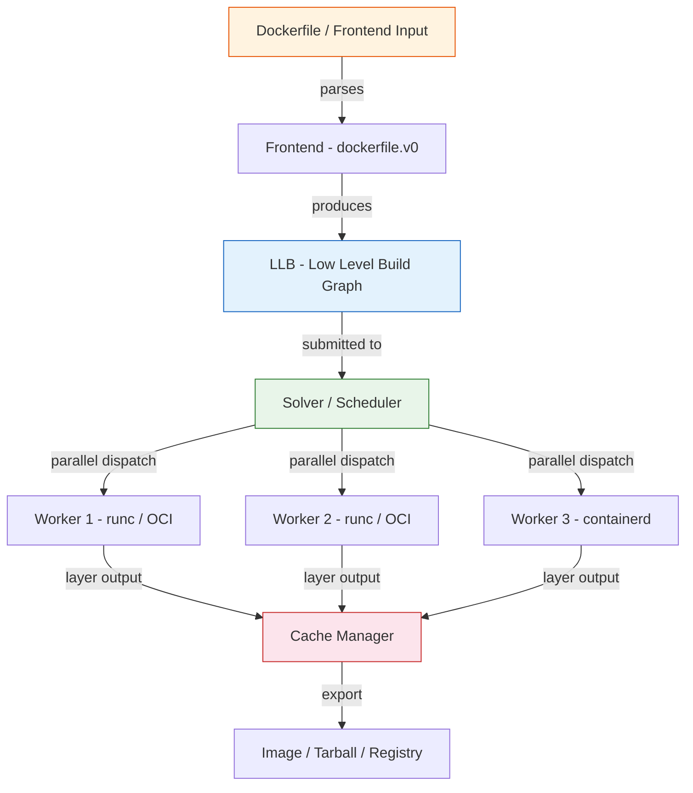
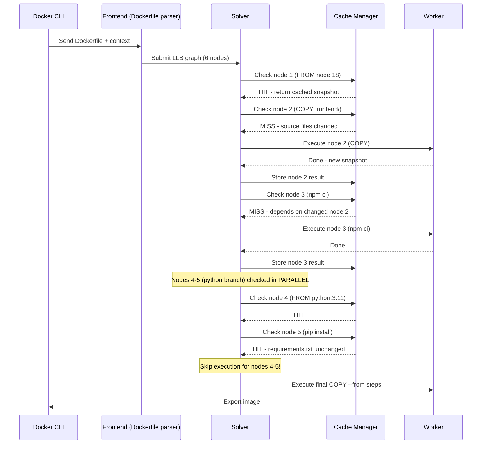

# File 9 — BuildKit: Docker's Next-Generation Build Engine

**Topic:** BuildKit architecture, LLB, parallel builds, build cache, build secrets, SSH forwarding

**WHY THIS MATTERS:**
The default (legacy) Docker builder processes your Dockerfile line by line, top to bottom, creating a throw-away container for each step. BuildKit replaces that sequential model with a DAG-based solver that understands which steps depend on which, runs independent steps in parallel, and caches aggressively. If you have ever waited 10 minutes for a build that should take 2, BuildKit is the answer.

**Prerequisites:** Files 01-08, basic Dockerfile knowledge

---

## Story: The Smart Factory Assembly Line

Imagine a large Diwali fireworks factory in Sivakasi, Tamil Nadu.

**OLD FACTORY (legacy builder):**
Workers sit in a single line. Worker 1 makes the shell, passes it to Worker 2 who adds gunpowder, then Worker 3 wraps the fuse. If Worker 2 is slow, everyone waits.

**NEW SMART FACTORY (BuildKit):**
The factory manager (BuildKit frontend) reads the blueprint and creates a job graph. Shell-making, fuse-cutting, and label-printing happen at PARALLEL workstations because they don't depend on each other. Only the final assembly step waits for all three. A quality-check cache (build cache) remembers finished parts — if the shell design hasn't changed, the old shell is reused instantly. Secret ingredients (API keys, SSH keys) are kept in a secure vault that workers can peek at but never copy home.

- Factory Manager    = BuildKit Frontend (Dockerfile parser)
- Job Graph          = LLB (Low-Level Build definition)
- Parallel stations  = Concurrent build stages
- Quality-check cache = Build cache (local / registry / S3)
- Secure vault       = Secret & SSH mounts

---

## Section 1 — Enabling BuildKit

**WHY:** BuildKit is opt-in on Docker < 23.0 and the default on Docker >= 23.0 (with "docker buildx build"). Knowing how to enable it explicitly avoids surprises across machines.

### 1A — Enable via environment variable (per-command)

```
SYNTAX: DOCKER_BUILDKIT=1 docker build [OPTIONS] PATH
```

```bash
DOCKER_BUILDKIT=1 docker build -t myapp:latest .
```

Setting the env var to 1 tells the Docker CLI to route the build request to the BuildKit daemon instead of the legacy builder. Works on Linux/macOS/WSL.

### 1B — Enable permanently via daemon.json

File: `/etc/docker/daemon.json` (Linux) or `~/.docker/daemon.json` (Docker Desktop)

```json
{
  "features": {
    "buildkit": true
  }
}
```

After editing:

```bash
sudo systemctl restart docker
```

Permanent config means every "docker build" automatically uses BuildKit — no env var needed.

### 1C — Using docker buildx (recommended modern approach)

```
SYNTAX: docker buildx build [OPTIONS] PATH
```

```bash
docker buildx build -t myapp:latest .
```

**FLAGS:**

| Flag | Description |
|------|-------------|
| `--builder NAME` | Use a specific builder instance |
| `--load` | Export to docker images (shorthand for --output=type=docker) |
| `--push` | Push to a registry after build |
| `--platform` | Target platform(s) e.g. linux/amd64,linux/arm64 |
| `--progress plain` | Show full build output (not the fancy TTY UI) |

"docker buildx" is the official CLI plugin for BuildKit. It supports multi-platform builds, remote builders, and advanced cache backends that plain "docker build" cannot do.

---

## Section 2 — BuildKit Architecture Deep Dive

**WHY:** Understanding the internals lets you debug slow builds, design better Dockerfiles, and configure caching correctly.



**EXPLANATION:**

1. **Frontend** — Reads your Dockerfile and converts it into LLB. You can swap frontends (e.g. buildpacks, Earthly).
2. **LLB** — A protobuf-encoded DAG of build operations. Think of it as an "assembly language" for builds.
3. **Solver** — Walks the DAG, identifies parallelizable branches, checks the cache for each node, dispatches work.
4. **Workers** — Execute individual operations (RUN, COPY, etc.) inside isolated containers using runc or containerd.
5. **Cache Manager** — Stores and retrieves layer snapshots.
6. **Exporter** — Produces the final artifact (image, tarball, etc.)

---

## Example Block 1 — LLB and the Build Graph

Consider this Dockerfile:

```dockerfile
# syntax=docker/dockerfile:1
FROM node:18 AS frontend
COPY frontend/ ./frontend/
RUN cd frontend && npm ci && npm run build

FROM python:3.11 AS backend
COPY requirements.txt .
RUN pip install -r requirements.txt

FROM nginx:alpine AS final
COPY --from=frontend /frontend/dist /usr/share/nginx/html
COPY --from=backend /usr/local/lib/python3.11 /opt/python
COPY nginx.conf /etc/nginx/nginx.conf
```

**LLB GRAPH (conceptual):**

```
[node:18 pull] ─── COPY frontend ─── npm ci & build ──┐
                                                        ├─► COPY --from ─► final image
[python:3.11 pull] ─── COPY req.txt ─── pip install ──┘
[nginx:alpine pull] ──────────────────────────────────────► base layer
```

The frontend and backend branches are INDEPENDENT. BuildKit runs them IN PARALLEL on separate workers. Legacy builder would do them sequentially.

**WHY:** Parallel execution can cut build time by 40-60% for multi-stage builds with independent branches.

---

## Section 3 — Build Cache Deep Dive

**WHY:** Cache is the single biggest factor in build speed. Understanding cache types lets you pick the right one for CI (registry cache) vs local dev (local cache).

### 3A — Inline Cache (embedded in the image)

```bash
docker buildx build \
  --cache-to   type=inline \
  --push \
  -t registry.example.com/myapp:latest .

docker buildx build \
  --cache-from type=registry,ref=registry.example.com/myapp:latest \
  -t myapp:latest .
```

Inline cache is the simplest — cache metadata is stored right inside the image manifest. Good for small projects. Limitation: only caches the final stage, not intermediate stages.

### 3B — Registry Cache (separate cache image)

```bash
docker buildx build \
  --cache-to   type=registry,ref=registry.example.com/myapp:cache,mode=max \
  --cache-from type=registry,ref=registry.example.com/myapp:cache \
  --push \
  -t registry.example.com/myapp:latest .
```

**FLAGS:**
- `mode=min` — cache only the final stage layers (default)
- `mode=max` — cache ALL stages (including intermediate build stages)

Registry cache stores cache in a separate image tag. "mode=max" is essential for multi-stage builds — without it, your builder stage cache is lost between CI runs.

### 3C — Local directory cache

```bash
docker buildx build \
  --cache-to   type=local,dest=/tmp/buildcache \
  --cache-from type=local,src=/tmp/buildcache \
  -t myapp:latest .
```

Useful in CI where you can persist `/tmp/buildcache` between pipeline runs (e.g., GitHub Actions cache action).

### 3D — S3 cache (for AWS-based CI)

```bash
docker buildx build \
  --cache-to   type=s3,region=ap-south-1,bucket=my-buildcache,name=myapp \
  --cache-from type=s3,region=ap-south-1,bucket=my-buildcache,name=myapp \
  -t myapp:latest .
```

In large teams with many CI runners, S3 provides a shared, durable cache that any runner can read/write.

### Cache-Aware Build Sequence



**EXPLANATION:**
- The solver checks each node against the cache BEFORE executing.
- A cache HIT means the layer snapshot is reused — zero work.
- A cache MISS propagates: if node 2 misses, node 3 must also re-execute because its input changed.
- Independent branches (frontend vs backend) are checked/executed concurrently.

---

## Example Block 2 — Cache Mounts (--mount=type=cache)

**WHY:** Package managers (npm, pip, apt) download the same packages repeatedly across builds. Cache mounts persist those downloads across builds without baking them into layers.

```dockerfile
# syntax=docker/dockerfile:1

# --- Node.js (npm) cache mount ---
FROM node:18-alpine
WORKDIR /app
COPY package*.json ./
RUN --mount=type=cache,target=/root/.npm \
    npm ci --prefer-offline
COPY . .
RUN npm run build
```

**SYNTAX:**

```
RUN --mount=type=cache,target=<PATH> <command>
```

**FLAGS:**

| Flag | Description |
|------|-------------|
| `target=PATH` | directory inside the container to cache |
| `id=NAME` | unique ID (defaults to target path) |
| `sharing=shared\|private\|locked` | concurrency mode (shared = multiple builds can read) |
| `from=IMAGE` | seed cache from another image |
| `mode=0755` | permissions on the cache directory |

**Python (pip) cache mount:**

```dockerfile
FROM python:3.11-slim
WORKDIR /app
COPY requirements.txt .
RUN --mount=type=cache,target=/root/.cache/pip \
    pip install -r requirements.txt
COPY . .
```

**APT cache mount (Debian/Ubuntu):**

```dockerfile
FROM ubuntu:22.04
RUN --mount=type=cache,target=/var/cache/apt \
    --mount=type=cache,target=/var/lib/apt \
    apt-get update && apt-get install -y curl git
```

**Go modules cache mount:**

```dockerfile
FROM golang:1.21
WORKDIR /app
COPY go.mod go.sum ./
RUN --mount=type=cache,target=/go/pkg/mod \
    go mod download
COPY . .
RUN --mount=type=cache,target=/root/.cache/go-build \
    go build -o /app/server .
```

Without cache mounts, every "npm ci" re-downloads every package. With them, downloaded tarballs persist in the mount across builds. A full npm ci that took 90s can drop to 10s on the second run.

---

## Example Block 3 — Build Secrets

**WHY:** Hardcoding tokens/passwords in Dockerfiles leaks them into image layers. Even with multi-stage builds, the build history can expose them. Secret mounts solve this.

**PROBLEM (never do this):**

```dockerfile
ENV NPM_TOKEN=abc123
RUN npm install     # token baked into layer history!
```

**SOLUTION — secret mount:**

```dockerfile
# syntax=docker/dockerfile:1
FROM node:18
WORKDIR /app
COPY package*.json ./
RUN --mount=type=secret,id=npmrc,target=/root/.npmrc \
    npm ci
COPY . .
```

**BUILD COMMAND:**

```bash
docker buildx build \
  --secret id=npmrc,src=$HOME/.npmrc \
  -t myapp:latest .
```

**SYNTAX:**

```
--mount=type=secret,id=<ID>[,target=<PATH>][,mode=<MODE>]
```

**FLAGS:**

| Flag | Description |
|------|-------------|
| `id=NAME` | identifier (must match --secret id= in build cmd) |
| `target=PATH` | mount path inside container (default: /run/secrets/<id>) |
| `mode=0400` | file permissions (default 0400 = owner read only) |
| `required=true` | fail the build if the secret is not provided |

**MULTIPLE SECRETS:**

```bash
docker buildx build \
  --secret id=npmrc,src=.npmrc \
  --secret id=aws,src=$HOME/.aws/credentials \
  -t myapp:latest .
```

In Dockerfile:

```dockerfile
RUN --mount=type=secret,id=aws,target=/root/.aws/credentials \
    aws s3 cp s3://private-bucket/model.bin /app/model.bin
```

The secret is available ONLY during that RUN step. It is never written to any layer, never appears in "docker history", and cannot be extracted from the image. Think of it as the factory worker peeking into the vault but never taking the document out.

**EXPECTED OUTPUT (docker history):**

```
IMAGE          CREATED       CREATED BY                           SIZE
abc123def456   2 min ago     RUN --mount=type=secret,id=npmrc...  45MB
# Note: no secret content visible!
```

---

## Example Block 4 — SSH Forwarding

**WHY:** Many build steps need to clone private Git repos. SSH forwarding lets the build use your host SSH agent without copying your private key into the image.

```dockerfile
# syntax=docker/dockerfile:1
FROM golang:1.21
WORKDIR /app
RUN --mount=type=ssh \
    git clone git@github.com:myorg/private-lib.git /app/lib
COPY . .
RUN go build -o /app/server .
```

**BUILD COMMAND:**

```bash
# Make sure ssh-agent is running and has your key:
eval $(ssh-agent)
ssh-add ~/.ssh/id_ed25519

docker buildx build \
  --ssh default \
  -t myapp:latest .
```

**SYNTAX:**

```
RUN --mount=type=ssh <command>
```

Build flags:
- `--ssh default` — forward the default SSH agent
- `--ssh mykey=~/.ssh/id_rsa` — forward a specific key

**ADVANCED — multiple SSH identities:**

```bash
docker buildx build \
  --ssh github=~/.ssh/github_key \
  --ssh gitlab=~/.ssh/gitlab_key \
  -t myapp:latest .
```

```dockerfile
RUN --mount=type=ssh,id=github \
    git clone git@github.com:org/repo.git
```

The SSH socket is forwarded into the build container for that single RUN instruction. The private key NEVER touches the build context, layers, or image. Once the RUN finishes, the socket is gone.

---

## Section 4 — Frontend Customization

The first line of a Dockerfile can specify a custom frontend:

```dockerfile
# syntax=docker/dockerfile:1.6       — pin a specific version
# syntax=docker/dockerfile:labs       — use experimental features
# syntax=docker.io/docker/dockerfile  — explicit registry reference
```

**WHY:** BuildKit's frontend is decoupled from the Docker daemon. You can use a newer Dockerfile syntax without upgrading Docker itself. The frontend is pulled as a container image.

**EXPERIMENTAL FEATURES (labs channel):**
- Heredocs in Dockerfiles
- COPY --parents
- ADD --checksum

**HEREDOC EXAMPLE:**

```dockerfile
# syntax=docker/dockerfile:labs
FROM python:3.11-slim
RUN <<SCRIPT
#!/bin/bash
set -e
echo "Installing dependencies"
pip install flask gunicorn
echo "Done"
SCRIPT
```

---

## Section 5 — Garbage Collection and Pruning

```
COMMAND: docker builder prune
SYNTAX: docker builder prune [OPTIONS]
```

**FLAGS:**

| Flag | Description |
|------|-------------|
| `-a, --all` | Remove all unused build cache (not just dangling) |
| `-f, --force` | Skip confirmation prompt |
| `--filter until=24h` | Remove cache older than 24 hours |
| `--keep-storage 5gb` | Keep at least 5GB of cache |

**EXAMPLES:**

```bash
# Remove dangling (unreferenced) build cache
docker builder prune

# Remove ALL build cache
docker builder prune -a -f

# Remove cache older than 7 days, keep 10GB
docker builder prune --filter until=168h --keep-storage 10gb
```

**EXPECTED OUTPUT:**

```
ID                        RECLAIMABLE  SIZE       LAST ACCESSED
abc123def456abc123def456   true         1.2GB      3 days ago
...
Total:  4.7GB
```

**AUTOMATIC GC via buildkitd.toml:**

```toml
[worker.oci]
  gc = true
  gckeepstorage = 10000    # 10GB in MB
  [[worker.oci.gcpolicy]]
    all = true
    keepDuration = 604800   # 7 days in seconds
    keepBytes = 5368709120  # 5GB
```

BuildKit cache grows over time. In CI environments, disk space is limited. Configure GC policies so the cache stays useful (recent layers kept) without eating all your disk.

---

## Section 6 — Buildx Builder Instances

```bash
# List builders
docker buildx ls
```

**EXPECTED OUTPUT:**

```
NAME/NODE       DRIVER/ENDPOINT  STATUS   BUILDKIT  PLATFORMS
default         docker                              linux/amd64
my-builder *    docker-container running  v0.12.4   linux/amd64, linux/arm64
```

**Create a new builder with docker-container driver:**

```
SYNTAX: docker buildx create --name <NAME> [OPTIONS]
```

```bash
docker buildx create \
  --name multiarch \
  --driver docker-container \
  --platform linux/amd64,linux/arm64 \
  --use
```

**FLAGS:**

| Flag | Description |
|------|-------------|
| `--name NAME` | Builder instance name |
| `--driver DRIVER` | docker \| docker-container \| kubernetes \| remote |
| `--platform LIST` | Supported platforms |
| `--use` | Set as current builder |
| `--bootstrap` | Start the builder immediately |

```bash
# Switch to a builder
docker buildx use multiarch

# Remove a builder
docker buildx rm multiarch

# Inspect a builder
docker buildx inspect multiarch --bootstrap
```

The "docker-container" driver runs BuildKit in its own container with full feature support (cache export, multi-platform, etc.). The default "docker" driver uses the daemon's embedded BuildKit which has fewer features.

---

## Example Block 5 — Multi-platform Build

```bash
docker buildx build \
  --platform linux/amd64,linux/arm64 \
  --push \
  -t registry.example.com/myapp:latest .
```

**HOW IT WORKS:**

1. BuildKit spins up QEMU emulators for non-native platforms
2. Builds the Dockerfile once per platform (in parallel!)
3. Pushes a manifest list (fat manifest) to the registry
4. When a user pulls, Docker auto-selects the right platform

**SETUP (one-time):**

```bash
docker run --privileged --rm \
  tonistiigi/binfmt --install all
```

**CHECK available emulators:**

```bash
docker buildx ls
```

India's developer ecosystem runs on a mix of x86 laptops, ARM-based cloud instances (AWS Graviton), and Raspberry Pi. Multi-platform builds let you produce one image tag that works everywhere.

---

## Example Block 6 — Putting It All Together

**Production-Grade BuildKit Workflow**

Dockerfile:

```dockerfile
# syntax=docker/dockerfile:1
FROM node:18-alpine AS deps
WORKDIR /app
COPY package*.json ./
RUN --mount=type=cache,target=/root/.npm \
    --mount=type=secret,id=npmrc,target=/root/.npmrc \
    npm ci

FROM node:18-alpine AS builder
WORKDIR /app
COPY --from=deps /app/node_modules ./node_modules
COPY . .
RUN npm run build

FROM node:18-alpine AS runner
WORKDIR /app
ENV NODE_ENV=production
RUN addgroup -S appgroup && adduser -S appuser -G appgroup
COPY --from=builder /app/dist ./dist
COPY --from=deps /app/node_modules ./node_modules
USER appuser
EXPOSE 3000
CMD ["node", "dist/index.js"]
```

Build command:

```bash
docker buildx build \
  --secret id=npmrc,src=$HOME/.npmrc \
  --cache-from type=registry,ref=registry.example.com/myapp:cache \
  --cache-to   type=registry,ref=registry.example.com/myapp:cache,mode=max \
  --platform linux/amd64,linux/arm64 \
  --push \
  -t registry.example.com/myapp:v1.2.3 \
  -t registry.example.com/myapp:latest .
```

**WHAT THIS DOES:**

1. Uses cache mounts for npm downloads (fast re-installs)
2. Uses secret mount for private registry auth (secure)
3. Pulls cache from registry (CI-friendly)
4. Pushes updated cache back to registry
5. Builds for both AMD64 and ARM64 (multi-platform)
6. Pushes with both a version tag and "latest"

---

## Key Takeaways

1. **BuildKit** replaces the legacy builder with a DAG-based, parallel, cache-aware build engine.

2. Enable it with `DOCKER_BUILDKIT=1` or use `docker buildx build`.

3. **Architecture:** Frontend -> LLB graph -> Solver -> Workers -> Cache.

4. **Cache types:**
   - **inline** — simplest, caches only final stage
   - **registry** — best for CI, supports mode=max for all stages
   - **local** — good for CI with persistent storage
   - **s3** — shared cache for large teams

5. **Mount types:**
   - `--mount=type=cache` — persist package manager downloads
   - `--mount=type=secret` — inject secrets without leaking to layers
   - `--mount=type=ssh` — forward SSH agent for private repo access

6. `docker buildx create --driver docker-container` unlocks full BuildKit features including multi-platform builds.

7. Use `docker builder prune` to manage cache disk usage.

8. Pin your frontend with `# syntax=docker/dockerfile:1` to get consistent builds across different Docker versions.

**SMART FACTORY RECAP:**
- Factory manager reads the blueprint       = Frontend parses Dockerfile
- Job graph with parallel workstations      = LLB with concurrent stages
- Quality-check cache skips repeated work   = Build cache hits
- Secure vault for secret ingredients       = Secret & SSH mounts
- Multi-factory support for different cities = Multi-platform builds
