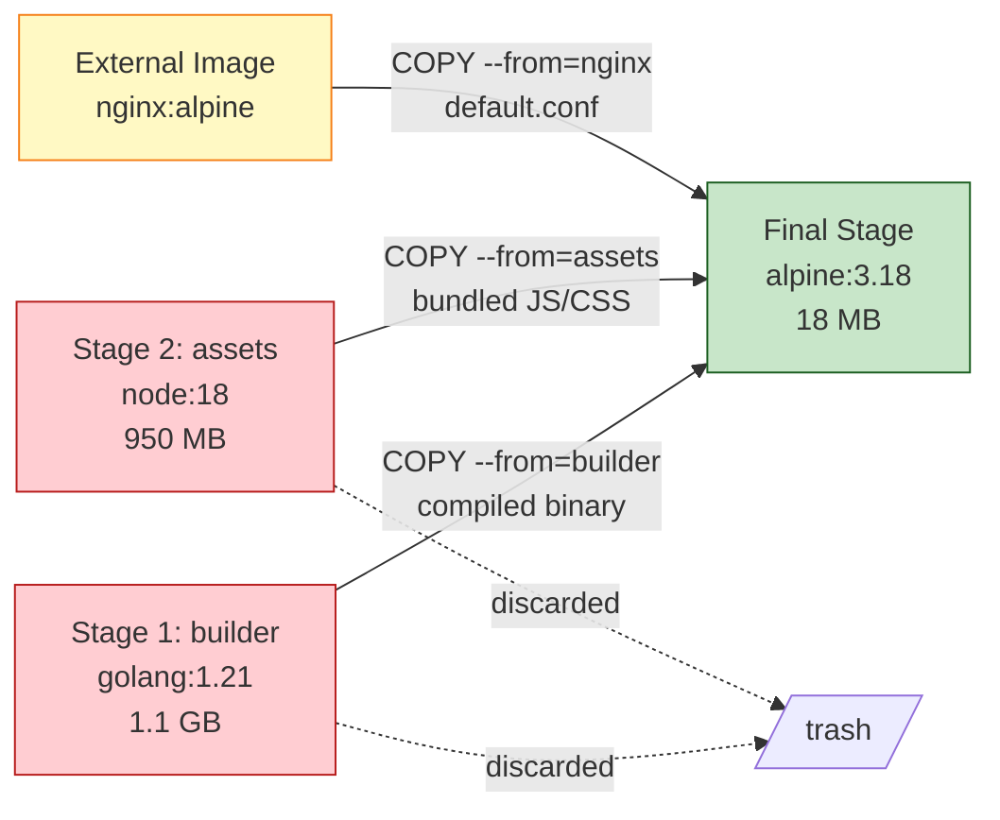
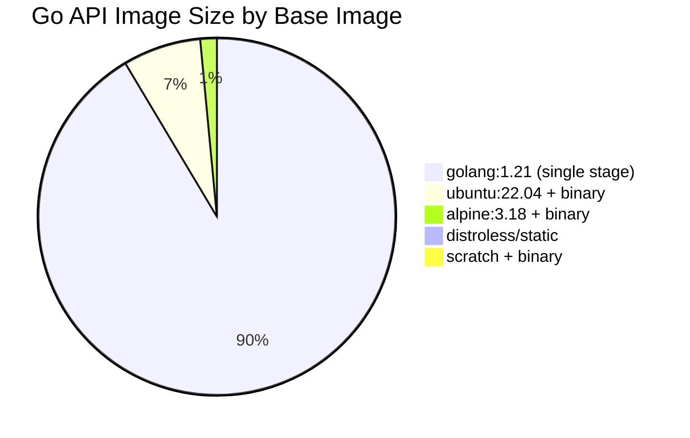

# File 10 — Multi-Stage Builds: From Bloated to Beautiful

**Topic:** Multi-stage patterns, builder pattern, distroless and scratch images, reducing image size dramatically

**WHY THIS MATTERS:**
A typical Node.js image with devDependencies, build tools, and source code can be 1.2 GB. The production app only needs the compiled output and runtime — about 80 MB. Multi-stage builds let you use fat images for building and ultra-slim images for running, all in ONE Dockerfile. Smaller images mean faster pulls, less attack surface, and cheaper storage.

**Prerequisites:** Files 01-09, Dockerfile basics, BuildKit

---

## Story: Film Production — From Shooting to Cinema

Think of a Bollywood film being made in Mumbai's Film City.

**SHOOTING STAGE (Build Stage):**
A massive set is constructed — buildings, lights, cranes, green screens, hundreds of crew members. The raw footage is enormous — terabytes of unedited video. You need all this infrastructure to CREATE the content.

**EDITING ROOM (Intermediate Stage):**
The editor takes the raw footage, trims it, adds VFX, color-grades, and mixes audio. They have powerful workstations with expensive software. The output is a clean, compressed master file.

**CINEMA RELEASE (Final Slim Image):**
The audience receives a DCP (Digital Cinema Package) — just the finished film. No sets, no cranes, no editing software. The cinema projector (container runtime) only needs the final cut to play the movie.

- Shooting set     = Build stage (compilers, devDeps, source)
- Editing room     = Intermediate stage (optimization, bundling)
- Cinema release   = Final image (only runtime + compiled output)
- Film City crew   = Build dependencies (gcc, make, node-gyp)
- DCP file         = Distroless / scratch image

---

## Section 1 — The Problem: Why Images Get Fat

**WHY:** Understanding what makes images large helps you know what to remove in the final stage.

Typical single-stage Dockerfile for a Go API:

```dockerfile
FROM golang:1.21
WORKDIR /app
COPY go.mod go.sum ./
RUN go mod download
COPY . .
RUN go build -o /app/server .
EXPOSE 8080
CMD ["./server"]
```

**IMAGE SIZE: ~1.1 GB !!**

What's in that 1.1 GB?
- golang:1.21 base     = 814 MB  (Go compiler, stdlib, tools)
- go mod cache         = 120 MB  (downloaded dependencies)
- source code          =  15 MB  (your .go files)
- compiled binary      =  12 MB  (the actual server)
- other OS packages    = 139 MB  (apt cache, man pages, etc.)

The compiled binary is 12 MB. Everything else is waste. That's like shipping the entire Film City set to the cinema just to play a 2-hour movie.

---

## Section 2 — Multi-Stage Build Basics

```
SYNTAX:
  FROM <image> AS <stage-name>
  ...
  FROM <image> AS <next-stage>
  COPY --from=<stage-name> <src> <dest>
```

**EXAMPLE — Go application:**

```dockerfile
# Stage 1: Build (the Film City shooting set)
FROM golang:1.21 AS builder
WORKDIR /app
COPY go.mod go.sum ./
RUN go mod download
COPY . .
RUN CGO_ENABLED=0 GOOS=linux go build -ldflags="-s -w" -o server .

# Stage 2: Run (the cinema release)
FROM alpine:3.18
RUN apk --no-cache add ca-certificates
WORKDIR /app
COPY --from=builder /app/server .
EXPOSE 8080
CMD ["./server"]
```

**IMAGE SIZE: ~18 MB !!** (down from 1.1 GB — 98% reduction)

**KEY INSIGHT:** Only the FINAL FROM stage becomes the image. All previous stages are discarded after their artifacts are copied out. The Go compiler, source code, module cache — all gone from the final image.

### Multi-Stage Build Pipeline



- RED stages are large build environments — they are thrown away
- GREEN is the final slim image — this is what gets shipped
- YELLOW shows you can even COPY from external images
- Arrows show what artifacts move to the final stage

---

## Example Block 1 — Named Stages and --target

Dockerfile with named stages:

```dockerfile
FROM node:18 AS deps
WORKDIR /app
COPY package*.json ./
RUN npm ci

FROM deps AS test
COPY . .
RUN npm test

FROM deps AS build
COPY . .
RUN npm run build

FROM node:18-alpine AS production
WORKDIR /app
ENV NODE_ENV=production
COPY --from=deps /app/node_modules ./node_modules
COPY --from=build /app/dist ./dist
EXPOSE 3000
CMD ["node", "dist/index.js"]
```

**BUILD SPECIFIC STAGES:**

```
SYNTAX: docker build --target <stage-name> -t <tag> .
```

```bash
# Build only up to the test stage (CI validation)
docker build --target test -t myapp:test .

# Build only up to the build stage (for debugging)
docker build --target build -t myapp:build .

# Build the full production image (default — last stage)
docker build -t myapp:prod .
```

**WHY:** `--target` lets you use one Dockerfile for multiple purposes. CI runs `--target test` to validate, and CD runs the full build for production. Like using the same Film City set for rehearsals (test) vs the actual shoot (production).

**EXPECTED OUTPUT (--target test):**

```
=> [deps 1/3] FROM node:18
=> [deps 2/3] COPY package*.json ./
=> [deps 3/3] RUN npm ci
=> [test 1/2] COPY . .
=> [test 2/2] RUN npm test
# Stops here — does NOT build the production stage
```

---

## Example Block 2 — COPY --from Patterns

**Pattern 1: COPY from a named stage**

```dockerfile
COPY --from=builder /app/server /usr/local/bin/server
```

**Pattern 2: COPY from an external image (no stage needed!)**

```dockerfile
COPY --from=nginx:alpine /etc/nginx/nginx.conf /etc/nginx/
COPY --from=busybox:latest /bin/wget /usr/local/bin/wget
```

**Pattern 3: COPY from a stage by index (not recommended)**

```dockerfile
COPY --from=0 /app/output /app/output
# Stage 0 = first FROM in the Dockerfile
# WHY NOT: Fragile — adding a new stage shifts all indices.
# ALWAYS use named stages instead.
```

**Pattern 4: COPY binary tools from tool images**

```dockerfile
FROM golang:1.21 AS builder
RUN go install github.com/pressly/goose/v3/cmd/goose@latest

FROM alpine:3.18
COPY --from=builder /go/bin/goose /usr/local/bin/goose
COPY --from=builder /app/server /usr/local/bin/server
# Now the final image has goose (migration tool) + your server
# without the Go compiler
```

**WHY:** `COPY --from` is incredibly flexible. You can cherry-pick binaries, configs, or assets from ANY image — your own stages or public images. It is like the editor borrowing a VFX shot from another studio's render farm.

---

## Section 3 — Build vs Runtime Dependencies

**BUILD-TIME ONLY (discard in final image):**
- Compilers        : gcc, g++, javac, go, rustc
- Build tools      : make, cmake, webpack, tsc
- Dev dependencies : @types/*, eslint, jest, pytest
- Package managers : npm (if using compiled output), pip
- Source code      : .go, .ts, .rs files
- Header files     : linux-headers, python3-dev

**RUNTIME ONLY (keep in final image):**
- Compiled binary   : server, app.jar
- Bundled assets    : dist/, build/, public/
- Runtime libraries : libc, libssl, ca-certificates
- Runtime deps      : production node_modules, .so files
- Config files      : nginx.conf, supervisord.conf

**EXAMPLE — Python with C extensions:**

```dockerfile
# Build stage — has gcc for compiling C extensions
FROM python:3.11 AS builder
RUN apt-get update && apt-get install -y gcc libffi-dev
COPY requirements.txt .
RUN pip install --user -r requirements.txt

# Runtime stage — no compiler needed
FROM python:3.11-slim
COPY --from=builder /root/.local /root/.local
ENV PATH=/root/.local/bin:$PATH
COPY . /app
WORKDIR /app
CMD ["python", "app.py"]
```

**SIZE COMPARISON:**
- python:3.11       = 1.01 GB  (has gcc, dev headers)
- python:3.11-slim  = 155 MB   (minimal runtime)
- Your app image    = ~180 MB  (slim + compiled deps + code)

---

## Example Block 3 — Distroless Images

**WHY:** Alpine is small (~5MB), but distroless is smaller AND more secure — it contains NO shell, NO package manager, NO OS utilities. If an attacker breaks into the container, there is nothing to exploit.

**Available distroless images:**
- `gcr.io/distroless/static-debian12`    — for static binaries (Go, Rust)
- `gcr.io/distroless/base-debian12`      — glibc + libssl + ca-certs
- `gcr.io/distroless/cc-debian12`        — base + libstdc++ (C++ apps)
- `gcr.io/distroless/python3-debian12`   — Python runtime only
- `gcr.io/distroless/java17-debian12`    — JRE 17 only
- `gcr.io/distroless/nodejs18-debian12`  — Node.js 18 runtime only

**EXAMPLE — Go application with distroless:**

```dockerfile
FROM golang:1.21 AS builder
WORKDIR /app
COPY . .
RUN CGO_ENABLED=0 go build -ldflags="-s -w" -o server .

FROM gcr.io/distroless/static-debian12
COPY --from=builder /app/server /server
EXPOSE 8080
ENTRYPOINT ["/server"]
```

**IMAGE SIZE: ~7 MB** (vs 18 MB with alpine, vs 1.1 GB with golang)

**EXAMPLE — Java application with distroless:**

```dockerfile
FROM maven:3.9-eclipse-temurin-17 AS builder
WORKDIR /app
COPY pom.xml .
RUN mvn dependency:go-offline
COPY src ./src
RUN mvn package -DskipTests

FROM gcr.io/distroless/java17-debian12
COPY --from=builder /app/target/app.jar /app.jar
EXPOSE 8080
ENTRYPOINT ["java", "-jar", "/app.jar"]
```

**IMAGE SIZE: ~220 MB** (vs 700+ MB with eclipse-temurin base)

**WHAT'S NOT IN DISTROLESS:**
- No `/bin/sh` or `/bin/bash` — can't exec into container
- No apt/apk/yum — can't install packages
- No curl/wget — can't make HTTP calls
- No ls/cat/grep — can't explore filesystem

This is the "cinema-only" approach — the projector (runtime) and the film (binary) and nothing else. No editing suite, no cameras, no scripts.

---

## Example Block 4 — Scratch Images (The Ultimate Minimal)

"scratch" is a special reserved name — it means "nothing". No OS, no filesystem, no libraries. You add EVERYTHING.

**EXAMPLE — Static Go binary on scratch:**

```dockerfile
FROM golang:1.21 AS builder
WORKDIR /app
COPY . .
RUN CGO_ENABLED=0 GOOS=linux GOARCH=amd64 \
    go build -ldflags="-s -w" -o server .

FROM scratch
COPY --from=builder /etc/ssl/certs/ca-certificates.crt /etc/ssl/certs/
COPY --from=builder /app/server /server
EXPOSE 8080
ENTRYPOINT ["/server"]
```

**IMAGE SIZE: ~5.5 MB** (literally just your binary + TLS certs)

**WHAT YOU MUST PROVIDE:**
- Your binary (statically compiled, no dynamic linking)
- CA certificates (if making HTTPS calls)
- Timezone data (if needed): `COPY --from=builder /usr/share/zoneinfo ...`
- /etc/passwd (if setting a non-root user)

**CREATING A NON-ROOT USER ON SCRATCH:**

```dockerfile
FROM golang:1.21 AS builder
WORKDIR /app
COPY . .
RUN CGO_ENABLED=0 go build -ldflags="-s -w" -o server .
# Create minimal passwd/group files
RUN echo "appuser:x:10001:10001::/nonexistent:/sbin/nologin" > /tmp/passwd
RUN echo "appgroup:x:10001:" > /tmp/group

FROM scratch
COPY --from=builder /tmp/passwd /etc/passwd
COPY --from=builder /tmp/group /etc/group
COPY --from=builder /etc/ssl/certs/ca-certificates.crt /etc/ssl/certs/
COPY --from=builder /app/server /server
USER 10001
ENTRYPOINT ["/server"]
```

**WHY:** scratch is for when every byte matters — edge computing, IoT, embedded systems, or security-critical services. No shell = no shell exploits. No OS = no OS vulnerabilities.

### Image Size Comparison



**VISUAL COMPARISON:**

```
golang:1.21    |========================================| 1100 MB
ubuntu:22.04   |===                                     |   85 MB
alpine:3.18    |=                                       |   18 MB
distroless     |                                        |    7 MB
scratch        |                                        |  5.5 MB
```

That is a 200x reduction from golang to scratch! Like going from a 200-truck convoy to deliver a film reel vs one courier on a bike with a USB drive.

---

## Example Block 5 — Real-World Multi-Stage Patterns

### 5A — Node.js (React + Express)

```dockerfile
# syntax=docker/dockerfile:1

# Stage 1: Install ALL dependencies
FROM node:18-alpine AS deps
WORKDIR /app
COPY package*.json ./
RUN --mount=type=cache,target=/root/.npm \
    npm ci

# Stage 2: Build frontend
FROM deps AS frontend-build
COPY src/client ./src/client
COPY webpack.config.js tsconfig.json ./
RUN npm run build:client

# Stage 3: Prepare production node_modules
FROM deps AS prod-deps
RUN npm ci --omit=dev

# Stage 4: Final production image
FROM node:18-alpine AS production
WORKDIR /app
ENV NODE_ENV=production
RUN addgroup -S app && adduser -S app -G app

# Copy only production node_modules (no devDeps)
COPY --from=prod-deps /app/node_modules ./node_modules
# Copy built frontend assets
COPY --from=frontend-build /app/dist/client ./dist/client
# Copy server source (not client source — it is bundled)
COPY src/server ./src/server
COPY package.json ./

USER app
EXPOSE 3000
CMD ["node", "src/server/index.js"]
```

**SIZE:**
- deps stage          : ~350 MB (all node_modules)
- frontend-build stage: ~400 MB (webpack, babel, etc.)
- production image    : ~120 MB (alpine + prod deps + dist)

### 5B — Rust Application

```dockerfile
FROM rust:1.73 AS builder
WORKDIR /app

# Cache dependency compilation
COPY Cargo.toml Cargo.lock ./
RUN mkdir src && echo "fn main(){}" > src/main.rs
RUN cargo build --release
RUN rm -rf src

# Build actual application
COPY src ./src
RUN cargo build --release

FROM gcr.io/distroless/cc-debian12
COPY --from=builder /app/target/release/myapp /myapp
EXPOSE 8080
ENTRYPOINT ["/myapp"]
```

**SIZE:**
- rust:1.73 build stage : ~1.8 GB
- final distroless image: ~25 MB

**TRICK:** The dummy `fn main(){}` build compiles all dependencies first. Since `Cargo.toml` rarely changes, this layer is cached. Only `src/` changes trigger a rebuild — and only YOUR code recompiles, not all 200 dependencies.

### 5C — Java Spring Boot

```dockerfile
FROM maven:3.9-eclipse-temurin-17 AS builder
WORKDIR /app

# Cache Maven dependencies
COPY pom.xml .
RUN mvn dependency:go-offline -B

# Build the application
COPY src ./src
RUN mvn package -DskipTests -B

# Extract Spring Boot layers for better caching
RUN java -Djarmode=layertools -jar target/*.jar extract

FROM eclipse-temurin:17-jre-alpine AS runtime
WORKDIR /app
RUN addgroup -S spring && adduser -S spring -G spring

# Copy Spring Boot layers (ordered by change frequency)
COPY --from=builder /app/dependencies/ ./
COPY --from=builder /app/spring-boot-loader/ ./
COPY --from=builder /app/snapshot-dependencies/ ./
COPY --from=builder /app/application/ ./

USER spring
EXPOSE 8080
ENTRYPOINT ["java", "org.springframework.boot.loader.launch.JarLauncher"]
```

**WHY LAYERED COPY:**
- `dependencies/` — changes rarely (cached long)
- `spring-boot-loader/` — changes almost never
- `snapshot-dependencies/` — changes occasionally
- `application/` — changes every commit

By copying in this order, a code change only invalidates the LAST layer. Dependencies stay cached.

---

## Section 4 — Debugging Multi-Stage Builds

**PROBLEM:** You can't "exec into" a build stage easily.

**SOLUTION 1: Build to a specific stage**

```bash
docker build --target builder -t myapp:debug .
docker run -it myapp:debug /bin/sh
```

**SOLUTION 2: Use docker buildx with --output**

```bash
docker buildx build --target builder --output type=local,dest=./build-output .
# Exports the builder stage filesystem to ./build-output/
```

**SOLUTION 3: Check intermediate image sizes**

```bash
docker images --filter "dangling=true"
```

**SOLUTION 4: Use --progress=plain for verbose output**

```bash
docker buildx build --progress=plain -t myapp:latest .
```

**EXPECTED OUTPUT (--progress=plain):**

```
#5 [builder 2/4] COPY go.mod go.sum ./
#5 DONE 0.1s
#6 [builder 3/4] RUN go mod download
#6 0.523 go: downloading github.com/gin-gonic/gin v1.9.1
#6 DONE 4.2s
...
```

**SOLUTION 5: List stages in a Dockerfile**

```bash
docker buildx build --print=outline .
```

**WHY:** When a multi-stage build fails, you need to know WHICH stage and WHICH layer. `--target` and `--progress=plain` are your primary debugging tools.

---

## Section 5 — Anti-Patterns and Best Practices

**ANTI-PATTERN 1: Copying too much from build stage**
- BAD:   `COPY --from=builder /app /app`
- GOOD:  `COPY --from=builder /app/server /usr/local/bin/server`
- WHY:   `/app` contains source, node_modules, build cache — junk.

**ANTI-PATTERN 2: Using :latest as base in production**
- BAD:   `FROM node:latest`
- GOOD:  `FROM node:18.19.0-alpine3.18`
- WHY:   `:latest` can change between builds, breaking reproducibility.

**ANTI-PATTERN 3: Running as root in final stage**
- BAD:   (no USER directive)
- GOOD:  `RUN adduser -S app && USER app`
- WHY:   Root in container = root escape vulnerability.

**ANTI-PATTERN 4: Not using .dockerignore**
- BAD:   `COPY . .` (copies node_modules, .git, .env)
- GOOD:  Add .dockerignore with node_modules, .git, *.md, .env
- WHY:   Large build context = slow builds + secrets leaked.

**ANTI-PATTERN 5: Single-stage with runtime cleanup**
- BAD:   `RUN apt install gcc && make && apt remove gcc`
- GOOD:  Use multi-stage — build in stage 1, copy binary to stage 2
- WHY:   "apt remove" doesn't reclaim layer space in Union FS.

**BEST PRACTICE CHECKLIST:**
- [x] Name every stage (AS builder, AS runner)
- [x] Pin base image versions with SHA or specific tags
- [x] COPY only the exact files needed in each stage
- [x] Order stages by change frequency (deps -> build -> run)
- [x] Use --mount=type=cache for package managers
- [x] Run as non-root in the final stage
- [x] Choose the smallest appropriate base (scratch > distroless > alpine > slim > full)

---

## Example Block 6 — Size Comparison Table

```bash
# Command to check image size:
docker images <name>
docker image inspect <name> --format '{{.Size}}'
```

**REAL-WORLD SIZE DATA (approximate):**

| Application      | Single Stage | Multi-stage (slim base) | Reduction |
|------------------|-------------|------------------------|-----------|
| Go REST API      | 1,100 MB    | 5.5 MB                 | 99.5%     |
| Node.js Express  | 950 MB      | 120 MB                 | 87%       |
| Python Flask     | 1,010 MB    | 180 MB                 | 82%       |
| Java Spring Boot | 780 MB      | 220 MB                 | 72%       |
| Rust Actix-web   | 1,800 MB    | 12 MB                  | 99.3%     |
| React SPA (nginx)| 1,200 MB    | 25 MB                  | 98%       |

**WHY THIS MATTERS:**

Pull time (on 100 Mbps):
- 1,100 MB -> ~88 seconds
- 5.5 MB   -> ~0.4 seconds

Registry storage (1000 images):
- 1,100 MB x 1000 = 1.1 TB
- 5.5 MB x 1000   = 5.5 GB

Cold start (serverless / k8s autoscaler):
- Fat image: 30-60s to pull + start
- Slim image: 1-3s to pull + start

---

## Key Takeaways

1. **Multi-stage builds** separate BUILD tools from RUNTIME needs. Only the final FROM stage becomes your image.

2. **`COPY --from=<stage>`** cherry-picks artifacts from any stage or even external images.

3. Use **`--target`** to build specific stages for testing, debugging, or CI validation.

4. **Image base hierarchy** (smallest to largest): scratch -> distroless -> alpine -> slim -> full

5. **Distroless** = no shell, no package manager, minimal attack surface. Best for compiled languages (Go, Rust, Java).

6. **scratch** = empty filesystem. You provide EVERYTHING. Best for statically compiled binaries.

7. **Order Dockerfile layers** by change frequency — stable dependencies first, volatile source code last.

8. **Real reduction:** 99%+ for Go/Rust, 70-85% for interpreted languages (Python, Node).

**FILM PRODUCTION RECAP:**
- Film City set (build stage)   -> discarded after shooting
- Editing room (intermediate)   -> produces the final cut
- Cinema DCP (final image)      -> minimal, just the movie
- Never ship the cameras to the cinema!
