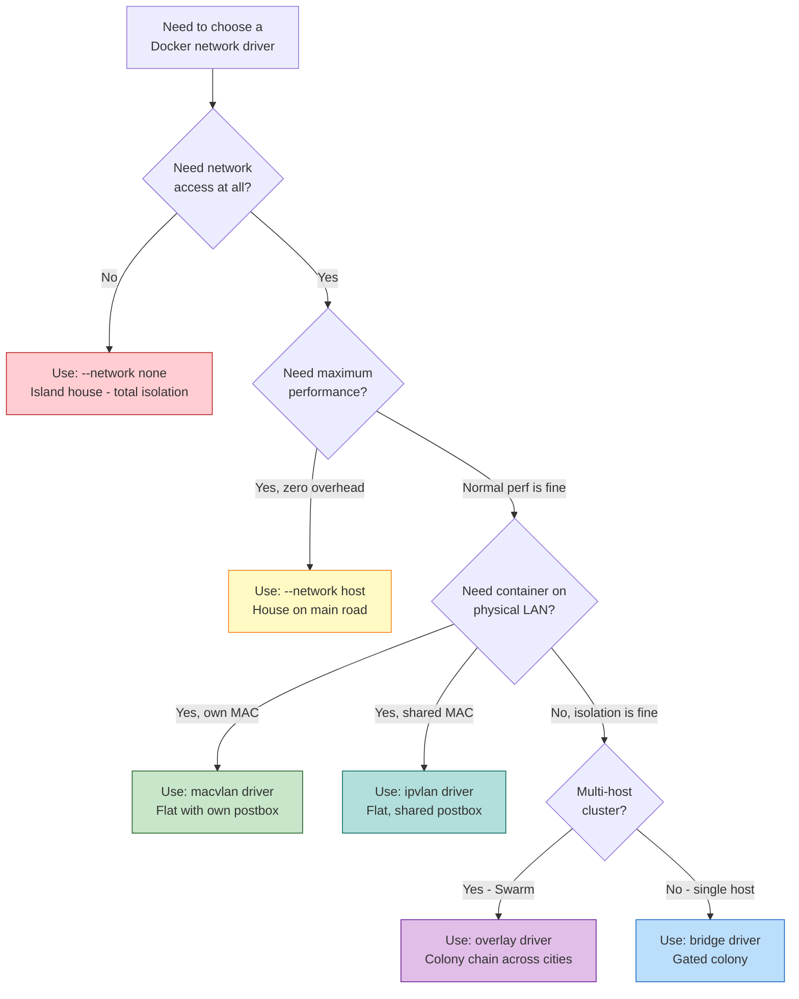
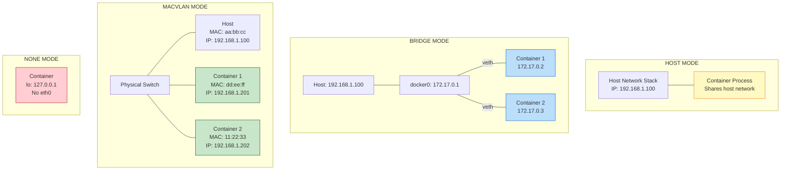

# File 12 — Advanced Docker Networking: Drivers & Isolation

**Topic:** Host, none, macvlan, ipvlan drivers, custom bridge networks, network isolation, choosing the right driver

**WHY THIS MATTERS:**
The bridge driver handles 80% of use cases, but production scenarios demand more. High-performance apps need host networking. Legacy systems need containers with real MAC addresses. Security-sensitive environments need network isolation. Knowing ALL the drivers lets you pick the right tool for each situation.

**Prerequisites:** File 11 (Networking Fundamentals)

---

## Story: Different Housing Setups in an Indian City

Think of Pune, with its mix of housing options:

**INDEPENDENT HOUSE ON MAIN ROAD (host network):**
No compound wall, no gate. The house sits directly on the main road. Anyone walking by can see it and knock on the door. Maximum accessibility but zero privacy. The house shares the road's address directly — like a shop on MG Road.

**ISLAND WITH NO ROAD (none network):**
A house built on a tiny island in the middle of a lake. No road, no bridge, no ferry. Complete isolation. Useful for a meditation retreat, but you can't order pizza.

**FLAT WITH OWN POSTBOX ON MAIN ROAD (macvlan):**
An apartment building where each flat has its own mailbox on the main road — the postman delivers directly to each flat without going through the building's reception. Each flat appears to be an independent house to the outside world.

**FLAT WITH SHARED POSTBOX, DIFFERENT FLOORS (ipvlan):**
Same apartment building, but all flats share one postbox address. The building's internal system routes mail to the correct floor. Simpler from the outside, organized inside.

- Main road house   = `--network host`   (no isolation)
- Island house      = `--network none`   (total isolation)
- Flat with mailbox = macvlan driver   (own MAC on physical net)
- Flat, shared mail = ipvlan driver    (shared MAC, separate IPs)
- Gated colony      = bridge driver    (isolated with gate)
- Private colony    = `--internal` bridge (no outside access)

---

## Section 1 — Host Network Mode

**WHY:** Host networking removes all network isolation between container and host. The container uses the host's IP and ports directly. Best for performance-critical apps.

```
SYNTAX: docker run --network host IMAGE
```

```bash
docker run -d --network host --name fast-nginx nginx:alpine
```

**WHAT HAPPENS:**
- Container uses the HOST's network namespace (no isolation)
- Container's port 80 IS the host's port 80 — no `-p` needed
- No docker0 bridge, no veth pairs, no NAT
- Container sees all host network interfaces

**TEST:**

```bash
curl http://localhost:80    # Works! nginx directly on host port 80
```

**VERIFY — no separate IP:**

```bash
docker exec fast-nginx hostname -i
# Returns: 192.168.1.100 (the HOST's IP, not 172.17.x.x)
```

**CHECK — container sees host interfaces:**

```bash
docker exec fast-nginx ip addr show
# Shows eth0, wlan0, docker0 — everything the host has
```

**WHEN TO USE:**

1. High-performance networking (no NAT overhead)
   - Latency-sensitive apps (trading systems, game servers)
   - Throughput-sensitive apps (video streaming, file transfer)
2. Apps that need to bind to many ports dynamically
3. Network monitoring tools (tcpdump, wireshark containers)
4. Service mesh proxies that need raw network access

**WHEN NOT TO USE:**

1. When running multiple containers that use the same port (port conflicts — only one process can bind port 80)
2. When you need network isolation between containers
3. In production multi-tenant environments

**PERFORMANCE DIFFERENCE:**

| Mode | Impact |
|------|--------|
| Bridge (with NAT) | ~5-8% latency overhead, ~10-15% throughput loss |
| Host (no NAT) | Native performance, zero overhead |

> **NOTE:** `--network host` only works on Linux. On Docker Desktop (Mac/Windows), it has limited effect because Docker runs inside a Linux VM.

---

## Section 2 — None Network Mode

**WHY:** Complete network isolation. The container has NO network interface except loopback. Used for batch jobs, security.

```
SYNTAX: docker run --network none IMAGE
```

```bash
docker run -d --network none --name isolated alpine sleep infinity
```

**VERIFY — only loopback:**

```bash
docker exec isolated ip addr show
```

**EXPECTED OUTPUT:**

```
1: lo: <LOOPBACK,UP,LOWER_UP>
    inet 127.0.0.1/8 scope host lo
# That's it. No eth0. No connection to anything.
```

**TEST — no connectivity:**

```bash
docker exec isolated ping -c 1 8.8.8.8
# ping: sendto: Network is unreachable
```

**WHEN TO USE:**

1. Batch processing jobs that only read/write volumes (data crunching, video encoding, ML model training)
2. Security-sensitive computations (crypto key generation)
3. Containers that should NEVER make network calls
4. Compliance requirements (air-gapped processing)

**EXAMPLE — Secure PDF generation:**

```bash
docker run --network none \
  -v ./input:/input:ro \
  -v ./output:/output \
  pdf-generator:latest \
  --input /input/report.html \
  --output /output/report.pdf
```

The PDF generator has no way to exfiltrate data over the network. Even if it's compromised, it can't phone home. Like the island house — peaceful and secure.

---

## Section 3 — Macvlan Driver

**WHY:** Macvlan gives each container its own MAC address on the physical network. Containers appear as physical devices. Essential for legacy apps that need to be on the LAN.

**CREATE a macvlan network:**

```
SYNTAX:
  docker network create \
    --driver macvlan \
    --subnet <SUBNET> \
    --gateway <GATEWAY> \
    -o parent=<HOST_INTERFACE> \
    NETWORK_NAME
```

**EXAMPLE:**

```bash
docker network create \
  --driver macvlan \
  --subnet 192.168.1.0/24 \
  --gateway 192.168.1.1 \
  --ip-range 192.168.1.200/29 \
  -o parent=eth0 \
  lan-net
```

`--ip-range 192.168.1.200/29` reserves IPs 200-207 for containers so they don't conflict with DHCP-assigned addresses.

**RUN a container on the macvlan:**

```bash
docker run -d --network lan-net --ip 192.168.1.201 \
  --name legacy-app legacy-app:latest
```

**VERIFY:**

```bash
docker exec legacy-app ip addr show eth0
```

**EXPECTED OUTPUT:**

```
2: eth0@if3: <BROADCAST,MULTICAST,UP,LOWER_UP>
    link/ether 02:42:c0:a8:01:c9 brd ff:ff:ff:ff:ff:ff
    inet 192.168.1.201/24 scope global eth0
```

The container has:
- Its own MAC address (02:42:c0:a8:01:c9)
- A real LAN IP (192.168.1.201)
- Is reachable from any device on the 192.168.1.0/24 network
- Appears in the router's ARP table as a separate device

**WHEN TO USE:**

1. Legacy applications that expect to be on the physical LAN
2. Applications that use multicast/broadcast (MDNS, SSDP)
3. When containers need to be directly reachable on the LAN without port mapping (like physical servers)
4. Network appliances (DHCP server, DNS server in container)

**LIMITATIONS:**

- Host CANNOT communicate with macvlan containers directly (Linux kernel restriction — traffic between parent and macvlan on same interface is dropped)
- Workaround: create a macvlan sub-interface on the host
- Requires promiscuous mode on the physical NIC
- Most public clouds block macvlan (no control over physical net)

**MACVLAN MODES:**
- **bridge** (default) — containers can talk to each other
- **private** — containers are isolated from each other
- **vepa** — traffic goes through external switch
- **passthru** — one container gets the entire parent interface

---

## Section 4 — IPvlan Driver

**CONCEPT:** Like macvlan, but all containers SHARE the host's MAC address. Only IP addresses differ.

**CREATE an ipvlan network:**

```
SYNTAX:
  docker network create \
    --driver ipvlan \
    --subnet <SUBNET> \
    --gateway <GATEWAY> \
    -o parent=<HOST_INTERFACE> \
    -o ipvlan_mode=<l2|l3|l3s> \
    NETWORK_NAME
```

**EXAMPLE (L2 mode — same subnet as host):**

```bash
docker network create \
  --driver ipvlan \
  --subnet 192.168.1.0/24 \
  --gateway 192.168.1.1 \
  --ip-range 192.168.1.210/29 \
  -o parent=eth0 \
  -o ipvlan_mode=l2 \
  ipvlan-l2-net
```

**EXAMPLE (L3 mode — different subnet, routing):**

```bash
docker network create \
  --driver ipvlan \
  --subnet 10.10.0.0/24 \
  -o parent=eth0 \
  -o ipvlan_mode=l3 \
  ipvlan-l3-net
```

- **L2 MODE:** All containers on the same broadcast domain as host. Works like macvlan but shares MAC. No promiscuous mode needed.
- **L3 MODE:** Each network is a separate subnet. Docker host acts as a router. No ARP/broadcast. More scalable.

**MACVLAN vs IPVLAN:**

| Feature        | Macvlan          | IPvlan               |
|----------------|------------------|----------------------|
| MAC address    | Unique per cont. | Shared with host     |
| Promiscuous    | Required         | Not required         |
| Cloud support  | Usually blocked  | Better support       |
| Broadcast      | Full support     | L2: yes, L3: no      |
| Performance    | Good             | Slightly better      |
| Use case       | LAN integration  | Cloud / many conts.  |

**WHY:** IPvlan is preferred over macvlan when:
- You have many containers (MAC table exhaustion risk)
- Cloud provider blocks promiscuous mode
- You need L3 routing between container subnets

---

## Section 5 — Custom Bridge Networks (Advanced)

**INTERNAL NETWORK — no internet access:**

```bash
docker network create --internal private-net
```

Containers on private-net can talk to each other but cannot reach the internet. Like a private colony with walls on all sides and no gate to the main road.

**EXAMPLE:**

```bash
docker network create --internal db-net
docker run -d --name pg --network db-net postgres:16
docker run -d --name app --network db-net myapp

# app can reach pg (internal communication works)
docker exec app ping pg  # SUCCESS

# pg cannot reach the internet
docker exec pg ping 8.8.8.8  # FAIL — Network is unreachable

# To give app internet access, connect it to TWO networks:
docker network create frontend-net
docker network connect frontend-net app

# Now app is on both db-net (for pg) and frontend-net (for internet)
# pg remains isolated on db-net only
```

**CUSTOM BRIDGE OPTIONS:**

```bash
docker network create \
  --driver bridge \
  --subnet 10.5.0.0/16 \
  --gateway 10.5.0.1 \
  --ip-range 10.5.1.0/24 \
  --opt "com.docker.network.bridge.name=br-custom" \
  --opt "com.docker.network.bridge.enable_icc=true" \
  --opt "com.docker.network.bridge.enable_ip_masquerade=true" \
  --opt "com.docker.network.driver.mtu=1500" \
  --label project=myapp \
  myapp-bridge
```

**OPTIONS EXPLAINED:**

| Option | Description |
|--------|-------------|
| `bridge.name` | name of the Linux bridge device |
| `bridge.enable_icc` | inter-container communication (true/false) |
| `bridge.enable_ip_masq` | outbound NAT (true/false) |
| `driver.mtu` | Maximum Transmission Unit size |

**DISABLE INTER-CONTAINER COMMUNICATION:**

```bash
docker network create \
  --opt "com.docker.network.bridge.enable_icc=false" \
  isolated-bridge
```

Containers on this network can reach the internet but NOT each other. Each container is in its own silo. Useful for running untrusted workloads that should not be able to scan or attack neighboring containers.

---

## Choosing the Right Network Driver



**DECISION SUMMARY:**
- **none** -> batch jobs, security, no network needed
- **host** -> performance-critical, port-heavy apps
- **macvlan** -> legacy LAN apps, multicast/broadcast needed
- **ipvlan** -> cloud environments, many containers, L3 routing
- **overlay** -> Docker Swarm / multi-host communication
- **bridge** -> 80% of use cases, good isolation + DNS

### Comparing Network Modes



**KEY DIFFERENCES:**
- **HOST:** Container IS the host (network-wise). Fastest, no isolation.
- **BRIDGE:** Container behind NAT. Isolated subnet. Most common.
- **MACVLAN:** Container on physical LAN with own MAC. Appears as real device.
- **NONE:** No network. Complete air gap.

---

## Section 6 — Network Segmentation Patterns

### Pattern 1: Frontend / Backend / Database Tiers

```bash
docker network create frontend-net
docker network create backend-net  --internal
docker network create db-net       --internal

# Frontend tier (public-facing)
docker run -d --name nginx \
  --network frontend-net \
  -p 80:80 -p 443:443 \
  nginx:alpine

# API tier (connected to frontend + backend)
docker run -d --name api \
  --network frontend-net \
  myapi:latest
docker network connect backend-net api

# Worker tier (connected to backend + db)
docker run -d --name worker \
  --network backend-net \
  myworker:latest
docker network connect db-net worker

# Database tier (most isolated)
docker run -d --name postgres \
  --network db-net \
  postgres:16
```

**RESULTING CONNECTIVITY:**
- nginx  -> can reach api (frontend-net)
- nginx  -> CANNOT reach worker or postgres
- api    -> can reach nginx (frontend-net) + worker (backend-net)
- api    -> CANNOT reach postgres directly
- worker -> can reach api (backend-net) + postgres (db-net)
- postgres -> can only reach worker (db-net)
- postgres -> CANNOT reach the internet (--internal)

**WHY:** Defense in depth. If nginx is compromised, the attacker can only see the api container. They cannot reach the database because nginx is not on db-net. Like having multiple security checkpoints in a government building.

### Pattern 2: Microservices with Shared Services

```bash
docker network create service-mesh
docker network create monitoring  --internal

# Shared services
docker run -d --name redis   --network service-mesh redis:7
docker run -d --name rabbitmq --network service-mesh rabbitmq:3

# Application services
docker run -d --name auth-svc    --network service-mesh auth:latest
docker run -d --name order-svc   --network service-mesh orders:latest
docker run -d --name payment-svc --network service-mesh payments:latest

# Monitoring (separate network, connected to service-mesh)
docker run -d --name prometheus --network monitoring prom/prometheus
docker network connect service-mesh prometheus

docker run -d --name grafana \
  --network monitoring \
  -p 3000:3000 \
  grafana/grafana
```

Prometheus can scrape all services (on service-mesh). Grafana can query Prometheus (on monitoring). Services cannot access Grafana directly.

---

## Section 7 — Network Plugins and CNI

Docker supports third-party network plugins for advanced networking needs:

**POPULAR PLUGINS:**
- **Weave Net** — mesh networking, multicast, encryption
- **Calico** — L3 networking, network policies, BGP
- **Flannel** — simple overlay for Kubernetes
- **Cilium** — eBPF-based networking, observability

**INSTALL (example — Weave):**

```bash
docker plugin install weaveworks/net-plugin:latest_release
```

**USE:**

```bash
docker network create --driver weaveworks/net-plugin:latest_release \
  weave-net
```

**DOCKER vs KUBERNETES NETWORKING:**
- Docker uses CNM (Container Network Model)
- Kubernetes uses CNI (Container Network Interface)
- Both achieve similar goals but with different plugin APIs.

**WHY:** Built-in drivers handle most cases. Plugins are for:
- Encrypted overlay networks (Weave)
- Network policies (Calico — allow/deny rules like firewall)
- eBPF-based observability (Cilium — see all traffic)
- Integration with existing network infrastructure (SDN)

---

## Section 8 — Troubleshooting Network Issues

**PROBLEM 1: Container cannot reach the internet**

```bash
# DIAGNOSIS:
docker exec mycontainer ping 8.8.8.8
# If fails → check if on --internal network
docker network inspect $(docker inspect mycontainer \
  --format '{{range .NetworkSettings.Networks}}{{.NetworkID}}{{end}}')
# Check "Internal": true/false

# Check iptables MASQUERADE:
sudo iptables -t nat -L POSTROUTING -n | grep 172.17
```

**PROBLEM 2: Container cannot resolve DNS names**

```bash
# DIAGNOSIS:
docker exec mycontainer cat /etc/resolv.conf
# Should show: nameserver 127.0.0.11 (on custom network)
# or:          nameserver 8.8.8.8 (on default bridge)

docker exec mycontainer nslookup google.com
docker exec mycontainer nslookup other-container-name
```

**PROBLEM 3: Port mapping not working**

```bash
# DIAGNOSIS:
docker port mycontainer
# Shows mapped ports

sudo iptables -t nat -L DOCKER -n
# Check DNAT rules exist

ss -tlnp | grep 8080
# Check if host port is actually listening

# Test from inside the container:
docker exec mycontainer curl localhost:80
# If this works but external access fails → iptables issue
```

**PROBLEM 4: Containers can't talk to each other by name**

```bash
# DIAGNOSIS:
# Are they on the SAME custom network?
docker inspect container1 --format '{{json .NetworkSettings.Networks}}' | jq
docker inspect container2 --format '{{json .NetworkSettings.Networks}}' | jq
# Both must be on the same custom (not default) network for DNS
```

**SWISS-ARMY KNIFE — netshoot container:**

```bash
docker run --rm -it --network container:mycontainer \
  nicolaka/netshoot bash

# Inside netshoot (shares network namespace with mycontainer):
  ip addr show          # see interfaces
  ss -tlnp              # see listening ports
  nslookup db           # test DNS
  traceroute 8.8.8.8    # trace route to internet
  tcpdump -i eth0 -n    # capture packets
  curl http://api:8080  # test HTTP
  iperf3 -c other-host  # bandwidth test
```

---

## Section 9 — Docker Compose Networking

Docker Compose automatically creates a bridge network named `<project>_default` for all services in the compose file.

**EXAMPLE — docker-compose.yml:**

```yaml
version: "3.9"
services:
  web:
    image: nginx:alpine
    ports:
      - "80:80"
    networks:
      - frontend

  api:
    image: myapi:latest
    networks:
      - frontend
      - backend

  db:
    image: postgres:16
    environment:
      POSTGRES_PASSWORD: secret
    networks:
      - backend

networks:
  frontend:
    driver: bridge
  backend:
    driver: bridge
    internal: true
```

**WHAT THIS CREATES:**
- `myproject_frontend` — bridge network (web + api)
- `myproject_backend` — internal bridge (api + db)

- web can reach api, but NOT db
- api can reach both web and db
- db can reach api, but NOT the internet

**ADVANCED NETWORK CONFIG IN COMPOSE:**

```yaml
networks:
  custom-net:
    driver: bridge
    driver_opts:
      com.docker.network.bridge.name: br-custom
    ipam:
      driver: default
      config:
        - subnet: 10.100.0.0/24
          gateway: 10.100.0.1

services:
  app:
    networks:
      custom-net:
        ipv4_address: 10.100.0.10
        aliases:
          - myapp
          - api-gateway
```

**WHY:** Compose handles network creation/deletion automatically. Services reference each other by service name (DNS). Custom network configs give you full control over subnets, IPs, and isolation — all declared in one YAML file.

---

## Example Block 1 — Complete Multi-Network Setup

**Production Multi-Network Architecture:**

```bash
#!/bin/bash
# setup-networks.sh — Production network setup script

# Create tiered networks
docker network create \
  --driver bridge \
  --subnet 10.1.0.0/24 \
  --label tier=public \
  public-tier

docker network create \
  --driver bridge \
  --subnet 10.2.0.0/24 \
  --internal \
  --label tier=application \
  app-tier

docker network create \
  --driver bridge \
  --subnet 10.3.0.0/24 \
  --internal \
  --opt "com.docker.network.bridge.enable_icc=true" \
  --label tier=data \
  data-tier

# Deploy services
docker run -d --name lb \
  --network public-tier \
  -p 80:80 -p 443:443 \
  haproxy:latest

docker run -d --name api-1 \
  --network app-tier \
  --network-alias api \
  myapi:latest

docker run -d --name api-2 \
  --network app-tier \
  --network-alias api \
  myapi:latest

docker run -d --name postgres \
  --network data-tier \
  -v pgdata:/var/lib/postgresql/data \
  postgres:16

docker run -d --name redis \
  --network data-tier \
  redis:7-alpine

# Cross-connect services that span tiers
docker network connect app-tier lb        # lb → api
docker network connect data-tier api-1    # api → db/redis
docker network connect data-tier api-2    # api → db/redis

# Verify connectivity matrix
echo "=== Connectivity Matrix ==="
echo "lb → api:      $(docker exec lb ping -c1 -W1 api > /dev/null 2>&1 && echo OK || echo FAIL)"
echo "lb → postgres:  $(docker exec lb ping -c1 -W1 postgres > /dev/null 2>&1 && echo OK || echo FAIL)"
echo "api-1 → postgres: $(docker exec api-1 ping -c1 -W1 postgres > /dev/null 2>&1 && echo OK || echo FAIL)"
echo "api-1 → redis:    $(docker exec api-1 ping -c1 -W1 redis > /dev/null 2>&1 && echo OK || echo FAIL)"
```

**EXPECTED OUTPUT:**

```
=== Connectivity Matrix ===
lb → api:        OK
lb → postgres:   FAIL     ← lb is NOT on data-tier (correct!)
api-1 → postgres: OK
api-1 → redis:    OK
```

---

## Example Block 2 — Network Performance Benchmarking

**TOOL:** iperf3 — measures network bandwidth between two points

```bash
# Step 1: Run iperf3 server
docker run -d --name iperf-server \
  --network test-net \
  networkstatic/iperf3 -s

# Step 2: Run iperf3 client (bridge mode)
docker run --rm --network test-net \
  networkstatic/iperf3 -c iperf-server

# Step 3: Run iperf3 client (host mode for comparison)
docker run --rm --network host \
  networkstatic/iperf3 -c localhost
```

**EXPECTED RESULTS (approximate):**

| Network Mode    | Bandwidth    | Latency     |
|-----------------|-------------|-------------|
| Host            | 40-50 Gbps   | 0.01 ms     |
| Custom Bridge   | 35-45 Gbps   | 0.03 ms     |
| Default Bridge  | 30-40 Gbps   | 0.05 ms     |
| Macvlan         | 38-48 Gbps   | 0.02 ms     |

These numbers help you decide when host mode is worth the isolation tradeoff. For most apps, the difference between bridge and host is negligible. Only ultra-low-latency applications benefit from host mode.

---

## Key Takeaways

1. **NETWORK DRIVERS:**
   - **bridge** -> default, isolated subnet, NAT, DNS (80% of cases)
   - **host** -> no isolation, native performance, Linux only
   - **none** -> no networking, total isolation
   - **macvlan** -> own MAC on physical LAN, legacy app integration
   - **ipvlan** -> shared MAC, L2/L3 modes, cloud-friendly
   - **overlay** -> multi-host (Swarm), not covered here

2. **`--internal` flag** creates networks with NO internet access. Containers can talk to each other but not the outside.

3. **Network segmentation pattern:** create separate networks per tier (public, app, data) and cross-connect only the services that need to communicate.

4. **`enable_icc=false`** prevents container-to-container communication even on the same network. Maximum isolation.

5. **Macvlan** gives containers real LAN presence (own MAC + IP). **IPvlan** shares the host MAC but assigns separate IPs.

6. **Docker Compose** auto-creates networks per project. Use `networks:` in compose YAML for custom topology.

7. **Debug with:** nicolaka/netshoot, docker network inspect, iptables -L, ip addr show, nslookup.

8. **Performance:** host > macvlan/ipvlan > custom bridge > default bridge. The difference matters only for extreme throughput/latency needs.

**HOUSING ANALOGY RECAP:**
- Independent house (host)  -> on the main road, no walls
- Island house (none)       -> total isolation, no roads
- Flat with mailbox (macvlan) -> own identity on the street
- Gated colony (bridge)     -> isolated with controlled access
- Private colony (internal) -> no gate to outside world
- Multi-colony network      -> controlled bridges between zones
