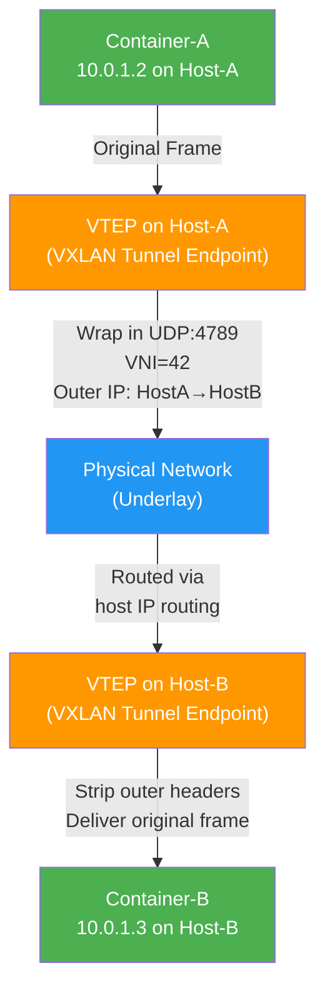
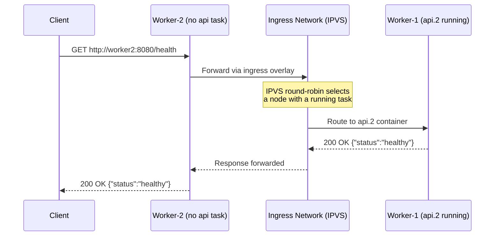

# File 13 — Overlay Networks, VXLAN & Multi-Host Networking

**Topic:** Overlay networks, VXLAN encapsulation, Docker Swarm networking, encrypted overlay, ingress routing mesh

**WHY THIS MATTERS:**
In production you almost never run everything on a single machine. The moment your app spans two or more hosts you need a network fabric that makes containers on different machines feel like they are on the SAME LAN. Overlay networks solve exactly this — and understanding VXLAN, ingress, and the routing mesh is what separates a dev who "uses Docker" from one who "operates Docker in production."

**Prerequisites:** Files 01-12, basic bridge/network knowledge.

---

## Story: The Indian Highway System

Imagine India's road network.

- **STATE ROADS (bridge networks)** — Connect towns within one state (one Docker host). Cheap, fast, local.

- **NATIONAL HIGHWAYS (overlay / VXLAN)** — Connect cities across states. They "overlay" the local road system: a truck (packet) enters NH-44 in Delhi, travels inside the highway tunnel, and exits in Chennai — never worrying about which state border it crossed. VXLAN is that highway tunnel: it wraps (encapsulates) city-level addresses inside highway-level headers.

- **TOLL PLAZAS (ingress routing mesh)** — No matter which toll plaza you stop at, the system knows where to route your vehicle. Similarly, the Swarm ingress mesh accepts traffic on ANY node and routes it to whichever node is actually running the target service.

Keep this picture in mind as we explore overlay networks.

---

### Section 1 — Why Bridge Networks Are Not Enough

**WHY:** A bridge network lives on a SINGLE Docker host. Containers on Host-A's bridge cannot talk to containers on Host-B's bridge — their network namespaces are isolated by the Linux kernel. You need something that spans hosts.

```
   Host-A (bridge0: 172.17.0.0/16)        Host-B (bridge0: 172.17.0.0/16)
   ┌──────────────────────┐                ┌──────────────────────┐
   │  web (172.17.0.2)    │   ──── X ────  │  db  (172.17.0.2)   │
   │  api (172.17.0.3)    │  CAN'T TALK!   │  cache (172.17.0.3) │
   └──────────────────────┘                └──────────────────────┘

   Both hosts use the SAME subnet — addresses collide,
   and there is no routing between them by default.
```

---

### Section 2 — What Is an Overlay Network?

**WHY:** An overlay network creates a virtual Layer-2 segment that spans multiple Docker hosts. Containers attached to the same overlay get unique IPs from a shared subnet and can communicate as if they were on the same switch — even though physical machines may be in different data centres.

```
   Overlay: "backend" (10.0.1.0/24)
   ┌────────────────────────────────────────────────────┐
   │  web (10.0.1.2)  ◄──────────►  db (10.0.1.3)     │
   │  [Host-A]                       [Host-B]           │
   └────────────────────────────────────────────────────┘

   From the containers' perspective they share one flat L2
   network — no NAT, no port mapping needed between them.
```

---

## Example Block 1 — Initialising Docker Swarm

**WHY:** Overlay networks (native driver) require Swarm mode. Swarm provides the control plane (distributed store, RAFT consensus) that synchronises network state across nodes.

```bash
# ---------- On Manager Node ----------
# SYNTAX: docker swarm init --advertise-addr <MANAGER_IP>
# FLAGS :
#   --advertise-addr   IP other nodes use to reach this manager
#   --listen-addr      (optional) IP:port for Swarm protocol traffic

docker swarm init --advertise-addr 192.168.1.10

# EXPECTED OUTPUT:
#   Swarm initialized: current node (abc123) is now a manager.
#   To add a worker to this swarm, run the following command:
#       docker swarm join --token SWMTKN-1-xxxxx 192.168.1.10:2377

# ---------- On Worker Node(s) ----------
docker swarm join --token SWMTKN-1-xxxxx 192.168.1.10:2377

# EXPECTED OUTPUT:
#   This node joined a swarm as a worker.

# ---------- Verify from Manager ----------
docker node ls

# EXPECTED OUTPUT:
#   ID           HOSTNAME   STATUS   AVAILABILITY   MANAGER STATUS
#   abc123 *     manager1   Ready    Active         Leader
#   def456       worker1    Ready    Active
#   ghi789       worker2    Ready    Active
```

---

## Example Block 2 — Creating an Overlay Network

**WHY:** Once Swarm is active you can create overlay networks. The default "ingress" overlay is created automatically; you create additional overlays to isolate service traffic.

```bash
# SYNTAX: docker network create -d overlay [OPTIONS] <NAME>
# FLAGS :
#   -d overlay           use the overlay driver
#   --subnet             CIDR for the overlay
#   --attachable         allow standalone containers to attach
#   --opt encrypted      encrypt VXLAN data plane (IPSec)

# --- Basic overlay ---
docker network create -d overlay backend

# --- Overlay with specific subnet ---
docker network create -d overlay --subnet 10.10.0.0/24 frontend

# --- Attachable overlay (standalone containers can join) ---
docker network create -d overlay --attachable shared

# --- Encrypted overlay ---
docker network create -d overlay --opt encrypted secure-net

# --- List networks ---
docker network ls --filter driver=overlay

# EXPECTED OUTPUT:
#   NETWORK ID   NAME       DRIVER    SCOPE
#   aaa111       ingress    overlay   swarm
#   bbb222       backend    overlay   swarm
#   ccc333       frontend   overlay   swarm
#   ddd444       shared     overlay   swarm
#   eee555       secure-net overlay   swarm

# --- Inspect overlay ---
docker network inspect backend --format '{{json .IPAM}}'

# EXPECTED OUTPUT:
#   {"Driver":"default","Config":[{"Subnet":"10.0.1.0/24","Gateway":"10.0.1.1"}]}
```

---

### Section 3 — VXLAN Encapsulation (The Highway Tunnel)

**WHY:** VXLAN (Virtual Extensible LAN) is the tunnelling protocol that makes overlay possible. Each overlay frame is wrapped inside a UDP packet (port 4789) with a 24-bit VNI (VXLAN Network Identifier) — like a highway number stamped on the truck's windshield.

```
   Original Container Frame
   ┌──────────────────────────────────────────┐
   │ Eth │ IP (10.0.1.2→10.0.1.3) │ Payload  │
   └──────────────────────────────────────────┘
                     │
                     ▼  VXLAN Encapsulation
   ┌──────────────────────────────────────────────────────────┐
   │ Outer Eth │ Outer IP  │ UDP  │ VXLAN  │ Original Frame  │
   │           │ (HostA →  │ :4789│ VNI=42 │                 │
   │           │  HostB)   │      │        │                 │
   └──────────────────────────────────────────────────────────┘

   * Outer Eth/IP : Physical host addresses (the highway)
   * UDP 4789     : VXLAN tunnel port
   * VNI          : Identifies which overlay network (highway number)
   * Original Frame: The container's packet rides INSIDE
```



---

## Example Block 3 — Deploying Services on Overlay

**WHY:** Swarm services are the unit of deployment. When a service is attached to an overlay, every task (container) regardless of which node it lands on, joins that overlay.

```bash
# SYNTAX: docker service create --network <OVERLAY> [OPTIONS] <IMAGE>
# FLAGS :
#   --name            service name (also DNS name)
#   --replicas        number of tasks
#   --network         overlay to attach
#   --publish         port mapping (uses ingress by default)

# --- Create backend API service ---
docker service create \
  --name api \
  --replicas 3 \
  --network backend \
  --publish published=8080,target=3000 \
  node:18-alpine

# --- Create database service ---
docker service create \
  --name mongo \
  --replicas 1 \
  --network backend \
  mongo:7

# --- Verify ---
docker service ls

# EXPECTED OUTPUT:
#   ID         NAME    MODE         REPLICAS   IMAGE            PORTS
#   svc111     api     replicated   3/3        node:18-alpine   *:8080->3000/tcp
#   svc222     mongo   replicated   1/1        mongo:7

# --- Check where tasks landed ---
docker service ps api

# EXPECTED OUTPUT:
#   ID        NAME    IMAGE            NODE       STATE
#   t1        api.1   node:18-alpine   manager1   Running
#   t2        api.2   node:18-alpine   worker1    Running
#   t3        api.3   node:18-alpine   worker2    Running

# All three api tasks can reach "mongo" by DNS name
# because they share the "backend" overlay network.
```

---

### Section 4 — Swarm Service Discovery

**WHY:** Swarm embeds a DNS server. Every service name resolves to a Virtual IP (VIP) that load-balances across tasks. This is automatic — no Consul, no etcd config needed.

```bash
# From inside any task on the "backend" overlay:

# --- DNS lookup ---
nslookup api
# Server:    127.0.0.11           (embedded DNS)
# Name:      api
# Address:   10.0.1.10            (VIP — Virtual IP)

# --- Curl the VIP ---
curl http://api:3000/health
# Swarm's IPVS load-balancer distributes requests across
# all healthy api tasks (round-robin by default).

# --- See individual task IPs ---
nslookup tasks.api
# Address:   10.0.1.11   (api.1)
# Address:   10.0.1.12   (api.2)
# Address:   10.0.1.13   (api.3)
```

---

### Section 5 — Ingress Routing Mesh

**WHY:** The routing mesh means you can hit ANY node's IP on the published port and Swarm routes the request to a node that IS running the service. Like toll plazas — enter at any one and the highway delivers you to the right city.

```
   Client hits http://worker2:8080
   But api task is NOT on worker2!

   ┌──────────┐       ┌──────────┐       ┌──────────┐
   │ manager1 │       │ worker1  │       │ worker2  │
   │ api.1    │       │ api.2    │       │ (no api) │
   │ :8080 ✓  │       │ :8080 ✓  │       │ :8080 ✓  │
   └──────────┘       └──────────┘       └──────────┘
        ▲                   ▲                  ▲
        └───────────────────┼──────────────────┘
                            │
              Ingress Network (IPVS LB)
                            │
                       Client Request

   The ingress network uses IPVS (IP Virtual Server) to
   forward the request from worker2 → worker1 (or manager1)
   where an api task is actually running.
```

```bash
# SYNTAX: docker service create --publish mode=ingress,...
#   mode=ingress  (default) — routing mesh, any node accepts
#   mode=host     — only the node running the task listens

# --- Ingress mode (default) ---
docker service create \
  --name web \
  --replicas 2 \
  --publish published=80,target=8080,mode=ingress \
  nginx

# --- Host mode (bypass mesh) ---
docker service create \
  --name web-host \
  --replicas 2 \
  --publish published=80,target=8080,mode=host \
  nginx
# In host mode, only nodes running a task respond on :80
```



---

## Example Block 4 — Encrypted Overlay

**WHY:** By default VXLAN data is sent in clear text over the underlay. With `--opt encrypted`, Docker negotiates an IPSec tunnel between nodes for that overlay — critical when your underlay traverses untrusted networks.

```bash
# --- Create encrypted overlay ---
docker network create -d overlay --opt encrypted payments

# EXPECTED OUTPUT:
#   abc123def456   (network ID)

# --- Deploy sensitive service ---
docker service create \
  --name payment-api \
  --replicas 2 \
  --network payments \
  myregistry/payment:v2

# --- Verify encryption ---
docker network inspect payments --format '{{.Options}}'

# EXPECTED OUTPUT:
#   map[encrypted:]
#   (the key "encrypted" is present — value is empty but flag is set)

# WHAT HAPPENS UNDER THE HOOD:
#   1. Docker creates IPSec SA (Security Associations) between
#      every pair of nodes that have tasks on this overlay.
#   2. ESP (Encapsulating Security Payload) encrypts VXLAN
#      traffic — AES-256-GCM by default.
#   3. Keys are auto-rotated by the Swarm manager.
#
# PERFORMANCE NOTE:
#   Encryption adds ~10-15% CPU overhead.  Use it only for
#   overlays carrying sensitive data (payments, PII, etc.).
```

---

## Example Block 5 — Multi-Overlay Service Architecture

**WHY:** Production services often need access to multiple network segments — a "frontend" overlay for public traffic and a "backend" overlay for database access.

```bash
# --- Create two overlays ---
docker network create -d overlay frontend
docker network create -d overlay backend

# --- API service on BOTH overlays ---
docker service create \
  --name api \
  --replicas 3 \
  --network frontend \
  --network backend \
  --publish published=443,target=3000 \
  myregistry/api:v1

# --- Database on backend ONLY ---
docker service create \
  --name postgres \
  --replicas 1 \
  --network backend \
  postgres:16

# --- Nginx proxy on frontend ONLY ---
docker service create \
  --name proxy \
  --replicas 2 \
  --network frontend \
  --publish published=80,target=80 \
  nginx

# RESULT:
#   proxy ──frontend──► api ──backend──► postgres
#   proxy CANNOT reach postgres (different overlay, no route)
#   This is network segmentation at the overlay level.
```

---

### Section 6 — Overlay Network Troubleshooting

**WHY:** Overlay issues are common in production — port 4789 blocked by firewalls, MTU mismatches, stale network state.

```bash
# 1. CHECK REQUIRED PORTS ARE OPEN
#    TCP 2377  — Swarm management
#    TCP/UDP 7946 — Node-to-node gossip
#    UDP 4789  — VXLAN data plane
#    IP Proto 50 — ESP (if encrypted overlay)

# 2. VERIFY VXLAN CONNECTIVITY
docker run --rm --net=host nicolaka/netshoot \
  tcpdump -i eth0 'port 4789' -c 5

# 3. INSPECT OVERLAY NETWORK
docker network inspect backend

# 4. CHECK SERVICE DNS FROM INSIDE A CONTAINER
docker exec -it <container_id> nslookup api

# 5. FLUSH STALE NETWORK STATE
#    Sometimes after node crashes, overlay state gets stale:
docker network disconnect -f backend <container_id>
docker service update --force api

# 6. MTU ISSUES
#    VXLAN adds 50 bytes of overhead.
#    If underlay MTU = 1500, overlay MTU should be 1450.
#    Check: docker network inspect backend --format '{{.Options}}'
#    Fix:   docker network create -d overlay --opt com.docker.network.driver.mtu=1450 backend-fixed
```

---

## Example Block 6 — Standalone Containers on Overlay

**WHY:** By default only Swarm services can use overlay. The `--attachable` flag lets standalone containers join — useful for debugging or one-off tasks.

```bash
# --- Create attachable overlay ---
docker network create -d overlay --attachable debug-net

# --- Run a standalone debug container ---
docker run -it --rm --network debug-net nicolaka/netshoot bash

# Inside the container you can now:
#   ping api          (if api service is on debug-net)
#   curl api:3000     (service discovery works)
#   dig api           (DNS resolution via 127.0.0.11)

# --- Without --attachable you get: ---
#   Error: Could not attach to network debug-net:
#   only containers in swarm mode can attach to overlay networks
```

---

### Section 7 — Overlay vs Other Multi-Host Solutions

**WHY:** Overlay is not the only option. Understanding alternatives helps you pick the right tool.

```
   ┌───────────────┬────────────────┬────────────────┬────────────────┐
   │ Feature       │ Overlay/VXLAN  │ Macvlan        │ Calico/Flannel │
   ├───────────────┼────────────────┼────────────────┼────────────────┤
   │ Multi-host    │ Yes            │ Yes (L2 only)  │ Yes            │
   │ Encryption    │ --opt encrypted│ No (manual)    │ WireGuard      │
   │ Performance   │ Good (kernel)  │ Best (no NAT)  │ Good (eBPF)    │
   │ Service Disc. │ Swarm DNS      │ None built-in  │ Kubernetes DNS │
   │ Use Case      │ Docker Swarm   │ Legacy / IoT   │ Kubernetes     │
   │ Complexity    │ Low            │ Low            │ Medium-High    │
   └───────────────┴────────────────┴────────────────┴────────────────┘
```

---

## Example Block 7 — Scaling & Rolling Updates on Overlay

**WHY:** One of the biggest benefits of overlay + Swarm is seamless scaling and zero-downtime updates.

```bash
# --- Scale service up ---
docker service scale api=6

# EXPECTED OUTPUT:
#   api scaled to 6
#   verify: docker service ps api
#   New tasks auto-join the overlay — DNS and LB update instantly.

# --- Rolling update ---
# SYNTAX: docker service update [OPTIONS] <SERVICE>
# FLAGS :
#   --image                new image version
#   --update-parallelism   tasks updated at a time
#   --update-delay         wait between batches
#   --update-failure-action pause|continue|rollback

docker service update \
  --image myregistry/api:v2 \
  --update-parallelism 2 \
  --update-delay 10s \
  --update-failure-action rollback \
  api

# EXPECTED OUTPUT:
#   api: update paused at task api.2 ... (if failure)
#   api: rolled back successfully       (if --update-failure-action rollback)

# --- Rollback manually ---
docker service rollback api
```

---

## Example Block 8 — Inspecting Overlay Internals

**WHY:** When debugging, you need to see the overlay's VXLAN interfaces, network namespaces, and IPVS rules.

```bash
# --- List VXLAN interfaces on host ---
ip -d link show type vxlan

# EXPECTED OUTPUT:
#   vxlan0: ... id 4097 ... dstport 4789 ...

# --- See overlay network namespaces ---
ls /var/run/docker/netns/

# --- Enter the ingress namespace ---
nsenter --net=/var/run/docker/netns/ingress_sbox ip addr

# --- Check IPVS load-balancing rules ---
nsenter --net=/var/run/docker/netns/ingress_sbox iptables -t nat -L -n
nsenter --net=/var/run/docker/netns/ingress_sbox ipvsadm -Ln

# EXPECTED OUTPUT (ipvsadm):
#   IP Virtual Server version ...
#   TCP  10.0.0.5:8080 rr
#     -> 10.0.1.11:3000   Masq   1
#     -> 10.0.1.12:3000   Masq   1
#     -> 10.0.1.13:3000   Masq   1
```

---

### Section 8 — Best Practices for Overlay Networks

**WHY:** Knowing what NOT to do is just as important as knowing the commands.

1. **SEGMENT by concern** — separate overlays for frontend, backend, monitoring. Limits blast radius.

2. **USE ENCRYPTION** for sensitive overlays (payment, PII). Accept the ~10-15% CPU cost.

3. **MONITOR VXLAN** — watch for packet drops: docker stats, node-level tcpdump on port 4789.

4. **MTU AWARENESS** — set overlay MTU = underlay MTU - 50. Prevents fragmentation and mysterious TCP stalls.

5. **LIMIT OVERLAY SCOPE** — don't put all 50 services on one overlay. ARP/broadcast traffic grows with scale.

6. **FIREWALL RULES** — open 2377, 7946, 4789, and proto 50 between ALL Swarm nodes. Forgetting one port is the #1 cause of "overlay not working" issues.

7. **PREFER --attachable only when needed** — it weakens isolation by letting any standalone container join.

8. **USE HEALTH CHECKS** — Swarm only routes to healthy tasks. Without health checks, traffic hits broken containers.

---

## Key Takeaways

1. **OVERLAY NETWORKS** create a virtual L2 segment spanning multiple Docker hosts via VXLAN encapsulation (UDP 4789).

2. **VXLAN** wraps container frames in outer host-IP headers, uses a 24-bit VNI to identify the overlay — like a national highway number on a truck's windshield.

3. **DOCKER SWARM** provides the control plane for overlay: distributed key-value store, node discovery, and certificate management — all built in.

4. **INGRESS ROUTING MESH** lets any Swarm node accept traffic on a published port and routes it to a task-running node via IPVS — the toll-plaza model.

5. **ENCRYPTED OVERLAY** (`--opt encrypted`) adds IPSec between nodes — use for sensitive traffic, accept CPU overhead.

6. **SERVICE DISCOVERY** is automatic: service names resolve to a VIP that load-balances across tasks.

7. **KEY PORTS** to open: TCP 2377, TCP/UDP 7946, UDP 4789, IP protocol 50 (for encrypted overlays).

8. **STATE ROAD vs NATIONAL HIGHWAY** — bridge for single-host isolation, overlay for multi-host communication.
