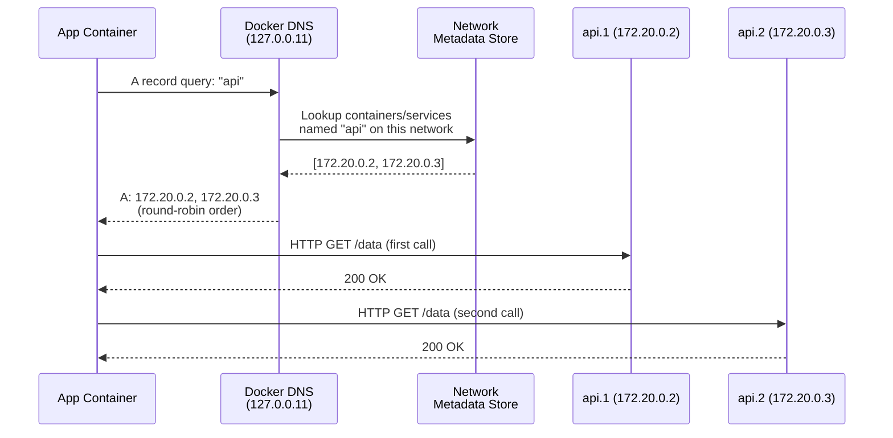
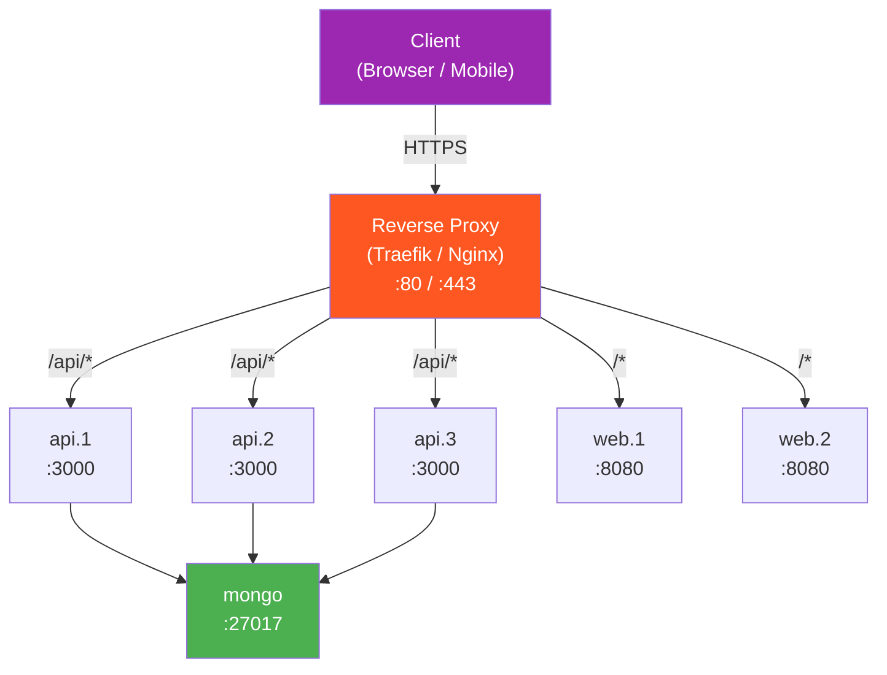

# File 14 — DNS, Service Discovery & Load Balancing

**Topic:** Embedded DNS (127.0.0.11), service aliases, round-robin DNS, network-scoped aliases, Traefik / Nginx reverse proxy patterns

**WHY THIS MATTERS:**
Containers are ephemeral — they get new IPs every time they restart. Hard-coding IPs is a recipe for disaster. Docker's built-in DNS and load balancing let services find each other by NAME, and reverse proxies add path-based routing, TLS termination, and health-aware load balancing on top. This is the backbone of any microservices architecture running on Docker.

**Prerequisites:** Files 01-13, overlay & bridge networking.

---

## Story: The Office Reception Desk

Picture a large Indian corporate office — say, Infosys campus in Mysuru.

- **RECEPTIONIST (DNS server at 127.0.0.11)** — Every visitor walks in and asks the front desk: "Where is the Finance department?" The receptionist looks up the directory and says "Building 3, Floor 2, Desk 7." She never says "go to IP 10.0.1.42" — she maps NAMES to locations.

- **MULTIPLE DESKS for busy departments (load balancing)** — If Finance has 5 desks, the receptionist sends visitors to whichever desk is free. Sometimes she gives desk numbers in round-robin order; sometimes she checks which desk has the shortest queue (health-based routing).

- **DEPARTMENT ALIASES (network-alias)** — The "IT Support" department is also known as "helpdesk" and "tech-support." Any of those names work at the reception.

- **SECURITY GUARD (reverse proxy)** — Sits at the building gate, checks visitor badges, routes them to the right building, and turns away unauthorised visitors. This is Traefik or Nginx in front of your services.

---

### Section 1 — Docker's Embedded DNS Server

**WHY:** Every container on a user-defined network gets access to Docker's internal DNS at 127.0.0.11. This resolves container names and service names to their current IPs. The default "bridge" network does NOT have this — only user-defined networks do.

Every container on a user-defined network has its `/etc/resolv.conf` set to:

```
nameserver 127.0.0.11
options ndots:0
```

This 127.0.0.11 is Docker's embedded DNS server. It intercepts DNS queries and resolves:
- Container names → container IP
- Service names → VIP (Swarm) or round-robin IPs
- Network aliases → all containers sharing that alias

| Network Type | DNS | Container Name Resolution |
|---|---|---|
| DEFAULT bridge network | host's /etc/resolv.conf | NO |
| User-defined network | 127.0.0.11 | YES |

---

## Example Block 1 — Container Name DNS Resolution

**WHY:** The simplest form of service discovery — just use the container name as a hostname.

```bash
# --- Create a user-defined network ---
docker network create myapp

# --- Run two containers ---
docker run -d --name api --network myapp nginx:alpine
docker run -d --name db  --network myapp mongo:7

# --- Test DNS from api container ---
docker exec api nslookup db

# EXPECTED OUTPUT:
#   Server:    127.0.0.11
#   Address:   127.0.0.11#53
#
#   Non-authoritative answer:
#   Name:    db
#   Address: 172.19.0.3

# --- Ping by name ---
docker exec api ping -c 2 db

# EXPECTED OUTPUT:
#   PING db (172.19.0.3): 56 data bytes
#   64 bytes from 172.19.0.3: seq=0 ttl=64 time=0.085 ms

# --- Works from db too ---
docker exec db nslookup api
# Name: api   Address: 172.19.0.2
```

---

### Section 2 — Network Aliases (--network-alias)

**WHY:** Aliases let multiple containers respond to the SAME DNS name. This is how you get client-side load balancing via round-robin DNS — no external LB needed.

`--network-alias` gives a container an ADDITIONAL DNS name on a specific network. Multiple containers can share the same alias — DNS returns ALL their IPs (round-robin).

Think of it like the "IT Support" alias at reception: three technicians all respond to the name "helpdesk."

---

## Example Block 2 — Round-Robin DNS with Aliases

**WHY:** This is the simplest load-balancing pattern in Docker. No sidecar, no proxy — just DNS returning multiple IPs.

```bash
# --- Create network ---
docker network create search-net

# --- Run three Elasticsearch nodes with the same alias ---
# SYNTAX: docker run --network-alias <ALIAS> ...

docker run -d --name es1 --network search-net --network-alias search elasticsearch:8.12.0
docker run -d --name es2 --network search-net --network-alias search elasticsearch:8.12.0
docker run -d --name es3 --network search-net --network-alias search elasticsearch:8.12.0

# --- Query the alias ---
docker run --rm --network search-net alpine nslookup search

# EXPECTED OUTPUT:
#   Name:    search
#   Address: 172.20.0.2
#   Address: 172.20.0.3
#   Address: 172.20.0.4

# DNS returns ALL three IPs.  The client picks one — each
# query may return them in a different order (round-robin).

# --- Curl test (rotate through nodes) ---
for i in 1 2 3 4 5; do
  docker run --rm --network search-net alpine wget -qO- http://search:9200 2>/dev/null | head -5
done
# Each request may hit a different node.

# --- Verify with dig ---
docker run --rm --network search-net nicolaka/netshoot dig search

# EXPECTED OUTPUT (Answer Section):
#   search.    600   IN   A   172.20.0.2
#   search.    600   IN   A   172.20.0.3
#   search.    600   IN   A   172.20.0.4
```



---

## Example Block 3 — Docker Compose Service Names as DNS

**WHY:** In docker-compose, every service name is automatically registered as a DNS name on the project's default network. This is the most common way developers use service discovery.

```yaml
# --- compose.yaml ---
services:
  web:
    image: nginx:alpine
    ports:
      - "80:80"
  api:
    image: node:18-alpine
    command: node server.js
    environment:
      - DB_HOST=mongo     # ← use service name as hostname!
  mongo:
    image: mongo:7
```

Docker Compose creates a default network: `<project>_default`. All three services join it automatically.

```bash
# --- Start ---
docker compose up -d

# --- DNS works between services ---
docker compose exec api nslookup mongo
# Name: mongo   Address: 172.21.0.4

docker compose exec api nslookup web
# Name: web     Address: 172.21.0.2

# --- Your Node.js code simply uses: ---
#   mongoose.connect('mongodb://mongo:27017/mydb')
#   No IPs, no env vars for host — just the service name.
```

---

### Section 3 — Compose Network Aliases

**WHY:** Compose also supports explicit aliases — useful when you want a service reachable by multiple names or when migrating from another service name.

```yaml
# --- compose.yaml with aliases ---
services:
  api:
    image: node:18-alpine
    networks:
      backend:
        aliases:
          - app-server
          - rest-api
  mongo:
    image: mongo:7
    networks:
      backend:
        aliases:
          - database
          - datastore

networks:
  backend:
```

Now "api" is reachable as: `api`, `app-server`, `rest-api`. And "mongo" is reachable as: `mongo`, `database`, `datastore`. All resolve to the same container IP on the "backend" network.

---

## Example Block 4 — Swarm VIP vs DNSRR

**WHY:** Swarm offers TWO service discovery modes:
- **VIP (default)** — single virtual IP, kernel-level IPVS LB
- **DNSRR** — multiple IPs returned, client picks one

Knowing when to use each is important.

```bash
# --- VIP mode (default) ---
docker service create \
  --name api \
  --replicas 3 \
  --network backend \
  --endpoint-mode vip \
  node:18-alpine

# DNS lookup returns ONE IP (the VIP):
#   nslookup api  →  10.0.1.5 (VIP)
# All traffic to 10.0.1.5 is load-balanced by IPVS in the kernel.

# PROS: connection-level LB, works with any client
# CONS: slightly higher latency (extra hop through IPVS)

# --- DNSRR mode ---
docker service create \
  --name search \
  --replicas 3 \
  --network backend \
  --endpoint-mode dnsrr \
  elasticsearch:8.12.0

# DNS lookup returns ALL task IPs:
#   nslookup search  →  10.0.1.11, 10.0.1.12, 10.0.1.13
# Client (or a proxy in front) picks which IP to use.

# PROS: no extra LB hop, client controls routing
# CONS: client must handle rotation, no published ports (no ingress)

# NOTE: DNSRR services CANNOT use --publish (no ingress mesh).
#        Use a reverse proxy in front if external access is needed.
```

---

### Section 4 — Health-Check Based Routing

**WHY:** DNS round-robin is blind — it returns IPs of ALL containers, even unhealthy ones. Health checks let Docker remove unhealthy containers from the pool.

```bash
# --- Dockerfile with HEALTHCHECK ---
# HEALTHCHECK --interval=10s --timeout=3s --retries=3 \
#   CMD curl -f http://localhost:3000/health || exit 1

# --- Or in docker run ---
docker run -d \
  --name api \
  --network myapp \
  --health-cmd="curl -f http://localhost:3000/health || exit 1" \
  --health-interval=10s \
  --health-timeout=3s \
  --health-retries=3 \
  myregistry/api:v1

# --- Check health status ---
docker inspect --format='{{.State.Health.Status}}' api

# EXPECTED OUTPUT: healthy | unhealthy | starting

# --- In Swarm mode ---
# Unhealthy tasks are AUTOMATICALLY replaced by the
# scheduler.  The routing mesh only forwards to healthy
# tasks.  This is why health checks are so important.

# --- In standalone mode ---
# Docker marks container status but does NOT restart it
# (unless you use --restart=on-failure or a restart policy).
# DNS still returns the IP — you need a proxy (Traefik)
# that checks health before forwarding.
```

---

### Section 5 — Reverse Proxy Patterns

**WHY:** DNS-based LB has limits — no path routing, no TLS termination, no rate limiting. A reverse proxy sits in front and adds all of these. Think of it as upgrading from a receptionist to a full security + concierge team.

DNS Round-Robin limitations:
- No path-based routing (`/api` -> api, `/web` -> web)
- No TLS termination
- No rate limiting
- No sticky sessions
- DNS TTL caching by clients (stale IPs)
- No health-aware routing in standalone mode

Reverse Proxy (Traefik / Nginx / HAProxy) adds:
- Path & host based routing
- Automatic TLS (Let's Encrypt)
- Health-check aware routing
- Rate limiting, circuit breaking
- Websocket support
- Observability (metrics, access logs)



---

## Example Block 5 — Nginx as Reverse Proxy

**WHY:** Nginx is the most widely used reverse proxy. Knowing the basic Docker setup is essential.

```nginx
# --- nginx.conf ---
upstream api_pool {
    server api:3000;     # Docker DNS resolves "api" to all replicas
}

server {
    listen 80;

    location /api/ {
        proxy_pass http://api_pool/;
        proxy_set_header Host $host;
        proxy_set_header X-Real-IP $remote_addr;
    }

    location / {
        proxy_pass http://web:8080/;
    }
}
```

```yaml
# --- compose.yaml ---
services:
  proxy:
    image: nginx:alpine
    ports:
      - "80:80"
    volumes:
      - ./nginx.conf:/etc/nginx/conf.d/default.conf:ro
    depends_on:
      - api
      - web
    networks:
      - frontend

  api:
    image: myregistry/api:v1
    deploy:
      replicas: 3
    networks:
      - frontend
      - backend

  web:
    image: myregistry/web:v1
    deploy:
      replicas: 2
    networks:
      - frontend

  mongo:
    image: mongo:7
    networks:
      - backend

networks:
  frontend:
  backend:
```

```bash
docker compose up -d

# RESULT:
#   Client → :80 → nginx → /api/* → api (round-robin across 3)
#                         → /*    → web (round-robin across 2)
```

---

## Example Block 6 — Traefik as Reverse Proxy

**WHY:** Traefik auto-discovers Docker containers via labels — no config files to maintain. It's the "zero-config" proxy.

```yaml
# --- compose.yaml ---
services:
  traefik:
    image: traefik:v3
    command:
      - "--providers.docker=true"
      - "--providers.docker.exposedbydefault=false"
      - "--entrypoints.web.address=:80"
      - "--entrypoints.websecure.address=:443"
      - "--certificatesresolvers.letsencrypt.acme.email=admin@example.com"
      - "--certificatesresolvers.letsencrypt.acme.storage=/letsencrypt/acme.json"
      - "--certificatesresolvers.letsencrypt.acme.httpchallenge.entrypoint=web"
    ports:
      - "80:80"
      - "443:443"
    volumes:
      - /var/run/docker.sock:/var/run/docker.sock:ro
      - letsencrypt:/letsencrypt

  api:
    image: myregistry/api:v1
    labels:
      - "traefik.enable=true"
      - "traefik.http.routers.api.rule=Host(`api.example.com`)"
      - "traefik.http.routers.api.entrypoints=websecure"
      - "traefik.http.routers.api.tls.certresolver=letsencrypt"
      - "traefik.http.services.api.loadbalancer.server.port=3000"
      - "traefik.http.services.api.loadbalancer.healthcheck.path=/health"
      - "traefik.http.services.api.loadbalancer.healthcheck.interval=10s"

  web:
    image: myregistry/web:v1
    labels:
      - "traefik.enable=true"
      - "traefik.http.routers.web.rule=Host(`www.example.com`)"
      - "traefik.http.routers.web.entrypoints=websecure"
      - "traefik.http.routers.web.tls.certresolver=letsencrypt"

volumes:
  letsencrypt:
```

**Key Traefik Labels:**

| Label | Purpose |
|---|---|
| `traefik.enable=true` | Opt-in this container |
| `traefik.http.routers.X.rule` | Routing rule (Host, Path, etc.) |
| `traefik.http.routers.X.entrypoints` | Which port(s) |
| `traefik.http.routers.X.tls` | Enable TLS |
| `traefik.http.services.X.loadbalancer.server.port` | Backend port |
| `traefik.http.services.X.loadbalancer.healthcheck.path` | Health endpoint |

---

## Example Block 7 — DNS Debugging Toolkit

**WHY:** When service discovery breaks, you need to see what DNS is returning. These are the go-to debugging commands.

```bash
# --- 1. Check /etc/resolv.conf ---
docker exec api cat /etc/resolv.conf
# EXPECTED: nameserver 127.0.0.11

# --- 2. nslookup ---
docker exec api nslookup mongo
# Shows: Name, Address

# --- 3. dig (more detail) ---
docker run --rm --network myapp nicolaka/netshoot dig api
# Shows: A records, TTL, authority section

# --- 4. getent (uses system resolver) ---
docker exec api getent hosts mongo
# EXPECTED: 172.21.0.4   mongo

# --- 5. Check DNS for a scaled service ---
docker run --rm --network myapp nicolaka/netshoot dig search
# Shows: multiple A records for round-robin alias

# --- 6. Reverse DNS ---
docker run --rm --network myapp nicolaka/netshoot dig -x 172.21.0.4
# EXPECTED: 4.0.21.172.in-addr.arpa. PTR mongo.<network>.

# --- 7. DNS over a specific network ---
# If container is on multiple networks, DNS resolves
# names visible on EACH network independently.
docker inspect api --format '{{json .NetworkSettings.Networks}}' | jq
```

---

### Section 6 — Advanced: External DNS and Custom Resolvers

**WHY:** Sometimes containers need to resolve names outside Docker — other services on your LAN, public APIs, etc. Docker's DNS forwards unknown names to the host's upstream DNS, but you can customise this.

```bash
# --- Set custom DNS for a container ---
docker run -d --name api \
  --dns 8.8.8.8 \
  --dns 8.8.4.4 \
  --dns-search example.com \
  --network myapp \
  node:18-alpine

# --- Set custom DNS in daemon.json (global) ---
# /etc/docker/daemon.json
# {
#   "dns": ["8.8.8.8", "1.1.1.1"],
#   "dns-search": ["example.com"]
# }
```

```yaml
# --- In Compose ---
services:
  api:
    image: node:18-alpine
    dns:
      - 8.8.8.8
      - 1.1.1.1
    dns_search:
      - example.com
```

**Resolution Order:**
1. Docker embedded DNS (127.0.0.11) checks internal names
2. If not found → forwards to `--dns` servers
3. If no `--dns` specified → uses host's `/etc/resolv.conf`

---

## Example Block 8 — Full Working Example

**WHY:** Let's bring everything together in one compose file that demonstrates DNS, aliases, health checks, and proxy.

```yaml
# --- compose.yaml ---
services:

  # --- Reverse Proxy ---
  proxy:
    image: nginx:alpine
    ports:
      - "80:80"
    volumes:
      - ./nginx.conf:/etc/nginx/conf.d/default.conf:ro
    depends_on:
      api:
        condition: service_healthy
    networks:
      - frontend
    healthcheck:
      test: ["CMD", "curl", "-f", "http://localhost/health"]
      interval: 10s
      timeout: 3s
      retries: 3

  # --- API Service (3 replicas, network alias) ---
  api:
    image: node:18-alpine
    command: node server.js
    deploy:
      replicas: 3
    networks:
      frontend:
        aliases:
          - app-server
      backend:
        aliases:
          - rest-api
    healthcheck:
      test: ["CMD", "curl", "-f", "http://localhost:3000/health"]
      interval: 10s
      timeout: 3s
      retries: 3
    environment:
      - DB_HOST=datastore      # ← uses the alias, not "mongo"
      - REDIS_HOST=cache-server

  # --- MongoDB ---
  mongo:
    image: mongo:7
    networks:
      backend:
        aliases:
          - datastore
          - database

  # --- Redis ---
  redis:
    image: redis:7-alpine
    networks:
      backend:
        aliases:
          - cache-server

networks:
  frontend:
  backend:
```

**DNS Names Available:**

On "frontend" network:
- `proxy` → 172.22.0.2
- `api` → 172.22.0.3, .4, .5 (3 replicas)
- `app-server` → 172.22.0.3, .4, .5 (alias for api)

On "backend" network:
- `api` → 172.23.0.2, .3, .4
- `rest-api` → 172.23.0.2, .3, .4 (alias for api)
- `mongo` → 172.23.0.5
- `datastore` → 172.23.0.5 (alias for mongo)
- `database` → 172.23.0.5 (alias for mongo)
- `redis` → 172.23.0.6
- `cache-server` → 172.23.0.6 (alias for redis)

---

### Section 7 — Common Pitfalls & Debugging

**WHY:** DNS issues are the #1 networking problem developers face in Docker. Knowing the common traps saves hours.

**PITFALL 1: Using default bridge network**
Containers on the default "bridge" network cannot resolve each other by name. ALWAYS create a custom network.

**PITFALL 2: DNS caching in application**
Java caches DNS forever by default. Set: `-Dnetworkaddress.cache.ttl=30`. Node.js: `dns.setDefaultResultOrder('ipv4first')`. Go: uses system resolver (usually fine).

**PITFALL 3: Connecting to "localhost" instead of service name**
Your app runs in a container — "localhost" is the container itself, not the host or another container. Use the service name: "mongo" not "localhost".

**PITFALL 4: Container not on the same network**
DNS only resolves names of containers on the SAME network. If api is on "frontend" and db is on "backend", api cannot resolve "db" unless api is ALSO on "backend".

**PITFALL 5: Stale DNS after container restart**
Docker updates DNS immediately on container start/stop. But if your app cached the old IP, it won't reconnect. Solution: use connection pooling with reconnect logic.

---

### Section 8 — Load Balancing Strategy Comparison

**WHY:** Choosing the right LB strategy depends on your use case.

```
┌──────────────────┬───────────────┬───────────────┬────────────────┐
│ Strategy         │ Mechanism     │ Pros          │ Cons           │
├──────────────────┼───────────────┼───────────────┼────────────────┤
│ DNS Round-Robin  │ --network-    │ Zero config,  │ Client caching │
│                  │ alias         │ no proxy      │ No health-aware│
├──────────────────┼───────────────┼───────────────┼────────────────┤
│ Swarm VIP        │ IPVS in       │ Transparent,  │ Swarm required │
│                  │ kernel        │ connection-LB │                │
├──────────────────┼───────────────┼───────────────┼────────────────┤
│ Swarm DNSRR      │ Multiple A    │ Client control│ No ingress,    │
│                  │ records       │ Low latency   │ client must LB │
├──────────────────┼───────────────┼───────────────┼────────────────┤
│ Nginx proxy      │ upstream      │ Path routing, │ Config file    │
│                  │ directive     │ TLS, caching  │ management     │
├──────────────────┼───────────────┼───────────────┼────────────────┤
│ Traefik          │ Docker labels │ Auto-discover, │ Memory usage, │
│                  │               │ Let's Encrypt │ complexity     │
└──────────────────┴───────────────┴───────────────┴────────────────┘
```

---

## Key Takeaways

1. **DOCKER EMBEDDED DNS (127.0.0.11)** resolves container and service names to IPs — but ONLY on user-defined networks.

2. **--network-alias** assigns additional DNS names to a container. Multiple containers sharing an alias get round-robin DNS (all IPs returned).

3. **COMPOSE SERVICE NAMES** are automatically DNS-resolvable — just use "mongo" in your connection string, not an IP.

4. **SWARM VIP** gives one virtual IP per service with IPVS load-balancing; **DNSRR** returns all task IPs directly.

5. **HEALTH CHECKS** are critical — without them, DNS and LB route traffic to broken containers.

6. **REVERSE PROXIES** (Nginx, Traefik) add path routing, TLS, rate limiting, and health-aware LB on top of Docker DNS.

7. **COMMON PITFALLS:** using default bridge, DNS caching in apps, "localhost" instead of service name, containers on different networks.

8. **RECEPTION DESK MODEL:** DNS is the receptionist, aliases are department nicknames, health checks are desk availability, and the reverse proxy is the security guard.
