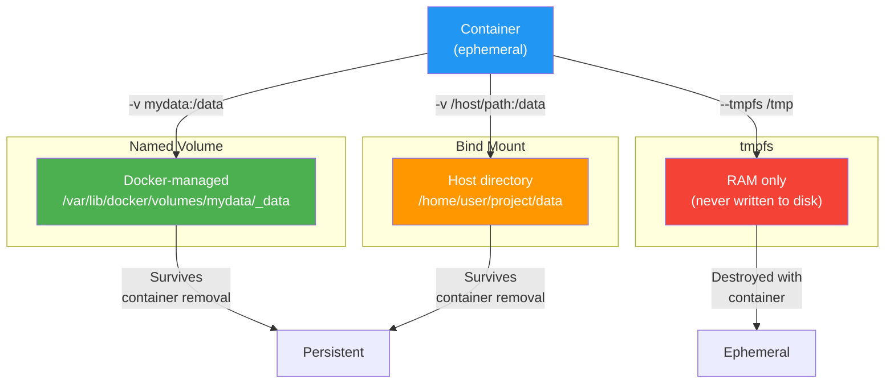
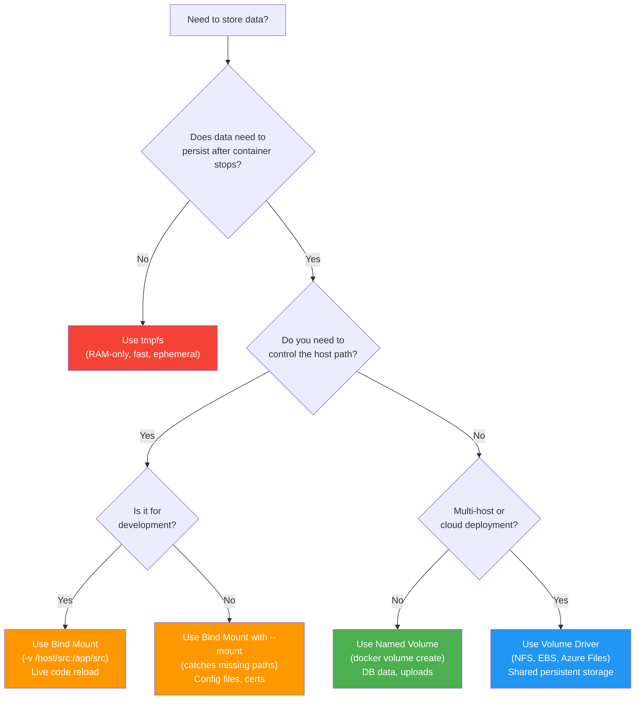

# File 15 — Volumes and Persistent Data

**Topic:** Named volumes, bind mounts, tmpfs, volume drivers, backup/restore strategies, permissions & ownership

**WHY THIS MATTERS:**
Containers are ephemeral — when they die, their writable layer vanishes. Any database, uploaded file, or config that lived inside the container is GONE. Volumes solve this by decoupling data from the container lifecycle. Understanding volume types, drivers, and backup strategies is the difference between "our data survived the deploy" and "we just lost production data."

**Prerequisites:** Files 01-14, basic Docker CLI knowledge.

---

## Story: The Bank Locker System

Walk into any Indian bank — say, SBI's main branch.

- **BANK LOCKER (named volume)** — You rent a locker, put your gold and documents inside. Even if you close your savings account and open a new one, the locker and its contents stay intact. The locker is managed by the bank (Docker manages named volumes in `/var/lib/docker/volumes`). You don't need to know the vault's physical address.

- **CARRY BAG from outside (bind mount)** — You walk into the bank with your own bag and place it on the counter. The bank didn't create it, doesn't manage it, and you take it home when you leave. A bind mount is a host directory YOU control, mounted into the container.

- **TEMPORARY NOTEPAD (tmpfs)** — The bank officer gives you a scratch pad to jot calculations. When you leave, the notepad is shredded. tmpfs lives in RAM, never touches disk, and vanishes when the container stops.

Keep these three images in mind as we explore Docker storage.

---

### Section 1 — The Container Filesystem Problem

**WHY:** Without volumes, all writes go to the container's writable layer (overlay2 diff). This layer is:
1. Tied to the container lifecycle (deleted with it)
2. Coupled to the storage driver (performance penalty)
3. Not shareable between containers

```
   Container Lifecycle:

   docker run mongo:7    →  Container created with writable layer
   mongo writes data     →  Data in /data/db (inside writable layer)
   docker rm -f mongo    →  Writable layer DELETED — data GONE

   ┌──────────────────────────────────────────┐
   │ Container Writable Layer (ephemeral)     │
   │   /data/db/WiredTiger.wt   ← LOST!      │
   │   /data/db/journal/        ← LOST!      │
   ├──────────────────────────────────────────┤
   │ Image Layers (read-only, shared)         │
   └──────────────────────────────────────────┘

   SOLUTION: Store data OUTSIDE the container's writable layer
   using volumes, bind mounts, or tmpfs.
```

---

### Section 2 — Three Types of Docker Storage

**WHY:** Each type has different ownership, lifecycle, and performance characteristics. Choosing the right one depends on your use case.

```
┌──────────────────┬──────────────────┬──────────────────┬──────────────────┐
│ Feature          │ Named Volume     │ Bind Mount       │ tmpfs            │
├──────────────────┼──────────────────┼──────────────────┼──────────────────┤
│ Location         │ /var/lib/docker/ │ Anywhere on host │ RAM only         │
│                  │ volumes/         │                  │                  │
├──────────────────┼──────────────────┼──────────────────┼──────────────────┤
│ Managed by       │ Docker           │ You              │ Docker           │
├──────────────────┼──────────────────┼──────────────────┼──────────────────┤
│ Persists after   │ Yes              │ Yes              │ No               │
│ container removal│                  │                  │                  │
├──────────────────┼──────────────────┼──────────────────┼──────────────────┤
│ Shareable        │ Yes              │ Yes              │ No               │
├──────────────────┼──────────────────┼──────────────────┼──────────────────┤
│ Performance      │ Good             │ Best (native FS) │ Fastest (RAM)    │
├──────────────────┼──────────────────┼──────────────────┼──────────────────┤
│ Portability      │ High (works      │ Low (path        │ N/A              │
│                  │ everywhere)      │ dependent)       │                  │
├──────────────────┼──────────────────┼──────────────────┼──────────────────┤
│ Use Case         │ Database data,   │ Source code,     │ Secrets, temp    │
│                  │ uploads          │ config files     │ cache, sessions  │
├──────────────────┼──────────────────┼──────────────────┼──────────────────┤
│ Bank Analogy     │ Bank locker      │ Carry bag        │ Scratch notepad  │
└──────────────────┴──────────────────┴──────────────────┴──────────────────┘
```



---

## Example Block 1 — Named Volumes

**WHY:** Named volumes are the RECOMMENDED way to persist data in Docker. Docker manages them — you don't need to worry about the host path.

```bash
# ── docker volume create ──
# SYNTAX: docker volume create [OPTIONS] <NAME>
# FLAGS :
#   --driver  (-d)   volume driver (default: local)
#   --label          key=value metadata
#   --opt            driver-specific options

docker volume create mongo-data

# EXPECTED OUTPUT:
#   mongo-data

# ── docker volume ls ──
# SYNTAX: docker volume ls [OPTIONS]
# FLAGS :
#   --filter (-f)  filter output (dangling=true, driver=local, name=xyz)
#   --format       Go template formatting
#   -q             only show volume names

docker volume ls

# EXPECTED OUTPUT:
#   DRIVER   VOLUME NAME
#   local    mongo-data

# ── docker volume inspect ──
# SYNTAX: docker volume inspect <NAME>

docker volume inspect mongo-data

# EXPECTED OUTPUT:
#   [
#     {
#       "CreatedAt": "2026-03-15T10:00:00Z",
#       "Driver": "local",
#       "Labels": {},
#       "Mountpoint": "/var/lib/docker/volumes/mongo-data/_data",
#       "Name": "mongo-data",
#       "Options": {},
#       "Scope": "local"
#     }
#   ]

# ── Use the volume with a container ──
docker run -d \
  --name mongo \
  -v mongo-data:/data/db \
  mongo:7

# The -v flag: <VOLUME_NAME>:<CONTAINER_PATH>
# Docker mounts mongo-data at /data/db inside the container.
# All MongoDB writes go to the volume, NOT the writable layer.
```

---

## Example Block 2 — Bind Mounts

**WHY:** Bind mounts map a HOST directory into the container. Ideal for development (live code reload) and config files.

```bash
# --- Short syntax with -v ---
# SYNTAX: -v <HOST_PATH>:<CONTAINER_PATH>[:OPTIONS]
# OPTIONS: ro (read-only), rw (read-write, default)

docker run -d \
  --name devapi \
  -v $(pwd)/src:/app/src \
  -v $(pwd)/config.json:/app/config.json:ro \
  node:18-alpine node /app/src/server.js

# HOST_PATH must be absolute.  $(pwd) expands to current dir.
# :ro means the container CANNOT modify the file.

# --- Long syntax with --mount ---
# SYNTAX: --mount type=bind,source=<HOST>,target=<CONTAINER>[,readonly]

docker run -d \
  --name devapi \
  --mount type=bind,source=$(pwd)/src,target=/app/src \
  --mount type=bind,source=$(pwd)/config.json,target=/app/config.json,readonly \
  node:18-alpine node /app/src/server.js

# --mount is MORE EXPLICIT and will ERROR if the host path
# doesn't exist (unlike -v which silently creates an empty dir).

# --- IMPORTANT DIFFERENCE ---
# -v /nonexistent:/data      → Docker creates /nonexistent as empty dir (SILENT!)
# --mount source=/nonexistent → ERROR: bind source path does not exist

# RECOMMENDATION: Use --mount in production, -v for quick dev.
```

---

## Example Block 3 — tmpfs Mounts

**WHY:** tmpfs is in-memory only — never touches disk. Use for sensitive data (secrets, tokens) or fast temp storage.

```bash
# --- Using --tmpfs ---
docker run -d \
  --name secure-app \
  --tmpfs /tmp:rw,noexec,nosuid,size=100m \
  node:18-alpine

# FLAGS for --tmpfs:
#   rw          read-write
#   noexec      cannot execute binaries from this mount
#   nosuid      ignore setuid bits
#   size=100m   limit to 100MB RAM

# --- Using --mount ---
docker run -d \
  --name secure-app \
  --mount type=tmpfs,target=/tmp,tmpfs-size=104857600,tmpfs-mode=1777 \
  node:18-alpine

# tmpfs-size: in bytes (104857600 = 100MB)
# tmpfs-mode: Unix permission bits (1777 = sticky + rwxrwxrwx)

# USE CASES:
#   - Session data / caches that don't need to survive restarts
#   - Temporary files for processing (image resize, PDF gen)
#   - Sensitive data (API keys read from env, never written to disk)
#   - Test suites that generate lots of temp files
```

---

## Example Block 4 — Volume Mount Syntax (-v vs --mount)

**WHY:** The `-v` and `--mount` syntaxes do similar things but behave differently in edge cases. Know both.

```
┌──────────────────────────────┬──────────────────────────────────────┐
│ -v (short syntax)            │ --mount (long syntax)                │
├──────────────────────────────┼──────────────────────────────────────┤
│ -v mydata:/data              │ --mount source=mydata,target=/data   │
│ -v /host:/data               │ --mount type=bind,src=/host,dst=/data│
│ -v /host:/data:ro            │ --mount ...,readonly                 │
│ Creates missing host dirs    │ ERRORS on missing source             │
│ Cannot set tmpfs options     │ Full tmpfs-size, tmpfs-mode support  │
│ Simpler, less typing         │ Explicit, self-documenting           │
└──────────────────────────────┴──────────────────────────────────────┘
```

**Rule of thumb:**
- Development / quick commands → `-v`
- Production / compose files → `--mount` or the `volumes:` key
- Bind mount in production → ALWAYS `--mount` (catches errors)

---

### Section 3 — Docker Volume Lifecycle Commands

**WHY:** Volumes accumulate silently. A single docker-compose project can create 5-10 volumes. You need to list, inspect, and prune them regularly.

```bash
# ── docker volume rm ──
# SYNTAX: docker volume rm <VOLUME> [VOLUME...]
# Removes one or more volumes.  Fails if in use.

docker volume rm mongo-data

# EXPECTED OUTPUT:
#   mongo-data
# ERROR if in use:
#   Error: volume is in use - [container_id]

# ── docker volume prune ──
# SYNTAX: docker volume prune [OPTIONS]
# FLAGS :
#   --all (-a)     remove ALL unused volumes (not just anonymous)
#   --filter       label-based filter
#   --force (-f)   skip confirmation

docker volume prune

# EXPECTED OUTPUT:
#   WARNING! This will remove anonymous local volumes not used by containers.
#   Are you sure? [y/N]: y
#   Deleted Volumes:
#     abc123def456
#   Total reclaimed space: 1.2GB

docker volume prune --all --force

# Removes ALL unused volumes (named + anonymous), no prompt.
# DANGEROUS in production — could delete data you want to keep!

# ── List dangling (unused) volumes ──
docker volume ls --filter dangling=true

# EXPECTED OUTPUT:
#   DRIVER   VOLUME NAME
#   local    abc123def456   (anonymous volume, no name)
```

---

## Example Block 5 — Volumes in Docker Compose

**WHY:** Compose is the most common way to define volumes. Understanding the top-level volumes key and per-service mount syntax is critical.

```yaml
# --- compose.yaml ---
services:
  mongo:
    image: mongo:7
    volumes:
      # Named volume (managed by Docker)
      - mongo-data:/data/db

      # Bind mount (host path → container path)
      - ./mongo-init:/docker-entrypoint-initdb.d:ro

      # tmpfs
      - type: tmpfs
        target: /tmp
        tmpfs:
          size: 52428800   # 50MB

  api:
    image: node:18-alpine
    volumes:
      # Long syntax (recommended for clarity)
      - type: bind
        source: ./src
        target: /app/src
      - type: volume
        source: uploads
        target: /app/uploads

# Top-level volumes declaration
volumes:
  mongo-data:         # Docker creates <project>_mongo-data
  uploads:
    driver: local     # default driver
    labels:
      com.example.project: "myapp"
```

**Important:**
- Volumes declared at top level are created with a project prefix: `myapp_mongo-data`, `myapp_uploads`
- `docker compose down` → keeps volumes
- `docker compose down -v` → DELETES volumes (data lost!)
- `docker compose down --volumes` → same as `-v`

---

## Example Block 6 — Volume Drivers (NFS, Cloud)

**WHY:** The "local" driver stores data on the Docker host. For multi-host setups, cloud deployments, or shared storage, you need NFS, AWS EBS, Azure Files, etc.

```bash
# ── NFS Volume (shared across hosts) ──
docker volume create \
  --driver local \
  --opt type=nfs \
  --opt o=addr=192.168.1.100,rw \
  --opt device=:/exports/data \
  nfs-data

# Now any container can mount nfs-data and access the NFS share.

# ── CIFS / SMB Volume (Windows file share) ──
docker volume create \
  --driver local \
  --opt type=cifs \
  --opt o=addr=192.168.1.200,username=admin,password=secret \
  --opt device=//192.168.1.200/shared \
  smb-data
```

```yaml
# ── In Compose with NFS ──
volumes:
  shared-data:
    driver: local
    driver_opts:
      type: nfs
      o: addr=192.168.1.100,rw,nfsvers=4
      device: ":/exports/data"
```

```bash
# ── Third-party drivers ──
# REX-Ray (multi-cloud):  docker plugin install rexray/ebs
# Portworx (k8s-grade):   docker plugin install portworx/px-dev
# GlusterFS:              docker plugin install glusterfs

# After installing a plugin:
docker volume create --driver rexray/ebs --opt size=50 ebs-vol
```

---

### Section 4 — Backup and Restore Strategies

**WHY:** Volumes persist data, but they don't back themselves up. You need a strategy for disaster recovery.

```bash
# ── STRATEGY 1: Backup with a temporary container ──
# Mount the volume + a host dir, then tar the contents.

docker run --rm \
  -v mongo-data:/source:ro \
  -v $(pwd)/backups:/backup \
  alpine tar czf /backup/mongo-data-backup.tar.gz -C /source .

# BREAKDOWN:
#   -v mongo-data:/source:ro    mount the volume read-only
#   -v $(pwd)/backups:/backup   mount host dir for output
#   tar czf ...                 create compressed archive

# EXPECTED: ./backups/mongo-data-backup.tar.gz created

# ── STRATEGY 2: Restore from backup ──
docker run --rm \
  -v mongo-data:/target \
  -v $(pwd)/backups:/backup:ro \
  alpine sh -c "cd /target && tar xzf /backup/mongo-data-backup.tar.gz"

# ── STRATEGY 3: --volumes-from (deprecated pattern) ──
# Mount all volumes from another container:
docker run --rm --volumes-from mongo -v $(pwd)/backups:/backup \
  alpine tar czf /backup/full-backup.tar.gz -C /data/db .

# --volumes-from <container>: inherit ALL volume mounts from
# the named container.  Useful but couples to container naming.

# ── STRATEGY 4: Database-native backup ──
# Always prefer the database's own backup tool:
docker exec mongo mongodump --out=/data/backup
docker cp mongo:/data/backup ./mongo-backup-$(date +%Y%m%d)

# For PostgreSQL:
docker exec postgres pg_dump -U myuser mydb > backup.sql

# For MySQL:
docker exec mysql mysqldump -u root -p mydb > backup.sql
```



---

### Section 5 — Permissions and Ownership

**WHY:** The #1 volume headache. The container's user (often root or a numeric UID) must match the file ownership on the volume. Get this wrong and your app can't read/write.

```bash
# PROBLEM:
#   - Host file owned by UID 1000 (your user)
#   - Container runs as UID 999 (e.g., mongodb user)
#   - Container gets "Permission denied" on the volume

# SOLUTION 1: Match UIDs in Dockerfile
# RUN groupadd -g 1000 appgroup && \
#     useradd -u 1000 -g appgroup appuser
# USER appuser

# SOLUTION 2: chown in entrypoint
# ENTRYPOINT script:
#   chown -R 1000:1000 /data && exec "$@"

# SOLUTION 3: Run container with matching UID
docker run -d --user 1000:1000 -v mydata:/data myimage

# SOLUTION 4: Use named volumes (Docker handles permissions)
# When a named volume is first mounted into a container, Docker
# copies the image's directory contents AND permissions into
# the volume.  This only happens on first use (empty volume).

# --- Check what user the container expects ---
docker inspect mongo:7 --format '{{.Config.User}}'
# Output: (empty = root) or "999" or "mongodb"

# --- Check volume ownership from host ---
sudo ls -la /var/lib/docker/volumes/mongo-data/_data/
# Shows the UID/GID of files inside the volume
```

---

## Example Block 7 — Anonymous Volumes

**WHY:** Some images declare VOLUME in their Dockerfile. This creates anonymous volumes automatically — understanding them prevents surprise disk usage.

```bash
# The mongo:7 Dockerfile contains:
#   VOLUME /data/db /data/configdb

# When you run without -v:
docker run -d --name mongo mongo:7

# Docker creates ANONYMOUS volumes:
docker volume ls
# DRIVER   VOLUME NAME
# local    a1b2c3d4e5f6...   (anonymous — random hex name)
# local    f6e5d4c3b2a1...   (another one for /data/configdb)

# These volumes persist even after container removal!
# They accumulate silently and waste disk.

# CLEANUP:
docker volume prune     # removes anonymous volumes not in use

# BEST PRACTICE: Always use named volumes explicitly:
docker run -d --name mongo -v mongo-data:/data/db mongo:7
# Now you have a named, identifiable volume.
```

---

## Example Block 8 — Sharing Volumes Between Containers

**WHY:** Multiple containers can mount the same volume — useful for log shipping, static file serving, data processing.

```bash
# --- Shared upload directory ---
docker volume create uploads

# Container 1: API writes uploaded files
docker run -d --name api -v uploads:/app/uploads myapi:v1

# Container 2: Nginx serves uploaded files
docker run -d --name cdn -v uploads:/usr/share/nginx/html:ro nginx:alpine

# Container 3: Background worker processes uploads
docker run -d --name worker -v uploads:/data/incoming:ro myworker:v1

# All three containers see the same files.
# :ro on cdn and worker ensures they can't modify uploads.
```

```yaml
# --- In Compose ---
services:
  api:
    volumes:
      - uploads:/app/uploads
  cdn:
    volumes:
      - uploads:/usr/share/nginx/html:ro
  worker:
    volumes:
      - uploads:/data/incoming:ro
volumes:
  uploads:
```

---

### Section 6 — Volume Performance Considerations

**WHY:** Volume type affects I/O performance significantly, especially for databases and high-throughput workloads.

Performance ranking (fastest to slowest):

1. **tmpfs** — RAM speed, ~10 GB/s
2. **Bind mount** — Native filesystem, ~500 MB/s (SSD)
3. **Named volume** — Nearly same as bind mount on Linux (~5-10% slower on Docker Desktop / macOS)
4. **NFS volume** — Network dependent, ~100 MB/s LAN
5. **Cloud volume** — Provider dependent, ~50-200 MB/s

**macOS / Windows NOTE:**
Docker Desktop uses a Linux VM. Bind mounts cross the VM boundary via virtiofs (macOS) or 9p (older). This adds latency for node_modules / vendor dirs.

**Workaround for slow bind mounts on macOS:**

```yaml
# Use a named volume for node_modules:
services:
  api:
    volumes:
      - ./src:/app/src          # bind mount for code
      - node_modules:/app/node_modules  # named volume
volumes:
  node_modules:
```

This avoids syncing thousands of node_modules files across the VM boundary.

---

## Example Block 9 — Complete Production Volume Setup

**WHY:** Bringing it all together with a real-world compose file that uses all three volume types correctly.

```yaml
# --- compose.yaml ---
services:
  api:
    image: myregistry/api:v2
    volumes:
      - type: volume
        source: uploads
        target: /app/uploads
      - type: bind
        source: ./config/api.yaml
        target: /app/config.yaml
        read_only: true
      - type: tmpfs
        target: /tmp
        tmpfs:
          size: 52428800    # 50MB
    deploy:
      replicas: 3

  mongo:
    image: mongo:7
    volumes:
      - type: volume
        source: mongo-data
        target: /data/db
      - type: bind
        source: ./mongo-init
        target: /docker-entrypoint-initdb.d
        read_only: true
    deploy:
      resources:
        limits:
          memory: 2G

  redis:
    image: redis:7-alpine
    volumes:
      - redis-data:/data
    command: redis-server --appendonly yes

  backup:
    image: alpine
    profiles: ["backup"]     # only runs with --profile backup
    volumes:
      - mongo-data:/source:ro
      - ./backups:/backup
    command: >
      sh -c "tar czf /backup/mongo-$(date +%Y%m%d-%H%M%S).tar.gz
             -C /source ."

volumes:
  uploads:
    labels:
      com.example.description: "User uploaded files"
  mongo-data:
    labels:
      com.example.description: "MongoDB data directory"
  redis-data:
    labels:
      com.example.description: "Redis AOF persistence"
```

**Usage:**

```bash
docker compose up -d                         # start services
docker compose --profile backup run backup   # run backup
docker compose down                          # keep volumes
docker compose down -v                       # DELETE volumes (careful!)
```

---

### Section 7 — Volume Security Best Practices

**WHY:** Volumes can be a security risk if not managed properly.

1. **READ-ONLY MOUNTS** — Use `:ro` for config files, certs, init scripts. Prevents container from modifying them.

2. **NEVER bind-mount /etc, /var, or /** — A compromised container with host root access is a full host compromise.

3. **tmpfs FOR SECRETS** — API keys, tokens read from env should be written to tmpfs, not to a volume or the writable layer.

4. **LABEL VOLUMES** — Use `--label` to track ownership, project, and sensitivity level. Helps with cleanup and auditing.

5. **REGULAR PRUNE** — Schedule: `docker volume prune --all --force` weekly (in non-prod) or audit dangling volumes monthly.

6. **BACKUP ROTATION** — Don't keep unlimited backups. Use a retention policy (e.g., 7 daily, 4 weekly, 12 monthly).

7. **ENCRYPT AT REST** — Use dm-crypt / LUKS on the Docker host's filesystem, or use encrypted EBS volumes in AWS.

8. **PRINCIPLE OF LEAST PRIVILEGE** — Mount only the specific files/dirs needed, not entire host directories.

---

## Key Takeaways

1. **NAMED VOLUMES** are Docker-managed, persist across container lifecycle, and are the recommended storage for databases and application data (the bank locker).

2. **BIND MOUNTS** map host directories into containers — ideal for development (source code) and config files. Use `--mount` to catch errors (the carry bag).

3. **TMPFS** lives in RAM only, never written to disk, destroyed with the container — use for secrets and temp data (the scratch notepad).

4. **VOLUME COMMANDS:** create, ls, inspect, rm, prune — know them all. Dangling volumes silently eat disk space.

5. **BACKUP** with a temporary container: mount volume + host dir, tar the contents. Always prefer database-native backup tools (mongodump, pg_dump) when available.

6. **PERMISSIONS** are the #1 volume headache. Match UIDs between host and container, or use named volumes which auto-copy permissions on first mount.

7. **PERFORMANCE:** tmpfs > bind mount > named volume > NFS. On macOS, use named volumes for node_modules to avoid VM-boundary sync overhead.

8. **`docker compose down -v` DELETES volumes.** Never use `-v` in production unless you truly want to destroy data.
