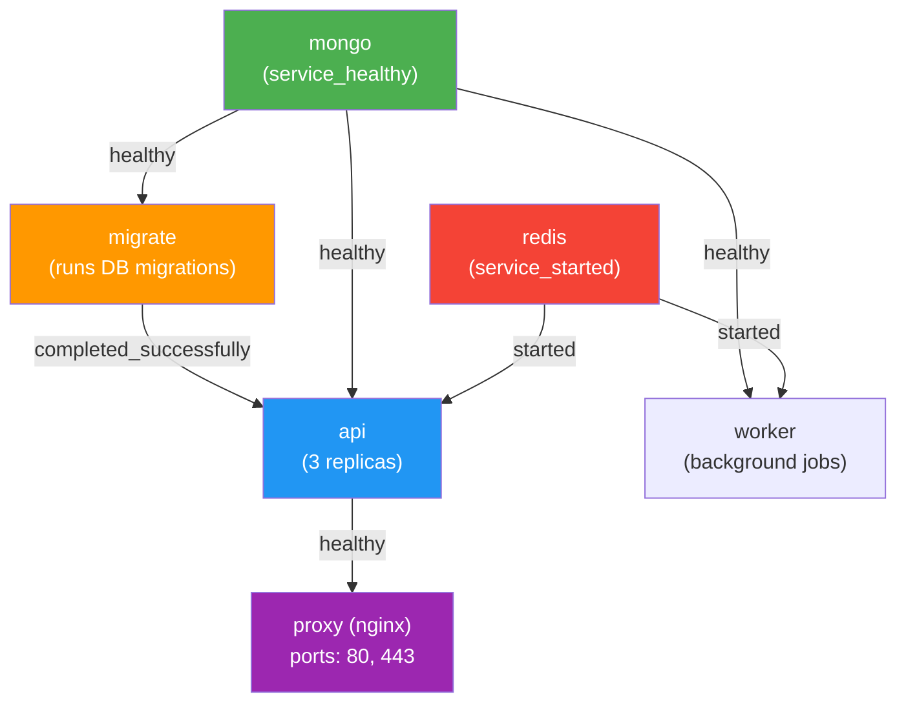
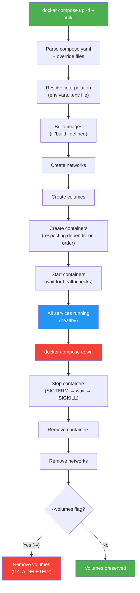

# File 16 — Docker Compose Deep Dive

**Topic:** Compose V2, compose.yaml spec, services/networks/volumes, profiles, watch (hot reload), depends_on with healthcheck, env files, extends, include

**WHY THIS MATTERS:**
Docker Compose is how 90% of developers define and run multi-container applications locally and in staging. Knowing its full power — profiles, watch mode, health-aware dependency ordering, interpolation, and merge rules — turns a 20-minute deploy debugging session into a single "docker compose up" that just works.

**Prerequisites:** Files 01-15, basic YAML knowledge.

---

## Story: The Event Management Company

Think of a big Indian wedding managed by a professional event company — say, planning a wedding at a Jaipur palace.

- **EVENT PLAN (compose.yaml)** — The master document listing every vendor, their roles, timing, and dependencies. "The caterer (api) starts AFTER the venue (database) is ready. The decorator (frontend) and DJ (redis) can start independently."

- **CATERER, DECORATOR, DJ (services)** — Each vendor is a service with its own image, config, and resource needs. The event planner (Compose) coordinates them all.

- **VENUE LAYOUT (networks)** — The main hall, garden, and kitchen are separate zones. The caterer needs kitchen access; guests stay in the hall. Networks isolate traffic the same way.

- **SHARED EQUIPMENT (volumes)** — The sound system, tables, and chairs are rented once and shared across vendors. Volumes persist data shared between services.

- **PROFILES** — The mehndi ceremony needs different vendors than the reception. Profiles let you activate subsets of services for dev, test, or prod scenarios.

---

### Section 1 — Compose V2 vs V1 (Legacy)

**WHY:** Compose V1 (`docker-compose`, Python-based) is deprecated. Compose V2 (`docker compose`, Go-based, built into Docker CLI) is the current standard. Know the differences.

```
┌──────────────────────┬──────────────────────┬──────────────────────┐
│ Feature              │ V1 (deprecated)      │ V2 (current)         │
├──────────────────────┼──────────────────────┼──────────────────────┤
│ Command              │ docker-compose       │ docker compose       │
│ Language             │ Python               │ Go (Docker CLI plugin│
│ Config file          │ docker-compose.yml   │ compose.yaml (also   │
│                      │                      │ accepts .yml)        │
│ version: key         │ Required (3.x)       │ OPTIONAL / ignored   │
│ Profiles             │ Limited              │ Full support         │
│ Watch mode           │ No                   │ Yes (docker compose  │
│                      │                      │ watch)               │
│ GPU support          │ Limited              │ Full                 │
│ Include/Extends      │ extends only         │ include + extends    │
│ Build improvements   │ Basic                │ BuildKit native      │
└──────────────────────┴──────────────────────┴──────────────────────┘
```

**MIGRATION:** Just change `docker-compose` to `docker compose`. Remove `version: '3.8'` from your YAML (it's ignored in V2).

---

## Example Block 1 — Basic compose.yaml Structure

**WHY:** Every compose file has the same skeleton: services, networks, volumes, and optionally configs and secrets.

```yaml
# --- compose.yaml ---
name: myapp              # Project name (optional, defaults to dir name)

services:                 # REQUIRED: container definitions
  api:
    image: node:18-alpine
    build:
      context: ./api
      dockerfile: Dockerfile
    container_name: myapp-api     # explicit name (avoid in scaling)
    ports:
      - "3000:3000"
    environment:
      - NODE_ENV=production
      - DB_HOST=mongo
    env_file:
      - .env
      - .env.production
    volumes:
      - uploads:/app/uploads
    networks:
      - frontend
      - backend
    depends_on:
      mongo:
        condition: service_healthy
    healthcheck:
      test: ["CMD", "curl", "-f", "http://localhost:3000/health"]
      interval: 10s
      timeout: 5s
      retries: 3
      start_period: 15s
    restart: unless-stopped
    deploy:
      replicas: 3
      resources:
        limits:
          cpus: "0.50"
          memory: 512M
        reservations:
          cpus: "0.25"
          memory: 256M

  mongo:
    image: mongo:7
    volumes:
      - mongo-data:/data/db
    networks:
      - backend
    healthcheck:
      test: ["CMD", "mongosh", "--eval", "db.adminCommand('ping')"]
      interval: 10s
      timeout: 5s
      retries: 5
      start_period: 30s

  redis:
    image: redis:7-alpine
    command: redis-server --appendonly yes
    volumes:
      - redis-data:/data
    networks:
      - backend

networks:                 # Network definitions
  frontend:
  backend:
    internal: true        # no external access

volumes:                  # Volume definitions
  uploads:
  mongo-data:
  redis-data:
```

---

## Example Block 2 — Essential Compose Commands

**WHY:** These are the commands you'll use every day.

```bash
# ── docker compose up ──
# SYNTAX: docker compose up [OPTIONS] [SERVICE...]
# FLAGS :
#   -d                 detached mode (background)
#   --build            build images before starting
#   --force-recreate   recreate containers even if unchanged
#   --no-deps          don't start linked services
#   --scale api=3      scale a service
#   --wait             wait for services to be healthy
#   --remove-orphans   remove containers for undefined services

docker compose up -d --build --wait

# EXPECTED OUTPUT:
#   ✔ Network myapp_frontend    Created
#   ✔ Network myapp_backend     Created
#   ✔ Volume "myapp_mongo-data" Created
#   ✔ Container myapp-mongo-1   Healthy
#   ✔ Container myapp-redis-1   Started
#   ✔ Container myapp-api-1     Healthy

# ── docker compose down ──
# SYNTAX: docker compose down [OPTIONS]
# FLAGS :
#   -v / --volumes     remove named volumes
#   --rmi all          remove all images
#   --rmi local        remove only locally-built images
#   --remove-orphans   remove orphan containers
#   -t / --timeout     shutdown timeout in seconds

docker compose down

# EXPECTED OUTPUT:
#   ✔ Container myapp-api-1     Removed
#   ✔ Container myapp-redis-1   Removed
#   ✔ Container myapp-mongo-1   Removed
#   ✔ Network myapp_frontend    Removed
#   ✔ Network myapp_backend     Removed
# (Volumes are KEPT unless -v is specified)

# ── docker compose ps ──
# SYNTAX: docker compose ps [OPTIONS] [SERVICE...]
# FLAGS :
#   -a / --all         include stopped containers
#   --format           output format (table, json)
#   -q                 only show IDs

docker compose ps

# EXPECTED OUTPUT:
#   NAME              IMAGE            STATUS              PORTS
#   myapp-api-1       node:18-alpine   Up 2m (healthy)     0.0.0.0:3000->3000/tcp
#   myapp-mongo-1     mongo:7          Up 2m (healthy)     27017/tcp
#   myapp-redis-1     redis:7-alpine   Up 2m               6379/tcp

# ── docker compose logs ──
# SYNTAX: docker compose logs [OPTIONS] [SERVICE...]
# FLAGS :
#   -f / --follow      follow log output (like tail -f)
#   --tail N           show last N lines
#   --since            show logs since timestamp
#   --no-log-prefix    don't print service name prefix
#   -t / --timestamps  show timestamps

docker compose logs -f --tail 50 api

# ── docker compose exec ──
# SYNTAX: docker compose exec [OPTIONS] SERVICE COMMAND
# FLAGS :
#   -it                interactive terminal (default)
#   -T                 disable TTY (for scripts)
#   --user             run as specific user
#   --workdir          working directory

docker compose exec mongo mongosh
docker compose exec -T api npm test

# ── docker compose build ──
# SYNTAX: docker compose build [OPTIONS] [SERVICE...]
# FLAGS :
#   --no-cache         don't use cache
#   --pull             always pull base images
#   --parallel         build in parallel (default in V2)

docker compose build --no-cache api

# ── docker compose config ──
# Validates and displays the resolved compose file
docker compose config

# EXPECTED: Prints the fully resolved YAML with all
# interpolations, env vars, and extends applied.
```

---

### Section 2 — depends_on with Health Checks

**WHY:** `depends_on` without condition only waits for the container to START, not to be READY. Your API starts before Mongo is accepting connections, causing a crash. `condition: service_healthy` solves this.

```yaml
# WITHOUT health check (bad):
depends_on:
  - mongo          # waits for container to START, not READY
                   # API crashes: "ECONNREFUSED 27017"

# WITH health check (good):
depends_on:
  mongo:
    condition: service_healthy    # waits until healthcheck passes
  redis:
    condition: service_started    # just needs to start (default)
```

**Available Conditions:**
- `service_started` — container is running (default)
- `service_healthy` — container healthcheck passes
- `service_completed_successfully` — container exits with 0 (for init/migration tasks)

```yaml
# EXAMPLE: Run migrations before API starts
services:
  migrate:
    image: myregistry/api:v2
    command: npm run migrate
    depends_on:
      mongo:
        condition: service_healthy

  api:
    image: myregistry/api:v2
    depends_on:
      migrate:
        condition: service_completed_successfully
      mongo:
        condition: service_healthy
      redis:
        condition: service_started
```



---

## Example Block 3 — Profiles

**WHY:** Not every service should run in every environment. Debugging tools, admin panels, and test databases should only start when needed. Profiles solve this.

```yaml
# --- compose.yaml ---
services:
  api:
    image: myregistry/api:v2
    # No profiles = always starts

  mongo:
    image: mongo:7
    # No profiles = always starts

  mongo-express:
    image: mongo-express
    profiles: ["debug"]          # only with --profile debug
    ports:
      - "8081:8081"
    environment:
      - ME_CONFIG_MONGODB_URL=mongodb://mongo:27017

  test-runner:
    image: myregistry/api:v2
    profiles: ["test"]           # only with --profile test
    command: npm test

  prometheus:
    image: prom/prometheus
    profiles: ["monitoring"]     # only with --profile monitoring

  grafana:
    image: grafana/grafana
    profiles: ["monitoring"]     # groups with prometheus
```

```bash
# USAGE:
docker compose up -d                          # api + mongo only
docker compose --profile debug up -d          # api + mongo + mongo-express
docker compose --profile test up -d           # api + mongo + test-runner
docker compose --profile monitoring up -d     # api + mongo + prometheus + grafana
docker compose --profile debug --profile monitoring up -d   # combine profiles

# ENVIRONMENT VARIABLE:
COMPOSE_PROFILES=debug,monitoring docker compose up -d
```

A service with NO profiles always starts. A service WITH profiles only starts when its profile is active.

---

## Example Block 4 — Docker Compose Watch (Hot Reload)

**WHY:** `compose watch` monitors source files and automatically syncs changes or rebuilds — replacing custom nodemon/webpack dev setups. This is the killer dev-experience feature.

```yaml
# --- compose.yaml ---
services:
  api:
    image: myregistry/api:dev
    build:
      context: ./api
    ports:
      - "3000:3000"
    develop:
      watch:
        # SYNC: copy changed files into container (no rebuild)
        - action: sync
          path: ./api/src
          target: /app/src
          ignore:
            - "**/*.test.js"

        # SYNC + RESTART: sync files and restart the process
        - action: sync+restart
          path: ./api/config
          target: /app/config

        # REBUILD: trigger full image rebuild
        - action: rebuild
          path: ./api/package.json

  frontend:
    build:
      context: ./frontend
    ports:
      - "5173:5173"
    develop:
      watch:
        - action: sync
          path: ./frontend/src
          target: /app/src
```

```bash
# USAGE:
docker compose watch

# EXPECTED BEHAVIOR:
#   - Edit ./api/src/server.js     → synced into container instantly
#   - Edit ./api/config/app.yaml   → synced + container process restarts
#   - Edit ./api/package.json      → full rebuild + recreate
```

**Watch Actions:**
- `sync` — file copy only (fastest, for hot-reload frameworks)
- `sync+restart` — file copy + restart container (for config changes)
- `rebuild` — rebuild image + recreate container (for deps)

NOTE: `docker compose watch` runs in foreground and shows file changes. Use `docker compose up -d` first, then `docker compose watch`.

---

### Section 3 — Environment Variables & Interpolation

**WHY:** Compose files support variable interpolation — same YAML, different configs for dev/staging/prod.

**Priority order (highest to lowest):**
1. `docker compose run -e VAR=value`
2. Shell environment variable
3. `.env` file in project directory
4. `env_file:` directive in compose.yaml
5. Dockerfile ENV instruction

```yaml
# --- Interpolation in compose.yaml ---
services:
  api:
    image: myregistry/api:${API_VERSION:-latest}
    environment:
      - NODE_ENV=${NODE_ENV:-development}
      - DB_HOST=${DB_HOST:?DB_HOST must be set}
      - LOG_LEVEL=${LOG_LEVEL:-info}
```

**Interpolation Syntax:**

| Syntax | Meaning |
|---|---|
| `${VAR}` | substitute VAR (error if unset) |
| `${VAR:-default}` | use "default" if VAR is unset or empty |
| `${VAR-default}` | use "default" if VAR is unset (not if empty) |
| `${VAR:?error}` | exit with "error" message if VAR is unset/empty |
| `${VAR?error}` | exit with "error" message if VAR is unset |

```bash
# --- .env file ---
# Create a .env file in the same directory as compose.yaml:
#   API_VERSION=v2.1.0
#   NODE_ENV=production
#   DB_HOST=mongo
#   LOG_LEVEL=warn
```

```yaml
# --- Multiple env files ---
services:
  api:
    env_file:
      - .env              # base config
      - .env.production   # production overrides
      - .env.local        # local overrides (gitignored)
```

```bash
# --- Verify interpolation ---
docker compose config
# Shows the fully resolved YAML with all variables substituted.
```

---

## Example Block 5 — Extends and Include

**WHY:** Large projects split configuration across files. `extends` reuses service definitions; `include` imports entire compose files.

```yaml
# ── EXTENDS: Reuse a service definition ──

# --- base.yaml ---
services:
  node-base:
    image: node:18-alpine
    working_dir: /app
    environment:
      - NODE_ENV=production
    restart: unless-stopped

# --- compose.yaml ---
services:
  api:
    extends:
      file: base.yaml
      service: node-base
    command: node server.js
    ports:
      - "3000:3000"
    # Inherits image, working_dir, environment, restart
    # from node-base.  Can override any field.

  worker:
    extends:
      file: base.yaml
      service: node-base
    command: node worker.js
    # Same base config, different command.
```

```yaml
# ── INCLUDE: Import entire compose files ──

# --- compose.yaml ---
include:
  - path: ./monitoring/compose.yaml    # Prometheus + Grafana
  - path: ./logging/compose.yaml       # ELK stack
  - path: ./infra/compose.yaml         # Databases

services:
  api:
    image: myregistry/api:v2
    networks:
      - monitoring_default     # can reference included networks
      - infra_default
```

**INCLUDE vs EXTENDS:**
- `extends` — reuse a single SERVICE definition
- `include` — import an entire compose PROJECT (services + networks + volumes)

---

## Example Block 6 — Compose File Merge Rules

**WHY:** You can pass multiple compose files with `-f` flags. Understanding merge rules prevents surprises.

```bash
# SYNTAX:
docker compose -f compose.yaml -f compose.dev.yaml up -d
```

**Merge Rules:**
1. **SCALAR values** (image, command, container_name): Later file OVERRIDES earlier file.
2. **LIST values** (ports, volumes, environment): Later file APPENDS to earlier file.
3. **MAP values** (labels, deploy.resources): Later file MERGES with earlier file.

```yaml
# --- compose.yaml (base) ---
services:
  api:
    image: myregistry/api:v2
    ports:
      - "3000:3000"
    environment:
      - NODE_ENV=production

# --- compose.dev.yaml (override) ---
services:
  api:
    image: myregistry/api:dev        # OVERRIDES image
    ports:
      - "9229:9229"                  # APPENDS debug port
    environment:
      - NODE_ENV=development         # APPENDS (but NODE_ENV=production also exists!)
      - DEBUG=true                   # APPENDS new var
    volumes:
      - ./src:/app/src               # APPENDS bind mount
```

**Result (merged):**
- image: `myregistry/api:dev`
- ports: `["3000:3000", "9229:9229"]`
- environment: `[NODE_ENV=production, NODE_ENV=development, DEBUG=true]`
- volumes: `[./src:/app/src]`

WARNING: environment list has BOTH NODE_ENV values! The last one wins in the container, but it's confusing. Use map syntax for cleaner overrides:

```yaml
environment:
  NODE_ENV: development     # map keys override cleanly
```

**Default File Precedence:**
Docker Compose auto-loads:
1. `compose.yaml` (or `docker-compose.yml`)
2. `compose.override.yaml` (or `docker-compose.override.yml`)

No `-f` flag needed — just name your dev file `compose.override.yaml`.



---

## Example Block 7 — Advanced Compose Directives

**WHY:** These are the directives that separate beginner compose files from production-grade ones.

```yaml
# ── RESTART POLICIES ──
restart: "no"                  # never restart (default)
restart: always                # always restart
restart: on-failure            # restart only on non-zero exit
restart: unless-stopped        # always, except when manually stopped

# ── LOGGING ──
services:
  api:
    logging:
      driver: json-file           # default
      options:
        max-size: "10m"           # rotate at 10MB
        max-file: "5"             # keep 5 rotated files
        compress: "true"

# ── RESOURCE LIMITS ──
services:
  api:
    deploy:
      resources:
        limits:
          cpus: "1.0"             # max 1 CPU core
          memory: 512M            # max 512MB RAM
          pids: 100               # max 100 processes
        reservations:
          cpus: "0.25"            # guaranteed 0.25 cores
          memory: 128M            # guaranteed 128MB

# ── INIT PROCESS ──
services:
  api:
    init: true                    # adds tini as PID 1
    # Properly handles SIGTERM, reaps zombie processes

# ── EXTRA HOSTS ──
services:
  api:
    extra_hosts:
      - "host.docker.internal:host-gateway"
      - "legacy-api:192.168.1.50"

# ── PLATFORM ──
services:
  api:
    platform: linux/amd64         # force architecture
    # Useful on Apple Silicon (arm64) when image is amd64 only

# ── STOP GRACE PERIOD ──
services:
  api:
    stop_grace_period: 30s        # wait 30s before SIGKILL
    stop_signal: SIGTERM          # signal to send (default)

# ── TMPFS ──
services:
  api:
    tmpfs:
      - /tmp
      - /run

# ── ULIMITS ──
services:
  mongo:
    ulimits:
      nofile:
        soft: 65536
        hard: 65536
      nproc: 65535
```

---

## Example Block 8 — Complete Production compose.yaml

**WHY:** Bringing everything together in one real-world file.

```yaml
# --- compose.yaml ---
name: studybuddy

services:
  # ── Reverse Proxy ──
  proxy:
    image: traefik:v3
    ports:
      - "80:80"
      - "443:443"
    volumes:
      - /var/run/docker.sock:/var/run/docker.sock:ro
      - letsencrypt:/letsencrypt
    command:
      - "--providers.docker=true"
      - "--providers.docker.exposedbydefault=false"
      - "--entrypoints.web.address=:80"
      - "--entrypoints.websecure.address=:443"
    restart: unless-stopped
    networks:
      - frontend
    depends_on:
      api:
        condition: service_healthy

  # ── API Service ──
  api:
    build:
      context: ./api
      dockerfile: Dockerfile
      target: production
    labels:
      - "traefik.enable=true"
      - "traefik.http.routers.api.rule=Host(`api.studybuddy.in`)"
      - "traefik.http.services.api.loadbalancer.server.port=3000"
    env_file:
      - .env
    volumes:
      - uploads:/app/uploads
    networks:
      - frontend
      - backend
    depends_on:
      mongo:
        condition: service_healthy
      redis:
        condition: service_started
    healthcheck:
      test: ["CMD", "curl", "-f", "http://localhost:3000/health"]
      interval: 15s
      timeout: 5s
      retries: 3
      start_period: 20s
    restart: unless-stopped
    init: true
    deploy:
      replicas: 2
      resources:
        limits:
          cpus: "1.0"
          memory: 512M
    logging:
      driver: json-file
      options:
        max-size: "10m"
        max-file: "5"

  # ── MongoDB ──
  mongo:
    image: mongo:7
    volumes:
      - mongo-data:/data/db
      - ./mongo-init:/docker-entrypoint-initdb.d:ro
    networks:
      - backend
    healthcheck:
      test: ["CMD", "mongosh", "--eval", "db.adminCommand('ping')"]
      interval: 10s
      timeout: 5s
      retries: 5
      start_period: 30s
    restart: unless-stopped
    deploy:
      resources:
        limits:
          memory: 2G
    ulimits:
      nofile:
        soft: 65536
        hard: 65536

  # ── Redis ──
  redis:
    image: redis:7-alpine
    command: redis-server --appendonly yes --maxmemory 256mb
    volumes:
      - redis-data:/data
    networks:
      - backend
    restart: unless-stopped

  # ── Debug tools (profile: debug) ──
  mongo-express:
    image: mongo-express
    profiles: ["debug"]
    ports:
      - "8081:8081"
    environment:
      - ME_CONFIG_MONGODB_URL=mongodb://mongo:27017
    networks:
      - backend
    depends_on:
      mongo:
        condition: service_healthy

networks:
  frontend:
  backend:
    internal: true

volumes:
  uploads:
  mongo-data:
  redis-data:
  letsencrypt:
```

---

### Section 4 — Compose Networking in Depth

**WHY:** Compose creates a default network for each project. Understanding network scoping prevents leaks and ensures proper isolation.

**Default Network:** `docker compose up` creates `<project>_default`. All services join this network unless you specify otherwise. Service names are DNS-resolvable on this network.

**Custom Networks:** Declare under top-level `networks:` key. Assign services to specific networks.

**Internal Networks:**
```yaml
networks:
  backend:
    internal: true    # no outbound internet access
```
Perfect for database networks — db can't call home.

**External Networks (pre-existing):**
```yaml
networks:
  shared:
    external: true     # must already exist
    name: my-shared-net
```
Use to connect services across different compose projects.

```bash
# EXAMPLE: Two compose projects sharing a network
docker network create shared-net
```

```yaml
# Project A compose.yaml:
networks:
  shared:
    external: true
    name: shared-net

# Project B compose.yaml:
networks:
  shared:
    external: true
    name: shared-net
# Now services in Project B can reach Project A by name.
```

---

### Section 5 — Tips, Tricks & Common Mistakes

**WHY:** These are the things that trip people up daily.

**MISTAKE 1: `docker compose down -v` in production**
`-v` deletes ALL named volumes. Your database is gone. NEVER use `-v` unless you WANT to destroy data.

**MISTAKE 2: Using container_name with replicas**
`container_name: myapi` + `replicas: 3` results in an ERROR (name conflict). Remove container_name when scaling.

**MISTAKE 3: Not using healthchecks with depends_on**
`depends_on` without `condition: service_healthy` just waits for the container to START, not to be READY.

**MISTAKE 4: Forgetting .dockerignore**
Your node_modules, .git, and .env get copied into the build context leading to slow builds, large images, leaked secrets.

**TIP 1: Use `docker compose config` to debug**
Shows the fully resolved YAML — catches interpolation errors before you run anything.

**TIP 2: compose.override.yaml for dev settings**
Auto-loaded alongside compose.yaml. Put bind mounts, debug ports, and dev env vars here. Gitignore it.

**TIP 3: Use `--wait` flag**
`docker compose up -d --wait` returns only when all services are healthy. Perfect for CI pipelines.

**TIP 4: Named project with `-p`**
`docker compose -p staging up -d` creates `staging_api`, `staging_mongo` etc. Run multiple environments on the same host.

---

## Key Takeaways

1. **COMPOSE V2** (`docker compose`) is the current standard. Drop the `version:` key — it's ignored. Use `compose.yaml` as the filename.

2. **depends_on + condition: service_healthy** ensures services start in the right order AND wait for readiness.

3. **PROFILES** activate subsets of services — debug tools, monitoring stacks, test runners only when needed.

4. **DOCKER COMPOSE WATCH** syncs file changes into running containers — sync, sync+restart, or rebuild actions.

5. **INTERPOLATION** (`${VAR:-default}`) with `.env` files and `env_file:` directives handle multi-environment config.

6. **EXTENDS** reuses service definitions; **INCLUDE** imports entire compose projects. Merge rules: scalars override, lists append, maps merge.

7. **compose.override.yaml** is auto-loaded — use it for dev settings. Gitignore it to keep production clean.

8. **NEVER use `docker compose down -v` in production** unless you intentionally want to destroy all volume data.

9. **EVENT MANAGEMENT MODEL:** compose.yaml is the master plan, services are vendors, networks are venue zones, volumes are shared equipment, profiles are ceremony-specific vendor subsets.
