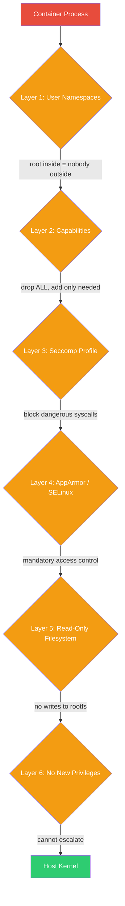
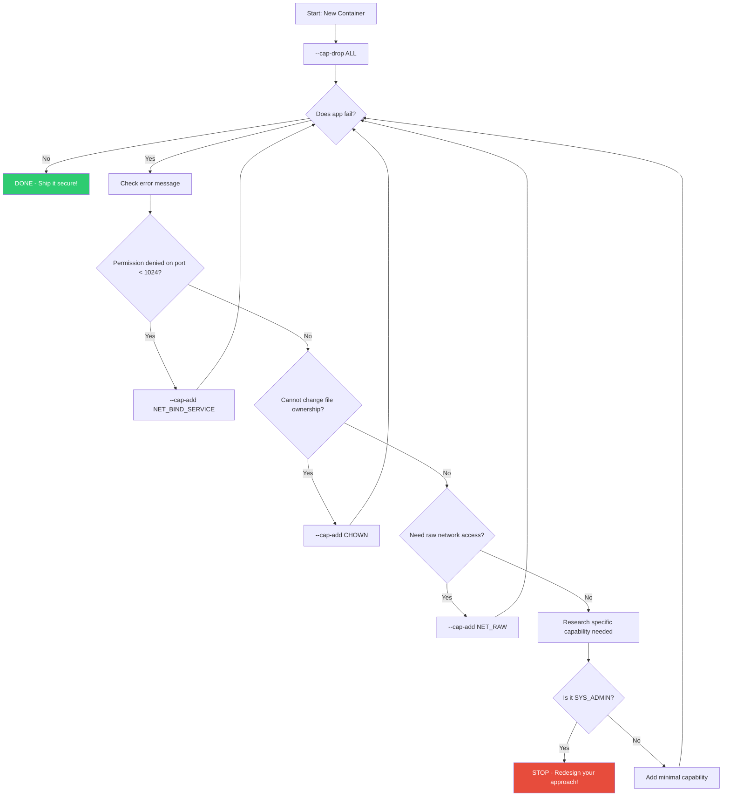

# File 17 — Container Security Fundamentals

**Topic:** Root vs rootless, user namespaces, read-only filesystems, capabilities, seccomp, AppArmor/SELinux

**WHY THIS MATTERS:**
Containers share the host kernel. A container breakout means an attacker owns your entire server. Security is not optional — it is the difference between "containers in production" and "containers waiting to be exploited in production."

**Prerequisites:** Docker basics (files 01-16), Linux fundamentals

---

## Story: The Bank Security Layers

Imagine a high-security Indian bank — say, the Reserve Bank of India vault. No single lock protects the gold. Instead, there are LAYERS:

1. **GUARD at the gate (Linux Capabilities)** — decides who can do what. Not every employee needs the master key; the peon doesn't get vault access.

2. **CCTV cameras everywhere (seccomp)** — even authorized people are WATCHED. Every system call is monitored; suspicious behaviour is blocked instantly.

3. **VAULT DOOR — read-only, sealed steel (Read-Only Filesystem)** — Even if someone gets inside, they cannot modify the gold bars.

4. **AUTHORIZED PERSONNEL ONLY badges (User Namespaces)** — Inside the vault area, your "root" badge is remapped to "visitor." You THINK you are the manager, but the real manager is outside.

Docker container security works exactly the same way — defense in depth. No single layer is enough. Together, they make breakout nearly impossible.



---

## Example Block 1 — The Root Problem

**WHY:** By default, containers run as root (UID 0). This root user maps DIRECTLY to the host root. If a container escape happens, the attacker is root on your host. Game over.

### Section 1 — Checking the default user

```bash
# SYNTAX: docker run <image> <command>

# Run a container and check who you are:
docker run --rm alpine whoami
# Expected output: root

# Check the UID:
docker run --rm alpine id
# Expected output: uid=0(root) gid=0(root) groups=0(root)

# WHY: This is DANGEROUS. UID 0 inside = UID 0 outside (without user namespaces).
# If the container escapes, attacker is HOST root.
```

### Section 2 — Running as non-root user

```bash
# SYNTAX: docker run --user <uid>:<gid> <image> <command>

# Run as user 1000 (non-root):
docker run --rm --user 1000:1000 alpine id
# Expected output: uid=1000 gid=1000
```

In Dockerfile — the RIGHT way:

```dockerfile
FROM node:20-alpine
RUN addgroup -S appgroup && adduser -S appuser -G appgroup
USER appuser
WORKDIR /home/appuser/app
COPY --chown=appuser:appgroup . .
CMD ["node", "server.js"]
```

**WHY:** Once USER is set, all subsequent RUN, CMD, ENTRYPOINT run as that user. The process cannot write to system directories, reducing blast radius.

**FLAGS:**
- `--user <uid>:<gid>` — Override the USER instruction at runtime
- `-u <uid>:<gid>` — Short form of `--user`

---

## Example Block 2 — Read-Only Filesystem

**WHY:** Even if an attacker gets shell access, they cannot install tools, drop malware, or modify binaries if the filesystem is read-only. Think of the vault door — sealed shut.

### Section 3 — --read-only flag

```bash
# SYNTAX: docker run --read-only [--tmpfs /tmp] <image>

# Make the entire root filesystem read-only:
docker run --rm --read-only alpine sh -c "touch /testfile"
# Expected output: touch: /testfile: Read-only file system

# But apps need /tmp — use tmpfs:
docker run --rm --read-only --tmpfs /tmp alpine sh -c "touch /tmp/ok && echo success"
# Expected output: success

# For Node.js apps that write logs to /app/logs:
docker run --rm --read-only \
  --tmpfs /tmp \
  --tmpfs /app/logs \
  mynode-app
```

**FLAGS:**
- `--read-only` — Mount root filesystem as read-only
- `--tmpfs <path>` — Mount a temporary in-memory filesystem at `<path>`
- `--tmpfs /tmp:rw,noexec,nosuid,size=64m` — With options (size limit, no exec)

**WHY:** Prevents attackers from:
- Installing crypto miners
- Dropping reverse shell scripts
- Modifying application binaries
- Writing SSH keys

---

## Example Block 3 — Linux Capabilities

**WHY:** Root has ~40 capabilities (like CAP_NET_RAW, CAP_SYS_ADMIN). Docker drops some by default but keeps ~14. You should drop ALL and add back ONLY what you need. Like the bank guard — not every employee gets every key.

### Section 4 — Understanding capabilities

```bash
# Check default capabilities inside a container:
docker run --rm alpine sh -c "cat /proc/1/status | grep Cap"
# Expected output (hex bitmask):
# CapPrm: 00000000a80425fb
# CapEff: 00000000a80425fb

# Decode with capsh:
# capsh --decode=00000000a80425fb
# Includes: cap_chown, cap_dac_override, cap_fowner, cap_kill,
#           cap_setgid, cap_setuid, cap_net_bind_service, cap_net_raw, etc.

# WHY: cap_net_raw allows ARP spoofing inside containers!
# cap_sys_admin is basically root. These must be dropped.
```

### Section 5 — Drop all, add only what is needed

```bash
# SYNTAX: docker run --cap-drop ALL --cap-add <cap> <image>

# Drop ALL capabilities (most secure baseline):
docker run --rm --cap-drop ALL alpine sh -c "ping -c 1 8.8.8.8"
# Expected output: Operation not permitted (cap_net_raw dropped)

# Add back ONLY what you need:
docker run --rm --cap-drop ALL --cap-add NET_RAW alpine sh -c "ping -c 1 8.8.8.8"
# Expected output: ping works (only NET_RAW granted)

# For a typical web server, you often need:
docker run --rm \
  --cap-drop ALL \
  --cap-add NET_BIND_SERVICE \
  nginx
```

**FLAGS:**
- `--cap-drop ALL` — Remove ALL Linux capabilities
- `--cap-add <CAPABILITY>` — Add back specific capabilities
- `--cap-drop <CAPABILITY>` — Drop specific capabilities

**Common Capabilities:**

| Capability | Purpose |
|---|---|
| NET_BIND_SERVICE | Bind to ports < 1024 (nginx on port 80) |
| CHOWN | Change file ownership |
| SETUID/SETGID | Switch user/group (for init processes) |
| NET_RAW | Raw sockets (ping, tcpdump) |
| SYS_ADMIN | Mount, ptrace, etc. — NEVER grant this! |



---

## Example Block 4 — Seccomp Profiles

**WHY:** Seccomp (Secure Computing Mode) filters SYSTEM CALLS. Even with capabilities, if the syscall is blocked, it cannot execute. The CCTV camera that blocks suspicious actions in real-time.

### Section 6 — Default seccomp profile

```bash
# Docker ships with a default seccomp profile that blocks ~44 syscalls.
# These include dangerous calls like:
#   - reboot, swapon, swapoff (host disruption)
#   - mount, umount (filesystem manipulation)
#   - init_module, delete_module (kernel modules)
#   - acct (process accounting)

# Run with default profile (automatic):
docker run --rm --security-opt seccomp=unconfined alpine whoami
# WHY unconfined is bad: ALL syscalls are allowed — no CCTV!

# Check if seccomp is active:
docker run --rm alpine sh -c "grep Seccomp /proc/1/status"
# Expected output:
# Seccomp:         2
# Seccomp_filters: 1
# (2 = SECCOMP_MODE_FILTER, meaning profile is active)
```

### Section 7 — Custom seccomp profile

```bash
# SYNTAX: docker run --security-opt seccomp=<profile.json> <image>
```

Create a custom profile (`my-seccomp.json`):

```json
{
  "defaultAction": "SCMP_ACT_ERRNO",
  "architectures": ["SCMP_ARCH_X86_64"],
  "syscalls": [
    {
      "names": ["read", "write", "open", "close", "stat", "fstat",
                 "mmap", "mprotect", "munmap", "brk", "access",
                 "getpid", "clone", "execve", "exit_group",
                 "arch_prctl", "futex", "set_tid_address",
                 "set_robust_list", "rt_sigaction", "rt_sigprocmask",
                 "prlimit64", "getrandom"],
      "action": "SCMP_ACT_ALLOW"
    }
  ]
}
```

```bash
# Run with custom profile:
docker run --rm --security-opt seccomp=./my-seccomp.json alpine ls
# Only the whitelisted syscalls will work.
```

**FLAGS for `--security-opt`:**
- `seccomp=unconfined` — Disable seccomp (NEVER in prod)
- `seccomp=<path.json>` — Use custom profile
- `no-new-privileges` — Prevent privilege escalation (see below)

**WHY:** Default profile is good for most cases. Custom profiles are for high-security environments where you want to whitelist ONLY the syscalls your app needs.

---

## Example Block 5 — User Namespaces (User Remapping)

**WHY:** User namespaces remap UID 0 inside the container to a high-numbered unprivileged UID on the host. Even if an attacker becomes root inside the container, they are nobody outside. "Authorized Personnel Only" — your badge says manager, but outside the vault, you are a visitor.

### Section 8 — Enabling user namespace remapping

```bash
# SYNTAX: Configure in /etc/docker/daemon.json

# Step 1: Create subordinate UID/GID ranges
# Check /etc/subuid and /etc/subgid:
cat /etc/subuid
# Expected: dockremap:100000:65536

cat /etc/subgid
# Expected: dockremap:100000:65536

# Step 2: Enable in Docker daemon config
# /etc/docker/daemon.json:
# {
#   "userns-remap": "default"
# }

# Step 3: Restart Docker
sudo systemctl restart docker

# Step 4: Verify
docker run --rm alpine cat /proc/1/uid_map
# Expected output:
#          0     100000      65536
# Translation: UID 0 inside = UID 100000 outside
```

**WHY:** Even if a container breakout happens and attacker is "root," on the host they are UID 100000 — an unprivileged user who cannot read `/etc/shadow`, modify system files, or access other containers.

**Caveats:**
- Some volumes may have permission issues (owned by host UIDs)
- Not all storage drivers support it
- `--privileged` containers ignore user namespaces
- Each container gets its own UID range

---

## Example Block 6 — No New Privileges

**WHY:** Prevents processes inside the container from gaining additional privileges through setuid binaries, capability inheritance, or any other escalation method.

### Section 9 — --security-opt no-new-privileges

```bash
# SYNTAX: docker run --security-opt no-new-privileges <image>

# Without no-new-privileges, a setuid binary can escalate:
docker run --rm alpine sh -c "ls -la /bin/su"
# Output: -rwsr-xr-x ... /bin/su
# The 's' bit means setuid — can escalate to root!

# With no-new-privileges:
docker run --rm --security-opt no-new-privileges alpine sh -c "su -c whoami"
# Expected output: su: permission denied (escalation blocked)

# Combine with other flags for maximum security:
docker run --rm \
  --user 1000:1000 \
  --cap-drop ALL \
  --security-opt no-new-privileges \
  --read-only \
  --tmpfs /tmp \
  alpine id
# Expected output: uid=1000 gid=1000
```

**WHY:** Even if a setuid binary exists in the image, it cannot be used to escalate. This closes a common privilege escalation vector.

---

## Example Block 7 — AppArmor and SELinux

**WHY:** These are Mandatory Access Control (MAC) systems built into the Linux kernel. They provide an additional security layer beyond DAC (traditional Unix permissions). Docker uses AppArmor on Ubuntu and SELinux on RHEL/CentOS/Fedora.

### Section 10 — AppArmor

```bash
# Docker applies a default AppArmor profile: docker-default

# Check active profile:
docker run --rm alpine cat /proc/1/attr/current
# Expected output: docker-default (enforce)

# Run without AppArmor (DANGEROUS, only for debugging):
docker run --rm --security-opt apparmor=unconfined alpine cat /proc/1/attr/current
# Expected output: unconfined
```

Custom AppArmor profile:

```
# Step 1: Write profile (/etc/apparmor.d/my-container-profile)
#include <tunables/global>
profile my-container-profile flags=(attach_disconnected) {
  #include <abstractions/base>
  file,
  network,
  deny /etc/shadow r,
  deny /proc/sysrq-trigger w,
}
```

```bash
# Step 2: Load it
sudo apparmor_parser -r /etc/apparmor.d/my-container-profile

# Step 3: Use it
docker run --rm --security-opt apparmor=my-container-profile alpine cat /etc/shadow
# Expected: Permission denied (AppArmor blocks it)
```

### Section 11 — SELinux

```bash
# On RHEL/CentOS/Fedora, SELinux is used instead of AppArmor.

# Check if SELinux is enabled:
getenforce
# Expected: Enforcing

# Docker auto-labels containers with SELinux context:
docker run --rm centos cat /proc/1/attr/current
# Expected: system_u:system_r:container_t:s0:c123,c456

# Override label:
docker run --rm --security-opt label=type:my_custom_t centos whoami

# Disable SELinux for a container (DANGEROUS):
docker run --rm --security-opt label=disable centos whoami
```

**WHY:** SELinux prevents containers from:
- Accessing host files they should not read
- Communicating with other containers directly
- Modifying kernel parameters
- Escaping their security context

---

## Example Block 8 — Docker Bench Security

**WHY:** Docker Bench for Security is an automated script that checks your Docker installation against CIS (Center for Internet Security) benchmarks. It tells you exactly what is misconfigured.

### Section 12 — Running Docker Bench

```bash
# SYNTAX: Run Docker Bench for Security as a container

docker run --rm --net host --pid host \
  --userns host --cap-add audit_control \
  -e DOCKER_CONTENT_TRUST=1 \
  -v /var/lib:/var/lib:ro \
  -v /var/run/docker.sock:/var/run/docker.sock:ro \
  -v /usr/lib/systemd:/usr/lib/systemd:ro \
  -v /etc:/etc:ro \
  docker/docker-bench-security

# Expected output (sample):
# [INFO] 1 - Host Configuration
# [PASS] 1.1 - Ensure a separate partition for containers has been created
# [WARN] 1.2 - Ensure only trusted users are allowed to control Docker daemon
# [PASS] 2.1 - Ensure network traffic is restricted between containers
# [WARN] 4.1 - Ensure that a user for the container has been created
# [PASS] 5.1 - Ensure that AppArmor profile is enabled
```

**Categories Checked:**
1. Host Configuration
2. Docker Daemon Configuration
3. Docker Daemon Configuration Files
4. Container Images and Build Files
5. Container Runtime
6. Docker Security Operations
7. Docker Swarm Configuration

**WHY:** This is your security audit checklist. Run it regularly and fix every WARN and FAIL.

---

## Example Block 9 — Putting It All Together

**WHY:** Individual security measures are good. Combining ALL of them is what makes your containers production-hardened.

### Section 13 — Maximum security docker run command

```bash
# The "Fort Knox" container — all security layers combined:

docker run -d \
  --name secure-app \
  --user 1000:1000 \
  --cap-drop ALL \
  --cap-add NET_BIND_SERVICE \
  --security-opt no-new-privileges \
  --security-opt seccomp=./custom-seccomp.json \
  --security-opt apparmor=my-container-profile \
  --read-only \
  --tmpfs /tmp:rw,noexec,nosuid,size=64m \
  --tmpfs /var/run:rw,noexec,nosuid,size=16m \
  --memory 512m \
  --cpus 1.0 \
  --pids-limit 100 \
  --restart unless-stopped \
  --health-cmd "curl -f http://localhost:3000/health || exit 1" \
  --health-interval 30s \
  --network my-isolated-network \
  myapp:latest
```

**Breakdown:**

| Flag | Purpose |
|---|---|
| `--user 1000:1000` | Non-root user |
| `--cap-drop ALL` | Zero capabilities |
| `--cap-add NET_BIND_SERVICE` | Only port-binding capability |
| `no-new-privileges` | Cannot escalate privileges |
| `seccomp profile` | Filtered system calls |
| `apparmor profile` | Mandatory access control |
| `--read-only` | Immutable root filesystem |
| `--tmpfs` | Writable temp areas only |
| `--memory 512m` | Prevent OOM attacks |
| `--cpus 1.0` | Prevent CPU abuse |
| `--pids-limit 100` | Prevent fork bombs |
| `--network isolated` | No default bridge sharing |

### Section 14 — Docker Compose hardened service

```yaml
services:
  api:
    image: myapp:latest
    user: "1000:1000"
    read_only: true
    tmpfs:
      - /tmp:size=64m,noexec,nosuid
    cap_drop:
      - ALL
    cap_add:
      - NET_BIND_SERVICE
    security_opt:
      - no-new-privileges:true
      - seccomp:./seccomp-profile.json
    deploy:
      resources:
        limits:
          memory: 512M
          cpus: '1.0'
        reservations:
          memory: 256M
    pids_limit: 100
    networks:
      - isolated
    healthcheck:
      test: ["CMD", "curl", "-f", "http://localhost:3000/health"]
      interval: 30s
      timeout: 5s
      retries: 3

networks:
  isolated:
    driver: bridge
    internal: true
```

**WHY:** In Compose, you declare security once and it applies every time. No chance of forgetting a flag on a manual docker run.

---

## Example Block 10 — Privileged Mode (The Anti-Pattern)

### Section 15 — Why --privileged is dangerous

```bash
# NEVER use --privileged in production!

docker run --rm --privileged alpine sh -c "mount -t proc proc /mnt && ls /mnt"
# This container can:
#   - Access ALL host devices (/dev/sda, /dev/mem)
#   - Load kernel modules
#   - Modify host network settings
#   - Read host memory
#   - Escape trivially
```

**What `--privileged` actually does:**
1. Grants ALL capabilities (all ~40 of them)
2. Disables seccomp filtering
3. Disables AppArmor/SELinux
4. Gives access to all host devices
5. Removes read-only mounts on /proc and /sys

**Alternatives to `--privileged`:**

| Need | Use Instead |
|---|---|
| Specific device | `--device /dev/fuse` |
| Specific capability | `--cap-add SYS_PTRACE` |
| Need to mount | `--cap-add SYS_ADMIN` (still risky) |
| Need GPU | `--gpus all` (NVIDIA runtime) |

**WHY:** `--privileged` is essentially "run without any container isolation." It defeats the purpose of using containers for security.

---

## Key Takeaways

1. **NEVER run as root:** Use USER in Dockerfile, `--user` at runtime.

2. **DROP ALL capabilities:** `--cap-drop ALL`, then add ONLY what is needed.

3. **READ-ONLY filesystem:** `--read-only` + `--tmpfs` for writable areas.

4. **SECCOMP is your syscall firewall:** Use default profile at minimum.

5. **NO NEW PRIVILEGES:** `--security-opt no-new-privileges` always.

6. **USER NAMESPACES:** Remap root to unprivileged host UID.

7. **APPARMOR/SELINUX:** Do NOT disable them — they are your last line.

8. **DOCKER BENCH:** Run CIS benchmarks regularly and fix findings.

9. **NEVER `--privileged`:** Find the specific capability you need instead.

10. **DEFENSE IN DEPTH:** Use ALL layers together, not just one.

**Bank Analogy Recap:**

| Layer | Analogy |
|---|---|
| Guard (capabilities) | Controls WHO can do WHAT |
| CCTV (seccomp) | Monitors and blocks suspicious calls |
| Vault door (read-only fs) | Prevents any modification |
| Badge remapping (userns) | Root inside is nobody outside |
| No-new-privileges | Once limited, always limited |

**Security Checklist for every container:**
- [ ] Non-root user
- [ ] `--cap-drop ALL` + minimal `--cap-add`
- [ ] `--read-only` + `--tmpfs`
- [ ] `--security-opt no-new-privileges`
- [ ] Resource limits (memory, CPU, PIDs)
- [ ] Isolated network
- [ ] Health checks
- [ ] Regular Docker Bench audits
