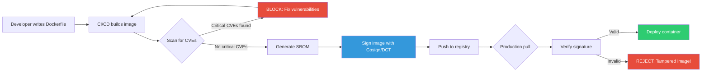
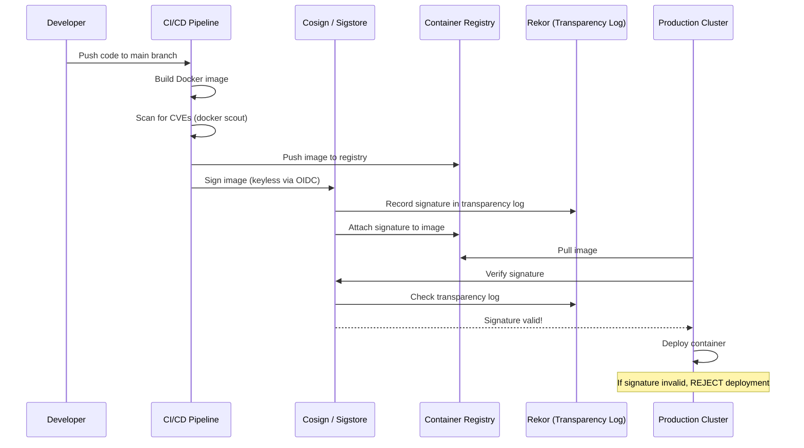

# File 18 — Image Security and Supply Chain

**Topic:** Docker Scout, SBOM, CVE scanning, Docker Content Trust, image signing, base image selection, Chainguard images

**WHY THIS MATTERS:**
Your container is only as secure as the image it is built from. A single vulnerable package in your base image can expose your entire production system. Supply chain attacks (like SolarWinds, Log4Shell) prove that trusting without verifying is catastrophic.

**Prerequisites:** Docker basics, file 17 (container security)

---

## Story: The Food Safety Inspector

Imagine you run a restaurant chain in India. You do not grow your own vegetables — you buy from suppliers. But how do you ensure safety?

1. **INGREDIENTS CHECK (SBOM — Software Bill of Materials)** — Just like an FSSAI inspector checks every ingredient listed on a packaged food item, an SBOM lists EVERY software component inside your Docker image — libraries, packages, dependencies. You cannot fix what you cannot see.

2. **EXPIRY DATE CHECK (CVE Scanning)** — Every packaged food has an expiry date. Similarly, every software component has known vulnerabilities (CVEs) discovered over time. Docker Scout / Trivy / Grype scan your image and say: "This ingredient (openssl 1.1.1) expired (CVE-2023-0286)!"

3. **FSSAI SEAL OF TRUST (Docker Content Trust / Image Signing)** — The FSSAI seal on a food package means a trusted authority has verified it. Similarly, Docker Content Trust and Cosign ensure that the image you pull was actually built by the publisher — not tampered with by a man-in-the-middle attacker.

Without these checks, you are serving "food" to your users without knowing if it is safe to consume.



---

## Example Block 1 — Docker Scout: CVE Scanning

**WHY:** Docker Scout is Docker's native vulnerability scanner. It integrates directly with Docker Desktop and Docker Hub. It analyzes your image layers and reports known CVEs.

### Section 1 — Docker Scout Quickview

```bash
# SYNTAX: docker scout quickview <image>

# Get a high-level vulnerability overview:
docker scout quickview nginx:latest
# Expected output:
#   Target: nginx:latest
#   Base image: debian:bookworm-slim
#
#     Vulnerabilities
#     ────────────────
#     0C   3H   12M   45L
#     (Critical, High, Medium, Low)
#
#   What's next:
#     docker scout cves nginx:latest

# WHY: quickview is your first stop — a dashboard-level summary.
# If you see Critical or High, investigate immediately.
```

**FLAGS:**
- `--org <org>` — Specify Docker organization
- `--platform <os/arch>` — Scan specific platform variant

### Section 2 — Docker Scout CVEs (detailed scan)

```bash
# SYNTAX: docker scout cves <image> [FLAGS]

# Full CVE report:
docker scout cves nginx:latest
# Expected output:
#   CVE-2023-44487   HIGH   nghttp2  1.55.1  -> 1.57.0   HTTP/2 Rapid Reset
#   CVE-2023-52425   MEDIUM expat    2.5.0   -> 2.6.0    XML parsing vuln
#   ... (full list)

# Filter by severity:
docker scout cves --only-severity critical,high nginx:latest
# Shows only Critical and High CVEs

# Filter by package type:
docker scout cves --only-package-type deb nginx:latest
# Shows only Debian package vulnerabilities

# Filter by fixable:
docker scout cves --only-fixed nginx:latest
# Shows only CVEs that have available fixes

# Output as SARIF (for CI/CD integration):
docker scout cves --format sarif --output scout-report.sarif nginx:latest
```

**FLAGS:**

| Flag | Purpose |
|---|---|
| `--only-severity <sev>` | Filter: critical, high, medium, low |
| `--only-fixed` | Show only fixable vulnerabilities |
| `--only-unfixed` | Show only unfixed vulnerabilities |
| `--only-package-type <type>` | Filter: deb, rpm, apk, npm, pip, gem, etc. |
| `--format <fmt>` | Output format: table, json, sarif, markdown |
| `--output <file>` | Write results to file |
| `--exit-code` | Exit with non-zero if vulnerabilities found |
| `--platform <os/arch>` | Specify platform |

```bash
# CI/CD usage — fail the build on critical CVEs:
docker scout cves --only-severity critical --exit-code myapp:latest
# Exit code 2 if critical CVEs found — CI pipeline fails!
```

### Section 3 — Docker Scout Recommendations

```bash
# SYNTAX: docker scout recommendations <image>

# Get upgrade recommendations:
docker scout recommendations nginx:latest
# Expected output:
#   Recommended base image updates:
#     Current: debian:bookworm-slim (45 vulnerabilities)
#     Update to: debian:bookworm-slim@sha256:abc123 (12 vulnerabilities)
#     -33 vulnerabilities fixed!
#
#   Or switch base image:
#     chainguard/nginx (0 vulnerabilities)

# Compare two images:
docker scout compare myapp:v1 --to myapp:v2
# Shows: +5 new CVEs, -3 fixed CVEs, 2 unchanged

# WHY: Scout does not just find problems — it suggests solutions.
# It recommends base image updates and alternative base images.
```

---

## Example Block 2 — SBOM (Software Bill of Materials)

**WHY:** An SBOM is a complete inventory of every software component in your image. When a new CVE is announced (like Log4Shell), you can instantly check: "Do any of my images contain log4j?"

### Section 4 — Generating SBOM with Docker Scout

```bash
# SYNTAX: docker scout sbom <image>

# Generate SBOM:
docker scout sbom nginx:latest
# Expected output:
#   Package         Version    Type
#   ─────────────────────────────────
#   adduser         3.134      deb
#   apt             2.6.1      deb
#   base-files      12.4       deb
#   bash            5.2.15     deb
#   ... (hundreds of packages)

# Export as SPDX format:
docker scout sbom --format spdx nginx:latest > sbom-spdx.json

# Export as CycloneDX format:
docker scout sbom --format cyclonedx nginx:latest > sbom-cdx.json
```

**FLAGS:**
- `--format <fmt>` — spdx, cyclonedx, syft-json, list
- `--output <file>` — Write to file instead of stdout
- `--platform <p>` — Specify platform

**Alternative tools for SBOM generation:**

```bash
# Syft (by Anchore):
syft nginx:latest -o spdx-json > sbom.json

# Trivy:
trivy image --format spdx-json -o sbom.json nginx:latest
```

**WHY:** SBOMs are becoming legally required. US Executive Order 14028 mandates SBOMs for government software. Many enterprises now require SBOMs from vendors.

---

## Example Block 3 — Docker Content Trust (DCT)

**WHY:** Without image signing, a compromised registry or MITM attack can serve you a malicious image. DCT uses Notary to ensure that only images signed by trusted publishers are pulled.

### Section 5 — Enabling Docker Content Trust

```bash
# SYNTAX: export DOCKER_CONTENT_TRUST=1

# Enable DCT globally:
export DOCKER_CONTENT_TRUST=1

# Now pulling unsigned images FAILS:
docker pull malicious/unsigned-image:latest
# Expected output: Error: remote trust data does not exist
# WHY: Docker refuses to pull because there is no signature!

# Pull a signed official image (works):
docker pull nginx:latest
# Expected output: Pull complete (signature verified)

# Push a signed image:
export DOCKER_CONTENT_TRUST=1
docker push myregistry/myapp:v1.0
# First time: prompts for root key passphrase and repository key passphrase
# Subsequent pushes: prompts only for repository key passphrase

# Disable for a single command:
DOCKER_CONTENT_TRUST=0 docker pull some-unsigned-image:latest
```

**Key Management:**
- **Root key:** Stored offline, used to create repository keys
- **Repository key:** Per-repo, used to sign images for that repo
- **Timestamp key:** Managed by registry, ensures freshness
- **Snapshot key:** Ensures consistency of repository state

```bash
# Back up your keys!
tar -czf docker-trust-keys-backup.tar.gz ~/.docker/trust/
```

**WHY:** DCT ensures image integrity and publisher identity. Without it, you trust the network and registry blindly.

---

## Example Block 4 — Cosign (Sigstore) Image Signing

**WHY:** Cosign is the modern, keyless alternative to DCT. It uses Sigstore's transparency log (Rekor) and supports OIDC-based keyless signing (no key management headaches).

### Section 6 — Signing with Cosign

```bash
# Install Cosign:
# brew install cosign   (macOS)
# go install github.com/sigstore/cosign/v2/cmd/cosign@latest   (Go)

# OPTION 1: Key-based signing
# Generate a key pair:
cosign generate-key-pair
# Creates: cosign.key (private) and cosign.pub (public)

# Sign an image:
cosign sign --key cosign.key myregistry/myapp:v1.0
# Prompts for passphrase, then signs and pushes signature to registry

# Verify an image:
cosign verify --key cosign.pub myregistry/myapp:v1.0
# Expected output:
# Verification for myregistry/myapp:v1.0 --
# The following checks were performed on each of these signatures:
#   - The cosign claims were validated
#   - The signatures were verified against the specified public key

# OPTION 2: Keyless signing (recommended for CI/CD)
cosign sign myregistry/myapp:v1.0
# Opens browser for OIDC authentication (GitHub, Google, etc.)
# No keys to manage! Identity tied to your OIDC identity.

# Verify keyless signature:
cosign verify \
  --certificate-identity user@example.com \
  --certificate-oidc-issuer https://accounts.google.com \
  myregistry/myapp:v1.0

# WHY: Cosign + keyless signing is the future of image security.
# No key management, transparent audit log, OIDC identity binding.
```



---

## Example Block 5 — Base Image Selection

**WHY:** Your base image is the foundation. A bloated base image means more packages, more attack surface, more CVEs. Choosing the right base image is the single most impactful security decision you make.

### Section 7 — Comparing base images

```
Base image comparison for Node.js:
─────────────────────────────────────────────────────
Image                     Size    Packages   Typical CVEs
─────────────────────────────────────────────────────
node:20                   ~1.1GB  ~400+      50-100+
node:20-slim              ~250MB  ~100+      10-30
node:20-alpine            ~180MB  ~30        5-15
gcr.io/distroless/nodejs  ~130MB  ~15        0-5
cgr.dev/chainguard/node   ~100MB  ~10        0-2
─────────────────────────────────────────────────────
```

**Why each option:**
- **node:20** — Full Debian. Has curl, bash, apt — great for dev, bad for prod.
- **node:20-slim** — Minimal Debian. No unnecessary tools. Good balance.
- **node:20-alpine** — Alpine Linux (musl libc). Small but can cause compatibility issues.
- **distroless** — Google's minimal images. No shell, no package manager. Very secure.
- **chainguard** — Zero-CVE images rebuilt daily. The gold standard for security.

```bash
# Check image size:
docker images node --format "table {{.Repository}}:{{.Tag}}\t{{.Size}}"

# Check CVE count across base images:
docker scout quickview node:20
docker scout quickview node:20-slim
docker scout quickview node:20-alpine
docker scout quickview cgr.dev/chainguard/node:latest
```

### Section 8 — Chainguard / Wolfi images

```bash
# Chainguard images are purpose-built for zero CVEs.
# Based on Wolfi, a Linux "undistro" designed for containers.

# Pull a Chainguard Node.js image:
docker pull cgr.dev/chainguard/node:latest

# Inspect — no shell!
docker run --rm cgr.dev/chainguard/node:latest sh
# Expected output: exec: "sh": executable file not found
# WHY: No shell = attacker cannot get interactive access!
```

Use in Dockerfile:

```dockerfile
FROM cgr.dev/chainguard/node:latest
WORKDIR /app
COPY --chown=node:node package*.json ./
RUN npm ci --omit=dev
COPY --chown=node:node . .
CMD ["server.js"]
```

**Chainguard images available for:** node, python, go, java, nginx, postgres, redis, static (for compiled binaries), git (for CI/CD containers)

- **Free tier:** `:latest` tag (rebuilt daily)
- **Paid tier:** versioned tags with SLAs

**WHY:** If your company mandates zero-CVE images (banking, healthcare), Chainguard is currently the best option available.

---

## Example Block 6 — Multi-Stage Builds for Security

**WHY:** Multi-stage builds ensure that build tools, compilers, source code, and dev dependencies NEVER reach production. The final image contains only the runtime and your compiled app.

### Section 9 — Secure multi-stage Dockerfile

```dockerfile
# ─── Stage 1: Build ───────────────────────────────────────
FROM node:20-alpine AS builder
WORKDIR /app

# Copy package files first (layer caching)
COPY package*.json ./
RUN npm ci

# Copy source and build
COPY . .
RUN npm run build
RUN npm prune --omit=dev

# ─── Stage 2: Production ──────────────────────────────────
FROM cgr.dev/chainguard/node:latest
WORKDIR /app

# Copy ONLY production artifacts
COPY --from=builder /app/dist ./dist
COPY --from=builder /app/node_modules ./node_modules
COPY --from=builder /app/package.json ./

# Non-root user (Chainguard images already run as non-root)
USER node

EXPOSE 3000
CMD ["dist/server.js"]
```

**What stays OUT of production image:**
- npm, yarn (package managers)
- gcc, make (compilers)
- Source code (.ts files)
- Dev dependencies (jest, eslint, typescript)
- .git directory
- Dockerfile itself

**WHY:** Build tools are the #1 source of CVEs in production images. typescript, webpack, babel etc. have their own dependency trees with hundreds of packages you do not need at runtime.

---

## Example Block 7 — Alternative Scanning Tools

**WHY:** Docker Scout is great but not the only option. In CI/CD, you may use Trivy, Grype, or Snyk depending on your organization's toolchain.

### Section 10 — Trivy

```bash
# Trivy (by Aqua Security) — popular open-source scanner

# Install:
# brew install trivy   (macOS)
# apt install trivy    (Debian/Ubuntu)

# Scan an image:
trivy image nginx:latest
# Expected output:
# nginx:latest (debian 12.4)
# Total: 58 (UNKNOWN: 0, LOW: 42, MEDIUM: 12, HIGH: 3, CRITICAL: 1)
#
# CVE-2023-44487  CRITICAL  nghttp2  1.55.1  1.57.0  HTTP/2 Rapid Reset

# Scan and fail on HIGH+:
trivy image --severity HIGH,CRITICAL --exit-code 1 myapp:latest
# Exit code 1 if HIGH or CRITICAL CVEs found

# Scan a Dockerfile (pre-build):
trivy config ./Dockerfile
# Finds misconfigurations like running as root, missing HEALTHCHECK, etc.

# Generate SBOM:
trivy image --format spdx-json -o sbom.json nginx:latest

# Scan filesystem (local project):
trivy fs --scanners vuln,secret .
# Scans package-lock.json, go.sum, etc. for vulnerable dependencies
# Also finds accidentally committed secrets!
```

### Section 11 — Grype

```bash
# Grype (by Anchore) — fast vulnerability scanner

# Install:
# brew install grype

# Scan an image:
grype nginx:latest
# Expected output (table format):
# NAME        INSTALLED  FIXED-IN  TYPE  VULNERABILITY  SEVERITY
# libssl3     3.0.11     3.0.13    deb   CVE-2024-0727  MEDIUM
# ...

# Fail on severity threshold:
grype nginx:latest --fail-on high
# Exit code 1 if HIGH or above

# Use with Syft for SBOM-based scanning:
syft nginx:latest -o json | grype
# Scan from pre-generated SBOM — faster for repeated scans

# WHY: Grype is typically faster than Trivy for large images.
# It pairs well with Syft (same team) for SBOM workflows.
```

---

## Example Block 8 — CI/CD Integration

**WHY:** Scanning on developer laptops is nice. Scanning in CI/CD is essential. Every image MUST be scanned before it reaches any registry or production environment.

### Section 12 — GitHub Actions example

```yaml
# .github/workflows/image-security.yml

name: Image Security Scan
on: [push, pull_request]

jobs:
  scan:
    runs-on: ubuntu-latest
    steps:
      - uses: actions/checkout@v4

      - name: Build image
        run: docker build -t myapp:ci .

      - name: Docker Scout CVE scan
        uses: docker/scout-action@v1
        with:
          command: cves
          image: myapp:ci
          only-severities: critical,high
          exit-code: true      # Fail the workflow on findings

      - name: Docker Scout SBOM
        uses: docker/scout-action@v1
        with:
          command: sbom
          image: myapp:ci
          output: sbom.spdx.json

      - name: Sign image with Cosign
        if: github.ref == 'refs/heads/main'
        uses: sigstore/cosign-installer@v3
      - run: cosign sign --yes myregistry/myapp:latest
        env:
          COSIGN_EXPERIMENTAL: 1
```

**WHY:** This pipeline:
1. Builds the image
2. Scans for CVEs (fails on critical/high)
3. Generates SBOM for compliance
4. Signs the image (only on main branch)

All automated. No human can skip security checks.

---

## Example Block 9 — Image Hygiene Best Practices

### Section 13 — Pinning and verifying digests

```bash
# NEVER use :latest in production Dockerfiles!

# BAD — mutable tag, can change under you:
# FROM node:20-alpine

# GOOD — pinned to specific version:
# FROM node:20.11.1-alpine3.19

# BEST — pinned to SHA256 digest (immutable):
# FROM node@sha256:abc123def456...

# Find the digest:
docker inspect --format='{{index .RepoDigests 0}}' node:20-alpine
# Output: node@sha256:2d07db07a2df...

# Use in Dockerfile:
# FROM node@sha256:2d07db07a2df...
# WHY: Even if someone pushes a malicious image to the same tag,
# the digest ensures you ALWAYS get the exact same image.
```

**Additional hygiene:**
1. Rebuild images regularly (weekly) to pick up base image patches
2. Set up automated rebuild triggers when base image updates
3. Use `--no-cache` periodically to ensure fresh layers
4. Remove unused images: `docker image prune -a`
5. Never store secrets in image layers (use build secrets)

### Section 14 — Dockerfile linting with Hadolint

```bash
# Hadolint — Dockerfile best practice linter

# Install:
# brew install hadolint

# Lint your Dockerfile:
hadolint Dockerfile
# Expected output:
# Dockerfile:3 DL3006 warning: Always tag the version of an image explicitly
# Dockerfile:7 DL3018 warning: Pin versions in apk add
# Dockerfile:12 DL3002 error: Last USER should not be root

# Ignore specific rules:
hadolint --ignore DL3006 Dockerfile

# CI/CD integration:
# docker run --rm -i hadolint/hadolint < Dockerfile
```

**Key Rules:**

| Rule | Description |
|---|---|
| DL3002 | Last USER should not be root |
| DL3006 | Always tag images explicitly |
| DL3008 | Pin versions in apt-get install |
| DL3018 | Pin versions in apk add |
| DL3025 | Use JSON notation for CMD/ENTRYPOINT |
| DL3059 | Multiple consecutive RUN should be merged |
| SC2086 | Double quote to prevent globbing (ShellCheck) |

**WHY:** Hadolint catches security issues BEFORE the image is built. Shift-left security — find problems as early as possible.

---

## Key Takeaways

1. **SCAN EVERY IMAGE:** Use Docker Scout, Trivy, or Grype in CI/CD. Fail builds on Critical and High CVEs.

2. **GENERATE SBOMs:** Know every component in your images. Formats: SPDX, CycloneDX. Required by many compliance standards.

3. **SIGN YOUR IMAGES:** Use Cosign (keyless) or Docker Content Trust. Verify signatures before deploying to production.

4. **CHOOSE MINIMAL BASE IMAGES:** Distroless > Alpine > Slim > Full. Chainguard for zero-CVE requirements.

5. **PIN IMAGE DIGESTS:** Never use `:latest` in Dockerfiles. Use SHA256 digests for immutable references.

6. **MULTI-STAGE BUILDS:** Build tools and dev deps must NEVER reach your production image.

7. **LINT DOCKERFILES:** Use Hadolint to catch issues early.

8. **AUTOMATE EVERYTHING:** Security scans, signing, SBOM generation must be in your CI/CD pipeline — never manual.

9. **REBUILD REGULARLY:** Images rot. Base image patches are released constantly. Rebuild weekly at minimum.

10. **TRUST BUT VERIFY:** Even official images have CVEs. The FSSAI inspector checks EVERY package, not just suspicious ones.

**Food Safety Analogy Recap:**

| Check | Analogy |
|---|---|
| Ingredients list (SBOM) | Know what is inside |
| Expiry check (CVE scan) | Find outdated/vulnerable parts |
| FSSAI seal (signing) | Verify publisher identity |
| Imported vs local (base image) | Choose safe, minimal sources |
| Kitchen hygiene (Hadolint) | Prevent issues before cooking |
