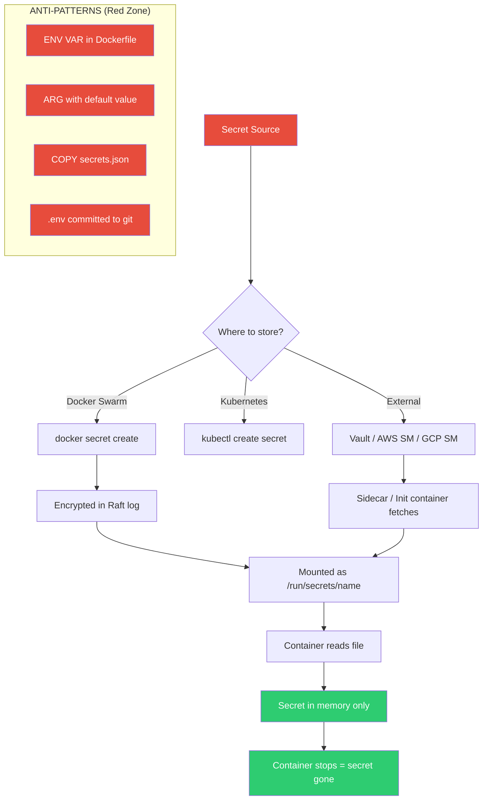
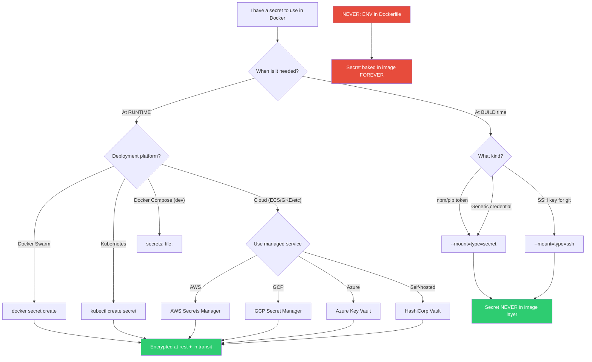

# File 19 — Secrets and Sensitive Data

**Topic:** Docker secrets, build secrets, env vars anti-patterns, secret management best practices

**WHY THIS MATTERS:**
Leaked credentials are the #1 cause of production breaches. An exposed database password, API key, or private certificate can take down your entire organization. Docker provides specific mechanisms to handle secrets — ignoring them means your secrets end up in image layers, logs, and process listings.

**Prerequisites:** Docker basics, files 17-18 (security)

---

## Story: Military Classified Documents

Imagine the Indian military's classified document handling system:

1. **SEALED ENVELOPE (Docker Secret)** — Top-secret orders are placed in sealed, tamper-evident envelopes. Only the designated officer (service/container) can open them. The envelope is never photocopied, never left on a desk, and is destroyed after reading. Docker secrets work the same way — mounted as in-memory files, never written to disk, never in logs.

2. **NEED-TO-KNOW BASIS (Service Access Control)** — Not every soldier sees every document. A jawaan (private) does not read the general's strategy. Similarly, only the containers that NEED a secret should have access to it. Other services never see it.

3. **NEVER WRITTEN ON A POSTCARD (Environment Variables Anti-Pattern)** — You would never write "Nuclear launch codes: 1234" on a postcard for the postman to read. Yet developers do exactly this with environment variables — visible in docker inspect, /proc/environ, process listings, and crash dumps. ENV VARS ARE NOT SECRETS!

The military has centuries of experience protecting classified data. Docker gives you the same tools — if you use them correctly.



---

## Example Block 1 — The ENV VAR Anti-Pattern

**WHY:** Environment variables are the most common way developers pass secrets. They are also the most INSECURE way. Understanding WHY they are dangerous is the first step to doing it right.

### Section 1 — How ENV vars leak

**ANTI-PATTERN 1: ENV in Dockerfile**

```dockerfile
FROM node:20-alpine
ENV DB_PASSWORD=supersecret123
CMD ["node", "server.js"]
```

**WHY THIS IS TERRIBLE:**
1. The password is baked INTO the image layer forever
2. Anyone who pulls the image can see it
3. It appears in docker history

```bash
# Prove it:
docker build -t leaky-app .
docker history leaky-app
# Output shows: ENV DB_PASSWORD=supersecret123
# ANYONE can read this. The secret is in the image metadata!
```

**ANTI-PATTERN 2: ENV at runtime (slightly better but still bad)**

```bash
docker run -e DB_PASSWORD=supersecret123 myapp

# Problems:
#   1. Visible in: docker inspect <container>
docker inspect <container_id> | grep DB_PASSWORD
# Output: "DB_PASSWORD=supersecret123"

#   2. Visible in: /proc/<pid>/environ on the host
cat /proc/<container_pid>/environ | tr '\0' '\n' | grep DB_PASSWORD
# Output: DB_PASSWORD=supersecret123

#   3. Visible in: docker logs (if app logs env vars on crash)
#   4. Visible in: CI/CD logs if not masked properly
```

**ANTI-PATTERN 3: ARG with default value**

```dockerfile
FROM node:20-alpine
ARG DB_PASSWORD=supersecret123
RUN echo "Connecting with $DB_PASSWORD"
```

**WHY BAD:** ARG values appear in docker history AND build cache!

```bash
docker history myapp --no-trunc
# Output: ARG DB_PASSWORD=supersecret123  <-- exposed!
```

### Section 2 — .env file risks

```bash
# Typical .env file:
# DB_HOST=mongodb.example.com
# DB_USER=admin
# DB_PASSWORD=P@ssw0rd!2024
# JWT_SECRET=my-jwt-secret-key
# STRIPE_API_KEY=sk_live_abc123xyz
```

**RISK 1: Accidentally committed to git**

```bash
git add .                    # Oops, .env included!
git commit -m "update"
git push origin main         # Secret is now on GitHub FOREVER
# Even if you delete the file, it is in git history!
```

**RISK 2: Docker build context** — If `.env` is not in `.dockerignore`, it gets sent to the build daemon. If a `COPY . .` instruction exists, `.env` is IN the image!

**RISK 3: docker-compose.yml env_file** — Loaded as environment variables, same leak risks.

**Mitigation:**

```bash
# 1. ALWAYS add to .gitignore:
echo ".env" >> .gitignore
echo ".env.*" >> .gitignore

# 2. ALWAYS add to .dockerignore:
echo ".env" >> .dockerignore
echo ".env.*" >> .dockerignore

# 3. Use .env.example (no real values) as a template:
# DB_HOST=
# DB_USER=
# DB_PASSWORD=
# JWT_SECRET=
```

---

## Example Block 2 — Docker Swarm Secrets

**WHY:** Docker Swarm has built-in secret management. Secrets are encrypted at rest (in the Raft log), encrypted in transit (TLS between nodes), and mounted as in-memory tmpfs files that are never written to disk.

### Section 3 — Creating and using Swarm secrets

```bash
# SYNTAX: docker secret create <name> <file_or_stdin>

# Initialize Swarm (if not already):
docker swarm init

# Create a secret from a file:
echo "P@ssw0rd!2024" > db_password.txt
docker secret create db_password db_password.txt
rm db_password.txt    # Delete the file immediately!

# Create a secret from stdin (safer — no file on disk):
echo "my-jwt-secret-key-2024" | docker secret create jwt_secret -
# The '-' means read from stdin

# Create from a certificate file:
docker secret create tls_cert ./server.crt
docker secret create tls_key ./server.key

# List all secrets:
docker secret ls
# Expected output:
# ID                          NAME          CREATED
# abc123...                   db_password   2 minutes ago
# def456...                   jwt_secret    1 minute ago

# Inspect a secret (metadata only — value is NOT shown!):
docker secret inspect db_password
# Expected output:
# [{ "ID": "abc123...", "Version": {...},
#    "CreatedAt": "2024-01-15T...",
#    "Spec": { "Name": "db_password" } }]
# NOTE: The actual secret value is NEVER shown in inspect!

# WHY: Unlike env vars, you cannot accidentally see the secret
# in inspect output, logs, or process listings.

# Remove a secret:
docker secret rm db_password
# Only works if no service is using it!
```

### Section 4 — Using secrets in Swarm services

```bash
# SYNTAX: docker service create --secret <name> <image>

# Create a service with secrets:
docker service create \
  --name api \
  --secret db_password \
  --secret jwt_secret \
  myapp:latest

# Inside the container, secrets appear as files:
# /run/secrets/db_password    -> contains "P@ssw0rd!2024"
# /run/secrets/jwt_secret     -> contains "my-jwt-secret-key-2024"
```

Reading secrets in application code:

```javascript
// Node.js:
const fs = require('fs');
const dbPassword = fs.readFileSync('/run/secrets/db_password', 'utf8').trim();
const jwtSecret = fs.readFileSync('/run/secrets/jwt_secret', 'utf8').trim();
```

```python
# Python:
with open('/run/secrets/db_password') as f:
    db_password = f.read().strip()
```

```bash
# Grant secret to specific service with target path:
docker service create \
  --name api \
  --secret source=db_password,target=/app/config/db_pass,mode=0400 \
  myapp:latest
```

**FLAGS:**
- `--secret <name>` — Basic: mount at `/run/secrets/<name>`
- `--secret source=<name>,target=<path>` — Custom mount path
- `--secret source=<name>,mode=0400` — Set file permissions (read-only by owner)
- `--secret source=<name>,uid=1000,gid=1000` — Set owner

**WHY:** Secrets are:
- Encrypted at rest (AES-256 in Raft log)
- Encrypted in transit (mutual TLS between nodes)
- Mounted as tmpfs (never touches disk on worker nodes)
- Only accessible to services that are granted access
- Automatically removed when service is destroyed

---

## Example Block 3 — Docker Compose Secrets

**WHY:** Docker Compose supports secrets for local development too. While not as secure as Swarm (no encryption at rest), it teaches the right patterns so your code reads from `/run/secrets/` in both dev and prod.

### Section 5 — Compose file secrets

```yaml
services:
  api:
    build: .
    secrets:
      - db_password
      - jwt_secret
      - stripe_key
    environment:
      # Non-sensitive config (NOT secrets):
      NODE_ENV: production
      PORT: 3000
      DB_HOST: mongo

  mongo:
    image: mongo:7
    secrets:
      - db_password
    environment:
      MONGO_INITDB_ROOT_PASSWORD_FILE: /run/secrets/db_password
      # NOTE: Many official images support _FILE suffix!
      # This reads the secret from the file instead of env var.

secrets:
  db_password:
    file: ./secrets/db_password.txt    # From local file
  jwt_secret:
    file: ./secrets/jwt_secret.txt
  stripe_key:
    environment: STRIPE_KEY            # From host env var (Compose v2.23+)
```

**The `_FILE` convention:** Many official Docker images support reading secrets from files:
- `MYSQL_ROOT_PASSWORD_FILE=/run/secrets/mysql_password`
- `POSTGRES_PASSWORD_FILE=/run/secrets/pg_password`
- `MONGO_INITDB_ROOT_PASSWORD_FILE=/run/secrets/mongo_password`

**WHY:** This means you do NOT need to modify the official images. Just mount the secret and use the `_FILE` variant of the env var.

**File structure:**
```
project/
  docker-compose.yml
  secrets/
    db_password.txt      (contains only the password, no newline)
    jwt_secret.txt
  .gitignore             (must include secrets/)
  .dockerignore          (must include secrets/)
```

---

## Example Block 4 — Build Secrets (BuildKit)

**WHY:** Sometimes you need secrets during BUILD time — like a private npm registry token, a GitHub token to clone private repos, or a pip index password. BuildKit's `--mount=type=secret` ensures these secrets NEVER appear in image layers.

### Section 6 — Using build secrets

```bash
# SYNTAX: docker build --secret id=<name>,src=<file> .

# Step 1: Create a secret file:
echo "//registry.npmjs.org/:_authToken=npm_abc123" > .npmrc-secret
```

Step 2: Reference in Dockerfile with `--mount=type=secret`:

```dockerfile
FROM node:20-alpine
WORKDIR /app
COPY package*.json ./

# Mount the secret during RUN — it exists ONLY during this step!
RUN --mount=type=secret,id=npmrc,target=/root/.npmrc \
    npm ci --omit=dev

COPY . .
USER node
CMD ["node", "server.js"]
```

```bash
# Step 3: Build with the secret:
DOCKER_BUILDKIT=1 docker build \
  --secret id=npmrc,src=.npmrc-secret \
  -t myapp:latest .

# VERIFY the secret is NOT in the image:
docker history myapp:latest --no-trunc
# The .npmrc content does NOT appear in any layer!

docker run --rm myapp:latest cat /root/.npmrc
# Expected: No such file or directory
# The secret file is GONE — it only existed during that RUN step.

# Multiple build secrets:
DOCKER_BUILDKIT=1 docker build \
  --secret id=npmrc,src=.npmrc-secret \
  --secret id=github_token,src=./github-token.txt \
  -t myapp:latest .
```

In Dockerfile:

```dockerfile
RUN --mount=type=secret,id=github_token \
    GITHUB_TOKEN=$(cat /run/secrets/github_token) \
    git clone https://${GITHUB_TOKEN}@github.com/org/private-repo.git
```

**FLAGS for `--mount=type=secret`:**

| Flag | Purpose |
|---|---|
| `id=<name>` | Secret identifier (matches `--secret id=<name>`) |
| `target=<path>` | Mount path (default: `/run/secrets/<id>`) |
| `required=true` | Fail build if secret not provided |
| `mode=0400` | File permissions |
| `uid=1000` | Owner UID |
| `gid=1000` | Owner GID |

### Section 7 — SSH mount for private repos

For cloning private Git repos during build, use SSH mount:

```dockerfile
FROM node:20-alpine
RUN apk add --no-cache openssh-client git

# Mount SSH agent socket during this RUN step:
RUN --mount=type=ssh \
    mkdir -p /root/.ssh && \
    ssh-keyscan github.com >> /root/.ssh/known_hosts && \
    git clone git@github.com:org/private-repo.git /app/private-repo
```

```bash
# Build with SSH forwarding:
eval $(ssh-agent)
ssh-add ~/.ssh/id_ed25519
DOCKER_BUILDKIT=1 docker build --ssh default -t myapp:latest .

# WHY: The SSH key is forwarded via the agent socket.
# It is NEVER copied into the image. The socket only exists
# during that specific RUN instruction.
```

Compare with the WRONG way:

```dockerfile
COPY ~/.ssh/id_rsa /root/.ssh/id_rsa    # TERRIBLE! Key is in image layer!
RUN git clone ...
RUN rm /root/.ssh/id_rsa                # USELESS! Still in previous layer!
```



---

## Example Block 5 — External Secret Managers

**WHY:** In production, you should use a dedicated secret manager. Docker secrets are good for Swarm, but for Kubernetes, cloud, or multi-platform deployments, external managers provide: rotation, audit logs, access control, and centralized management.

### Section 8 — HashiCorp Vault

```bash
# HashiCorp Vault — the industry standard for secrets management

# Start Vault (dev mode for learning):
docker run -d --name vault \
  -p 8200:8200 \
  -e VAULT_DEV_ROOT_TOKEN_ID=myroot \
  hashicorp/vault

# Store a secret:
export VAULT_ADDR='http://localhost:8200'
export VAULT_TOKEN='myroot'

vault kv put secret/myapp/db password="P@ssw0rd!2024" username="admin"
# Expected: Success! Data written to: secret/data/myapp/db

# Read a secret:
vault kv get secret/myapp/db
# Expected:
# Key         Value
# ---         -----
# password    P@ssw0rd!2024
# username    admin
```

Reading in application code (Node.js):

```javascript
const vault = require('node-vault')({
  endpoint: 'http://vault:8200',
  token: process.env.VAULT_TOKEN
});
const { data } = await vault.read('secret/data/myapp/db');
const dbPassword = data.data.password;
```

```yaml
# Docker Compose with Vault:
services:
  vault:
    image: hashicorp/vault
    ports: ["8200:8200"]
    environment:
      VAULT_DEV_ROOT_TOKEN_ID: myroot
    cap_add: [IPC_LOCK]

  api:
    build: .
    environment:
      VAULT_ADDR: http://vault:8200
      VAULT_TOKEN: myroot    # In prod, use AppRole auth, NOT root token!
    depends_on: [vault]
```

**WHY Vault:**
- Dynamic secrets (database creds generated on-demand, auto-expire)
- Secret rotation (automatic, no downtime)
- Audit log (who accessed what, when)
- Fine-grained ACL (policies per path)
- Encryption as a service (transit engine)

### Section 9 — AWS Secrets Manager

```bash
# AWS Secrets Manager — managed secrets for AWS workloads

# Create a secret:
aws secretsmanager create-secret \
  --name myapp/db-password \
  --secret-string "P@ssw0rd!2024"
```

Retrieve in application (Node.js):

```javascript
const { SecretsManagerClient, GetSecretValueCommand } = require("@aws-sdk/client-secrets-manager");
const client = new SecretsManagerClient({ region: "ap-south-1" });
const response = await client.send(new GetSecretValueCommand({ SecretId: "myapp/db-password" }));
const dbPassword = response.SecretString;
```

For ECS tasks, use the secrets property:

```json
{
  "containerDefinitions": [{
    "name": "api",
    "image": "myapp:latest",
    "secrets": [{
      "name": "DB_PASSWORD",
      "valueFrom": "arn:aws:secretsmanager:ap-south-1:123456:secret:myapp/db-password"
    }]
  }]
}
```

**WHY:** AWS handles encryption (KMS), rotation, replication, and IAM-based access control. No self-hosted infrastructure.

---

## Example Block 6 — Reading Secrets in Application Code

**WHY:** Your application needs a consistent pattern for reading secrets, whether they come from files, env vars, or Vault.

### Section 10 — Universal secret reader pattern

```javascript
// Node.js: Universal secret reader function

const fs = require('fs');

function getSecret(name) {
  // Priority 1: Docker secret file (/run/secrets/)
  const secretPath = '/run/secrets/' + name;
  try {
    return fs.readFileSync(secretPath, 'utf8').trim();
  } catch (e) {
    // File does not exist — try next method
  }

  // Priority 2: _FILE environment variable (custom path)
  const fileEnv = process.env[name.toUpperCase() + '_FILE'];
  if (fileEnv) {
    try {
      return fs.readFileSync(fileEnv, 'utf8').trim();
    } catch (e) {
      // File does not exist — try next method
    }
  }

  // Priority 3: Direct environment variable (least secure)
  const envValue = process.env[name.toUpperCase()];
  if (envValue) {
    console.warn('WARNING: Reading ' + name + ' from env var (insecure)');
    return envValue;
  }

  throw new Error('Secret ' + name + ' not found in any source');
}

// Usage:
// const dbPassword = getSecret('db_password');
// const jwtSecret = getSecret('jwt_secret');
//
// Works with:
//   - Docker secrets (/run/secrets/db_password)
//   - Custom file path (DB_PASSWORD_FILE=/etc/secrets/db_pass)
//   - Environment variable (DB_PASSWORD=xxx) — with warning
```

---

## Example Block 7 — Secret Rotation

**WHY:** Secrets should be rotated regularly. If a secret leaks, rotation limits the window of exposure. Vault and cloud managers support automatic rotation.

### Section 11 — Swarm secret rotation

```bash
# Docker Swarm secret rotation (manual process):

# Step 1: Create the new secret with a different name
echo "NewP@ssw0rd!2025" | docker secret create db_password_v2 -

# Step 2: Update the service to use the new secret
docker service update \
  --secret-rm db_password \
  --secret-add source=db_password_v2,target=/run/secrets/db_password \
  api

# NOTE: The target path stays the same!
# The application does NOT need to change — it still reads /run/secrets/db_password
# But the content is now the new password.

# Step 3: Remove the old secret
docker secret rm db_password
```

**WHY:** Swarm does not support in-place secret updates. You create a new version and swap it. The target path abstraction means your application is unaware of the rotation.

For automatic rotation, use:
- Vault's dynamic secrets (auto-expire, auto-renew)
- AWS Secrets Manager rotation lambdas
- CronJob in Kubernetes to rotate secrets

---

## Example Block 8 — Preventing Secret Leaks

### Section 12 — Docker history and layer inspection

```bash
# CHECK 1: Ensure secrets are not in image history
docker history myapp:latest --no-trunc
# Look for any passwords, tokens, or keys in the output.
# If you see ANY secret, the image is compromised. Rebuild.

# CHECK 2: Ensure secrets are not in image layers
docker save myapp:latest -o myapp.tar
tar -xf myapp.tar
# Each layer is a tar file — extract and search for secrets:
find . -name "*.tar" -exec tar -tf {} \; | grep -i -E "secret|password|key|token"

# CHECK 3: Use docker scout for exposed secrets
docker scout cves myapp:latest
# Some scanners detect hardcoded credentials in image layers.

# CHECK 4: Use truffleHog / gitleaks for source code
docker run --rm -v $(pwd):/repo trufflesecurity/trufflehog git file:///repo
# Expected: Lists any secrets found in git history

# CHECK 5: Use .dockerignore aggressively
```

Essential `.dockerignore` entries:

```
.env
.env.*
*.pem
*.key
*.p12
secrets/
.git
.aws
.ssh
credentials.json
service-account.json
```

**WHY:** Every check catches different leak vectors. Belt AND suspenders approach.

### Section 13 — ARG vs ENV deep dive

**ARG vs ENV — understanding the difference and risks:**

```
┌─────────────┬──────────────┬───────────────┬──────────────────┐
│             │ During Build │ In Container  │ In Image History │
├─────────────┼──────────────┼───────────────┼──────────────────┤
│ ARG         │ Yes          │ No            │ YES (DANGER!)    │
│ ENV         │ Yes          │ Yes           │ YES (DANGER!)    │
│ Build secret│ Yes          │ No            │ No (SAFE!)       │
└─────────────┴──────────────┴───────────────┴──────────────────┘
```

Even ARG values leak through docker history!

```dockerfile
FROM node:20-alpine
ARG NPM_TOKEN
RUN echo "//registry.npmjs.org/:_authToken=${NPM_TOKEN}" > .npmrc && \
    npm ci && \
    rm .npmrc
```

```bash
docker build --build-arg NPM_TOKEN=secret123 -t myapp .
docker history myapp --no-trunc
# Output: |1 NPM_TOKEN=secret123 /bin/sh -c echo...
# THE TOKEN IS VISIBLE IN HISTORY!
```

**CORRECT approach — use build secrets:**

```dockerfile
FROM node:20-alpine
RUN --mount=type=secret,id=npmrc,target=/root/.npmrc npm ci
```

**RULE:** Never pass secrets through ARG or ENV. Always use `--mount=type=secret` for build-time secrets. Always use `/run/secrets/` for runtime secrets.

---

## Example Block 9 — Complete Secure Setup

### Section 14 — Full secure docker-compose.yml

```yaml
services:
  api:
    build:
      context: .
      secrets:
        - npmrc                    # Build-time secret
    user: "1000:1000"
    read_only: true
    tmpfs: ["/tmp:size=64m"]
    cap_drop: [ALL]
    cap_add: [NET_BIND_SERVICE]
    security_opt:
      - no-new-privileges:true
    secrets:
      - db_password                # Runtime secret
      - jwt_secret                 # Runtime secret
    environment:
      NODE_ENV: production         # Non-sensitive only!
      DB_HOST: mongo
      PORT: 3000
    healthcheck:
      test: ["CMD", "node", "healthcheck.js"]
      interval: 30s
    deploy:
      resources:
        limits:
          memory: 512M
    networks: [backend]

  mongo:
    image: mongo:7
    read_only: true
    tmpfs: ["/tmp", "/data/configdb"]
    secrets:
      - db_password
    environment:
      MONGO_INITDB_ROOT_USERNAME: admin
      MONGO_INITDB_ROOT_PASSWORD_FILE: /run/secrets/db_password
    volumes:
      - mongo-data:/data/db
    networks: [backend]

secrets:
  db_password:
    file: ./secrets/db_password.txt
  jwt_secret:
    file: ./secrets/jwt_secret.txt
  npmrc:
    file: ./secrets/npmrc

volumes:
  mongo-data:

networks:
  backend:
    driver: bridge
```

**WHY:** This setup:
- Secrets mounted as files (never env vars)
- Read-only filesystem
- Non-root user
- No capabilities except what is needed
- No privilege escalation
- Resource limits
- Health checks
- Isolated network

---

## Key Takeaways

1. **ENV VARS ARE NOT SECRETS:** They leak through docker inspect, `/proc/environ`, logs, and crash dumps. Never use ENV for passwords.

2. **NEVER put secrets in Dockerfile:** No ENV, no ARG with secrets, no COPY of secret files. They persist in image layers forever.

3. **BUILD SECRETS:** Use `--mount=type=secret` for build-time needs. Use `--mount=type=ssh` for private Git repos.

4. **RUNTIME SECRETS:** Use Docker Swarm secrets (`/run/secrets/`), Kubernetes secrets, or external managers (Vault, AWS SM).

5. **`_FILE` CONVENTION:** Many official images support reading secrets from files (`MYSQL_ROOT_PASSWORD_FILE`, etc.).

6. **`.dockerignore` IS CRITICAL:** Always exclude `.env`, `*.key`, `*.pem`, `secrets/`, `.git`, credentials files.

7. **ROTATE SECRETS:** Use Vault dynamic secrets or cloud rotation. In Swarm, create new version and swap target path.

8. **AUDIT IMAGES:** Check docker history, extract layers, scan for accidentally embedded credentials.

9. **UNIVERSAL READER:** Write a `getSecret()` function that checks `/run/secrets/` first, then `_FILE` env, then env var (with warning).

10. **GIT HYGIENE:** Use `.gitignore`, pre-commit hooks, and tools like truffleHog to prevent committing secrets to version control.

**Military Analogy Recap:**

| Mechanism | Analogy |
|---|---|
| Sealed envelope (`/run/secrets/`) | Tamper-evident, destroyed after use |
| Need-to-know (service access) | Only granted containers see it |
| Never on a postcard (no env vars) | Env vars are the postcard |
| Destroy after reading (tmpfs) | Secret never hits disk |
| Classified document system (Vault) | Centralized, audited, rotated |
