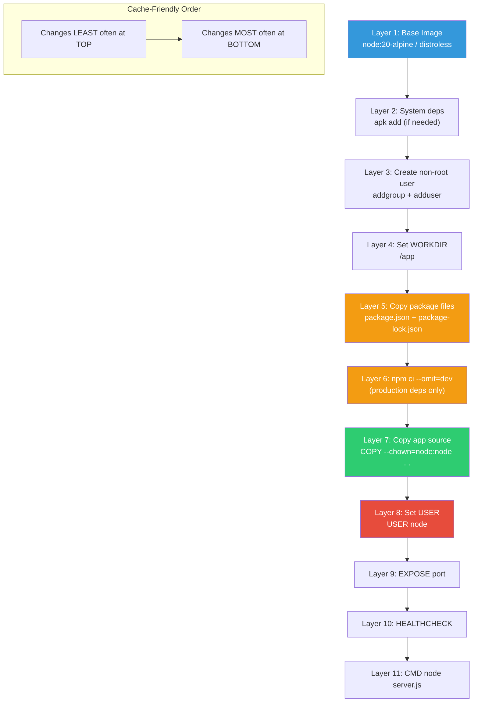
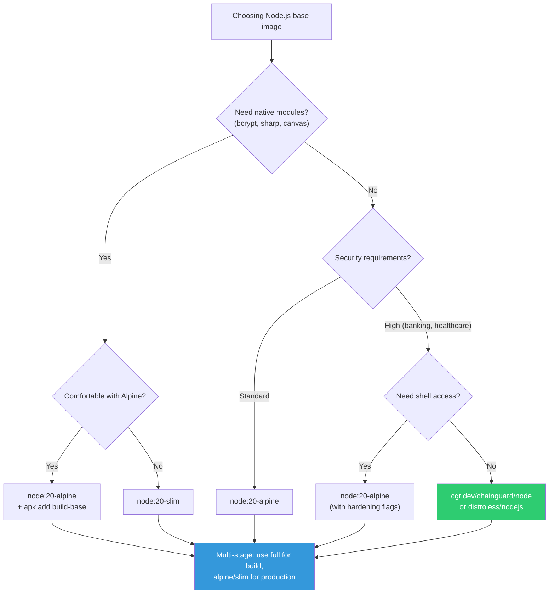

# File 20: Containerizing Node.js — Best Practices

**Topic:** Node.js Docker best practices, signal handling, graceful shutdown, production Dockerfile

**WHY THIS MATTERS:**
Node.js is one of the most containerized runtimes in the world. Yet most Node.js Dockerfiles are bloated, insecure, and handle shutdowns incorrectly — leading to dropped requests, zombie processes, and 502 errors during deployments. This file teaches you the RIGHT way to containerize Node.js for production.

**Pre-requisites:** Docker basics, Node.js fundamentals, files 17-19

---

## Story: The Chai Tapri (Tea Stall) Modernization

Picture a famous chai tapri in Pune — Sharma ji's tea stall. He makes incredible chai, but everything is in his head: the recipe, the timing, the milk ratio. If Sharma ji is sick, no chai. If he moves location, customers are lost.

This is your Node.js app running directly on a VM.

Now imagine Sharma ji decides to franchise. He needs:

1. **STANDARD RECIPE CARD (Dockerfile)**
   Every franchise follows the exact same recipe. No guessing. The Dockerfile IS your recipe card — deterministic, reproducible.

2. **FRANCHISE MODEL (Containerization)**
   Each franchise (container) is identical. Open a new one in Mumbai, Bangalore, or Delhi — same chai, same quality. Scale up: start more containers. Scale down: stop some.

3. **OLD STALL vs MODERN FRANCHISE**
   Old stall: `node:latest` (1GB), runs as root, no health checks, crashes on SIGTERM, has dev dependencies in production.
   Modern franchise: `node:alpine`, non-root, graceful shutdown, health checks, production-only dependencies, minimal image.

Let us transform Sharma ji's tapri into a modern franchise chain.

---

## Mermaid Diagram 1: Node.js Dockerfile Layers



---

## Example Block 1 — Base Image Selection

**WHY:** Your base image determines image size, security posture, and compatibility. The wrong choice means hundreds of CVEs and gigabytes of unnecessary packages in production.

### Section 1 — Comparing Node.js base images

Node.js Base Image Comparison:

| Image | Size | Shell? | Pkg Mgr? | CVEs |
|---|---|---|---|---|
| `node:20` (Debian Bookworm) | ~1.1 GB | Yes | apt | 50+ |
| `node:20-slim` | ~250 MB | Yes | apt | 10-30 |
| `node:20-alpine` | ~180 MB | Yes | apk | 5-15 |
| `gcr.io/distroless/nodejs20` | ~130 MB | No | No | 0-5 |
| `cgr.dev/chainguard/node` | ~100 MB | No | No | 0-2 |

**WHEN TO USE EACH:**

- **`node:20` (FULL)** — Development, CI/CD build stages
  **WHY:** Has everything — gcc, make, python for native modules. NEVER for production final stage.

- **`node:20-slim`** — Good production default
  **WHY:** Minimal Debian. Has bash for debugging but no compiler tools. Compatible with all npm packages (glibc-based).

- **`node:20-alpine`** — Small and fast, some caveats
  **WHY:** Uses musl libc instead of glibc. Most npm packages work fine.
  **CAVEAT:** Some native modules (bcrypt, sharp) need extra build steps.
  **CAVEAT:** DNS resolution behaves slightly differently (ndots issue).

- **`distroless/nodejs`** — Maximum security
  **WHY:** No shell, no package manager, no debugging tools. Attacker cannot get interactive access.
  **CAVEAT:** Cannot exec into container for debugging.
  **CAVEAT:** Must use `CMD ["node", "server.js"]` (no shell form).

- **`chainguard/node`** — Zero-CVE production
  **WHY:** Rebuilt daily with latest patches. Zero known CVEs. Best for regulated industries (banking, healthcare).

---

## Mermaid Diagram 2: Base Image Decision Flowchart



---

## Example Block 2 — The .dockerignore File

**WHY:** Without .dockerignore, EVERYTHING in your project directory is sent to the Docker daemon as build context. This includes node_modules (200MB+), .git (could be huge), .env (secrets!), test files, and documentation.

### Section 2 — Essential .dockerignore for Node.js

```text
# .dockerignore for Node.js projects:

# Dependencies — we install fresh inside the container
node_modules
npm-debug.log*
yarn-debug.log*
yarn-error.log*

# Version control
.git
.gitignore

# Environment and secrets
.env
.env.*
*.pem
*.key
*.p12
secrets/

# IDE and editor files
.vscode
.idea
*.swp
*.swo
*~

# OS files
.DS_Store
Thumbs.db

# Testing
coverage/
.nyc_output/
__tests__/
*.test.js
*.spec.js
jest.config.*

# Documentation
*.md
LICENSE
docs/

# Docker files (prevent recursive builds)
Dockerfile*
docker-compose*
.dockerignore

# Build artifacts
dist/
build/
```

**WHY THIS MATTERS — Size comparison:**

| Scenario | Build context | Build time |
|---|---|---|
| Without .dockerignore | 450 MB (includes node_modules, .git, etc.) | 45 seconds |
| With .dockerignore | 2 MB (only source code) | 12 seconds |

**SECURITY:** Without .dockerignore, a `COPY . .` instruction will copy `.env`, `.ssh`, credentials into the image layer!

---

## Example Block 3 — npm ci vs npm install

**WHY:** `npm install` is for development. `npm ci` is for Docker builds and CI/CD. Understanding the difference is critical for reproducible, secure builds.

### Section 3 — npm ci --omit=dev

`npm install` vs `npm ci`:

| Feature | npm install | npm ci |
|---|---|---|
| Uses lockfile? | Optional | Mandatory |
| Modifies lockfile? | Yes (updates it) | No (errors if mismatch) |
| Deletes node_modules? | No | Yes (clean install) |
| Deterministic? | No | Yes |
| Speed | Slower | Faster (skip resolution) |

In Dockerfile, ALWAYS use `npm ci`:

```dockerfile
COPY package.json package-lock.json ./
RUN npm ci --omit=dev
```

**FLAGS:**
- `--omit=dev` — Skip devDependencies (jest, eslint, typescript, etc.)
- `--ignore-scripts` — Skip postinstall scripts (security hardening)

**Size difference example:**

| Scenario | node_modules size |
|---|---|
| With devDependencies | 350 MB |
| With `--omit=dev` | 45 MB |
| **Savings** | **305 MB** |

**WHY `--omit=dev` matters for SECURITY:**
Dev dependencies include build tools with their own dependency trees. Each package is a potential CVE. Fewer packages = fewer vulnerabilities. TypeScript alone pulls in ~50 transitive dependencies.

**IMPORTANT:** `package-lock.json` MUST be committed to git! Without it, `npm ci` will fail. This is BY DESIGN — it ensures everyone (and every Docker build) uses the exact same versions.

---

## Example Block 4 — Layer Caching for node_modules

**WHY:** Docker caches each layer. If a layer has not changed, Docker reuses the cached version. By copying package files BEFORE source code, we cache the expensive `npm ci` step.

### Section 4 — Cache-optimized Dockerfile

**BAD** — rebuilds node_modules on EVERY code change:

```dockerfile
FROM node:20-alpine
WORKDIR /app
COPY . .                       # Source code + package files together
RUN npm ci --omit=dev          # Runs every time ANY file changes!
CMD ["node", "server.js"]
```

**GOOD** — caches node_modules when only source code changes:

```dockerfile
FROM node:20-alpine
WORKDIR /app

# Step 1: Copy ONLY package files (changes rarely)
COPY package.json package-lock.json ./

# Step 2: Install dependencies (cached if package files unchanged)
RUN npm ci --omit=dev

# Step 3: Copy source code (changes frequently)
COPY . .

CMD ["node", "server.js"]
```

**WHY this works:**
1. Docker checks: "Did package.json change?" No -> use cached layer
2. "Did package-lock.json change?" No -> use cached npm ci layer
3. "Did source code change?" Yes -> only re-run COPY . . and below

**Build time comparison:**

| Scenario | Build time |
|---|---|
| Without caching | 45 seconds (npm ci runs every time) |
| With caching | 3 seconds (npm ci cached, only COPY runs) |

**EVEN BETTER** — use BuildKit cache mount:

```dockerfile
RUN --mount=type=cache,target=/root/.npm \
    npm ci --omit=dev
```

This caches the npm download cache ACROSS builds. Even when package.json changes, previously downloaded packages are served from cache instead of re-downloading from npm.

---

## Example Block 5 — Non-Root User

**WHY:** Running Node.js as root inside a container means a prototype pollution or RCE vulnerability gives the attacker root access. Node.js should NEVER run as root.

### Section 5 — Creating and using a non-root user

**Option 1:** Use the built-in `node` user (node:alpine already has it):

```dockerfile
FROM node:20-alpine
WORKDIR /app
COPY package.json package-lock.json ./
RUN npm ci --omit=dev
COPY --chown=node:node . .
USER node
CMD ["node", "server.js"]
```

**Option 2:** Create a custom user:

```dockerfile
FROM node:20-alpine
RUN addgroup -S appgroup && adduser -S appuser -G appgroup
WORKDIR /app
COPY package.json package-lock.json ./
RUN npm ci --omit=dev
COPY --chown=appuser:appgroup . .
USER appuser
CMD ["node", "server.js"]
```

**IMPORTANT:** `USER` must come AFTER `npm ci`! npm ci needs root to install packages in /app/node_modules. After installation, switch to non-root.

**IMPORTANT:** Use `--chown` with COPY! Without `--chown`, copied files are owned by root. The non-root user cannot read them.

Verify at runtime:

```bash
docker run --rm myapp whoami
# Expected: node (or appuser)

docker run --rm myapp id
# Expected: uid=1000(node) gid=1000(node)
```

**WHY:** In 2023, a prototype pollution CVE in a popular npm package allowed remote code execution. Apps running as root were fully compromised. Apps running as non-root limited the blast radius.

---

## Example Block 6 — Signal Handling and Graceful Shutdown

**WHY:** When Docker stops a container, it sends SIGTERM. If your Node.js app does not handle SIGTERM, Docker waits 10 seconds and then sends SIGKILL — forcefully killing the process. All in-flight requests are dropped. Database connections leak. Users get 502 errors.

### Section 6 — The PID 1 problem

**THE PID 1 PROBLEM:**

In a container, your process runs as PID 1. PID 1 in Linux has special behavior:
- Does NOT receive default signal handlers
- Must explicitly handle SIGTERM
- Must reap zombie child processes

Using `CMD node server.js` (shell form) runs:

```
/bin/sh -c "node server.js"
PID 1 = /bin/sh (the shell, not your app!)
PID 2 = node server.js
SIGTERM goes to shell, shell may NOT forward it to node!
```

Using `CMD ["node", "server.js"]` (exec form) runs:

```
PID 1 = node server.js (your app IS PID 1)
SIGTERM goes directly to your app!
```

**RULE:** Always use exec form (JSON array) for CMD:

```dockerfile
CMD ["node", "server.js"]      # CORRECT
CMD node server.js             # WRONG (shell form)
```

Verify PID:

```bash
docker run --rm myapp sh -c "ps aux"
# With exec form:  PID 1 = node server.js
# With shell form: PID 1 = /bin/sh -c "node server.js"
```

---

### Section 7 — Graceful shutdown code

```javascript
// graceful-shutdown.js — Production signal handling for Node.js

const http = require('http');

const server = http.createServer((req, res) => {
  res.writeHead(200);
  res.end('Hello from containerized Node.js!');
});

server.listen(3000, () => {
  console.log('Server listening on port 3000');
});

// Graceful shutdown handler
function shutdown(signal) {
  console.log('Received ' + signal + '. Shutting down gracefully...');

  // Step 1: Stop accepting new connections
  server.close(() => {
    console.log('HTTP server closed. All pending requests completed.');

    // Step 2: Close database connections
    // mongoose.connection.close();
    // redis.quit();
    // pgPool.end();

    // Step 3: Exit cleanly
    console.log('Cleanup complete. Exiting.');
    process.exit(0);
  });

  // Step 4: Force exit if graceful shutdown takes too long
  setTimeout(() => {
    console.error('Forced shutdown — graceful shutdown timed out.');
    process.exit(1);
  }, 10000); // 10 second timeout
}

// Listen for termination signals
process.on('SIGTERM', () => shutdown('SIGTERM'));  // Docker stop
process.on('SIGINT', () => shutdown('SIGINT'));    // Ctrl+C

// Prevent unhandled errors from crashing silently
process.on('uncaughtException', (err) => {
  console.error('Uncaught Exception:', err);
  shutdown('uncaughtException');
});

process.on('unhandledRejection', (reason) => {
  console.error('Unhandled Rejection:', reason);
  shutdown('unhandledRejection');
});
```

---

### Section 8 — Using tini as init process

**ALTERNATIVE:** Use tini as PID 1 (init process). tini handles signals and reaps zombie processes.

**Option 1:** Install tini in Dockerfile:

```dockerfile
FROM node:20-alpine
RUN apk add --no-cache tini
ENTRYPOINT ["/sbin/tini", "--"]
CMD ["node", "server.js"]
```

**Option 2:** Use Docker's built-in init (Docker 19.03+):

```bash
docker run --init myapp
# Docker injects tini automatically!
```

**Option 3:** node:alpine already has tini:

```dockerfile
ENTRYPOINT ["docker-entrypoint.sh"]
# Just use:
CMD ["node", "server.js"]
```

**How tini helps:**
1. Forwards SIGTERM to your Node.js process
2. Reaps zombie child processes (from child_process.exec, etc.)
3. Exits with the correct exit code

docker-compose.yml:

```yaml
services:
  api:
    build: .
    init: true    # Adds tini as PID 1
```

**WHY:** tini solves the PID 1 problem without modifying your code. Your Node.js process receives SIGTERM properly, and zombie processes from child_process.exec/spawn are cleaned up.

---

## Example Block 7 — Health Checks

**WHY:** Without health checks, Docker thinks your container is healthy as long as the process is running — even if Node.js is stuck in an infinite loop, deadlocked, or out of memory.

### Section 9 — Dockerfile HEALTHCHECK

**SYNTAX:** `HEALTHCHECK [OPTIONS] CMD <command>`

**Option 1:** Using curl:

```dockerfile
HEALTHCHECK --interval=30s --timeout=5s --start-period=10s --retries=3 \
  CMD curl -f http://localhost:3000/health || exit 1
```

**Option 2:** Using wget (Alpine does not have curl by default):

```dockerfile
HEALTHCHECK --interval=30s --timeout=5s --start-period=10s --retries=3 \
  CMD wget --no-verbose --tries=1 --spider http://localhost:3000/health || exit 1
```

**Option 3:** Using a dedicated healthcheck script (RECOMMENDED):

```dockerfile
HEALTHCHECK --interval=30s --timeout=5s --start-period=10s --retries=3 \
  CMD ["node", "healthcheck.js"]
```

**FLAGS:**

| Flag | Description |
|---|---|
| `--interval=30s` | Check every 30 seconds |
| `--timeout=5s` | Fail if check takes longer than 5 seconds |
| `--start-period=10s` | Wait 10 seconds before first check (app startup) |
| `--retries=3` | Mark unhealthy after 3 consecutive failures |

**healthcheck.js** — lightweight health check script:

```javascript
const http = require('http');
const options = {
  hostname: 'localhost',
  port: 3000,
  path: '/health',
  timeout: 2000,
};

const req = http.request(options, (res) => {
  process.exit(res.statusCode === 200 ? 0 : 1);
});

req.on('error', () => process.exit(1));
req.on('timeout', () => {
  req.destroy();
  process.exit(1);
});
req.end();
```

**WHY use a JS file instead of curl/wget?**
1. No need to install curl in Alpine (smaller image)
2. Can check more than just HTTP status (DB connectivity, etc.)
3. Does not spawn a shell process (faster, less overhead)

Check health status:

```bash
docker inspect --format='{{json .State.Health}}' myapp
# Expected:
# {"Status":"healthy","FailingStreak":0,"Log":[...]}
```

---

## Example Block 8 — Production Dockerfile (Complete)

**WHY:** This is the complete, production-ready Dockerfile that combines every best practice covered in this file. This is your Sharma ji franchise recipe card.

### Section 10 — The production Dockerfile

```dockerfile
# ═══════════════════════════════════════════════════════════
# PRODUCTION NODE.js DOCKERFILE — Complete Best Practices
# ═══════════════════════════════════════════════════════════

# ─── Stage 1: Dependencies ────────────────────────────────
FROM node:20-alpine AS deps
WORKDIR /app

# Copy package files for cache-efficient dependency install
COPY package.json package-lock.json ./

# Install ONLY production dependencies
# --mount=type=cache caches npm downloads across builds
RUN --mount=type=cache,target=/root/.npm \
    npm ci --omit=dev

# ─── Stage 2: Build (if using TypeScript) ─────────────────
FROM node:20-alpine AS builder
WORKDIR /app

COPY package.json package-lock.json ./
RUN --mount=type=cache,target=/root/.npm \
    npm ci

COPY . .
RUN npm run build

# ─── Stage 3: Production ─────────────────────────────────
FROM node:20-alpine AS production

# Security: Install tini for proper signal handling
RUN apk add --no-cache tini

# Security: Create non-root user (node:alpine has 'node' user)
# Use it instead of creating a new one

WORKDIR /app

# Copy production deps from stage 1
COPY --from=deps --chown=node:node /app/node_modules ./node_modules

# Copy built app from stage 2
COPY --from=builder --chown=node:node /app/dist ./dist
COPY --from=builder --chown=node:node /app/package.json ./

# Copy health check script
COPY --chown=node:node healthcheck.js ./

# Switch to non-root user
USER node

# Expose port (documentation only, does not publish)
EXPOSE 3000

# Environment (non-sensitive config only!)
ENV NODE_ENV=production
ENV PORT=3000

# Health check
HEALTHCHECK --interval=30s --timeout=5s --start-period=10s --retries=3 \
  CMD ["node", "healthcheck.js"]

# Use tini as PID 1, exec form for CMD
ENTRYPOINT ["/sbin/tini", "--"]
CMD ["node", "dist/server.js"]
```

**BUILD AND RUN:**

Build:

```bash
DOCKER_BUILDKIT=1 docker build -t myapp:latest .
```

Run with security hardening:

```bash
docker run -d \
  --name myapp \
  -p 3000:3000 \
  --read-only \
  --tmpfs /tmp:rw,noexec,nosuid,size=64m \
  --cap-drop ALL \
  --cap-add NET_BIND_SERVICE \
  --security-opt no-new-privileges \
  --memory 512m \
  --cpus 1.0 \
  --pids-limit 100 \
  --restart unless-stopped \
  myapp:latest
```

---

## Example Block 9 — Common Mistakes and Fixes

**WHY:** These are the mistakes made in 90% of Node.js Dockerfiles seen in the wild. Each one has real production consequences.

### Section 11 — Mistake catalog

**MISTAKE 1: Using npm start instead of node directly**

```dockerfile
# BAD:
CMD ["npm", "start"]
# WHY BAD: npm spawns a shell, then runs node. Signal handling breaks.
#          npm swallows SIGTERM. Your app does not shut down gracefully.

# GOOD:
CMD ["node", "server.js"]
```

**MISTAKE 2: Not using .dockerignore**

```dockerfile
# BAD:  No .dockerignore file
# WHY BAD: node_modules (200MB+) sent to daemon and may overwrite
#          the freshly installed modules from npm ci.

# GOOD: .dockerignore with node_modules, .git, .env, etc.
```

**MISTAKE 3: COPY . . before npm ci**

```dockerfile
# BAD:
COPY . . && RUN npm ci
# WHY BAD: Any source file change invalidates npm ci cache.

# GOOD:
COPY package*.json -> npm ci -> COPY . .
```

**MISTAKE 4: Using :latest tag**

```dockerfile
# BAD:
FROM node:latest
# WHY BAD: Tag changes over time. Today it is Node 20, tomorrow 22.
#          Builds are not reproducible.

# GOOD:
FROM node:20.11.1-alpine3.19
```

**MISTAKE 5: Running as root**

```dockerfile
# BAD:  No USER instruction
# WHY BAD: Container compromise = root access.

# GOOD:
USER node  # (after npm ci)
```

**MISTAKE 6: Including dev dependencies**

```dockerfile
# BAD:
RUN npm install  # (includes devDependencies)
# WHY BAD: jest, typescript, eslint etc. add 300MB+ and dozens of CVEs.

# GOOD:
RUN npm ci --omit=dev
```

**MISTAKE 7: Using ENTRYPOINT with shell form**

```dockerfile
# BAD:
ENTRYPOINT npm start
# WHY BAD: Shell form wraps in /bin/sh -c, signals not forwarded.

# GOOD:
ENTRYPOINT ["/sbin/tini", "--"]
CMD ["node", "server.js"]
```

**MISTAKE 8: Ignoring NODE_ENV**

```dockerfile
# BAD:  Not setting NODE_ENV
# WHY BAD: Express enables verbose error pages, view caching is off,
#          performance optimizations disabled.

# GOOD:
ENV NODE_ENV=production
```

---

## Example Block 10 — Docker Compose for Node.js

### Section 12 — Development vs Production compose

**docker-compose.yml (production):**

```yaml
version: "3.8"
services:
  api:
    build:
      context: .
      dockerfile: Dockerfile
      target: production        # Multi-stage: use production stage
    init: true                  # Use tini as PID 1
    user: "1000:1000"
    read_only: true
    tmpfs: ["/tmp:size=64m,noexec"]
    cap_drop: [ALL]
    security_opt: ["no-new-privileges:true"]
    environment:
      NODE_ENV: production
      PORT: 3000
      DB_HOST: mongo
    secrets:
      - db_password
    ports: ["3000:3000"]
    depends_on:
      mongo:
        condition: service_healthy
    deploy:
      resources:
        limits:
          memory: 512M
          cpus: '1.0'
    healthcheck:
      test: ["CMD", "node", "healthcheck.js"]
      interval: 30s
      timeout: 5s
      retries: 3
    networks: [backend]

  mongo:
    image: mongo:7
    environment:
      MONGO_INITDB_ROOT_PASSWORD_FILE: /run/secrets/db_password
    secrets: [db_password]
    volumes: [mongo-data:/data/db]
    healthcheck:
      test: ["CMD", "mongosh", "--eval", "db.adminCommand('ping')"]
      interval: 10s
    networks: [backend]

secrets:
  db_password:
    file: ./secrets/db_password.txt

volumes:
  mongo-data:

networks:
  backend:
```

**docker-compose.dev.yml (development override):**

```yaml
version: "3.8"
services:
  api:
    build:
      target: development        # Use dev stage with devDependencies
    user: root                   # Need write access for volume mounts
    read_only: false             # Need writes for hot reload
    cap_drop: []                 # Relaxed for dev
    volumes:
      - .:/app                   # Hot reload — mount source code
      - /app/node_modules        # Anonymous volume — prevent override
    environment:
      NODE_ENV: development
    command: ["npx", "nodemon", "server.js"]
```

**Run dev:**

```bash
docker compose -f docker-compose.yml -f docker-compose.dev.yml up
```

**Run prod:**

```bash
docker compose up
```

---

## Example Block 11 — Debugging Containerized Node.js

### Section 13 — Debugging techniques

Exec into a running container:

```bash
docker exec -it myapp sh
# (Only works if image has a shell — not distroless)
```

View logs:

```bash
docker logs myapp
docker logs -f myapp                    # Follow (tail -f)
docker logs --since 5m myapp            # Last 5 minutes
docker logs --tail 100 myapp            # Last 100 lines
```

Node.js inspector (remote debugging):

In Dockerfile or CMD:

```dockerfile
CMD ["node", "--inspect=0.0.0.0:9229", "server.js"]
```

Run with debug port:

```bash
docker run -p 3000:3000 -p 9229:9229 myapp
# Connect Chrome DevTools: chrome://inspect
```

Memory usage:

```bash
docker stats myapp
# Expected output:
# CONTAINER   CPU %   MEM USAGE / LIMIT   MEM %
# myapp       0.5%    85MiB / 512MiB      16.6%
```

Check for zombie processes:

```bash
docker exec myapp ps aux
# Look for processes in Z (zombie) state
```

Inspect container details:

```bash
docker inspect myapp --format '{{json .State}}'
# Shows: Status, ExitCode, Health, StartedAt, etc.
```

---

## Key Takeaways

1. **BASE IMAGE:** Use alpine or slim for production. Distroless/Chainguard for high security. Never use `:latest` tag.

2. **.dockerignore:** Always exclude node_modules, .git, .env, tests. Without it, your build context is 100x larger.

3. **npm ci --omit=dev:** Deterministic, clean, production-only installs. Never use npm install in Dockerfiles.

4. **LAYER CACHING:** Copy `package*.json` first, then `npm ci`, then source code. Saves minutes on every rebuild.

5. **NON-ROOT USER:** `USER node` (or custom user) after npm ci. Use `--chown` with COPY for proper file ownership.

6. **SIGNAL HANDLING:** Handle SIGTERM for graceful shutdown. Use exec form `CMD ["node", "server.js"]` — never shell form.

7. **TINI:** Use tini as PID 1 (`--init` flag or ENTRYPOINT tini). Handles signals and reaps zombie processes.

8. **HEALTH CHECKS:** Use a lightweight Node.js script, not curl. Checks HTTP, DB, and other dependencies.

9. **MULTI-STAGE:** Build in stage 1 (full image), run in stage 2 (minimal image). Dev deps and source never reach production.

10. **SECURITY:** Read-only fs, cap-drop ALL, no-new-privileges, resource limits, isolated network. See files 17-19.

**CHAI TAPRI ANALOGY RECAP:**

| Old tapri concept | Modern franchise equivalent |
|---|---|
| Old tapri (bare VM) | Inconsistent, fragile, manual |
| Recipe card (Dockerfile) | Deterministic, documented |
| Franchise model (containers) | Scalable, identical everywhere |
| Quality control (health check) | Self-monitoring, auto-healing |
| Standard ingredients (deps) | npm ci = exact same every time |
| Trained staff (non-root user) | Limited permissions, less risk |
