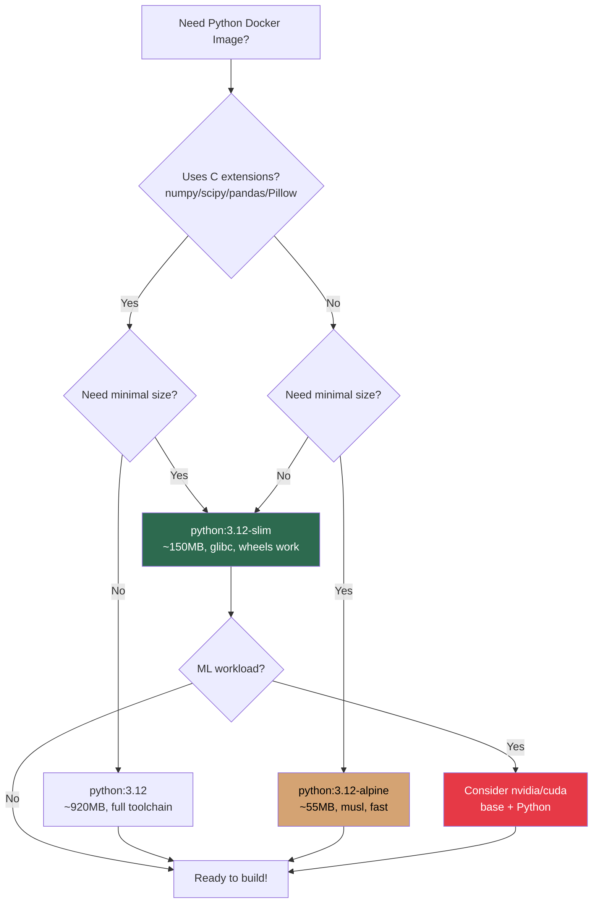
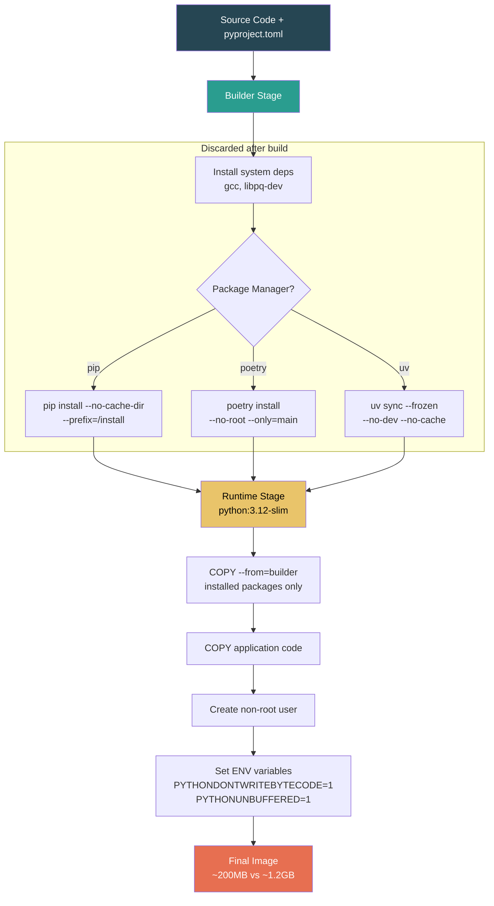

# File 21: Containerizing Python Applications

**Topic:** Python Docker Best Practices, Virtual Envs, pip/poetry/uv, ML Dependencies

**WHY THIS MATTERS:**
Python is the #1 language for data science, ML, web APIs, and automation.
But Python's dependency management is notoriously fragile — "works on my
machine" is practically a Python meme. Docker solves this by freezing
your entire Python environment into an immutable image. However, doing
it WRONG leads to 3GB images, broken C extensions, and 10-minute builds.
This file teaches you the RIGHT way.

**PRE-REQUISITES:** Files 01-20 (Docker fundamentals, Dockerfiles, multi-stage builds)

---

## Story: The Ayurvedic Pharmacy

Imagine an ancient Ayurvedic pharmacy in Jaipur.

The **HEAD PHARMACIST** (Python runtime) prepares medicines. But each
medicine needs a precise **FORMULATION** — written on a scroll
(requirements.txt). If you change even one herb's proportion,
the medicine might not work or could be harmful.

The **CLEAN ROOM** (virtual environment / venv) is where medicines are
prepared — isolated from the street dust, other medicines, and
contaminants. In Docker, we don't need venv for isolation (the
container IS the clean room), but we use it in multi-stage builds
to cleanly copy dependencies.

The **PACKAGING UNIT** (multi-stage build) takes the prepared medicine,
puts it in a small, sealed bottle (slim image), and ships it out.
The customer doesn't need the entire pharmacy — just the bottle.

The **HERB SUPPLIER** (PyPI / pip / poetry / uv) delivers raw materials.
Some suppliers are fast (uv), some are traditional (pip), some are
meticulous (poetry). Choose based on your pharmacy's needs.

**MUSL vs GLIBC** is like two different measuring systems — some herbs
(C extensions like numpy) are measured in one system (glibc/Debian)
and don't convert well to the other (musl/Alpine).

---

## Section 1 — Choosing the Right Python Base Image

**WHY:** The base image determines your image size, compatibility, and build speed.
Wrong choice = hours of debugging C extension compilation failures.

### Python Base Image Options (as of 2025/2026)

| IMAGE | SIZE | GLIBC? | USE CASE |
|---|---|---|---|
| `python:3.12` | ~920MB | Yes | Development, full toolchain |
| `python:3.12-slim` | ~150MB | Yes | Production (RECOMMENDED) |
| `python:3.12-alpine` | ~55MB | No | Simple scripts, no C extensions |
| `python:3.12-bookworm` | ~920MB | Yes | Same as default (Debian Bookworm) |
| `python:3.12-slim-bookworm` | ~150MB | Yes | Explicit Debian version pinning |
| `ubuntu:24.04 + deadsnakes` | ~75MB+ | Yes | Custom Python version control |

### The Alpine Trap (musl vs glibc)

Alpine uses MUSL libc instead of GLIBC.
Most Python wheels on PyPI are compiled against glibc.
Result: pip must COMPILE from source on Alpine.

- `numpy` on slim: `pip install numpy` — 5 seconds (pre-built wheel)
- `numpy` on alpine: `pip install numpy` — 15 MINUTES (compiles from source) ... and might FAIL if build dependencies are missing.

**RULE:** If your project uses numpy, scipy, pandas, Pillow, psycopg2,
or ANY package with C extensions — USE `python:slim`, NOT alpine.

### Mermaid: Python Base Image Selection Flowchart



---

## Example Block 1 — Basic Python Dockerfile (The Wrong Way)

**WHY:** Understanding anti-patterns first helps you appreciate best practices.

```dockerfile
# BAD Dockerfile — Common mistakes beginners make

# MISTAKE 1: Using the full image (920MB!) when you don't need build tools
FROM python:3.12

# MISTAKE 2: No .dockerignore — copies .git, __pycache__, .venv, node_modules
COPY . /app

# MISTAKE 3: Not pinning pip version
# MISTAKE 4: Not using --no-cache-dir (wastes space)
# MISTAKE 5: Installing after copying ALL code (cache busted on every code change)
RUN pip install -r /app/requirements.txt

# MISTAKE 6: Running as root
# MISTAKE 7: No PYTHONDONTWRITEBYTECODE (creates .pyc files uselessly in container)
CMD ["python", "/app/main.py"]

# Result: ~1.2GB image, slow builds, security issues, wasted cache
```

---

## Example Block 2 — Proper Python Dockerfile (The Right Way)

**WHY:** This is the production-grade pattern used by companies like Stripe, Spotify.

```dockerfile
# GOOD Dockerfile — Production Python Application

# SYNTAX: First line enables BuildKit features
# syntax=docker/dockerfile:1

# ── Stage 1: Builder ──────────────────────────────────────
FROM python:3.12-slim AS builder

# WHY: Prevents Python from writing .pyc bytecode files (useless in containers)
ENV PYTHONDONTWRITEBYTECODE=1
# WHY: Ensures print() output appears immediately in docker logs
ENV PYTHONUNBUFFERED=1

WORKDIR /app

# WHY: Install build dependencies needed for compiling C extensions
RUN apt-get update && \
    apt-get install -y --no-install-recommends gcc libpq-dev && \
    rm -rf /var/lib/apt/lists/*

# WHY: Copy ONLY requirements first → Docker layer caching!
# If requirements.txt hasn't changed, this layer is cached.
COPY requirements.txt .

# WHY: --no-cache-dir saves ~50-100MB by not caching downloaded packages
# WHY: --prefix=/install puts packages in a clean directory for copying
RUN pip install --no-cache-dir --prefix=/install -r requirements.txt

# ── Stage 2: Runtime ─────────────────────────────────────
FROM python:3.12-slim AS runtime

ENV PYTHONDONTWRITEBYTECODE=1
ENV PYTHONUNBUFFERED=1

# WHY: Create non-root user for security
RUN groupadd -r appuser && useradd -r -g appuser -d /app -s /sbin/nologin appuser

WORKDIR /app

# WHY: Copy ONLY the installed packages from builder (no gcc, no build tools)
COPY --from=builder /install /usr/local

# WHY: Copy application code last (changes most frequently → preserves cache)
COPY --chown=appuser:appuser . .

USER appuser

EXPOSE 8000

# WHY: Use exec form (JSON array) so signals propagate correctly
CMD ["gunicorn", "app.main:app", "--bind", "0.0.0.0:8000", "--workers", "4"]
```

---

## Section 2 — Environment Variables for Python in Docker

**WHY:** These ENV vars dramatically affect behavior inside containers.

```dockerfile
# Essential Python Environment Variables in Docker

ENV PYTHONDONTWRITEBYTECODE=1
# WHAT: Prevents Python from creating __pycache__/*.pyc files
# WHY:  In containers, bytecode caching is useless (container is ephemeral).
#       Saves disk space and avoids stale bytecode bugs.

ENV PYTHONUNBUFFERED=1
# WHAT: Forces stdout/stderr to be unbuffered
# WHY:  Without this, print() output may not appear in 'docker logs'
#       until the buffer is flushed. Critical for debugging!

ENV PIP_NO_CACHE_DIR=1
# WHAT: Tells pip not to cache downloaded packages
# WHY:  Cache is useless in a Docker build — saves 50-200MB

ENV PIP_DISABLE_PIP_VERSION_CHECK=1
# WHAT: Stops pip from checking for updates on every install
# WHY:  Speeds up builds, avoids network calls

ENV PYTHONPATH=/app
# WHAT: Adds /app to Python's module search path
# WHY:  Lets you import modules without relative path gymnastics

ENV PYTHONHASHSEED=0
# WHAT: Makes hash() deterministic
# WHY:  Useful for reproducible builds in data pipelines
```

---

## Example Block 3 — Using uv (The Fast Python Package Installer)

**WHY:** uv (by Astral, makers of Ruff) is 10-100x faster than pip.
It's written in Rust and is becoming the standard for fast Python installs.

```dockerfile
# Dockerfile with uv — Lightning Fast Python Installs

FROM python:3.12-slim AS builder

ENV PYTHONDONTWRITEBYTECODE=1
ENV PYTHONUNBUFFERED=1

WORKDIR /app

# WHY: Install uv — 10-100x faster than pip
# SYNTAX: --system installs globally (not in a venv)
COPY --from=ghcr.io/astral-sh/uv:latest /uv /usr/local/bin/uv

# Copy dependency files
COPY pyproject.toml uv.lock ./

# WHY: uv sync reads uv.lock for reproducible installs
# FLAGS: --frozen = don't update lock file
#        --no-dev = skip dev dependencies
#        --no-cache = don't cache (Docker layer = our cache)
RUN uv sync --frozen --no-dev --no-cache

# Copy application code
COPY . .

# ── Runtime Stage ─────────────────────────────────────────
FROM python:3.12-slim

ENV PYTHONDONTWRITEBYTECODE=1
ENV PYTHONUNBUFFERED=1

RUN groupadd -r appuser && useradd -r -g appuser appuser
WORKDIR /app

COPY --from=builder /app/.venv /app/.venv
COPY --from=builder /app .

# WHY: Put the venv's bin directory first in PATH
ENV PATH="/app/.venv/bin:$PATH"

USER appuser
EXPOSE 8000

CMD ["uvicorn", "app.main:app", "--host", "0.0.0.0", "--port", "8000"]
```

Build & Run:

```bash
docker build -t myapp-uv .
docker run -p 8000:8000 myapp-uv
```

Speed comparison (typical Flask app with 50 dependencies):
- `pip install`: 45 seconds
- `uv sync`: 3 seconds (15x faster!)

---

## Example Block 4 — Poetry in Docker

**WHY:** Poetry is the most popular dependency manager for Python projects.
It needs special handling in Docker because of virtual environments.

```dockerfile
# Dockerfile with Poetry — Dependency Management Done Right

FROM python:3.12-slim AS builder

ENV PYTHONDONTWRITEBYTECODE=1
ENV PYTHONUNBUFFERED=1
# WHY: Tell Poetry to create venv in project directory (.venv/)
# This makes it easy to copy to the runtime stage.
ENV POETRY_VIRTUALENVS_IN_PROJECT=true
ENV POETRY_NO_INTERACTION=1
ENV POETRY_CACHE_DIR=/tmp/poetry_cache

WORKDIR /app

# Install Poetry
RUN pip install --no-cache-dir poetry==1.8.4

# WHY: Copy ONLY dependency files first for layer caching
COPY pyproject.toml poetry.lock ./

# WHY: --no-root = don't install the project itself yet
#       --only=main = skip dev dependencies
RUN poetry install --no-root --only=main && \
    rm -rf $POETRY_CACHE_DIR

# Copy source and install the project
COPY . .
RUN poetry install --only=main

# ── Runtime Stage ─────────────────────────────────────────
FROM python:3.12-slim

ENV PYTHONDONTWRITEBYTECODE=1
ENV PYTHONUNBUFFERED=1

RUN groupadd -r appuser && useradd -r -g appuser appuser
WORKDIR /app

# Copy the virtual environment from builder
COPY --from=builder /app/.venv /app/.venv
COPY --from=builder /app .

ENV PATH="/app/.venv/bin:$PATH"

USER appuser
EXPOSE 8000
CMD ["gunicorn", "app.main:app", "-b", "0.0.0.0:8000", "-w", "4"]
```

---

## Section 3 — Gunicorn and Uvicorn Configuration

**WHY:** Flask/Django use gunicorn; FastAPI uses uvicorn. Both need proper
configuration for production Docker deployments.

### WSGI (gunicorn) vs ASGI (uvicorn) in Docker

**GUNICORN** — for Flask / Django (synchronous):

```dockerfile
# SYNTAX: gunicorn <module>:<app_variable> [OPTIONS]
CMD ["gunicorn", "app.main:app", \
     "--bind", "0.0.0.0:8000", \
     "--workers", "4", \
     "--threads", "2", \
     "--timeout", "120", \
     "--access-logfile", "-", \
     "--error-logfile", "-"]
```

| Flag | Purpose |
|---|---|
| `--bind 0.0.0.0:8000` | Listen on all interfaces (required in Docker!) |
| `--workers 4` | Number of worker processes (rule: 2 * CPU_CORES + 1) |
| `--threads 2` | Threads per worker (for I/O-bound apps) |
| `--timeout 120` | Kill worker if request takes > 120s |
| `--access-logfile -` | Print access logs to stdout (for docker logs) |
| `--error-logfile -` | Print error logs to stderr |

**UVICORN** — for FastAPI / Starlette (asynchronous):

```dockerfile
# SYNTAX: uvicorn <module>:<app_variable> [OPTIONS]
CMD ["uvicorn", "app.main:app", \
     "--host", "0.0.0.0", \
     "--port", "8000", \
     "--workers", "4", \
     "--loop", "uvloop", \
     "--http", "httptools"]
```

For production, use gunicorn with uvicorn workers:

```dockerfile
CMD ["gunicorn", "app.main:app", \
     "--bind", "0.0.0.0:8000", \
     "--workers", "4", \
     "--worker-class", "uvicorn.workers.UvicornWorker"]
```

**WHY gunicorn + uvicorn?**
gunicorn handles process management (restarts, signals, graceful shutdown).
uvicorn handles async request processing.
Together = production-grade async Python server.

---

## Example Block 5 — ML / Data Science Dockerfile

**WHY:** ML images are notoriously large. numpy, scipy, torch can make
images 5-10GB. Proper technique keeps them manageable.

```dockerfile
# Dockerfile for ML / Data Science Applications

# WHY: nvidia/cuda base for GPU support
# Use python:3.12-slim for CPU-only workloads
FROM nvidia/cuda:12.3.1-runtime-ubuntu22.04 AS base

# Install Python on CUDA base
RUN apt-get update && \
    apt-get install -y --no-install-recommends \
        python3.11 python3.11-venv python3-pip && \
    ln -s /usr/bin/python3.11 /usr/bin/python && \
    rm -rf /var/lib/apt/lists/*

# ── Builder Stage ─────────────────────────────────────────
FROM base AS builder

WORKDIR /app

COPY requirements.txt .

# WHY: --extra-index-url for PyTorch CUDA wheels
# WHY: --no-cache-dir saves hundreds of MB with ML packages
RUN python -m pip install --no-cache-dir \
    --extra-index-url https://download.pytorch.org/whl/cu121 \
    -r requirements.txt

# ── Runtime Stage ─────────────────────────────────────────
FROM base AS runtime

WORKDIR /app

# Copy installed packages
COPY --from=builder /usr/local/lib/python3.11 /usr/local/lib/python3.11
COPY --from=builder /usr/local/bin /usr/local/bin

COPY . .

# WHY: ML models often need more shared memory
# Use --shm-size=2g when running: docker run --shm-size=2g myml
# Or mount: --tmpfs /dev/shm:rw,nosuid,nodev,exec,size=2g

CMD ["python", "train.py"]
```

### Common ML Requirements Gotchas

1. **numpy/scipy:** Use slim, NOT alpine (needs glibc for wheels)
2. **torch:** Specify CUDA version in `--extra-index-url`
3. **Pillow:** Needs `libjpeg-dev`, `zlib1g-dev` on builder stage
4. **opencv-python-headless:** Use headless variant in Docker (`opencv-python` needs libGL which adds 200MB)
5. **scikit-learn:** Needs OpenBLAS or MKL — slim image works fine

Example requirements.txt for ML:

```
numpy==1.26.4
pandas==2.2.0
scikit-learn==1.4.0
torch==2.2.0+cu121
torchvision==0.17.0+cu121
opencv-python-headless==4.9.0.80
Pillow==10.2.0
```

### Mermaid: Python Docker Build Pipeline



---

## Section 4 — Virtual Environments in Docker: Do You Need Them?

**WHY:** This is one of the most debated topics in Python + Docker.

### Approach 1: No venv (install globally with --prefix)

Used with: pip

- **PRO:** Simpler Dockerfile
- **CON:** Harder to copy cleanly in multi-stage

```dockerfile
RUN pip install --no-cache-dir --prefix=/install -r requirements.txt
COPY --from=builder /install /usr/local
```

### Approach 2: venv in project directory

Used with: poetry (`POETRY_VIRTUALENVS_IN_PROJECT=true`), uv

- **PRO:** Clean copy of .venv directory in multi-stage
- **CON:** Need to set PATH

```dockerfile
RUN poetry install --no-root --only=main
COPY --from=builder /app/.venv /app/.venv
ENV PATH="/app/.venv/bin:$PATH"
```

### Approach 3: venv with pip

Used when you want the cleanest possible multi-stage copy

```dockerfile
RUN python -m venv /opt/venv
ENV PATH="/opt/venv/bin:$PATH"
RUN pip install --no-cache-dir -r requirements.txt
# In runtime stage:
COPY --from=builder /opt/venv /opt/venv
ENV PATH="/opt/venv/bin:$PATH"
```

**VERDICT:** Use venv when doing multi-stage builds.
It gives you a clean directory to COPY without carrying
over system packages or build tools.

---

## Example Block 6 — Dockerignore for Python Projects

**WHY:** A proper .dockerignore can reduce build context from 500MB to 5MB.

```
# .dockerignore for Python Projects

# Version control
.git
.gitignore

# Python artifacts
__pycache__
*.pyc
*.pyo
*.pyd
.Python
*.egg-info/
*.egg
dist/
build/
.eggs/

# Virtual environments (DO NOT ship these!)
.venv/
venv/
env/
.env

# IDE files
.vscode/
.idea/
*.swp
*.swo

# Test and coverage
.pytest_cache/
.coverage
htmlcov/
.tox/
.nox/

# Documentation build
docs/_build/

# Docker files (prevent recursive context)
Dockerfile*
docker-compose*.yml
.dockerignore

# Jupyter notebooks checkpoints
.ipynb_checkpoints/

# Data files (mount as volumes instead)
data/
*.csv
*.parquet
*.h5
*.pkl
models/*.pt
models/*.onnx
```

---

## Section 5 — Common Docker Commands for Python Development

```bash
# Build with BuildKit (faster, better caching)
DOCKER_BUILDKIT=1 docker build -t mypy-app:latest .

# Run with environment variables
docker run -d \
  --name mypy-app \
  -p 8000:8000 \
  -e DATABASE_URL=postgresql://user:pass@db:5432/mydb \
  -e SECRET_KEY=supersecret \
  -e DEBUG=false \
  mypy-app:latest

# Run with mounted source for development (hot reload)
docker run -d \
  --name mypy-dev \
  -p 8000:8000 \
  -v $(pwd)/app:/app/app \
  -e DEBUG=true \
  mypy-app:latest \
  uvicorn app.main:app --host 0.0.0.0 --reload

# Interactive Python shell inside container
docker exec -it mypy-app python

# Run tests inside container
docker run --rm mypy-app:latest pytest tests/ -v

# Check installed packages
docker run --rm mypy-app:latest pip list

# Inspect image layers (find what's eating space)
docker history mypy-app:latest
```

Expected output of `docker history`:

```
IMAGE          CREATED        SIZE     COMMAND
a1b2c3d4e5f6   2 min ago      4.5kB   CMD ["gunicorn"...
b2c3d4e5f6g7   2 min ago      0B      USER appuser
c3d4e5f6g7h8   2 min ago      45MB    COPY --from=builder...
d4e5f6g7h8i9   3 min ago      150MB   python:3.12-slim base
```

---

## Section 6 — Debugging Python Containers

```bash
# 1. Check if Python can import all modules
docker run --rm mypy-app python -c "import app; print('OK')"

# 2. Debug import errors
docker run --rm mypy-app python -c "
import sys
print('Python:', sys.version)
print('Path:', sys.path)
print('Prefix:', sys.prefix)
"

# 3. Check for missing native libraries
docker run --rm mypy-app python -c "
import numpy
print('NumPy:', numpy.__version__)
print('BLAS:', numpy.show_config())
"

# 4. Interactive debugging with pdb
# Add to your code:  import pdb; pdb.set_trace()
# Then run with -it flag:
docker run -it --rm mypy-app python app/debug_script.py

# 5. Remote debugging with debugpy (VS Code)
# In Dockerfile, expose port 5678
# In code: import debugpy; debugpy.listen(5678); debugpy.wait_for_client()
docker run -d -p 5678:5678 -p 8000:8000 mypy-app

# 6. Check container resource usage
docker stats mypy-app
```

Expected output of `docker stats`:

```
CONTAINER   CPU %   MEM USAGE / LIMIT     MEM %   NET I/O
mypy-app    2.5%    156MiB / 7.77GiB      1.95%   1.2kB / 0B
```

---

## Key Takeaways

1. **USE `python:3.12-slim`** as your default base image. Alpine looks tempting (55MB!) but breaks C extensions.

2. **ALWAYS set `PYTHONDONTWRITEBYTECODE=1` and `PYTHONUNBUFFERED=1`.** No .pyc files, immediate log output.

3. **MULTI-STAGE builds are essential.** Builder stage compiles, runtime stage runs. Saves 500MB+ easily.

4. **COPY requirements.txt BEFORE copying code.** This maximizes Docker layer caching — dependencies change less often than code.

5. **USE uv if possible** — 10-100x faster than pip. Poetry is fine too with `POETRY_VIRTUALENVS_IN_PROJECT=true`.

6. **USE `--no-cache-dir` with pip.** Always.

7. **RUN as non-root user.** Always.

8. **FOR ML:** Use `python:slim` (not alpine), install headless variants (`opencv-python-headless`), and use `--shm-size` at runtime for PyTorch DataLoaders.

9. **GUNICORN for Flask/Django, uvicorn for FastAPI.** In production, use gunicorn with UvicornWorker class.

10. **`.dockerignore` is not optional.** Without it, you're shipping `.git`, `__pycache__`, `.venv`, and data files into your image.
