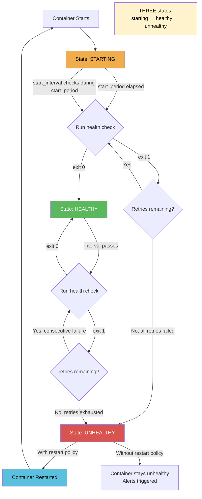
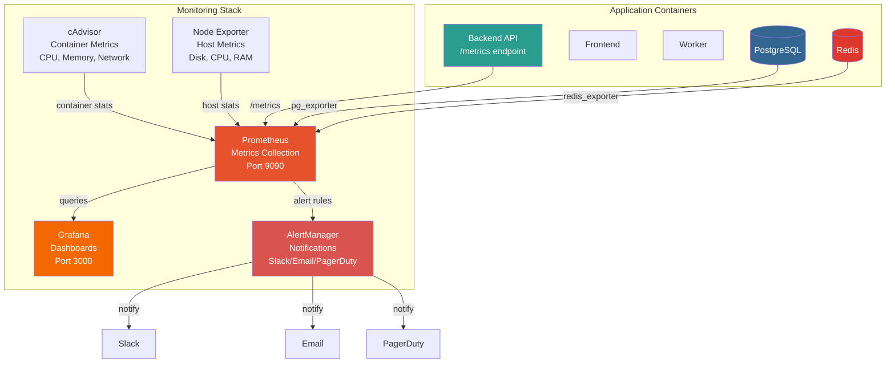

# File 24: Production Best Practices

**Topic:** Image Optimization, Health Checks, Logging, Restart Policies, Resource Limits, Monitoring

**WHY THIS MATTERS:**
Running Docker in development is forgiving — crashes just mean
"restart and try again." Production is a different world. Your
containers must self-heal, report their status, manage resources,
log properly, and be monitored 24/7. A single misconfiguration
can take down your entire platform at 3 AM. This file teaches
you the production hardening techniques used by companies running
thousands of containers in production.

**PRE-REQUISITES:** Files 01-23 (Docker fundamentals through databases)

---

## Story: Airport Operations

Think of Indira Gandhi International Airport in Delhi —
one of the busiest airports in Asia.

The **PRE-FLIGHT CHECKLIST** (HEALTHCHECK) is what every pilot must
complete before takeoff. Fuel levels, instruments, hydraulics —
if any check fails, the plane doesn't fly. Docker health checks
do the same: if your container fails its check, the orchestrator
replaces it with a healthy one.

The **BLACK BOX** (logging driver) records everything that happens
during a flight. After a crash, investigators read the black box
to understand what went wrong. Docker logging drivers send your
container logs to centralized systems (Elasticsearch, Fluentd,
CloudWatch) so you can investigate production issues.

**FUEL MANAGEMENT** (resource limits) prevents one aircraft from
hogging all the airport's fuel. Without limits, a memory-leaking
container can consume ALL host RAM and crash everything.
`--memory=512m` and `--cpus=1.0` are your fuel caps.

The **CONTROL TOWER** (monitoring — Prometheus + Grafana) watches
every aircraft on every runway. It knows which planes are taxiing,
which are airborne, which are delayed. Without it, you're flying
blind. Prometheus collects metrics, Grafana visualizes them.

**RESTART POLICIES** are like the airport's emergency protocols.
If a plane aborts takeoff (container crashes), the protocol says
whether to try again immediately, wait and retry, or ground the
aircraft permanently.

---

## Section 1 — Docker HEALTHCHECK Instruction

**WHY:** A running container isn't necessarily a WORKING container.
Your Node.js process might be running but the event loop is frozen.
Your Python app might be up but can't reach the database.
Health checks detect these silent failures.

### HEALTHCHECK Syntax and Options

```dockerfile
# SYNTAX in Dockerfile:
HEALTHCHECK [OPTIONS] CMD <command>
```

| Option | Default | Purpose |
|---|---|---|
| `--interval=30s` | 30s | Time between checks |
| `--timeout=30s` | 30s | Max time for check to complete |
| `--start-period=0s` | 0s | Grace period for container startup |
| `--start-interval=5s` | 5s | Check interval during start period |
| `--retries=3` | 3 | Consecutive failures before "unhealthy" |

**Exit Codes:** 0 = healthy, 1 = unhealthy, 2 = reserved (do not use)

### Health Check Examples by Application Type

```dockerfile
# HTTP API (Node.js / Python / Go):
HEALTHCHECK --interval=15s --timeout=5s --start-period=30s --retries=3 \
  CMD curl -f http://localhost:8000/health || exit 1

# Without curl (using wget — available in Alpine):
HEALTHCHECK --interval=15s --timeout=5s --retries=3 \
  CMD wget --no-verbose --tries=1 --spider http://localhost:8000/health || exit 1

# Without curl or wget (using Python):
HEALTHCHECK --interval=15s --timeout=5s --retries=3 \
  CMD python -c "import urllib.request; urllib.request.urlopen('http://localhost:8000/health')" || exit 1

# PostgreSQL:
HEALTHCHECK --interval=10s --timeout=5s --retries=5 \
  CMD pg_isready -U postgres -d myapp || exit 1

# Redis:
HEALTHCHECK --interval=10s --timeout=3s --retries=5 \
  CMD redis-cli ping | grep -q PONG || exit 1

# MongoDB:
HEALTHCHECK --interval=10s --timeout=5s --retries=5 \
  CMD mongosh --eval "db.adminCommand('ping')" || exit 1

# Nginx:
HEALTHCHECK --interval=15s --timeout=5s --retries=3 \
  CMD curl -f http://localhost/nginx-health || exit 1

# Disable health check (e.g., in docker-compose override):
HEALTHCHECK NONE
```

### Mermaid: Health Check State Machine



---

## Example Block 1 — Implementing a Health Endpoint

**WHY:** A proper /health endpoint checks all dependencies, not just
"is the process running." A deep health check verifies DB, cache,
disk space, and other critical components.

### Shallow Health Check (liveness)

Just confirms the process is responding. Fast, used by load balancers for routing.

`GET /health` -> `200 OK`

### Deep Health Check (readiness)

Checks all dependencies: DB, Redis, disk, external APIs. Slower, used for determining if service can accept traffic.

`GET /health/ready` -> `200 OK` or `503 Service Unavailable`

### Example: FastAPI health endpoint

```python
@app.get("/health")
async def health():
    return {"status": "ok"}

@app.get("/health/ready")
async def readiness():
    checks = {}
    try:
        await db.execute("SELECT 1")
        checks["database"] = "ok"
    except Exception as e:
        checks["database"] = str(e)

    try:
        await redis.ping()
        checks["cache"] = "ok"
    except Exception as e:
        checks["cache"] = str(e)

    all_ok = all(v == "ok" for v in checks.values())
    status_code = 200 if all_ok else 503
    return JSONResponse(
        {"status": "ok" if all_ok else "degraded", "checks": checks},
        status_code=status_code
    )
```

### Example: Express health endpoint

```javascript
app.get('/health', (req, res) => res.json({ status: 'ok' }));

app.get('/health/ready', async (req, res) => {
  const checks = {};
  try {
    await pool.query('SELECT 1');
    checks.database = 'ok';
  } catch (e) {
    checks.database = e.message;
  }
  const allOk = Object.values(checks).every(v => v === 'ok');
  res.status(allOk ? 200 : 503).json({
    status: allOk ? 'ok' : 'degraded', checks
  });
});
```

---

## Section 2 — Logging Drivers

**WHY:** By default, Docker stores logs as JSON files on the host.
In production with dozens of containers, you need centralized
logging so you can search, alert, and correlate across services.

**SYNTAX:** `docker run --log-driver=<DRIVER> --log-opt <KEY>=<VALUE>`

### 1. json-file (DEFAULT)

Stores logs as JSON on the Docker host filesystem.
Location: `/var/lib/docker/containers/<id>/<id>-json.log`

```bash
docker run -d \
  --log-driver=json-file \
  --log-opt max-size=10m \
  --log-opt max-file=5 \
  --log-opt compress=true \
  myapp:latest
```

| Flag | Purpose |
|---|---|
| `max-size=10m` | Rotate log file at 10MB (CRITICAL! Without this, logs grow forever) |
| `max-file=5` | Keep 5 rotated files (total: 50MB max) |
| `compress=true` | Gzip rotated files to save space |

> **WARNING:** Without max-size, Docker logs grow UNBOUNDED. A busy API can generate 1GB/day of logs. This WILL fill your disk and crash the host. ALWAYS set max-size in production.

### 2. fluentd

Ships logs to Fluentd (part of the EFK stack).

```bash
docker run -d \
  --log-driver=fluentd \
  --log-opt fluentd-address=localhost:24224 \
  --log-opt tag="myapp.{{.Name}}" \
  --log-opt fluentd-async=true \
  myapp:latest
```

### 3. syslog

Ships logs to syslog daemon (traditional Linux logging).

```bash
docker run -d \
  --log-driver=syslog \
  --log-opt syslog-address=udp://logs.example.com:514 \
  --log-opt syslog-facility=local0 \
  --log-opt tag="myapp" \
  myapp:latest
```

### 4. awslogs (AWS CloudWatch)

```bash
docker run -d \
  --log-driver=awslogs \
  --log-opt awslogs-region=ap-south-1 \
  --log-opt awslogs-group=/ecs/myapp \
  --log-opt awslogs-stream-prefix=prod \
  myapp:latest
```

### 5. local

Optimized version of json-file. Uses internal binary format. Faster, smaller, but not readable as raw files.

```bash
docker run -d \
  --log-driver=local \
  --log-opt max-size=10m \
  --log-opt max-file=5 \
  myapp:latest
```

### Set default logging for ALL containers

Edit `/etc/docker/daemon.json`:

```json
{
  "log-driver": "json-file",
  "log-opts": {
    "max-size": "10m",
    "max-file": "5"
  }
}
```

### Docker Compose logging

```yaml
services:
  backend:
    image: myapp:latest
    logging:
      driver: json-file
      options:
        max-size: "10m"
        max-file: "5"
```

---

## Section 3 — Restart Policies

**WHY:** Containers crash. Networks fail. OOM kills happen.
Restart policies define how Docker responds to failures.

**SYNTAX:** `docker run --restart=<POLICY>`

### 1. no (default)

```bash
docker run --restart=no myapp
```
Container stays stopped after exit. Manual restart needed.
**USE:** One-off tasks, migrations, batch jobs.

### 2. on-failure[:max-retries]

```bash
docker run --restart=on-failure:5 myapp
```
Restarts ONLY if exit code is non-zero (error). Stops trying after 5 consecutive failures.
**USE:** Applications that might crash but shouldn't restart on clean exit.

### 3. always

```bash
docker run --restart=always myapp
```
Always restarts, regardless of exit code. Even restarts when Docker daemon restarts (server reboot).
**USE:** Critical services that must ALWAYS be running.
**CAUTION:** Even `docker stop` will restart (until you `docker rm`).

### 4. unless-stopped (RECOMMENDED for production)

```bash
docker run --restart=unless-stopped myapp
```
Like `always`, BUT does NOT restart if you manually stopped it. Survives Docker daemon restarts and server reboots.
**USE:** Most production services. Best default policy.

### Restart Policy Comparison

| POLICY | ON CRASH | ON `docker stop` | ON DAEMON RESTART |
|---|---|---|---|
| `no` | No | No | No |
| `on-failure:5` | Yes (5x) | No | No |
| `always` | Yes | Yes* | Yes |
| `unless-stopped` | Yes | No | Yes (if was running) |

\* `always` restarts even after `docker stop` if daemon restarts

### Docker Compose

```yaml
services:
  backend:
    restart: unless-stopped
  postgres:
    restart: unless-stopped
  redis:
    restart: unless-stopped
```

### With deploy (Swarm / newer compose)

```yaml
services:
  backend:
    deploy:
      restart_policy:
        condition: on-failure
        delay: 5s
        max_attempts: 3
        window: 120s
```

---

## Section 4 — Resource Limits

**WHY:** Without limits, one misbehaving container can consume all
host resources (CPU, RAM) and bring down everything else.

### Memory Limits

```bash
docker run -d \
  --memory=512m \
  --memory-swap=1g \
  --memory-reservation=256m \
  myapp:latest
```

| Flag | Purpose |
|---|---|
| `--memory=512m` | Hard limit. Container is OOM-killed if exceeded. |
| `--memory-swap=1g` | Total (RAM + swap). Set equal to --memory to disable swap. |
| `--memory-reservation=256m` | Soft limit. Docker tries to keep it under this. |
| `--oom-kill-disable` | Prevent OOM killer (DANGEROUS — can hang the host!) |

### CPU Limits

```bash
docker run -d \
  --cpus=1.5 \
  --cpu-shares=1024 \
  myapp:latest
```

| Flag | Purpose |
|---|---|
| `--cpus=1.5` | Limit to 1.5 CPU cores (can use parts of multiple cores) |
| `--cpu-shares=1024` | Relative weight (default 1024). Only matters under contention. |
| `--cpuset-cpus=0,1` | Pin to specific CPU cores (for NUMA optimization) |

### Docker Compose Resource Limits

```yaml
services:
  backend:
    deploy:
      resources:
        limits:
          cpus: "1.0"
          memory: 512M
        reservations:
          cpus: "0.25"
          memory: 128M
```

### Guidelines

| Service | RAM | CPUs |
|---|---|---|
| Web API | 256MB-1GB | 0.5-2 |
| Database | 1GB-8GB | 1-4 |
| Redis | 128MB-1GB | 0.5-1 |
| Worker | 256MB-2GB | 0.5-2 |
| ML inference | 2GB-16GB | 2-8 (or GPU) |

---

## Example Block 2 — Image Optimization

**WHY:** Smaller images = faster deployments, lower storage costs,
smaller attack surface, and faster auto-scaling.

### Image Optimization Techniques

**1. USE MULTI-STAGE BUILDS** (biggest impact)
Build stage: install compilers, build tools, ALL dependencies. Runtime stage: only copy the compiled output. Savings: 60-90% size reduction.

**2. USE SLIM BASE IMAGES**
- `python:3.12` (920MB) -> `python:3.12-slim` (150MB) -> save 770MB
- `node:20` (1.1GB) -> `node:20-alpine` (140MB) -> save 960MB

**3. MINIMIZE LAYERS** (combine RUN commands)

Bad:
```dockerfile
RUN apt-get update
RUN apt-get install -y curl
RUN apt-get install -y wget
RUN rm -rf /var/lib/apt/lists/*
```

Good:
```dockerfile
RUN apt-get update && \
    apt-get install -y --no-install-recommends curl wget && \
    rm -rf /var/lib/apt/lists/*
```

**4. CLEAN UP IN THE SAME LAYER**

Bad (cleanup is in a separate layer — space already used):
```dockerfile
RUN apt-get update && apt-get install -y gcc
RUN rm -rf /var/lib/apt/lists/*
```

Good (cleanup in same RUN = layer doesn't include cache):
```dockerfile
RUN apt-get update && apt-get install -y gcc && rm -rf /var/lib/apt/lists/*
```

**5. USE .dockerignore** — Exclude `.git`, `node_modules`, `__pycache__`, `.env`, test data. Can reduce build context from 500MB to 5MB.

**6. ORDER LAYERS BY CHANGE FREQUENCY** — Least-changing first (OS deps -> language deps -> app code). Each unchanged layer is cached.

**7. USE `--no-cache-dir` (pip) AND `npm ci --only=production`** — Don't ship package manager caches in the image.

### Checking Image Size and Layers

```bash
# List images with sizes
docker images --format "table {{.Repository}}\t{{.Tag}}\t{{.Size}}"
# Expected output:
# REPOSITORY   TAG      SIZE
# myapp        latest   185MB
# postgres     16       420MB
# redis        7        35MB

# Inspect layers (find what's eating space)
docker history myapp:latest --format "table {{.Size}}\t{{.CreatedBy}}"

# Analyze with dive (third-party tool)
# brew install dive  (or docker pull wagoodman/dive)
dive myapp:latest
# Interactive UI showing each layer's contents and wasted space
```

---

## Section 5 — Docker System Management

**WHY:** Docker accumulates unused images, stopped containers, and
dangling volumes over time. This eats disk space.

```bash
# Check disk usage
docker system df

# Expected output:
# TYPE            TOTAL    ACTIVE   SIZE      RECLAIMABLE
# Images          15       5        4.2GB     2.8GB (66%)
# Containers      8        3        120MB     85MB (70%)
# Local Volumes   12       6        1.5GB     800MB (53%)
# Build Cache     45       0        3.1GB     3.1GB

# Detailed breakdown:
docker system df -v

# Remove stopped containers, unused networks, dangling images, build cache
docker system prune
# Expected: "Total reclaimed space: 2.5GB"

# More aggressive: also remove unused images (not just dangling)
docker system prune -a
# WARNING: Removes ALL images not used by a running container

# Remove with volume cleanup too
docker system prune -a --volumes
# WARNING: This deletes unused volumes! Data loss possible!

# ── Selective cleanup ────────────────────────────────────

# Remove dangling images only (no tag, leftover from builds)
docker image prune

# Remove images older than 24 hours
docker image prune -a --filter "until=24h"

# Remove stopped containers
docker container prune

# Remove unused volumes (DANGEROUS — check first!)
docker volume ls   # List all volumes — check what's there
docker volume prune

# Remove unused networks
docker network prune

# ── Schedule cleanup (cron job) ──────────────────────────
# Add to crontab: crontab -e
# Run daily at 3 AM, prune images older than 7 days:
# 0 3 * * * docker image prune -a --filter "until=168h" --force >> /var/log/docker-prune.log 2>&1
```

---

## Example Block 3 — Prometheus + Grafana Monitoring Stack

**WHY:** You can't fix what you can't see. Monitoring tells you CPU,
memory, request rates, error rates, and response times in real-time.

```yaml
# docker-compose.monitoring.yml

version: "3.9"

services:
  # ── Prometheus (metrics collection) ────────────────────
  prometheus:
    image: prom/prometheus:latest
    ports:
      - "9090:9090"
    volumes:
      - ./monitoring/prometheus.yml:/etc/prometheus/prometheus.yml:ro
      - prometheus_data:/prometheus
    command:
      - '--config.file=/etc/prometheus/prometheus.yml'
      - '--storage.tsdb.path=/prometheus'
      - '--storage.tsdb.retention.time=30d'
      - '--web.enable-lifecycle'
    restart: unless-stopped
    networks:
      - monitoring

  # ── Grafana (visualization dashboards) ─────────────────
  grafana:
    image: grafana/grafana:latest
    ports:
      - "3001:3000"
    environment:
      GF_SECURITY_ADMIN_USER: admin
      GF_SECURITY_ADMIN_PASSWORD: ${GRAFANA_PASSWORD}
      GF_INSTALL_PLUGINS: grafana-clock-panel
    volumes:
      - grafana_data:/var/lib/grafana
      - ./monitoring/grafana/dashboards:/etc/grafana/provisioning/dashboards
      - ./monitoring/grafana/datasources:/etc/grafana/provisioning/datasources
    restart: unless-stopped
    depends_on:
      - prometheus
    networks:
      - monitoring

  # ── cAdvisor (container metrics) ───────────────────────
  cadvisor:
    image: gcr.io/cadvisor/cadvisor:latest
    ports:
      - "8080:8080"
    volumes:
      - /:/rootfs:ro
      - /var/run:/var/run:ro
      - /sys:/sys:ro
      - /var/lib/docker:/var/lib/docker:ro
    restart: unless-stopped
    networks:
      - monitoring

  # ── Node Exporter (host metrics) ───────────────────────
  node-exporter:
    image: prom/node-exporter:latest
    ports:
      - "9100:9100"
    volumes:
      - /proc:/host/proc:ro
      - /sys:/host/sys:ro
      - /:/rootfs:ro
    command:
      - '--path.procfs=/host/proc'
      - '--path.rootfs=/rootfs'
      - '--path.sysfs=/host/sys'
    restart: unless-stopped
    networks:
      - monitoring

networks:
  monitoring:
    driver: bridge

volumes:
  prometheus_data:
  grafana_data:
```

### Mermaid: Production Monitoring Architecture



---

## Example Block 4 — Prometheus Configuration

**WHY:** Prometheus needs to know WHERE to scrape metrics from.

```yaml
# monitoring/prometheus.yml — Prometheus Configuration

global:
  scrape_interval: 15s        # How often to scrape metrics
  evaluation_interval: 15s    # How often to evaluate alert rules
  scrape_timeout: 10s         # Timeout for each scrape

# Alert rules
rule_files:
  - "alert_rules.yml"

# Alertmanager config
alerting:
  alertmanagers:
    - static_configs:
        - targets: ["alertmanager:9093"]

# Scrape targets
scrape_configs:
  # Prometheus monitors itself
  - job_name: "prometheus"
    static_configs:
      - targets: ["localhost:9090"]

  # Application metrics
  - job_name: "backend"
    metrics_path: /metrics
    static_configs:
      - targets: ["backend:8000"]

  # Container metrics from cAdvisor
  - job_name: "cadvisor"
    static_configs:
      - targets: ["cadvisor:8080"]

  # Host metrics from Node Exporter
  - job_name: "node"
    static_configs:
      - targets: ["node-exporter:9100"]

  # PostgreSQL metrics
  - job_name: "postgres"
    static_configs:
      - targets: ["postgres-exporter:9187"]

  # Redis metrics
  - job_name: "redis"
    static_configs:
      - targets: ["redis-exporter:9121"]
```

### Example Alert Rules (alert_rules.yml)

```yaml
groups:
  - name: container_alerts
    rules:
      - alert: HighCPUUsage
        expr: rate(container_cpu_usage_seconds_total[5m]) > 0.8
        for: 5m
        labels:
          severity: warning
        annotations:
          summary: "High CPU usage on {{ $labels.container }}"

      - alert: HighMemoryUsage
        expr: container_memory_usage_bytes / container_spec_memory_limit_bytes > 0.9
        for: 5m
        labels:
          severity: critical
        annotations:
          summary: "Container {{ $labels.container }} using >90% memory"

      - alert: ContainerDown
        expr: absent(container_last_seen{name=~"myapp.*"})
        for: 1m
        labels:
          severity: critical
        annotations:
          summary: "Container {{ $labels.name }} is down"
```

---

## Section 6 — Security Best Practices

**WHY:** Containers share the host kernel. A compromised container
with root access can potentially escape to the host.

### Security Best Practices Checklist

**1. RUN AS NON-ROOT USER**
```dockerfile
RUN groupadd -r appuser && useradd -r -g appuser appuser
USER appuser
```
If an attacker exploits your app, they get non-root access only.

**2. USE READ-ONLY ROOT FILESYSTEM**
```bash
docker run --read-only --tmpfs /tmp --tmpfs /var/run myapp
```
Prevents attackers from writing malicious files to disk. Use `--tmpfs` for directories that need write access.

**3. DROP ALL CAPABILITIES, ADD ONLY WHAT'S NEEDED**
```bash
docker run --cap-drop=ALL --cap-add=NET_BIND_SERVICE myapp
```
Linux capabilities give fine-grained root-like powers. Drop all, add back only what your app needs.

**4. NO NEW PRIVILEGES**
```bash
docker run --security-opt=no-new-privileges myapp
```
Prevents the process from gaining additional privileges via setuid.

**5. SCAN IMAGES FOR VULNERABILITIES**
```bash
docker scout cves myapp:latest
# Or: trivy image myapp:latest
# Or: snyk container test myapp:latest
```
Your dependencies might have known CVEs.

**6. USE SPECIFIC IMAGE TAGS (not :latest)**
```dockerfile
FROM python:3.12.3-slim-bookworm    # Good: pinned version
FROM python:latest                   # Bad: unpredictable
```

**7. DON'T STORE SECRETS IN IMAGES**
```dockerfile
# BAD:
ENV API_KEY=sk-12345
COPY .env /app/.env
# GOOD: Pass at runtime via -e, --env-file, or Docker secrets
```

**8. MINIMIZE INSTALLED PACKAGES**
```dockerfile
RUN apt-get install --no-install-recommends  # Only essential packages
```

**9. USE MULTI-STAGE BUILDS** — Build tools (gcc, make) stay in builder stage, not in production image.

**10. SIGN AND VERIFY IMAGES**
```bash
# docker trust sign myregistry/myapp:latest
# export DOCKER_CONTENT_TRUST=1    # Enable content trust globally
```

---

## Section 7 — Production Checklist

### IMAGE
- [ ] Multi-stage build used
- [ ] Slim or Alpine base image
- [ ] Specific version tag (not :latest)
- [ ] .dockerignore configured
- [ ] Image scanned for vulnerabilities
- [ ] Image size < 500MB (ideally < 200MB)

### SECURITY
- [ ] Running as non-root user (USER instruction)
- [ ] No secrets in image (no .env, no hardcoded keys)
- [ ] Read-only root filesystem where possible
- [ ] Capabilities dropped (--cap-drop=ALL)

### RELIABILITY
- [ ] HEALTHCHECK instruction in Dockerfile
- [ ] Restart policy: unless-stopped
- [ ] Resource limits set (memory + CPU)
- [ ] Graceful shutdown handling (SIGTERM)

### LOGGING
- [ ] Log driver configured with max-size rotation
- [ ] Application logs to stdout/stderr (not files)
- [ ] Structured logging (JSON format) for parsing

### MONITORING
- [ ] Prometheus metrics endpoint (/metrics)
- [ ] Grafana dashboards configured
- [ ] Alert rules for critical metrics
- [ ] Container metrics via cAdvisor

### NETWORKING
- [ ] Only necessary ports exposed
- [ ] Internal services not exposed to host
- [ ] TLS/SSL configured for public endpoints

### DATA
- [ ] Named volumes for persistent data
- [ ] Backup strategy implemented and tested
- [ ] Volume permissions set correctly

---

## Key Takeaways

1. **HEALTHCHECK is not optional.** A running process is not a working service. Check HTTP endpoints, DB connections, dependencies. Three states: starting -> healthy -> unhealthy.

2. **LOG ROTATION is critical.** Set `--log-opt max-size=10m` and `max-file=5`. Without this, logs will fill your disk. Default json-file driver is fine with rotation configured.

3. **RESTART POLICY `unless-stopped`** is the best default. Survives crashes AND server reboots. Respects manual stops.

4. **RESOURCE LIMITS** prevent one container from killing the host. Set `--memory` and `--cpus` for every production container. Without limits, an OOM in one container crashes everything.

5. **PROMETHEUS + GRAFANA + cAdvisor** is the standard monitoring stack. Prometheus scrapes metrics, Grafana visualizes, AlertManager notifies.

6. **`docker system df`** shows disk usage. **`docker system prune`** cleans up. Schedule regular pruning to prevent disk exhaustion.

7. **SECURITY:** Non-root user, no secrets in images, scan for CVEs, drop capabilities, use read-only filesystem.

8. **IMAGE OPTIMIZATION:** Multi-stage builds, slim bases, combined RUN commands, .dockerignore, --no-cache-dir, layer ordering.

9. **STRUCTURED LOGGING** (JSON) makes logs searchable and parseable. Always log to stdout/stderr, never to files inside containers.

10. **USE A CHECKLIST** before every production deployment. One missed item (like log rotation) can cause a 3 AM outage.
