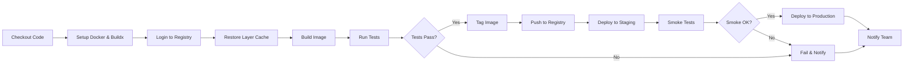
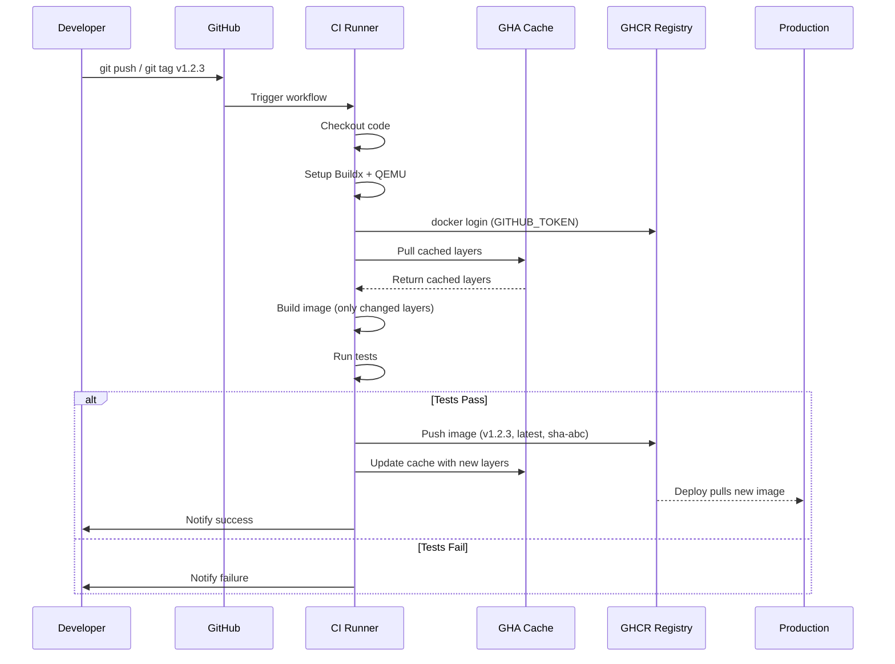

# File 25: Docker in CI/CD Pipelines

**Topic:** GitHub Actions, Layer Caching in CI, Registry Workflows, Tagging Strategies

**WHY THIS MATTERS:**
Building Docker images locally is just the beginning. In real teams,
every push to main should automatically build, test, and ship a
container image — without any human touching a terminal. CI/CD
with Docker turns your repository into a fully automated factory.
Understanding layer caching in CI, registry workflows, and tagging
strategies is the difference between a 2-minute pipeline and a
25-minute pipeline, between "which version is in production?" chaos
and crystal-clear release tracking.

**PRE-REQUISITES:**
- Files 01-24 (Docker basics through multi-stage builds)
- A GitHub account with Actions enabled
- Basic understanding of YAML syntax
- Familiarity with git branching and tagging

---

## Story: The Newspaper Printing Press

Imagine a large Indian newspaper office — say, "Dainik Jagran" or
"The Hindu". Every night, the day's news must go from reporters'
desks to millions of doorsteps by 6 AM.

1. **TYPESETTING** (Build) — Reporters write stories, editors arrange
   them on pages. This is your Docker build step: source code
   becomes a container image.

2. **PROOF READING** (Test) — Before the press rolls, proof readers
   check every page for errors. This is your automated test step:
   linting, unit tests, integration tests run inside containers.

3. **PLATE CACHING** (Layer Cache) — The printing press uses metal
   plates. If page 3 hasn't changed since yesterday, you reuse
   yesterday's plate instead of making a new one. This is Docker
   layer caching in CI — unchanged layers are pulled from cache,
   saving enormous time.

4. **DISTRIBUTION** (Push to Registry) — Printed newspapers are loaded
   onto trucks and sent to distributors across the country. This is
   pushing your image to Docker Hub, GHCR, or ECR so that your
   deployment systems can pull and run it.

The entire pipeline is AUTOMATED — no human wakes up at 2 AM to
run the press. Similarly, CI/CD runs your Docker pipeline on every
commit, automatically.

---

## Example Block 1 — Understanding the CI/CD Pipeline for Docker

### Section 1 — What Happens in a Docker CI/CD Pipeline

**WHY:** Before writing YAML, you must understand the flow.
Every Docker CI/CD pipeline follows the same fundamental stages.

A typical Docker CI/CD pipeline has these stages:

1. **CHECKOUT** — Clone the repository source code
2. **SETUP** — Install Docker, buildx, QEMU (for multi-platform)
3. **LOGIN** — Authenticate to container registry (Docker Hub, GHCR, ECR)
4. **CACHE** — Restore cached layers from previous builds
5. **BUILD** — Build the Docker image using Dockerfile
6. **TEST** — Run tests inside or against the built image
7. **TAG** — Apply version tags (semantic version, git SHA, latest)
8. **PUSH** — Push tagged image(s) to registry
9. **DEPLOY** — (Optional) Trigger deployment to staging/production
10. **NOTIFY** — (Optional) Slack/email notification of success/failure

### Mermaid: CI/CD Pipeline Stages



Like the newspaper: Typeset -> Proofread -> Cache plates -> Print -> Distribute.
Each stage depends on the previous one. If proofreading fails, the
press does NOT roll.

---

## Example Block 2 — GitHub Actions: Basic Docker Build & Push

### Section 2 — The docker/build-push-action

**WHY:** GitHub Actions is the most popular CI system for open source
and many enterprises. The docker/build-push-action is the official
way to build and push Docker images in GitHub Actions.

File: `.github/workflows/docker-publish.yml`

```yaml
name: Build and Push Docker Image

on:
  push:
    branches: [ main ]
    tags: [ 'v*.*.*' ]          # Trigger on semantic version tags
  pull_request:
    branches: [ main ]          # Build (but don't push) on PRs

env:
  REGISTRY: ghcr.io
  IMAGE_NAME: ${{ github.repository }}

jobs:
  build-and-push:
    runs-on: ubuntu-latest
    permissions:
      contents: read
      packages: write           # Needed for GHCR push

    steps:
      # STEP 1 — Checkout source code
      - name: Checkout repository
        uses: actions/checkout@v4

      # STEP 2 — Set up Docker Buildx (required for advanced features)
      - name: Set up Docker Buildx
        uses: docker/setup-buildx-action@v3
        # WHY: Buildx enables multi-platform builds, cache export,
        #       and other advanced build features not in basic docker build.

      # STEP 3 — Login to container registry
      - name: Log in to GHCR
        if: github.event_name != 'pull_request'
        uses: docker/login-action@v3
        with:
          registry: ghcr.io
          username: ${{ github.actor }}
          password: ${{ secrets.GITHUB_TOKEN }}
        # WHY: Pull requests should NOT push images — they only build & test.
        #       The "if" condition prevents login (and thus push) on PRs.

      # STEP 4 — Extract metadata for tags and labels
      - name: Extract Docker metadata
        id: meta
        uses: docker/metadata-action@v5
        with:
          images: ghcr.io/${{ github.repository }}
          tags: |
            type=ref,event=branch
            type=ref,event=pr
            type=semver,pattern={{version}}
            type=semver,pattern={{major}}.{{minor}}
            type=sha

      # STEP 5 — Build and push
      - name: Build and push Docker image
        uses: docker/build-push-action@v5
        with:
          context: .
          push: ${{ github.event_name != 'pull_request' }}
          tags: ${{ steps.meta.outputs.tags }}
          labels: ${{ steps.meta.outputs.labels }}
          cache-from: type=gha
          cache-to: type=gha,mode=max
```

Expected output (in GitHub Actions log):

```
#1 [internal] load build definition from Dockerfile
#2 [internal] load .dockerignore
#3 [internal] load metadata for docker.io/library/node:20-alpine
#4 [1/5] FROM docker.io/library/node:20-alpine@sha256:abc...
#4 CACHED
#5 [2/5] WORKDIR /app
#5 CACHED
#6 [3/5] COPY package*.json ./
#7 [4/5] RUN npm ci --only=production
#8 [5/5] COPY . .
#9 exporting to image
#10 pushing manifest for ghcr.io/myorg/myapp:main
```

---

### Section 3 — Key Actions Explained

**WHY:** Each action in the workflow has a specific purpose.
Understanding them prevents "cargo cult" YAML copying.

| ACTION | PURPOSE |
|---|---|
| `actions/checkout@v4` | Clone your repo into the runner |
| `docker/setup-buildx-action@v3` | Install Docker Buildx builder |
| `docker/setup-qemu-action@v3` | Install QEMU for multi-platform builds |
| `docker/login-action@v3` | Authenticate to any container registry |
| `docker/metadata-action@v5` | Auto-generate tags and OCI labels |
| `docker/build-push-action@v5` | Build image and optionally push |

**Important flags for build-push-action:**

| Flag | Purpose |
|---|---|
| `context: .` | Build context (usually repo root) |
| `file: ./Dockerfile` | Path to Dockerfile (default: ./Dockerfile) |
| `push: true/false` | Whether to push after building |
| `tags: ...` | Image tags to apply |
| `labels: ...` | OCI labels (maintainer, version, etc.) |
| `platforms: linux/amd64,linux/arm64` | Target platforms |
| `cache-from: type=gha` | Pull cache from GitHub Actions cache |
| `cache-to: type=gha,mode=max` | Push ALL layers to cache (not just final) |
| `build-args: \|` | Build arguments |
| `target: production` | Multi-stage build target |

---

## Example Block 3 — Layer Caching in CI

### Section 4 — Why Caching Matters in CI

**WHY:** CI runners are ephemeral — they start fresh every time.
Without caching, every build downloads base images and reinstalls
dependencies from scratch. A 2-minute build becomes 15 minutes.
Like the newspaper analogy: without plate caching, every night you
re-engrave plates for every page — even the ones that didn't change.

**PROBLEM:** CI runners are ephemeral (destroyed after each job).
There is no local Docker layer cache between runs.

**SOLUTION:** External cache backends that persist between runs.

### Cache Types

| TYPE | SYNTAX | WHERE STORED |
|---|---|---|
| GHA | `cache-from: type=gha` / `cache-to: type=gha,mode=max` | GitHub Actions Cache (10 GB limit) |
| Registry | `cache-from: type=registry,ref=myapp:buildcache` / `cache-to: type=registry,ref=myapp:buildcache,mode=max` | Container registry (no size limit, but storage costs) |
| Local | `cache-from: type=local,src=/tmp/.buildx-cache` / `cache-to: type=local,dest=/tmp/.buildx-cache-new` | Local directory on runner (lost when runner dies) |
| Inline | `cache-to: type=inline` | Embedded in pushed image (only caches final stage) |

**IMPORTANT: `mode=max` vs `mode=min`**
- `mode=min` — Only cache layers in the final stage (default)
- `mode=max` — Cache ALL layers from ALL stages (recommended)

Think of it like this: `mode=min` saves only the final printed page.
`mode=max` saves every intermediate plate, so if ANY stage is unchanged,
it's cached. ALWAYS use `mode=max` in CI.

---

### Section 5 — GHA Cache Example (Recommended)

```yaml
      - name: Build and push
        uses: docker/build-push-action@v5
        with:
          context: .
          push: true
          tags: ghcr.io/myorg/myapp:latest
          cache-from: type=gha
          cache-to: type=gha,mode=max
```

**How it works:**
1. First build: No cache exists. Full build from scratch. All layers are saved to GitHub Actions cache.
2. Second build: Buildx checks GHA cache for matching layers. Unchanged layers are pulled from cache — NOT rebuilt.
3. Result: Only changed layers are rebuilt.

**Typical time savings:**
- Without cache: 8-12 minutes (npm install, apt-get, etc.)
- With cache: 1-3 minutes (only changed app code rebuilt)

**Limitation:** GitHub Actions cache has a 10 GB limit per repository. For large monorepos, consider registry cache instead.

---

### Section 6 — Registry Cache Example

```yaml
      - name: Build and push
        uses: docker/build-push-action@v5
        with:
          context: .
          push: true
          tags: ghcr.io/myorg/myapp:latest
          cache-from: type=registry,ref=ghcr.io/myorg/myapp:buildcache
          cache-to: type=registry,ref=ghcr.io/myorg/myapp:buildcache,mode=max
```

**How it works:**
1. Cache layers are stored as a special image in your registry.
2. The "buildcache" tag is NOT a runnable image — it's a cache manifest.
3. Buildx pulls matching layers from this cache image before building.
4. After build, updated cache layers are pushed back.

**Advantages over GHA cache:**
- No 10 GB limit (limited only by registry storage)
- Shared across all CI systems (not just GitHub Actions)
- Can be used from any machine (local dev too!)

**Disadvantage:**
- Registry storage costs (especially on Docker Hub free tier)
- Slightly slower than GHA cache for GitHub Actions specifically

---

## Example Block 4 — Tagging Strategies

### Section 7 — Why Tagging Matters

**WHY:** Tags are how you answer "which version is running in production?"
Bad tagging = chaos. Good tagging = instant rollback capability.

**ANTI-PATTERN:** Using only "latest"
```bash
docker push myapp:latest    # Which commit? When was it built? WHO KNOWS.
```

**RECOMMENDED:** Multiple tags per image. Every image should have AT LEAST:
1. Semantic version tag (v1.2.3)
2. Git SHA tag (sha-a1b2c3d)
3. Branch tag (main, develop)
4. "latest" tag (convenience only)

### Tagging Strategy Table

| TAG FORMAT | EXAMPLE | WHEN TO USE |
|---|---|---|
| latest | `myapp:latest` | Always points to newest main build |
| semver full | `myapp:1.2.3` | Immutable release version |
| semver major.minor | `myapp:1.2` | Floating — latest patch of 1.2.x |
| semver major | `myapp:1` | Floating — latest of 1.x.x |
| git SHA | `myapp:sha-a1b2c3d` | Immutable — exact commit |
| branch | `myapp:main` | Current state of branch |
| PR number | `myapp:pr-42` | Preview of pull request |
| timestamp | `myapp:20240115` | Date-based release |

### Metadata Action generates these automatically

```yaml
      - name: Extract metadata
        uses: docker/metadata-action@v5
        with:
          images: ghcr.io/myorg/myapp
          tags: |
            type=ref,event=branch
            type=ref,event=pr
            type=semver,pattern={{version}}
            type=semver,pattern={{major}}.{{minor}}
            type=semver,pattern={{major}}
            type=sha,prefix=sha-
            type=raw,value=latest,enable={{is_default_branch}}
```

Result for tag "v1.2.3" on main branch:
```
ghcr.io/myorg/myapp:1.2.3
ghcr.io/myorg/myapp:1.2
ghcr.io/myorg/myapp:1
ghcr.io/myorg/myapp:sha-a1b2c3d
ghcr.io/myorg/myapp:main
ghcr.io/myorg/myapp:latest
```

---

## Example Block 5 — Multi-Platform Builds in CI

### Section 8 — Building for Multiple Architectures

**WHY:** Your CI runner is x86_64 (amd64), but your production might
include ARM servers (AWS Graviton), Raspberry Pis, or Apple Silicon
Macs. Multi-platform builds create one image manifest that works
on ALL specified architectures.

**Step 1:** Set up QEMU (for cross-platform emulation)

```yaml
      - name: Set up QEMU
        uses: docker/setup-qemu-action@v3
        # WHY: QEMU lets your x86 runner emulate ARM instructions.
        #       Without it, you can only build for the runner's native arch.
```

**Step 2:** Set up Buildx with multi-platform support

```yaml
      - name: Set up Docker Buildx
        uses: docker/setup-buildx-action@v3
```

**Step 3:** Build with --platform flag

```yaml
      - name: Build and push multi-platform
        uses: docker/build-push-action@v5
        with:
          context: .
          platforms: linux/amd64,linux/arm64
          push: true
          tags: ghcr.io/myorg/myapp:latest
```

Command line equivalent:

```bash
docker buildx build \
  --platform linux/amd64,linux/arm64 \
  --tag ghcr.io/myorg/myapp:latest \
  --push .
```

**What happens:**
1. Buildx builds the image TWICE — once for amd64, once for arm64.
2. Both images are pushed to the registry.
3. A MANIFEST LIST is created that maps each platform to its image.
4. When someone does `docker pull myapp:latest`, Docker automatically pulls the correct image for their platform.

**Performance note:** ARM builds on x86 via QEMU are 3-5x slower than native. For faster builds, use native ARM runners (GitHub now offers them) or split the build into separate jobs per platform.

---

## Example Block 6 — Registry Workflows

### Section 9 — Docker Hub, GHCR, and ECR

**WHY:** Different registries serve different needs. Docker Hub is the
default public registry. GHCR integrates tightly with GitHub. ECR
is for AWS deployments.

### 1. Docker Hub

```yaml
   - name: Login to Docker Hub
     uses: docker/login-action@v3
     with:
       username: ${{ secrets.DOCKERHUB_USERNAME }}
       password: ${{ secrets.DOCKERHUB_TOKEN }}
   # NOTE: Use access tokens, NOT your password.
   # Create at: https://hub.docker.com/settings/security
```

Image tag format: `docker.io/username/myapp:tag` (or just `username/myapp:tag`)

### 2. GitHub Container Registry (GHCR)

```yaml
   - name: Login to GHCR
     uses: docker/login-action@v3
     with:
       registry: ghcr.io
       username: ${{ github.actor }}
       password: ${{ secrets.GITHUB_TOKEN }}
   # NOTE: GITHUB_TOKEN is automatic — no secret setup needed!
   #       Just add "packages: write" permission to the job.
```

Image tag format: `ghcr.io/owner/myapp:tag`

### 3. AWS Elastic Container Registry (ECR)

```yaml
   - name: Configure AWS credentials
     uses: aws-actions/configure-aws-credentials@v4
     with:
       aws-access-key-id: ${{ secrets.AWS_ACCESS_KEY_ID }}
       aws-secret-access-key: ${{ secrets.AWS_SECRET_ACCESS_KEY }}
       aws-region: ap-south-1
   - name: Login to ECR
     uses: aws-actions/amazon-ecr-login@v2
```

Image tag format: `123456789.dkr.ecr.ap-south-1.amazonaws.com/myapp:tag`

### Comparison

| FEATURE | DOCKER HUB | GHCR | ECR |
|---|---|---|---|
| Free tier | 1 private repo | Unlimited | 500 MB/month |
| Public images | Unlimited | Unlimited | N/A |
| Rate limits | 100 pulls/6hr | Very generous | None |
| Auth | Access token | GITHUB_TOKEN | IAM/OIDC |
| Best for | Open source | GitHub projects | AWS deploys |

---

## Example Block 7 — Complete Production Workflow

### Section 10 — Full Production-Ready Workflow

**WHY:** Combining all the pieces into one workflow that handles
PR builds, main builds, and release builds with proper caching.

```yaml
name: Docker CI/CD

on:
  push:
    branches: [ main, develop ]
    tags: [ 'v*.*.*' ]
  pull_request:
    branches: [ main ]

env:
  REGISTRY: ghcr.io
  IMAGE_NAME: ${{ github.repository }}

jobs:
  # ──────────────────────────────────────────────────────
  # JOB 1: Lint and unit test (no Docker needed)
  # ──────────────────────────────────────────────────────
  test:
    runs-on: ubuntu-latest
    steps:
      - uses: actions/checkout@v4
      - uses: actions/setup-node@v4
        with: { node-version: '20' }
      - run: npm ci
      - run: npm run lint
      - run: npm test

  # ──────────────────────────────────────────────────────
  # JOB 2: Build, test in container, push
  # ──────────────────────────────────────────────────────
  build-and-push:
    needs: test                  # Only build if tests pass
    runs-on: ubuntu-latest
    permissions:
      contents: read
      packages: write

    steps:
      - name: Checkout
        uses: actions/checkout@v4

      - name: Set up QEMU
        uses: docker/setup-qemu-action@v3

      - name: Set up Docker Buildx
        uses: docker/setup-buildx-action@v3

      - name: Login to GHCR
        if: github.event_name != 'pull_request'
        uses: docker/login-action@v3
        with:
          registry: ghcr.io
          username: ${{ github.actor }}
          password: ${{ secrets.GITHUB_TOKEN }}

      - name: Extract metadata
        id: meta
        uses: docker/metadata-action@v5
        with:
          images: ${{ env.REGISTRY }}/${{ env.IMAGE_NAME }}
          tags: |
            type=ref,event=branch
            type=ref,event=pr
            type=semver,pattern={{version}}
            type=semver,pattern={{major}}.{{minor}}
            type=sha,prefix=sha-
            type=raw,value=latest,enable={{is_default_branch}}

      - name: Build and push
        uses: docker/build-push-action@v5
        with:
          context: .
          platforms: linux/amd64,linux/arm64
          push: ${{ github.event_name != 'pull_request' }}
          tags: ${{ steps.meta.outputs.tags }}
          labels: ${{ steps.meta.outputs.labels }}
          cache-from: type=gha
          cache-to: type=gha,mode=max

      # Container-based integration test
      - name: Integration test
        if: github.event_name == 'pull_request'
        run: |
          docker buildx build --load -t myapp:test .
          docker run --rm myapp:test npm run test:integration
```

### Mermaid: Build and Push Sequence



This is the newspaper analogy in action:
- Developer = Reporter filing a story
- Runner = The printing press
- Cache = Reusable metal plates
- Registry = Distribution warehouse
- K8s = Newspaper delivery trucks

---

## Example Block 8 — Advanced CI Patterns

### Section 11 — Build Matrix for Multiple Services

**WHY:** In a monorepo with multiple services, you need to build each
service independently, ideally in parallel.

```yaml
jobs:
  build:
    strategy:
      matrix:
        service: [api, web, worker, scheduler]
    runs-on: ubuntu-latest
    steps:
      - uses: actions/checkout@v4
      - uses: docker/setup-buildx-action@v3
      - uses: docker/login-action@v3
        with:
          registry: ghcr.io
          username: ${{ github.actor }}
          password: ${{ secrets.GITHUB_TOKEN }}
      - uses: docker/build-push-action@v5
        with:
          context: ./services/${{ matrix.service }}
          push: true
          tags: ghcr.io/myorg/${{ matrix.service }}:latest
          cache-from: type=gha,scope=${{ matrix.service }}
          cache-to: type=gha,scope=${{ matrix.service }},mode=max
```

**KEY DETAIL: `scope` parameter** — Each service gets its OWN cache scope, so caches don't collide. Without scope, the api service's cache would overwrite the web cache.

---

### Section 12 — Conditional Builds (Only Changed Services)

```yaml
# Use dorny/paths-filter to detect which services changed:

jobs:
  detect-changes:
    runs-on: ubuntu-latest
    outputs:
      api: ${{ steps.filter.outputs.api }}
      web: ${{ steps.filter.outputs.web }}
    steps:
      - uses: actions/checkout@v4
      - uses: dorny/paths-filter@v3
        id: filter
        with:
          filters: |
            api:
              - 'services/api/**'
            web:
              - 'services/web/**'

  build-api:
    needs: detect-changes
    if: needs.detect-changes.outputs.api == 'true'
    runs-on: ubuntu-latest
    steps:
      - # ... build api service only

  build-web:
    needs: detect-changes
    if: needs.detect-changes.outputs.web == 'true'
    runs-on: ubuntu-latest
    steps:
      - # ... build web service only
```

**BENEFIT:** If you only changed the API, the web service is NOT rebuilt. Saves CI minutes and speeds up the pipeline.

---

### Section 13 — Security Scanning in CI

```yaml
      - name: Build image for scanning
        uses: docker/build-push-action@v5
        with:
          context: .
          load: true           # Load into local Docker (don't push yet)
          tags: myapp:scan

      - name: Run Trivy vulnerability scanner
        uses: aquasecurity/trivy-action@master
        with:
          image-ref: myapp:scan
          format: table
          exit-code: 1         # Fail the pipeline on HIGH/CRITICAL vulns
          severity: HIGH,CRITICAL

      - name: Run Snyk container scan
        uses: snyk/actions/docker@master
        with:
          image: myapp:scan
          args: --severity-threshold=high
```

Expected output:

```
myapp:scan (alpine 3.19.1)
Total: 0 (HIGH: 0, CRITICAL: 0)
```

Or (if vulnerabilities found):

```
Total: 3 (HIGH: 2, CRITICAL: 1)
| curl    | CVE-2024-1234 | CRITICAL | 8.4.0-r0 | 8.5.0-r0 |
Pipeline FAILS with exit code 1
```

---

## Example Block 9 — Environment-Specific Deployments

### Section 14 — Promotion-Based Deployment

**WHY:** Instead of building different images for staging and production,
build ONCE and PROMOTE the same image across environments.

**Build ONCE, deploy EVERYWHERE:**

1. PR merged to main: Build -> Tag as "main" and "sha-abc123" -> Push to GHCR
2. Deploy to staging: Pull "sha-abc123" -> Deploy to staging cluster -> Run smoke tests
3. Promote to production: Re-tag "sha-abc123" as "v1.2.3" and "latest" -> Deploy to production cluster

Commands for promotion (no rebuild needed!):

```bash
# Pull the tested image
docker pull ghcr.io/myorg/myapp:sha-abc123

# Re-tag for production
docker tag ghcr.io/myorg/myapp:sha-abc123 ghcr.io/myorg/myapp:v1.2.3
docker tag ghcr.io/myorg/myapp:sha-abc123 ghcr.io/myorg/myapp:latest

# Push new tags (same image digest, just new tags)
docker push ghcr.io/myorg/myapp:v1.2.3
docker push ghcr.io/myorg/myapp:latest
```

**WHY THIS IS IMPORTANT:**
The image in production is EXACTLY the same bits that were tested.
No "it worked in staging but broke in prod" because of a rebuild.
Same image, same layers, same digest — just different tags.

---

## Key Takeaways

1. **AUTOMATE EVERYTHING:** Every git push should trigger build + test + push. Like the newspaper press — it runs automatically, every night.

2. **CACHE AGGRESSIVELY:** Use `type=gha` or `type=registry` with `mode=max`. Without caching, CI builds are painfully slow. With caching, only changed layers are rebuilt — just like reusing printing plates.

3. **TAG STRATEGICALLY:** Use multiple tags per image — semver, SHA, branch. Never rely on "latest" alone. You need to answer "what exact commit is running in production?" at 3 AM when something breaks.

4. **MULTI-PLATFORM:** Use QEMU + Buildx to build for amd64 and arm64. One manifest, multiple architectures — pull once, runs anywhere.

5. **BUILD ONCE, PROMOTE:** Don't rebuild for each environment. Build once, test, then promote the exact same image to production.

6. **SCAN FOR VULNERABILITIES:** Add Trivy or Snyk to your pipeline. Catch CVEs before they reach production.

7. **PR BUILDS DON'T PUSH:** Build and test on PRs, but only push images from main/tagged commits.

**Newspaper Analogy Summary:**
- Typesetting (Build) -> docker/build-push-action
- Proofreading (Test) -> Container-based test step
- Plate Caching (Cache) -> cache-from: type=gha
- Distribution (Push) -> Push to GHCR/Docker Hub/ECR
- Edition Numbers (Tags) -> Semantic versioning + SHA tags
