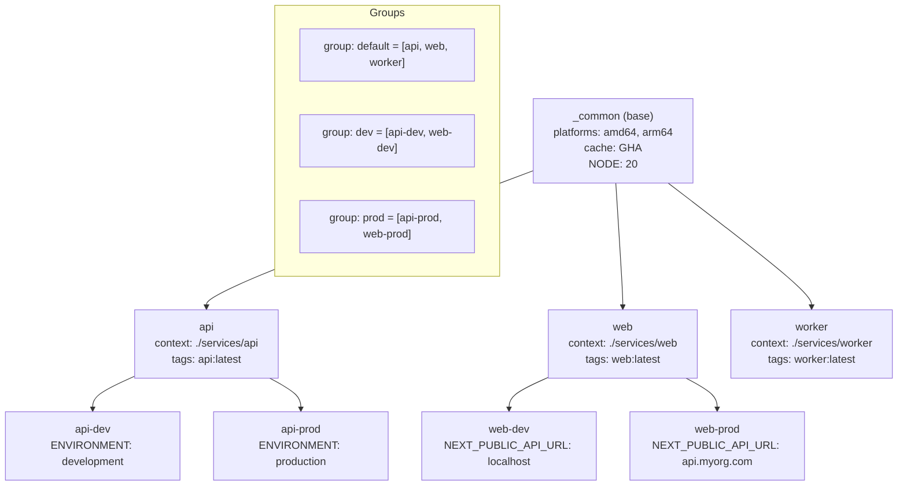
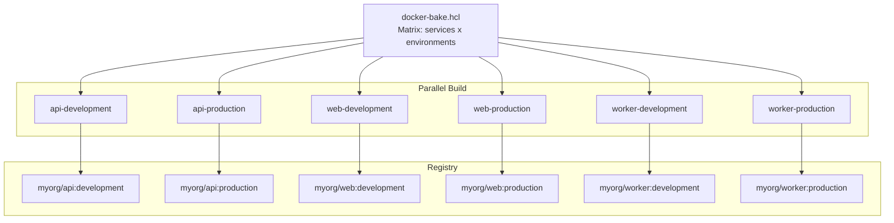

# File 26: Docker Bake and Advanced Builds

**Topic:** Bake (HCL/JSON/YAML), Build Matrix, Build Arguments Matrix, CI Integration with Bake

**WHY THIS MATTERS:**
When your project grows beyond a single Dockerfile, managing builds
becomes a nightmare. You might have 5 services, each needing builds
for 3 environments (dev, staging, prod), across 2 platforms (amd64,
arm64). That's 30 build commands. Docker Bake lets you define ALL
of these builds in a single file and run them with one command.
Think of it as a "Makefile for Docker builds" — but much more powerful.

**PRE-REQUISITES:**
- Files 01-25 (Docker basics through CI/CD)
- Docker Buildx installed (comes with Docker Desktop)
- Understanding of multi-stage Dockerfiles
- Basic familiarity with HCL syntax (similar to Terraform)

---

## Story: The Mithai (Sweet) Shop for Festivals

Picture a famous mithai (Indian sweets) shop in Chandni Chowk,
Old Delhi, during Diwali season. The shop makes hundreds of
varieties of sweets in massive quantities.

1. **RECIPE CARD** (Bake File) — The head halwai (sweet maker) has a
   master recipe book. Each page lists one sweet: ingredients,
   proportions, cooking method. The bake file (`docker-bake.hcl`) is
   this recipe book — it defines every build target, its Dockerfile,
   build args, tags, and platforms.

2. **BULK ORDER** (Group Builds) — During Diwali, a corporate client
   orders 10 different sweets. Instead of placing 10 separate orders,
   they place ONE bulk order. A "group" in Bake is this bulk order —
   one command builds multiple targets.

3. **DIFFERENT SIZES/FLAVORS** (Matrix) — Kaju katli comes in 250g,
   500g, and 1kg boxes. Gulab jamun comes in sugar syrup, rose
   syrup, and saffron syrup. The build matrix is like this variety —
   same base recipe, different sizes/flavors (platforms/args).

4. **ASSEMBLY LINE** (Parallel Builds) — The shop has multiple stoves,
   multiple halwais working simultaneously. Bake builds targets in
   parallel when they don't depend on each other — just like the
   assembly line in the mithai shop.

---

## Example Block 1 — What is Docker Bake?

### Section 1 — Introduction to Docker Bake

**WHY:** `docker build` can only build ONE target at a time. In a
monorepo with multiple services, you end up writing long shell
scripts or Makefiles. Bake replaces all of that with a declarative
configuration file.

### Overview

`docker buildx bake` is a high-level build orchestrator.
It reads a configuration file that defines multiple build targets
and executes them — potentially in parallel.

### Command Syntax

```bash
docker buildx bake [OPTIONS] [TARGET...]
```

| Option | Purpose |
|---|---|
| `-f, --file FILE` | Bake file (default: docker-bake.hcl, docker-bake.json, compose.yaml, docker-compose.yml) |
| `--print` | Print the resolved build config (dry run) |
| `--no-cache` | Do not use cache |
| `--push` | Push images after build |
| `--load` | Load images into local Docker |
| `--set TARGET.KEY=VALUE` | Override target values from CLI |
| `--progress plain` | Show full build output |

### Examples

```bash
docker buildx bake                    # Build all default targets
docker buildx bake api                # Build only the "api" target
docker buildx bake api web            # Build "api" and "web" targets
docker buildx bake --print            # Dry run — show resolved config
docker buildx bake --push             # Build and push all targets
```

### Supported File Formats

1. **HCL** (`docker-bake.hcl`) — Recommended. Most expressive.
2. **JSON** (`docker-bake.json`) — Machine-friendly.
3. **YAML** (`compose.yaml`) — Compose files work as bake files!

---

## Example Block 2 — HCL Bake File Syntax

### Section 2 — Basic Target Definition

**WHY:** A "target" is the fundamental unit in a bake file. It's like
one recipe card in the mithai shop's recipe book — it describes
exactly how to build one image.

### Single Target

```hcl
target "api" {
  context    = "./services/api"           // Build context path
  dockerfile = "Dockerfile"               // Dockerfile name
  tags       = ["myorg/api:latest"]       // Image tags
  platforms  = ["linux/amd64"]            // Target platforms
}
```

Equivalent docker build command:
```bash
docker build -t myorg/api:latest -f Dockerfile ./services/api
```

### Target with Build Args

```hcl
target "api" {
  context    = "./services/api"
  dockerfile = "Dockerfile"
  tags       = ["myorg/api:latest", "myorg/api:1.0.0"]
  platforms  = ["linux/amd64", "linux/arm64"]
  args = {
    NODE_ENV    = "production"
    APP_VERSION = "1.0.0"
  }
}
```

Equivalent docker build command:
```bash
docker buildx build \
  --platform linux/amd64,linux/arm64 \
  --build-arg NODE_ENV=production \
  --build-arg APP_VERSION=1.0.0 \
  -t myorg/api:latest \
  -t myorg/api:1.0.0 \
  ./services/api
```

### All Target Properties

```hcl
target "full-example" {
  context      = "."                        // Build context
  dockerfile   = "Dockerfile.prod"          // Custom Dockerfile
  tags         = ["myorg/app:v1"]           // Image tags
  platforms    = ["linux/amd64"]            // Build platforms
  args         = { NODE_ENV = "production" }// Build arguments
  labels       = { "maintainer" = "dev@myorg.com" } // OCI labels
  target       = "production"              // Multi-stage target
  cache-from   = ["type=gha"]             // Cache sources
  cache-to     = ["type=gha,mode=max"]    // Cache destinations
  output       = ["type=registry"]         // Output type
  pull         = true                      // Always pull base image
  no-cache     = false                     // Use cache (default)
  ssh          = []                        // SSH agent forwarding
  secret       = []                        // Build secrets
}
```

---

### Section 3 — Groups — Bulk Orders

**WHY:** Groups let you build multiple targets with one command.
Like the corporate Diwali order — one command, multiple sweets.

```hcl
// Define individual targets
target "api" {
  context = "./services/api"
  tags    = ["myorg/api:latest"]
}

target "web" {
  context = "./services/web"
  tags    = ["myorg/web:latest"]
}

target "worker" {
  context = "./services/worker"
  tags    = ["myorg/worker:latest"]
}

target "scheduler" {
  context = "./services/scheduler"
  tags    = ["myorg/scheduler:latest"]
}

// Group them together
group "default" {
  targets = ["api", "web", "worker", "scheduler"]
}

// "default" group is built when you run:
//   docker buildx bake
// (no target name needed — "default" is automatic)

group "backend" {
  targets = ["api", "worker", "scheduler"]
}

group "frontend" {
  targets = ["web"]
}
```

```bash
# Build only backend services:
docker buildx bake backend

# Build only frontend:
docker buildx bake frontend

# Build everything:
docker buildx bake           # (uses "default" group)
```

---

## Example Block 3 — Variable Interpolation

### Section 4 — Variables and Functions

**WHY:** Variables let you avoid repeating values across targets.
Like the mithai shop's "base sugar syrup" recipe that's shared
across rasgulla, gulab jamun, and chamcham.

### Variables

```hcl
variable "REGISTRY" {
  default = "ghcr.io/myorg"
}

variable "TAG" {
  default = "latest"
}

variable "NODE_VERSION" {
  default = "20"
}

target "api" {
  context = "./services/api"
  tags    = ["${REGISTRY}/api:${TAG}"]
  args = {
    NODE_VERSION = NODE_VERSION
  }
}

target "web" {
  context = "./services/web"
  tags    = ["${REGISTRY}/web:${TAG}"]
  args = {
    NODE_VERSION = NODE_VERSION
  }
}
```

Override variables from CLI:
```bash
TAG=v1.2.3 docker buildx bake
REGISTRY=docker.io/myuser TAG=v2.0.0 docker buildx bake
```

Override variables with `--set`:
```bash
docker buildx bake --set api.tags=myorg/api:dev
```

### Built-in Functions

```hcl
variable "TAG" {
  default = "latest"
}

function "tag" {
  params = [service]
  result = [
    "ghcr.io/myorg/${service}:${TAG}",
    "ghcr.io/myorg/${service}:latest",
  ]
}

target "api" {
  context = "./services/api"
  tags    = tag("api")         // Returns ["ghcr.io/myorg/api:v1.0.0", "ghcr.io/myorg/api:latest"]
}

target "web" {
  context = "./services/web"
  tags    = tag("web")
}
```

Result when `TAG=v1.0.0`:
- api -> `ghcr.io/myorg/api:v1.0.0`, `ghcr.io/myorg/api:latest`
- web -> `ghcr.io/myorg/web:v1.0.0`, `ghcr.io/myorg/web:latest`

---

## Example Block 4 — Target Inheritance

### Section 5 — Inherits — Sharing Common Config

**WHY:** When multiple targets share the same base config (same
platform, same cache settings), inheritance avoids duplication.
Like the mithai shop: all milk-based sweets share the same
"boil and reduce milk" base step.

```hcl
// Base target — never built directly, only inherited from
target "_common" {
  platforms  = ["linux/amd64", "linux/arm64"]
  cache-from = ["type=gha"]
  cache-to   = ["type=gha,mode=max"]
  args = {
    NODE_VERSION = "20"
    ENVIRONMENT  = "production"
  }
}

// API inherits from _common and adds its own config
target "api" {
  inherits = ["_common"]           // Inherit everything from _common
  context  = "./services/api"
  tags     = ["ghcr.io/myorg/api:latest"]
}

// Web inherits from _common and overrides some values
target "web" {
  inherits = ["_common"]
  context  = "./services/web"
  tags     = ["ghcr.io/myorg/web:latest"]
  args = {
    NODE_VERSION = "20"            // Inherited, but re-stated for clarity
    ENVIRONMENT  = "production"    // Inherited
    NEXT_PUBLIC_API_URL = "https://api.myorg.com"  // Added
  }
}

// CONVENTION: Prefix base targets with _ to indicate they're abstract.
//             The _ prefix is just a naming convention, not enforced.

// Multiple inheritance:
target "api-dev" {
  inherits = ["_common", "api"]    // Inherits from both
  tags     = ["ghcr.io/myorg/api:dev"]
  args = {
    NODE_VERSION = "20"
    ENVIRONMENT  = "development"   // Override inherited value
  }
}

group "default" {
  targets = ["api", "web"]        // Don't include _common
}
```

### Mermaid: Bake Target Dependencies



Like the mithai shop:
- `_common` = Base sugar syrup recipe
- api/web/worker = Different sweets using the same base
- dev/prod variants = Different sweetness levels for different customers

---

## Example Block 5 — Build Matrix

### Section 6 — Matrix Builds with Bake

**WHY:** A matrix lets you build multiple variants of the same target.
Like kaju katli in 250g, 500g, 1kg — same recipe, different sizes.
In Docker, this means same Dockerfile, different build args or platforms.

### Matrix using for_each (HCL)

```hcl
variable "NODE_VERSIONS" {
  default = ["18", "20", "22"]
}

target "api" {
  name       = "api-node${item}"
  matrix = {
    item = NODE_VERSIONS
  }
  context    = "./services/api"
  dockerfile = "Dockerfile"
  tags       = ["myorg/api:node${item}"]
  args = {
    NODE_VERSION = item
  }
}
```

This generates THREE targets:
- `api-node18` (NODE_VERSION=18, tag: myorg/api:node18)
- `api-node20` (NODE_VERSION=20, tag: myorg/api:node20)
- `api-node22` (NODE_VERSION=22, tag: myorg/api:node22)

```bash
# Build all matrix variants:
docker buildx bake

# Build one specific variant:
docker buildx bake api-node20
```

### Multi-dimensional Matrix

```hcl
variable "SERVICES" {
  default = ["api", "web", "worker"]
}

variable "ENVIRONMENTS" {
  default = ["development", "production"]
}

target "build" {
  name       = "${svc}-${env}"
  matrix = {
    svc = SERVICES
    env = ENVIRONMENTS
  }
  context    = "./services/${svc}"
  tags       = ["myorg/${svc}:${env}"]
  args = {
    ENVIRONMENT = env
  }
}
```

This generates SIX targets:
- api-development, api-production
- web-development, web-production
- worker-development, worker-production

Like the mithai shop making kaju katli, gulab jamun, and rasgulla
each in sugar syrup AND rose syrup = 6 variants total.

### Mermaid: Bake Build Matrix



All 6 variants build IN PARALLEL — like 6 stoves in the mithai shop,
each making a different sweet simultaneously.

---

## Example Block 6 — Bake with Docker Compose

### Section 7 — Using Compose Files as Bake Files

**WHY:** If you already have a docker-compose.yml, Bake can use it
directly — no need to create a separate bake file. The services
with "build" sections become bake targets automatically.

```yaml
# compose.yaml

services:
  api:
    build:
      context: ./services/api
      dockerfile: Dockerfile
      args:
        NODE_ENV: production
    image: myorg/api:latest

  web:
    build:
      context: ./services/web
      dockerfile: Dockerfile
      args:
        NODE_ENV: production
        NEXT_PUBLIC_API_URL: https://api.myorg.com
    image: myorg/web:latest

  redis:
    image: redis:7-alpine       # No build section — NOT a bake target
```

```bash
# Build all services that have a "build" section:
docker buildx bake -f compose.yaml

# Build only the api:
docker buildx bake -f compose.yaml api

# Dry run — see resolved config:
docker buildx bake -f compose.yaml --print
```

Expected output of `--print`:

```json
{
  "group": {
    "default": {
      "targets": ["api", "web"]
    }
  },
  "target": {
    "api": {
      "context": "./services/api",
      "dockerfile": "Dockerfile",
      "args": { "NODE_ENV": "production" },
      "tags": ["myorg/api:latest"]
    },
    "web": {
      "context": "./services/web",
      "dockerfile": "Dockerfile",
      "args": { "NODE_ENV": "production", "NEXT_PUBLIC_API_URL": "https://api.myorg.com" },
      "tags": ["myorg/web:latest"]
    }
  }
}
```

---

## Example Block 7 — Combining Bake Files

### Section 8 — Overriding with Multiple Files

**WHY:** You can layer multiple bake files — a base file and an
override file. Like the mithai shop's base recipe book plus
a special "Diwali season" override book that changes sugar levels.

**File: docker-bake.hcl (base)**

```hcl
variable "TAG" {
  default = "latest"
}

target "api" {
  context = "./services/api"
  tags    = ["myorg/api:${TAG}"]
}
```

**File: docker-bake.prod.hcl (production override)**

```hcl
target "api" {
  platforms = ["linux/amd64", "linux/arm64"]
  cache-from = ["type=registry,ref=myorg/api:buildcache"]
  cache-to   = ["type=registry,ref=myorg/api:buildcache,mode=max"]
  args = {
    NODE_ENV = "production"
  }
}
```

```bash
# Merge both files — prod overrides/extends base:
docker buildx bake -f docker-bake.hcl -f docker-bake.prod.hcl
```

The resolved "api" target will have:
- context: `./services/api` (from base)
- tags: `myorg/api:latest` (from base)
- platforms: amd64, arm64 (from prod override)
- cache-from: registry (from prod override)
- args: NODE_ENV=production (from prod override)

**Priority order:**
1. CLI `--set` flags (highest priority)
2. Environment variables
3. Later bake files (`-f second-file`)
4. Earlier bake files (`-f first-file`)
5. Default values in variable blocks (lowest priority)

---

## Example Block 8 — CI Integration with Bake

### Section 9 — Bake in GitHub Actions

**WHY:** Bake integrates natively with the `docker/bake-action`.
Instead of writing complex matrix strategies in YAML, you define
the matrix in your bake file — keeping build logic in the repo.

```yaml
# .github/workflows/bake.yml

name: Build with Bake

on:
  push:
    branches: [ main ]
    tags: [ 'v*.*.*' ]

jobs:
  bake:
    runs-on: ubuntu-latest
    permissions:
      contents: read
      packages: write
    steps:
      - name: Checkout
        uses: actions/checkout@v4

      - name: Set up QEMU
        uses: docker/setup-qemu-action@v3

      - name: Set up Docker Buildx
        uses: docker/setup-buildx-action@v3

      - name: Login to GHCR
        uses: docker/login-action@v3
        with:
          registry: ghcr.io
          username: ${{ github.actor }}
          password: ${{ secrets.GITHUB_TOKEN }}

      - name: Build and push with Bake
        uses: docker/bake-action@v4
        with:
          files: |
            docker-bake.hcl
            docker-bake.prod.hcl
          targets: default
          push: true
          set: |
            *.cache-from=type=gha
            *.cache-to=type=gha,mode=max
```

| Key | Purpose |
|---|---|
| `files:` | List of bake files (merged in order) |
| `targets:` | Which targets/groups to build |
| `push:` | Whether to push after building |
| `set:` | Override ANY target property. `*.cache-from` applies to ALL targets (wildcard) |

---

### Section 10 — Dynamic Bake Config from CI

```yaml
      - name: Docker metadata
        id: meta
        uses: docker/metadata-action@v5
        with:
          images: ghcr.io/myorg/myapp
          tags: |
            type=semver,pattern={{version}}
            type=sha

      - name: Build and push
        uses: docker/bake-action@v4
        with:
          files: |
            docker-bake.hcl
            ${{ steps.meta.outputs.bake-file }}   # Auto-generated bake file!
          targets: default
          push: true
```

The metadata action generates a temporary bake file. Your targets inherit from it to get the tags:

```hcl
target "api" {
  inherits = ["docker-metadata-action"]   // Gets tags from CI
  context  = "./services/api"
}
```

---

## Example Block 9 — Monorepo Builds with Bake

### Section 11 — Real-World Monorepo Configuration

**WHY:** Monorepos are common in Indian tech companies (Flipkart,
Razorpay, Zerodha). Bake is designed for exactly this use case.

Project structure:

```
myproject/
├── docker-bake.hcl
├── services/
│   ├── api/
│   │   ├── Dockerfile
│   │   └── package.json
│   ├── web/
│   │   ├── Dockerfile
│   │   └── package.json
│   ├── worker/
│   │   ├── Dockerfile
│   │   └── package.json
│   └── gateway/
│       ├── Dockerfile
│       └── nginx.conf
└── shared/
    └── proto/              # Shared protobuf definitions
```

```hcl
# docker-bake.hcl

variable "REGISTRY" {
  default = "ghcr.io/myorg"
}

variable "TAG" {
  default = "latest"
}

// Base configuration shared by all Node.js services
target "_node-base" {
  platforms  = ["linux/amd64", "linux/arm64"]
  cache-from = ["type=gha"]
  cache-to   = ["type=gha,mode=max"]
  args = {
    NODE_VERSION = "20"
  }
}

// Base for nginx/gateway services
target "_nginx-base" {
  platforms  = ["linux/amd64", "linux/arm64"]
  cache-from = ["type=gha"]
  cache-to   = ["type=gha,mode=max"]
}

target "api" {
  inherits   = ["_node-base"]
  context    = "./services/api"
  contexts = {
    shared = "./shared"       // Additional build context for shared code
  }
  tags       = ["${REGISTRY}/api:${TAG}"]
}

target "web" {
  inherits   = ["_node-base"]
  context    = "./services/web"
  tags       = ["${REGISTRY}/web:${TAG}"]
  args = {
    NEXT_PUBLIC_API_URL = "https://api.myorg.com"
  }
}

target "worker" {
  inherits   = ["_node-base"]
  context    = "./services/worker"
  contexts = {
    shared = "./shared"
  }
  tags       = ["${REGISTRY}/worker:${TAG}"]
}

target "gateway" {
  inherits   = ["_nginx-base"]
  context    = "./services/gateway"
  tags       = ["${REGISTRY}/gateway:${TAG}"]
}

group "default" {
  targets = ["api", "web", "worker", "gateway"]
}

group "backend" {
  targets = ["api", "worker", "gateway"]
}

group "frontend" {
  targets = ["web"]
}
```

```bash
docker buildx bake                          # Build everything
docker buildx bake backend                  # Backend services only
TAG=v1.2.3 docker buildx bake --push        # Build & push with version tag
docker buildx bake --print                  # Dry run
```

---

## Example Block 10 — JSON Bake File Format

### Section 12 — JSON Format for Programmatic Generation

**WHY:** JSON bake files are useful when you need to GENERATE the
config programmatically — from a script, a CI step, or a tool.

```json
{
  "variable": {
    "TAG": {
      "default": "latest"
    }
  },
  "group": {
    "default": {
      "targets": ["api", "web"]
    }
  },
  "target": {
    "api": {
      "context": "./services/api",
      "dockerfile": "Dockerfile",
      "tags": ["myorg/api:latest"],
      "platforms": ["linux/amd64", "linux/arm64"],
      "cache-from": ["type=gha"],
      "cache-to": ["type=gha,mode=max"],
      "args": {
        "NODE_ENV": "production"
      }
    },
    "web": {
      "context": "./services/web",
      "dockerfile": "Dockerfile",
      "tags": ["myorg/web:latest"],
      "platforms": ["linux/amd64"],
      "args": {
        "NODE_ENV": "production"
      }
    }
  }
}
```

```bash
docker buildx bake -f docker-bake.json
```

Use case — generate bake files dynamically in CI:

```javascript
// generate-bake.js
const services = ['api', 'web', 'worker'];
const config = {
  group: { default: { targets: services } },
  target: {}
};
services.forEach(svc => {
  config.target[svc] = {
    context: `./services/${svc}`,
    tags: [`myorg/${svc}:latest`],
    platforms: ["linux/amd64", "linux/arm64"]
  };
});
console.log(JSON.stringify(config, null, 2));
```

```bash
# In CI:
node generate-bake.js > docker-bake.json
docker buildx bake -f docker-bake.json --push
```

---

## Example Block 11 — Bake --print and Debugging

### Section 13 — Debugging Bake Configurations

**WHY:** When bake files get complex with inheritance, variables, and
matrices, `--print` is your best debugging tool. It shows you the
RESOLVED configuration — exactly what Bake will build.

```bash
docker buildx bake --print
```

Output (resolved JSON):

```json
{
  "group": {
    "default": {
      "targets": ["api", "web"]
    }
  },
  "target": {
    "api": {
      "context": "./services/api",
      "dockerfile": "Dockerfile",
      "tags": ["ghcr.io/myorg/api:latest"],
      "platforms": ["linux/amd64", "linux/arm64"],
      "cache-from": ["type=gha"],
      "cache-to": ["type=gha,mode=max"],
      "args": {
        "NODE_VERSION": "20",
        "NODE_ENV": "production"
      }
    },
    "web": {
      "context": "./services/web",
      "dockerfile": "Dockerfile",
      "tags": ["ghcr.io/myorg/web:latest"],
      "platforms": ["linux/amd64", "linux/arm64"],
      "cache-from": ["type=gha"],
      "cache-to": ["type=gha,mode=max"],
      "args": {
        "NODE_VERSION": "20",
        "NODE_ENV": "production"
      }
    }
  }
}
```

### Debugging Tips

1. Always run `--print` first to verify your config
2. Check that variable interpolation resolved correctly
3. Verify inheritance merged as expected
4. Confirm matrix expanded to the right number of targets
5. Use `--print` with overrides to test: `TAG=v1.0 docker buildx bake --print`

---

## Key Takeaways

1. **BAKE IS YOUR BUILD ORCHESTRATOR:** One command to build all services. Like the mithai shop's recipe book — every sweet, every variant, one master plan.

2. **HCL IS RECOMMENDED:** More expressive than JSON, supports functions, variables, inheritance, and matrix builds.

3. **USE GROUPS:** Organize targets into logical groups (backend, frontend, all). One command builds everything in a group, in parallel.

4. **USE INHERITANCE:** Define common config in a base target (`_common`), inherit in specific targets. DRY principle for Docker builds.

5. **MATRIX BUILDS:** Same Dockerfile, different build args or platforms. Like making the same sweet in different sizes — one recipe, multiple outputs.

6. **CI INTEGRATION:** `docker/bake-action` works seamlessly with GitHub Actions. Combine with `metadata-action` for automatic tagging.

7. **COMPOSE AS BAKE:** Your existing docker-compose.yml works as a bake file. No extra config needed.

8. **ALWAYS `--print` FIRST:** Dry run your bake config before building. Verify that variables, inheritance, and matrices resolved correctly.

9. **LAYER BAKE FILES:** Use base + override files for environment-specific builds. Like the mithai shop's base recipe + Diwali modifications.

10. **JSON FOR AUTOMATION:** Use JSON format when generating bake configs programmatically from scripts or CI steps.

**Mithai Shop Analogy Summary:**
- Recipe Card = target block in HCL
- Bulk Order = group block (multiple targets)
- Sizes/Flavors = matrix (build arg variants)
- Assembly Line = Parallel builds
- Recipe Book = docker-bake.hcl file
- Diwali Special = Override bake file
