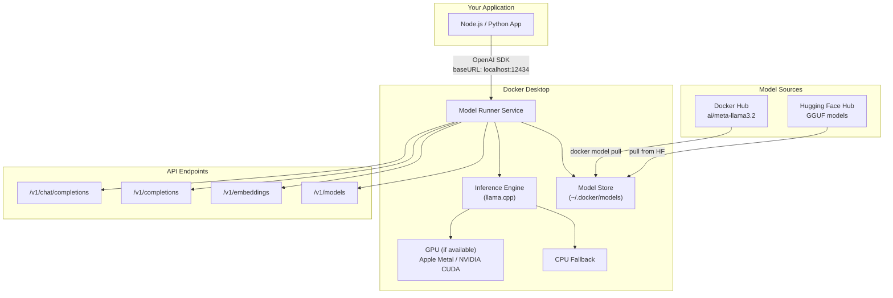
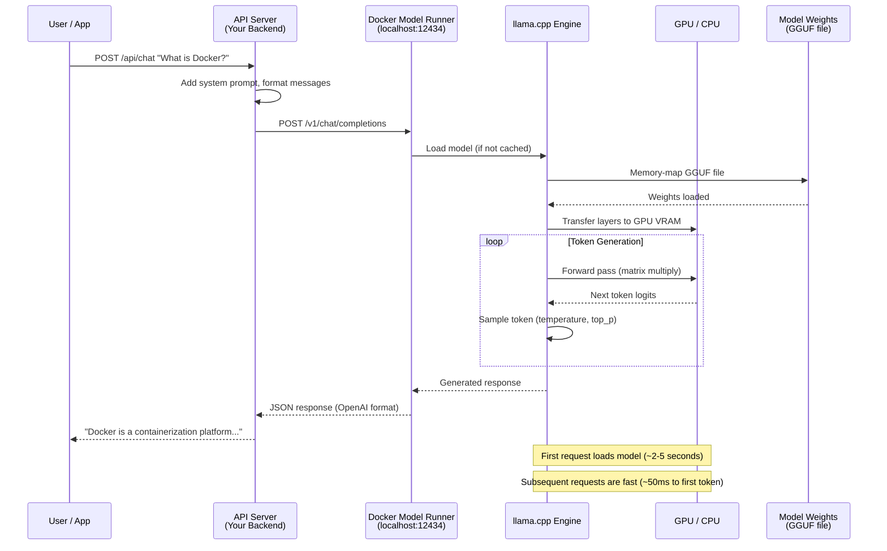

# File 27: Docker Model Runner

**Topic:** Running LLMs Locally, OpenAI-Compatible API, GPU Passthrough, Inference Engines

**WHY THIS MATTERS:**
AI is no longer optional — it's part of modern applications.
Docker Model Runner lets you run large language models (LLMs)
locally on your machine with a single command, just like you
pull and run any container image. No Python setup, no conda
environments, no dependency hell. You get an OpenAI-compatible
API running locally, so your application code that works with
GPT-4 also works with a local Llama model — just change the URL.

**PRE-REQUISITES:**
- Files 01-26 (Docker basics through Bake)
- Docker Desktop 4.40+ (Model Runner is a Docker Desktop feature)
- Basic understanding of LLMs and inference
- GPU recommended but not required (CPU inference works, just slower)

---

## Story: The Personal AI Assistant Office

Imagine you're setting up a personal AI assistant office in
a co-working space in Bangalore's Koramangala.

1. **MODEL LIBRARY** (Hub) — There's a bookshelf (Docker Hub / HF Hub)
   with different AI brains. Some are small and fast (Phi-3, Gemma),
   some are large and powerful (Llama 70B, Mixtral). You pick the
   brain that fits your desk (hardware).

2. **OFFICE DESK** (Container) — Your desk is the container. It has
   everything the AI brain needs to work — the right software
   (inference engine), memory (RAM/VRAM), and a clean workspace.
   You don't install anything permanently — if you leave, the
   desk is clean for the next person.

3. **INTERCOM** (API) — Your AI assistant communicates through an
   intercom system (OpenAI-compatible API). Any department in
   your company can call the same intercom number and talk to the
   AI — they don't need to know which brain is at the desk. Today
   it's Llama 3, tomorrow it might be Mistral — the intercom
   protocol stays the same.

4. **POWER SUPPLY** (GPU) — The AI brain needs electricity. A small
   brain (7B parameters) runs on a regular power outlet (CPU).
   A large brain (70B) needs heavy-duty power (GPU). Docker handles
   the wiring (GPU passthrough) so the brain gets the power it needs.

---

## Example Block 1 — What is Docker Model Runner?

### Section 1 — Overview of Docker Model Runner

**WHY:** Docker Model Runner is a built-in feature of Docker Desktop
that lets you pull, run, and serve AI models with docker commands.
No Python, no pip, no virtual environments — just Docker.

Docker Model Runner is a feature in Docker Desktop (4.40+) that
adds AI model management commands to the Docker CLI. It lets you:
- Pull models from Docker Hub or Hugging Face
- Run inference locally with GPU acceleration
- Serve models via an OpenAI-compatible REST API
- Integrate models into Docker Compose stacks

### Command Namespace

```
docker model <subcommand>
```

| Subcommand | Purpose |
|---|---|
| `docker model pull` | Pull a model from a registry |
| `docker model list` | List locally available models |
| `docker model run` | Run interactive inference |
| `docker model serve` | Start an OpenAI-compatible API server |
| `docker model rm` | Remove a local model |
| `docker model inspect` | Show model details |

### System Requirements

- Docker Desktop 4.40 or newer
- macOS (Apple Silicon recommended) or Windows (WSL2)
- Linux (with Docker Desktop or experimental CLI support)
- RAM: minimum 8 GB for small models, 16-32 GB recommended
- GPU: optional but highly recommended for larger models

---

## Example Block 2 — Pulling and Running Models

### Section 2 — docker model pull

**WHY:** Just like `docker pull nginx` gets you a web server, `docker model pull llama3` gets you an AI brain. The model is downloaded
and stored locally, ready to run.

**SYNTAX:**

```bash
docker model pull <model-name>[:<tag>]
```

**Examples:**

```bash
# Pull Meta's Llama 3.2 (default/recommended variant)
docker model pull ai/meta-llama3.2

# Pull a specific size variant
docker model pull ai/meta-llama3.2:1B-Q8_0
docker model pull ai/meta-llama3.2:3B-Q4_K_M

# Pull Microsoft's Phi-4 Mini
docker model pull ai/phi4-mini

# Pull Mistral's model
docker model pull ai/mistral-small

# Pull Google's Gemma
docker model pull ai/gemma3
```

Expected output:

```
Pulling model ai/meta-llama3.2:3B-Q4_K_M...
████████████████████████████████████ 100%
Model ai/meta-llama3.2:3B-Q4_K_M pulled successfully
Size: 2.0 GB
```

### Model Naming Convention

```
ai/<org>-<model>:<size>-<quantization>
```

Quantization levels (smallest to largest):

| Level | Description |
|---|---|
| `Q4_0` | Smallest, fastest, lowest quality |
| `Q4_K_M` | Good balance of size and quality (RECOMMENDED) |
| `Q5_K_M` | Better quality, larger |
| `Q8_0` | Near-original quality, largest |
| `F16` | Full precision, requires lots of RAM/VRAM |

---

### Section 3 — docker model list and inspect

**List all local models:**

```bash
docker model list
```

Expected output:

```
MODEL                              SIZE      MODIFIED
ai/meta-llama3.2:3B-Q4_K_M        2.0 GB    2 hours ago
ai/phi4-mini:Q4_K_M               2.2 GB    1 day ago
ai/mistral-small:Q4_K_M           7.4 GB    3 days ago
```

**Inspect a model:**

```bash
docker model inspect ai/meta-llama3.2:3B-Q4_K_M
```

Expected output:

```
Name:           ai/meta-llama3.2:3B-Q4_K_M
Architecture:   llama
Parameters:     3.2B
Quantization:   Q4_K_M
Context Length:  128000
Size on Disk:   2.0 GB
License:        Llama 3.2 Community License
Capabilities:   text-generation, chat
```

**Remove a model:**

```bash
docker model rm ai/mistral-small:Q4_K_M
```

Expected output:

```
Removed model ai/mistral-small:Q4_K_M
```

---

## Example Block 3 — Running Interactive Inference

### Section 4 — docker model run

**WHY:** `docker model run` gives you an interactive chat session
with the model — like walking up to the AI assistant's desk
and having a conversation through the intercom.

**SYNTAX:**

```bash
docker model run <model-name> [prompt]
```

**Examples:**

```bash
# Start interactive chat
docker model run ai/meta-llama3.2
> Hello! How can I help you today?
# Type your messages, press Enter to send
# Type /exit or Ctrl+C to quit

# One-shot prompt (no interactive session)
docker model run ai/meta-llama3.2 "Explain Docker in 3 sentences"
```

Expected output:

```
Docker is a platform that packages applications into lightweight,
portable containers. Each container includes the application and all
its dependencies, ensuring consistent behavior across different
environments. Think of it as a shipping container for software —
build once, run anywhere.
```

```bash
# With a coding prompt:
docker model run ai/phi4-mini "Write a Python function to reverse a linked list"
```

### Flags

| Flag | Purpose |
|---|---|
| `--temperature 0.7` | Creativity level (0.0 = deterministic, 1.0 = creative) |
| `--max-tokens 500` | Maximum response length |
| `--system "You are..."` | Set system prompt |
| `--format json` | Request JSON output |

```bash
# Example with flags:
docker model run ai/meta-llama3.2 \
  --system "You are a senior DevOps engineer" \
  --temperature 0.3 \
  "Write a Dockerfile for a Node.js API"
```

---

## Example Block 4 — Serving Models via API

### Section 5 — docker model serve (OpenAI-Compatible API)

**WHY:** The real power is the API server. Your application code can
call this local API using the same SDK/library that talks to
OpenAI — just change the base URL. This is the "intercom system"
from our story.

Docker Desktop's Model Runner exposes an OpenAI-compatible API
endpoint automatically when enabled.

**Endpoint:**

```
http://localhost:12434/engines/llama.cpp/v1/
```

Docker Desktop also maps this to a Docker-internal DNS:

```
http://model-runner.docker.internal/engines/llama.cpp/v1/
```

### Supported Endpoints

| Method | Path | Purpose |
|---|---|---|
| POST | `/v1/chat/completions` | Chat (most common) |
| POST | `/v1/completions` | Text completion |
| POST | `/v1/embeddings` | Text embeddings |
| GET | `/v1/models` | List available models |

### Testing with curl

```bash
# List available models
curl http://localhost:12434/engines/llama.cpp/v1/models

# Chat completion
curl http://localhost:12434/engines/llama.cpp/v1/chat/completions \
  -H "Content-Type: application/json" \
  -d '{
    "model": "ai/meta-llama3.2",
    "messages": [
      {"role": "system", "content": "You are a helpful assistant."},
      {"role": "user", "content": "What is Docker?"}
    ],
    "temperature": 0.7,
    "max_tokens": 200
  }'
```

Expected response:

```json
{
  "id": "chatcmpl-abc123",
  "object": "chat.completion",
  "model": "ai/meta-llama3.2",
  "choices": [{
    "index": 0,
    "message": {
      "role": "assistant",
      "content": "Docker is a platform for containerizing applications..."
    },
    "finish_reason": "stop"
  }],
  "usage": {
    "prompt_tokens": 25,
    "completion_tokens": 89,
    "total_tokens": 114
  }
}
```

---

### Section 6 — Using with OpenAI SDK (Node.js / Python)

**WHY:** The entire point of OpenAI compatibility is that your
existing code works with zero changes — just change the URL.

### Node.js with OpenAI SDK

```javascript
const OpenAI = require('openai');

const client = new OpenAI({
  baseURL: 'http://localhost:12434/engines/llama.cpp/v1/',
  apiKey: 'not-needed'       // Local model doesn't need an API key
});

async function chat() {
  const response = await client.chat.completions.create({
    model: 'ai/meta-llama3.2',
    messages: [
      { role: 'system', content: 'You are a helpful coding assistant.' },
      { role: 'user', content: 'Write a Dockerfile for a Python Flask app' }
    ],
    temperature: 0.7,
    max_tokens: 500
  });

  console.log(response.choices[0].message.content);
}

chat();
```

### Python with OpenAI SDK

```python
from openai import OpenAI

client = OpenAI(
    base_url="http://localhost:12434/engines/llama.cpp/v1/",
    api_key="not-needed"
)

response = client.chat.completions.create(
    model="ai/meta-llama3.2",
    messages=[
        {"role": "system", "content": "You are a helpful assistant."},
        {"role": "user", "content": "Explain Kubernetes in simple terms"}
    ]
)

print(response.choices[0].message.content)
```

### Streaming Responses (Node.js)

```javascript
async function streamChat() {
  const stream = await client.chat.completions.create({
    model: 'ai/meta-llama3.2',
    messages: [{ role: 'user', content: 'Tell me a short story' }],
    stream: true
  });

  for await (const chunk of stream) {
    process.stdout.write(chunk.choices[0]?.delta?.content || '');
  }
}
```

### Mermaid: Docker Model Runner Architecture



Like our story:
- Model Store = Bookshelf with AI brains
- Model Runner = Office desk
- API Endpoints = Intercom system
- GPU/CPU = Power supply

---

## Example Block 5 — GPU Passthrough

### Section 7 — GPU Support for Model Runner

**WHY:** LLMs are computationally expensive. A 7B model runs at
~5 tokens/sec on CPU but ~50 tokens/sec on GPU. For production
use, GPU acceleration is essential.

### Platform-Specific GPU Support

**1. Apple Silicon (M1/M2/M3/M4):**
- GPU acceleration via Metal is AUTOMATIC
- No additional setup required
- Docker Desktop uses Metal Performance Shaders
- Unified memory means both CPU and GPU share the same RAM

**2. NVIDIA GPU (Linux / Windows WSL2):**
- Requires NVIDIA Container Toolkit
- Installation:

```bash
# Add NVIDIA package repository
curl -fsSL https://nvidia.github.io/libnvidia-container/gpgkey | \
  sudo gpg --dearmor -o /usr/share/keyrings/nvidia-container-toolkit-keyring.gpg
curl -s -L https://nvidia.github.io/libnvidia-container/stable/deb/nvidia-container-toolkit.list | \
  sed 's#deb https://#deb [signed-by=/usr/share/keyrings/nvidia-container-toolkit-keyring.gpg] https://#g' | \
  sudo tee /etc/apt/sources.list.d/nvidia-container-toolkit.list
sudo apt-get update
sudo apt-get install -y nvidia-container-toolkit
sudo nvidia-ctk runtime configure --runtime=docker
sudo systemctl restart docker
```

- Verify GPU access:

```bash
docker run --rm --gpus all nvidia/cuda:12.3.1-base-ubuntu22.04 nvidia-smi
```

**3. AMD GPU:**
- ROCm support (Linux only)
- Requires AMD ROCm drivers installed on host
- Less mature than NVIDIA support

### Memory Requirements (approximate)

| MODEL SIZE | Q4_K_M | Q8_0 | F16 |
|---|---|---|---|
| 1B params | ~0.7 GB | ~1.2 GB | ~2 GB |
| 3B params | ~2.0 GB | ~3.5 GB | ~6 GB |
| 7B params | ~4.5 GB | ~7.5 GB | ~14 GB |
| 13B params | ~8.0 GB | ~14 GB | ~26 GB |
| 70B params | ~40 GB | ~70 GB | ~140 GB |

**Rule of thumb:** Your available RAM/VRAM should be at least
1.2x the model size (extra for context window and overhead).

---

## Example Block 6 — Docker Compose for AI Stacks

### Section 8 — AI Application Stack with Compose

**WHY:** In production, your AI app isn't just a model — it's a model
plus an API server, a database for conversation history, a cache
for embeddings, and a web frontend. Compose ties it all together.

```yaml
# compose.yaml

services:
  # ─── The AI model (via Docker Model Runner) ────────────
  # Note: Model Runner runs as a Docker Desktop service.
  # Your app connects to it at model-runner.docker.internal

  # ─── Your application backend ──────────────────────────
  api:
    build: ./api
    ports:
      - "3000:3000"
    environment:
      - OPENAI_BASE_URL=http://model-runner.docker.internal/engines/llama.cpp/v1/
      - OPENAI_API_KEY=not-needed
      - MODEL_NAME=ai/meta-llama3.2
      - POSTGRES_URL=postgres://user:pass@db:5432/chatdb
      - REDIS_URL=redis://cache:6379
    depends_on:
      - db
      - cache

  # ─── PostgreSQL for conversation history ────────────────
  db:
    image: postgres:16-alpine
    environment:
      POSTGRES_USER: user
      POSTGRES_PASSWORD: pass
      POSTGRES_DB: chatdb
    volumes:
      - pgdata:/var/lib/postgresql/data

  # ─── Redis for caching embeddings / sessions ───────────
  cache:
    image: redis:7-alpine
    volumes:
      - redisdata:/data

  # ─── Web frontend ──────────────────────────────────────
  web:
    build: ./web
    ports:
      - "8080:80"
    depends_on:
      - api

volumes:
  pgdata:
  redisdata:
```

```bash
# Start the full AI stack:
docker compose up -d

# Your app calls Model Runner at:
#   http://model-runner.docker.internal/engines/llama.cpp/v1/chat/completions
# This URL works from inside any container in Docker Desktop.
```

---

## Example Block 7 — Inference Engines and Backends

### Section 9 — Understanding Inference Engines

**WHY:** The inference engine is the software that actually runs the
model. Docker Model Runner uses llama.cpp by default, but
understanding alternatives helps when you need more control.

| ENGINE | BEST FOR | GPU SUPPORT | FORMAT |
|---|---|---|---|
| llama.cpp | Local/edge deployment, small to medium models | Metal, CUDA, ROCm, Vulkan | GGUF |
| vLLM | Production serving, high throughput | CUDA only | HF, GPTQ, AWQ, GGUF |
| TGI (Text Gen Inference) | Hugging Face models, production API | CUDA | HF native |
| Ollama | Developer experience, easy CLI interface | Metal, CUDA | GGUF (via Modelfile) |
| Triton (NVIDIA) | Multi-model serving, enterprise scale | CUDA | ONNX, TRT, PyTorch |

Docker Model Runner uses llama.cpp under the hood:
- Efficient CPU inference with SIMD optimizations
- GPU acceleration on Apple Silicon (Metal) and NVIDIA (CUDA)
- Supports GGUF model format (quantized models)
- Low memory footprint compared to Python-based engines

### Running vLLM in a Container (for production)

```bash
docker run --gpus all \
  -v ~/.cache/huggingface:/root/.cache/huggingface \
  -p 8000:8000 \
  vllm/vllm-openai:latest \
  --model meta-llama/Llama-3.2-3B-Instruct \
  --max-model-len 4096
```

### Running Ollama in a Container

```bash
docker run -d \
  --gpus all \
  -v ollama_data:/root/.ollama \
  -p 11434:11434 \
  ollama/ollama:latest

# Then pull and run a model:
docker exec -it <container> ollama pull llama3.2
docker exec -it <container> ollama run llama3.2
```

---

## Example Block 8 — Hugging Face Integration

### Section 10 — Working with Hugging Face Models

**WHY:** Hugging Face is the largest model repository. Many models
are available in GGUF format, compatible with Docker Model Runner.

### GGUF Models on Hugging Face

Many model creators publish GGUF quantized versions on Hugging Face.
These are directly compatible with llama.cpp (and Docker Model Runner).

**Popular GGUF model providers:**
- TheBloke (community quantizations)
- bartowski (high-quality quantizations)
- Official model orgs (Meta, Microsoft, Google)

### Downloading GGUF Models

```bash
# Using huggingface-cli (in a container):
docker run --rm -v ./models:/models \
  python:3.12-slim bash -c "
    pip install huggingface_hub &&
    huggingface-cli download \
      bartowski/Meta-Llama-3.1-8B-Instruct-GGUF \
      Meta-Llama-3.1-8B-Instruct-Q4_K_M.gguf \
      --local-dir /models
  "
```

### Using Downloaded Models with llama.cpp Container

```bash
docker run --rm \
  -v ./models:/models \
  -p 8080:8080 \
  ghcr.io/ggerganov/llama.cpp:server \
  --model /models/Meta-Llama-3.1-8B-Instruct-Q4_K_M.gguf \
  --host 0.0.0.0 \
  --port 8080 \
  --ctx-size 4096 \
  --n-gpu-layers 99    # Offload all layers to GPU
```

The llama.cpp server also provides an OpenAI-compatible API:

```bash
curl http://localhost:8080/v1/chat/completions \
  -H "Content-Type: application/json" \
  -d '{
    "messages": [{"role": "user", "content": "Hello!"}],
    "temperature": 0.7
  }'
```

### Mermaid: Inference Request Flow



Like the office analogy:
- User calls the intercom (API request)
- The intercom routes to the right desk (Model Runner)
- The AI brain processes the request (inference engine + GPU)
- Response flows back through the intercom (API response)

---

## Example Block 9 — Advanced Configuration

### Section 11 — Model Runner Configuration

**WHY:** Default settings work for development, but production
deployments need tuning for performance, memory, and concurrency.

### Docker Desktop Settings (Settings > Features > Model Runner)

- Enable/Disable Model Runner
- GPU memory allocation
- Maximum concurrent models
- Default context window size

### Environment Variables for containers using Model Runner

```
OPENAI_BASE_URL=http://model-runner.docker.internal/engines/llama.cpp/v1/
OPENAI_API_KEY=not-needed
MODEL_NAME=ai/meta-llama3.2
```

### Performance Tuning Tips

| PARAMETER | DEFAULT | RECOMMENDATION |
|---|---|---|
| Context size | 2048 | 4096 for chat, 8192+ for RAG |
| GPU layers | auto | All layers on GPU if VRAM allows |
| Threads | auto | Number of performance CPU cores |
| Batch size | 512 | 1024 for throughput, 256 for latency |
| Temperature | 0.7 | 0.1-0.3 for factual, 0.7-1.0 for creative |

### Choosing the Right Model

| Use case | Recommended Model | Size |
|---|---|---|
| Quick Q&A / chat | Llama 3.2 1B / Phi-4 Mini | ~1-2 GB |
| Code generation | Llama 3.2 3B / Qwen 2.5 | ~2-4 GB |
| Complex reasoning | Llama 3.1 8B / Mistral | ~5-8 GB |
| Production quality | Llama 3.1 70B (needs GPU) | ~40 GB |
| Embeddings / RAG | nomic-embed-text | ~0.3 GB |

---

## Example Block 10 — Building AI-Powered Applications

### Section 12 — RAG (Retrieval-Augmented Generation) Stack

**WHY:** The most common production AI pattern is RAG — combining
a local model with a vector database to answer questions about
YOUR data (documents, codebase, knowledge base).

### Architecture

1. User asks a question
2. Question is embedded (converted to vector)
3. Similar documents are retrieved from vector DB
4. Retrieved docs + question are sent to LLM
5. LLM generates answer grounded in your documents

```yaml
# compose.yaml (RAG Stack)

services:
  # Your RAG application
  app:
    build: ./app
    ports:
      - "3000:3000"
    environment:
      - LLM_URL=http://model-runner.docker.internal/engines/llama.cpp/v1/
      - LLM_MODEL=ai/meta-llama3.2
      - EMBEDDING_MODEL=ai/nomic-embed-text
      - QDRANT_URL=http://vectordb:6333
    depends_on:
      - vectordb

  # Qdrant vector database for document embeddings
  vectordb:
    image: qdrant/qdrant:latest
    ports:
      - "6333:6333"
    volumes:
      - qdrant_data:/qdrant/storage

  # (Optional) Document ingestion worker
  ingest:
    build: ./ingest
    environment:
      - EMBEDDING_URL=http://model-runner.docker.internal/engines/llama.cpp/v1/
      - EMBEDDING_MODEL=ai/nomic-embed-text
      - QDRANT_URL=http://vectordb:6333
    volumes:
      - ./documents:/documents
    depends_on:
      - vectordb

volumes:
  qdrant_data:
```

### Workflow

```bash
1. docker compose up -d
2. Place documents in ./documents/
3. docker compose run ingest     # Embed and store documents
4. Open http://localhost:3000    # Ask questions about your documents
```

---

## Example Block 11 — Security Considerations

### Section 13 — Security Best Practices for AI in Docker

**1. MODEL PROVENANCE:**
- Only pull models from trusted sources (Docker Hub `ai/` namespace, official HF repos)
- Verify model checksums when available
- GGUF files can contain arbitrary metadata — inspect before use

**2. API SECURITY:**
- Model Runner listens on localhost only (not exposed to network)
- If exposing via reverse proxy, add authentication
- Never expose Model Runner port directly to the internet

**3. DATA PRIVACY:**
- Local models = your data never leaves your machine
- No API calls to external services (unlike OpenAI/Anthropic)
- Perfect for healthcare, finance, legal — regulated industries
- Conversation data stays in YOUR database

**4. RESOURCE LIMITS:**
- Set memory limits in Docker Desktop settings
- Monitor GPU memory usage to prevent OOM
- Use quantized models (Q4_K_M) to reduce memory footprint

**5. PROMPT INJECTION:**
- Same risks as cloud LLMs — validate and sanitize user input
- Don't pass raw user input as system prompts
- Implement output filtering for sensitive applications

---

## Key Takeaways

1. **ONE COMMAND TO AI:** `docker model pull` and `docker model run` give you a working LLM with zero Python/conda setup. Like picking a brain off the bookshelf and putting it at a desk.

2. **OPENAI COMPATIBLE:** Your existing OpenAI SDK code works with local models — just change baseURL to `localhost:12434`. The intercom protocol is the same, regardless of which brain is answering.

3. **GPU IS OPTIONAL:** CPU inference works for small models (1-3B). GPU (Apple Metal, NVIDIA CUDA) dramatically speeds up larger models. Small brain = regular power outlet. Big brain = heavy-duty power.

4. **COMPOSE FOR AI STACKS:** Combine Model Runner with databases, vector stores, and your application in one compose.yaml.

5. **PRIVACY BY DEFAULT:** Local models mean your data never leaves your machine. Critical for regulated industries.

6. **QUANTIZATION MATTERS:** Q4_K_M is the sweet spot for most use cases. Smaller = faster but lower quality. Larger = better but needs more RAM.

7. **RAG IS THE KILLER PATTERN:** Combine local LLM + vector DB + your documents for powerful domain-specific AI assistants.

8. **MODEL RUNNER vs OLLAMA vs vLLM:**
   - Model Runner: Integrated in Docker Desktop, zero setup
   - Ollama: Great developer experience, standalone tool
   - vLLM: Production-grade throughput, NVIDIA GPU required

**Office Analogy Summary:**
- Model Library = Docker Hub `ai/` namespace
- Office Desk = Docker Model Runner container
- Intercom = OpenAI-compatible API (:12434)
- Power Supply = GPU (Metal/CUDA) or CPU fallback
- Filing Cabinet = Vector database for RAG
