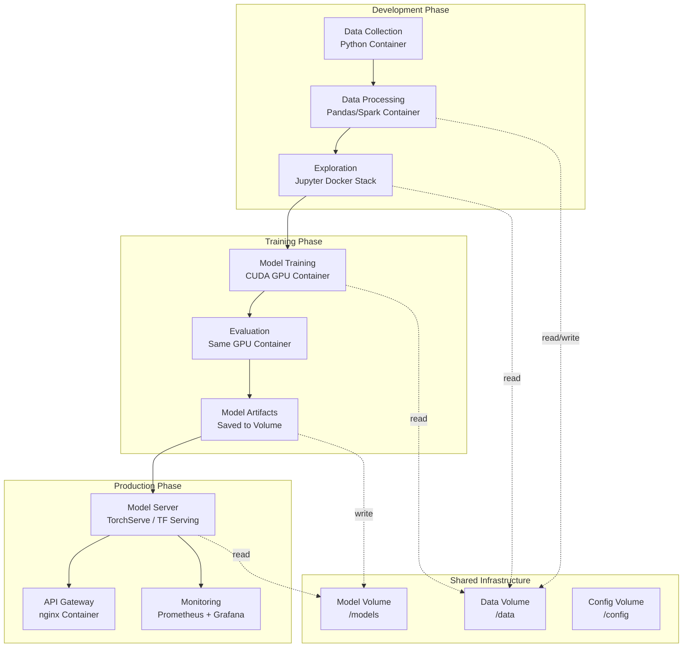
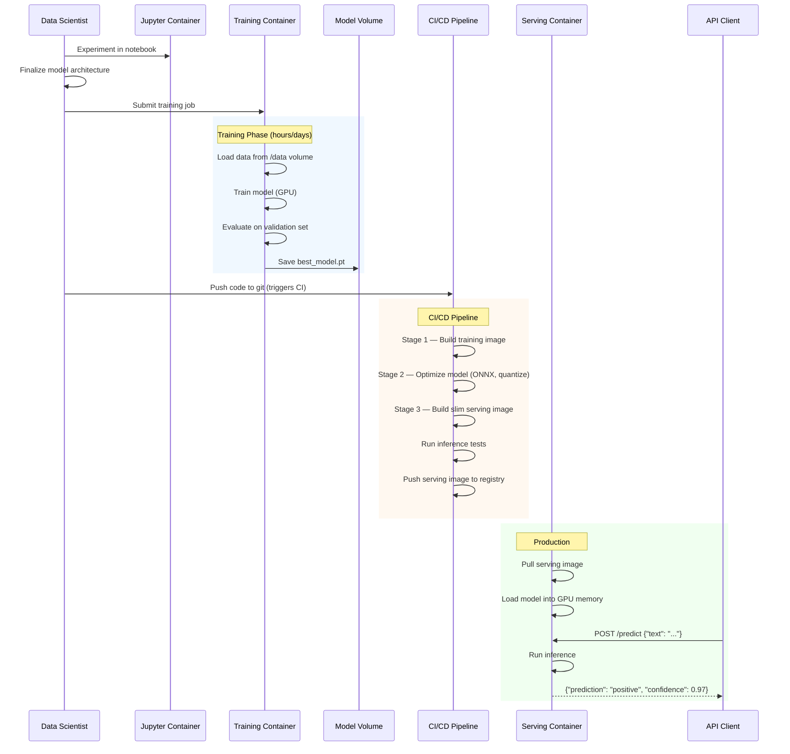

# File 28 — AI/ML Workflows in Docker

**Topic:** ML Pipeline Containerization, Jupyter in Docker, Training Containers, Model Serving

**WHY THIS MATTERS:**
Machine learning has a notorious "it works on my machine" problem — except it's 10x worse than regular software. ML code depends on specific versions of CUDA, cuDNN, PyTorch, TensorFlow, numpy, and dozens of other libraries that must be exactly compatible. Docker solves this completely. You containerize your training environment, your notebook environment, and your serving environment — and they work identically on any machine with the right GPU drivers.

**PRE-REQUISITES:**
- Files 01-27 (Docker basics through Model Runner)
- Basic understanding of ML workflows (training, inference)
- Familiarity with Python data science ecosystem
- GPU recommended for training sections

---

## Story: The Research Lab

Imagine a prestigious research lab at IISc Bangalore (Indian Institute of Science). The lab has three distinct areas:

1. **EXPERIMENT NOTEBOOK (Jupyter)** — Every researcher has a lab notebook where they record experiments, observations, and preliminary results. They mix notes (markdown), calculations (code), and charts (visualizations). This is Jupyter in Docker — a reproducible, shareable experiment environment that anyone can open and get the exact same results.

2. **TRAINING GYMNASIUM (GPU Container)** — Next to the office is a high-performance computing room. Massive machines with powerful GPUs crunch numbers for hours or days — training neural networks on terabytes of data. The room has special power supply (CUDA), climate control (memory management), and monitoring equipment (TensorBoard). This is your GPU training container.

3. **PRODUCT SHOWCASE (Model Serving)** — Once research produces a working model, it moves to the showcase room. Here, visitors (API clients) can interact with the model. The showcase has clear instructions (API endpoints), quality controls (input validation), and security guards (authentication). This is TorchServe, TF Serving, or Triton — production model serving.

Docker ensures that the experiment notebook, the training gymnasium, and the showcase room all use EXACTLY the same versions of every library — so results are reproducible from research to production.

---

## Example Block 1 — The ML Pipeline Overview

### Section 1 — Stages of an ML Pipeline

**WHY:** Before diving into Docker configs, you must understand the ML pipeline. Each stage has different requirements (CPU vs GPU, interactive vs batch, development vs production).

**ML Pipeline Stages:**

1. DATA COLLECTION — Gather raw data (APIs, scraping, databases)
2. DATA PROCESSING — Clean, transform, feature engineering
3. EXPLORATION — Jupyter notebooks, EDA, visualization
4. TRAINING — GPU-intensive model training
5. EVALUATION — Metrics, validation, comparison
6. MODEL EXPORT — Save trained model artifacts
7. MODEL SERVING — Production inference API
8. MONITORING — Drift detection, performance tracking

**Docker's role in each stage:**

| Stage | Docker Container Type |
|---|---|
| Data Processing | Python container with pandas, spark |
| Exploration | Jupyter Docker Stacks |
| Training | CUDA-enabled GPU container |
| Evaluation | Same as training (consistency!) |
| Model Export | Multi-stage build (strip training deps) |
| Model Serving | TorchServe / TF Serving / Triton |
| Monitoring | Prometheus + Grafana containers |

---

### Mermaid Diagram: ML Pipeline in Docker



Like the IISc research lab:
- Development = Researcher's desk (notebooks, data exploration)
- Training = High-performance computing room (GPU crunching)
- Production = Showcase room (model serving to visitors)
- Shared Volumes = The lab's shared file cabinet

---

## Example Block 2 — NVIDIA Container Toolkit

### Section 2 — Setting Up GPU Support

**WHY:** Without GPU passthrough, your container can't access the GPU. The NVIDIA Container Toolkit bridges the gap between the host GPU driver and the container's CUDA runtime.

**Architecture:**

```
Host GPU Driver (e.g., 535.129.03)
  └── NVIDIA Container Toolkit (nvidia-container-runtime)
      └── Docker Container
          └── CUDA Runtime (e.g., 12.3)
              └── cuDNN (e.g., 8.9)
                  └── PyTorch / TensorFlow
```

**Installation (Ubuntu/Debian):**

```bash
# 1. Install NVIDIA GPU driver (if not already installed)
sudo apt-get install -y nvidia-driver-535

# 2. Add NVIDIA container toolkit repository
curl -fsSL https://nvidia.github.io/libnvidia-container/gpgkey | \
  sudo gpg --dearmor -o /usr/share/keyrings/nvidia-container-toolkit-keyring.gpg

curl -s -L https://nvidia.github.io/libnvidia-container/stable/deb/nvidia-container-toolkit.list | \
  sed 's#deb https://#deb [signed-by=/usr/share/keyrings/nvidia-container-toolkit-keyring.gpg] https://#g' | \
  sudo tee /etc/apt/sources.list.d/nvidia-container-toolkit.list

sudo apt-get update
sudo apt-get install -y nvidia-container-toolkit

# 3. Configure Docker to use NVIDIA runtime
sudo nvidia-ctk runtime configure --runtime=docker
sudo systemctl restart docker

# 4. Verify GPU access from container
docker run --rm --gpus all nvidia/cuda:12.3.1-base-ubuntu22.04 nvidia-smi
```

**Expected output:**

```
+-----------------------------------------------------------------------------+
| NVIDIA-SMI 535.129.03   Driver Version: 535.129.03   CUDA Version: 12.3     |
|-------------------------------+----------------------+----------------------|
| GPU  Name        Persistence-M| Bus-Id        Disp.A | Volatile Uncorr. ECC |
| Fan  Temp  Perf  Pwr:Usage/Cap|         Memory-Usage | GPU-Util  Compute M. |
|===============================+======================+======================|
|   0  NVIDIA A100-SXM4    On   | 00000000:00:04.0 Off |                    0 |
| N/A   32C    P0    52W / 400W |      0MiB / 40960MiB |      0%      Default |
+-------------------------------+----------------------+----------------------+
```

**GPU flags for `docker run`:**

| Flag | Description |
|---|---|
| `--gpus all` | Use all available GPUs |
| `--gpus '"device=0"'` | Use specific GPU by index |
| `--gpus '"device=0,1"'` | Use GPUs 0 and 1 |
| `--gpus '"device=GPU-abc123"'` | Use specific GPU by UUID |

---

## Example Block 3 — CUDA Base Images

### Section 3 — Choosing the Right CUDA Base Image

**WHY:** NVIDIA provides official CUDA images on Docker Hub. Choosing the right variant is critical — too slim and you're missing libraries, too heavy and your image is unnecessarily large.

**Image naming convention:**

```
nvidia/cuda:<cuda-version>-<variant>-<os>
```

**Variants (from smallest to largest):**

| Variant | Contents | Size |
|---|---|---|
| base | CUDA runtime only | ~200 MB |
| runtime | base + cuBLAS, cuSPARSE | ~800 MB |
| devel | runtime + headers, nvcc compiler | ~3.5 GB |
| cudnn-runtime | runtime + cuDNN library | ~1.2 GB |
| cudnn-devel | devel + cuDNN headers | ~4.5 GB |

**Which to use:**

- **TRAINING Dockerfile:** `nvidia/cuda:12.3.1-cudnn-devel-ubuntu22.04`
  Need compiler for custom CUDA kernels, cuDNN for deep learning.

- **INFERENCE Dockerfile:** `nvidia/cuda:12.3.1-cudnn-runtime-ubuntu22.04`
  Only need runtime libraries, no compiler.

- **MULTI-STAGE:** Build with devel, run with runtime.
  Best of both worlds — compile in devel, copy artifacts to runtime.

**Examples:**

```dockerfile
# Full development image (for training)
FROM nvidia/cuda:12.3.1-cudnn-devel-ubuntu22.04

# Slim runtime image (for inference)
FROM nvidia/cuda:12.3.1-cudnn-runtime-ubuntu22.04

# Specific CUDA + Python combo (PyTorch official)
FROM pytorch/pytorch:2.2.0-cuda12.1-cudnn8-runtime

# TensorFlow official GPU image
FROM tensorflow/tensorflow:2.15.0-gpu
```

---

## Example Block 4 — Jupyter in Docker

### Section 4 — Jupyter Docker Stacks

**WHY:** Jupyter Docker Stacks are official, maintained images that include Jupyter Lab/Notebook plus common data science libraries. No more "pip install broke my system" — the container has everything. Like the researcher's lab notebook — standardized, reproducible, shareable.

**Official images (maintained by Jupyter project):**

| Image | Includes |
|---|---|
| `jupyter/base-notebook` | JupyterLab, minimal Python |
| `jupyter/minimal-notebook` | base + common utilities |
| `jupyter/scipy-notebook` | minimal + scipy, pandas, matplotlib |
| `jupyter/datascience-notebook` | scipy + R, Julia |
| `jupyter/tensorflow-notebook` | scipy + TensorFlow |
| `jupyter/pytorch-notebook` | scipy + PyTorch |
| `jupyter/pyspark-notebook` | scipy + Apache Spark |
| `jupyter/all-spark-notebook` | pyspark + R, Scala |

**Basic usage:**

```bash
# Start Jupyter Lab with scipy stack
docker run -it --rm \
  -p 8888:8888 \
  -v "$(pwd)/notebooks:/home/jovyan/work" \
  jupyter/scipy-notebook
```

Expected output:

```
[I 2024-01-15 10:30:00 ServerApp] Jupyter Server is running at:
[I 2024-01-15 10:30:00 ServerApp] http://127.0.0.1:8888/lab?token=abc123...
Open your browser to the URL above.
```

**Flags explained:**

| Flag | Description |
|---|---|
| `-p 8888:8888` | Map Jupyter port to host |
| `-v .../notebooks:/home/jovyan/work` | Mount notebooks directory (jovyan is the default Jupyter user) |

**With GPU support:**

```bash
# PyTorch + Jupyter with GPU
docker run -it --rm \
  --gpus all \
  -p 8888:8888 \
  -v "$(pwd)/notebooks:/home/jovyan/work" \
  -v "$(pwd)/data:/home/jovyan/data" \
  jupyter/pytorch-notebook
```

**Custom Jupyter Dockerfile:**

```dockerfile
FROM jupyter/scipy-notebook:latest

USER root
# Install system dependencies
RUN apt-get update && apt-get install -y \
    libgl1-mesa-glx \
    && rm -rf /var/lib/apt/lists/*

USER jovyan
# Install additional Python packages
RUN pip install --no-cache-dir \
    transformers \
    datasets \
    accelerate \
    wandb \
    opencv-python-headless

# Copy custom Jupyter config
COPY jupyter_notebook_config.py /home/jovyan/.jupyter/

WORKDIR /home/jovyan/work
```

---

### Section 5 — Jupyter in Docker Compose

```yaml
# File: compose.yaml

services:
  jupyter:
    image: jupyter/pytorch-notebook:latest
    ports:
      - "8888:8888"
    volumes:
      - ./notebooks:/home/jovyan/work       # Your notebooks
      - ./data:/home/jovyan/data            # Training data
      - ./models:/home/jovyan/models        # Saved models
    environment:
      - JUPYTER_ENABLE_LAB=yes              # Use JupyterLab (not classic)
      - JUPYTER_TOKEN=mysecrettoken         # Set fixed token (dev only!)
      - GRANT_SUDO=yes                      # Allow sudo in container
    deploy:
      resources:
        reservations:
          devices:
            - driver: nvidia
              count: all
              capabilities: [gpu]
    shm_size: '4gb'                         # Shared memory for PyTorch DataLoader

  # TensorBoard for training visualization
  tensorboard:
    image: tensorflow/tensorflow:latest
    command: tensorboard --logdir=/logs --bind_all
    ports:
      - "6006:6006"
    volumes:
      - ./logs:/logs                        # Shared log directory

  # MLflow for experiment tracking
  mlflow:
    image: ghcr.io/mlflow/mlflow:latest
    command: mlflow server --host 0.0.0.0 --port 5000 --backend-store-uri sqlite:///mlflow.db
    ports:
      - "5000:5000"
    volumes:
      - ./mlflow_data:/home/mlflow

volumes:
  notebooks:
  data:
  models:
```

**Commands:**

```bash
docker compose up -d
# Open JupyterLab:    http://localhost:8888?token=mysecrettoken
# Open TensorBoard:   http://localhost:6006
# Open MLflow:        http://localhost:5000
```

---

## Example Block 5 — Training Containers

### Section 6 — GPU Training Container

**WHY:** Training is the most resource-intensive ML stage. Your container needs CUDA, cuDNN, PyTorch/TF, and efficient data loading. Like the training gymnasium in our IISc lab — specialized equipment, heavy power supply, proper ventilation.

**File: Dockerfile.train**

```dockerfile
# ─── Stage 1: Build environment ──────────────────────────
FROM pytorch/pytorch:2.2.0-cuda12.1-cudnn8-devel AS builder

WORKDIR /app

# Install build dependencies
COPY requirements.txt .
RUN pip install --no-cache-dir -r requirements.txt

# ─── Stage 2: Training environment ───────────────────────
FROM pytorch/pytorch:2.2.0-cuda12.1-cudnn8-runtime AS trainer

WORKDIR /app

# Copy installed packages from builder
COPY --from=builder /opt/conda /opt/conda

# Copy training code
COPY src/ ./src/
COPY configs/ ./configs/
COPY train.py .

# Create directories for data and model output
RUN mkdir -p /data /models /logs

# Environment variables
ENV PYTHONUNBUFFERED=1
ENV CUDA_VISIBLE_DEVICES=all
ENV TORCH_HOME=/app/.torch_cache

# Default training command
CMD ["python", "train.py", \
     "--config", "configs/default.yaml", \
     "--data-dir", "/data", \
     "--output-dir", "/models", \
     "--log-dir", "/logs"]
```

**File: requirements.txt**

```text
transformers==4.38.0
datasets==2.17.0
accelerate==0.27.0
wandb==0.16.3
tensorboard==2.15.0
safetensors==0.4.2
peft==0.8.2
bitsandbytes==0.42.0
```

**Build and run:**

```bash
# Build the training image
docker build -f Dockerfile.train -t mymodel-trainer:latest .

# Run training with GPU and mounted volumes
docker run --rm --gpus all \
  -v ./data:/data \
  -v ./models:/models \
  -v ./logs:/logs \
  mymodel-trainer:latest

# Override training config via command
docker run --rm --gpus all \
  -v ./data:/data \
  -v ./models:/models \
  mymodel-trainer:latest \
  python train.py \
    --config configs/large.yaml \
    --epochs 50 \
    --batch-size 32 \
    --learning-rate 0.0001
```

**Expected output:**

```
[2024-01-15 10:30:00] Epoch 1/50: loss=2.345, accuracy=0.45
[2024-01-15 10:35:00] Epoch 2/50: loss=1.892, accuracy=0.58
...
[2024-01-15 15:30:00] Epoch 50/50: loss=0.234, accuracy=0.94
[2024-01-15 15:30:01] Model saved to /models/best_model.pt
```

---

### Section 7 — Distributed Training with Docker

**File: compose.training.yaml**

```yaml
services:
  trainer:
    build:
      context: .
      dockerfile: Dockerfile.train
    command: >
      torchrun
        --nproc_per_node=4
        --master_addr=trainer
        --master_port=29500
        train.py
        --config configs/distributed.yaml
        --data-dir /data
        --output-dir /models
    deploy:
      resources:
        reservations:
          devices:
            - driver: nvidia
              count: 4           # Request 4 GPUs
              capabilities: [gpu]
    shm_size: '16gb'             # Large shared memory for DataLoader workers
    volumes:
      - training_data:/data:ro   # Read-only training data
      - model_output:/models     # Model checkpoints
      - training_logs:/logs      # TensorBoard logs
    ulimits:
      memlock:
        soft: -1
        hard: -1                 # Unlimited memory lock (for NCCL)

  tensorboard:
    image: tensorflow/tensorflow:latest
    command: tensorboard --logdir=/logs --bind_all
    ports:
      - "6006:6006"
    volumes:
      - training_logs:/logs

volumes:
  training_data:
  model_output:
  training_logs:
```

**Commands:**

```bash
# Start distributed training
docker compose -f compose.training.yaml up

# Monitor in TensorBoard
# Open http://localhost:6006
```

**Key details:**

| Setting | Purpose |
|---|---|
| `torchrun` | PyTorch distributed launcher |
| `--nproc_per_node=4` | Use 4 GPUs per node |
| `shm_size: '16gb'` | DataLoader workers use shared memory for IPC |
| `ulimits.memlock` | Required by NVIDIA NCCL for GPU-to-GPU communication |

---

## Example Block 6 — Model Artifact Management

### Section 8 — Saving and Versioning Model Artifacts

**WHY:** A trained model is useless if you can't find it, version it, or load it later. Docker volumes and multi-stage builds help manage model artifacts efficiently.

**Types of model artifacts:**
- Model weights (`.pt`, `.safetensors`, `.h5`, `.pb`)
- Tokenizer files (`tokenizer.json`, `vocab.txt`)
- Config files (`config.json`, `model_config.yaml`)
- Training metrics (`metrics.json`, `training_log.csv`)
- Preprocessing (`scaler.pkl`, `encoder.pkl`)

**Strategy 1: Docker Volumes (Development)**

```bash
# Create a named volume for models
docker volume create ml-models

# Training writes to volume
docker run --gpus all \
  -v ml-models:/models \
  trainer:latest

# Serving reads from same volume
docker run -p 8080:8080 \
  -v ml-models:/models:ro \
  serving:latest
```

**Strategy 2: Bake Model INTO Image (Production)**

```dockerfile
# Dockerfile.serve
FROM pytorch/pytorch:2.2.0-cuda12.1-cudnn8-runtime

WORKDIR /app
COPY serve.py .
COPY requirements-serve.txt .
RUN pip install --no-cache-dir -r requirements-serve.txt

# Copy model artifacts directly into image
COPY models/best_model.safetensors /app/model/
COPY models/tokenizer.json /app/model/
COPY models/config.json /app/model/

EXPOSE 8080
CMD ["python", "serve.py", "--model-dir", "/app/model"]
```

```bash
# Build versioned serving image:
docker build -f Dockerfile.serve -t mymodel-serve:v1.2.3 .
```

Advantages:
- Image is self-contained — no external volume needed
- Versioned — roll back by deploying previous image tag
- Reproducible — the exact model is baked into the image

**Strategy 3: Model Registry (Enterprise)**

Use MLflow, DVC, or Weights & Biases to version models. Pull specific model version at container startup:

```dockerfile
CMD ["python", "serve.py", \
     "--model-registry", "mlflow", \
     "--model-name", "sentiment-classifier", \
     "--model-version", "3"]
```

---

## Example Block 7 — Model Serving

### Section 9 — TorchServe

**WHY:** TorchServe is PyTorch's official model server. It handles batching, multi-model serving, metrics, and versioning — all the things you need in production. Like the IISc showcase room with proper visitor management.

**What is TorchServe?**

PyTorch's official inference server. Features:
- REST and gRPC APIs
- Dynamic batching (groups requests for GPU efficiency)
- Multi-model serving (load multiple models simultaneously)
- A/B testing (serve multiple versions)
- Metrics (Prometheus-compatible)
- Model versioning

**Step 1: Package model as MAR (Model Archive)**

```bash
# torch-model-archiver packages model + handler into a .mar file
torch-model-archiver \
  --model-name sentiment \
  --version 1.0 \
  --model-file model.py \
  --serialized-file best_model.pt \
  --handler handler.py \
  --export-path model_store
```

**Step 2: Dockerfile for TorchServe**

```dockerfile
FROM pytorch/torchserve:latest-gpu

# Copy model archive
COPY model_store/ /home/model-server/model-store/

# Copy custom config
COPY config.properties /home/model-server/

# Expose ports: inference, management, metrics
EXPOSE 8080 8081 8082

CMD ["torchserve", \
     "--start", \
     "--model-store", "/home/model-server/model-store", \
     "--models", "sentiment=sentiment.mar", \
     "--ts-config", "/home/model-server/config.properties"]
```

**Step 3: Run TorchServe**

```bash
docker run --gpus all \
  -p 8080:8080 \
  -p 8081:8081 \
  -p 8082:8082 \
  mymodel-torchserve:latest
```

**Step 4: Test inference**

```bash
# Health check
curl http://localhost:8080/ping
# Response: { "status": "Healthy" }

# Inference
curl -X POST http://localhost:8080/predictions/sentiment \
  -H "Content-Type: application/json" \
  -d '{"text": "This product is amazing!"}'
# Response: { "sentiment": "positive", "confidence": 0.97 }

# Metrics
curl http://localhost:8082/metrics
# Response: Prometheus-format metrics
```

---

### Section 10 — TensorFlow Serving

```bash
# Serve a SavedModel format model
docker run --gpus all \
  -p 8501:8501 \
  -v ./saved_model:/models/mymodel/1 \
  -e MODEL_NAME=mymodel \
  tensorflow/serving:latest-gpu
```

**Directory structure expected:**

```
saved_model/
└── 1/                  # Version number
    ├── saved_model.pb
    └── variables/
        ├── variables.data-00000-of-00001
        └── variables.index
```

**REST API inference:**

```bash
curl -X POST http://localhost:8501/v1/models/mymodel:predict \
  -H "Content-Type: application/json" \
  -d '{"instances": [[1.0, 2.0, 3.0, 4.0]]}'

# Response:
# { "predictions": [[0.2, 0.7, 0.1]] }
```

**Ports:**

| Port | Protocol |
|---|---|
| 8500 | gRPC endpoint (faster, binary protocol) |
| 8501 | REST endpoint (HTTP/JSON, easier to test) |

---

### Section 11 — NVIDIA Triton Inference Server

**What is Triton?**

NVIDIA's multi-framework, multi-model inference server. Supports PyTorch, TensorFlow, ONNX, TensorRT, and more — all served from a single server.

**Model repository structure:**

```
model_repository/
├── text_classifier/
│   ├── config.pbtxt
│   └── 1/
│       └── model.onnx
├── image_detector/
│   ├── config.pbtxt
│   └── 1/
│       └── model.plan    # TensorRT optimized
└── embeddings/
    ├── config.pbtxt
    └── 1/
        └── model.pt      # PyTorch TorchScript
```

**Usage:**

```bash
docker run --gpus all \
  -p 8000:8000 \
  -p 8001:8001 \
  -p 8002:8002 \
  -v ./model_repository:/models \
  nvcr.io/nvidia/tritonserver:24.01-py3 \
  tritonserver --model-repository=/models
```

**Ports:**

| Port | Protocol |
|---|---|
| 8000 | HTTP/REST endpoint |
| 8001 | gRPC endpoint |
| 8002 | Prometheus metrics |

**Features:**
- Dynamic batching across requests
- Model ensemble pipelines
- GPU/CPU model placement
- Concurrent model execution
- Model hot-loading (add models without restart)

**Comparison:**

| Feature | TorchServe | TF Serving | Triton |
|---|---|---|---|
| Frameworks | PyTorch | TensorFlow | All major |
| Batching | Yes | Yes | Advanced |
| Multi-model | Yes | Yes | Yes |
| gRPC | Yes | Yes | Yes |
| Metrics | Yes | Limited | Yes |
| Complexity | Medium | Low | High |
| Best for | PyTorch apps | TF apps | Multi-framework |

---

## Example Block 8 — Multi-Stage Builds for ML

### Section 12 — Multi-Stage: Train and Serve

**WHY:** Training images are huge (10-15 GB with CUDA devel, compilers). Serving images should be small (2-3 GB with just runtime). Multi-stage builds let you train in one stage and serve from a slim stage.

**File: Dockerfile**

```dockerfile
# ─── Stage 1: Training ───────────────────────────────────
FROM pytorch/pytorch:2.2.0-cuda12.1-cudnn8-devel AS trainer

WORKDIR /app
COPY requirements-train.txt .
RUN pip install --no-cache-dir -r requirements-train.txt

COPY src/ ./src/
COPY data/ ./data/
COPY train.py .

# Train the model during build (for CI/CD pipelines)
# For long training, use volumes instead
RUN python train.py \
    --data-dir ./data \
    --output-dir ./trained_model \
    --epochs 10

# ─── Stage 2: Export / Optimize ──────────────────────────
FROM trainer AS optimizer

COPY optimize.py .
RUN python optimize.py \
    --input ./trained_model/best_model.pt \
    --output ./optimized_model/model.onnx \
    --quantize int8

# ─── Stage 3: Serving (slim) ─────────────────────────────
FROM pytorch/pytorch:2.2.0-cuda12.1-cudnn8-runtime AS server

WORKDIR /app
COPY requirements-serve.txt .
RUN pip install --no-cache-dir -r requirements-serve.txt

# Copy ONLY the optimized model from builder
COPY --from=optimizer /app/optimized_model/ ./model/
COPY serve.py .

EXPOSE 8080
HEALTHCHECK CMD curl -f http://localhost:8080/health || exit 1

CMD ["python", "serve.py", "--model-dir", "./model", "--port", "8080"]
```

**Image size comparison:**

| Stage | Size |
|---|---|
| trainer stage | ~12 GB (CUDA devel + training deps) |
| optimizer stage | ~12 GB (same base + optimization tools) |
| server stage (final image) | ~3 GB (CUDA runtime + serving deps only) |

That's a 75% reduction!

---

### Mermaid Diagram: Training-to-Serving Flow



Like the IISc research lab:
- Jupyter = Researcher's desk (experiment)
- Training = Computing room (train for days)
- CI/CD = Quality assurance (test and package)
- Serving = Showcase room (serve visitors)

---

## Example Block 9 — Full ML Stack with Compose

### Section 13 — Production ML Stack

**File: compose.ml-stack.yaml**

```yaml
services:
  # ─── Model Serving ─────────────────────────────────────
  model-server:
    build:
      context: .
      dockerfile: Dockerfile
      target: server                # Multi-stage: only server stage
    ports:
      - "8080:8080"
    deploy:
      resources:
        reservations:
          devices:
            - driver: nvidia
              count: 1
              capabilities: [gpu]
    healthcheck:
      test: curl -f http://localhost:8080/health || exit 1
      interval: 30s
      timeout: 10s
      retries: 3

  # ─── API Gateway ───────────────────────────────────────
  gateway:
    image: nginx:alpine
    ports:
      - "80:80"
    volumes:
      - ./nginx.conf:/etc/nginx/nginx.conf:ro
    depends_on:
      model-server:
        condition: service_healthy

  # ─── Monitoring ────────────────────────────────────────
  prometheus:
    image: prom/prometheus:latest
    ports:
      - "9090:9090"
    volumes:
      - ./prometheus.yml:/etc/prometheus/prometheus.yml:ro
      - prometheus_data:/prometheus

  grafana:
    image: grafana/grafana:latest
    ports:
      - "3000:3000"
    volumes:
      - grafana_data:/var/lib/grafana
    environment:
      - GF_SECURITY_ADMIN_PASSWORD=admin

  # ─── Logging ───────────────────────────────────────────
  loki:
    image: grafana/loki:latest
    ports:
      - "3100:3100"

volumes:
  prometheus_data:
  grafana_data:
```

**Commands:**

```bash
# Start full ML production stack
docker compose -f compose.ml-stack.yaml up -d

# Scale model servers for load balancing
docker compose -f compose.ml-stack.yaml up -d --scale model-server=3

# View logs
docker compose -f compose.ml-stack.yaml logs model-server
```

**Endpoints:**

| URL | Service |
|---|---|
| http://localhost:80 | API Gateway (routes to model-server) |
| http://localhost:8080 | Direct model server access |
| http://localhost:9090 | Prometheus metrics |
| http://localhost:3000 | Grafana dashboards |

---

## Example Block 10 — Best Practices

### Section 14 — ML Docker Best Practices

1. **PIN CUDA AND FRAMEWORK VERSIONS:**

   ```dockerfile
   # BAD:
   FROM pytorch/pytorch:latest
   # GOOD:
   FROM pytorch/pytorch:2.2.0-cuda12.1-cudnn8-runtime
   ```
   **WHY:** CUDA version mismatches cause silent failures.

2. **USE .dockerignore FOR DATA:**

   ```text
   data/
   *.csv
   *.parquet
   models/
   *.pt
   *.onnx
   wandb/
   mlruns/
   __pycache__/
   ```
   **WHY:** Don't accidentally COPY 50 GB of training data into your image.

3. **SEPARATE TRAINING AND SERVING REQUIREMENTS:**
   - `requirements-train.txt` (heavy: pytorch, transformers, datasets, wandb)
   - `requirements-serve.txt` (light: pytorch, flask/fastapi, safetensors)
   **WHY:** Serving image should be as small as possible.

4. **USE HEALTH CHECKS:**

   ```dockerfile
   HEALTHCHECK --interval=30s --timeout=10s --retries=3 \
     CMD curl -f http://localhost:8080/health || exit 1
   ```
   **WHY:** Orchestrators need to know if your model server is ready.

5. **SET SHARED MEMORY SIZE:**

   ```bash
   docker run --shm-size=4g ...
   ```
   Or in Compose: `shm_size: '4gb'`
   **WHY:** PyTorch DataLoader workers use shared memory for IPC. Default 64MB is too small — training will crash.

6. **USE VOLUMES FOR DATA, NOT COPY:**
   - Volumes: `-v ./data:/data` (data stays on host, shared across containers)
   - COPY: `COPY data/ /app/data` (data baked into image, huge image size)

7. **CACHE PIP INSTALLS:**

   ```dockerfile
   COPY requirements.txt .       # Separate layer
   RUN pip install -r requirements.txt
   COPY . .                      # App code in later layer
   ```
   **WHY:** requirements.txt rarely changes, so pip install is cached.

8. **GPU MEMORY MANAGEMENT:**
   - Set `CUDA_VISIBLE_DEVICES` to limit which GPUs a container uses
   - Use `nvidia-smi` to monitor GPU memory during training
   - Consider gradient checkpointing for large models on limited VRAM

---

## Key Takeaways

1. **REPRODUCIBILITY IS EVERYTHING:** Docker ensures your training environment is identical on every machine. No more "it worked on my laptop" — the container IS the environment. Like the IISc lab notebook — every experiment is recorded and repeatable.

2. **GPU = NVIDIA CONTAINER TOOLKIT:** Install it once on the host, then every container gets GPU access with `--gpus all`. Like wiring the training gymnasium for heavy-duty power.

3. **CUDA IMAGE VARIANTS MATTER:** Use `-devel` for training (need compiler), `-runtime` for serving (slim, no compiler needed).

4. **JUPYTER DOCKER STACKS:** Official, maintained images with data science libraries pre-installed. Mount your notebooks as volumes.

5. **MULTI-STAGE FOR ML:** Train with the fat image, serve with the slim image. 12 GB training image becomes a 3 GB serving image.

6. **THREE SERVING OPTIONS:**
   - TorchServe: Best for PyTorch-only shops
   - TF Serving: Best for TensorFlow-only shops
   - Triton: Best for multi-framework, enterprise scale

7. **VOLUME STRATEGY:** Data and models go in volumes, NOT in images. Share volumes between training and serving containers.

8. **shm_size IS CRITICAL:** PyTorch DataLoader crashes with default 64 MB shared memory. Always set shm_size to at least 2-4 GB.

9. **COMPOSE FOR ML STACKS:** One file orchestrates Jupyter + training + serving + monitoring (Prometheus/Grafana) + logging (Loki).

10. **PIN EVERYTHING:** CUDA version, cuDNN version, PyTorch version, Python version. ML dependency chains are fragile — one version mismatch and nothing works.

**RESEARCH LAB ANALOGY SUMMARY:**

| Lab Concept | Docker Equivalent |
|---|---|
| Lab Notebook | Jupyter Docker Stack (experiment, explore) |
| Training Gym | CUDA GPU Container (heavy computation) |
| Product Showcase | TorchServe/Triton (production serving) |
| Lab Equipment | NVIDIA Container Toolkit (GPU access) |
| Filing Cabinet | Docker Volumes (data & model artifacts) |
| Quality Control | Multi-stage builds (slim production images) |
