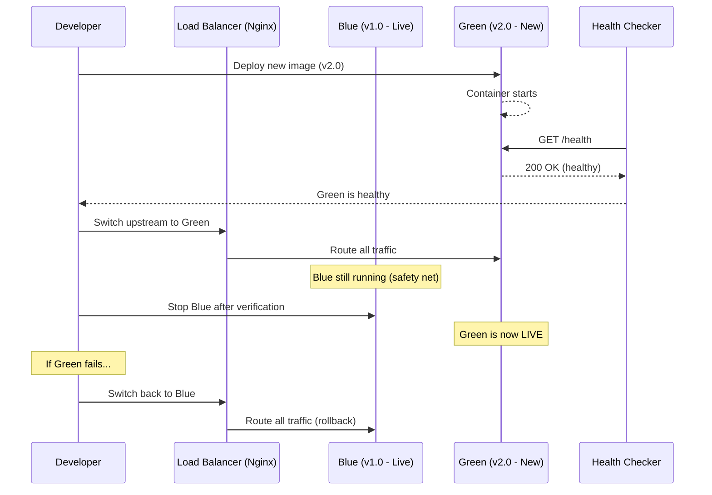
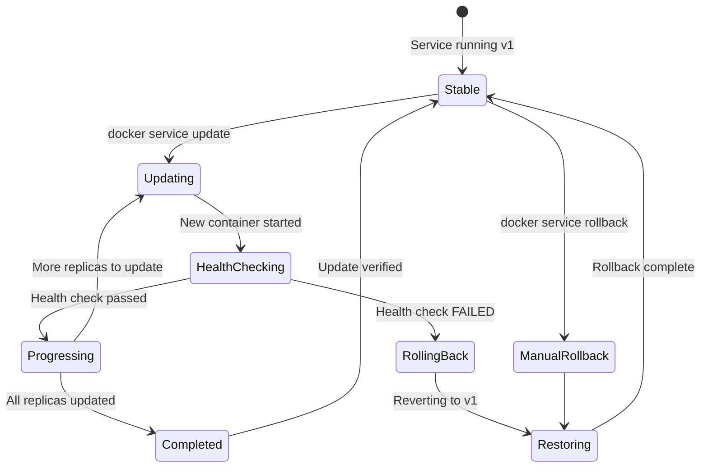

# File 29: Case Study — Zero-Downtime Deployment with Docker

**Topic:** Blue-green deployment, rolling updates, health-check gated deploys, rollback strategies

**WHY THIS MATTERS:**
In production, every second of downtime costs money, trust, and reputation. Users expect 24/7 availability. Zero-downtime deployment is not a luxury — it is a baseline expectation. Docker provides first-class primitives for achieving this: rolling updates, health checks, and instant rollback. This file teaches you every technique you need to deploy with confidence.

**Prerequisites:** Files 01-28 (Compose, Swarm, health checks)

---

## Story: The Mumbai Local Train

Imagine Mumbai's lifeline — the local train system. Every day, 7.5 million people depend on it. You cannot simply stop all trains to replace a coach. Instead, the railway uses a brilliant strategy:

1. A **NEW COACH** is prepared on a parallel track (blue-green).
2. The old coach is **GRADUALLY** replaced while the train runs — passengers shift one compartment at a time (rolling update).
3. A **SIGNAL SYSTEM** checks if the new coach doors work, AC runs, and brakes respond before passengers board (health checks).
4. If a new coach fails inspection, the **OLD COACH** is immediately rolled back into service (rollback).

Docker zero-downtime deployment works exactly the same way. Your containers are coaches, your load balancer is the platform, health checks are the signal system, and rollback is your safety net.

---

## Example Block 1 — Blue-Green Deployment Pattern

### Section 1 — What is Blue-Green Deployment?

**WHY:** Blue-green is the safest deployment strategy. You run two identical environments — "blue" (current) and "green" (new). Traffic switches instantly from blue to green once green is verified healthy. If green fails, you switch back to blue in seconds.

Blue-Green deployment maintains TWO identical production environments:

- **BLUE** = currently serving live traffic
- **GREEN** = new version, being tested

| Step | Action |
|------|--------|
| Step 1 | Deploy new version to GREEN |
| Step 2 | Run health checks / smoke tests on GREEN |
| Step 3 | Switch load balancer from BLUE -> GREEN |
| Step 4 | If GREEN fails, switch back to BLUE instantly |

- **KEY ADVANTAGE:** Zero downtime, instant rollback
- **KEY COST:** Double the infrastructure (temporarily)

### Section 2 — Blue-Green with Docker Compose

**WHY:** Docker Compose makes blue-green easy by allowing you to run two versions side by side on different ports, then switch the reverse proxy (nginx) to point to the new one.

```yaml
# file: docker-compose.blue-green.yml
# SYNTAX: Define blue and green services with different ports

version: "3.8"

services:
  # ── BLUE (current live) ──
  app-blue:
    image: myapp:1.0.0
    ports:
      - "3001:3000"
    networks:
      - frontend
    healthcheck:
      test: ["CMD", "curl", "-f", "http://localhost:3000/health"]
      interval: 10s
      timeout: 5s
      retries: 3
      start_period: 15s

  # ── GREEN (new version) ──
  app-green:
    image: myapp:2.0.0
    ports:
      - "3002:3000"
    networks:
      - frontend
    healthcheck:
      test: ["CMD", "curl", "-f", "http://localhost:3000/health"]
      interval: 10s
      timeout: 5s
      retries: 3
      start_period: 15s

  # ── NGINX reverse proxy (the "platform switch") ──
  nginx:
    image: nginx:alpine
    ports:
      - "80:80"
    volumes:
      - ./nginx.conf:/etc/nginx/nginx.conf:ro
    networks:
      - frontend
    depends_on:
      app-blue:
        condition: service_healthy
      app-green:
        condition: service_healthy

networks:
  frontend:
    driver: bridge
```

### Section 3 — Nginx Config for Blue-Green Switch

**WHY:** The nginx upstream block is the "signal switch" that redirects all traffic from blue to green.

```nginx
# file: nginx.conf
# To switch from BLUE to GREEN, change the upstream server

upstream app_backend {
    # ── BLUE (comment out when switching to green) ──
    # server app-blue:3000;

    # ── GREEN (uncomment when green is verified) ──
    server app-green:3000;
}

server {
    listen 80;

    location / {
        proxy_pass http://app_backend;
        proxy_set_header Host $host;
        proxy_set_header X-Real-IP $remote_addr;
    }

    location /health {
        access_log off;
        return 200 "OK";
    }
}
```

### Section 4 — Blue-Green Deployment Script

**WHY:** Automation eliminates human error. This script handles the full deploy-verify-switch cycle.

```bash
#!/bin/bash
# file: deploy-blue-green.sh
# USAGE: ./deploy-blue-green.sh <new-image-tag>

set -euo pipefail

NEW_TAG=${1:?"Usage: $0 <new-image-tag>"}
HEALTH_URL="http://localhost:3002/health"
MAX_RETRIES=30
RETRY_INTERVAL=2

echo "=== BLUE-GREEN DEPLOYMENT ==="
echo "Deploying new version: $NEW_TAG"

# STEP 1: Update green service with new image
echo "[1/4] Updating green service..."
docker compose -f docker-compose.blue-green.yml \
  up -d --no-deps app-green

# STEP 2: Wait for green to become healthy
echo "[2/4] Waiting for green health check..."
for i in $(seq 1 $MAX_RETRIES); do
  STATUS=$(curl -s -o /dev/null -w "%{http_code}" $HEALTH_URL || true)
  if [ "$STATUS" = "200" ]; then
    echo "  Green is healthy! (attempt $i)"
    break
  fi
  if [ "$i" = "$MAX_RETRIES" ]; then
    echo "  ERROR: Green never became healthy. Aborting."
    docker compose -f docker-compose.blue-green.yml \
      stop app-green
    exit 1
  fi
  echo "  Waiting... (attempt $i/$MAX_RETRIES)"
  sleep $RETRY_INTERVAL
done

# STEP 3: Switch nginx to green
echo "[3/4] Switching traffic to green..."
# Swap nginx config to point to green
sed -i 's/server app-blue:3000/# server app-blue:3000/' nginx.conf
sed -i 's/# server app-green:3000/server app-green:3000/' nginx.conf
docker compose -f docker-compose.blue-green.yml \
  exec nginx nginx -s reload

# STEP 4: Stop blue (old version)
echo "[4/4] Stopping blue (old version)..."
docker compose -f docker-compose.blue-green.yml \
  stop app-blue

echo "=== DEPLOYMENT COMPLETE ==="
echo "Live version: $NEW_TAG"
```

### Mermaid Diagram — Blue-Green Deployment Sequence

> Paste this into https://mermaid.live to visualize



---

## Example Block 2 — Rolling Updates with Docker Swarm

### Section 5 — Rolling Update Fundamentals

**WHY:** Rolling updates replace containers one (or a few) at a time, so the service never goes fully down. This is Docker Swarm's default update strategy.

```
Rolling Update = Replace old containers GRADUALLY, not all at once.

  Replicas:  [v1] [v1] [v1] [v1] [v1]     (before)
  Step 1:    [v2] [v1] [v1] [v1] [v1]     (1 replaced)
  Step 2:    [v2] [v2] [v1] [v1] [v1]     (2 replaced)
  Step 3:    [v2] [v2] [v2] [v1] [v1]     (3 replaced)
  Step 4:    [v2] [v2] [v2] [v2] [v1]     (4 replaced)
  Step 5:    [v2] [v2] [v2] [v2] [v2]     (done!)

At no point are ALL replicas down simultaneously.
```

### Section 6 — Swarm Service Create with Update Config

**WHY:** Swarm's `--update-parallelism` and `--update-delay` give you fine-grained control over update speed and safety.

```bash
# SYNTAX: docker service create with update configuration
docker service create \
  --name webapp \
  --replicas 5 \
  --update-parallelism 2 \
  --update-delay 10s \
  --update-failure-action rollback \
  --update-max-failure-ratio 0.2 \
  --update-order start-first \
  --rollback-parallelism 1 \
  --rollback-delay 5s \
  --health-cmd "curl -f http://localhost:3000/health" \
  --health-interval 10s \
  --health-timeout 5s \
  --health-retries 3 \
  --health-start-period 30s \
  myapp:1.0.0
```

**FLAGS EXPLAINED:**

| Flag | Description |
|------|-------------|
| `--update-parallelism 2` | Replace 2 containers at a time |
| `--update-delay 10s` | Wait 10s between batches |
| `--update-failure-action` | What to do on failure (rollback\|pause\|continue) |
| `--update-max-failure-ratio` | Tolerate up to 20% failure before action |
| `--update-order start-first` | Start new container BEFORE stopping old (ensures no gap in service) |
| `--rollback-parallelism 1` | Rollback 1 at a time (safer) |
| `--rollback-delay 5s` | Wait 5s between rollback steps |

**EXPECTED OUTPUT:**
```
jk8s2nxp7qw3   webapp   replicated   5/5   myapp:1.0.0
```

### Section 7 — Triggering a Rolling Update

**WHY:** Once the service is created, updating is a single command that triggers the configured rolling strategy.

```bash
# SYNTAX: docker service update --image <new-image> <service>
docker service update --image myapp:2.0.0 webapp
```

**EXPECTED OUTPUT:**
```
webapp
overall progress: 2 out of 5 tasks
1/5: running   [==================================>  ]
2/5: running   [==================================>  ]
3/5: preparing [=====>                               ]
4/5:
5/5:
```

```bash
# Monitor the update in real time:
docker service ps webapp
```

**EXPECTED OUTPUT:**
```
ID          NAME        IMAGE         NODE     STATE
abc123      webapp.1    myapp:2.0.0   node1    Running
def456      webapp.2    myapp:2.0.0   node1    Running
ghi789      webapp.3    myapp:1.0.0   node2    Running   ← still old
jkl012      webapp.4    myapp:1.0.0   node2    Running   ← still old
mno345      webapp.5    myapp:1.0.0   node3    Running   ← still old
```

```bash
# Watch the update progress:
watch docker service ps webapp
```

---

## Example Block 3 — Health-Check Gated Deployment

### Section 8 — Health Checks as Deployment Gates

**WHY:** Without health checks, Docker considers a container "ready" the moment it starts. With health checks, Docker waits until the container reports healthy before routing traffic — like the signal system checking brakes before passengers board the new coach.

In your Dockerfile:

```dockerfile
HEALTHCHECK --interval=10s --timeout=5s --retries=3 --start-period=30s \
  CMD curl -f http://localhost:3000/health || exit 1
```

In Compose (deploy section):

```yaml
services:
  webapp:
    image: myapp:2.0.0
    deploy:
      replicas: 5
      update_config:
        parallelism: 2
        delay: 10s
        failure_action: rollback
        order: start-first
        monitor: 30s            # ← Watch for 30s after update
      rollback_config:
        parallelism: 1
        delay: 5s
        order: stop-first
    healthcheck:
      test: ["CMD", "curl", "-f", "http://localhost:3000/health"]
      interval: 10s
      timeout: 5s
      retries: 3
      start_period: 30s
```

**HOW IT WORKS:**

1. New container starts
2. Docker waits for start_period (30s) before checking
3. Health check runs every 10s
4. If 3 consecutive checks fail, container is "unhealthy"
5. Swarm sees unhealthy, triggers failure_action (rollback)
6. Old containers are restored automatically

```bash
# CHECK CONTAINER HEALTH STATUS:
docker inspect --format='{{.State.Health.Status}}' <container>
# EXPECTED OUTPUT: healthy | unhealthy | starting
```

### Section 9 — Advanced Health Check Patterns

**WHY:** Real applications need more than a simple HTTP ping. Check database connections, queue health, and dependencies.

```javascript
// Advanced health check endpoint (Express.js example)
// file: src/health.js

const express = require('express');
const mongoose = require('mongoose');
const redis = require('redis');

const router = express.Router();

router.get('/health', async (req, res) => {
  const checks = {
    uptime: process.uptime(),
    timestamp: Date.now(),
    checks: {}
  };

  // Check MongoDB
  try {
    const mongoState = mongoose.connection.readyState;
    checks.checks.mongodb = {
      status: mongoState === 1 ? 'healthy' : 'unhealthy',
      readyState: mongoState
    };
  } catch (err) {
    checks.checks.mongodb = { status: 'unhealthy', error: err.message };
  }

  // Check Redis
  try {
    const client = redis.createClient();
    await client.ping();
    checks.checks.redis = { status: 'healthy' };
  } catch (err) {
    checks.checks.redis = { status: 'unhealthy', error: err.message };
  }

  // Check memory usage
  const memUsage = process.memoryUsage();
  const memThreshold = 512 * 1024 * 1024; // 512MB
  checks.checks.memory = {
    status: memUsage.heapUsed < memThreshold ? 'healthy' : 'warning',
    heapUsed: Math.round(memUsage.heapUsed / 1024 / 1024) + 'MB'
  };

  // Overall status
  const allHealthy = Object.values(checks.checks)
    .every(c => c.status === 'healthy');

  res.status(allHealthy ? 200 : 503).json(checks);
});
```

---

## Example Block 4 — Rollback Strategies

### Section 10 — Automatic Rollback

**WHY:** Automatic rollback is the "fallback coach" — when the new coach fails, the old one slides back in immediately.

**Automatic Rollback (Swarm):**

Already configured via `--update-failure-action rollback`. Swarm monitors the `monitor` period after each container update. If the container becomes unhealthy, Swarm auto-rolls back.

```bash
# Check rollback status:
docker service inspect --pretty webapp
```

**EXPECTED OUTPUT (after auto-rollback):**
```
UpdateStatus:
 State:          rollback_completed
 Started:        2 minutes ago
 Message:        rollback completed
```

**Manual Rollback:**

```bash
# SYNTAX: docker service rollback <service>
docker service rollback webapp
```

**EXPECTED OUTPUT:**
```
webapp
rollback: manually requested rollback
```

```bash
# FLAGS for rollback:
docker service rollback --detach=false webapp
# --detach=false → Wait and show progress (default is detached)
```

**Compose Rollback (non-Swarm):**

With Compose, rollback = redeploy the old image:

```bash
docker compose -f docker-compose.yml up -d --no-deps webapp
# where docker-compose.yml still references the old image tag
```

### Section 11 — Rollback with Image Tags

**WHY:** Always tag images with version numbers and git SHAs. "latest" is not a rollback strategy.

```bash
# NEVER rely on :latest for production
# ALWAYS use semantic versioning + git SHA

# Build with proper tags:
docker build -t myapp:2.1.0 -t myapp:abc1234 .

# If v2.1.0 fails, rollback to v2.0.0:
docker service update --image myapp:2.0.0 webapp

# Or in Compose, update the image tag and redeploy:
# image: myapp:2.0.0
docker compose up -d --no-deps webapp
```

**TAGGING STRATEGY:**

| Tag | Purpose |
|-----|---------|
| `myapp:latest` | DON'T use in production |
| `myapp:2.1.0` | Semantic version (safe to rollback) |
| `myapp:abc1234` | Git SHA (exact code reference) |
| `myapp:2.1.0-rc1` | Release candidate (for staging) |
| `myapp:2.1.0-20260315` | Version + date (audit trail) |

### Mermaid Diagram — Deployment State Machine

> Paste this into https://mermaid.live to visualize



---

## Example Block 5 — Production Deployment Script

### Section 12 — Complete Zero-Downtime Deploy Script

**WHY:** A production deployment script combines all the techniques: build, tag, push, deploy, verify, rollback.

```bash
#!/bin/bash
# file: deploy.sh — Production Zero-Downtime Deployment
# USAGE: ./deploy.sh <version> [--rollback]
#
# Like the Mumbai local train controller:
#   - Prepares the new coach (build)
#   - Tests the doors and brakes (health check)
#   - Signals the platform switch (update)
#   - Keeps the old coach ready (rollback capability)

set -euo pipefail

VERSION=${1:?"Usage: $0 <version> [--rollback]"}
ROLLBACK=${2:-""}
SERVICE_NAME="webapp"
REGISTRY="registry.example.com"
IMAGE="$REGISTRY/myapp:$VERSION"
HEALTH_ENDPOINT="http://localhost:3000/health"
SLACK_WEBHOOK="https://hooks.slack.com/services/xxx/yyy/zzz"

# ── Notify team ──
notify() {
  curl -s -X POST $SLACK_WEBHOOK \
    -H 'Content-type: application/json' \
    -d "{\"text\": \"[DEPLOY] $1\"}" || true
}

# ── Handle rollback ──
if [ "$ROLLBACK" = "--rollback" ]; then
  echo "=== ROLLING BACK to $VERSION ==="
  notify "Rolling back $SERVICE_NAME to $VERSION"
  docker service update --image $IMAGE $SERVICE_NAME
  notify "Rollback to $VERSION complete"
  exit 0
fi

echo "=== DEPLOYING $VERSION ==="
notify "Starting deployment of $SERVICE_NAME v$VERSION"

# STEP 1: Build and push
echo "[1/5] Building image..."
docker build -t $IMAGE -t $REGISTRY/myapp:latest .

echo "[2/5] Pushing to registry..."
docker push $IMAGE
docker push $REGISTRY/myapp:latest

# STEP 3: Deploy with rolling update
echo "[3/5] Deploying with rolling update..."
docker service update \
  --image $IMAGE \
  --update-parallelism 2 \
  --update-delay 15s \
  --update-failure-action rollback \
  --update-order start-first \
  --detach=false \
  $SERVICE_NAME

# STEP 4: Verify health
echo "[4/5] Verifying deployment health..."
sleep 10
HEALTH_STATUS=$(curl -s -o /dev/null -w "%{http_code}" $HEALTH_ENDPOINT)
if [ "$HEALTH_STATUS" != "200" ]; then
  echo "ERROR: Health check failed (HTTP $HEALTH_STATUS)"
  echo "Triggering rollback..."
  docker service rollback $SERVICE_NAME
  notify "FAILED: v$VERSION deployment failed, rolled back"
  exit 1
fi

# STEP 5: Confirm
echo "[5/5] Deployment verified!"
notify "SUCCESS: $SERVICE_NAME v$VERSION deployed"

echo ""
echo "=== DEPLOYMENT SUMMARY ==="
echo "Service:  $SERVICE_NAME"
echo "Version:  $VERSION"
echo "Image:    $IMAGE"
echo "Health:   OK"
echo ""
echo "To rollback: ./deploy.sh <previous-version> --rollback"
```

### Section 13 — Compose Rolling Update (non-Swarm)

**WHY:** Not everyone uses Swarm. Docker Compose can approximate rolling updates with careful scripting.

```bash
# Strategy: Scale up new, then scale down old
# This works with docker compose (not swarm mode)

# Step 1: Update the image in docker-compose.yml
# Step 2: Pull the new image
docker compose pull webapp

# Step 3: Scale up — add new containers alongside old
docker compose up -d --scale webapp=4 --no-recreate

# Step 4: Remove old containers one by one
docker compose up -d --scale webapp=2

# Alternative: Use --force-recreate to replace all at once
# (brief downtime, but simpler)
docker compose up -d --force-recreate --no-deps webapp

# Best for Compose: Use a deployment tool like:
#   - Traefik (auto-detects new containers)
#   - Docker rollout plugin (github.com/Wowu/docker-rollout)

# docker-rollout plugin usage:
docker rollout webapp
# This plugin does rolling updates for Compose services
```

### Section 14 — Monitoring During Deployment

**WHY:** You need eyes on the deployment as it happens — like the train controller watching monitors on the platform.

```bash
# Watch service update progress:
docker service ps --filter "desired-state=running" webapp

# Stream service logs during update:
docker service logs -f --tail 100 webapp

# Check for failed tasks:
docker service ps --filter "desired-state=shutdown" webapp

# Inspect update state:
docker service inspect --pretty webapp | grep -A 5 "UpdateStatus"
```

**EXPECTED OUTPUT:**
```
UpdateStatus:
 State:          completed
 Started:        2 minutes ago
 Completed:      30 seconds ago
 Message:        update completed
```

```bash
# Monitor resource usage during deployment:
docker stats --no-stream
```

---

## Key Takeaways

1. **BLUE-GREEN DEPLOYMENT**
   - Two identical environments, traffic switches instantly
   - Safest strategy, but requires double infrastructure
   - Use nginx/traefik as the traffic switch

2. **ROLLING UPDATES**
   - Replace containers gradually (`--update-parallelism`)
   - Add delay between batches (`--update-delay`)
   - Use start-first order to prevent gaps

3. **HEALTH-CHECK GATED DEPLOYS**
   - Never route traffic to unhealthy containers
   - Check application + dependencies (DB, cache, queues)
   - Configure start_period for slow-starting apps

4. **ROLLBACK STRATEGIES**
   - Automatic: `--update-failure-action rollback`
   - Manual: `docker service rollback <service>`
   - Compose: redeploy with old image tag
   - ALWAYS tag images with versions (never rely on `:latest`)

5. **PRODUCTION CHECKLIST**
   - [ ] Image tagged with version + git SHA
   - [ ] Health check endpoint covers all dependencies
   - [ ] update-failure-action set to rollback
   - [ ] Monitoring active during deployment
   - [ ] Rollback procedure documented and tested
   - [ ] Team notified via Slack/webhook

> **Remember the Mumbai local train:**
> New coach (blue-green) → Gradual replacement (rolling) → Signal check (health) → Fallback coach (rollback)
