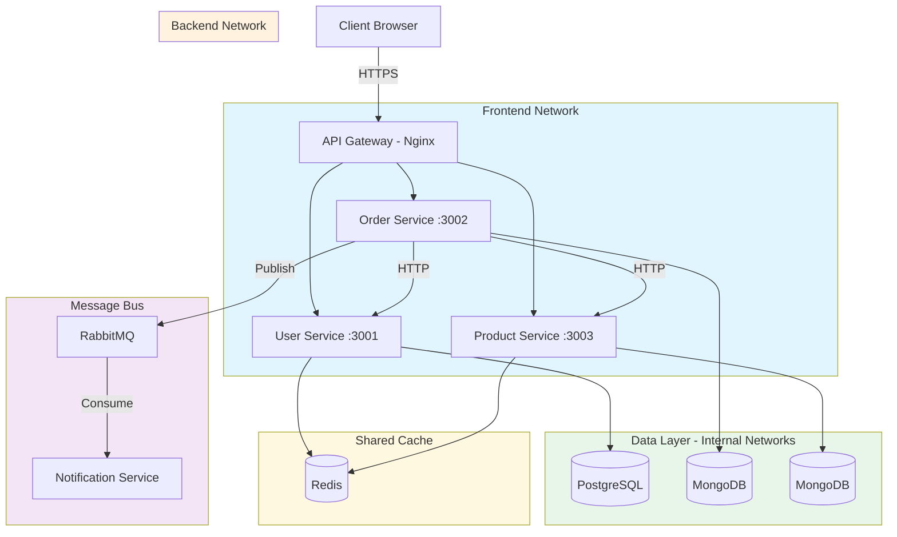
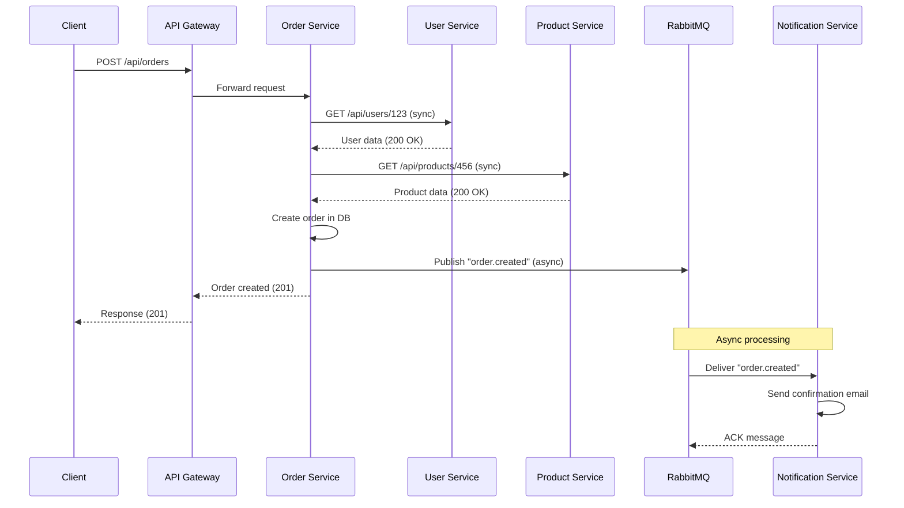

# File 30: Case Study — Microservices Communication in Docker

**Topic:** Microservices in Docker — service mesh patterns, inter-service communication, shared networks, debugging network issues

**WHY THIS MATTERS:**
Microservices are useless if they cannot talk to each other. Docker networking is the backbone of service communication. Understanding how containers discover, connect, and debug each other is critical for building reliable distributed systems. This file covers every pattern you need — from simple HTTP calls to service meshes and distributed tracing.

**Prerequisites:** Files 01-29 (Networking, Compose, Swarm)

---

## Story: The Mumbai Dabbawala System

Mumbai's dabbawalas deliver 200,000 lunch boxes daily with a legendary error rate of just 1 in 16 million. How?

1. **EACH DABBAWALA** handles ONE route (single responsibility = one microservice per function).
2. A **CODING SYSTEM** on each dabba (lunch box) tells which station, building, and floor — this is **SERVICE DISCOVERY**. Containers use DNS names instead of IP addresses.
3. **CENTRAL COORDINATION** at Churchgate station sorts and routes all dabbas — this is the **ORCHESTRATOR** (Swarm/K8s) or **API GATEWAY** (nginx/traefik).
4. If a dabbawala is sick, another from the same group takes over seamlessly — this is **LOAD BALANCING** and **HEALTH CHECKS**.
5. Handoffs between dabbawalas at train stations are like **INTER-SERVICE COMMUNICATION** — structured, reliable, and traceable.

Docker microservices work the same way. Each container has one job, DNS-based discovery, centralized routing, and structured communication protocols.

---

## Example Block 1 — Microservices Network Topology

### Section 1 — Designing the Network Architecture

**WHY:** Microservices need network isolation between tiers (frontend, backend, data) while allowing controlled communication between them — like how dabbawalas only interact at designated handoff points (train stations).

**Microservices Network Design Principles:**

1. **NETWORK PER TIER** — Isolate frontend, backend, and data layers
2. **SHARED NETWORKS** — Services that need to talk share a network
3. **NO DIRECT DB ACCESS** — Only the owning service talks to its DB
4. **API GATEWAY** — Single entry point for external traffic
5. **SERVICE MESH** — For advanced routing, retries, circuit breaking

```yaml
# file: docker-compose.microservices.yml
# Full microservices setup with proper network isolation

version: "3.8"

services:
  # ── API GATEWAY (the Churchgate sorting station) ──
  gateway:
    image: nginx:alpine
    ports:
      - "80:80"
      - "443:443"
    volumes:
      - ./nginx/gateway.conf:/etc/nginx/nginx.conf:ro
      - ./certs:/etc/nginx/certs:ro
    networks:
      - frontend
    depends_on:
      - user-service
      - order-service
      - product-service

  # ── USER SERVICE ──
  user-service:
    build: ./services/user
    environment:
      - DB_HOST=user-db
      - DB_PORT=5432
      - REDIS_HOST=shared-cache
      - JWT_SECRET_FILE=/run/secrets/jwt_secret
    networks:
      - frontend       # receives requests from gateway
      - user-data      # talks to its own DB
      - shared-cache   # shared Redis for sessions
    secrets:
      - jwt_secret
    healthcheck:
      test: ["CMD", "curl", "-f", "http://localhost:3001/health"]
      interval: 15s
      timeout: 5s
      retries: 3

  # ── ORDER SERVICE ──
  order-service:
    build: ./services/order
    environment:
      - DB_HOST=order-db
      - DB_PORT=27017
      - USER_SERVICE_URL=http://user-service:3001
      - PRODUCT_SERVICE_URL=http://product-service:3003
      - RABBITMQ_URL=amqp://message-queue:5672
    networks:
      - frontend
      - order-data
      - backend        # communicates with other services
      - message-bus    # async communication
    healthcheck:
      test: ["CMD", "curl", "-f", "http://localhost:3002/health"]
      interval: 15s
      timeout: 5s
      retries: 3

  # ── PRODUCT SERVICE ──
  product-service:
    build: ./services/product
    environment:
      - DB_HOST=product-db
      - DB_PORT=27017
      - REDIS_HOST=shared-cache
    networks:
      - frontend
      - product-data
      - shared-cache
      - backend
    healthcheck:
      test: ["CMD", "curl", "-f", "http://localhost:3003/health"]
      interval: 15s
      timeout: 5s
      retries: 3

  # ── NOTIFICATION SERVICE (async consumer) ──
  notification-service:
    build: ./services/notification
    environment:
      - RABBITMQ_URL=amqp://message-queue:5672
      - SMTP_HOST=mailserver
    networks:
      - message-bus
      - notification-net
    healthcheck:
      test: ["CMD", "node", "healthcheck.js"]
      interval: 15s
      timeout: 5s
      retries: 3

  # ── DATABASES (each service owns its data) ──
  user-db:
    image: postgres:15-alpine
    volumes:
      - user-db-data:/var/lib/postgresql/data
    networks:
      - user-data
    environment:
      POSTGRES_DB: users
      POSTGRES_USER: admin
      POSTGRES_PASSWORD_FILE: /run/secrets/db_password
    secrets:
      - db_password

  order-db:
    image: mongo:7
    volumes:
      - order-db-data:/data/db
    networks:
      - order-data

  product-db:
    image: mongo:7
    volumes:
      - product-db-data:/data/db
    networks:
      - product-data

  # ── SHARED INFRASTRUCTURE ──
  shared-cache:
    image: redis:7-alpine
    networks:
      - shared-cache
    command: redis-server --maxmemory 256mb --maxmemory-policy allkeys-lru

  message-queue:
    image: rabbitmq:3-management-alpine
    networks:
      - message-bus
    ports:
      - "15672:15672"   # Management UI (dev only)

# ── NETWORKS (the train routes) ──
networks:
  frontend:
    driver: bridge
  backend:
    driver: bridge
  user-data:
    driver: bridge
    internal: true      # No external access to DB network
  order-data:
    driver: bridge
    internal: true
  product-data:
    driver: bridge
    internal: true
  shared-cache:
    driver: bridge
    internal: true
  message-bus:
    driver: bridge
    internal: true
  notification-net:
    driver: bridge

# ── VOLUMES ──
volumes:
  user-db-data:
  order-db-data:
  product-db-data:

# ── SECRETS ──
secrets:
  jwt_secret:
    file: ./secrets/jwt_secret.txt
  db_password:
    file: ./secrets/db_password.txt
```

### Mermaid Diagram — Microservices Network Topology

> Paste this into https://mermaid.live to visualize



---

## Example Block 2 — Inter-Service Communication Patterns

### Section 2 — Synchronous Communication (HTTP/gRPC)

**WHY:** Like a dabbawala handing a dabba directly to the next dabbawala at the station — synchronous, immediate, and the sender waits for confirmation.

```javascript
// file: services/order/src/orderService.js
// Synchronous HTTP calls between services

const axios = require('axios');

class OrderService {
  constructor() {
    // WHY: Use service names as hostnames — Docker DNS resolves them
    // This is the "coding system" on the dabba — the address
    this.userServiceUrl = process.env.USER_SERVICE_URL || 'http://user-service:3001';
    this.productServiceUrl = process.env.PRODUCT_SERVICE_URL || 'http://product-service:3003';
  }

  async createOrder(userId, items) {
    // Step 1: Verify user exists (sync call to User Service)
    const user = await this.callService(
      this.userServiceUrl + '/api/users/' + userId,
      'User Service'
    );

    // Step 2: Check product availability (sync call to Product Service)
    const products = await Promise.all(
      items.map(item =>
        this.callService(
          this.productServiceUrl + '/api/products/' + item.productId,
          'Product Service'
        )
      )
    );

    // Step 3: Create order in local DB
    const order = await Order.create({ userId, items, products });
    return order;
  }

  async callService(url, serviceName, retries = 3) {
    for (let attempt = 1; attempt <= retries; attempt++) {
      try {
        const response = await axios.get(url, { timeout: 5000 });
        return response.data;
      } catch (error) {
        console.error(
          '[' + serviceName + '] Call failed (attempt ' + attempt + '/' + retries + '): ' +
          error.message
        );
        if (attempt === retries) throw error;
        // WHY: Exponential backoff — don't overwhelm a struggling service
        await new Promise(r => setTimeout(r, Math.pow(2, attempt) * 1000));
      }
    }
  }
}
```

### Section 3 — Asynchronous Communication (Message Queues)

**WHY:** Like leaving a dabba at a collection point — the sender does not wait. The receiver picks it up when ready. This decouples services and handles spikes gracefully.

```javascript
// file: services/order/src/events.js
// Async communication via RabbitMQ

const amqp = require('amqplib');

class EventBus {
  constructor() {
    this.connection = null;
    this.channel = null;
  }

  async connect() {
    // WHY: Use Docker service name as hostname
    const url = process.env.RABBITMQ_URL || 'amqp://message-queue:5672';
    this.connection = await amqp.connect(url);
    this.channel = await this.connection.createChannel();
  }

  // PUBLISH an event (fire and forget)
  async publish(exchange, routingKey, data) {
    await this.channel.assertExchange(exchange, 'topic', { durable: true });
    this.channel.publish(
      exchange,
      routingKey,
      Buffer.from(JSON.stringify(data)),
      { persistent: true }  // survive broker restarts
    );
    console.log('[EventBus] Published: ' + routingKey);
  }

  // SUBSCRIBE to events
  async subscribe(exchange, routingKey, handler) {
    await this.channel.assertExchange(exchange, 'topic', { durable: true });
    const q = await this.channel.assertQueue('', { exclusive: true });
    await this.channel.bindQueue(q.queue, exchange, routingKey);
    this.channel.consume(q.queue, async (msg) => {
      try {
        const data = JSON.parse(msg.content.toString());
        await handler(data);
        this.channel.ack(msg);
      } catch (err) {
        console.error('[EventBus] Handler error:', err);
        this.channel.nack(msg, false, true); // requeue
      }
    });
  }
}

// Usage in Order Service:
// await eventBus.publish('orders', 'order.created', { orderId, userId });

// Usage in Notification Service:
// await eventBus.subscribe('orders', 'order.created', async (data) => {
//   await sendEmail(data.userId, 'Your order is confirmed!');
// });
```

### Mermaid Diagram — Inter-Service Communication Sequence

> Paste this into https://mermaid.live to visualize



---

## Example Block 3 — Multi-Compose Networking

### Section 4 — Connecting Services Across Compose Files

**WHY:** Large teams often have separate compose files per service. They need to share a network to communicate — like different dabbawala groups meeting at the same station.

Team A: User Service (`docker-compose.users.yml`):

```yaml
version: "3.8"
services:
  user-service:
    build: ./user-service
    networks:
      - shared-net

networks:
  shared-net:
    name: microservices-net    # ← NAMED network (shared)
    driver: bridge
```

Team B: Order Service (`docker-compose.orders.yml`):

```yaml
version: "3.8"
services:
  order-service:
    build: ./order-service
    networks:
      - shared-net

networks:
  shared-net:
    external: true            # ← USE existing network
    name: microservices-net
```

```bash
# STEP 1: Create the shared network first
docker network create microservices-net

# STEP 2: Start each compose file
docker compose -f docker-compose.users.yml up -d
docker compose -f docker-compose.orders.yml up -d

# Now order-service can reach user-service by name:
# curl http://user-service:3001/api/users
```

**Runtime network connection:**

```bash
# SYNTAX: docker network connect <network> <container>
docker network connect microservices-net my-standalone-container

# Verify connectivity:
docker network inspect microservices-net
```

**EXPECTED OUTPUT (truncated):**
```json
"Containers": {
  "abc123": { "Name": "user-service", "IPv4": "172.20.0.2/16" },
  "def456": { "Name": "order-service", "IPv4": "172.20.0.3/16" }
}
```

---

## Example Block 4 — Network Debugging

### Section 5 — Debugging with nicolaka/netshoot

**WHY:** When services cannot communicate, you need tools to diagnose — like a train inspector checking the tracks. nicolaka/netshoot is a container loaded with every network diagnostic tool you will ever need.

```bash
# SYNTAX: Run netshoot in the same network as your services
docker run -it --rm \
  --network microservices-net \
  nicolaka/netshoot
```

Inside the container, available tools: `ping`, `curl`, `dig`, `nslookup`, `traceroute`, `tcpdump`, `iperf`, `netstat`, `ss`, `ip`, `nmap`, `mtr`, `socat`, `iftop`, `drill`

**DNS Resolution:**

```bash
dig user-service
# EXPECTED OUTPUT:
# ;; ANSWER SECTION:
# user-service.   600  IN  A  172.20.0.2

nslookup order-service
# EXPECTED OUTPUT:
# Server:     127.0.0.11
# Address:    127.0.0.11#53
# Name:       order-service
# Address:    172.20.0.3
```

**Connectivity Test:**

```bash
curl -v http://user-service:3001/health
# Shows full HTTP headers, connection details

ping order-service
# EXPECTED OUTPUT:
# PING order-service (172.20.0.3): 56 data bytes
# 64 bytes from 172.20.0.3: icmp_seq=0 ttl=64 time=0.089 ms
```

**Port Scanning:**

```bash
nmap -sT user-service
# EXPECTED OUTPUT:
# PORT     STATE SERVICE
# 3001/tcp open  unknown
```

**Trace Route:**

```bash
traceroute product-service
# Shows network hops between containers
```

### Section 6 — tcpdump in Containers

**WHY:** tcpdump captures raw network traffic — essential for debugging mysterious connection failures, timeouts, and protocol issues.

```bash
# Method 1: Use netshoot attached to target container's network
docker run -it --rm \
  --net container:order-service \
  nicolaka/netshoot \
  tcpdump -i eth0 -n port 3002
```

**EXPECTED OUTPUT:**
```
14:23:01.123 IP 172.20.0.4.54321 > 172.20.0.3.3002: Flags [S], seq 12345
14:23:01.124 IP 172.20.0.3.3002 > 172.20.0.4.54321: Flags [S.], seq 67890
14:23:01.124 IP 172.20.0.4.54321 > 172.20.0.3.3002: Flags [.], ack 1
```

**FLAGS EXPLAINED:**

| Flag | Description |
|------|-------------|
| `-i eth0` | Listen on eth0 interface |
| `-n` | Don't resolve hostnames (faster) |
| `port 3002` | Filter only port 3002 traffic |

```bash
# Method 2: Capture HTTP traffic between two services
docker run -it --rm \
  --net container:order-service \
  nicolaka/netshoot \
  tcpdump -i eth0 -A -s 0 'tcp port 3001 and host user-service'

# FLAGS:
# -A    → Print packet contents in ASCII (see HTTP bodies)
# -s 0  → Capture full packets (no truncation)

# Method 3: Save capture for Wireshark analysis
docker run -it --rm \
  --net container:order-service \
  -v /tmp/captures:/captures \
  nicolaka/netshoot \
  tcpdump -i eth0 -w /captures/order-traffic.pcap

# Then open /tmp/captures/order-traffic.pcap in Wireshark
```

### Section 7 — Common Network Issues and Fixes

**WHY:** Knowing the common pitfalls saves hours of debugging.

| Issue | Cause | Fix |
|-------|-------|-----|
| `Could not resolve host: user-service` | Containers are on different networks | `docker network connect microservices-net user-service` |
| `Connection refused` on correct hostname | Service is listening on 127.0.0.1, not 0.0.0.0 | Bind to 0.0.0.0 in your app: `app.listen(3000, '0.0.0.0')` |
| `Connection timed out` | Firewall or wrong port | Check exposed ports: `docker port user-service` |
| Intermittent DNS failures | Docker embedded DNS cache stale | Restart the container or use `--dns` flag: `docker run --dns 8.8.8.8 myservice` |
| Cross-compose-file DNS not resolving | Different default networks | Use a named external network (Section 4 above) |

---

## Example Block 5 — Distributed Tracing Setup

### Section 8 — Setting Up Jaeger for Distributed Tracing

**WHY:** When a request flows through 5 services, how do you know which one is slow? Distributed tracing tracks a request across all services — like tracking a specific dabba through every dabbawala who handles it.

Add to `docker-compose.microservices.yml`:

```yaml
  # ── JAEGER (Distributed Tracing) ──
  jaeger:
    image: jaegertracing/all-in-one:1.54
    ports:
      - "16686:16686"   # Jaeger UI
      - "4318:4318"     # OTLP HTTP receiver
    environment:
      - COLLECTOR_OTLP_ENABLED=true
    networks:
      - frontend
      - backend
```

In each service, add the OpenTelemetry SDK:

```bash
npm install @opentelemetry/sdk-node @opentelemetry/auto-instrumentations-node
```

```javascript
// file: services/order/src/tracing.js
const { NodeSDK } = require('@opentelemetry/sdk-node');
const { OTLPTraceExporter } = require('@opentelemetry/exporter-trace-otlp-http');
const { getNodeAutoInstrumentations } = require('@opentelemetry/auto-instrumentations-node');

const sdk = new NodeSDK({
  serviceName: 'order-service',  // unique per service
  traceExporter: new OTLPTraceExporter({
    url: 'http://jaeger:4318/v1/traces'  // Docker DNS name
  }),
  instrumentations: [getNodeAutoInstrumentations()]
});

sdk.start();
// This auto-instruments HTTP, Express, MongoDB, etc.
// Every cross-service call is traced automatically.
```

### Section 9 — API Gateway Configuration

**WHY:** The API gateway is the front door — like the main sorting hub at Churchgate station where all dabbas arrive and get routed to the right train.

```nginx
# file: nginx/gateway.conf
# API Gateway routing configuration

upstream user_service {
    server user-service:3001;
}

upstream order_service {
    server order-service:3002;
}

upstream product_service {
    server product-service:3003;
}

server {
    listen 80;
    server_name api.example.com;

    # ── Rate Limiting ──
    limit_req_zone $binary_remote_addr zone=api:10m rate=100r/s;

    # ── Route: Users ──
    location /api/users {
        limit_req zone=api burst=20 nodelay;
        proxy_pass http://user_service;
        proxy_set_header Host $host;
        proxy_set_header X-Real-IP $remote_addr;
        proxy_set_header X-Request-ID $request_id;
        proxy_connect_timeout 5s;
        proxy_read_timeout 30s;
    }

    # ── Route: Orders ──
    location /api/orders {
        limit_req zone=api burst=20 nodelay;
        proxy_pass http://order_service;
        proxy_set_header Host $host;
        proxy_set_header X-Real-IP $remote_addr;
        proxy_set_header X-Request-ID $request_id;
    }

    # ── Route: Products ──
    location /api/products {
        limit_req zone=api burst=50 nodelay;
        proxy_pass http://product_service;
        proxy_set_header Host $host;
        proxy_set_header X-Real-IP $remote_addr;
        proxy_set_header X-Request-ID $request_id;
    }

    # ── Health Check ──
    location /health {
        access_log off;
        return 200 '{"status":"ok"}';
        add_header Content-Type application/json;
    }
}
```

### Section 10 — Service Discovery Patterns

**WHY:** Services need to find each other reliably. Docker provides built-in DNS, but you should understand the alternatives for complex setups.

**PATTERN 1: Docker Embedded DNS (default, simplest)**

Services resolve each other by container/service name. `curl http://user-service:3001/api/users`. Works automatically on user-defined bridge networks.

**PATTERN 2: Environment Variables**

Pass service URLs via env vars in Compose:
```yaml
environment:
  - USER_SERVICE_URL=http://user-service:3001
```
Advantage: Easy to override for testing/staging.

**PATTERN 3: Consul / etcd (external service registry)**

For multi-host, multi-cloud deployments. Services register themselves; others look them up.

```bash
docker run -d --name consul \
  -p 8500:8500 \
  consul:latest agent -dev -client=0.0.0.0
```

**PATTERN 4: Traefik (reverse proxy with auto-discovery)**

Traefik watches Docker events and auto-routes traffic.

```bash
docker run -d \
  -p 80:80 \
  -v /var/run/docker.sock:/var/run/docker.sock \
  traefik:v3.0 \
  --providers.docker=true \
  --providers.docker.exposedByDefault=false
```

Services opt-in with labels:
```yaml
labels:
  - "traefik.enable=true"
  - "traefik.http.routers.users.rule=PathPrefix('/api/users')"
```

---

## Example Block 6 — Circuit Breaker Pattern

### Section 11 — Implementing Circuit Breaker

**WHY:** If User Service is down, Order Service should not keep hammering it. A circuit breaker "trips" after N failures and fails fast — like a dabbawala skipping a flooded route and taking an alternate path.

```javascript
// file: services/common/circuitBreaker.js
// Simple circuit breaker implementation

class CircuitBreaker {
  constructor(options = {}) {
    this.failureThreshold = options.failureThreshold || 5;
    this.resetTimeout = options.resetTimeout || 30000; // 30s
    this.state = 'CLOSED';   // CLOSED = normal, OPEN = failing
    this.failureCount = 0;
    this.lastFailureTime = null;
    this.successCount = 0;
  }

  async call(fn) {
    if (this.state === 'OPEN') {
      // Check if enough time has passed to try again
      if (Date.now() - this.lastFailureTime > this.resetTimeout) {
        this.state = 'HALF_OPEN';
        console.log('[CircuitBreaker] State: HALF_OPEN (testing)');
      } else {
        throw new Error('Circuit breaker is OPEN — failing fast');
      }
    }

    try {
      const result = await fn();
      this.onSuccess();
      return result;
    } catch (error) {
      this.onFailure();
      throw error;
    }
  }

  onSuccess() {
    this.failureCount = 0;
    if (this.state === 'HALF_OPEN') {
      this.state = 'CLOSED';
      console.log('[CircuitBreaker] State: CLOSED (recovered)');
    }
  }

  onFailure() {
    this.failureCount++;
    this.lastFailureTime = Date.now();
    if (this.failureCount >= this.failureThreshold) {
      this.state = 'OPEN';
      console.log('[CircuitBreaker] State: OPEN (tripped after '
        + this.failureCount + ' failures)');
    }
  }
}

// Usage:
// const breaker = new CircuitBreaker({ failureThreshold: 3 });
// const user = await breaker.call(() => axios.get(userServiceUrl));
```

---

## Key Takeaways

1. **NETWORK ISOLATION**
   - One network per tier (frontend, backend, data)
   - Use `internal: true` for DB networks
   - Services share networks only when they need to communicate

2. **COMMUNICATION PATTERNS**
   - Synchronous: HTTP/gRPC for request-response
   - Asynchronous: RabbitMQ/Redis for event-driven, fire-and-forget
   - Always implement retries with exponential backoff

3. **SERVICE DISCOVERY**
   - Docker DNS is the simplest (use service names as hostnames)
   - Environment variables for configurability
   - Traefik/Consul for advanced auto-discovery

4. **DEBUGGING TOOLKIT**
   - nicolaka/netshoot — every network tool you need
   - tcpdump — capture and analyze raw traffic
   - Common issues: wrong network, 127.0.0.1 binding, port mismatch

5. **RESILIENCE PATTERNS**
   - Circuit breaker: fail fast when a service is down
   - Retry with backoff: handle transient failures
   - Timeout: never wait forever

6. **OBSERVABILITY**
   - Distributed tracing with Jaeger/OpenTelemetry
   - Centralized logging (ELK/Loki)
   - Health checks on every service

> **Remember the Dabbawala system:**
> One route per dabbawala (single responsibility) → Coding system (service discovery) → Station handoffs (structured communication) → Central coordination (API gateway/orchestrator)
