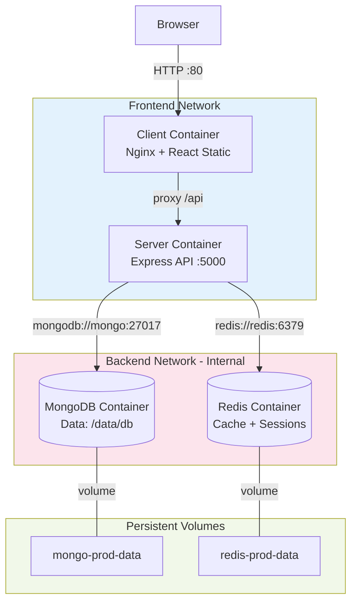
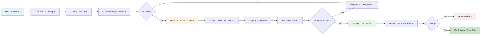

# File 31: Project — Containerize a Full MERN Stack Application

**Topic:** Hands-on — Full MERN app (React + Express + MongoDB + Redis) with development and production Dockerfiles, compose, and deployment

**WHY THIS MATTERS:**
Everything you have learned in Files 01-30 comes together here. This is not theory — this is a real, production-grade MERN application containerized from scratch. You will build dev and prod environments, CI pipelines, and monitoring. After completing this project, you can containerize ANY full-stack JavaScript application with confidence.

**Prerequisites:** Files 01-30 (all Docker fundamentals)

---

## Story: Building and Shipping a Complete Product

You have learned to lay bricks, mix cement, wire electricity, and plumb water pipes. Now it is time to build the complete house. This project is your capstone — every Docker concept applied to a real application.

Think of it like opening a restaurant in Mumbai:
- **DEV environment** = your test kitchen (experiment freely)
- **PROD environment** = the restaurant floor (customers see this)
- **Makefile** = your recipe book (standard procedures)
- **CI pipeline** = quality inspection before serving
- **Monitoring** = CCTV and temperature sensors

---

## Example Block 1 — Project Structure

### Section 1 — Directory Layout

**WHY:** A well-organized project structure makes containerization straightforward. Each service gets its own Dockerfile.

```
mern-app/
├── client/                     # React frontend
│   ├── Dockerfile              # Production Dockerfile
│   ├── Dockerfile.dev          # Development Dockerfile
│   ├── nginx.conf              # Nginx config for serving React
│   ├── package.json
│   ├── src/
│   │   ├── App.js
│   │   ├── index.js
│   │   └── components/
│   └── public/
│       └── index.html
│
├── server/                     # Express backend
│   ├── Dockerfile              # Production Dockerfile
│   ├── Dockerfile.dev          # Development Dockerfile
│   ├── package.json
│   ├── src/
│   │   ├── index.js
│   │   ├── routes/
│   │   ├── models/
│   │   └── middleware/
│   └── .dockerignore
│
├── docker-compose.yml          # Production compose
├── docker-compose.dev.yml      # Development compose
├── docker-compose.monitoring.yml # Monitoring stack
├── Makefile                    # Command shortcuts
├── .env.example                # Environment template
├── .github/
│   └── workflows/
│       └── ci.yml              # GitHub Actions CI/CD
└── scripts/
    ├── init-mongo.js           # MongoDB initialization
    └── wait-for-it.sh          # Service readiness check
```

---

## Example Block 2 — Development Dockerfiles

### Section 2 — Backend Dockerfile.dev (Hot Reload)

**WHY:** In development, you want hot reload — change code, see results instantly. No rebuilding images every time. Like the test kitchen: experiment, taste, adjust.

```dockerfile
# file: server/Dockerfile.dev
# DEVELOPMENT Dockerfile — hot reload with nodemon

# SYNTAX: Use the same base as production for consistency
FROM node:20-alpine

# WHY: Set working directory inside container
WORKDIR /app

# WHY: Install nodemon globally for hot reload
RUN npm install -g nodemon

# WHY: Copy package files first (Docker layer caching)
COPY package.json package-lock.json ./

# WHY: Install ALL dependencies (including devDependencies)
RUN npm ci

# WHY: We do NOT copy source code here!
# Source code will be mounted as a volume for hot reload.
# This means changes on your host appear instantly in container.

# WHY: Expose the dev server port and debugger port
EXPOSE 5000
EXPOSE 9229

# WHY: Start with nodemon for auto-restart on file changes
# --inspect=0.0.0.0:9229 enables remote debugging
CMD ["nodemon", "--inspect=0.0.0.0:9229", "src/index.js"]
```

### Section 3 — Frontend Dockerfile.dev (Hot Reload)

**WHY:** React's dev server (Vite/CRA) provides HMR (Hot Module Replacement) — UI updates without full page refresh.

```dockerfile
# file: client/Dockerfile.dev
# DEVELOPMENT Dockerfile — React with HMR

FROM node:20-alpine

WORKDIR /app

# WHY: Copy package files for layer caching
COPY package.json package-lock.json ./

# WHY: Install all dependencies
RUN npm ci

# WHY: Source code mounted via volume (not copied)
# EXPOSE the Vite dev server port
EXPOSE 5173

# WHY: CHOKIDAR_USEPOLLING enables file watching in Docker
# (needed because Docker volumes don't trigger inotify on macOS)
ENV CHOKIDAR_USEPOLLING=true
ENV WATCHPACK_POLLING=true

# WHY: Start the Vite dev server
CMD ["npm", "run", "dev", "--", "--host", "0.0.0.0"]
```

---

## Example Block 3 — Production Dockerfiles

### Section 4 — Backend Production Dockerfile (Multi-Stage)

**WHY:** Production images must be small, secure, and contain only what is needed to run. Multi-stage builds separate the build environment from the runtime environment.

```dockerfile
# file: server/Dockerfile
# PRODUCTION Dockerfile — multi-stage, minimal, secure

# ── STAGE 1: Build ──
FROM node:20-alpine AS builder
WORKDIR /app

COPY package.json package-lock.json ./
# WHY: --omit=dev installs only production dependencies
RUN npm ci --omit=dev

COPY src/ ./src/

# ── STAGE 2: Production Runtime ──
FROM node:20-alpine AS production

# WHY: Add labels for image metadata
LABEL maintainer="team@example.com"
LABEL version="1.0.0"
LABEL description="MERN App Backend API"

# WHY: Create non-root user for security
RUN addgroup -g 1001 appgroup && \
    adduser -u 1001 -G appgroup -D appuser

WORKDIR /app

# WHY: Copy only production node_modules and source
COPY --from=builder --chown=appuser:appgroup /app/node_modules ./node_modules
COPY --from=builder --chown=appuser:appgroup /app/src ./src
COPY --chown=appuser:appgroup package.json ./

# WHY: Switch to non-root user
USER appuser

# WHY: Expose only the application port
EXPOSE 5000

# WHY: Health check built into the image
HEALTHCHECK --interval=30s --timeout=5s --retries=3 --start-period=10s \
  CMD wget -qO- http://localhost:5000/health || exit 1

# WHY: Use node directly (not npm) for proper signal handling
CMD ["node", "src/index.js"]
```

### Section 5 — Frontend Production Dockerfile (Multi-Stage + Nginx)

**WHY:** In production, React is compiled to static files and served by Nginx — fast, secure, and efficient.

```dockerfile
# file: client/Dockerfile
# PRODUCTION Dockerfile — build React, serve with Nginx

# ── STAGE 1: Build React ──
FROM node:20-alpine AS builder
WORKDIR /app

COPY package.json package-lock.json ./
RUN npm ci

COPY . .

# WHY: Build the production bundle
# ARG allows passing build-time variables
ARG VITE_API_URL=/api
ENV VITE_API_URL=${VITE_API_URL}

RUN npm run build

# ── STAGE 2: Serve with Nginx ──
FROM nginx:alpine AS production

# WHY: Remove default nginx content
RUN rm -rf /usr/share/nginx/html/*

# WHY: Copy custom nginx config for SPA routing
COPY nginx.conf /etc/nginx/conf.d/default.conf

# WHY: Copy built React files from builder stage
COPY --from=builder /app/dist /usr/share/nginx/html

# WHY: Expose port 80
EXPOSE 80

# WHY: Health check for the frontend
HEALTHCHECK --interval=30s --timeout=5s --retries=3 \
  CMD wget -qO- http://localhost:80/health || exit 1

CMD ["nginx", "-g", "daemon off;"]
```

### Section 6 — Nginx Configuration for React SPA

**WHY:** React is a Single Page Application — all routes must serve index.html. Nginx also proxies /api to the backend.

```nginx
# file: client/nginx.conf
# Nginx config for React SPA with API proxy

server {
    listen 80;
    server_name _;
    root /usr/share/nginx/html;
    index index.html;

    # ── Gzip compression ──
    gzip on;
    gzip_types text/css application/javascript application/json image/svg+xml;
    gzip_min_length 1000;

    # ── SPA routing: serve index.html for all routes ──
    location / {
        try_files $uri $uri/ /index.html;
    }

    # ── API proxy: forward /api requests to backend ──
    location /api {
        proxy_pass http://server:5000;
        proxy_http_version 1.1;
        proxy_set_header Upgrade $http_upgrade;
        proxy_set_header Connection 'upgrade';
        proxy_set_header Host $host;
        proxy_set_header X-Real-IP $remote_addr;
        proxy_cache_bypass $http_upgrade;
    }

    # ── Static assets caching ──
    location ~* \.(js|css|png|jpg|jpeg|gif|ico|svg|woff2?)$ {
        expires 1y;
        add_header Cache-Control "public, immutable";
    }

    # ── Health check endpoint ──
    location /health {
        access_log off;
        return 200 "OK";
        add_header Content-Type text/plain;
    }
}
```

---

## Example Block 4 — Docker Compose Files

### Section 7 — Development Compose (Hot Reload + Debug)

**WHY:** The dev compose mounts source code as volumes so every change reflects immediately. Debug ports are open.

```yaml
# file: docker-compose.dev.yml
# DEVELOPMENT compose — hot reload, debug ports, volumes

version: "3.8"

services:
  # ── React Frontend (dev server with HMR) ──
  client:
    build:
      context: ./client
      dockerfile: Dockerfile.dev
    ports:
      - "5173:5173"          # Vite dev server
    volumes:
      - ./client/src:/app/src          # Hot reload source
      - ./client/public:/app/public    # Hot reload public
      - client-node-modules:/app/node_modules  # Named volume
    environment:
      - VITE_API_URL=http://localhost:5000
    depends_on:
      - server
    networks:
      - frontend

  # ── Express Backend (nodemon with debugger) ──
  server:
    build:
      context: ./server
      dockerfile: Dockerfile.dev
    ports:
      - "5000:5000"          # API port
      - "9229:9229"          # Node.js debugger
    volumes:
      - ./server/src:/app/src          # Hot reload source
      - server-node-modules:/app/node_modules
    environment:
      - NODE_ENV=development
      - MONGO_URI=mongodb://mongo:27017/mernapp
      - REDIS_URL=redis://redis:6379
      - JWT_SECRET=dev-secret-key-change-in-prod
    depends_on:
      mongo:
        condition: service_healthy
      redis:
        condition: service_healthy
    networks:
      - frontend
      - backend

  # ── MongoDB ──
  mongo:
    image: mongo:7
    ports:
      - "27017:27017"        # Accessible from host for tools
    volumes:
      - mongo-data:/data/db
      - ./scripts/init-mongo.js:/docker-entrypoint-initdb.d/init.js:ro
    healthcheck:
      test: ["CMD", "mongosh", "--eval", "db.adminCommand('ping')"]
      interval: 10s
      timeout: 5s
      retries: 3
      start_period: 10s
    networks:
      - backend

  # ── Redis ──
  redis:
    image: redis:7-alpine
    ports:
      - "6379:6379"          # Accessible from host for debugging
    volumes:
      - redis-data:/data
    healthcheck:
      test: ["CMD", "redis-cli", "ping"]
      interval: 10s
      timeout: 5s
      retries: 3
    networks:
      - backend

  # ── Mongo Express (DB GUI) ──
  mongo-express:
    image: mongo-express:latest
    ports:
      - "8081:8081"
    environment:
      - ME_CONFIG_MONGODB_URL=mongodb://mongo:27017
    depends_on:
      mongo:
        condition: service_healthy
    networks:
      - backend

volumes:
  mongo-data:
  redis-data:
  client-node-modules:
  server-node-modules:

networks:
  frontend:
  backend:
```

### Section 8 — Production Compose

**WHY:** Production compose uses built images, no volumes for source code, secrets for credentials, resource limits, and restart policies.

```yaml
# file: docker-compose.yml
# PRODUCTION compose — built images, secrets, resource limits

version: "3.8"

services:
  # ── React Frontend (Nginx serving static files) ──
  client:
    build:
      context: ./client
      dockerfile: Dockerfile
      args:
        VITE_API_URL: /api
    ports:
      - "80:80"
    restart: unless-stopped
    deploy:
      resources:
        limits:
          cpus: "0.5"
          memory: 128M
    depends_on:
      server:
        condition: service_healthy
    networks:
      - frontend

  # ── Express Backend ──
  server:
    build:
      context: ./server
      dockerfile: Dockerfile
    expose:
      - "5000"              # Internal only — nginx proxies
    restart: unless-stopped
    environment:
      - NODE_ENV=production
      - MONGO_URI=mongodb://mongo:27017/mernapp
      - REDIS_URL=redis://redis:6379
    env_file:
      - .env.production
    deploy:
      resources:
        limits:
          cpus: "1.0"
          memory: 512M
    depends_on:
      mongo:
        condition: service_healthy
      redis:
        condition: service_healthy
    networks:
      - frontend
      - backend
    healthcheck:
      test: ["CMD", "wget", "-qO-", "http://localhost:5000/health"]
      interval: 30s
      timeout: 5s
      retries: 3
      start_period: 15s

  # ── MongoDB ──
  mongo:
    image: mongo:7
    volumes:
      - mongo-prod-data:/data/db
      - ./scripts/init-mongo.js:/docker-entrypoint-initdb.d/init.js:ro
    restart: unless-stopped
    deploy:
      resources:
        limits:
          cpus: "1.0"
          memory: 1G
    healthcheck:
      test: ["CMD", "mongosh", "--eval", "db.adminCommand('ping')"]
      interval: 30s
      timeout: 10s
      retries: 5
      start_period: 30s
    networks:
      - backend

  # ── Redis ──
  redis:
    image: redis:7-alpine
    command: redis-server --maxmemory 128mb --maxmemory-policy allkeys-lru
    volumes:
      - redis-prod-data:/data
    restart: unless-stopped
    deploy:
      resources:
        limits:
          cpus: "0.5"
          memory: 256M
    healthcheck:
      test: ["CMD", "redis-cli", "ping"]
      interval: 30s
      timeout: 5s
      retries: 3
    networks:
      - backend

volumes:
  mongo-prod-data:
  redis-prod-data:

networks:
  frontend:
  backend:
    internal: true         # No external access to DB network
```

### Mermaid Diagram — MERN Architecture in Docker

> Paste this into https://mermaid.live to visualize



---

## Example Block 5 — Makefile for Docker Commands

### Section 9 — Makefile (Recipe Book)

**WHY:** Nobody wants to type long docker compose commands. A Makefile gives your team simple, memorable commands.

```makefile
# file: Makefile
# Docker command shortcuts — the recipe book

.PHONY: help dev prod stop clean logs test build push deploy

# ── Default: show help ──
help: ## Show this help
	@grep -E '^[a-zA-Z_-]+:.*?## .*$$' $(MAKEFILE_LIST) | \
	  awk 'BEGIN {FS = ":.*?## "}; {printf "\033[36m%-15s\033[0m %s\n", $$1, $$2}'

# ── Development ──
dev: ## Start development environment
	docker compose -f docker-compose.dev.yml up --build

dev-d: ## Start dev environment (detached)
	docker compose -f docker-compose.dev.yml up --build -d

dev-down: ## Stop development environment
	docker compose -f docker-compose.dev.yml down

# ── Production ──
prod: ## Start production environment
	docker compose -f docker-compose.yml up --build -d

prod-down: ## Stop production environment
	docker compose -f docker-compose.yml down

# ── Logs ──
logs: ## Show all logs
	docker compose -f docker-compose.dev.yml logs -f

logs-server: ## Show server logs only
	docker compose -f docker-compose.dev.yml logs -f server

logs-client: ## Show client logs only
	docker compose -f docker-compose.dev.yml logs -f client

# ── Testing ──
test: ## Run tests in container
	docker compose -f docker-compose.dev.yml exec server npm test

test-watch: ## Run tests in watch mode
	docker compose -f docker-compose.dev.yml exec server npm run test:watch

# ── Build & Push ──
build: ## Build production images
	docker compose -f docker-compose.yml build

push: ## Push images to registry
	docker compose -f docker-compose.yml push

# ── Database ──
db-shell: ## Open MongoDB shell
	docker compose -f docker-compose.dev.yml exec mongo mongosh mernapp

db-backup: ## Backup MongoDB
	docker compose -f docker-compose.dev.yml exec mongo \
	  mongodump --archive --gzip --db mernapp > backup-$$(date +%Y%m%d).gz

db-restore: ## Restore MongoDB from backup
	docker compose -f docker-compose.dev.yml exec -T mongo \
	  mongorestore --archive --gzip --db mernapp < $(BACKUP_FILE)

# ── Cleanup ──
clean: ## Remove all containers, volumes, and images
	docker compose -f docker-compose.dev.yml down -v --rmi local
	docker compose -f docker-compose.yml down -v --rmi local

prune: ## Docker system prune
	docker system prune -af --volumes

# ── SSH into containers ──
shell-server: ## Shell into server container
	docker compose -f docker-compose.dev.yml exec server sh

shell-client: ## Shell into client container
	docker compose -f docker-compose.dev.yml exec client sh

# ── Status ──
ps: ## Show running containers
	docker compose -f docker-compose.dev.yml ps

stats: ## Show container resource usage
	docker stats --no-stream
```

---

## Example Block 6 — CI/CD Pipeline

### Section 10 — GitHub Actions CI Pipeline

**WHY:** Every push should build, test, and validate. The CI pipeline is your quality inspector — nothing reaches production without passing inspection.

```yaml
# file: .github/workflows/ci.yml
# GitHub Actions CI/CD pipeline for MERN Docker app

name: CI/CD Pipeline

on:
  push:
    branches: [main, develop]
  pull_request:
    branches: [main]

env:
  REGISTRY: ghcr.io
  IMAGE_PREFIX: ghcr.io/${{ github.repository }}

jobs:
  # ── JOB 1: Lint and Test ──
  test:
    runs-on: ubuntu-latest
    steps:
      - uses: actions/checkout@v4

      - name: Build test images
        run: docker compose -f docker-compose.dev.yml build

      - name: Start services
        run: docker compose -f docker-compose.dev.yml up -d

      - name: Wait for services
        run: |
          timeout 60 bash -c 'until docker compose -f docker-compose.dev.yml exec -T server wget -qO- http://localhost:5000/health; do sleep 2; done'

      - name: Run server tests
        run: docker compose -f docker-compose.dev.yml exec -T server npm test

      - name: Run client tests
        run: docker compose -f docker-compose.dev.yml exec -T client npm test

      - name: Stop services
        if: always()
        run: docker compose -f docker-compose.dev.yml down -v

  # ── JOB 2: Build Production Images ──
  build:
    needs: test
    runs-on: ubuntu-latest
    if: github.ref == 'refs/heads/main'
    steps:
      - uses: actions/checkout@v4

      - name: Log in to Container Registry
        uses: docker/login-action@v3
        with:
          registry: ghcr.io
          username: ${{ github.actor }}
          password: ${{ secrets.GITHUB_TOKEN }}

      - name: Build and push server
        uses: docker/build-push-action@v5
        with:
          context: ./server
          push: true
          tags: |
            ${{ env.IMAGE_PREFIX }}/server:latest
            ${{ env.IMAGE_PREFIX }}/server:${{ github.sha }}

      - name: Build and push client
        uses: docker/build-push-action@v5
        with:
          context: ./client
          push: true
          tags: |
            ${{ env.IMAGE_PREFIX }}/client:latest
            ${{ env.IMAGE_PREFIX }}/client:${{ github.sha }}

  # ── JOB 3: Deploy ──
  deploy:
    needs: build
    runs-on: ubuntu-latest
    if: github.ref == 'refs/heads/main'
    steps:
      - name: Deploy to server
        uses: appleboy/ssh-action@v1
        with:
          host: ${{ secrets.DEPLOY_HOST }}
          username: ${{ secrets.DEPLOY_USER }}
          key: ${{ secrets.DEPLOY_KEY }}
          script: |
            cd /app
            docker compose pull
            docker compose up -d --remove-orphans
            docker image prune -f
```

### Mermaid Diagram — CI/CD Pipeline

> Paste this into https://mermaid.live to visualize



---

## Example Block 7 — Monitoring Stack

### Section 11 — Monitoring Compose (Prometheus + Grafana)

**WHY:** You cannot improve what you cannot measure. Monitoring tells you if your restaurant kitchen is on fire before customers start complaining.

```yaml
# file: docker-compose.monitoring.yml
# Monitoring stack — Prometheus + Grafana + Node Exporter

version: "3.8"

services:
  # ── Prometheus (metrics collector) ──
  prometheus:
    image: prom/prometheus:latest
    volumes:
      - ./monitoring/prometheus.yml:/etc/prometheus/prometheus.yml:ro
      - prometheus-data:/prometheus
    ports:
      - "9090:9090"
    networks:
      - monitoring
      - backend
    restart: unless-stopped

  # ── Grafana (visualization dashboards) ──
  grafana:
    image: grafana/grafana:latest
    volumes:
      - grafana-data:/var/lib/grafana
    ports:
      - "3000:3000"
    environment:
      - GF_SECURITY_ADMIN_PASSWORD=admin
      - GF_USERS_ALLOW_SIGN_UP=false
    networks:
      - monitoring
    restart: unless-stopped
    depends_on:
      - prometheus

  # ── Node Exporter (host metrics) ──
  node-exporter:
    image: prom/node-exporter:latest
    networks:
      - monitoring
    restart: unless-stopped

  # ── cAdvisor (container metrics) ──
  cadvisor:
    image: gcr.io/cadvisor/cadvisor:latest
    volumes:
      - /var/run/docker.sock:/var/run/docker.sock:ro
      - /sys:/sys:ro
      - /var/lib/docker:/var/lib/docker:ro
    ports:
      - "8080:8080"
    networks:
      - monitoring
    restart: unless-stopped

volumes:
  prometheus-data:
  grafana-data:

networks:
  monitoring:
    driver: bridge
  backend:
    external: true
    name: mern-app_backend
```

### Section 12 — Running the Complete Stack

**WHY:** Here are the actual commands to run everything together.

**Development (with hot reload):**

```bash
make dev
# OR: docker compose -f docker-compose.dev.yml up --build
```

**Production:**

```bash
make prod
# OR: docker compose -f docker-compose.yml up --build -d
```

**Production + Monitoring:**

```bash
docker compose -f docker-compose.yml \
  -f docker-compose.monitoring.yml \
  up --build -d
```

**Check everything is running:**

```bash
make ps
```

**EXPECTED OUTPUT:**
```
NAME         SERVICE   STATUS        PORTS
client       client    Up (healthy)  0.0.0.0:80->80/tcp
server       server    Up (healthy)  5000/tcp
mongo        mongo     Up (healthy)  27017/tcp
redis        redis     Up (healthy)  6379/tcp
prometheus   prom      Up            0.0.0.0:9090->9090/tcp
grafana      grafana   Up            0.0.0.0:3000->3000/tcp
```

**Access points:**

| Service | URL |
|---------|-----|
| App | http://localhost (prod) or http://localhost:5173 (dev) |
| API | http://localhost/api or http://localhost:5000 (dev) |
| MongoDB GUI | http://localhost:8081 (dev only) |
| Prometheus | http://localhost:9090 |
| Grafana | http://localhost:3000 (admin/admin) |

### Section 13 — .dockerignore Files

**WHY:** Keep your build context small and avoid copying unnecessary files into the image.

**server/.dockerignore:**

```
node_modules
npm-debug.log
.env
.env.*
Dockerfile*
docker-compose*
.git
.gitignore
README.md
tests/
coverage/
.vscode/
```

**client/.dockerignore:**

```
node_modules
npm-debug.log
.env
.env.*
Dockerfile*
docker-compose*
.git
.gitignore
README.md
dist/
build/
coverage/
.vscode/
```

---

## Key Takeaways

1. **TWO DOCKERFILES PER SERVICE**
   - `Dockerfile.dev` → hot reload, debug ports, dev dependencies
   - `Dockerfile` → multi-stage, minimal, production-ready

2. **TWO COMPOSE FILES**
   - `docker-compose.dev.yml` → volumes for code, exposed ports, DB GUI
   - `docker-compose.yml` → built images, internal networks, resource limits

3. **MAKEFILE = YOUR RECIPE BOOK**
   - `make dev` → start development
   - `make prod` → start production
   - `make test` → run tests
   - No more memorizing long commands

4. **CI/CD PIPELINE**
   - Every push: build → test → deploy
   - GitHub Actions with Docker build-push-action
   - Automatic deployment on main branch

5. **MONITORING**
   - Prometheus + Grafana for metrics
   - cAdvisor for container-level monitoring
   - Health checks on every service

6. **KEY PATTERNS**
   - Layer caching: copy package.json before source code
   - Named volumes: preserve node_modules in dev
   - Internal networks: isolate database tier
   - Non-root user: security best practice
   - Health checks: deployment gating

> This is a complete, production-ready MERN Docker setup. Use it as a template for your own projects.
