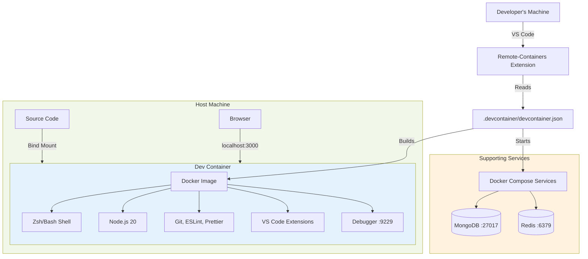
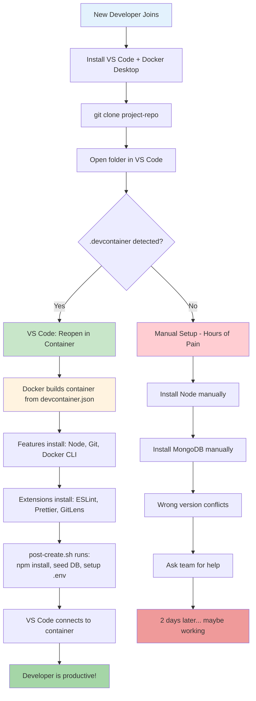

# File 32: Project — Docker-Based Development Environment

**Topic:** Hands-on — Dev containers, VS Code devcontainers, reproducible environments, onboarding new developers

**WHY THIS MATTERS:**
"It works on my machine" is the most expensive sentence in software engineering. Different Node versions, missing system libraries, conflicting Python installations — these waste hours of developer time. Dev containers solve this by putting the ENTIRE development environment inside a container. Every developer gets the exact same setup, instantly.

**Prerequisites:** Files 01-31 (all Docker fundamentals)

---

## Story: "Works on My Machine" → "Works on Every Machine"

Imagine a new chef joining a restaurant in Mumbai. On day one, they arrive and find:
- A different stove than they trained on
- Spices stored in unlabeled jars
- No recipe book
- The old chef left notes in Marathi, but the new one reads Hindi

They spend their first WEEK just figuring out the kitchen before they can cook a single dish.

Now imagine a FRANCHISED restaurant (like Haldiram's):
- Every kitchen is IDENTICAL — same layout, same equipment
- Spices are labeled and standardized
- Recipe book is provided on day one
- Training video plays automatically

The new chef cooks their first dish on DAY ONE.

Dev containers are the franchise model for development. Every developer opens the project and gets:
- The exact right Node/Python/Java version
- All tools pre-installed (linters, formatters, debuggers)
- VS Code extensions already configured
- Database and services running
- One command: "Open in Container" — done.

---

## Example Block 1 — Devcontainer Fundamentals

### Section 1 — What is a Dev Container?

**WHY:** A dev container is a Docker container specifically configured for development. VS Code (and other IDEs) can connect to it, giving you a full IDE experience inside a containerized environment.

**What is a Dev Container?**

A Docker container that serves as your DEVELOPMENT ENVIRONMENT. Your IDE connects to it and runs code INSIDE the container.

**Traditional Development:**
```
Developer Machine → Install Node 20 → Install MongoDB → Install Redis
→ Install Python → Configure PATH → Fix version conflicts → FRUSTRATION
```

**Dev Container Development:**
```
Developer Machine → Open VS Code → "Reopen in Container" → DONE
Everything is pre-installed, pre-configured, identical for everyone.
```

**How it works:**
1. You define a `.devcontainer/devcontainer.json` file
2. VS Code reads it and builds/pulls the container
3. VS Code connects to the container via Remote-Containers extension
4. Your terminal, debugger, extensions all run INSIDE the container
5. Source code is mounted from your host (changes persist)

### Section 2 — Project Directory Structure

**WHY:** Understanding the file layout is the first step to setting up dev containers properly.

```
my-project/
├── .devcontainer/
│   ├── devcontainer.json       # Main configuration file
│   ├── Dockerfile              # Custom dev container image
│   ├── docker-compose.yml      # Multi-service dev environment
│   └── post-create.sh          # Setup script (runs once)
│
├── .vscode/
│   ├── settings.json           # Workspace settings
│   ├── launch.json             # Debug configurations
│   └── extensions.json         # Recommended extensions
│
├── src/                        # Your application source
├── package.json
├── .env.example
└── README.md
```

---

## Example Block 2 — Basic Devcontainer Configuration

### Section 3 — Simple devcontainer.json

**WHY:** The devcontainer.json file is the single source of truth for your development environment. It tells VS Code exactly how to build and configure the container.

```jsonc
// file: .devcontainer/devcontainer.json
// Basic devcontainer for a Node.js project

{
  // Display name in VS Code
  "name": "My MERN Project",

  // ── OPTION A: Use a pre-built image ──
  // "image": "mcr.microsoft.com/devcontainers/javascript-node:20",

  // ── OPTION B: Use a custom Dockerfile ──
  "build": {
    "dockerfile": "Dockerfile",
    "context": "..",
    "args": {
      "NODE_VERSION": "20"
    }
  },

  // ── Features: Install additional tools ──
  // WHY: Features are pre-packaged tool installers — no need
  // to write Dockerfile commands for common tools.
  "features": {
    "ghcr.io/devcontainers/features/node:1": {
      "version": "20"
    },
    "ghcr.io/devcontainers/features/git:1": {},
    "ghcr.io/devcontainers/features/github-cli:1": {},
    "ghcr.io/devcontainers/features/docker-in-docker:2": {},
    "ghcr.io/devcontainers/features/common-utils:2": {
      "installZsh": true,
      "configureZshAsDefaultShell": true
    }
  },

  // ── VS Code Customizations ──
  "customizations": {
    "vscode": {
      // Extensions installed automatically inside container
      "extensions": [
        "dbaeumer.vscode-eslint",
        "esbenp.prettier-vscode",
        "bradlc.vscode-tailwindcss",
        "mongodb.mongodb-vscode",
        "ms-azuretools.vscode-docker",
        "eamodio.gitlens",
        "usernamehw.errorlens",
        "christian-kohler.path-intellisense",
        "formulahendry.auto-rename-tag",
        "ms-vscode.vscode-typescript-next"
      ],

      // VS Code settings inside the container
      "settings": {
        "editor.defaultFormatter": "esbenp.prettier-vscode",
        "editor.formatOnSave": true,
        "editor.codeActionsOnSave": {
          "source.fixAll.eslint": "explicit"
        },
        "terminal.integrated.defaultProfile.linux": "zsh",
        "files.eol": "\n"
      }
    }
  },

  // ── Forwarded Ports ──
  // WHY: Makes container ports accessible from your host browser
  "forwardPorts": [3000, 5000, 27017, 6379, 9229],

  // ── Port Labels (shown in VS Code Ports panel) ──
  "portsAttributes": {
    "3000": { "label": "Frontend (React)" },
    "5000": { "label": "Backend (Express)" },
    "27017": { "label": "MongoDB" },
    "6379": { "label": "Redis" },
    "9229": { "label": "Node Debugger" }
  },

  // ── Lifecycle Commands ──
  // WHY: Automate setup steps so developers never forget them.

  // Runs ONCE after container is created (first time only)
  "postCreateCommand": "bash .devcontainer/post-create.sh",

  // Runs EVERY TIME the container starts
  "postStartCommand": "echo 'Dev container ready!'",

  // Runs EVERY TIME VS Code attaches to the container
  "postAttachCommand": "git fetch --all",

  // ── Environment Variables ──
  "containerEnv": {
    "NODE_ENV": "development",
    "MONGO_URI": "mongodb://mongo:27017/myapp",
    "REDIS_URL": "redis://redis:6379"
  },

  // ── Run as non-root user ──
  "remoteUser": "node",

  // ── Mount options ──
  "mounts": [
    // Persist bash/zsh history between rebuilds
    "source=devcontainer-history,target=/commandhistory,type=volume",
    // Persist npm cache
    "source=devcontainer-npm-cache,target=/home/node/.npm,type=volume"
  ],

  // ── Shutdown action ──
  "shutdownAction": "stopCompose"
}
```

### Section 4 — Custom Dockerfile for Dev Container

**WHY:** When pre-built images are not enough, write a custom Dockerfile with all the tools your team needs.

```dockerfile
# file: .devcontainer/Dockerfile
# Custom development container image

ARG NODE_VERSION=20
FROM mcr.microsoft.com/devcontainers/javascript-node:${NODE_VERSION}

# WHY: Install system-level tools your project needs
RUN apt-get update && apt-get install -y --no-install-recommends \
    # Build tools for native npm modules
    build-essential \
    python3 \
    # Network debugging
    curl \
    wget \
    dnsutils \
    iputils-ping \
    # MongoDB tools
    mongosh \
    # Image processing (if using sharp)
    libvips-dev \
    # Clean up
    && apt-get clean \
    && rm -rf /var/lib/apt/lists/*

# WHY: Install global npm tools that every developer needs
RUN su node -c "npm install -g \
    nodemon \
    typescript \
    ts-node \
    jest \
    prettier \
    eslint \
    npm-check-updates \
    commitizen \
    cz-conventional-changelog"

# WHY: Configure git (team standards)
RUN git config --system core.autocrlf input && \
    git config --system init.defaultBranch main

# WHY: Set up shell environment
USER node

# Configure commitizen
RUN echo '{ "path": "cz-conventional-changelog" }' > /home/node/.czrc

# Configure zsh (if installed via features)
RUN echo 'export PATH="/home/node/.npm-global/bin:$PATH"' >> /home/node/.zshrc 2>/dev/null || true
```

### Section 5 — Post-Create Setup Script

**WHY:** This script runs once after the container is created. It handles first-time setup: install dependencies, seed the database, configure local settings.

```bash
#!/bin/bash
# file: .devcontainer/post-create.sh
# Runs ONCE after the dev container is created

set -e

echo "============================================"
echo "  Setting up development environment..."
echo "============================================"

# ── Step 1: Install project dependencies ──
echo "[1/5] Installing dependencies..."
npm install

# If monorepo, install all workspaces
# npm install --workspaces

# ── Step 2: Copy environment file ──
echo "[2/5] Setting up environment..."
if [ ! -f .env ]; then
  cp .env.example .env
  echo "  Created .env from .env.example"
else
  echo "  .env already exists, skipping"
fi

# ── Step 3: Seed the database ──
echo "[3/5] Seeding database..."
# Wait for MongoDB to be ready
until mongosh --host mongo --eval "db.adminCommand('ping')" &>/dev/null; do
  echo "  Waiting for MongoDB..."
  sleep 2
done
echo "  MongoDB is ready!"

# Run seed script if it exists
if [ -f scripts/seed.js ]; then
  node scripts/seed.js
  echo "  Database seeded successfully"
fi

# ── Step 4: Generate types / build shared libs ──
echo "[4/5] Building shared libraries..."
# npm run build:types 2>/dev/null || true

# ── Step 5: Configure git hooks ──
echo "[5/5] Setting up git hooks..."
npx husky install 2>/dev/null || true

echo "============================================"
echo "  Development environment is ready!"
echo "  Run 'npm run dev' to start the app."
echo "============================================"
```

### Mermaid Diagram — Devcontainer Architecture

> Paste this into https://mermaid.live to visualize



---

## Example Block 3 — Devcontainer with Docker Compose

### Section 6 — Multi-Service Dev Environment

**WHY:** Real projects need databases, caches, and other services. Using Docker Compose in devcontainers gives you a complete development environment — app + all dependencies.

```jsonc
// file: .devcontainer/devcontainer.json (Compose version)
// When you need MongoDB, Redis, etc. alongside your dev container

{
  "name": "MERN Full Stack Dev",

  // WHY: Use docker-compose instead of a single Dockerfile
  "dockerComposeFile": "docker-compose.yml",

  // WHY: Which service is the "main" container VS Code connects to
  "service": "app",

  // WHY: Where in the container your source code lives
  "workspaceFolder": "/workspace",

  "customizations": {
    "vscode": {
      "extensions": [
        "dbaeumer.vscode-eslint",
        "esbenp.prettier-vscode",
        "mongodb.mongodb-vscode",
        "ms-azuretools.vscode-docker",
        "eamodio.gitlens",
        "humao.rest-client",
        "usernamehw.errorlens",
        "streetsidesoftware.code-spell-checker"
      ],
      "settings": {
        "editor.defaultFormatter": "esbenp.prettier-vscode",
        "editor.formatOnSave": true,
        "terminal.integrated.defaultProfile.linux": "zsh"
      }
    }
  },

  "forwardPorts": [3000, 5000, 27017, 6379, 8081],

  "portsAttributes": {
    "3000": { "label": "Frontend", "onAutoForward": "openBrowser" },
    "5000": { "label": "Backend API" },
    "27017": { "label": "MongoDB" },
    "6379": { "label": "Redis" },
    "8081": { "label": "Mongo Express" }
  },

  "postCreateCommand": "bash .devcontainer/post-create.sh",
  "remoteUser": "node",
  "shutdownAction": "stopCompose"
}
```

```yaml
# file: .devcontainer/docker-compose.yml
# Complete dev environment with all services

version: "3.8"

services:
  # ── Main Dev Container (VS Code connects here) ──
  app:
    build:
      context: ..
      dockerfile: .devcontainer/Dockerfile
    volumes:
      # Mount source code
      - ..:/workspace:cached
      # Persist VS Code extensions
      - vscode-extensions:/home/node/.vscode-server/extensions
      # Persist command history
      - command-history:/commandhistory
      # Persist npm cache
      - npm-cache:/home/node/.npm
      # Mount Docker socket for Docker-in-Docker
      - /var/run/docker.sock:/var/run/docker.sock
    command: sleep infinity    # Keep container running
    environment:
      - NODE_ENV=development
      - MONGO_URI=mongodb://mongo:27017/myapp
      - REDIS_URL=redis://redis:6379
      - CHOKIDAR_USEPOLLING=true
    ports:
      - "3000:3000"   # Frontend
      - "5000:5000"   # Backend
      - "9229:9229"   # Debugger
    networks:
      - devnet
    depends_on:
      mongo:
        condition: service_healthy
      redis:
        condition: service_healthy

  # ── MongoDB ──
  mongo:
    image: mongo:7
    volumes:
      - mongo-data:/data/db
      - ../scripts/init-mongo.js:/docker-entrypoint-initdb.d/init.js:ro
    environment:
      MONGO_INITDB_DATABASE: myapp
    healthcheck:
      test: ["CMD", "mongosh", "--eval", "db.adminCommand('ping')"]
      interval: 10s
      timeout: 5s
      retries: 5
      start_period: 15s
    networks:
      - devnet

  # ── Redis ──
  redis:
    image: redis:7-alpine
    volumes:
      - redis-data:/data
    healthcheck:
      test: ["CMD", "redis-cli", "ping"]
      interval: 10s
      timeout: 5s
      retries: 3
    networks:
      - devnet

  # ── Mongo Express (Database GUI) ──
  mongo-express:
    image: mongo-express:latest
    ports:
      - "8081:8081"
    environment:
      ME_CONFIG_MONGODB_URL: mongodb://mongo:27017
      ME_CONFIG_BASICAUTH: "false"
    depends_on:
      mongo:
        condition: service_healthy
    networks:
      - devnet

volumes:
  mongo-data:
  redis-data:
  vscode-extensions:
  command-history:
  npm-cache:

networks:
  devnet:
    driver: bridge
```

---

## Example Block 4 — Team Standardization

### Section 7 — Standardizing the Team Environment

**WHY:** Dev containers are most powerful when the ENTIRE team uses them. Standardization eliminates "works on my machine" forever — like Haldiram's standardized kitchen.

**Team Standardization Checklist:**

1. **COMMIT .devcontainer/ TO VERSION CONTROL**
   - devcontainer.json, Dockerfile, docker-compose.yml, post-create.sh
   - Everyone clones the repo and gets the exact same environment
   - No more setup documentation that goes stale

2. **PIN ALL VERSIONS**
   - Node version: `"20.11.0"` (not just `"20"`)
   - MongoDB: `"mongo:7.0.5"` (not `"mongo:latest"`)
   - All npm global tools: specific versions
   - **WHY:** "latest" today may break tomorrow

3. **USE FEATURES FOR COMMON TOOLS**
   - Don't reinvent tool installation in Dockerfiles
   - Features are maintained by the community
   - Available at: https://containers.dev/features

4. **SHARE VS CODE SETTINGS**
   - Put formatOnSave, linting rules in devcontainer.json
   - Every developer gets the same editor behavior
   - No more "tabs vs spaces" debates

5. **AUTOMATE ONBOARDING**
   - postCreateCommand installs deps, seeds DB, sets up .env
   - New developer: git clone → open in VS Code → done
   - Target: productive on DAY ONE (not day five)

### Section 8 — VS Code Debug Configuration

**WHY:** Debugging should work out of the box. No configuration needed by individual developers.

```jsonc
// file: .vscode/launch.json
// Debug configurations — works inside dev container

{
  "version": "0.2.0",
  "configurations": [
    {
      "name": "Debug Server",
      "type": "node",
      "request": "attach",
      "port": 9229,
      "restart": true,
      "skipFiles": ["<node_internals>/**", "node_modules/**"],
      "sourceMaps": true,
      "localRoot": "${workspaceFolder}/server",
      "remoteRoot": "/workspace/server"
    },
    {
      "name": "Debug Current Test File",
      "type": "node",
      "request": "launch",
      "program": "${workspaceFolder}/node_modules/.bin/jest",
      "args": [
        "--runInBand",
        "--no-coverage",
        "${relativeFile}"
      ],
      "console": "integratedTerminal",
      "internalConsoleOptions": "neverOpen"
    },
    {
      "name": "Debug All Tests",
      "type": "node",
      "request": "launch",
      "program": "${workspaceFolder}/node_modules/.bin/jest",
      "args": ["--runInBand", "--no-coverage"],
      "console": "integratedTerminal"
    }
  ],
  "compounds": [
    {
      "name": "Full Stack Debug",
      "configurations": ["Debug Server"]
    }
  ]
}
```

### Section 9 — Devcontainer Features Deep Dive

**WHY:** Features are pre-built, composable tool packages. Instead of writing complex Dockerfile commands, you declare what you need in devcontainer.json.

Features are declared in devcontainer.json under `"features"`:

```jsonc
"features": {
  // ── Language Runtimes ──
  "ghcr.io/devcontainers/features/node:1": {
    "version": "20",
    "nodeGypDependencies": true
  },
  "ghcr.io/devcontainers/features/python:1": {
    "version": "3.12"
  },

  // ── Docker Tools ──
  "ghcr.io/devcontainers/features/docker-in-docker:2": {
    "dockerDashComposeVersion": "v2"
  },

  // ── CLI Tools ──
  "ghcr.io/devcontainers/features/github-cli:1": {},
  "ghcr.io/devcontainers/features/aws-cli:1": {},
  "ghcr.io/devcontainers/features/azure-cli:1": {},
  "ghcr.io/devcontainers/features/terraform:1": {},
  "ghcr.io/devcontainers/features/kubectl-helm-minikube:1": {},

  // ── Shell Customization ──
  "ghcr.io/devcontainers/features/common-utils:2": {
    "installZsh": true,
    "configureZshAsDefaultShell": true,
    "installOhMyZsh": true,
    "installOhMyZshConfig": true
  }
}
```

**FINDING FEATURES:**
- Browse: https://containers.dev/features
- Search: https://github.com/devcontainers/features

**CREATING CUSTOM FEATURES:**
You can create and publish your own features for team-specific tools. See: https://containers.dev/implementors/features/

---

## Example Block 5 — Advanced Patterns

### Section 10 — GitHub Codespaces Integration

**WHY:** GitHub Codespaces uses devcontainer.json to create cloud-based dev environments. Same config works locally and in the cloud.

**How to use:**
1. Go to your GitHub repo
2. Click "Code" → "Codespaces" → "Create codespace"
3. VS Code opens in your browser with the full environment
4. Or open the codespace in local VS Code

**Codespace-specific settings** (add to devcontainer.json):

```jsonc
{
  // Pre-build the container image for faster startup
  "hostRequirements": {
    "cpus": 4,
    "memory": "8gb",
    "storage": "32gb"
  },

  // Secrets available in Codespaces
  // (set in GitHub repo settings, not in code)
  "secrets": {
    "NPM_TOKEN": {
      "description": "npm auth token for private packages"
    },
    "DATABASE_URL": {
      "description": "Connection string for external database"
    }
  }
}
```

**Pre-builds:** Configure in repo Settings → Codespaces → Prebuild. Codespace starts in seconds instead of minutes.

### Section 11 — Handling Multiple Projects / Monorepos

**WHY:** Monorepos need special configuration — different services may need different tools and environments.

```
my-monorepo/
├── .devcontainer/
│   ├── devcontainer.json           # Default (full stack)
│   ├── docker-compose.yml
│   └── Dockerfile
├── .devcontainer/frontend/
│   ├── devcontainer.json           # Frontend only
│   └── Dockerfile
├── .devcontainer/backend/
│   ├── devcontainer.json           # Backend only
│   └── Dockerfile
├── packages/
│   ├── frontend/
│   ├── backend/
│   └── shared/
└── package.json
```

VS Code shows a picker when multiple configs exist:
- "Select a devcontainer configuration"
  - "MERN Full Stack Dev"
  - "Frontend Only"
  - "Backend Only"

**WHY:** Frontend developers don't need MongoDB tools. Backend developers don't need Vite/React tools. Full-stack developers get everything.

### Section 12 — Common Devcontainer Commands

**WHY:** These are the VS Code commands and CLI tools you use daily with dev containers.

**VS Code Command Palette (Ctrl+Shift+P / Cmd+Shift+P):**

| Command | Description |
|---------|-------------|
| `Dev Containers: Reopen in Container` | Start the dev container |
| `Dev Containers: Rebuild Container` | Rebuild after Dockerfile changes |
| `Dev Containers: Rebuild Without Cache` | Full rebuild (clears layers) |
| `Dev Containers: Reopen Folder Locally` | Exit the dev container |
| `Dev Containers: Open Container Log` | View build/start logs |
| `Dev Containers: Show Container Log` | View running container logs |

**CLI Tool (devcontainer CLI):**

```bash
# Install: npm install -g @devcontainers/cli

# Build the dev container
devcontainer build --workspace-folder .

# Start the dev container
devcontainer up --workspace-folder .

# Run a command inside the dev container
devcontainer exec --workspace-folder . npm test
```

**EXPECTED OUTPUT:**
```
[1/5] Building dev container...
[2/5] Starting services...
[3/5] Running post-create command...
[4/5] Installing extensions...
[5/5] Dev container ready!
```

**CI/CD Usage — run tests inside a devcontainer in CI:**

```bash
devcontainer up --workspace-folder .
devcontainer exec --workspace-folder . npm test
devcontainer exec --workspace-folder . npm run lint
```

### Mermaid Diagram — Developer Onboarding Flow

> Paste this into https://mermaid.live to visualize



---

## Example Block 6 — Troubleshooting

### Section 13 — Common Issues and Solutions

**WHY:** Knowing the common pitfalls saves hours of frustration.

| Issue | Cause | Fix |
|-------|-------|-----|
| "Cannot connect to the Docker daemon" | Docker Desktop is not running | Start Docker Desktop, wait for it to be ready |
| Container builds but VS Code cannot connect | Extension not installed or outdated | Install "Dev Containers" extension (`ms-vscode-remote.remote-containers`). Update VS Code to latest version |
| File changes not detected (hot reload not working) | File watching doesn't work across Docker mount on macOS | Add `CHOKIDAR_USEPOLLING=true` and `WATCHPACK_POLLING=true` to environment. Or use `:cached` mount option in compose |
| npm install fails with permission errors | Running as root but node_modules owned by 'node' user | Set `"remoteUser": "node"` in devcontainer.json. Use named volumes for node_modules |
| Extensions not installing | Extension ID is wrong or extension not compatible | Check extension ID in VS Code marketplace. Use fully qualified ID: `"publisher.extensionName"` |
| Container is very slow on macOS | Bind mounts are slow on macOS | Use `:cached` or `:delegated` mount options. Use named volumes for node_modules. Consider using VirtioFS (Docker Desktop settings) |
| post-create command fails | Services not ready when script runs | Add retry/wait logic in post-create.sh. Use `depends_on: condition: service_healthy` in compose |

**View dev container logs:**
- VS Code: Ctrl+Shift+P → "Dev Containers: Show Container Log"
- Or: `docker logs <container-name>`

---

## Key Takeaways

1. **DEVCONTAINER = REPRODUCIBLE DEVELOPMENT**
   - `.devcontainer/devcontainer.json` is the single source of truth
   - Every developer gets the exact same environment
   - "Works on my machine" becomes "works on every machine"

2. **KEY CONFIGURATION FILES**
   - `devcontainer.json` → main config (image, features, extensions)
   - `Dockerfile` → custom tools and system packages
   - `docker-compose.yml` → supporting services (DB, cache, queue)
   - `post-create.sh` → one-time setup (npm install, seed DB)

3. **FEATURES = COMPOSABLE TOOLS**
   - Pre-packaged installers for Node, Python, Git, Docker, AWS CLI
   - Declare what you need, don't write Dockerfile commands
   - Browse: https://containers.dev/features

4. **TEAM STANDARDIZATION**
   - Commit `.devcontainer/` to git — everyone gets the same setup
   - Pin all versions (Node, DB, tools)
   - Automate onboarding with postCreateCommand
   - Share VS Code settings and extensions

5. **BEYOND LOCAL — GITHUB CODESPACES**
   - Same devcontainer.json works in the cloud
   - New developer: click "Create Codespace" → productive in minutes
   - Pre-builds for instant startup

6. **ONBOARDING TRANSFORMATION**
   - Traditional: Clone → Install 10 tools → Debug conflicts → 2 days
   - DevContainer: Clone → "Reopen in Container" → 5 minutes → DONE

> **Remember the Haldiram's franchise analogy:**
> Standardized kitchen (devcontainer) → Same equipment everywhere (features) → Recipe book included (postCreateCommand) → New chef cooks on Day One (instant onboarding)
