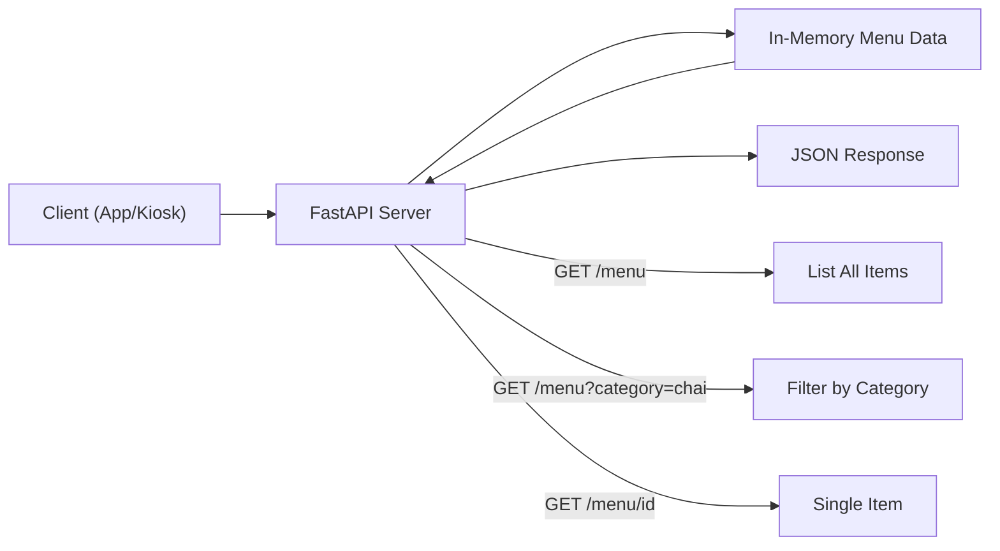

# Chai Point Menu API

**Client brief:** Chai Point, Bangalore wants a read-only menu API so their kiosk displays and mobile apps can fetch the latest menu without hitting a database.

## What you'll build
A FastAPI app that serves menu data (chai, snacks, combos) through three endpoints — list all items, filter by category, and get a single item by ID.

## Architecture



## What you'll learn
- Creating a FastAPI app and running it with uvicorn
- Path parameters and query parameters
- Pydantic response models for consistent API output
- Raising HTTPException for error handling

## How to run
```bash
pip install -r requirements.txt
uvicorn main:app --reload
```

Then open http://127.0.0.1:8000/docs to explore the API.

## Endpoints
| Method | Path | Description |
|--------|------|-------------|
| GET | `/` | Welcome message |
| GET | `/menu` | List all menu items |
| GET | `/menu?category=chai` | Filter items by category |
| GET | `/menu/{item_id}` | Get a single item by ID |
