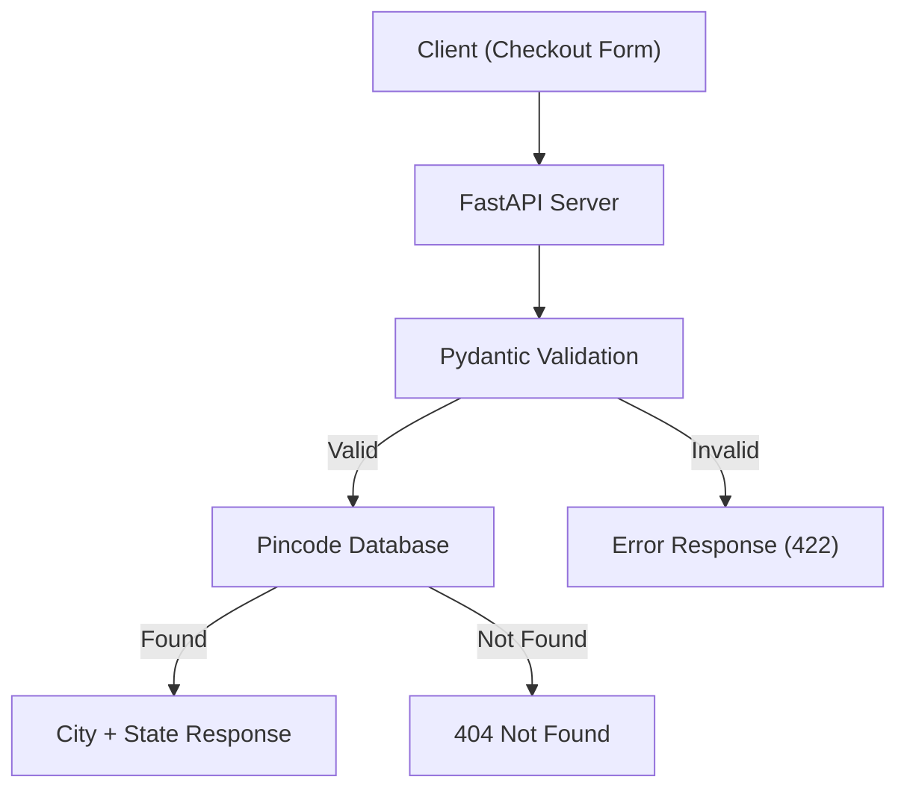

# Pincode Lookup API

**Client brief:** A D2C brand needs to auto-fill city and state fields when a customer types their pincode during checkout. This reduces friction and typos in the address form.

## What you'll build
A FastAPI app with single and bulk pincode lookup endpoints, complete with input validation and custom error handling.

## Architecture



## What you'll learn
- Pydantic `field_validator` for input validation
- Custom exception classes and exception handlers
- POST requests with JSON body
- Difference between path parameters and request bodies
- Clean error response patterns

## How to run
```bash
pip install -r requirements.txt
uvicorn main:app --reload
```

Then open http://127.0.0.1:8000/docs to explore the API.

## Endpoints
| Method | Path | Description |
|--------|------|-------------|
| GET | `/` | API info |
| GET | `/pincode/{code}` | Look up a single pincode |
| POST | `/pincode/bulk` | Look up multiple pincodes at once |

## Example bulk request
```json
{
  "pincodes": ["110001", "400001", "999999"]
}
```
