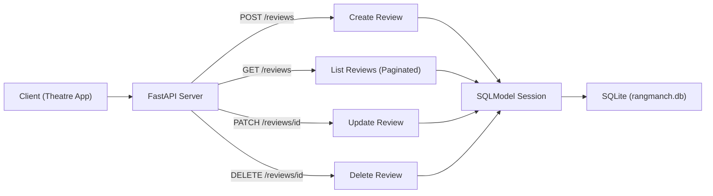

# Rangmanch Reviews API

**Client brief:** Rangmanch, a Pune-based theatre booking startup, needs a reviews API so audiences can rate and review plays. The API powers their app's review section and average rating displays.

## What you'll build
A full CRUD API backed by SQLite — create, read, update, and delete reviews, plus get average ratings per play with pagination support.

## Architecture



## What you'll learn
- SQLModel for database models (combines SQLAlchemy + Pydantic)
- SQLite as a zero-config database
- FastAPI lifespan events for startup/shutdown logic
- Session dependency injection
- Full CRUD operations
- Pagination with skip/limit
- Aggregation queries (average rating)

## How to run
```bash
pip install -r requirements.txt
uvicorn main:app --reload
```

A `rangmanch.db` file will be created automatically on first run.

## Endpoints
| Method | Path | Description |
|--------|------|-------------|
| GET | `/` | Welcome message |
| POST | `/reviews/` | Create a review |
| GET | `/reviews/` | List reviews (with optional play_name filter, skip, limit) |
| GET | `/reviews/average/{play_name}` | Average rating for a play |
| GET | `/reviews/{review_id}` | Get a single review |
| PATCH | `/reviews/{review_id}` | Update rating or comment |
| DELETE | `/reviews/{review_id}` | Delete a review |
