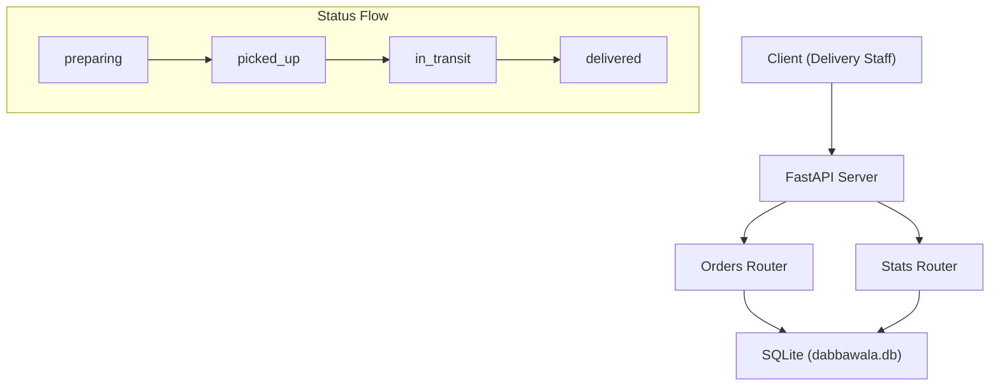

# Dabbawala Tracker API

**Client brief:** A Mumbai tiffin delivery service needs to track orders as they move through stages — from kitchen preparation to final delivery. Delivery staff update the status at each checkpoint.

## What you'll build
An order tracking API with status transitions (preparing, picked_up, in_transit, delivered), multi-parameter filtering, and a daily summary dashboard endpoint.

## Architecture



## What you'll learn
- Python Enum for controlled status values
- PATCH for partial updates (vs PUT for full replacement)
- DateTime handling and date-based filtering
- Multiple query parameters working together
- Aggregation for daily reports
- Multiple routers in one app

## How to run
```bash
pip install -r requirements.txt
uvicorn main:app --reload
```

A `dabbawala.db` file will be created automatically on first run.

## Endpoints
| Method | Path | Description |
|--------|------|-------------|
| GET | `/` | API info |
| POST | `/orders/` | Create a new order |
| GET | `/orders/` | List orders (filter by status, date) |
| GET | `/orders/{order_id}` | Get a single order |
| PATCH | `/orders/{order_id}` | Update order status or address |
| GET | `/stats/daily` | Daily order count by status |

## Order status flow
```
preparing -> picked_up -> in_transit -> delivered
```
