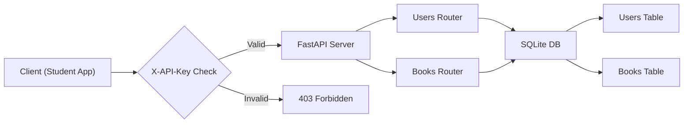

# Kitaab Exchange

## Client Brief
Delhi University students need a platform to buy and sell used textbooks. Sellers list their books with a price, and buyers browse or search. When a book is purchased, the seller marks it as sold.

## What You'll Build
A REST API for a college book exchange with:
- User registration (name, email, college)
- Book listings with search by title or author
- Mark books as sold
- API key authentication on write operations

## Architecture



## What You'll Learn
- **SQLModel relationships** — one-to-many (User has many Books)
- **APIRouter** — organize routes into separate files
- **Header dependency** — protect endpoints with an X-API-Key header
- **Query parameters** — search and filter results

## How to Run

```bash
pip install -r requirements.txt
uvicorn main:app --reload
```

Open http://localhost:8000/docs to test.

Use the `X-API-Key: kitaab-secret-2024` header for protected routes (create user, create book, mark sold).
