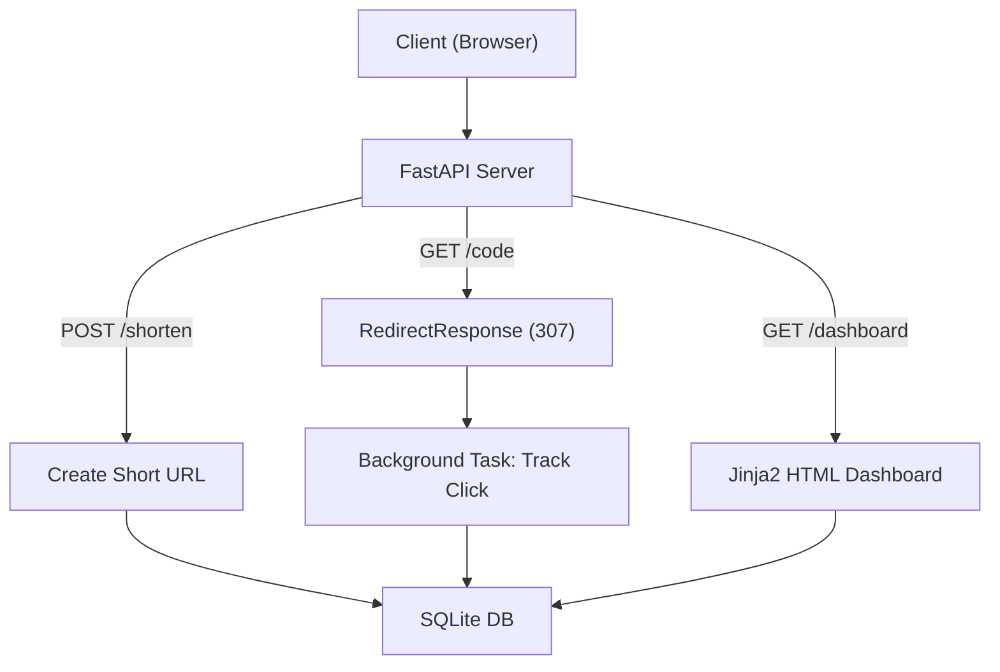

# Jugaad Shortener

## Client Brief
A Gurugram digital marketing agency needs a URL shortener for their campaigns. They want short links that redirect to the original URL, plus a dashboard to see how many times each link was clicked.

## What You'll Build
A URL shortener with:
- POST endpoint to create short URLs
- Redirect endpoint that tracks clicks
- Stats endpoint to check click count
- HTML dashboard to view all URLs
- HTML form to create URLs from the browser

## Architecture



## What You'll Learn
- **RedirectResponse** — return HTTP 307 redirects
- **BackgroundTasks** — log clicks asynchronously without slowing down the redirect
- **Jinja2Templates** — render HTML pages with dynamic data
- **StaticFiles** — serve CSS and other static assets

## How to Run

```bash
pip install -r requirements.txt
uvicorn main:app --reload
```

- API docs: http://localhost:8000/docs
- Dashboard: http://localhost:8000/dashboard
- Create form: http://localhost:8000/create
