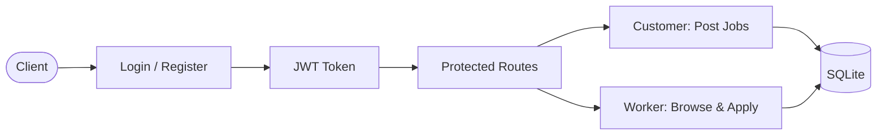

# Karigar Jobs

## Client Brief
A blue-collar job platform connecting workers (plumbers, electricians, painters) with customers who need their services. Customers post jobs, workers browse and apply. Each role has different permissions.

## What You'll Build
A job platform API with:
- User registration and login (JWT tokens)
- Role-based access control (worker vs customer)
- Customers post jobs with location and daily pay
- Workers browse and apply to jobs
- Customers view applicants for their jobs

## Architecture



## What You'll Learn
- **JWT authentication** — python-jose for token creation and validation
- **OAuth2PasswordBearer** — FastAPI's built-in OAuth2 flow
- **RBAC** — role-based access with a dependency factory
- **passlib bcrypt** — secure password hashing
- **pydantic-settings** — load config from .env file

## How to Run

```bash
# Copy env file and customize
cp .env.example .env

# Install dependencies
pip install -r requirements.txt

# Run server
uvicorn main:app --reload
```

Open http://localhost:8000/docs to test.

## Testing Flow
1. Register a customer: `POST /auth/register` with `role: "customer"`
2. Register a worker: `POST /auth/register` with `role: "worker"`
3. Login as customer, copy the token
4. Use the Authorize button in /docs to set the bearer token
5. Post a job as customer
6. Login as worker, set their token
7. Apply to the job as worker
8. Switch back to customer token, view applicants
