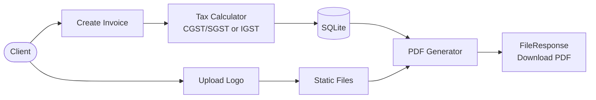

# Parchi Invoices

## Client Brief
A Jaipur-based SaaS company needs a GST invoice generator. Shop owners create invoices with line items, the system calculates CGST/SGST (same state) or IGST (different state), and generates a downloadable PDF.

## What You'll Build
A GST invoice API with:
- Create invoices with nested line items
- Automatic tax calculation (CGST/SGST for intra-state, IGST for inter-state)
- Download invoice as a formatted PDF
- Upload shop logo for branding on invoices

## Architecture



## What You'll Learn
- **Nested Pydantic models** — LineItem inside InvoiceCreate
- **JSON column** — store line items as JSON in SQLite
- **FileResponse** — return generated PDFs for download
- **UploadFile** — handle file uploads
- **fpdf2** — generate PDFs programmatically
- **Service layer** — separate business logic from routes

## How to Run

```bash
pip install -r requirements.txt
uvicorn main:app --reload
```

Open http://localhost:8000/docs to test.

## Example Invoice Request

```json
{
  "shop_name": "Rajasthan Handicrafts",
  "customer_name": "Delhi Emporium",
  "shop_state": "Rajasthan",
  "customer_state": "Delhi",
  "line_items": [
    {"description": "Blue Pottery Vase", "quantity": 5, "unit_price": 450},
    {"description": "Lac Bangles Set", "quantity": 10, "unit_price": 200}
  ]
}
```

Since shop is in Rajasthan and customer is in Delhi (different states), IGST at 18% will be applied.
