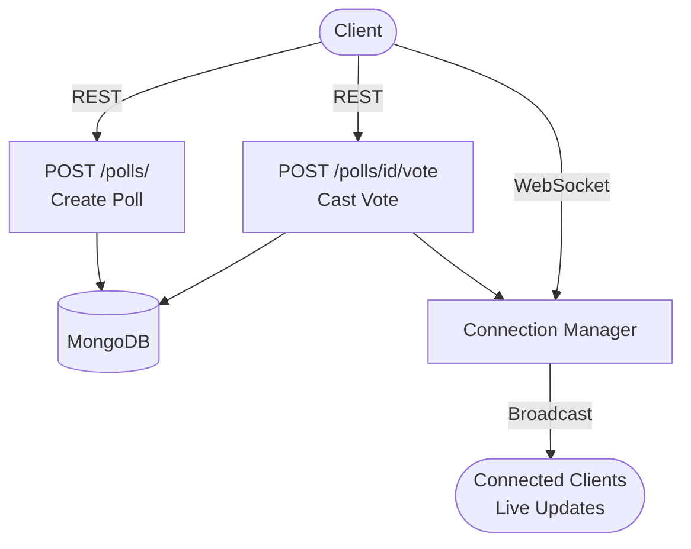

# Samvaad Polls - Live Polling with WebSocket

## Client Brief
IIT Bombay fest needs a live polling system where audience members vote from their phones and see results update in real-time on the big screen. No page refresh — votes appear instantly via WebSocket.

## What You'll Build
- REST API to create polls and cast votes
- WebSocket endpoint that broadcasts vote updates to all connected clients
- Live HTML page with animated vote bars that update without refresh
- ConnectionManager pattern to handle multiple WebSocket rooms

## Architecture



## What You'll Learn
- WebSocket basics in FastAPI
- ConnectionManager class for grouping connections by poll
- Broadcasting messages to all clients in a room
- Combining REST endpoints and WebSocket in one app
- Motor (async MongoDB driver) for non-blocking database ops

## Tech Stack
- FastAPI + Uvicorn
- Motor (async MongoDB)
- WebSocket (built into FastAPI)
- Vanilla JS for the frontend

## How to Run

1. Make sure MongoDB is running locally on port 27017

2. Install dependencies:
```bash
pip install -r requirements.txt
```

3. Start the server:
```bash
uvicorn main:app --reload
```

4. Open http://localhost:8000 in your browser

5. Create a poll, copy the Poll ID, open another browser tab, paste the ID and join — vote from both tabs to see live updates!

## API Endpoints

| Method | Endpoint | Description |
|--------|----------|-------------|
| GET | / | Live poll HTML page |
| POST | /polls/ | Create a new poll |
| GET | /polls/{id} | Get poll details |
| POST | /polls/{id}/vote | Cast a vote |
| WS | /ws/polls/{id} | WebSocket for live updates |
