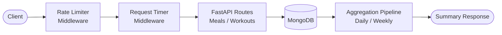

# Sehat Log - Fitness Tracking API

## Client Brief
A Hyderabad health-tech startup needs a backend API for their fitness app. Users log meals and workouts, and the app shows daily summaries and weekly trends. The API must be fast with proper rate limiting to prevent abuse.

## What You'll Build
- CRUD endpoints for meal logs and workout logs
- Daily summary endpoint (calories in vs out, net calories)
- Weekly trend endpoint showing 7-day history
- Custom middleware for request timing and rate limiting
- Reusable pagination dependency

## Architecture



## What You'll Learn
- Custom middleware in FastAPI (BaseHTTPMiddleware)
- Rate limiting by IP address
- Dependency injection with classes (CommonPagination)
- MongoDB aggregation pipelines for date-based summaries
- Structuring a multi-model project

## Tech Stack
- FastAPI + Uvicorn
- Motor (async MongoDB)
- Custom middleware (no external libs)

## How to Run

1. Make sure MongoDB is running locally on port 27017

2. Install dependencies:
```bash
pip install -r requirements.txt
```

3. Start the server:
```bash
uvicorn main:app --reload
```

4. Open http://localhost:8000/docs for Swagger UI

## API Endpoints

| Method | Endpoint | Description |
|--------|----------|-------------|
| POST | /meals/ | Log a meal |
| GET | /meals/?user_id=x | List meals for user |
| GET | /meals/{id} | Get meal details |
| PUT | /meals/{id} | Update a meal |
| DELETE | /meals/{id} | Delete a meal |
| POST | /workouts/ | Log a workout |
| GET | /workouts/?user_id=x | List workouts |
| GET | /workouts/{id} | Get workout details |
| PUT | /workouts/{id} | Update a workout |
| DELETE | /workouts/{id} | Delete a workout |
| GET | /summary/daily?user_id=x | Daily calorie summary |
| GET | /summary/weekly?user_id=x | 7-day trend |

## Middleware
- **RequestTimingMiddleware** — Adds X-Process-Time header to every response
- **SimpleRateLimiter** — 60 requests per minute per IP (configurable)
