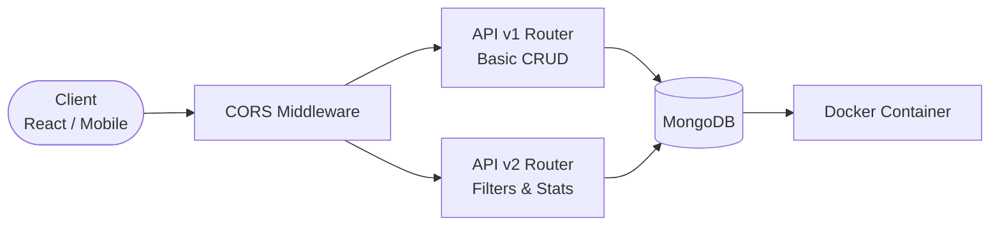

# Naukri Board - Job Board API with CORS, Versioning, Tests & Docker

## Client Brief
A job board API that will be consumed by a React frontend, a React Native mobile app, and third-party integrations. Needs CORS support, API versioning (v1 basic, v2 enhanced), automated tests, and Docker deployment.

## What You'll Build
- Job CRUD API with two versions (v1 simple, v2 with filtering and stats)
- CORS middleware for cross-origin access
- Automated tests using pytest and httpx AsyncClient
- Docker multi-stage build and docker-compose setup

## Architecture



## What You'll Learn
- CORS middleware configuration in FastAPI
- API versioning using router prefixes (v1, v2)
- Writing async tests with pytest + httpx
- Test fixtures and database dependency override
- Multi-stage Docker builds
- docker-compose for app + database

## Tech Stack
- FastAPI + Uvicorn
- Motor (async MongoDB)
- pytest + httpx (testing)
- Docker + docker-compose

## How to Run

### Local Development
```bash
pip install -r requirements.txt
uvicorn main:app --reload
```

### With Docker
```bash
docker-compose up --build
```

### Run Tests
```bash
pytest tests/ -v
```

## API Endpoints

### V1 — Basic CRUD
| Method | Endpoint | Description |
|--------|----------|-------------|
| POST | /v1/jobs/ | Create a job |
| GET | /v1/jobs/ | List jobs (no filtering) |
| GET | /v1/jobs/{id} | Get job details |
| PUT | /v1/jobs/{id} | Update a job |
| DELETE | /v1/jobs/{id} | Delete a job |

### V2 — Enhanced
| Method | Endpoint | Description |
|--------|----------|-------------|
| POST | /v2/jobs/ | Create a job |
| GET | /v2/jobs/ | List with filters, pagination, salary range |
| GET | /v2/jobs/stats | Job posting statistics |
| GET | /v2/jobs/{id} | Get job details |
| PUT | /v2/jobs/{id} | Update a job |
| DELETE | /v2/jobs/{id} | Delete a job |

### V2 Query Parameters
- `job_type` — full-time, part-time, contract, internship
- `location` — company location
- `is_remote` — true/false
- `skill` — filter by skill
- `salary_min` / `salary_max` — salary range
- `sort_by` / `sort_order` — sorting
- `skip` / `limit` — pagination
