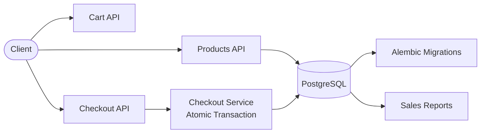

# Kirana POS - Point of Sale with PostgreSQL & Alembic

## Client Brief
A Maharashtra kirana (grocery) chain needs a POS system. Cashiers scan products, add to cart, and checkout. The system must handle stock correctly — if two cashiers try to sell the last item, only one should succeed. Needs proper database migrations for deployment.

## What You'll Build
- Product CRUD with stock management
- In-memory cart system
- Atomic checkout with transaction rollback on insufficient stock
- Sales reports (daily summary, top products, revenue by date range)
- Alembic database migrations
- PostgreSQL via Docker

## Architecture



## What You'll Learn
- PostgreSQL with SQLAlchemy (instead of MongoDB)
- Alembic for database migrations (create, run, rollback)
- Database transactions with commit and rollback
- Row-level locking with `with_for_update()` to prevent race conditions
- Reporting queries with date filtering
- Docker Compose for PostgreSQL

## Tech Stack
- FastAPI + Uvicorn
- SQLAlchemy (ORM)
- PostgreSQL (via Docker)
- Alembic (migrations)

## How to Run

1. Start PostgreSQL:
```bash
docker-compose up -d
```

2. Install dependencies:
```bash
pip install -r requirements.txt
```

3. Run migrations:
```bash
alembic upgrade head
```

4. Start the server:
```bash
uvicorn main:app --reload
```

5. Open http://localhost:8000/docs

## API Endpoints

### Products
| Method | Endpoint | Description |
|--------|----------|-------------|
| POST | /products/ | Add a product |
| GET | /products/ | List products (with search, category filter) |
| GET | /products/{id} | Get product details |
| PUT | /products/{id} | Update product |
| PATCH | /products/{id}/stock | Add/subtract stock |
| DELETE | /products/{id} | Delete product |

### Cart
| Method | Endpoint | Description |
|--------|----------|-------------|
| POST | /cart/add | Add item to cart |
| GET | /cart/ | View cart |
| DELETE | /cart/{product_id} | Remove item |
| DELETE | /cart/ | Clear cart |

### Checkout
| Method | Endpoint | Description |
|--------|----------|-------------|
| POST | /checkout/ | Process checkout (atomic transaction) |

### Reports
| Method | Endpoint | Description |
|--------|----------|-------------|
| GET | /reports/daily | Daily sales summary |
| GET | /reports/top-products | Top selling products |
| GET | /reports/revenue | Revenue by date range |

## Alembic Commands
```bash
alembic upgrade head      # Run all migrations
alembic downgrade -1      # Rollback last migration
alembic history           # Show migration history
alembic current           # Show current migration
```
