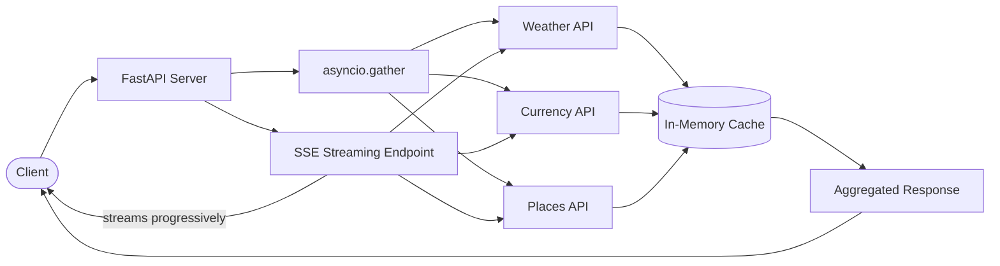

# Yatra Planner API

## Client Brief

A Goa-based travel startup wants an API that aggregates data from multiple external sources (weather, currency, places) into a single travel plan. They need both a standard endpoint and a streaming endpoint so their mobile app can show data progressively as it loads.

## What You'll Build

- A travel planning API that fetches weather, exchange rates, and places of interest concurrently
- Server-Sent Events (SSE) endpoint that streams each section as it becomes available
- In-memory cache with TTL to avoid redundant API calls
- Clean service layer with simulated data (swappable with real APIs)

## Architecture



## What You'll Learn

- **httpx AsyncClient** for making async HTTP requests
- **asyncio.gather** to run multiple API calls concurrently
- **Server-Sent Events (SSE)** using FastAPI's StreamingResponse
- **In-memory caching** with time-to-live expiration
- **Service layer pattern** — separating data fetching from route logic

## Project Structure

```
13-yatra-planner/
├── main.py                    # App entry point with routers
├── config.py                  # API keys and settings
├── models.py                  # Pydantic models
├── routes/
│   ├── planner.py             # POST /plan — aggregated response
│   └── stream.py              # GET /plan/stream — SSE endpoint
├── services/
│   ├── weather_service.py     # Weather data (simulated/real)
│   ├── currency_service.py    # Exchange rates (simulated/real)
│   ├── places_service.py      # Places of interest (simulated)
│   └── cache.py               # In-memory cache with TTL
├── requirements.txt
└── .env.example
```

## How to Run

```bash
# Create virtual environment
python -m venv venv
source venv/bin/activate  # Windows: venv\Scripts\activate

# Install dependencies
pip install -r requirements.txt

# Copy env file (optional - works without API keys)
cp .env.example .env

# Run the server
uvicorn main:app --reload
```

## Test It

```bash
# Create a travel plan
curl -X POST http://localhost:8000/plan/ \
  -H "Content-Type: application/json" \
  -d '{"destination": "Goa", "start_date": "2025-03-01", "end_date": "2025-03-05"}'

# Stream a travel plan (SSE)
curl -N "http://localhost:8000/plan/stream?destination=Goa&start_date=2025-03-01&end_date=2025-03-05"

# Check cache stats
curl http://localhost:8000/plan/cache-stats
```

Or open http://localhost:8000/docs for the interactive Swagger UI.
