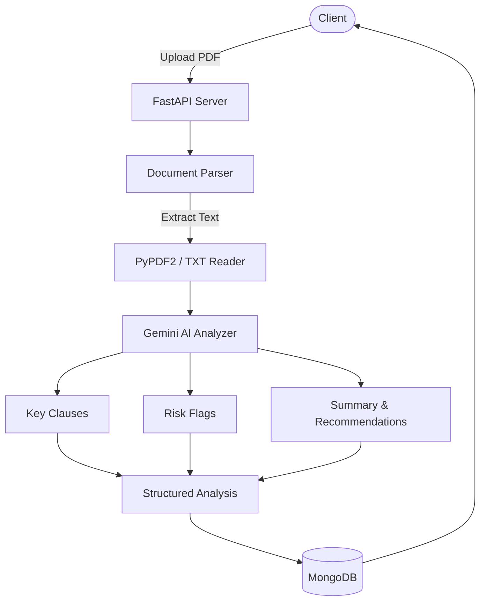

# Vakeel Contracts API

## Client Brief

A Mumbai-based legal-tech startup needs an API for AI-powered contract analysis. Lawyers upload PDF contracts and get structured insights — key clauses identified, risks flagged, and recommendations generated. The system uses Google Gemini to analyze legal documents.

## What You'll Build

- File upload endpoint for PDF and TXT contracts
- Text extraction from uploaded documents using PyPDF2
- AI-powered contract analysis using Google Gemini API
- Structured output: key clauses, risk flags, overall risk level, recommendations
- MongoDB storage for contracts and analysis results

## Architecture



## What You'll Learn

- **Google Gemini API** integration with structured JSON output
- **Document parsing** — extracting text from PDFs with PyPDF2
- **Prompt engineering** — crafting prompts that return parseable JSON
- **File uploads** in FastAPI with validation (size, type)
- **Service layer pattern** — separating AI logic from routes

## Project Structure

```
14-vakeel-contracts/
├── main.py                        # App entry point
├── config.py                      # API keys and settings
├── database.py                    # MongoDB connection
├── models.py                      # Pydantic models
├── routes/
│   ├── contracts.py               # Upload and list contracts
│   └── analysis.py                # Run and view AI analysis
├── services/
│   ├── document_parser.py         # Extract text from PDF/TXT
│   ├── gemini_analyzer.py         # Gemini API integration
│   └── prompt_templates.py        # Prompt templates for analysis
├── uploads/                       # Uploaded files stored here
├── sample_contracts/
│   └── sample_nda.txt             # Sample NDA for testing
├── requirements.txt
└── .env.example
```

## Prerequisites

- Python 3.10+
- MongoDB running locally (or MongoDB Atlas URI)
- Gemini API key from https://aistudio.google.com/apikey

## How to Run

```bash
# Create virtual environment
python -m venv venv
source venv/bin/activate  # Windows: venv\Scripts\activate

# Install dependencies
pip install -r requirements.txt

# Set up environment variables
cp .env.example .env
# Edit .env and add your GEMINI_API_KEY

# Run the server
uvicorn main:app --reload
```

## Test It

```bash
# Upload the sample NDA
curl -X POST http://localhost:8000/contracts/upload \
  -F "file=@sample_contracts/sample_nda.txt"

# List all contracts
curl http://localhost:8000/contracts/

# Run AI analysis (use the contract_id from upload response)
curl -X POST http://localhost:8000/analysis/analyze/CONTRACT_ID_HERE

# Get full analysis
curl http://localhost:8000/analysis/ANALYSIS_ID_HERE
```

Or open http://localhost:8000/docs for the interactive Swagger UI.
