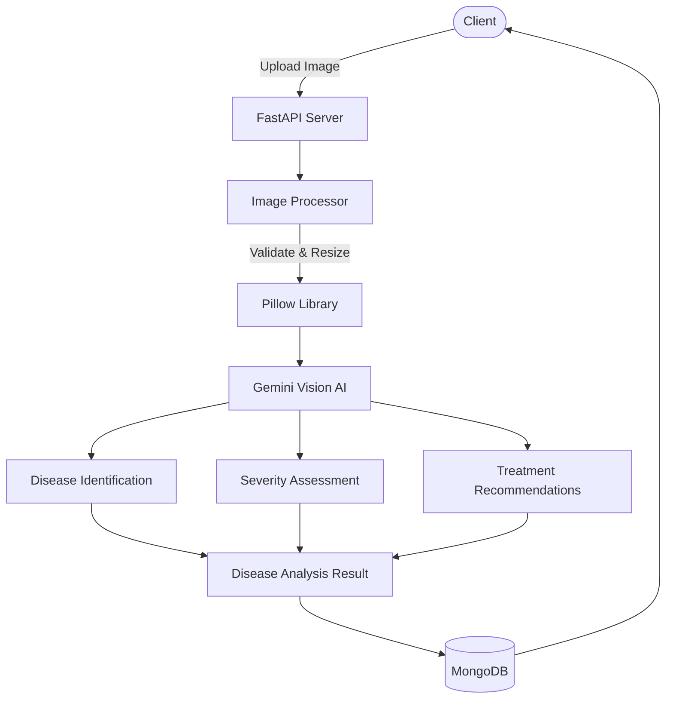

# Netra Vision API

## Client Brief

A Pune-based AgriTech startup needs a crop disease detection API. Farmers upload photos of their crops, and the system uses AI vision to identify diseases, assess severity, and recommend treatments. The goal is to help farmers catch crop problems early.

## What You'll Build

- Image upload endpoint with validation and resizing
- AI-powered crop disease detection using Gemini Vision (multimodal)
- Batch analysis for multiple images at once
- Analysis history with filtering and statistics
- MongoDB storage for all analysis results

## Architecture



## What You'll Learn

- **Gemini Vision (multimodal)** — sending images to AI for analysis
- **Image processing with Pillow** — validation, resizing, format handling
- **File uploads** in FastAPI with proper validation
- **Structured AI output** — getting JSON from a vision model
- **Batch processing** — handling multiple files in one request
- **MongoDB aggregation** — for statistics and reporting

## Project Structure

```
15-netra-vision/
├── main.py                     # App entry point
├── config.py                   # API keys and settings
├── database.py                 # MongoDB connection
├── models.py                   # Pydantic models
├── routes/
│   ├── analyze.py              # Single + batch image analysis
│   └── history.py              # List, filter, and stats
├── services/
│   ├── gemini_vision.py        # Gemini multimodal API
│   └── image_processor.py      # Image validation and resizing
├── uploads/                    # Uploaded images stored here
├── sample_images/
│   └── README.txt              # How to get test images
├── requirements.txt
└── .env.example
```

## Prerequisites

- Python 3.10+
- MongoDB running locally (or MongoDB Atlas URI)
- Gemini API key from https://aistudio.google.com/apikey

## How to Run

```bash
# Create virtual environment
python -m venv venv
source venv/bin/activate  # Windows: venv\Scripts\activate

# Install dependencies
pip install -r requirements.txt

# Set up environment variables
cp .env.example .env
# Edit .env and add your GEMINI_API_KEY

# Run the server
uvicorn main:app --reload
```

## Test It

```bash
# Analyze a single image
curl -X POST http://localhost:8000/analyze/ \
  -F "file=@path/to/crop_photo.jpg"

# Batch analyze multiple images
curl -X POST http://localhost:8000/analyze/batch \
  -F "files=@photo1.jpg" \
  -F "files=@photo2.jpg"

# List all analyses
curl http://localhost:8000/analyses/

# Filter by crop type
curl "http://localhost:8000/analyses/?crop=tomato"

# Get statistics
curl http://localhost:8000/analyses/stats/summary

# Get specific analysis
curl http://localhost:8000/analyses/ANALYSIS_ID_HERE
```

Or open http://localhost:8000/docs for the interactive Swagger UI.
