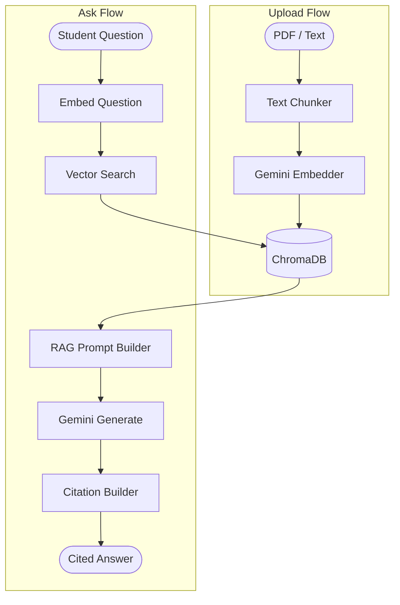

# Project 16: Vidya RAG — UPSC Doubt Solver with Citations

## Client Brief

**Client:** EdVidya — an EdTech startup building India's smartest UPSC preparation platform.

**The Problem:** UPSC aspirants spend hours searching through study materials to find answers. They need a tool that reads their uploaded materials and answers questions with exact page citations — like having a tutor who has read every book.

**What You're Building:** A RAG (Retrieval-Augmented Generation) system that lets students upload study materials, then ask questions and get AI-generated answers grounded in those specific documents — with citations showing exactly where the answer came from.

## What You'll Learn

- RAG architecture (the most important AI pattern in production)
- Text chunking with overlap for better retrieval
- Vector embeddings — converting text to searchable numbers
- ChromaDB — a vector database for semantic search
- Grounded generation — making AI cite its sources
- Building a complete AI pipeline from ingestion to answer

## Architecture



## Project Structure

```
16-vidya-rag/
├── main.py                    # FastAPI app
├── config.py                  # API keys, settings
├── database.py                # SQLite for document metadata
├── models.py                  # Pydantic models
├── routes/
│   ├── documents.py           # Upload, list, delete documents
│   └── questions.py           # Ask questions, get answers
├── services/
│   ├── chunker.py             # Text splitting with overlap
│   ├── embedder.py            # Gemini embedding API
│   ├── vector_store.py        # ChromaDB wrapper
│   ├── prompt_templates.py    # RAG prompts with citation format
│   └── rag_engine.py          # Full pipeline orchestrator
├── sample_docs/
│   └── sample_chapter.txt     # Sample UPSC study material
├── chroma_data/               # Vector database storage
├── requirements.txt
└── .env.example
```

## How to Run

1. **Install dependencies:**
   ```bash
   pip install -r requirements.txt
   ```

2. **Set up environment:**
   ```bash
   cp .env.example .env
   # Edit .env and add your Gemini API key
   ```

3. **Start the server:**
   ```bash
   uvicorn main:app --reload
   ```

4. **Open Swagger docs:**
   ```
   http://localhost:8000/docs
   ```

## Testing the Flow

1. **Upload the sample chapter:**
   ```bash
   curl -X POST "http://localhost:8000/documents/upload" \
     -F "title=Fundamental Rights Chapter" \
     -F "file=@sample_docs/sample_chapter.txt"
   ```

2. **Ask a question:**
   ```bash
   curl -X POST "http://localhost:8000/questions/ask" \
     -H "Content-Type: application/json" \
     -d '{"question": "What are the six fundamental rights?", "top_k": 5}'
   ```

3. **Check your documents:**
   ```bash
   curl http://localhost:8000/documents/
   ```

## Key Concepts

- **RAG:** Retrieval-Augmented Generation — don't make the AI guess, give it the right context first
- **Chunking:** Big documents are split into small, overlapping pieces so the AI can find relevant sections
- **Embeddings:** Text converted to number arrays where similar meanings are close together
- **Vector Search:** Finding documents by meaning, not just keywords
- **Grounded Generation:** The AI only answers from provided context, reducing hallucination
- **Citations:** Every answer traces back to specific chunks from specific documents

## API Endpoints

| Method | Endpoint | Description |
|--------|----------|-------------|
| POST | /documents/upload | Upload and process a document |
| GET | /documents/ | List all documents |
| GET | /documents/{id} | Get document details |
| DELETE | /documents/{id} | Delete a document |
| POST | /questions/ask | Ask a question, get cited answer |
| GET | / | Health check + stats |
