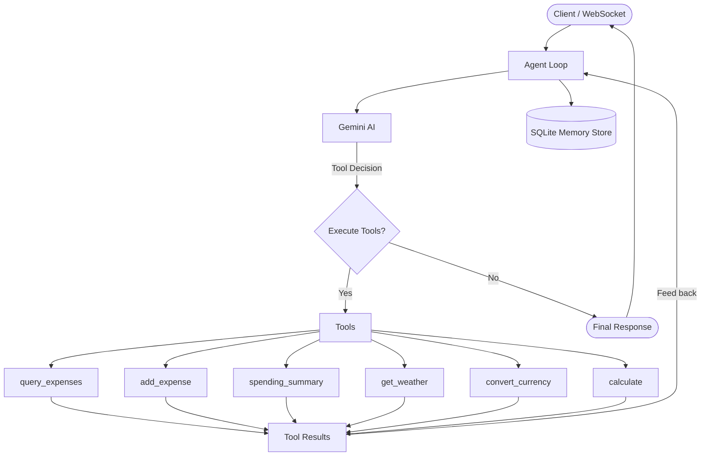

# Project 17: Saathi Agent — AI Personal Finance Assistant

## Client Brief

**Client:** PaySaathi — a fintech startup building India's first AI-powered personal finance assistant.

**The Problem:** People forget to track expenses, can't remember where their money went, and don't have time to analyze spending patterns. They need an assistant that understands natural language, remembers past conversations, and can actually *do things* — not just chat.

**What You're Building:** An AI agent with tools, memory, and streaming. Users chat naturally ("I spent 500 on lunch today" or "How much did I spend on food this week?"), and the agent decides which tools to use, executes them, and responds conversationally.

## What You'll Learn

- AI Agent loop (reason, act, observe, repeat)
- Gemini function calling (tool use)
- Tool execution and result handling
- Conversation memory with SQLite
- WebSocket streaming for real-time chat
- Building a full chat UI with HTML/JS

## Architecture



## Project Structure

```
17-saathi-agent/
├── main.py                      # FastAPI app + chat UI route
├── config.py                    # API keys, agent settings
├── database.py                  # SQLite setup
├── models/
│   ├── expense.py               # Expense data models
│   ├── conversation.py          # Conversation/message models
│   └── tool_schemas.py          # Tool definitions for Gemini
├── routes/
│   ├── expenses.py              # Manual expense CRUD
│   ├── chat.py                  # WebSocket chat endpoint
│   └── admin.py                 # Monitor conversations
├── services/
│   ├── agent.py                 # Core agent loop
│   ├── memory.py                # Conversation persistence
│   └── tools/
│       ├── expenses.py          # Expense query/add/summary
│       ├── weather.py           # Simulated weather
│       ├── currency.py          # Simulated currency conversion
│       └── calculator.py        # Basic math
├── templates/
│   └── chat.html                # Chat UI
├── static/
│   ├── chat.js                  # WebSocket client
│   └── style.css                # Chat styling
├── seed_data.py                 # Demo expense data
├── requirements.txt
└── .env.example
```

## How to Run

1. **Install dependencies:**
   ```bash
   pip install -r requirements.txt
   ```

2. **Set up environment:**
   ```bash
   cp .env.example .env
   # Edit .env and add your Gemini API key
   ```

3. **Seed demo data:**
   ```bash
   python seed_data.py
   ```

4. **Start the server:**
   ```bash
   uvicorn main:app --reload
   ```

5. **Open the chat UI:**
   ```
   http://localhost:8000
   ```

6. **Or use Swagger docs:**
   ```
   http://localhost:8000/docs
   ```

## Things to Try in Chat

- "I spent 350 on lunch at the canteen today"
- "How much did I spend on food this week?"
- "Give me a spending summary for this month"
- "What's the weather in Mumbai?"
- "Convert 5000 INR to USD"
- "How much is 15% tip on 1200?"
- "Show me my last 5 transport expenses"

## Key Concepts

- **Agent Loop:** The AI reasons about what to do, calls tools if needed, observes results, and decides whether to call more tools or respond
- **Function Calling:** Gemini can request specific tool calls with structured parameters — it's not just generating text
- **Tool Execution:** Each tool is a real Python function that does something (query database, calculate, etc.)
- **Memory:** Conversations persist in SQLite, so the agent remembers context across messages
- **WebSocket:** Real-time bidirectional communication for streaming responses
- **Parallel Tool Calls:** Gemini can request multiple tools at once (e.g., check weather AND convert currency)

## API Endpoints

| Method | Endpoint | Description |
|--------|----------|-------------|
| GET | / | Chat UI |
| WS | /ws/chat | WebSocket chat endpoint |
| POST | /expenses/ | Create expense manually |
| GET | /expenses/ | List expenses |
| GET | /expenses/{id} | Get expense details |
| PUT | /expenses/{id} | Update expense |
| DELETE | /expenses/{id} | Delete expense |
| GET | /admin/conversations | List all conversations |
| GET | /admin/conversations/{id} | View conversation history |
| DELETE | /admin/conversations/{id} | Delete conversation |
| GET | /admin/stats | Agent statistics |
