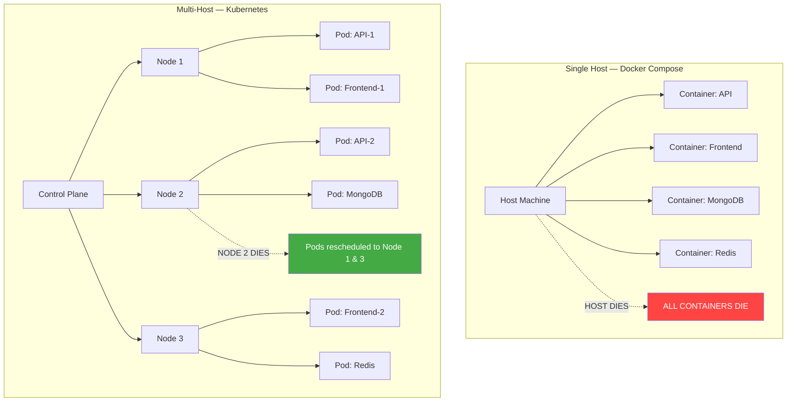
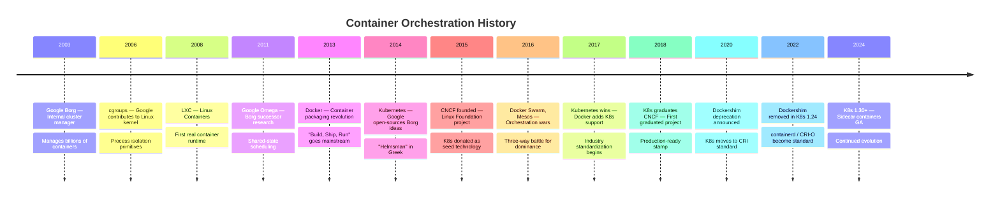
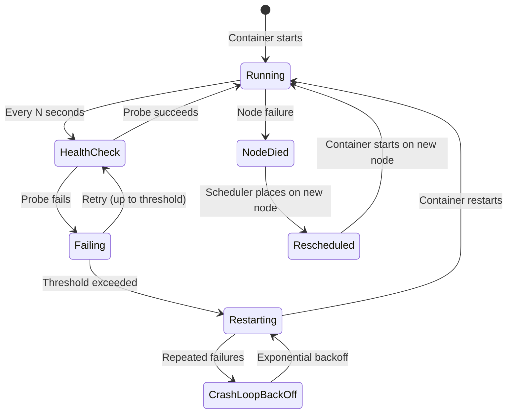
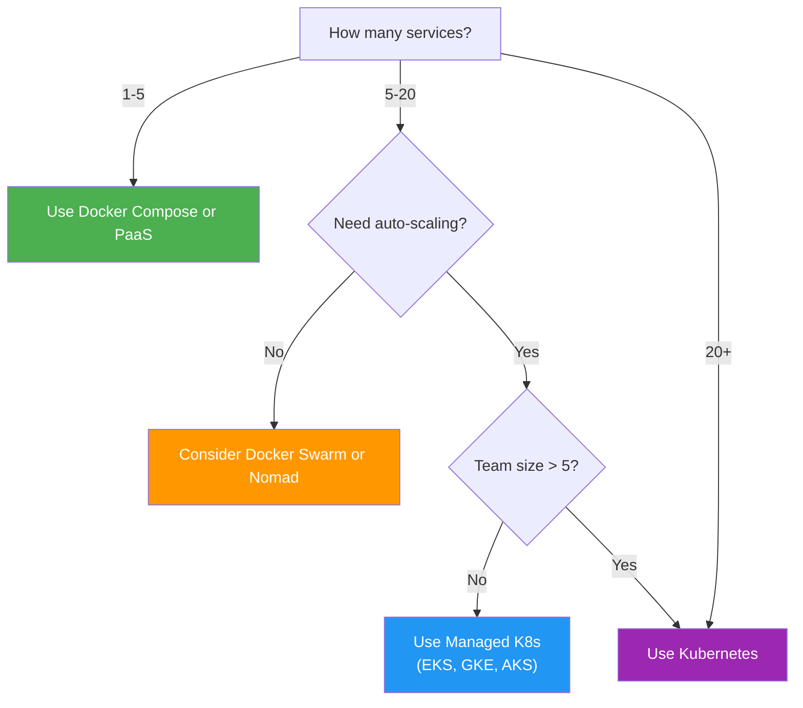
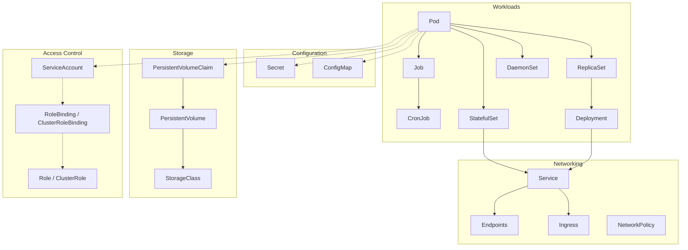

# File 01: Why Kubernetes?

**Topic:** Container orchestration, Kubernetes history (Borg/Omega), CNCF ecosystem, when to use K8s vs simpler alternatives
**WHY THIS MATTERS:** If you are deploying more than a handful of containers, you need a system that can schedule, heal, scale, and update them without human babysitting. Kubernetes is that system, born from over a decade of Google's internal experience running billions of containers. Understanding *why* it exists prevents you from either over-engineering a two-container app or under-engineering a distributed platform.

---

## Story: The Indian Railway Network

Imagine Indian Railways in the 1800s — a single station master at a small junction manages two platforms and four trains a day. He knows every driver, every passenger, every schedule by heart. He blows the whistle, waves the green flag, and everything runs smoothly. This is **Docker Compose** — one host, a few containers, a single YAML file.

Now fast-forward to modern Indian Railways: **13,000+ trains, 7,000+ stations, 23 million passengers daily.** No single station master can handle this. Instead, there is a **centralized command and control system** — the Railway Board in New Delhi sets policy, zonal headquarters coordinate regions, divisional offices manage clusters of stations, and station masters execute locally. Signals are automated, track switching is computer-controlled, and if a train breaks down on the Rajdhani Express route, traffic is rerouted automatically. This is **Kubernetes**.

The key insight is the same one Indian Railways learned: **what works for a village halt does not work for Howrah Junction.** Docker Compose is your village halt. Kubernetes is your Railway Board. The magic is not in any single component — it is in the *orchestration* of thousands of moving pieces, the self-healing when something derails, the automatic rescheduling when a platform is full, and the ability to roll out a new timetable (deployment) across the entire network without stopping a single train.

---

## Example Block 1 — The Problem: Why Single-Host Docker Fails

### Section 1 — The Breaking Points
**WHY:** Before learning Kubernetes, you must viscerally understand *what breaks* when you try to scale containers on a single host with Docker Compose alone.

Consider a typical web application: a Node.js API, a React frontend, a MongoDB database, and a Redis cache. On a single host with Docker Compose, this works beautifully — until it doesn't.

**The Five Breaking Points:**

| # | Problem | Single Host Reality | What You Need |
|---|---------|-------------------|---------------|
| 1 | **Hardware failure** | Everything dies together | Containers spread across multiple machines |
| 2 | **Scaling** | Limited by one machine's CPU/RAM | Horizontal scaling across a fleet |
| 3 | **Updates** | Downtime during restart | Rolling updates with zero downtime |
| 4 | **Resource contention** | One hungry container starves others | Resource quotas and intelligent scheduling |
| 5 | **Service discovery** | Hardcoded IPs or host networking | Dynamic DNS and load balancing |



### Section 2 — A Real Failure Scenario
**WHY:** Abstract problems feel theoretical. A concrete walkthrough makes the pain real.

```bash
# Your "production" Docker Compose setup
docker compose up -d
# SYNTAX:  docker compose up [OPTIONS]
# FLAGS:
#   -d                    run in detached mode (background)
#   --scale <svc>=<n>     scale a service to N instances
#   --build               rebuild images before starting
# EXPECTED OUTPUT:
# [+] Running 4/4
#  ✔ Container app-redis-1     Started
#  ✔ Container app-mongo-1     Started
#  ✔ Container app-api-1       Started
#  ✔ Container app-frontend-1  Started
```

Now your API gets traffic. You try to scale:

```bash
docker compose up -d --scale api=5
# SYNTAX:  docker compose up --scale <service>=<count>
# FLAGS:
#   --scale <svc>=<n>     create N instances of a service
# EXPECTED OUTPUT:
# [+] Running 8/8
#  ✔ Container app-api-1  Running
#  ✔ Container app-api-2  Started
#  ✔ Container app-api-3  Started
#  ✔ Container app-api-4  Started
#  ✔ Container app-api-5  Started
```

But wait — all 5 instances are on the **same machine**. If that machine has 4 GB of RAM and each API instance uses 1 GB, you have just OOM-killed your host. There is no scheduler saying "this machine is full, put the next container elsewhere." There is no health check restarting a crashed instance. There is no load balancer distributing traffic evenly. **You are the orchestrator, and you are asleep at 3 AM.**

---

## Example Block 2 — The History: From Borg to Kubernetes

### Section 1 — The Google Lineage
**WHY:** Kubernetes did not appear from nowhere. Understanding its lineage explains its design decisions and why it looks the way it does.



**Borg** was Google's internal system that managed everything from Gmail to Search across millions of machines. It introduced concepts like:
- **Declarative configuration** — describe what you want, not how to get there
- **Reconciliation loops** — constantly compare desired state vs actual state
- **Labels and selectors** — flexible grouping instead of rigid hierarchies

**Omega** was a research project that improved on Borg's scheduling with a shared-state approach. Many of Omega's ideas influenced Kubernetes' architecture.

**Kubernetes** (Greek for "helmsman" or "pilot") took the best ideas from both systems and made them open-source, vendor-neutral, and extensible. Three Google engineers — Joe Beda, Brendan Burns, and Craig McLuckie — started the project in 2014.

### Section 2 — The CNCF Ecosystem
**WHY:** Kubernetes is not a standalone tool — it is the kernel of an entire cloud-native ecosystem. Knowing the landscape prevents you from reinventing wheels.

The **Cloud Native Computing Foundation (CNCF)** hosts Kubernetes and over 150 other projects. Think of it as the "universe" in which Kubernetes lives.

Key CNCF projects you will encounter:

| Layer | Project | Purpose |
|-------|---------|---------|
| Runtime | **containerd** | Container runtime (runs containers) |
| Runtime | **CRI-O** | Lightweight OCI-compliant runtime |
| Networking | **Calico** | Network policy and routing |
| Networking | **Cilium** | eBPF-based networking and security |
| Service Mesh | **Istio** / **Linkerd** | Traffic management, mTLS, observability |
| Monitoring | **Prometheus** | Metrics collection and alerting |
| Logging | **Fluentd** | Unified logging layer |
| Tracing | **Jaeger** | Distributed tracing |
| Package Mgmt | **Helm** | Kubernetes package manager |
| Storage | **Rook** | Cloud-native storage orchestrator |
| Security | **Falco** | Runtime security monitoring |
| CI/CD | **Argo** | GitOps continuous delivery |

---

## Example Block 3 — The Core Superpowers of Kubernetes

### Section 1 — Self-Healing
**WHY:** Self-healing is the single most important operational benefit. It means your pager goes off less at 3 AM.

Kubernetes constantly watches your containers. If one crashes, K8s restarts it. If a node dies, K8s reschedules those containers elsewhere. If a container fails its health check, K8s stops sending it traffic and restarts it.

```yaml
# Health check configuration in a Pod spec
apiVersion: v1
kind: Pod
metadata:
  name: my-api
spec:
  containers:
  - name: api
    image: my-api:v1
    # Liveness probe — "Is this container alive?"
    # If it fails, K8s RESTARTS the container
    livenessProbe:
      httpGet:
        path: /healthz
        port: 8080
      initialDelaySeconds: 5      # wait 5s before first check
      periodSeconds: 10            # check every 10s
      failureThreshold: 3          # restart after 3 consecutive failures
    # Readiness probe — "Is this container ready for traffic?"
    # If it fails, K8s REMOVES it from the Service (no traffic)
    readinessProbe:
      httpGet:
        path: /ready
        port: 8080
      initialDelaySeconds: 3
      periodSeconds: 5
```



### Section 2 — Declarative Configuration and Reconciliation
**WHY:** Declarative configuration is the philosophical core of Kubernetes. Every other feature builds on this idea.

In an **imperative** world, you give step-by-step instructions:
> "Start 3 nginx containers. Then create a load balancer. Then open port 80."

In a **declarative** world, you describe the desired end state:
> "I want 3 nginx containers behind a load balancer on port 80."

Kubernetes uses **reconciliation loops** (also called **control loops**) to continuously compare the desired state (what you declared) with the actual state (what is running). If they differ, K8s takes action to converge.

```
You declare: "I want 3 replicas"
Actual state: 2 replicas running
K8s action:   Start 1 more replica

You declare: "I want 3 replicas"
Actual state: 5 replicas running (someone manually started extras)
K8s action:   Terminate 2 replicas
```

This is exactly how a thermostat works — you set the desired temperature (desired state), the thermostat reads the current temperature (actual state), and turns heating/cooling on/off to converge.

### Section 3 — Rolling Updates and Rollbacks
**WHY:** Zero-downtime deployments are table stakes in modern production. Kubernetes makes them the default, not a luxury.

```yaml
# Deployment with rolling update strategy
apiVersion: apps/v1
kind: Deployment
metadata:
  name: my-api
spec:
  replicas: 4
  strategy:
    type: RollingUpdate
    rollingUpdate:
      maxUnavailable: 1    # at most 1 pod can be down during update
      maxSurge: 1           # at most 1 extra pod during update
  selector:
    matchLabels:
      app: my-api
  template:
    metadata:
      labels:
        app: my-api
    spec:
      containers:
      - name: api
        image: my-api:v2    # Update from v1 to v2
```

The rolling update process:
1. K8s creates 1 new pod with `v2` (now 4 old + 1 new = 5 total, `maxSurge: 1`)
2. Once the new pod passes readiness checks, K8s terminates 1 old pod (now 3 old + 1 new = 4 total)
3. Repeat until all pods are `v2`
4. If any new pod fails health checks, the rollout **pauses automatically**

```bash
# Check rollout status
kubectl rollout status deployment/my-api
# SYNTAX:  kubectl rollout status <resource>/<name> [OPTIONS]
# FLAGS:
#   --timeout=<duration>  time to wait before giving up (e.g., 5m)
#   -w                    watch for changes
# EXPECTED OUTPUT:
# Waiting for deployment "my-api" rollout to finish: 2 of 4 updated replicas are available...
# deployment "my-api" successfully rolled out

# Undo a bad deployment
kubectl rollout undo deployment/my-api
# SYNTAX:  kubectl rollout undo <resource>/<name> [OPTIONS]
# FLAGS:
#   --to-revision=<n>     roll back to a specific revision number
# EXPECTED OUTPUT:
# deployment.apps/my-api rolled back

# View rollout history
kubectl rollout history deployment/my-api
# SYNTAX:  kubectl rollout history <resource>/<name> [OPTIONS]
# FLAGS:
#   --revision=<n>        show details for a specific revision
# EXPECTED OUTPUT:
# deployment.apps/my-api
# REVISION  CHANGE-CAUSE
# 1         <none>
# 2         kubectl set image deployment/my-api api=my-api:v2
# 3         kubectl set image deployment/my-api api=my-api:v3
```

### Section 4 — Auto-Scaling
**WHY:** Manually adding containers when traffic spikes is slow and error-prone. Auto-scaling lets your infrastructure breathe with your traffic.

Kubernetes supports three types of auto-scaling:

| Type | What It Scales | Based On | Resource |
|------|---------------|----------|----------|
| **HPA** (Horizontal Pod Autoscaler) | Number of pods | CPU, memory, custom metrics | `HorizontalPodAutoscaler` |
| **VPA** (Vertical Pod Autoscaler) | CPU/memory per pod | Historical usage | `VerticalPodAutoscaler` |
| **Cluster Autoscaler** | Number of nodes | Pending pods that cannot be scheduled | Cloud provider integration |

```yaml
# Horizontal Pod Autoscaler
apiVersion: autoscaling/v2
kind: HorizontalPodAutoscaler
metadata:
  name: my-api-hpa
spec:
  scaleTargetRef:
    apiVersion: apps/v1
    kind: Deployment
    name: my-api
  minReplicas: 2       # never go below 2
  maxReplicas: 20      # never go above 20
  metrics:
  - type: Resource
    resource:
      name: cpu
      target:
        type: Utilization
        averageUtilization: 70   # scale up when avg CPU > 70%
```

---

## Example Block 4 — When NOT to Use Kubernetes

### Section 1 — The Complexity Tax
**WHY:** Kubernetes is powerful but complex. Using it for a simple app is like hiring Indian Railways to manage a bicycle.

**Do NOT use Kubernetes when:**

1. **You have fewer than 5 services** — Docker Compose or a single VM with systemd is simpler, cheaper, and easier to debug.
2. **Your team is fewer than 3 engineers** — The operational overhead of K8s (upgrades, networking, security, monitoring) requires dedicated effort.
3. **You do not need high availability** — If 5 minutes of downtime during deploys is acceptable, a simple `docker compose up` suffices.
4. **You are a solo developer with a side project** — Use a PaaS like Railway, Fly.io, or even Heroku. Your time is better spent on your product.
5. **Your workload is a single monolith** — K8s shines with microservices. A monolith on K8s is an over-engineered VM.

**The decision matrix:**

| Factor | Simple (Compose/PaaS) | Medium (Swarm/Nomad) | Complex (Kubernetes) |
|--------|----------------------|---------------------|---------------------|
| Services | 1-5 | 5-20 | 20+ |
| Team size | 1-3 | 3-10 | 10+ |
| Uptime need | 99% | 99.9% | 99.99% |
| Scaling | Manual is OK | Some auto-scaling | Full auto-scaling |
| Multi-cloud | No | Maybe | Yes |
| Budget | < $500/mo | $500-5K/mo | $5K+/mo |



### Section 2 — The Alternatives Landscape
**WHY:** Knowing what else exists helps you make an informed decision rather than following hype.

| Tool | Best For | Complexity | Learning Curve |
|------|----------|-----------|----------------|
| **Docker Compose** | Local dev, simple deployments | Low | 1 day |
| **Docker Swarm** | Small clusters, Docker-native teams | Low-Medium | 1 week |
| **HashiCorp Nomad** | Multi-workload (containers + VMs + batch) | Medium | 2 weeks |
| **AWS ECS** | AWS-native teams, Fargate serverless | Medium | 2 weeks |
| **Kubernetes** | Large-scale, multi-cloud, ecosystem | High | 2-6 months |
| **OpenShift** | Enterprise K8s with guardrails | High | 3-6 months |

---

## Example Block 5 — Kubernetes Object Model Preview

### Section 1 — Everything is an Object
**WHY:** Understanding that K8s models everything as API objects with a consistent structure is the mental key that unlocks the entire system.

Every Kubernetes resource follows the same structure:

```yaml
apiVersion: <group>/<version>   # Which API group and version
kind: <ResourceType>             # What type of object
metadata:                        # Identity and organization
  name: <unique-name>
  namespace: <namespace>
  labels:
    <key>: <value>
  annotations:
    <key>: <value>
spec:                            # DESIRED state (you write this)
  ...
status:                          # ACTUAL state (K8s fills this in)
  ...
```

The critical distinction:
- **`spec`** = what you WANT (desired state) — you write this
- **`status`** = what IS (actual state) — Kubernetes fills this in
- **Controllers** continuously work to make `status` match `spec`

### Section 2 — The Core Objects Preview
**WHY:** A roadmap of what you will learn in the coming files helps you see the forest before the trees.



You do not need to understand all of these right now. In the coming files, we will build up from Pods to Deployments to Services and beyond. For now, just know that **every box in this diagram is a Kubernetes API object** with the same `apiVersion/kind/metadata/spec/status` structure.

---

## Key Takeaways

1. **Container orchestration** solves the problems that appear when you move from a single host to a fleet: scheduling, healing, scaling, updating, and discovery.
2. **Kubernetes heritage** traces back to Google's Borg and Omega systems, giving it over a decade of battle-tested distributed systems DNA.
3. **CNCF ecosystem** surrounds Kubernetes with complementary tools for networking, monitoring, security, and more — you rarely use K8s alone.
4. **Self-healing** means Kubernetes automatically restarts crashed containers, reschedules pods from dead nodes, and removes unhealthy instances from traffic.
5. **Declarative configuration** is the philosophical core — you describe WHAT you want, and reconciliation loops figure out HOW to achieve it.
6. **Rolling updates** give you zero-downtime deployments by default, with automatic rollback if health checks fail.
7. **Auto-scaling** operates at three levels: pods (HPA), pod resources (VPA), and nodes (Cluster Autoscaler).
8. **Not everything needs Kubernetes** — if you have fewer than 5 services or a team smaller than 3, simpler tools like Docker Compose or a PaaS may serve you better.
9. **Every K8s resource** follows the same API object structure: `apiVersion`, `kind`, `metadata`, `spec` (desired), and `status` (actual).
10. **The reconciliation loop** is the engine of Kubernetes: controllers constantly compare desired state with actual state and take corrective action.
