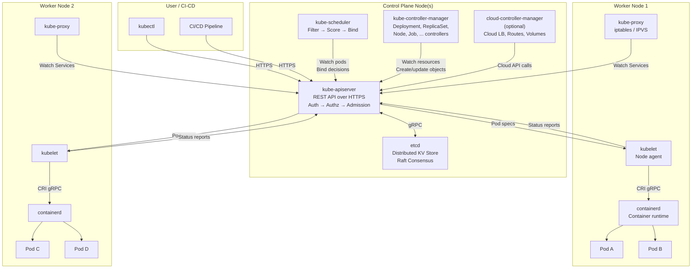
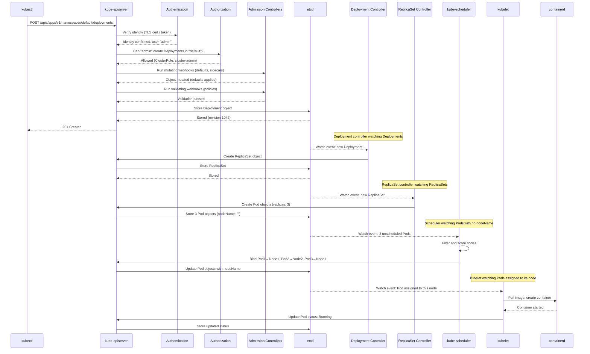

# File 02: Architecture Deep Dive

**Topic:** Control plane (kube-apiserver, etcd, scheduler, controller-manager), worker nodes (kubelet, kube-proxy, CRI), communication flows
**WHY THIS MATTERS:** You cannot debug what you do not understand. When a pod is stuck in `Pending`, you need to know that the scheduler could not find a suitable node. When a service is unreachable, you need to know that kube-proxy manages iptables rules. Every operational problem maps back to a specific component, and knowing the architecture turns mysterious failures into logical puzzles.

---

## Story: The Panchayat System

Picture a large Indian village governed by the **Panchayat system**. At the center sits the **Sarpanch** (village head) — every request, complaint, and decision passes through them. They do not do the work themselves; they receive petitions, validate them, and route them to the right people. This is the **kube-apiserver** — the single front door to the entire cluster.

Next to the Sarpanch sits the **Village Record Keeper** (Patwari) who maintains the official land records, birth registers, and tax ledgers in a locked steel trunk. If the trunk is destroyed, the village loses its identity. This is **etcd** — the only stateful component, the source of truth. The Sarpanch never decides anything without first consulting the record keeper, and every decision is written back into the records.

The **Task Allocator** (Sachiv/Secretary) looks at incoming work requests and decides which worker is best suited. "This family needs a house — assign the task to the carpenter in Ward 3 who has capacity." This is the **kube-scheduler**. It does not build the house; it only decides *where* it should be built based on available resources, constraints, and affinity rules.

Then there are the **Inspectors** (various Adhyaksh) who patrol the village. The Building Inspector ensures houses are built to code. The Health Inspector checks that wells are clean. If they find something out of compliance, they report it and trigger corrective action. These are the **controller-managers** — the Deployment controller, ReplicaSet controller, Node controller, and dozens more, each watching one aspect of the cluster and taking action when reality drifts from the desired state.

Out in the wards, each locality has a **Ward Member** (Panch) who receives instructions from the Sarpanch, manages the local workers, and reports status back. This is the **kubelet** — one per node, responsible for actually running containers and reporting their health. The Ward Member does not decide what to run; they are told by the central authority and they execute faithfully.

---

## Example Block 1 — The Control Plane

### Section 1 — kube-apiserver: The Front Door
**WHY:** Every interaction with Kubernetes — whether from kubectl, the dashboard, or internal components — goes through the API server. Understanding it is understanding the nervous system.

The API server is a **RESTful API** over HTTPS. It does four critical things:

1. **Authentication** — Who are you? (certificates, tokens, OIDC)
2. **Authorization** — Are you allowed to do this? (RBAC, ABAC)
3. **Admission Control** — Should we allow this even if you are authorized? (quotas, policies, mutations)
4. **Persistence** — Store the validated object in etcd

```yaml
# The API server itself runs as a static pod on control plane nodes
# Located at: /etc/kubernetes/manifests/kube-apiserver.yaml
apiVersion: v1
kind: Pod
metadata:
  name: kube-apiserver
  namespace: kube-system
spec:
  containers:
  - name: kube-apiserver
    image: registry.k8s.io/kube-apiserver:v1.30.0
    command:
    - kube-apiserver
    - --advertise-address=10.0.0.1
    - --etcd-servers=https://127.0.0.1:2379
    - --service-cluster-ip-range=10.96.0.0/12
    - --authorization-mode=Node,RBAC
    - --enable-admission-plugins=NodeRestriction,ResourceQuota,LimitRanger
    - --tls-cert-file=/etc/kubernetes/pki/apiserver.crt
    - --tls-private-key-file=/etc/kubernetes/pki/apiserver.key
```

Key characteristics:
- **Stateless** — all state lives in etcd; you can run multiple API server replicas
- **The only component that talks to etcd** — everything else talks to the API server
- **Watch mechanism** — components can "watch" for changes via long-lived HTTP connections (efficient event-driven architecture)

```bash
# Query the API server directly (without kubectl)
curl -k https://localhost:6443/api/v1/namespaces/default/pods \
  --header "Authorization: Bearer $(cat /var/run/secrets/kubernetes.io/serviceaccount/token)"
# SYNTAX:  curl [OPTIONS] <url>
# FLAGS:
#   -k                    skip TLS verification
#   --header <header>     set HTTP header
# EXPECTED OUTPUT:
# {
#   "kind": "PodList",
#   "apiVersion": "v1",
#   "items": [
#     { "metadata": { "name": "nginx-abc123", ... }, ... }
#   ]
# }
```

### Section 2 — etcd: The Source of Truth
**WHY:** etcd is the only place where cluster state is persisted. If etcd is lost and there is no backup, the cluster is gone. Period.

etcd is a **distributed key-value store** that uses the **Raft consensus algorithm** for consistency. We will deep-dive into etcd in File 03, but here are the essentials:

- **Stores all cluster state** — pods, services, secrets, config maps, everything
- **Strongly consistent** — reads always return the latest committed write
- **Versioned** — every key has a revision number; K8s uses this for optimistic concurrency (resource version)
- **Watch support** — clients can subscribe to key changes (this is how controllers learn about state changes)

Data is stored in a hierarchy:

```
/registry/pods/default/nginx-abc123
/registry/services/specs/default/my-service
/registry/deployments/default/my-app
/registry/secrets/default/db-password
/registry/configmaps/kube-system/coredns
```

```bash
# Inspect etcd contents (requires etcdctl and proper certs)
ETCDCTL_API=3 etcdctl get /registry/pods/default/ --prefix --keys-only \
  --cacert=/etc/kubernetes/pki/etcd/ca.crt \
  --cert=/etc/kubernetes/pki/etcd/server.crt \
  --key=/etc/kubernetes/pki/etcd/server.key
# SYNTAX:  etcdctl get <key> [OPTIONS]
# FLAGS:
#   --prefix              get all keys with this prefix
#   --keys-only           only print keys, not values
#   --cacert <file>       CA certificate for TLS
#   --cert <file>         client certificate
#   --key <file>          client key
# EXPECTED OUTPUT:
# /registry/pods/default/nginx-7f456874f4-abcde
# /registry/pods/default/redis-5d8b6c4f7-xyz12
```

### Section 3 — kube-scheduler: The Matchmaker
**WHY:** When a pod is stuck in `Pending`, the scheduler is the first suspect. Understanding how it scores nodes helps you debug scheduling failures.

The scheduler watches for newly created pods that have no node assigned (`.spec.nodeName` is empty). For each unscheduled pod, it:

1. **Filters** — Eliminate nodes that cannot run the pod (not enough CPU, wrong architecture, taints, affinity rules violated)
2. **Scores** — Rank remaining nodes by preference (spread pods evenly, prefer nodes with image already cached, honor soft affinity)
3. **Binds** — Assign the pod to the highest-scoring node by updating the pod object in etcd (via the API server)

```
Unscheduled Pod: needs 500m CPU, 256Mi RAM, label "zone=us-east"

Node 1: 2000m CPU free, 4Gi RAM, zone=us-east     → Score: 85
Node 2: 200m CPU free, 1Gi RAM, zone=us-east       → FILTERED (not enough CPU)
Node 3: 1500m CPU free, 8Gi RAM, zone=us-west      → FILTERED (wrong zone)
Node 4: 1800m CPU free, 2Gi RAM, zone=us-east      → Score: 90

Winner: Node 4 (highest score)
```

### Section 4 — kube-controller-manager: The Reconciliation Engine
**WHY:** Controllers are the muscle of the declarative model. Without them, desired state would just be a wish written in etcd.

The controller manager runs dozens of controllers as goroutines in a single process. Each controller watches specific resource types and takes action:

| Controller | Watches | Reconciles |
|-----------|---------|------------|
| **Deployment** | Deployments | Creates/updates ReplicaSets |
| **ReplicaSet** | ReplicaSets | Creates/deletes Pods to match `replicas` count |
| **Node** | Nodes | Marks unreachable nodes, evicts pods |
| **Service** | Services + Pods | Updates Endpoints objects |
| **Job** | Jobs | Creates Pods, tracks completions |
| **Namespace** | Namespaces | Cleans up resources when namespace is deleted |
| **ServiceAccount** | Namespaces | Creates default ServiceAccount per namespace |
| **Garbage Collector** | Owner references | Deletes orphaned resources |

The **reconciliation loop** pattern every controller follows:

```
LOOP forever:
    desired_state = read spec from API server
    actual_state  = observe reality (query API server / nodes)
    IF desired_state != actual_state:
        take_action(desired_state, actual_state)
    SLEEP(sync_period)
```

---

## Example Block 2 — The Worker Nodes

### Section 1 — kubelet: The Node Agent
**WHY:** The kubelet is the only component that actually runs containers. If kubelet is down on a node, nothing runs on that node.

The kubelet runs on every worker node (and often on control plane nodes too). Its responsibilities:

1. **Register the node** with the API server
2. **Watch for pod assignments** (pods scheduled to its node)
3. **Pull container images** via the Container Runtime Interface (CRI)
4. **Start and monitor containers** — restart them if they crash, run health checks
5. **Report status** back to the API server (node conditions, pod statuses)
6. **Manage volumes** — mount ConfigMaps, Secrets, PersistentVolumes into containers

```bash
# Check kubelet status on a node
systemctl status kubelet
# SYNTAX:  systemctl status <service>
# EXPECTED OUTPUT:
# ● kubelet.service - kubelet: The Kubernetes Node Agent
#    Loaded: loaded (/etc/systemd/system/kubelet.service; enabled)
#    Active: active (running) since Mon 2024-01-15 10:30:00 UTC
#    Main PID: 1234 (kubelet)
#    Memory: 150.2M
#    CGroup: /system.slice/kubelet.service
#            └─1234 /usr/bin/kubelet --config=/var/lib/kubelet/config.yaml

# View kubelet logs
journalctl -u kubelet -f --no-pager | tail -20
# SYNTAX:  journalctl -u <service> [OPTIONS]
# FLAGS:
#   -u <service>          show logs for specific service
#   -f                    follow (tail) the log
#   --no-pager            do not pipe through a pager
# EXPECTED OUTPUT:
# Jan 15 10:30:05 node1 kubelet[1234]: I0115 10:30:05 ... SyncLoop (PLEG): event for pod "nginx-abc"
# Jan 15 10:30:06 node1 kubelet[1234]: I0115 10:30:06 ... Container runtime status check succeeded
```

The kubelet does NOT run as a container — it runs as a **systemd service** directly on the host. This is because if the container runtime crashes, someone needs to restart it, and that someone is the kubelet.

### Section 2 — kube-proxy: The Network Plumber
**WHY:** Services in Kubernetes are virtual constructs. kube-proxy is what makes them actually route traffic to the right pods.

kube-proxy runs on every node and implements the **Service** abstraction. When you create a Service, kube-proxy programs the node's network rules so that traffic to the Service's virtual IP (ClusterIP) is load-balanced across the backing pods.

Three modes of operation:

| Mode | Mechanism | Performance | Default? |
|------|-----------|------------|----------|
| **iptables** | Linux iptables rules | Good for < 5000 services | Yes (most clusters) |
| **IPVS** | Linux IP Virtual Server | Better for large clusters | No (opt-in) |
| **nftables** | Linux nftables (new) | Next-generation replacement | No (K8s 1.29+) |

```bash
# View iptables rules created by kube-proxy
iptables -t nat -L KUBE-SERVICES -n
# SYNTAX:  iptables -t <table> -L <chain> [OPTIONS]
# FLAGS:
#   -t nat                inspect the NAT table
#   -L <chain>            list rules in specified chain
#   -n                    numeric output (no DNS resolution)
# EXPECTED OUTPUT:
# Chain KUBE-SERVICES (2 references)
# target     prot opt source      destination
# KUBE-SVC-XA  tcp  --  0.0.0.0/0  10.96.0.1    /* default/kubernetes:https */
# KUBE-SVC-YB  tcp  --  0.0.0.0/0  10.96.0.10   /* kube-system/kube-dns:dns */
```

### Section 3 — Container Runtime Interface (CRI)
**WHY:** Kubernetes does not run containers directly. Understanding the CRI layer prevents confusion about Docker vs containerd vs CRI-O.

```
                    kubelet
                       |
                      CRI (gRPC interface)
                       |
            ┌──────────┴──────────┐
            │                     │
        containerd              CRI-O
            │                     │
         runc                   runc
            │                     │
      Linux kernel            Linux kernel
      (cgroups +              (cgroups +
       namespaces)             namespaces)
```

- **CRI** — a gRPC API specification that any container runtime can implement
- **containerd** — the most popular CRI implementation (used by Docker, used standalone by K8s)
- **CRI-O** — a lightweight alternative built specifically for Kubernetes
- **runc** — the low-level OCI runtime that actually creates Linux containers using cgroups and namespaces

**Why Docker was "removed" from Kubernetes:**
Docker does not implement CRI directly. Kubernetes used a shim called `dockershim` to translate CRI calls into Docker API calls, which then called containerd anyway. In K8s 1.24, the shim was removed. This did NOT break existing container images — images built with `docker build` work fine with containerd. The only thing that changed is the runtime socket.

---

## Example Block 3 — Full Architecture Diagram

### Section 1 — The Complete Picture
**WHY:** Seeing all components together and how they communicate is essential for debugging. When you trace a request from `kubectl apply` to a running container, you touch every component.



### Section 2 — The kubectl apply Flow
**WHY:** Tracing a single command through the entire system demonstrates how all components work together.

What happens when you run `kubectl apply -f deployment.yaml`:



Let us count the steps: **a single `kubectl apply` triggers a cascade of 20+ API calls** across 8 components. This is why understanding the architecture matters.

---

## Example Block 4 — Communication Patterns

### Section 1 — Who Talks to Whom
**WHY:** Security and networking problems often stem from broken communication paths between components.

**Rule 1: Everything talks to the API server.** No component talks directly to another.

**Rule 2: The API server is the only component that talks to etcd.**

**Rule 3: Communication is bidirectional but initiated differently:**
- kubelet, scheduler, controllers → **poll the API server** (actually use efficient Watch/List)
- API server → kubelet: **direct connection** for logs, exec, port-forward

| Source | Destination | Protocol | Purpose |
|--------|------------|----------|---------|
| kubectl | API server | HTTPS (REST) | User commands |
| API server | etcd | gRPC (TLS) | State persistence |
| scheduler | API server | HTTPS (Watch) | Watch unscheduled pods |
| controller-manager | API server | HTTPS (Watch) | Watch all resources |
| kubelet | API server | HTTPS (Watch) | Watch pods for this node |
| kubelet | API server | HTTPS (POST) | Report node/pod status |
| API server | kubelet | HTTPS | Logs, exec, port-forward |
| kube-proxy | API server | HTTPS (Watch) | Watch Services/Endpoints |
| kubelet | container runtime | gRPC (CRI) | Container lifecycle |

### Section 2 — The CNI and CSI Interfaces
**WHY:** Networking and storage are pluggable in Kubernetes. Understanding the interface boundaries explains why you need to install a CNI plugin separately.

**Three plugin interfaces:**

| Interface | Full Name | Purpose | Examples |
|-----------|-----------|---------|----------|
| **CRI** | Container Runtime Interface | Run containers | containerd, CRI-O |
| **CNI** | Container Network Interface | Pod networking | Calico, Cilium, Flannel, Weave |
| **CSI** | Container Storage Interface | Persistent storage | AWS EBS, GCE PD, Ceph, NFS |

**CNI (Networking):** Kubernetes does NOT include a built-in network implementation. It defines requirements:
1. Every pod gets its own IP address
2. Pods on any node can communicate with pods on any other node without NAT
3. Agents on a node can communicate with all pods on that node

A CNI plugin (like Calico or Cilium) implements these requirements using overlay networks, BGP routing, or eBPF.

**CSI (Storage):** Kubernetes does NOT know how to provision an AWS EBS volume or a GCE Persistent Disk. CSI drivers handle cloud-specific storage operations while K8s provides the abstract PersistentVolume/PersistentVolumeClaim API.

### Section 3 — Declarative vs Imperative: The Philosophical Divide
**WHY:** This distinction is not academic — it determines how you operate clusters, how GitOps works, and why `kubectl apply` behaves differently from `kubectl create`.

```bash
# IMPERATIVE: Step-by-step commands
kubectl create deployment nginx --image=nginx:1.25
# SYNTAX:  kubectl create deployment <name> --image=<image>
# FLAGS:
#   --image <image>       container image to use
#   --replicas <n>        number of replicas (default: 1)
#   --port <port>         container port to expose
# EXPECTED OUTPUT:
# deployment.apps/nginx created

kubectl scale deployment nginx --replicas=3
# SYNTAX:  kubectl scale <resource>/<name> --replicas=<n>
# EXPECTED OUTPUT:
# deployment.apps/nginx scaled

kubectl set image deployment/nginx nginx=nginx:1.26
# SYNTAX:  kubectl set image <resource>/<name> <container>=<image>
# EXPECTED OUTPUT:
# deployment.apps/nginx image updated
```

```bash
# DECLARATIVE: Describe desired state, apply it
kubectl apply -f deployment.yaml
# SYNTAX:  kubectl apply -f <file|url|directory> [OPTIONS]
# FLAGS:
#   -f <file>             file, directory, or URL to apply
#   -R                    process directories recursively
#   --dry-run=client      preview without submitting
#   --dry-run=server      server-side validation without persisting
#   --record              record the command in the annotation (deprecated)
# EXPECTED OUTPUT:
# deployment.apps/nginx configured

# Declarative is IDEMPOTENT — running it again changes nothing
kubectl apply -f deployment.yaml
# EXPECTED OUTPUT:
# deployment.apps/nginx unchanged
```

**Why declarative wins:**
- **GitOps** — your YAML files in Git ARE the source of truth
- **Idempotent** — applying the same file twice has no side effects
- **Auditable** — you can diff changes in version control
- **Reproducible** — clone the repo, apply, get the same cluster

---

## Example Block 5 — Exploring the Architecture with kubectl

### Section 1 — Component Status Commands
**WHY:** These commands are your first diagnostic tools when something feels wrong in the cluster.

```bash
# View cluster info
kubectl cluster-info
# SYNTAX:  kubectl cluster-info [OPTIONS]
# FLAGS:
#   --context <name>      specify which cluster context to use
# EXPECTED OUTPUT:
# Kubernetes control plane is running at https://127.0.0.1:6443
# CoreDNS is running at https://127.0.0.1:6443/api/v1/namespaces/kube-system/services/kube-dns:dns/proxy

# View all nodes
kubectl get nodes -o wide
# SYNTAX:  kubectl get nodes [OPTIONS]
# FLAGS:
#   -o wide               show extra columns (IP, OS, kernel, runtime)
#   --show-labels         show all labels
# EXPECTED OUTPUT:
# NAME           STATUS   ROLES           AGE   VERSION   INTERNAL-IP   EXTERNAL-IP   OS-IMAGE             KERNEL-VERSION   CONTAINER-RUNTIME
# control-plane  Ready    control-plane   10d   v1.30.0   10.0.0.1      <none>        Ubuntu 22.04.3 LTS   5.15.0-91        containerd://1.7.11
# worker-1       Ready    <none>          10d   v1.30.0   10.0.0.2      <none>        Ubuntu 22.04.3 LTS   5.15.0-91        containerd://1.7.11
# worker-2       Ready    <none>          10d   v1.30.0   10.0.0.3      <none>        Ubuntu 22.04.3 LTS   5.15.0-91        containerd://1.7.11

# View control plane pods
kubectl get pods -n kube-system
# SYNTAX:  kubectl get pods [OPTIONS]
# FLAGS:
#   -n <namespace>        specify namespace
#   -o wide               show node assignment and IP
#   -l <label>=<value>    filter by label
# EXPECTED OUTPUT:
# NAME                                       READY   STATUS    RESTARTS   AGE
# coredns-5dd5756b68-abcde                   1/1     Running   0          10d
# coredns-5dd5756b68-fghij                   1/1     Running   0          10d
# etcd-control-plane                         1/1     Running   0          10d
# kube-apiserver-control-plane               1/1     Running   0          10d
# kube-controller-manager-control-plane      1/1     Running   0          10d
# kube-proxy-klmno                           1/1     Running   0          10d
# kube-proxy-pqrst                           1/1     Running   0          10d
# kube-proxy-uvwxy                           1/1     Running   0          10d
# kube-scheduler-control-plane               1/1     Running   0          10d

# Describe a node to see capacity, conditions, and allocations
kubectl describe node worker-1
# SYNTAX:  kubectl describe <resource> <name> [OPTIONS]
# FLAGS:
#   -n <namespace>        specify namespace (for namespaced resources)
# EXPECTED OUTPUT (key sections):
# Conditions:
#   Type             Status
#   MemoryPressure   False
#   DiskPressure     False
#   PIDPressure      False
#   Ready            True
# Capacity:
#   cpu:                4
#   memory:             8145100Ki
#   pods:               110
# Allocatable:
#   cpu:                4
#   memory:             8042700Ki
#   pods:               110
# Allocated resources:
#   (Total limits may be over 100 percent, i.e., overcommitted.)
#   Resource           Requests    Limits
#   cpu                750m (18%)  0 (0%)
#   memory             140Mi (1%)  340Mi (4%)
```

### Section 2 — Viewing API Resources
**WHY:** Knowing what API resources exist in your cluster tells you what the cluster can do.

```bash
# List all API resources
kubectl api-resources
# SYNTAX:  kubectl api-resources [OPTIONS]
# FLAGS:
#   --namespaced=true     only show namespaced resources
#   --namespaced=false    only show cluster-scoped resources
#   --verbs=list          only show resources that support specific verbs
#   -o wide               show additional columns (verbs, group)
# EXPECTED OUTPUT (truncated):
# NAME                  SHORTNAMES   APIVERSION                     NAMESPACED   KIND
# pods                  po           v1                             true         Pod
# services              svc          v1                             true         Service
# deployments           deploy       apps/v1                        true         Deployment
# replicasets           rs           apps/v1                        true         ReplicaSet
# configmaps            cm           v1                             true         ConfigMap
# secrets                            v1                             true         Secret
# nodes                 no           v1                             false        Node
# namespaces            ns           v1                             false        Namespace
# persistentvolumes     pv           v1                             false        PersistentVolume

# List API versions available
kubectl api-versions
# EXPECTED OUTPUT (truncated):
# apps/v1
# autoscaling/v1
# autoscaling/v2
# batch/v1
# networking.k8s.io/v1
# rbac.authorization.k8s.io/v1
# storage.k8s.io/v1
# v1
```

---

## Key Takeaways

1. **API server** is the single entry point — every component and every user interacts with the cluster exclusively through it.
2. **etcd** is the only stateful component and the only component the API server talks to for persistence; lose etcd without backups and you lose the cluster.
3. **Scheduler** does not run containers — it makes placement decisions by filtering and scoring nodes, then binding pods to the winner.
4. **Controller manager** runs dozens of reconciliation loops, each watching specific resources and taking corrective action when desired state diverges from actual state.
5. **kubelet** is the node-level agent that actually runs containers via the CRI; it runs as a systemd service, not a container, because it must survive container runtime failures.
6. **kube-proxy** implements Services by programming iptables/IPVS rules on each node, translating virtual ClusterIPs into real pod IPs.
7. **CRI, CNI, CSI** are the three plugin interfaces that make Kubernetes extensible — container runtime, networking, and storage are all pluggable.
8. **Declarative over imperative** is the Kubernetes philosophy: describe what you want in YAML, apply it, and let controllers reconcile.
9. **A single kubectl apply** triggers a cascade across 8+ components: API server validates and stores, controllers create child resources, scheduler places pods, and kubelet starts containers.
10. **All communication flows through the API server** — no component talks directly to another, which simplifies security (one endpoint to secure) and enables the Watch mechanism for efficient event-driven updates.
