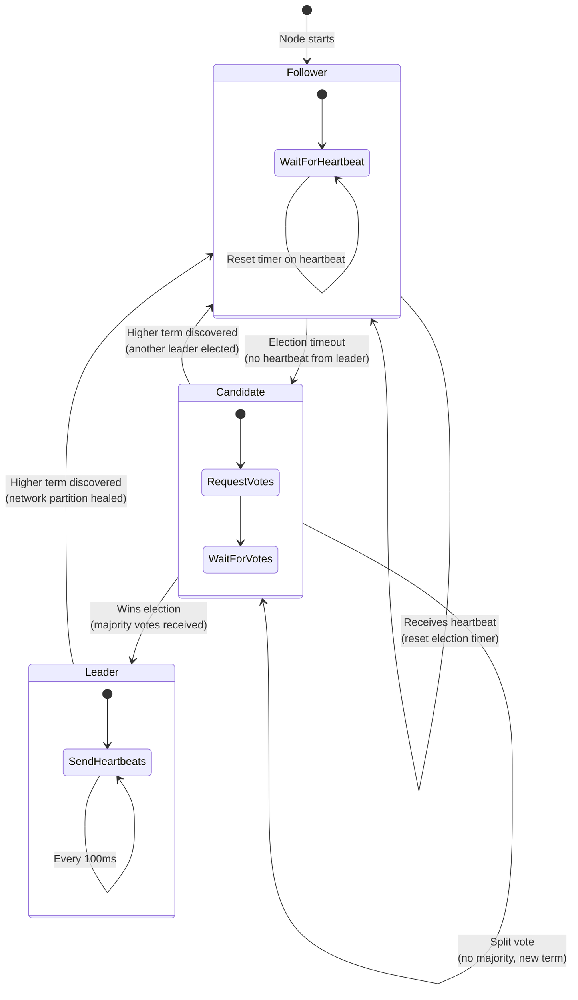
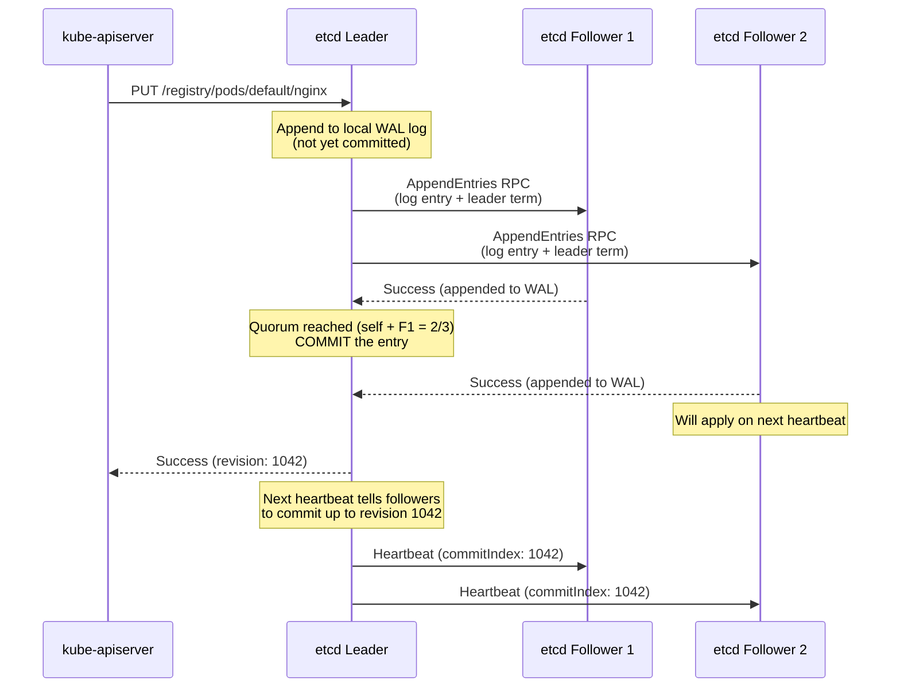

# File 03: etcd — The Brain of Kubernetes

**Topic:** etcd internals (Raft consensus, WAL, snapshots), cluster topology, backup/restore, performance tuning
**WHY THIS MATTERS:** etcd is the single source of truth for your entire Kubernetes cluster. Every pod, every service, every secret, every configuration — all stored in etcd. If etcd is corrupted or lost without backup, your cluster's identity is erased. Understanding how etcd works internally — especially Raft consensus — gives you the confidence to operate, back up, and troubleshoot the most critical component in your infrastructure.

---

## Story: The Land Registry Office

In every Indian district, there is a **Land Registry Office** (Sub-Registrar Office) that maintains the official records of who owns which piece of land. This office is sacred — if its records are destroyed, chaos follows. Families lose proof of ownership, boundary disputes erupt, and generations of heritage vanish. This is **etcd** in your Kubernetes cluster.

Now imagine the government decides that a single registry office is too risky. What if a fire destroys it? So they create **three identical offices** in different towns of the district. Every time a land transaction happens — a sale, an inheritance, a mutation — the transaction must be **recorded in at least two out of three offices** before it is considered official. One clerk is designated the **Head Clerk** (Leader), and all transactions go through them first. The Head Clerk writes the entry, sends copies to the other two offices, and once at least one confirms receipt, the transaction is committed. This is the **Raft consensus algorithm**.

What if the Head Clerk falls sick? The remaining two clerks hold an **election** — they vote, and one of them becomes the new Head Clerk. They continue processing transactions without interruption because they have all the records up to the point the old Head Clerk was last active. But here is the critical rule: **you need a majority (quorum) to function.** Three offices means you need at least two. If two offices burn down simultaneously, the remaining one **cannot process new transactions** — it does not have a majority and cannot be sure its records are the latest. This is why etcd clusters always have an **odd number of members** (3, 5, or 7) and why losing a majority is fatal.

---

## Example Block 1 — etcd Fundamentals

### Section 1 — What etcd Stores
**WHY:** Knowing what lives in etcd helps you understand why it is critical and what a backup actually captures.

etcd is a **distributed, strongly consistent key-value store**. For Kubernetes, it stores:

| Category | Example Keys | What It Holds |
|----------|-------------|---------------|
| **Workloads** | `/registry/pods/default/nginx-abc` | Pod specs and status |
| **Controllers** | `/registry/deployments/default/my-app` | Deployment configurations |
| **Networking** | `/registry/services/specs/default/my-svc` | Service definitions |
| **Configuration** | `/registry/configmaps/default/app-config` | ConfigMap data |
| **Secrets** | `/registry/secrets/default/db-password` | Encrypted secret data |
| **RBAC** | `/registry/roles/kube-system/admin` | Role definitions |
| **Cluster** | `/registry/minions/worker-1` | Node registrations |
| **Leases** | `/registry/leases/kube-system/kube-scheduler` | Leader election leases |

**Key properties:**

- **Strongly consistent** — a read always returns the result of the latest committed write (linearizable reads)
- **Versioned** — every key modification increments a global revision counter; Kubernetes uses this as `resourceVersion` for optimistic concurrency control
- **Watch-capable** — clients can subscribe to changes on a key or key prefix (this is how K8s controllers get notified of changes efficiently)
- **Size-limited** — default max database size is **2 GB** (configurable up to 8 GB); this constrains how many objects your cluster can hold

```bash
# Check etcd cluster health
etcdctl endpoint health \
  --cacert=/etc/kubernetes/pki/etcd/ca.crt \
  --cert=/etc/kubernetes/pki/etcd/server.crt \
  --key=/etc/kubernetes/pki/etcd/server.key
# SYNTAX:  etcdctl endpoint health [OPTIONS]
# FLAGS:
#   --cacert <file>       CA certificate
#   --cert <file>         client certificate
#   --key <file>          client private key
#   --endpoints <urls>    comma-separated list of endpoints
# EXPECTED OUTPUT:
# https://127.0.0.1:2379 is healthy: successfully committed proposal: took = 2.345ms

# Check etcd cluster member list
etcdctl member list \
  --cacert=/etc/kubernetes/pki/etcd/ca.crt \
  --cert=/etc/kubernetes/pki/etcd/server.crt \
  --key=/etc/kubernetes/pki/etcd/server.key \
  -w table
# SYNTAX:  etcdctl member list [OPTIONS]
# FLAGS:
#   -w table              output format (table, json, simple)
# EXPECTED OUTPUT:
# +------------------+---------+--------+------------------------+------------------------+
# |        ID        | STATUS  |  NAME  |       PEER ADDRS       |      CLIENT ADDRS      |
# +------------------+---------+--------+------------------------+------------------------+
# | 8e9e05c52164694d | started | etcd-0 | https://10.0.0.1:2380  | https://10.0.0.1:2379  |
# | ade526d28b1f92f7 | started | etcd-1 | https://10.0.0.2:2380  | https://10.0.0.2:2379  |
# | d282ac2ce600c1ce | started | etcd-2 | https://10.0.0.3:2380  | https://10.0.0.3:2379  |
# +------------------+---------+--------+------------------------+------------------------+
```

### Section 2 — etcd Data Model
**WHY:** Understanding revisions and the MVCC model explains how Kubernetes implements optimistic concurrency and the Watch mechanism.

etcd uses **Multi-Version Concurrency Control (MVCC)**. Every modification creates a new revision, not an overwrite.

```
Global Revision Timeline:
Rev 1: PUT /registry/pods/default/nginx  → {image: "nginx:1.24"}
Rev 2: PUT /registry/pods/default/redis  → {image: "redis:7"}
Rev 3: PUT /registry/pods/default/nginx  → {image: "nginx:1.25"}  (update)
Rev 4: DELETE /registry/pods/default/redis

Current state at Rev 4:
  /registry/pods/default/nginx  → {image: "nginx:1.25"}  (created at rev 1, modified at rev 3)
  /registry/pods/default/redis  → DELETED (tombstone at rev 4)
```

Kubernetes uses this for:
- **`resourceVersion`** — maps to etcd's revision; used for optimistic locking ("update this only if nobody changed it since revision X")
- **Watch** — "tell me about all changes since revision Y" (efficient streaming instead of polling)
- **List** — "give me all pods at the current revision" (consistent snapshot)

```bash
# View the current revision
etcdctl endpoint status \
  --cacert=/etc/kubernetes/pki/etcd/ca.crt \
  --cert=/etc/kubernetes/pki/etcd/server.crt \
  --key=/etc/kubernetes/pki/etcd/server.key \
  -w table
# SYNTAX:  etcdctl endpoint status [OPTIONS]
# FLAGS:
#   -w table              output format
# EXPECTED OUTPUT:
# +------------------------+------------------+---------+---------+-----------+-----------+------------+
# |        ENDPOINT        |        ID        | VERSION | DB SIZE | IS LEADER | RAFT TERM | RAFT INDEX |
# +------------------------+------------------+---------+---------+-----------+-----------+------------+
# | https://127.0.0.1:2379 | 8e9e05c52164694d |  3.5.12 |  4.3 MB |      true |         5 |     218340 |
# +------------------------+------------------+---------+---------+-----------+-----------+------------+
```

---

## Example Block 2 — Raft Consensus Deep Dive

### Section 1 — Why Consensus Matters
**WHY:** Without consensus, distributed nodes can disagree about data, leading to split-brain scenarios where different nodes serve different answers.

The fundamental problem: you have 3 (or 5 or 7) etcd nodes. A client writes a value. How do you ensure all nodes agree on the value, even if one node crashes mid-write? How do you prevent two nodes from independently accepting conflicting writes?

**Raft** solves this by ensuring:
1. **One leader at a time** — only the leader accepts writes
2. **Majority agreement** — a write is committed only when a majority of nodes have it in their log
3. **Ordered log** — all nodes apply writes in the same order

### Section 2 — Leader Election
**WHY:** Leader election is the first thing that happens when an etcd cluster starts, and it is what happens when the leader crashes. Understanding it explains recovery behavior.



**The election process step by step:**

1. All nodes start as **Followers**
2. Each follower has a random **election timeout** (150-300ms)
3. If a follower does not receive a heartbeat from the leader before its timeout expires, it becomes a **Candidate**
4. The candidate increments its **term number** (like an election cycle), votes for itself, and sends `RequestVote` RPCs to all other nodes
5. Other nodes vote for the first candidate they hear from in this term (first-come-first-served)
6. If the candidate gets votes from a **majority** (including itself), it becomes the **Leader**
7. The new leader immediately sends heartbeats to all followers to establish authority and prevent new elections
8. If no candidate gets a majority (split vote), everyone waits for a new random timeout and tries again

**Why random timeouts?** Without randomization, all followers would time out simultaneously, all become candidates, and all vote for themselves — deadlock. Randomization ensures one candidate usually starts slightly before others.

### Section 3 — Log Replication and Commit
**WHY:** This is how writes actually propagate through the cluster. Understanding it explains why etcd can survive node failures without losing data.



**Key observations:**
- The leader does NOT wait for ALL followers — only a **majority (quorum)**
- With 3 nodes, quorum = 2 (leader + 1 follower)
- With 5 nodes, quorum = 3 (leader + 2 followers)
- The write is considered **committed** once quorum is achieved
- Followers that were slow will catch up on the next heartbeat

**Quorum table:**

| Cluster Size | Quorum Needed | Can Tolerate Failures |
|-------------|--------------|----------------------|
| 1 | 1 | 0 (no fault tolerance) |
| 2 | 2 | 0 (WORSE than 1 — needs both!) |
| 3 | 2 | 1 node |
| 5 | 3 | 2 nodes |
| 7 | 4 | 3 nodes |

**Why always odd numbers?** With 4 nodes, quorum is 3 — you can only lose 1 node, same as with 3 nodes, but you have the overhead of an extra node. Odd numbers maximize fault tolerance per node.

---

## Example Block 3 — WAL, Snapshots, and Data Durability

### Section 1 — Write-Ahead Log (WAL)
**WHY:** The WAL is how etcd survives crashes without losing committed data. It is also what you are backing up when you take an etcd snapshot.

Every write in etcd goes through this sequence:

```
1. Client sends write request to leader
2. Leader appends entry to WAL (Write-Ahead Log) on disk
3. Leader sends AppendEntries to followers
4. Followers append to their WAL
5. Once quorum responds, leader commits
6. Leader applies committed entry to in-memory B-tree (boltdb)
7. Leader responds to client
```

The WAL is a sequential, append-only file. It is fast because sequential disk writes are much faster than random writes. If etcd crashes after step 2 but before step 6, it can **replay the WAL** on restart to reconstruct the in-memory state.

```bash
# View WAL directory contents
ls -la /var/lib/etcd/member/wal/
# EXPECTED OUTPUT:
# total 125004
# drwx------ 2 root root      4096 Jan 15 10:30 .
# drwx------ 4 root root      4096 Jan 15 10:30 ..
# -rw------- 1 root root  64000000 Jan 15 12:45 0000000000000000-0000000000000000.wal
# -rw------- 1 root root  64000000 Jan 15 14:22 0000000000000001-0000000000035a8f.wal
```

### Section 2 — Snapshots and Compaction
**WHY:** Without compaction, etcd's database grows forever. Without snapshots, WAL replay on restart takes increasingly long.

**Compaction** removes old revisions that are no longer needed. Kubernetes' API server automatically compacts etcd every 5 minutes by default, keeping only the last N revisions.

**Snapshots** are point-in-time captures of the entire etcd database. They serve two purposes:
1. **Faster restart** — instead of replaying millions of WAL entries, load the snapshot and replay only WAL entries after the snapshot
2. **Backup** — a snapshot file is a complete backup of your cluster state

```bash
# View etcd database size and snapshot info
etcdctl endpoint status \
  --cacert=/etc/kubernetes/pki/etcd/ca.crt \
  --cert=/etc/kubernetes/pki/etcd/server.crt \
  --key=/etc/kubernetes/pki/etcd/server.key \
  -w json | python3 -m json.tool
# EXPECTED OUTPUT:
# [
#     {
#         "Endpoint": "https://127.0.0.1:2379",
#         "Status": {
#             "header": { "cluster_id": 14841639068965178418, "member_id": 10276657743932975437 },
#             "version": "3.5.12",
#             "dbSize": 4521984,            <-- Total DB size on disk
#             "leader": 10276657743932975437,
#             "raftIndex": 218340,
#             "raftTerm": 5,
#             "dbSizeInUse": 3145728        <-- Actual data size (after compaction)
#         }
#     }
# ]
```

The difference between `dbSize` and `dbSizeInUse` represents space that has been compacted but not yet freed. Running `etcdctl defrag` reclaims this space.

```bash
# Defragment etcd (reclaim compacted space)
etcdctl defrag \
  --cacert=/etc/kubernetes/pki/etcd/ca.crt \
  --cert=/etc/kubernetes/pki/etcd/server.crt \
  --key=/etc/kubernetes/pki/etcd/server.key
# SYNTAX:  etcdctl defrag [OPTIONS]
# FLAGS:
#   --endpoints <urls>    defrag specific endpoints
#   --cluster             defrag all members in the cluster
# EXPECTED OUTPUT:
# Finished defragmenting etcd member[https://127.0.0.1:2379]

# NOTE: Defrag is a BLOCKING operation. Run it during low-traffic periods.
# In a multi-node cluster, defrag one node at a time, never all at once.
```

---

## Example Block 4 — Backup and Restore

### Section 1 — Taking Snapshots
**WHY:** This is the most important operational procedure for etcd. A cluster without etcd backups is a disaster waiting to happen.

```bash
# Take an etcd snapshot
ETCDCTL_API=3 etcdctl snapshot save /backup/etcd-snapshot-$(date +%Y%m%d-%H%M%S).db \
  --cacert=/etc/kubernetes/pki/etcd/ca.crt \
  --cert=/etc/kubernetes/pki/etcd/server.crt \
  --key=/etc/kubernetes/pki/etcd/server.key
# SYNTAX:  etcdctl snapshot save <filename> [OPTIONS]
# FLAGS:
#   --cacert <file>       CA certificate
#   --cert <file>         client certificate
#   --key <file>          client private key
#   --endpoints <url>     etcd endpoint (defaults to localhost:2379)
# EXPECTED OUTPUT:
# {"level":"info","ts":"2024-01-15T14:30:00Z","msg":"snapshot file saved","path":"/backup/etcd-snapshot-20240115-143000.db"}
# Snapshot saved at /backup/etcd-snapshot-20240115-143000.db
```

```bash
# Verify a snapshot
ETCDCTL_API=3 etcdctl snapshot status /backup/etcd-snapshot-20240115-143000.db -w table
# SYNTAX:  etcdctl snapshot status <filename> [OPTIONS]
# FLAGS:
#   -w table              output format (table, json)
# EXPECTED OUTPUT:
# +----------+----------+------------+------------+
# |   HASH   | REVISION | TOTAL KEYS | TOTAL SIZE |
# +----------+----------+------------+------------+
# | fe01cf57 |   218340 |       1245 |     4.3 MB |
# +----------+----------+------------+------------+
```

**Backup best practices:**
- Take snapshots **every 30 minutes** in production (or more frequently for critical clusters)
- Store snapshots **off-cluster** — in an S3 bucket, GCS, or a separate backup server
- **Test your restores regularly** — a backup you have never restored is not a backup
- Encrypt snapshots at rest — they contain Secrets (potentially base64-encoded, not encrypted unless you configured encryption at rest)
- Keep at least **7 days of snapshots** with rotation

### Section 2 — Restoring from Snapshot
**WHY:** You will need this when etcd is corrupted, when a cluster needs to be rebuilt, or during disaster recovery drills.

```bash
# Step 1: Stop the API server and etcd (on ALL control plane nodes)
# On each control plane node:
sudo mv /etc/kubernetes/manifests/kube-apiserver.yaml /tmp/
sudo mv /etc/kubernetes/manifests/etcd.yaml /tmp/

# Step 2: Restore the snapshot to a new data directory
ETCDCTL_API=3 etcdctl snapshot restore /backup/etcd-snapshot-20240115-143000.db \
  --data-dir=/var/lib/etcd-restored \
  --name=etcd-0 \
  --initial-cluster=etcd-0=https://10.0.0.1:2380 \
  --initial-advertise-peer-urls=https://10.0.0.1:2380
# SYNTAX:  etcdctl snapshot restore <filename> [OPTIONS]
# FLAGS:
#   --data-dir <path>             new data directory (MUST be different from current)
#   --name <name>                 member name
#   --initial-cluster <members>   cluster member list
#   --initial-advertise-peer-urls <urls>  this member's peer URLs
# EXPECTED OUTPUT:
# {"level":"info","ts":"2024-01-15T15:00:00Z","msg":"restored snapshot","path":"/backup/etcd-snapshot-20240115-143000.db"}

# Step 3: Replace the old data directory
sudo rm -rf /var/lib/etcd
sudo mv /var/lib/etcd-restored /var/lib/etcd
sudo chown -R etcd:etcd /var/lib/etcd   # Fix ownership if needed

# Step 4: Restart etcd and API server
sudo mv /tmp/etcd.yaml /etc/kubernetes/manifests/
sudo mv /tmp/kube-apiserver.yaml /etc/kubernetes/manifests/

# Step 5: Verify the cluster is healthy
kubectl get nodes
# EXPECTED OUTPUT:
# NAME           STATUS   ROLES           AGE   VERSION
# control-plane  Ready    control-plane   10d   v1.30.0
# worker-1       Ready    <none>          10d   v1.30.0
# worker-2       Ready    <none>          10d   v1.30.0
```

**Critical warnings:**
- **NEVER restore to the same `--data-dir`** — always use a new directory and swap
- **All etcd members must be restored** from the same snapshot in a multi-node cluster
- After restore, all watchers are invalidated — controllers reconnect and re-sync automatically
- Pods that were created AFTER the snapshot was taken will be lost — kubelet will report them, and the API server will not recognize them; they will eventually be garbage collected

---

## Example Block 5 — Cluster Topology and Performance

### Section 1 — Topology Patterns
**WHY:** Choosing the right etcd topology affects performance, reliability, and operational complexity.

**Stacked (Co-located) Topology:**
etcd runs on the same machines as the control plane components.

```
Control Plane Node 1          Control Plane Node 2          Control Plane Node 3
┌─────────────────────┐       ┌─────────────────────┐       ┌─────────────────────┐
│  kube-apiserver     │       │  kube-apiserver     │       │  kube-apiserver     │
│  kube-scheduler     │       │  kube-scheduler     │       │  kube-scheduler     │
│  controller-manager │       │  controller-manager │       │  controller-manager │
│  etcd               │       │  etcd               │       │  etcd               │
└─────────────────────┘       └─────────────────────┘       └─────────────────────┘
```

- **Pros:** Fewer machines, simpler setup (kubeadm default)
- **Cons:** Losing a node loses both a control plane member AND an etcd member; resource contention between etcd and API server

**External Topology:**
etcd runs on dedicated machines separate from the control plane.

```
Control Plane Nodes           etcd Nodes
┌──────────────────┐          ┌──────────┐
│ kube-apiserver   │          │  etcd-0  │
│ kube-scheduler   │ ──────→  │          │
│ controller-mgr   │          └──────────┘
└──────────────────┘          ┌──────────┐
┌──────────────────┐          │  etcd-1  │
│ kube-apiserver   │ ──────→  │          │
│ kube-scheduler   │          └──────────┘
│ controller-mgr   │          ┌──────────┐
└──────────────────┘          │  etcd-2  │
                     ──────→  │          │
                              └──────────┘
```

- **Pros:** etcd gets dedicated resources (CPU, RAM, SSD); losing a control plane node does not affect etcd quorum
- **Cons:** More machines, more complex networking and TLS setup

**Recommendation:**
- Small/medium clusters (< 200 nodes): Stacked topology
- Large clusters (200+ nodes) or strict SLA requirements: External topology

### Section 2 — Performance Tuning
**WHY:** etcd performance directly affects cluster responsiveness. A slow etcd means slow API server responses, slow scheduling, and frustrated developers.

**Hardware requirements:**

| Cluster Size | CPU | Memory | Disk | Disk Type |
|-------------|-----|--------|------|-----------|
| Small (< 50 nodes) | 2 cores | 4 GB | 20 GB | SSD |
| Medium (50-200 nodes) | 4 cores | 8 GB | 40 GB | SSD (low latency) |
| Large (200+ nodes) | 8 cores | 16 GB | 100 GB | NVMe SSD |

**Critical performance factors:**

1. **Disk latency** — etcd's WAL requires fast sequential writes. Use SSDs, never HDDs. On cloud, use provisioned IOPS volumes (gp3 with high IOPS on AWS, pd-ssd on GCP).

2. **Network latency** — Raft consensus requires round-trips between leader and followers. Keep etcd members in the same data center (< 2ms RTT). Cross-region etcd is strongly discouraged.

3. **Database size** — Keep under 2 GB. If approaching this limit, investigate whether too many objects exist or whether compaction is not running.

```bash
# Check etcd performance metrics
etcdctl endpoint status \
  --cacert=/etc/kubernetes/pki/etcd/ca.crt \
  --cert=/etc/kubernetes/pki/etcd/server.crt \
  --key=/etc/kubernetes/pki/etcd/server.key \
  -w table
# EXPECTED OUTPUT:
# +------------------------+------------------+---------+---------+-----------+-----------+------------+
# |        ENDPOINT        |        ID        | VERSION | DB SIZE | IS LEADER | RAFT TERM | RAFT INDEX |
# +------------------------+------------------+---------+---------+-----------+-----------+------------+
# | https://127.0.0.1:2379 | 8e9e05c52164694d |  3.5.12 |  4.3 MB |      true |         5 |     218340 |
# +------------------------+------------------+---------+---------+-----------+-----------+------------+

# Check compaction status (ensure old revisions are being cleaned up)
etcdctl compact $(etcdctl endpoint status -w json | python3 -c "import sys,json; print(json.loads(sys.stdin.read())[0]['Status']['header']['revision'])") \
  --cacert=/etc/kubernetes/pki/etcd/ca.crt \
  --cert=/etc/kubernetes/pki/etcd/server.crt \
  --key=/etc/kubernetes/pki/etcd/server.key
# EXPECTED OUTPUT:
# compacted revision 218340
```

### Section 3 — Encryption at Rest
**WHY:** By default, etcd stores Kubernetes Secrets as base64-encoded plaintext. Anyone with access to etcd can read every Secret in your cluster.

```yaml
# EncryptionConfiguration — tells API server to encrypt data before storing in etcd
# Located at: /etc/kubernetes/pki/encryption-config.yaml
apiVersion: apiserver.config.k8s.io/v1
kind: EncryptionConfiguration
resources:
  - resources:
    - secrets          # Encrypt Secrets
    - configmaps       # Optionally encrypt ConfigMaps too
    providers:
    - aescbc:
        keys:
        - name: key1
          secret: <base64-encoded-32-byte-key>   # openssl rand -base64 32
    - identity: {}     # Fallback: unencrypted (for reading old data)
```

```bash
# Generate an encryption key
openssl rand -base64 32
# EXPECTED OUTPUT:
# aGVsbG8gd29ybGQgdGhpcyBpcyBhIDMyIGJ5dGUga2V5IQ==

# Verify encryption is active by reading a secret from etcd directly
ETCDCTL_API=3 etcdctl get /registry/secrets/default/my-secret \
  --cacert=/etc/kubernetes/pki/etcd/ca.crt \
  --cert=/etc/kubernetes/pki/etcd/server.crt \
  --key=/etc/kubernetes/pki/etcd/server.key | hexdump -C | head -5
# WITHOUT encryption: you see readable base64 data
# WITH encryption: you see binary garbage starting with "k8s:enc:aescbc:v1:key1"
```

---

## Example Block 6 — etcd Operations Runbook

### Section 1 — Common Operations
**WHY:** Having a runbook for common etcd operations prevents fumbling during incidents.

```bash
# 1. Check cluster health
etcdctl endpoint health --cluster \
  --cacert=/etc/kubernetes/pki/etcd/ca.crt \
  --cert=/etc/kubernetes/pki/etcd/server.crt \
  --key=/etc/kubernetes/pki/etcd/server.key
# EXPECTED OUTPUT:
# https://10.0.0.1:2379 is healthy: successfully committed proposal: took = 1.234ms
# https://10.0.0.2:2379 is healthy: successfully committed proposal: took = 2.456ms
# https://10.0.0.3:2379 is healthy: successfully committed proposal: took = 1.789ms

# 2. Check which node is the leader
etcdctl endpoint status --cluster \
  --cacert=/etc/kubernetes/pki/etcd/ca.crt \
  --cert=/etc/kubernetes/pki/etcd/server.crt \
  --key=/etc/kubernetes/pki/etcd/server.key \
  -w table
# EXPECTED OUTPUT:
# +------------------------+------------------+---------+---------+-----------+-----------+
# |        ENDPOINT        |        ID        | VERSION | DB SIZE | IS LEADER | RAFT TERM |
# +------------------------+------------------+---------+---------+-----------+-----------+
# | https://10.0.0.1:2379  | 8e9e05c52164694d |  3.5.12 |  4.3 MB |      true |         5 |
# | https://10.0.0.2:2379  | ade526d28b1f92f7 |  3.5.12 |  4.3 MB |     false |         5 |
# | https://10.0.0.3:2379  | d282ac2ce600c1ce |  3.5.12 |  4.3 MB |     false |         5 |
# +------------------------+------------------+---------+---------+-----------+-----------+

# 3. Count keys in etcd (how many objects in your cluster)
etcdctl get / --prefix --keys-only \
  --cacert=/etc/kubernetes/pki/etcd/ca.crt \
  --cert=/etc/kubernetes/pki/etcd/server.crt \
  --key=/etc/kubernetes/pki/etcd/server.key | wc -l
# EXPECTED OUTPUT:
# 1245

# 4. Watch for changes in real time
etcdctl watch /registry/pods/default/ --prefix \
  --cacert=/etc/kubernetes/pki/etcd/ca.crt \
  --cert=/etc/kubernetes/pki/etcd/server.crt \
  --key=/etc/kubernetes/pki/etcd/server.key
# EXPECTED OUTPUT (when a pod changes):
# PUT
# /registry/pods/default/nginx-7f456874f4-abcde
# <binary protobuf data>
```

### Section 2 — Disaster Scenarios
**WHY:** Knowing what can go wrong and how to respond turns panic into procedure.

| Scenario | Impact | Response |
|----------|--------|----------|
| **1 node down (3-node cluster)** | Quorum intact, cluster operational | Investigate and repair/replace the node |
| **2 nodes down (3-node cluster)** | Quorum LOST, cluster READ-ONLY | Restore from snapshot, rebuild cluster |
| **Disk full on leader** | Writes fail, alarms trigger | Free space, defrag, or increase disk |
| **Slow disk (high fsync latency)** | Leader steps down, frequent elections | Move to SSD, reduce competing I/O |
| **Network partition** | Minority side loses quorum | Heal network, minority nodes catch up automatically |
| **Data corruption** | Unpredictable behavior | Restore from latest good snapshot |

```bash
# Check for alarms (etcd sets alarms when things go wrong)
etcdctl alarm list \
  --cacert=/etc/kubernetes/pki/etcd/ca.crt \
  --cert=/etc/kubernetes/pki/etcd/server.crt \
  --key=/etc/kubernetes/pki/etcd/server.key
# EXPECTED OUTPUT (healthy):
# (empty output — no alarms)

# EXPECTED OUTPUT (disk full alarm):
# memberID:10276657743932975437 alarm:NOSPACE

# Disarm after fixing the issue
etcdctl alarm disarm \
  --cacert=/etc/kubernetes/pki/etcd/ca.crt \
  --cert=/etc/kubernetes/pki/etcd/server.crt \
  --key=/etc/kubernetes/pki/etcd/server.key
# EXPECTED OUTPUT:
# memberID:10276657743932975437 alarm:NOSPACE disarmed
```

---

## Key Takeaways

1. **etcd is the single source of truth** for all Kubernetes cluster state — pods, services, secrets, RBAC, everything is stored as key-value pairs under `/registry/`.
2. **Raft consensus** ensures that writes are committed only when a majority of nodes agree, providing strong consistency even when minority nodes fail.
3. **Leader election** uses randomized timeouts to break ties; one leader accepts all writes and replicates them to followers via AppendEntries RPCs.
4. **Quorum** requires a majority: 2/3, 3/5, or 4/7. Losing quorum makes the cluster read-only. Always use odd-numbered cluster sizes.
5. **Write-Ahead Log (WAL)** ensures durability — every write is persisted to disk before being applied to memory, enabling crash recovery via WAL replay.
6. **Snapshots** are your lifeline — take them every 30 minutes, store them off-cluster, and test restores regularly. An untested backup is not a backup.
7. **Compaction and defragmentation** are ongoing maintenance tasks — compaction removes old revisions, defrag reclaims disk space, and both are necessary to keep etcd healthy.
8. **Disk performance is critical** — etcd's WAL requires fast sequential writes. Use SSDs (ideally NVMe) and never run etcd on spinning disks.
9. **Encryption at rest** must be explicitly configured — by default, Secrets in etcd are just base64-encoded, not encrypted. Use `EncryptionConfiguration` to enable AES encryption.
10. **Network latency between etcd members** should be under 2ms. Cross-region etcd clusters are strongly discouraged because Raft round-trips on every write amplify latency.
