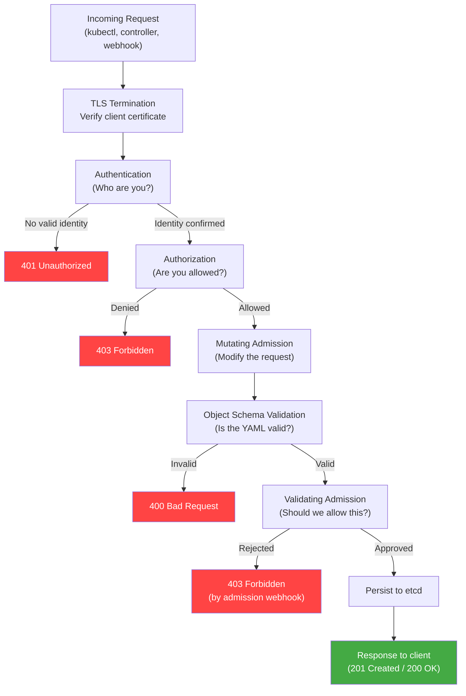
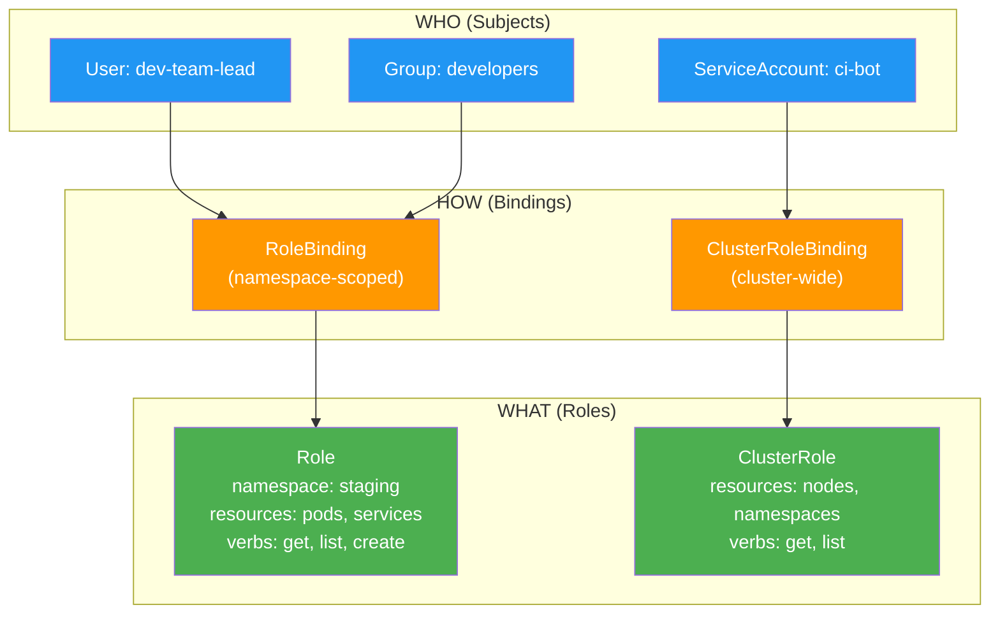
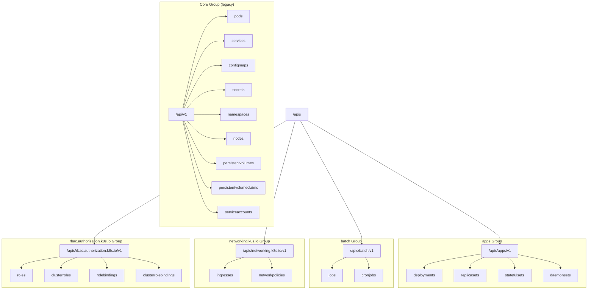

# File 04: API Server and kubectl Deep Dive

**Topic:** API server internals (authentication, authorization, admission controllers), kubectl deep dive (contexts, JSONPath, plugins)
**WHY THIS MATTERS:** The API server is the gateway to your cluster — every request passes through its security pipeline. Understanding authentication, authorization, and admission control is the difference between a secure cluster and an open door. On the client side, kubectl is your daily driver — mastering its advanced features (JSONPath, custom-columns, dry-run, explain) makes you 10x faster at debugging and operating Kubernetes.

---

## Story: The Government Office (Kachehri)

Picture a busy **Kachehri** (district government office) in an Indian city. To get any work done — a land mutation, a caste certificate, a building permit — you must pass through multiple checkpoints.

First, there is the **Security Guard at the Gate** (Authentication). He checks your Aadhaar card or government ID. He does not care what you want to do — he only cares whether you are who you claim to be. No ID, no entry. This is **authentication** in the API server — proving your identity via certificates, tokens, or OIDC.

Once inside, you reach the **Permit Counter** (Authorization/RBAC). The clerk checks whether your ID card gives you permission to access this particular department. A farmer can access the land records section but not the police records room. A government employee has different access than a citizen. This is **RBAC** — Role-Based Access Control. Your identity is verified, but now the system checks whether your role grants you the specific action you are requesting.

Finally, you reach the **Officer's Desk** (Admission Controllers). The officer reviews your actual paperwork. Even if you have the right ID and the right permit, the officer may:
- **Reject** your application if the form is incomplete (Validating Admission)
- **Modify** your application by stamping it with a case number, adding a default processing fee, or attaching a mandatory annexure (Mutating Admission)

Some officers are lenient, some are strict, and some are custom-hired by the district administration for special regulations. These are the built-in and webhook-based **admission controllers** in Kubernetes.

The beauty of this system is that it is **layered** — each checkpoint is independent. The security guard does not care about permits. The permit counter does not read your application. The officer does not check your ID. This separation of concerns makes the system extensible, auditable, and secure.

---

## Example Block 1 — API Server Request Lifecycle

### Section 1 — The Full Pipeline
**WHY:** Every `kubectl` command, every controller reconciliation, every webhook call passes through this exact pipeline. Knowing it helps you debug "forbidden" errors, understand why a pod was mutated, or figure out why a resource was rejected.



The order is critical and immutable:
1. **Authentication** — Who are you?
2. **Authorization** — Can you do this?
3. **Mutating Admission** — Let us modify your request (add defaults, inject sidecars)
4. **Schema Validation** — Is the modified object structurally valid?
5. **Validating Admission** — Final policy check (quotas, constraints)
6. **etcd Persistence** — Store the approved, mutated, validated object

### Section 2 — Authentication Methods
**WHY:** Production clusters use multiple authentication methods simultaneously. Understanding each helps you configure access for humans, CI/CD systems, and service accounts.

| Method | Who Uses It | How It Works | Best For |
|--------|------------|-------------- |----------|
| **X.509 Client Certificates** | Cluster admins, kubeadm | Client presents a TLS cert signed by the cluster CA | Initial cluster setup |
| **Bearer Tokens** | Service accounts | Static token or JWT in Authorization header | Pod-to-API communication |
| **OIDC Tokens** | Human users | JWT from identity provider (Google, Okta, Azure AD) | Enterprise SSO |
| **Webhook Token Auth** | Custom systems | API server calls external webhook to validate token | Custom auth systems |
| **Bootstrap Tokens** | kubeadm join | Short-lived tokens for node bootstrap | Adding nodes to cluster |

```bash
# View your current authentication identity
kubectl auth whoami
# SYNTAX:  kubectl auth whoami
# EXPECTED OUTPUT:
# ATTRIBUTE                                           VALUE
# Username                                            kubernetes-admin
# Groups                                              [system:masters system:authenticated]

# View the current kubeconfig context (which identity kubectl is using)
kubectl config current-context
# SYNTAX:  kubectl config current-context
# EXPECTED OUTPUT:
# kind-multi-node

# View all available contexts
kubectl config get-contexts
# SYNTAX:  kubectl config get-contexts [OPTIONS]
# FLAGS:
#   -o name               output only context names
# EXPECTED OUTPUT:
# CURRENT   NAME              CLUSTER           AUTHINFO          NAMESPACE
# *         kind-multi-node   kind-multi-node   kind-multi-node
#           staging           staging-cluster   staging-admin     default
#           production        prod-cluster      prod-admin        default
```

### Section 3 — Authentication Deep Dive: X.509 Certificates
**WHY:** kubeadm-provisioned clusters use X.509 certificates by default. Understanding the certificate structure explains how identity is encoded.

```bash
# View the API server's client CA certificate
openssl x509 -in /etc/kubernetes/pki/ca.crt -text -noout | head -20
# EXPECTED OUTPUT:
# Certificate:
#     Data:
#         Version: 3 (0x2)
#         Serial Number: 0 (0x0)
#     Signature Algorithm: sha256WithRSAEncryption
#         Issuer: CN = kubernetes
#         Validity
#             Not Before: Jan  1 00:00:00 2024 GMT
#             Not After : Jan  1 00:00:00 2034 GMT
#         Subject: CN = kubernetes

# View a client certificate (user identity is in the Subject)
openssl x509 -in /etc/kubernetes/pki/apiserver-kubelet-client.crt -text -noout | grep "Subject:"
# EXPECTED OUTPUT:
# Subject: O = system:masters, CN = kube-apiserver-kubelet-client
#                ^                     ^
#                |                     |
#                Group                 Username
```

In X.509 authentication:
- **Common Name (CN)** = Username
- **Organization (O)** = Group membership
- A certificate with `O = system:masters` gets full cluster-admin access

---

## Example Block 2 — Authorization with RBAC

### Section 1 — The RBAC Model
**WHY:** RBAC is the standard authorization mode for Kubernetes. Misconfigured RBAC is the #1 cause of "forbidden" errors and also the #1 security risk when overly permissive.

RBAC has four key objects:

```
Role              → defines WHAT actions on WHICH resources (namespace-scoped)
ClusterRole       → same, but cluster-wide
RoleBinding       → connects a Role to WHO (users, groups, service accounts) — namespace-scoped
ClusterRoleBinding → connects a ClusterRole to WHO — cluster-wide
```



### Section 2 — RBAC Examples
**WHY:** Concrete YAML examples are worth more than abstract descriptions. These are production-ready patterns you can copy and modify.

```yaml
# Role: Allow read-only access to pods in the "staging" namespace
apiVersion: rbac.authorization.k8s.io/v1
kind: Role
metadata:
  name: pod-reader
  namespace: staging
rules:
- apiGroups: [""]           # "" = core API group (pods, services, etc.)
  resources: ["pods"]
  verbs: ["get", "list", "watch"]
- apiGroups: [""]
  resources: ["pods/log"]   # Sub-resource: pod logs
  verbs: ["get"]
```

```yaml
# RoleBinding: Bind the pod-reader Role to the "dev-team" group
apiVersion: rbac.authorization.k8s.io/v1
kind: RoleBinding
metadata:
  name: dev-team-pod-reader
  namespace: staging
subjects:
- kind: Group
  name: dev-team           # Matches the group from authentication
  apiGroup: rbac.authorization.k8s.io
roleRef:
  kind: Role
  name: pod-reader         # The Role defined above
  apiGroup: rbac.authorization.k8s.io
```

```yaml
# ClusterRole: Allow full control over deployments cluster-wide
apiVersion: rbac.authorization.k8s.io/v1
kind: ClusterRole
metadata:
  name: deployment-admin
rules:
- apiGroups: ["apps"]
  resources: ["deployments", "replicasets"]
  verbs: ["get", "list", "watch", "create", "update", "patch", "delete"]
- apiGroups: ["apps"]
  resources: ["deployments/scale"]
  verbs: ["update", "patch"]
```

```bash
# Check if you can perform an action (RBAC debugging)
kubectl auth can-i create pods --namespace staging
# SYNTAX:  kubectl auth can-i <verb> <resource> [OPTIONS]
# FLAGS:
#   --namespace <ns>      check in specific namespace
#   --as <user>           impersonate a user
#   --as-group <group>    impersonate a group
#   -A                    check in all namespaces
# EXPECTED OUTPUT:
# yes

# Check what another user can do
kubectl auth can-i create pods --namespace staging --as dev-user
# EXPECTED OUTPUT:
# no

# List all permissions for a user
kubectl auth can-i --list --as dev-user --namespace staging
# EXPECTED OUTPUT:
# Resources                                  Non-Resource URLs   Resource Names   Verbs
# pods                                       []                  []               [get list watch]
# pods/log                                   []                  []               [get]
# selfsubjectaccessreviews.authorization.k8s.io  []              []               [create]
# selfsubjectrulesreviews.authorization.k8s.io   []              []               [create]
```

---

## Example Block 3 — Admission Controllers

### Section 1 — Built-in Admission Controllers
**WHY:** Admission controllers are the last line of defense and the primary mechanism for policy enforcement. They can silently modify your objects or reject them entirely.

Admission controllers run AFTER authentication and authorization. They come in two flavors:

| Type | What It Does | When It Runs | Example |
|------|-------------|-------------|---------|
| **Mutating** | Modifies the incoming object | Before validation | Add default resource limits, inject sidecar containers |
| **Validating** | Accepts or rejects the object | After mutation | Enforce naming conventions, check resource quotas |

**Common built-in admission controllers:**

| Controller | Type | What It Does |
|-----------|------|-------------|
| `NamespaceLifecycle` | Validating | Rejects requests in terminating namespaces |
| `LimitRanger` | Mutating | Applies default resource limits from LimitRange |
| `ResourceQuota` | Validating | Enforces namespace-level resource quotas |
| `ServiceAccount` | Mutating | Auto-mounts service account token into pods |
| `DefaultStorageClass` | Mutating | Assigns default storage class to PVCs |
| `NodeRestriction` | Validating | Limits kubelet to modifying only its own node and pods |
| `PodSecurity` | Validating | Enforces Pod Security Standards (restricted, baseline, privileged) |

```yaml
# LimitRange — sets default CPU/memory for pods that don't specify them
apiVersion: v1
kind: LimitRange
metadata:
  name: default-limits
  namespace: staging
spec:
  limits:
  - default:              # Default LIMITS (ceiling)
      cpu: "500m"
      memory: "256Mi"
    defaultRequest:        # Default REQUESTS (floor)
      cpu: "100m"
      memory: "128Mi"
    type: Container
```

```yaml
# ResourceQuota — caps total resources in a namespace
apiVersion: v1
kind: ResourceQuota
metadata:
  name: staging-quota
  namespace: staging
spec:
  hard:
    pods: "20"                    # Max 20 pods
    requests.cpu: "4"             # Max 4 CPU cores requested
    requests.memory: "8Gi"        # Max 8 GiB memory requested
    limits.cpu: "8"               # Max 8 CPU cores limit
    limits.memory: "16Gi"         # Max 16 GiB memory limit
    services.loadbalancers: "2"   # Max 2 LoadBalancer services
```

### Section 2 — Webhook Admission Controllers
**WHY:** Webhooks let you write custom admission logic in any language. This is how tools like Istio inject sidecars and how OPA/Gatekeeper enforces custom policies.

```yaml
# MutatingWebhookConfiguration — inject a sidecar into every pod
apiVersion: admissionregistration.k8s.io/v1
kind: MutatingWebhookConfiguration
metadata:
  name: sidecar-injector
webhooks:
- name: sidecar.example.com
  admissionReviewVersions: ["v1"]
  sideEffects: None
  clientConfig:
    service:
      name: sidecar-injector
      namespace: kube-system
      path: "/inject"
    caBundle: <base64-encoded-CA>
  rules:
  - operations: ["CREATE"]
    apiGroups: [""]
    apiVersions: ["v1"]
    resources: ["pods"]
  namespaceSelector:
    matchLabels:
      inject-sidecar: "true"    # Only for namespaces with this label
  failurePolicy: Fail            # Reject pod if webhook is unavailable
```

**How Istio's sidecar injection works:**
1. You label a namespace: `kubectl label ns default istio-injection=enabled`
2. Istio registers a `MutatingWebhookConfiguration`
3. When you create a pod in that namespace, the API server calls Istio's webhook
4. The webhook returns a JSON patch that adds the Envoy sidecar container to the pod spec
5. The API server applies the patch, and the pod now has two containers

---

## Example Block 4 — API Groups and Resource Hierarchy

### Section 1 — API Group Structure
**WHY:** When you write `apiVersion: apps/v1`, you are specifying an API group. Understanding the group structure helps you navigate the API, use `kubectl explain`, and write correct YAML.



**Why the Core group is special:**
The core group (`v1`) exists for historical reasons — it was created before API groups were introduced. That is why pods use `apiVersion: v1` (no group prefix) while deployments use `apiVersion: apps/v1`.

```bash
# Explore the API — list all groups
kubectl api-versions
# EXPECTED OUTPUT (truncated):
# admissionregistration.k8s.io/v1
# apps/v1
# autoscaling/v1
# autoscaling/v2
# batch/v1
# certificates.k8s.io/v1
# networking.k8s.io/v1
# rbac.authorization.k8s.io/v1
# storage.k8s.io/v1
# v1

# Explore a specific resource's fields
kubectl explain deployment.spec.strategy
# SYNTAX:  kubectl explain <resource.field.path> [OPTIONS]
# FLAGS:
#   --recursive           show all nested fields
#   --api-version <ver>   specify API version
# EXPECTED OUTPUT:
# KIND:     Deployment
# VERSION:  apps/v1
# FIELD:    strategy <DeploymentStrategy>
# DESCRIPTION:
#     The deployment strategy to use to replace existing pods with new ones.
# FIELDS:
#   rollingUpdate <RollingUpdateDeployment>
#     Rolling update config params.
#   type <string>
#     Type of deployment. Can be "Recreate" or "RollingUpdate". Default is
#     RollingUpdate.
```

### Section 2 — API Request URL Structure
**WHY:** When debugging with `curl` or reading audit logs, you see raw API URLs. Understanding the pattern lets you read them instantly.

```
# Namespaced resource:
/apis/<group>/<version>/namespaces/<namespace>/<resource>/<name>

# Examples:
GET /apis/apps/v1/namespaces/default/deployments/nginx
GET /api/v1/namespaces/kube-system/pods/coredns-abc123
PUT /api/v1/namespaces/default/services/my-service

# Cluster-scoped resource:
/apis/<group>/<version>/<resource>/<name>

# Examples:
GET /api/v1/nodes/worker-1
GET /apis/rbac.authorization.k8s.io/v1/clusterroles/cluster-admin

# Sub-resources:
GET  /api/v1/namespaces/default/pods/nginx/log       # Pod logs
POST /api/v1/namespaces/default/pods/nginx/exec      # Pod exec
GET  /apis/apps/v1/namespaces/default/deployments/nginx/scale  # Deployment scale
```

```bash
# Access the API directly via kubectl proxy
kubectl proxy --port=8080 &
# SYNTAX:  kubectl proxy [OPTIONS]
# FLAGS:
#   --port <port>         local port to listen on (default: 8001)
#   --accept-hosts <regex>  regex for accepted hostnames
# EXPECTED OUTPUT:
# Starting to serve on 127.0.0.1:8080

# Now query the API without certificates
curl http://localhost:8080/api/v1/namespaces/default/pods | python3 -m json.tool | head -20
# EXPECTED OUTPUT:
# {
#     "kind": "PodList",
#     "apiVersion": "v1",
#     "metadata": {
#         "resourceVersion": "218340"
#     },
#     "items": [
#         {
#             "metadata": {
#                 "name": "nginx-7f456874f4-abcde",
#                 ...
#             }
#         }
#     ]
# }
```

---

## Example Block 5 — kubectl Power User Techniques

### Section 1 — JSONPath and Custom Columns
**WHY:** Default `kubectl get` output often lacks the exact information you need. JSONPath and custom columns let you extract precisely what you want without piping through jq.

```bash
# Get pod names only
kubectl get pods -o jsonpath='{.items[*].metadata.name}'
# SYNTAX:  kubectl get <resource> -o jsonpath='{<expression>}'
# EXPECTED OUTPUT:
# nginx-7f456874f4-abcde redis-5d8b6c4f7-xyz12

# Get pod names and their node assignments (newline-separated)
kubectl get pods -o jsonpath='{range .items[*]}{.metadata.name}{"\t"}{.spec.nodeName}{"\n"}{end}'
# EXPECTED OUTPUT:
# nginx-7f456874f4-abcde	worker-1
# redis-5d8b6c4f7-xyz12	worker-2

# Get container images used by all pods
kubectl get pods -o jsonpath='{range .items[*]}{.metadata.name}{"\t"}{.spec.containers[*].image}{"\n"}{end}'
# EXPECTED OUTPUT:
# nginx-7f456874f4-abcde	nginx:1.25
# redis-5d8b6c4f7-xyz12	redis:7.2

# Custom columns for a clean table format
kubectl get pods -o custom-columns=\
'NAME:.metadata.name,STATUS:.status.phase,NODE:.spec.nodeName,IP:.status.podIP,RESTARTS:.status.containerStatuses[0].restartCount'
# SYNTAX:  kubectl get <resource> -o custom-columns=<header>:<jsonpath>,...
# EXPECTED OUTPUT:
# NAME                     STATUS    NODE       IP           RESTARTS
# nginx-7f456874f4-abcde   Running   worker-1   10.244.1.5   0
# redis-5d8b6c4f7-xyz12    Running   worker-2   10.244.2.3   2

# Get all node IPs
kubectl get nodes -o jsonpath='{range .items[*]}{.metadata.name}{"\t"}{.status.addresses[?(@.type=="InternalIP")].address}{"\n"}{end}'
# EXPECTED OUTPUT:
# control-plane	10.0.0.1
# worker-1	10.0.0.2
# worker-2	10.0.0.3

# Get pods sorted by restart count (most restarts first)
kubectl get pods --sort-by='.status.containerStatuses[0].restartCount'
# SYNTAX:  kubectl get <resource> --sort-by=<jsonpath>
# EXPECTED OUTPUT:
# NAME                     READY   STATUS    RESTARTS   AGE
# nginx-7f456874f4-abcde   1/1     Running   0          5m
# redis-5d8b6c4f7-xyz12    1/1     Running   2          10m
```

### Section 2 — kubectl explain: Your Built-in Documentation
**WHY:** `kubectl explain` is faster than googling YAML fields. It reads directly from the cluster's API schema, so it is always accurate for your version.

```bash
# Top-level fields of a Deployment
kubectl explain deployment
# EXPECTED OUTPUT:
# KIND:     Deployment
# VERSION:  apps/v1
# DESCRIPTION:
#     Deployment enables declarative updates for Pods and ReplicaSets.
# FIELDS:
#   apiVersion   <string>
#   kind         <string>
#   metadata     <ObjectMeta>
#   spec         <DeploymentSpec>
#   status       <DeploymentStatus>

# Drill into nested fields
kubectl explain deployment.spec.template.spec.containers.resources
# EXPECTED OUTPUT:
# KIND:     Deployment
# VERSION:  apps/v1
# FIELD:    resources <ResourceRequirements>
# DESCRIPTION:
#     Compute Resources required by this container.
# FIELDS:
#   claims       <[]ResourceClaim>
#   limits       <map[string]Quantity>
#   requests     <map[string]Quantity>

# Show ALL fields recursively (great for discovering what's available)
kubectl explain pod.spec --recursive | head -40
# EXPECTED OUTPUT:
# KIND:     Pod
# VERSION:  v1
# FIELD:    spec <PodSpec>
# FIELDS:
#   activeDeadlineSeconds        <integer>
#   affinity                     <Affinity>
#     nodeAffinity               <NodeAffinity>
#       preferredDuringSchedulingIgnoredDuringExecution  <[]PreferredSchedulingTerm>
#         preference             <NodeSelectorTerm>
#         weight                 <integer>
#       requiredDuringSchedulingIgnoredDuringExecution   <NodeSelector>
#   ...
```

### Section 3 — Dry Run and Diff
**WHY:** Dry-run and diff let you preview changes before applying them, preventing "oops" moments in production.

```bash
# Client-side dry run — validates YAML syntax without contacting the server
kubectl apply -f deployment.yaml --dry-run=client
# SYNTAX:  kubectl apply -f <file> --dry-run=client
# EXPECTED OUTPUT:
# deployment.apps/nginx configured (dry run)

# Server-side dry run — validates against the REAL cluster (RBAC, admission, schema)
kubectl apply -f deployment.yaml --dry-run=server
# SYNTAX:  kubectl apply -f <file> --dry-run=server
# EXPECTED OUTPUT:
# deployment.apps/nginx configured (server dry run)
# NOTE: This contacts the API server but does NOT persist to etcd

# Diff — see what would change if you apply
kubectl diff -f deployment.yaml
# SYNTAX:  kubectl diff -f <file|url|directory>
# EXPECTED OUTPUT:
# diff -u -N /tmp/LIVE-abc123 /tmp/MERGED-xyz789
# --- /tmp/LIVE-abc123
# +++ /tmp/MERGED-xyz789
# @@ -15,7 +15,7 @@
#        containers:
#        - name: nginx
# -        image: nginx:1.25
# +        image: nginx:1.26
#          ports:
#          - containerPort: 80

# Generate YAML from imperative commands (useful for creating templates)
kubectl create deployment nginx --image=nginx:1.25 --replicas=3 --dry-run=client -o yaml
# SYNTAX:  kubectl create <resource> <name> --dry-run=client -o yaml
# EXPECTED OUTPUT:
# apiVersion: apps/v1
# kind: Deployment
# metadata:
#   creationTimestamp: null
#   labels:
#     app: nginx
#   name: nginx
# spec:
#   replicas: 3
#   selector:
#     matchLabels:
#       app: nginx
#   template:
#     metadata:
#       labels:
#         app: nginx
#     spec:
#       containers:
#       - image: nginx:1.25
#         name: nginx
```

### Section 4 — Context and Configuration Management
**WHY:** Real-world engineers switch between dev, staging, and production clusters daily. Mastering kubeconfig prevents accidentally deleting production pods when you think you are on staging.

```bash
# View full kubeconfig
kubectl config view
# SYNTAX:  kubectl config view [OPTIONS]
# FLAGS:
#   --minify              only show current context
#   --raw                 show raw certificate data
# EXPECTED OUTPUT:
# apiVersion: v1
# kind: Config
# clusters:
# - cluster:
#     certificate-authority-data: DATA+OMITTED
#     server: https://127.0.0.1:6443
#   name: kind-multi-node
# contexts:
# - context:
#     cluster: kind-multi-node
#     user: kind-multi-node
#   name: kind-multi-node
# current-context: kind-multi-node
# users:
# - name: kind-multi-node
#   user:
#     client-certificate-data: DATA+OMITTED
#     client-key-data: DATA+OMITTED

# Switch between contexts
kubectl config use-context production
# SYNTAX:  kubectl config use-context <context-name>
# EXPECTED OUTPUT:
# Switched to context "production".

# Set a default namespace for a context
kubectl config set-context --current --namespace=staging
# SYNTAX:  kubectl config set-context <context-name> --namespace=<ns>
# EXPECTED OUTPUT:
# Context "kind-multi-node" modified.

# Create a new context pointing to a different namespace
kubectl config set-context staging-admin \
  --cluster=kind-multi-node \
  --user=kind-multi-node \
  --namespace=staging
# EXPECTED OUTPUT:
# Context "staging-admin" created.
```

### Section 5 — Useful kubectl Shortcuts
**WHY:** Small efficiencies compound. These shortcuts save minutes per day that add up to hours per month.

```bash
# Use short names for resources
kubectl get po          # pods
kubectl get svc         # services
kubectl get deploy      # deployments
kubectl get rs          # replicasets
kubectl get ns          # namespaces
kubectl get no          # nodes
kubectl get cm          # configmaps
kubectl get pv          # persistentvolumes
kubectl get pvc         # persistentvolumeclaims
kubectl get sa          # serviceaccounts
kubectl get ing         # ingresses
kubectl get ds          # daemonsets
kubectl get sts         # statefulsets
kubectl get ep          # endpoints
kubectl get hpa         # horizontalpodautoscalers

# Get resources across ALL namespaces
kubectl get pods -A
# SYNTAX:  kubectl get <resource> -A
# FLAGS:
#   -A                    short for --all-namespaces
# EXPECTED OUTPUT:
# NAMESPACE     NAME                                       READY   STATUS    RESTARTS   AGE
# default       nginx-7f456874f4-abcde                     1/1     Running   0          5m
# kube-system   coredns-5dd5756b68-fghij                   1/1     Running   0          10d
# kube-system   etcd-control-plane                         1/1     Running   0          10d

# Watch resources in real time
kubectl get pods -w
# SYNTAX:  kubectl get <resource> -w
# FLAGS:
#   -w                    watch for changes (streaming updates)
# EXPECTED OUTPUT:
# NAME                     READY   STATUS    RESTARTS   AGE
# nginx-7f456874f4-abcde   1/1     Running   0          5m
# nginx-7f456874f4-abcde   1/1     Terminating   0      6m   <-- live update
# nginx-8b123456a7-newpd   0/1     Pending       0      0s   <-- live update
# nginx-8b123456a7-newpd   1/1     Running       0      3s   <-- live update

# Delete resources with label selector
kubectl delete pods -l app=nginx
# SYNTAX:  kubectl delete <resource> -l <label>=<value>
# EXPECTED OUTPUT:
# pod "nginx-7f456874f4-abcde" deleted

# Get events sorted by time (debugging goldmine)
kubectl get events --sort-by='.lastTimestamp' -A
# SYNTAX:  kubectl get events [OPTIONS]
# FLAGS:
#   --sort-by <jsonpath>  sort by field
#   --field-selector <f>  filter events (e.g., type=Warning)
# EXPECTED OUTPUT:
# NAMESPACE   LAST SEEN   TYPE      REASON              OBJECT                          MESSAGE
# default     2m          Normal    Scheduled           pod/nginx-abc123                Successfully assigned default/nginx-abc to worker-1
# default     2m          Normal    Pulling             pod/nginx-abc123                Pulling image "nginx:1.25"
# default     1m          Normal    Pulled              pod/nginx-abc123                Successfully pulled image
# default     1m          Normal    Created             pod/nginx-abc123                Created container nginx
# default     1m          Normal    Started             pod/nginx-abc123                Started container nginx
```

---

## Key Takeaways

1. **API server request pipeline** follows an immutable order: Authentication, Authorization, Mutating Admission, Schema Validation, Validating Admission, etcd Persistence — knowing this order helps you pinpoint where failures occur.
2. **Authentication** proves identity using certificates, tokens, or OIDC; the API server can use multiple methods simultaneously and accepts the first one that succeeds.
3. **RBAC** is the standard authorization model with four objects: Role, ClusterRole, RoleBinding, ClusterRoleBinding — always follow least-privilege principles.
4. **Admission controllers** are the last line of defense; mutating webhooks modify objects (sidecar injection, defaults), validating webhooks reject policy violations (quotas, naming).
5. **API groups** organize resources logically — core group (`v1`) for pods/services, `apps/v1` for deployments, `batch/v1` for jobs — and map directly to REST URL paths.
6. **kubectl explain** is your built-in documentation — it reads from the live API schema and is always accurate for your cluster version. Use `--recursive` for discovery.
7. **JSONPath and custom-columns** let you extract precisely the information you need without piping through external tools like jq.
8. **Dry-run modes** come in two flavors: `--dry-run=client` for offline YAML validation, `--dry-run=server` for full server-side validation without persistence.
9. **kubectl diff** shows you exactly what would change before you apply, preventing accidental modifications in production.
10. **kubeconfig contexts** let you switch between clusters and namespaces — always verify your context before running destructive commands with `kubectl config current-context`.
